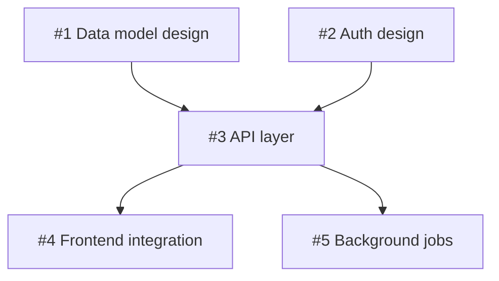

# Fabrik User Guide

Fabrik is an automated Claude Code SDLC driver powered by GitHub Issues and Projects.
This guide covers everything you need to set up, configure, and use Fabrik effectively.

For a quick overview see the [README](../README.md).
For details on the internal stage lifecycle, see [Stage Lifecycle](stage-lifecycle.md).
For the authoritative engine state-machine spec (label semantics, review gate transitions, marker handling), see [State Machine](state-machine.md).

---

## Table of Contents

1. [Getting Started](#1-getting-started)
2. [Configuration Reference](#2-configuration-reference)
3. [Workflow Patterns](#3-workflow-patterns)
4. [Stage Reference](#4-stage-reference)
5. [Plugin & Skills](#5-plugin--skills)
6. [Labels Reference](#6-labels-reference)
7. [Permissions](#7-permissions)
8. [TUI Dashboard](#8-tui-dashboard)
9. [Observability](#9-observability)
10. [Webhook Mode](#10-webhook-mode)
11. [Troubleshooting](#11-troubleshooting)

---

## 1. Getting Started

### Prerequisites

- Go 1.26.1+
- [Claude Code CLI](https://docs.anthropic.com/en/docs/claude-code) installed and authenticated
- GitHub **classic** personal access token (`ghp_...`) with `repo`, `project`, and `workflow` scopes
  - Fine-grained tokens (`github_pat_...`) are **not supported** — GitHub Projects v2 GraphQL requires a classic PAT
  - Create one at: https://github.com/settings/tokens (select "Tokens (classic)")
  - If a fine-grained token is detected at startup, Fabrik prints a `[warn]` message and subsequent API calls include an actionable hint; see [GitHub API Returns 401 or Fine-Grained Token Warning](#github-api-returns-401-or-fine-grained-token-warning)
- A GitHub Project (v2) with board columns matching your stage names


### Initial Setup

**Option A: Install binary (requires `gh`)**

```bash
# Requires: gh auth login (with access to handarbeit/fabrik)
cd ~/bin  # or any directory on your PATH
gh release download --repo handarbeit/fabrik \
  --pattern "fabrik_*_$(uname -s | tr A-Z a-z)_$(uname -m | sed 's/x86_64/amd64/' | sed 's/aarch64/arm64/').tar.gz" \
  -O - | tar xz
# Platform-specific alternatives:
#   darwin/arm64:  --pattern "fabrik_*_darwin_arm64.tar.gz"
#   darwin/amd64:  --pattern "fabrik_*_darwin_amd64.tar.gz"
#   linux/amd64:   --pattern "fabrik_*_linux_amd64.tar.gz"
#   linux/arm64:   --pattern "fabrik_*_linux_arm64.tar.gz"
```

**Option B: Build from source (requires Go)**

```bash
# Build
go build -o fabrik .
```

Then initialize:

```bash
# Initialize stage configs, plugin, and config template
./fabrik init
# Creates:
#   .fabrik/stages/       — stage YAML configs
#   .fabrik/plugin/       — Claude Code plugin
#   .fabrik/config.yaml   — project config template (edit this)
# Updates:
#   .git/info/exclude     — adds .fabrik/repos/, .fabrik/worktrees/, .fabrik/debug/,
#                           and .fabrik/history.json so they don't appear as untracked
#                           in git status (local excludes, not committed to the repo)
```

Pass your GitHub Project URL to auto-populate `owner`, `project`, and `owner_type` in
`config.yaml`. The `--user` flag enables fully non-interactive setup:

```bash
./fabrik init --user you https://github.com/orgs/your-org/projects/5
# or for a personal project:
./fabrik init --user you https://github.com/users/you/projects/3
```

Without a URL, `fabrik init` behaves as before: if your terminal is interactive it
prompts for owner, repo, project number, and username; otherwise it writes a
fully-commented template for you to fill in.

To refresh plugin skills without touching stages or config (e.g., after upgrading Fabrik):

```bash
./fabrik upgrade
```

> **Note:** Plain `fabrik upgrade` errors when local customizations are detected (i.e.,
> you have edited files under `.fabrik/plugin/`). Use `--force` to overwrite them
> unconditionally, or `--reconcile` to get a guided merge prompt. See
> [Upgrade protection for customized skills](#upgrade-protection-for-customized-skills)
> for details.

Edit `.fabrik/config.yaml` with your project settings and commit it to git. Add your
GitHub token to a gitignored `.env` file:

```
# .env (gitignored — keep secrets here)
# Use a CLASSIC personal access token (ghp_...) — not a fine-grained token (github_pat_...)
# Required scopes: repo, project, workflow
# Create at: https://github.com/settings/tokens (select "Tokens (classic)")
FABRIK_TOKEN=ghp_...
```

> **Note:** When a `.git/` directory is present, Fabrik refuses to start if `.env` exists but is not listed in `.gitignore` (prevents accidental token leaks). In directories **without** `.git/` — containers, CI workspaces, or bare directories — this check is skipped and `.env` is loaded normally without requiring a `.gitignore` entry.

### Create a Project Board

Create a GitHub Project (v2) for your repository. Add board columns that correspond to
your stage names -- the column name must match the `name` field in each stage YAML file
exactly (case-sensitive). The default pipeline uses:

`Backlog` -> `Specify` -> `Research` -> `Plan` -> `Implement` -> `Review` -> `Validate` -> `Done`

### Compatibility Notes

> **Warning:** Global Claude Code plugins can interfere with Fabrik's headless sessions. Do not install global plugins on machines running Fabrik as a service. The `superpowers` plugin is a known offender — if installed globally, it injects unexpected behaviour into Fabrik's Claude sessions and causes duplicate comments on issues.
>
> To check for the problematic plugin:
> ```bash
> ls ~/.claude/plugins/cache/claude-plugins-official/
> ```
> If `superpowers` appears, remove it:
> ```bash
> rm -rf ~/.claude/plugins/cache/claude-plugins-official/superpowers
> ```
> See [§11 Troubleshooting → Duplicate Comments on Issues](#11-troubleshooting) for full details.

### First Run

With settings in `.fabrik/config.yaml`:

```bash
./fabrik
```

Or pass settings as flags:

```bash
./fabrik \
  --owner your-org \
  --repo your-repo \
  --project 1 \
  --user your-github-username
```

Fabrik polls the project board every 30 seconds by default (configurable with `--poll`
or `poll:` in `config.yaml`).

**Idle backoff**: When nothing needs work, Fabrik progressively slows down polling to conserve API rate limit budget. The backoff is time-based — after 5 minutes of idle polls, the interval doubles; after 10 minutes it quadruples; after 20 minutes it caps at 5 minutes. Any activity (items dispatched or deep-fetched) immediately resets the interval to the configured value. Press `w` in the TUI to wake polling instantly if you've just made changes on the board.

| Idle duration | Effective interval | At 30s base |
|---|---|---|
| 0–5 min | 1× (configured) | 30s |
| 5–10 min | 2× | 60s |
| 10–20 min | 4× | 120s |
| 20+ min | max (5 minutes) | 300s |

**Rate-limit backoff**: When Fabrik detects GraphQL API quota pressure, the same interval infrastructure adds a separate rate-limit component that escalates as quota depletes. There is no separate 5-minute ceiling for the rate-limit contributor — it can exceed 5 minutes when the configured base interval is large. The effective poll interval is `max(idle interval, rate-limit interval)`, so whichever is larger governs at any given moment.

| Remaining GraphQL quota | Multiplier | At 30s base | At 60s base |
|---|---|---|---|
| >=10% (incl. sticky zone 20%–50%) | 2× | 60s | 120s |
| >=5% and <10% | 4× | 120s | 240s |
| >=1% and <5% | 6× | 180s | 360s |
| <1% | 10× (cap) | 300s | 600s |

Rate-limit backoff uses two-threshold hysteresis to prevent thrashing: it **activates** when GraphQL remaining quota drops below **20%** of the hourly limit, and **clears only when quota rises above 50%** of the limit. While quota is recovering (20%–50%, sticky zone), the 2× tier applies. Activity detection (items deep-fetched or dispatched) resets idle backoff but does NOT reset rate-limit backoff — the two concerns are independent. When rate-limit backoff is active, Fabrik logs the effective poll interval each cycle so operators can observe the actual cadence.

**Board fetch resilience**: `FetchProjectBoard` automatically retries up to 3 times (with 1s/2s backoff) when GitHub returns an empty response (zero items), which occurs during transient Projects v2 indexer degradation that intermittently returns empty boards for non-empty projects (both returned node count and `totalCount` are zero in degraded responses). The log line:

```
[warn] project board fetch returned N items, totalCount=M (attempt X/3) — retrying in case of indexer hiccup
```

indicates the retry is occurring. It is transient and requires no user action unless it persists across all three attempts (in which case Fabrik accepts the last response and continues, which may appear as a temporarily idle engine).

Move an issue to `Specify` on the board to start processing it.

### Git Repositories and Worktrees

Fabrik always bare-clones each managed repository on first access. Run Fabrik from any directory (no need to be inside a git checkout of a managed repo):

```bash
mkdir ~/my-fabrik-dir && cd ~/my-fabrik-dir
fabrik init
./fabrik --owner myorg --project 5 --user me
# No --repo needed — Fabrik processes all repos on the board
```

Fabrik **always bare-clones** each managed repository on first access:
- Bare clones are stored at `.fabrik/repos/<owner>-<repo>.git`
- Worktrees are created at `.fabrik/worktrees/<owner>-<repo>/issue-N/` on branch `fabrik/issue-N`
- One worktree manager runs per discovered repository, all sharing the same poll loop

**`.fabrik/repos/` is excluded from git tracking by default** (gitignored). Bare clone directories can be very large and should not be committed to your repository. When you run `fabrik init` inside a git repo, these paths are also added to `.git/info/exclude` automatically.

To restrict processing to a single repository, pass `--repo owner/repo`.

The `.fabrik/` directory (config, stages, plugin) always lives in the directory where you run `fabrik`.

### Multi-Repo Support

Fabrik can manage issues across every repository on the board in a single run. To enable multi-repo mode, omit (or comment out) the `repo:` field in `.fabrik/config.yaml` — Fabrik then discovers repositories lazily from the project board and processes issues from all of them. Each repository gets its own bare clone at `.fabrik/repos/<owner>-<repo>.git` and its own set of worktrees, all driven by the same poll loop.

### Git Clone Protocol (HTTPS vs SSH)

By default, Fabrik uses HTTPS to bare-clone managed repos (`https://github.com/<owner>/<repo>.git`). Users who authenticate via SSH keys can switch to SSH clone URLs instead.

#### Using SSH

Pass `--ssh` on the command line or add `git_ssh: true` to `.fabrik/config.yaml`:

```bash
# One-time: use SSH for this run
fabrik --ssh --owner myorg --project 5 --user me

# Persistent: add to .fabrik/config.yaml
git_ssh: true
```

The environment variable `FABRIK_GIT_SSH=true` is also supported (useful in CI).

When SSH mode is active, Fabrik uses `git@github.com:<owner>/<repo>.git` as the clone URL. This requires your SSH key to be registered with GitHub and accessible via `ssh-agent`.

> **Startup behavior with SSH mode:** When `--ssh` / `git_ssh: true` is set, Fabrik suppresses the HTTPS credential helper startup check (described below) — it is not applicable. No equivalent SSH agent availability check runs at startup. If your SSH key is absent or unloaded when a clone or fetch runs, git will fail at that point rather than at startup. To verify your agent before running Fabrik: `ssh -T git@github.com`.

#### HTTPS Credential Helper Warning

When using HTTPS (the default), Fabrik checks at startup whether a git credential helper is configured. If none is found, you'll see an advisory warning:

```
[startup] warn: no git credential helper configured; HTTPS cloning may prompt for credentials.
[startup] warn: configure one (e.g. git-credential-osxkeychain) or use --ssh / git_ssh: true in .fabrik/config.yaml.
```

This warning is non-fatal. If you use a GitHub token in your environment (`FABRIK_TOKEN` or `GITHUB_TOKEN`) and your git is configured to use it (e.g., via a credential helper or token-in-URL), cloning will work without further configuration.

To resolve the warning, either:
- Configure a credential helper: `git config --global credential.helper osxkeychain` (macOS), or `git config --global credential.helper store`
- Or switch to SSH mode with `--ssh` / `git_ssh: true`

#### Existing Bare Clones

**Switching between HTTPS and SSH does not re-clone existing bare repos.** Once Fabrik has cloned a repo, it reuses the existing bare clone with its original remote URL. The SSH/HTTPS setting only affects new clones.

If you switch to SSH mode after existing bare clones were created, those clones will continue to fetch via HTTPS. To switch an existing bare clone to SSH, update its remote URL directly:

```bash
git -C .fabrik/repos/owner-repo.git remote set-url origin git@github.com:owner/repo.git
```

#### URL Rewriting

If you have `url.<base>.insteadOf` configured in your global `~/.gitconfig` (a common way to redirect HTTPS to SSH globally), Fabrik will notice at startup and print an informational message. Git applies URL rewriting transparently, so Fabrik's HTTPS clone URLs will automatically use your SSH configuration — no additional Fabrik setting is needed.

### Auto-upgrade

The `--auto-upgrade` flag enables Fabrik to upgrade itself automatically. It checks for a newer version in two places:

- **At startup** — once before the first poll, so boards that are always busy still receive upgrades promptly. The check fires after the exclusive file lock is acquired, so concurrent Fabrik instances never race on the upgrade check.
- **After 2 consecutive idle polls** — as a belt-and-suspenders check for long-running instances.

For release builds, Fabrik queries the GitHub Releases API at each check point. If a newer version is found, it downloads the new binary, replaces the running executable, runs `fabrik upgrade` to refresh plugin skills, and re-execs itself.

**Dev builds (built from source)** follow the same two-check approach but use a
different upgrade path. Fabrik detects that it is a dev build (version string starts
with `dev`) and checks whether it is running from a `handarbeit/fabrik` source
checkout. If so, it compares the running binary's embedded commit SHA against the
local `HEAD`:

- **Local commits ahead of the binary**: rebuild immediately from the current working
  tree (`go build -o fabrik .`) without pulling — useful when you have local changes
  you've already compiled once.
- **Remote `origin/main` ahead of HEAD**: run `git pull --ff-only` to update, then
  rebuild.

After rebuilding, Fabrik runs `fabrik upgrade` (non-interactive, silent — see below)
and re-execs the new binary. This keeps dev builds current with the same hands-off
experience as release binaries.

> **Plugin-skills upgrade: automatic vs. standalone behavior**: The plugin-skills check
> runs in two contexts with different behavior.
>
> **Automatic check** (during `--auto-upgrade` re-exec or dev-build restart): TTY-sensitive.
> With no TTY, skills are refreshed silently when no local customizations are detected;
> when customizations are present, the refresh is skipped and a warning is printed to stderr.
> With a TTY, you are prompted once to confirm before any refresh is applied; when
> customizations are present, `--force`/`--reconcile` options are shown instead of a prompt.
>
> **Standalone `fabrik upgrade` subcommand**: Not TTY-sensitive — the command never prompts
> interactively. When no local customizations are detected, skills are refreshed
> unconditionally. When customizations are detected, the command exits with an error
> directing you to `--force` (destructive overwrite) or `--reconcile` (guided merge
> prompt). See [Upgrade protection for customized skills](#upgrade-protection-for-customized-skills)
> for details.
>
> In both contexts, when customizations are present and the refresh is skipped, the
> `[u] custom workflow` badge appears on next TUI startup.

```bash
./fabrik --auto-upgrade --owner your-org --repo your-repo --project 1 --user you
```

> **Upgrading from v0.0.28 or earlier?** Before v0.0.29, `--auto-upgrade` fetched
> from the private `handarbeit/fabrik` repo. The v0.0.29 release switched the
> upgrade source to the public `handarbeit/fabrik` repo — but this change cannot
> self-apply: a binary built before v0.0.29 will never auto-receive it. If you are
> running an older binary, upgrade once manually:
> ```bash
> gh release download --repo handarbeit/fabrik \
>   --pattern "fabrik_*_$(uname -s | tr A-Z a-z)_$(uname -m | sed 's/x86_64/amd64/' | sed 's/aarch64/arm64/').tar.gz" \
>   -O - | tar xz
> ```
> After that, `--auto-upgrade` will keep you current automatically.

### Startup Board Validation

On startup, Fabrik attempts to fetch the project board and status field so it can compare stage names in your YAML configs against the column names on the board. When that metadata is fetched successfully, any non-cleanup stage missing from the board causes Fabrik to exit with a detailed error listing the mismatched names — catching config drift before any work begins. Extra board columns without a matching stage produce a warning but do not block startup. If Fabrik cannot fetch the board or status field, it logs a warning and continues without blocking startup.

See [§11 Troubleshooting → Startup Board Validation Failure](#startup-board-validation-failure) if validation succeeds and reports a mismatch.

**Board-drift warning scan:** In addition to name-matching, Fabrik scans all board items on startup and checks for cards that carry a cleanup-stage complete label (e.g. `stage:Done:complete`) but whose current board column does not yet reflect the completed stage. For each such item, Fabrik emits a warning log line:

```
[#N startup] warning: item #N has label stage:Done:complete but board column is "Validate" — board drift detected
```

This scan is **informational only** — no auto-advance occurs. Move the card to the correct column manually on the GitHub Project board.

### Stage YAML Drift Warning

After loading your stage YAMLs from `.fabrik/stages/`, Fabrik compares each stage against the embedded default with the same `name:` field. If the embedded default contains top-level YAML keys that your file does not, Fabrik prints a warning to stderr at startup — but only when adding that key would actually change the stage's behavior. A missing key whose embedded-default value is behaviorally identical to omitting it (e.g. `kill_grace: {sigint: 10s, sigterm: 10s}`, which matches the engine's own inherit-on-omission default) is **not** reported.

```
[startup] warning: .fabrik/stages/validate.yaml is missing fields present in v0.0.53 defaults: wait_for_ci, wait_for_reviews. Run `fabrik refresh-stages --apply` to add the missing keys.
```

This warning is **informational only** — the engine continues running with your existing config. The missing keys are behavioral options added in a newer binary that your stage file predates.

**What to do:**

1. Run `fabrik refresh-stages` to preview missing keys as a unified diff (no file changes).
2. Run `fabrik refresh-stages --apply` to add the missing keys to your stage YAMLs (additive only — never removes or overwrites existing values).
3. Run `git diff` to review the changes.
4. `git commit` to record the update.

`fabrik refresh-stages` uses the same value-aware comparison as the startup warning, so it never offers to add a key that drift detection considers a no-op.

**Common keys that trigger this warning:**

- `wait_for_ci: true` — enables the CI gate on Validate auto-advance (added in v0.0.49)
- `wait_for_reviews: true` — enables the reviewer gate on Validate auto-advance (added in v0.0.49)

**Keys that do NOT trigger this warning at their default value** (safe to omit; the engine treats an absent key identically to the value shown):

- `kill_grace: {sigint: 10s, sigterm: 10s}` — signal escalation grace windows; the engine's own fallback is 10s/10s, so an absent `kill_grace` block behaves identically. A *different* value (e.g. `sigint: 0s`, which skips the SIGINT step) is a real behavioral change and still triggers the warning if missing.
- `completion: {type: claude}` — the engine defaults `completion.type` to `claude` when the key is absent, so this block is a no-op at its default value.

Custom stages (names not present in any embedded default) are silently skipped — no warning is produced for them.

### Instance Lock

> **Note:** When Fabrik starts, it creates a PID lock file at `.fabrik/fabrik.lock`. If a second instance attempts to start in the same directory, it reads the lock file, logs an error identifying the running process, and exits immediately. The lock is automatically released when the process exits — including on crash or SIGKILL — so there is no need to manually delete the file after an unclean shutdown.
>
> See [§11 Troubleshooting → Multiple Fabrik Instances](#11-troubleshooting) if you encounter a stale lock or need to run multiple instances against different projects.

### Worktree Janitor

Fabrik's normal worktree cleanup runs only when the Done stage (`cleanup_worktree: true`) is dispatched for an issue. Several situations strand worktrees outside that path:

- Issues removed from the project board (manually archived, deleted, or cleared by the auto-archive pass) are no longer iterated by the poll loop.
- A narrow restart window between Validate completing and Done being dispatched.
- Stage YAML drift — if the Done stage is renamed or removed, its worktrees are never cleaned up.

The **worktree janitor** scans `.fabrik/worktrees/<owner>-<repo>/issue-N/` directories and reaps orphaned worktrees automatically. It runs:

1. **Once at startup**, after the first successful poll (so board state is hydrated).
2. **Hourly** thereafter (configurable; 0 disables).

A worktree is only reaped when **all four** conditions hold: the issue is closed; the issue is not on the board at an active stage (or it's at a cleanup stage that already completed); the worktree is clean (no uncommitted changes); and no worker is currently dispatched for the issue. This conservative gate prevents false positives.

At the end of each scan Fabrik logs:

```
[janitor] cycle complete: scanned N worktrees, reaped K, skipped M (reasons: ...)
```

**Configuration:**

```yaml
# .fabrik/config.yaml
janitor_interval_hours: 1   # default — set to 0 to disable the janitor entirely
```

Also controllable via `--janitor-interval` flag or `FABRIK_JANITOR_INTERVAL` environment variable.

> **Note (EC-6):** Changing `janitor_interval_hours` at runtime has no effect. Restart Fabrik for a new cadence to take effect.

### Log Retention

`.fabrik/logs/` grows unbounded by default — each Claude invocation writes uniquely-named log files that are never overwritten. On a busy instance running for weeks, this can reach hundreds of megabytes or more.

The **log retention janitor** prunes `.fabrik/logs/` by age and total size. It runs on the **same cadence as the worktree janitor** (disabled when `janitor_interval_hours: 0`):

1. **Once at startup**, after the first successful poll.
2. **Hourly** thereafter (same `janitor_interval_hours` cadence).

Pruning runs in three phases per cycle:

1. **Age prune**: delete any file whose mtime is older than `log_retention_days` × 24 h (default **14 days**). `0` disables age-based pruning.
2. **Size-cap backstop**: after age-pruning, if the total size of `.fabrik/logs/` still exceeds `log_max_bytes`, delete the oldest files (by mtime) until the tree is under the cap. Default **2 GiB**. `0` disables the size cap.
3. **Empty-dir cleanup**: remove any now-empty `issue-N/` and `<owner>-<repo>/` directories.

The janitor only ever touches `.fabrik/logs/`. It never modifies `sessions/`, `worktrees/`, `repos/`, or `debug/`.

At the end of each scan Fabrik logs:

```
[log-janitor] cycle complete: scanned N files, removed M (P bytes), age=K size=J
```

**Configuration:**

```yaml
# .fabrik/config.yaml
log_retention_days: 14      # default — set to 0 to disable age-based pruning
log_max_bytes: 2147483648   # default (2 GiB) — set to 0 to disable size-cap pruning
```

Also controllable via `--log-retention-days` / `--log-max-bytes` flags or `FABRIK_LOG_RETENTION_DAYS` / `FABRIK_LOG_MAX_BYTES` environment variables.

> **Note:** Because the prune runs on every tick (not only at startup), the size-cap backstop only has to absorb at most one tick-interval of log growth. An instance producing more than `log_max_bytes` within a single `janitor_interval_hours` window can transiently exceed the cap until the next tick — the hourly default makes this a non-issue in practice.

---

## 2. Configuration Reference

### Settings Overview

Fabrik resolves settings in this order (highest to lowest priority):

```
CLI flag  >  shell env var  >  .env file  >  .fabrik/config.yaml  >  built-in default
```

Use `.fabrik/config.yaml` for non-secret project settings (commit it to git).
Use `.env` for secrets only (`FABRIK_TOKEN` / `GITHUB_TOKEN`).

### `.fabrik/config.yaml`

Generated by `fabrik init`. Commit this file — it carries project settings with the repo.

```yaml
# .fabrik/config.yaml
owner: your-org
# repo: your-repo  # omit for multi-repo mode (processes all repos on the board)
project: 1
user: your-github-username

# Optional settings (defaults shown):

# Path to stage YAML configs directory.
# stages: ./.fabrik/stages

# Polling interval in seconds. Lower values are more responsive; higher values
# reduce GitHub API usage. Tradeoff: 10s is very responsive but consumes ~360 REST
# requests/hour; 30s (default) is a good balance.
# poll: 30

# Maximum number of parallel Claude sessions. Tune based on your API tier capacity.
# Each active session counts against your Anthropic API concurrency limit.
# max_concurrent: 5

# Maximum stage failures before pausing an issue. When exceeded, fabrik:paused and
# stage:<name>:failed labels are applied. Set to 0 for unlimited retries.
# max_retries: 3

# Auto-advance issues through stages without human card moves on the board.
# When true, completed issues advance to the next stage automatically.
# Per-stage auto_advance: in stage YAML can override this setting per-stage.
# yolo: false

# Check handarbeit/fabrik GitHub Releases for a newer version. Fabrik checks once
# at startup (before the first poll) and again after 2 consecutive idle polls.
# On finding a newer release, it downloads the binary, runs fabrik upgrade, and
# re-execs. Requires internet access to the GitHub Releases API.
# auto_upgrade: false

# Disable the interactive TUI dashboard (enabled by default when a real terminal is detected).
# tui: false

# Save raw Claude output to .fabrik/debug/ for diagnosing unexpected behavior
# or prompt issues. Files are named by issue number and stage.
# debug_output: false

# When true, creates a relative symlink at <worktree>/.env pointing to the
# fabrikDir .env file whenever a worktree is set up. Lets stage code read
# credentials (e.g. ANTHROPIC_API_KEY) without copying secrets. No-op when
# the source .env is absent; never overwrites an existing .env in the worktree;
# also excluded from git stash via the worktree's git exclude file.
# symlink_env: false

# Project version shown in the TUI footer. Auto-inferred from package.json,
# go.mod (returns module path, not semver), Cargo.toml, or pyproject.toml.
# Set explicitly to override auto-inference (e.g., version: "1.2.0").
# version: ""

# When true, enables the Layer 2 cross-repo ref audit: Fabrik snapshots git refs
# of all registered bare repos before and after each Claude invocation; if any ref
# in a repo other than the active issue's own repo changes, the stage is failed and
# paused for inspection. Off by default; the snapshot filters to refs/heads/* and
# refs/tags/* only to avoid false positives from routine fetches.
# worktree_boundary_audit: false

# Worktree janitor scan interval in hours (default 1). The janitor runs once after
# startup and then on this cadence, reaping clean worktrees for closed, off-board
# issues. Set to 0 to disable the janitor entirely.
# janitor_interval_hours: 1

# Log retention janitor settings. Runs on the same cadence as janitor_interval_hours.
# Delete log files older than this many days (default 14). Set to 0 to disable
# age-based pruning.
# log_retention_days: 14

# Total size cap for .fabrik/logs/ in bytes (default 2 GiB). After age-pruning,
# oldest files are deleted first until total size is under this cap. Set to 0
# to disable size-cap pruning.
# log_max_bytes: 2147483648

# Fabrik-internal merge train (ADR-059). When "on", yolo Validate completions
# advance into the Queued column for batched landing with a single combined
# Validate instead of merging one PR at a time. Off by default — see the
# "Merge Train" section below before enabling.
# merge_train: off

# Merge-train batch-tuning knobs (only consulted when merge_train: on).
# Maximum Queued items landed in a single batch.
# max_batch_size: 5
# Maximum combined validations per red batch before degrading to landing
# members one-at-a-time. Unset derives 2*ceil(log2(max_batch_size))+1.
# max_bisect_validations: 0
# Maximum main-moved rebase+revalidate cycles before a batch is dissolved
# back to Queued.
# max_train_rebase_cycles: 3
# Runaway guard (ADR-059 §D8): maximum trial-branch creations with zero
# successful lands within the rolling window before pausing all Queued members.
# max_train_trials_per_window: 20
# Runaway guard (ADR-059 §D8): rolling window in minutes over which
# max_train_trials_per_window is measured.
# train_trial_window: 60
```

**Multi-repo mode:** When `repo:` is commented out or omitted, Fabrik processes issues from *all* repositories on the project board. Use this when your project board spans multiple repos (cross-org collaborations, monorepos with independent sub-repos, or a single board managing several distinct services). To restrict Fabrik to one repository, uncomment and set `repo:`.

**Note:** `.fabrik/config.yaml` should NOT be listed in `.gitignore`. Fabrik warns
(non-fatal) if it is.

### `.env` File

Keep only secrets here. When a `.git/` directory is present, Fabrik refuses to start if `.env` exists but is not listed in `.gitignore` (prevents accidental token leaks). In directories without `.git/` (containers, CI, bare directories), this check is skipped and `.env` is loaded normally.

```
# .env (gitignored)
# Classic personal access token (ghp_...) required — see https://github.com/settings/tokens
FABRIK_TOKEN=ghp_...         # Preferred token env var (needs repo, project, workflow scopes)
GITHUB_TOKEN=ghp_...         # Fallback token env var
```

For per-developer identity overrides (when your username differs from config.yaml):

```
FABRIK_USER=my-personal-username
```

### Command-Line Flags

| Flag | Description | Default |
|------|-------------|---------|
| `--owner` | GitHub repo owner (org or user) | required |
| `--repo` | GitHub repo name; omit to enable multi-repo mode (processes all repos on the board) | optional |
| `--project` | GitHub Project (v2) number | required |
| `--user` | Your GitHub username — used as the operator identity for lock labels (`fabrik:locked:<user>`), multi-instance tie-breaking, and engine-generated comment authorship; also @mentioned in awaiting-input notification comments to trigger a GitHub Mobile push when an issue blocks on your input | required |
| `--token` | GitHub API token | `$GITHUB_TOKEN` |
| `--stages` | Directory containing stage YAML configs | `./.fabrik/stages` |
| `--yolo` | Auto-advance issues through stages without human approval; also auto-merges the linked PR when Validate completes | `false` |
| `--auto-upgrade` | At startup and when idle (after 2 idle polls), check GitHub Releases for a newer version and self-upgrade; dev builds (built from source) rebuild from `origin/main` instead | `false` |
| `--notui` | Disable the interactive TUI dashboard | TUI on by default |
| `--plugin-dir` | Path to Fabrik plugin directory (overrides `.fabrik/plugin/`) | auto-detected |
| `--poll` | Poll interval in seconds | `30` |
| `--max-concurrent` | Maximum number of concurrent issue workers | `5` |
| `--max-retries` | Max failed stage attempts before pausing the issue (0 = unlimited) | `3` |
| `--review-wait-timeout` | Minutes to wait for all requested PR reviewers before advancing (0 = use default of 15; also `FABRIK_REVIEW_WAIT_TIMEOUT`) | `0` (15 min) |
| `--max-review-cycles` | Maximum number of review-and-fix cycles per issue (0 = use default of 5; also `FABRIK_MAX_REVIEW_CYCLES`) | `0` (5 cycles) |
| `--ci-wait-timeout` | Minutes to wait for CI checks to pass before pausing (0 = use default of 30; also `FABRIK_CI_WAIT_TIMEOUT`) | `0` (30 min) |
| `--post-push-dwell` | Seconds to wait after a PR force-push before clearing the CI gate as "no CI configured" (0 = use default of 90; also `FABRIK_POST_PUSH_DWELL`). Prevents premature gate-clear in the brief post-push window when GitHub has not yet computed mergeability or started CI for the new SHA. | `0` (90 sec) |
| `--worker-stale-timeout` | Minutes before a stale worker heartbeat triggers PID-liveness check and handle clearing (0 = use default of 5; must be > `heartbeatInterval×2`; also `FABRIK_WORKER_STALE_TIMEOUT`) | `0` (5 min) |
| `--max-ci-fix-cycles` | Maximum number of CI-fix re-invocation cycles per issue (0 = use default of 5; also `FABRIK_MAX_CI_FIX_CYCLES`) | `0` (5 cycles) |
| `--max-rebase-cycles` | Maximum number of rebase re-invocation cycles per issue before pausing (0 = use default of 3; also `FABRIK_MAX_REBASE_CYCLES`) | `0` (3 cycles) |
| `--max-enqueue-cycles` | Maximum number of merge-queue re-enqueue cycles per issue before pausing (0 = use default of 5; also `FABRIK_MAX_ENQUEUE_CYCLES`). Bounds a queue-thrash loop when a yolo PR is repeatedly ejected from GitHub's merge queue and re-enqueued without merging. | `0` (5 cycles) |
| `--convergence-budget` | Wall-clock budget for post-Validate yolo PR convergence (Go duration: `30m`, `1h`; `0` disables the budget entirely; also `FABRIK_CONVERGENCE_BUDGET`) | `30m` |
| `--auto-merge-strategy` | Merge method for GitHub native auto-merge on yolo PRs: `MERGE`, `SQUASH`, or `REBASE` (also `FABRIK_AUTO_MERGE_STRATEGY`) | `MERGE` |
| `--merge-queue` | Merge queue routing for yolo path: `auto` (enqueue when repo requires merge queue) or `off` (disable enqueue; yolo merges may fail with HTTP 405 on queue-required repos). Also `FABRIK_MERGE_QUEUE` | `auto` |
| `--merge-train` | Fabrik-internal merge train (ADR-059): `on` advances yolo Validate completions into the Queued column and lands them in batches with a single combined Validate (the plan/host-agnostic answer where GitHub's native merge queue is unavailable); `off` keeps the existing per-PR auto-merge path. Also `FABRIK_MERGE_TRAIN` | `off` |
| `--max-batch-size` | Maximum Queued items landed in a single merge-train batch, ordered by entry (0 = use default of 5; also `FABRIK_MAX_BATCH_SIZE`). Trade-off: **smaller** batches → cheaper worst-case bisection when a batch is red, but fewer of the N² CI savings the train exists to capture; **larger** batches → more savings, but a costlier worst-case bisection. | `0` (5) |
| `--max-bisect-validations` | Maximum combined validations per **red** merge-train batch (the initial red validation plus all halving-bisection trials) before degrading to landing members one-at-a-time (0 = derive `2·⌈log₂(max-batch-size)⌉ + 1`, ≈ 7 at the default batch size; also `FABRIK_MAX_BISECT_VALIDATIONS`). The fallback is logged, never silent. | `0` (derived, ≈7) |
| `--max-train-rebase-cycles` | Maximum main-moved rebase+revalidate cycles for a merge-train batch before it is dissolved back to Queued (0 = use default of 3; also `FABRIK_MAX_TRAIN_REBASE_CYCLES`). When an external direct push advances the base branch under an in-flight batch, the trial branch is rebased onto the new base and the combined Validate re-runs before landing; after this many failed catch-up attempts the batch is dissolved (integration PR closed, trial branch deleted, members left untouched in Queued) and a fresh train forms on the next poll. | `0` (3) |
| `--max-train-trials-per-window` | Runaway guard (ADR-059 §D8): maximum trial-branch creations with zero successful lands within the rolling window before pausing all `Queued` members (0 = use default of 20; also `FABRIK_MAX_TRAIN_TRIALS_PER_WINDOW`). Composition-agnostic — counts trials regardless of which batch composition produced them. | `0` (20) |
| `--train-trial-window` | Runaway guard (ADR-059 §D8): rolling window in minutes over which `--max-train-trials-per-window` is measured (0 = use default of 60; also `FABRIK_TRAIN_TRIAL_WINDOW`). | `0` (60 min) |
| `--claude-wait-delay` | Seconds to wait after Claude exits before recovering buffered output; prevents worker goroutines from blocking when Claude uses `run_in_background` or the Monitor tool, which can hold stdout open after the main Claude process exits (0 = use built-in default of 30 sec; also `FABRIK_CLAUDE_WAIT_DELAY`) | `0` (30 sec) |
| `--janitor-interval` | Hours between janitor runs (closed-issue cleanup, stale-label eviction); 0 disables the janitor; also `FABRIK_JANITOR_INTERVAL` | `1` |
| `--log-retention-days` | Delete `.fabrik/logs/` files older than this many days; 0 disables age-based pruning; also `FABRIK_LOG_RETENTION_DAYS` | `14` |
| `--log-max-bytes` | Total size cap for `.fabrik/logs/` in bytes; oldest files deleted first after age prune; 0 disables size-cap pruning; also `FABRIK_LOG_MAX_BYTES` | `2147483648` (2 GiB) |
| `--kill-grace-sigint` | Grace window between SIGINT and SIGTERM when killing the Claude process group (Go duration: `5s`, `10s`; empty string = use default of 10s; `"0s"` = skip SIGINT entirely; also `FABRIK_KILL_GRACE_SIGINT`) | `""` (10s) |
| `--kill-grace-sigterm` | Grace window between SIGTERM and SIGKILL when killing the Claude process group (Go duration: `5s`, `10s`; empty string = use default of 10s; `"0s"` = skip SIGTERM entirely; also `FABRIK_KILL_GRACE_SIGTERM`) | `""` (10s) |
| `--debug-output` | Save Claude stage output to `.fabrik/debug/` | `false` |
| `--symlink-env` | Create a relative symlink at `<worktree>/.env` pointing to the fabrikDir `.env` file at worktree setup time. Enables stage code to read credentials (e.g. `ANTHROPIC_API_KEY`) from `.env` without copying secrets. No-op when source `.env` is absent; never overwrites an existing `.env` in the worktree; also excluded from git stash via the worktree's git exclude file. Also `FABRIK_SYMLINK_ENV` | `false` |

### Environment Variables

| Variable | `config.yaml` key | Description | Default |
|----------|-------------------|-------------|---------|
| `FABRIK_TOKEN` | *(secrets only)* | GitHub **classic** personal access token (`ghp_...`) with `repo`, `project`, `workflow` scopes (preferred) | required |
| `GITHUB_TOKEN` | *(secrets only)* | GitHub **classic** personal access token (`ghp_...`) — fallback when `FABRIK_TOKEN` is unset | required |
| `FABRIK_OWNER` | `owner` | GitHub repo owner | -- |
| `FABRIK_REPO` | `repo` | GitHub repo name; optional — omitting enables multi-repo mode (all repos on the board) | -- |
| `FABRIK_PROJECT_NUMBER` | `project` | GitHub Project (v2) number | -- |
| `FABRIK_USER` | `user` | Your GitHub username — operator identity for lock labels, tie-breaking, and @mention notifications | -- |
| `FABRIK_STAGES` | `stages` | Stage configs directory | `./.fabrik/stages` |
| `FABRIK_YOLO` | `yolo` | Auto-advance (`true`/`1`/`yes`) | `false` |
| `FABRIK_POLL` | `poll` | Poll interval in seconds | `30` |
| `FABRIK_MAX_CONCURRENT` | `max_concurrent` | Max parallel Claude sessions | `5` |
| `FABRIK_MAX_RETRIES` | `max_retries` | Max retries before pausing (0 = unlimited) | `3` |
| `FABRIK_AUTO_UPGRADE` | `auto_upgrade` | Self-upgrade at startup and when idle (after 2 idle polls) (`true`/`1`/`yes`) | `false` |
| `FABRIK_TUI` | `tui` | Disable TUI dashboard (`false`/`0`/`no`) | `true` |
| `FABRIK_PLUGIN_DIR` | *(no config.yaml key)* | Override plugin directory | `.fabrik/plugin/` |
| `FABRIK_DEBUG_OUTPUT` | `debug_output` | Save raw Claude output for debugging | `false` |
| `FABRIK_SYMLINK_ENV` | `symlink_env` | Symlink fabrikDir `.env` into each worktree at setup time (`true`/`1`/`yes`) — see `--symlink-env` | `false` |
| `FABRIK_REVIEW_WAIT_TIMEOUT` | *(no config.yaml key)* | Minutes to wait per review cycle at the review gate (whether waiting for requested reviewers to submit or for at least one review to exist) before pausing with `fabrik:awaiting-input` (positive integer; invalid or unset values default to 15) | `15` |
| `FABRIK_MAX_REVIEW_CYCLES` | *(no config.yaml key)* | Maximum number of review re-invocation cycles per issue before pausing with `fabrik:awaiting-input` (positive integer; invalid or unset values default to 5) | `5` |
| `FABRIK_CI_WAIT_TIMEOUT` | *(no config.yaml key)* | Minutes to wait for CI checks to pass before pausing with `fabrik:awaiting-input` (positive integer; invalid or unset values default to 30) | `30` |
| `FABRIK_POST_PUSH_DWELL` | *(no config.yaml key)* | Seconds to wait after a PR force-push before clearing the CI gate as "no CI configured" (non-negative integer; `0` or unset uses the default of 90; negative values default to 90). Prevents premature gate-clear during the post-push window when GitHub has not yet computed mergeability or started CI for the new SHA. | `90` |
| `FABRIK_WORKER_STALE_TIMEOUT` | *(no config.yaml key)* | Minutes before a stale worker heartbeat triggers PID-liveness check; if the PID is dead the handle is cleared so the item can be re-dispatched (positive integer; invalid or unset values default to 5; must be > `heartbeatInterval×2`, i.e., > 1 min) | `5` |
| `FABRIK_MAX_CI_FIX_CYCLES` | *(no config.yaml key)* | Maximum number of CI-fix re-invocation cycles per issue before pausing with `fabrik:awaiting-input` (positive integer; invalid or unset values default to 5) | `5` |
| `FABRIK_MAX_REBASE_CYCLES` | *(no config.yaml key)* | Maximum number of rebase re-invocation cycles per issue before pausing with `fabrik:awaiting-input` (positive integer; invalid or unset values default to 3). Lower than CI/review because rebase either succeeds in one shot or needs human judgment for a semantic conflict. | `3` |
| `FABRIK_MAX_ENQUEUE_CYCLES` | *(no config.yaml key)* | Maximum number of merge-queue re-enqueue cycles per issue before pausing with `fabrik:awaiting-input` (positive integer; invalid or unset values default to 5). Bounds a queue-thrash loop (a yolo PR repeatedly ejected from GitHub's merge queue and re-enqueued without merging), independently of the rebase/CI-fix caps that the ejection sub-paths increment. | `5` |
| `FABRIK_MERGE_QUEUE` | *(no config.yaml key)* | Merge queue routing for the yolo path: `auto` (enqueue when the repo requires GitHub's native merge queue) or `off` (disable enqueue; yolo merges may fail with HTTP 405 on queue-required repos). Invalid or unset values default to `auto`. See `--merge-queue`. | `auto` |
| `FABRIK_MERGE_TRAIN` | `merge_train` | Fabrik-internal merge train (ADR-059): `on` advances yolo Validate completions into the Queued column for batched landing with a single combined Validate; `off` keeps the existing per-PR auto-merge path. Invalid or unset values default to `off`. See `--merge-train`. | `off` |
| `FABRIK_MAX_BATCH_SIZE` | `max_batch_size` | Maximum Queued items landed in a single merge-train batch, ordered by entry (positive integer; invalid or unset values default to 5). Smaller = cheaper worst-case red-batch bisection but fewer N² CI savings; larger = more savings but costlier worst-case bisection. See `--max-batch-size`. | `5` |
| `FABRIK_MAX_BISECT_VALIDATIONS` | `max_bisect_validations` | Maximum combined validations per red merge-train batch before degrading to one-at-a-time landing (positive integer; invalid or unset values derive `2·⌈log₂(max_batch_size)⌉ + 1`, ≈ 7 at the default batch size). The fallback is logged, never silent. See `--max-bisect-validations`. | derived (≈7) |
| `FABRIK_MAX_TRAIN_REBASE_CYCLES` | `max_train_rebase_cycles` | Maximum main-moved rebase+revalidate cycles for a merge-train batch before dissolving it back to Queued (positive integer; invalid or unset values default to 3). On exhaustion the batch's integration PR is closed and trial branch deleted, members remain in Queued, and a fresh train forms next poll. See `--max-train-rebase-cycles`. | `3` |
| `FABRIK_MAX_TRAIN_TRIALS_PER_WINDOW` | `max_train_trials_per_window` | Runaway guard (ADR-059 §D8): maximum trial-branch creations with zero successful lands within the rolling window before pausing all `Queued` members (positive integer; invalid or unset values default to 20). See `--max-train-trials-per-window`. | `20` |
| `FABRIK_TRAIN_TRIAL_WINDOW` | `train_trial_window` | Runaway guard (ADR-059 §D8): rolling window in minutes over which `FABRIK_MAX_TRAIN_TRIALS_PER_WINDOW` is measured (positive integer; invalid or unset values default to 60). See `--train-trial-window`. | `60` |
| `FABRIK_CONVERGENCE_BUDGET` | *(no config.yaml key)* | Wall-clock budget for post-Validate yolo PR convergence (Go duration syntax: `30m`, `1h`, `2h30m`; `0` disables; invalid values default to 30 min). When the budget expires and the PR has not merged, Fabrik pauses the issue with `fabrik:awaiting-input`. | `30m` |
| `FABRIK_AUTO_MERGE_STRATEGY` | *(no config.yaml key)* | Merge method used when calling GitHub's `enablePullRequestAutoMerge` for yolo PRs. Accepted values: `MERGE`, `SQUASH`, `REBASE`. Invalid or unset values default to `MERGE`. | `MERGE` |
| `FABRIK_CLAUDE_WAIT_DELAY` | *(no config.yaml key)* | Seconds to wait after Claude exits before recovering buffered output (non-negative integer; `0` or unset uses the default of 30; invalid values default to 30). Prevents worker goroutines from blocking indefinitely when Claude uses `run_in_background` or the Monitor tool, which can hold stdout open after the main Claude process exits. | `30` |
| `FABRIK_JANITOR_INTERVAL` | `janitor_interval_hours` | Hours between janitor runs (non-negative integer; `0` disables the janitor) | `1` |
| `FABRIK_LOG_RETENTION_DAYS` | `log_retention_days` | Delete log files older than this many days (non-negative integer; `0` disables age-based pruning) | `14` |
| `FABRIK_LOG_MAX_BYTES` | `log_max_bytes` | Total size cap for `.fabrik/logs/` in bytes; oldest files deleted first after age prune (`0` disables size-cap pruning) | `2147483648` (2 GiB) |
| `FABRIK_KILL_GRACE_SIGINT` | *(no config.yaml key)* | Grace window between SIGINT and SIGTERM when killing the Claude process group (Go duration string: `"5s"`, `"10s"`; empty or unset = use default of 10s; `"0s"` = skip SIGINT step entirely) | `""` (10s) |
| `FABRIK_KILL_GRACE_SIGTERM` | *(no config.yaml key)* | Grace window between SIGTERM and SIGKILL when killing the Claude process group (Go duration string: `"5s"`, `"10s"`; empty or unset = use default of 10s; `"0s"` = skip SIGTERM step, SIGKILL fires immediately after SIGINT) | `""` (10s) |

Token precedence: `--token` flag > `FABRIK_TOKEN` > `GITHUB_TOKEN`

### Stage YAML Reference

Each stage is a YAML file in your stages directory. The filename is arbitrary; the
`name` field determines which board column it matches.

```yaml
name: Research            # Required. Must match a Project board column exactly.
order: 2                  # Required. Lower values processed earlier in the pipeline.
skill: fabrik-research    # Plugin skill to use (recommended; alternative to inline prompt).
                          #   When set, Fabrik sends a minimal directive and Claude loads
                          #   the skill methodology via the plugin system.
comment_skill: fabrik-research-comment  # Plugin skill for comment review (overrides comment_prompt).
prompt: |                 # Inline prompt (used when skill is not set; legacy but still supported).
  You are a research agent...
comment_prompt: |         # Inline comment-review prompt (used when comment_skill is not set).
  You are reviewing user comments...
model: sonnet             # Optional. Claude model: "opus", "sonnet", etc.
max_turns: 50             # Optional. Max conversation turns per main stage invocation.
comment_max_turns: 15     # Optional. Max turns when processing user comments. Defaults to
                          #   min(max_turns, 15) when max_turns is set, otherwise 15.
                          #   Keeps comment processing bounded independently of stage budget.
max_wall_time: "45m"      # Optional. Wall-clock deadline for a single Claude invocation.
                          #   Accepts Go duration strings (e.g. "30m", "1h", "1h30m").
                          #   When the deadline is reached, Fabrik sends SIGINT to the
                          #   Claude process group, waits the kill_grace.sigint window
                          #   (default 10 s), then SIGTERM, then the kill_grace.sigterm
                          #   window (default 10 s), then SIGKILL (reaping any hung
                          #   background children). Output collected before the kill is
                          #   processed normally — if FABRIK_STAGE_COMPLETE appears in
                          #   the streamed output, the stage is marked complete without a
                          #   retry. When absent or zero, no wall-clock cap is applied.
                          #   Recommended: "45m" for Implement and Review stages in
                          #   production use. The hardcoded 15-minute inactivity timeout
                          #   (see below) acts as a universal backstop even when this field
                          #   is not set.
kill_grace:               # Optional. Per-signal grace windows for the kill sequence.
  sigint: "10s"           #   How long to wait after SIGINT before escalating to SIGTERM.
                          #   Empty or absent = inherit engine default (10s).
                          #   "0s" = skip the SIGINT step (falls directly to SIGTERM → SIGKILL).
  sigterm: "10s"          #   How long to wait after SIGTERM before sending SIGKILL.
                          #   Empty or absent = inherit engine default (10s).
                          #   "0s" = skip the SIGTERM step (SIGKILL fires immediately after SIGINT).
                          #   Negative values are rejected at stage-config load time.
read_only: true           # Optional. Stashes the dirty worktree before Claude runs and
                          #   restores it after. Use for analysis stages that should not
                          #   modify files (e.g., Specify, Research).
post_to_pr: true          # Optional. Routes detailed Claude output to the linked PR; a
                          #   brief summary is still posted on the issue. Falls back to
                          #   posting on the issue if no linked PR is found.
create_draft_pr: true     # Optional. Pushes the branch and creates a draft PR *before*
                          #   Claude runs. Idempotent if a PR already exists.
mark_pr_ready_on_complete: true  # Optional. Marks the draft PR as review-ready after the
                                 #   stage completes. Triggers external review bots.
auto_advance: false       # Optional. Per-stage override for the global yolo setting.
                          #   true  = always auto-advance this stage (even if yolo: false)
                          #   false = never auto-advance this stage (even if yolo: true)
                          #   omit  = inherit the global yolo setting
cleanup_worktree: false   # Optional. Removes the issue worktree instead of invoking Claude.
                          #   Use for terminal stages (e.g., Done) where no further work
                          #   is needed on the branch.
wait_for_reviews: false   # Optional. When true, Fabrik waits for all requested PR reviewers
                          #   to submit and re-invokes the stage agent via the comment-processing
                          #   path to address submitted inline feedback. Re-invocation is
                          #   unconditional — it fires regardless of the auto-advance setting.
                          #   Auto-advancement to the next stage after re-invocation still requires
                          #   auto-advance to be active. This loop repeats until no reviewers are
                          #   pending (up to FABRIK_MAX_REVIEW_CYCLES cycles). On timeout or cycle
                          #   limit, Fabrik pauses with fabrik:awaiting-input instead of advancing.
                          #   See §3 Pending Reviewer Gate for full details.
wait_for_ci: false        # Optional. When true, Fabrik gates auto-advance (and auto-merge for
                          #   Validate+yolo) on CI checks passing on the PR head. At
                          #   FABRIK_STAGE_COMPLETE, Fabrik immediately adds `fabrik:awaiting-ci`
                          #   and withholds `stage:X:complete` until the CI gate clears (covering
                          #   both pending and failed CI states). When CI fails, Fabrik re-invokes
                          #   the stage agent via ci_fix_skill (falls back to comment_skill) with a
                          #   structured report classifying each failed check as NEW REGRESSION or
                          #   pre-existing. Re-invocation repeats up to FABRIK_MAX_CI_FIX_CYCLES
                          #   times. On CI timeout or cycle limit, Fabrik pauses with
                          #   fabrik:awaiting-input. Enabled by default on the Validate stage.
                          #   See §3 CI Gate and CI-Fix Workflow for full details.
ci_fix_skill:             # Optional. Plugin skill name for CI-fix re-invocations (the synthetic
                          #   CI failure report comment). Defaults to comment_skill if unset.
allowed_tools:            # Optional. REPLACES the default tool set — not additive. When set,
  - Read                  #   only these tools are allowed; the default list is not added.
  - Grep                  #   When omitted, Fabrik uses a comprehensive default covering common
  - Glob                  #   SDLC tools: Read, Edit, Write, Glob, Grep, TodoWrite, Skill, Task,
                          #   Bash(git:*), Bash(gh:*), Bash(go:*), Bash(npm:*), Bash(npx:*),
                          #   Bash(yarn:*), Bash(pnpm:*), Bash(make:*), Bash(cargo:*),
                          #   Bash(python:*), Bash(pip:*), Bash(uv:*), Bash(pytest:*),
                          #   Bash(ls:*), Bash(cat:*), Bash(rm:*), Bash(cp:*), Bash(mv:*),
                          #   Bash(mkdir:*), Bash(find:*).
                          #   Use this to restrict read-only stages (Research, Plan, Specify)
                          #   or to limit Claude to project-specific tools.
disable_adaptive_thinking: true  # Optional. Disables Claude Code's adaptive (auto-reduced)
                                 #   thinking budget. Default: true.
effort_level: high        # Optional. Claude Code thinking effort: low, medium, high, max.
                          #   Default: high. Controls how much the model "thinks" before
                          #   responding. Higher values use more tokens.
completion:
  type: claude            # Only supported type (default).
```

Either `skill` or `prompt` is required (unless `cleanup_worktree` is true). When `skill`
is set, Fabrik sends a directive prompt telling Claude to follow the named skill; the
skill provides the detailed methodology via the plugin system. Prefer `skill` for complex
stages — it supports rich methodology, quality checklists, and scope boundaries. Use
`prompt` for simple single-purpose stages or quick overrides.

**`auto_advance` and `yolo` interaction:**

There are four cases:

1. Global `yolo: true` in `config.yaml` → all stages auto-advance after completion.
2. Per-stage `auto_advance: true` in stage YAML → this stage always auto-advances, regardless of whether global `yolo` is true or false.
3. Per-stage `auto_advance: false` in stage YAML → this stage never auto-advances, even when global `yolo: true`. This is a meaningful override — explicitly setting `false` is different from omitting the field.
4. Per-stage `auto_advance:` absent from stage YAML → the stage inherits the global `yolo` setting.

A fifth case applies at the issue level: adding the `fabrik:yolo` label to an issue forces auto-advance for that issue even when `auto_advance: false` is set in the stage YAML. The `fabrik:yolo` label also triggers auto-merge of the linked PR when the Validate stage completes (equivalent to running with `--yolo` globally, but scoped to a single issue).

**Thinking budget (`disable_adaptive_thinking`, `effort_level`):**

These two fields control how much Claude "thinks" before responding. `disable_adaptive_thinking: true` (the default) turns off Claude Code's adaptive thinking budget, which would otherwise auto-reduce thinking depth to save tokens. With adaptive thinking disabled, the `effort_level` field directly controls thinking intensity: `low`, `medium`, `high`, or `max`. The default `effort_level` is `high` (changed from `max` in v0.0.33 to reduce token usage without sacrificing quality). Use `effort_level: max` only for your most demanding stages — complex implementation or thorough review work — where higher token cost is justified.

**Timeout and inactivity protection (`max_wall_time` + 15-minute inactivity kill):**

Fabrik applies two complementary timeout mechanisms to every Claude invocation to prevent indefinite hangs from stuck background processes:

1. **`max_wall_time` (per-stage, opt-in):** A hard wall-clock deadline. When the deadline expires, Fabrik sends `SIGINT` to the Claude process group (which includes any background children spawned during the session), waits the `kill_grace.sigint` window (default 10 s), then `SIGTERM`, then the `kill_grace.sigterm` window (default 10 s), then `SIGKILL` to any surviving processes. Recommended: `"45m"` for Implement and Review stages in production. Legitimately long stages (e.g., a 90-minute Review on a large PR) should either set a higher limit or leave this field unset.

2. **15-minute inactivity timeout (global, always active):** If no streamed output is received from Claude for 15 consecutive minutes, the process group is killed using the same SIGINT → `kill_grace.sigint` window (default 10 s) → SIGTERM → `kill_grace.sigterm` window (default 10 s) → SIGKILL sequence. This catches sessions that are stuck on a hung background task even when `max_wall_time` is not set — as long as Claude is actively producing output, it continues indefinitely. The threshold is hardcoded and cannot be configured.

In both cases, if `FABRIK_STAGE_COMPLETE` was emitted before the kill (visible in the streamed `assistant` turns), the stage is treated as successfully completed without retrying. Both timeouts apply equally to main-stage invocations and comment-processing invocations.

---

## 3. Workflow Patterns

### How Issues Move Through the Pipeline

1. Create an issue and add it to your GitHub Project board.
2. Move the issue to a stage column (e.g., `Specify`).
3. Fabrik picks it up on the next poll, creates a worktree, and invokes Claude Code.
4. Claude works in the worktree and posts progress as issue comments.
5. When Claude completes the stage, the `stage:<name>:complete` label is applied.
6. In `--yolo` mode, the issue is automatically moved to the next stage column.
   Otherwise, a human reviews and drags the card.

### The Specify Stage

The Specify stage is the first active stage. It takes a rough backlog issue and
refines it into a clear, unambiguous spec:

- Surfaces missing requirements, ambiguities, and edge cases as questions
- Checks consistency with existing project features and documentation
- Researches prior art and established patterns on the web
- Rewrites the issue body with a structured spec

The user answers questions via comments. Claude incorporates the answers and updates
the issue body. Once all questions are resolved, the stage completes and the issue is
ready for Research.

### Steering with Comments

Fabrik responds to natural language comments you post on an issue. Claude sees the full
issue body and all prior comments, so context carries forward.

**Effective comment patterns:**

- *"Please link the PR to this issue"* -- Claude creates the PR link
- *"Let's use approach B instead"* -- Claude updates the plan and continues
- *"The answer to your question about X is Y"* -- Claude incorporates your answer
- *"Please push and link the PR"* -- Claude pushes the branch and creates a draft PR

When you post a comment:
1. Fabrik reacts with eyes to acknowledge the comment.
2. Claude is invoked with the stage's comment prompt (or a default).
3. Claude performs any requested actions.
4. If the issue body should be updated, Claude outputs the new body between
   `FABRIK_ISSUE_UPDATE_BEGIN` and `FABRIK_ISSUE_UPDATE_END` markers.
5. Fabrik updates the issue body and strips the markers from the posted comment.
6. Fabrik reacts with rocket to mark the comment as processed.

The rocket reaction is durable -- on restart, Fabrik skips comments that already have it.

Engine-posted comments are identified by **two dedup signals**: the `🏭 **Fabrik` header (primary) and the 🚀 rocket reaction (secondary). Both categories are skipped when scanning for new user comments to process.

### Reaction Flow

| Reaction | Meaning |
|----------|---------|
| Eyes | Comment received and queued for processing |
| Rocket | Comment has been fully processed |

### When to Intervene

You do not need to babysit the pipeline. The intended human role is:

- **File issues** with clear specs in the body (or let Specify refine them).
- **Answer questions** when Specify or Research surfaces unknowns.
- **Move cards** (or use `--yolo` to automate this).
- **Comment** to steer when the plan goes sideways or you want to redirect.
- **Review PRs** before merging -- Fabrik gets them review-ready, not merge-ready (unless `--yolo` or `fabrik:yolo` label is active, in which case Fabrik auto-merges after Validate).

### Yolo Mode and Auto-Merge

Pass `--yolo` to enable global auto-advance: Fabrik moves issues through every stage automatically without waiting for human approval, and enables GitHub's native auto-merge on the linked PR once Validate completes. To scope the same behavior to a single issue, apply the `fabrik:yolo` label — Fabrik auto-advances and auto-merges that issue only.

> **Prerequisite — Allow auto-merge:** GitHub's native auto-merge must be enabled at the repository level before yolo mode can merge PRs. Enable it under **Settings → General → Pull Requests → "Allow auto-merge"**, or run:
> ```
> gh api -X PATCH repos/{owner}/{repo} -F allow_auto_merge=true
> ```
> Without this setting, Fabrik will reach Validate complete and attempt auto-merge, but GitHub will reject it. The Fabrik engine emits a `[startup] WARNING` at startup if this setting is disabled on any managed repo.

When Validate completes on a yolo issue, Fabrik calls GitHub's `enablePullRequestAutoMerge` API (the same merge-when-ready mechanism available in the GitHub UI) rather than attempting to merge immediately. GitHub holds the merge until all branch-protection requirements are satisfied — required CI checks, required reviews, up-to-date branch — then merges atomically. Fabrik monitors convergence in the background and pauses the issue if the PR does not reach a terminal state within the convergence budget (default 30 min; see `FABRIK_CONVERGENCE_BUDGET`). See [Post-Validate Convergence Monitor (yolo)](#post-validate-convergence-monitor-yolo) for full details.

For lighter automation without auto-merge, use `fabrik:cruise`: it auto-advances through all stages but stops at Validate, leaving the merge decision to you. If both `fabrik:cruise` and `fabrik:yolo` are present, cruise takes precedence for the merge decision — the PR is not auto-merged — but the issue still advances to Done.

See [Stage YAML Reference](#stage-yaml-reference) for the `auto_advance` field, which controls auto-advance behavior per stage independent of the global `--yolo` flag.

### Merge Queue

When a GitHub repository requires a **merge queue** (configured under **Settings → Branches → Branch protection rules → Require merge queue**), yolo-mode PRs are routed through the queue rather than merged directly via GitHub's native auto-merge.

**How detection works:** Fabrik detects merge-queue repos automatically from the GraphQL `isMergeQueueEnabled` field on the linked PR. No operator action is required to enable detection — Fabrik reads the per-PR flag on every poll cycle. The kill-switch `--merge-queue off` (or `FABRIK_MERGE_QUEUE=off`) disables queue routing and restores legacy behavior (yolo PRs attempt direct auto-merge, which may fail with HTTP 405 on queue-required repos).

**What Fabrik does:**
1. When Validate completes on a yolo issue and the repo requires a merge queue, Fabrik calls `EnqueuePullRequest` instead of `EnablePullRequestAutoMerge`.
2. The convergence monitor (`checkAutoMergeConvergence`) watches the queue state each poll cycle. While the PR is in the queue (`settle.Status == PRMergeQueued`), Fabrik waits without touching labels or branches.
3. When the PR is ejected (CI failure or conflict), Fabrik classifies the reason and dispatches the appropriate recovery — CI-fix reinvoke or rebase reinvoke — then re-enqueues after the fix.
4. When the PR merges via the queue, Fabrik detects the terminal state and advances the issue to Done.

**`on: merge_group` CI prerequisite:**

For GitHub's merge queue to function, **every required CI workflow must include `on: merge_group`** in its trigger list. Without this, GitHub creates a temporary merge-group branch to test the PR against the current base, but the CI workflow never fires against it — the PR sits in `AWAITING_CHECKS` state indefinitely, and the queue stalls silently.

Example workflow trigger:
```yaml
on:
  push:
    branches: [main]
  pull_request:
  merge_group:        # ← required for merge queue
```

**Stall detection (ADR-058 D5):** If the PR has been in the merge queue for longer than `CIWaitTimeout` (default 30 min; `FABRIK_CI_WAIT_TIMEOUT`) with no merge-group CI ever reporting, Fabrik detects the stall poll-natively and pauses the issue with an instructional comment:

> 🏭 **Fabrik — merge queue stall detected**
>
> The merge queue is enabled but no CI check ever reported for the merge group after 30 minutes. This typically means no workflow has `on: merge_group` configured.
>
> **Action required**: add `on: merge_group` to each workflow that must pass as a required check, then re-queue the PR. Remove `fabrik:paused` to resume.

The stall comment is posted once per event — subsequent polls skip the paused item, so no duplicate comments are produced.

**Resume path after fixing CI:**
1. Add `on: merge_group` to each required-check workflow and push to the default branch.
2. Re-queue the PR manually (GitHub UI or `gh pr merge --merge --merge-queue <PR#>`).
3. Remove `fabrik:paused` from the issue. Fabrik resumes monitoring on the next poll cycle.

**Re-enqueue cap:** To prevent a queue-thrash loop (enqueue → eject → re-enqueue → eject), each re-enqueue attempt is counted. When the count reaches `MaxEnqueueCycles` (default 5; `--max-enqueue-cycles` / `FABRIK_MAX_ENQUEUE_CYCLES`), Fabrik pauses the issue for human intervention.

### Merge Train / Queued

GitHub's native merge queue (above) is only available on GitHub Enterprise Cloud and org-owned public repos. On the common target — private **GitHub Team** repos and personal-account repos with `strict` branch protection — the native queue **cannot run**, yet these are exactly the repos that suffer the O(N²) rebase-and-retest cascade when several ready PRs land serially: each merge invalidates every other ready PR's "up-to-date + green" status, forcing a rebase and a full required-check re-run before the next merge.

Fabrik's **internal merge train** (ADR-059) is the plan-agnostic, host-agnostic answer. It batches ready PRs, validates the combined batch **once**, and lands them together — collapsing the cascade. It is opt-in via `--merge-train on`, `FABRIK_MERGE_TRAIN=on`, or `merge_train: on` in `.fabrik/config.yaml` (flag > env var > config.yaml > default `off`).

**One board column, two landing engines.** When `merge_train: on`, every yolo Validate completion advances into a single **`Queued`** board column instead of merging immediately. Each poll, the `Queued` handler picks the landing engine **per repo** (a `Queued` column can hold items from several repos at once), so you see one board model, not two parallel merge paths:

| Repo has a native merge queue? | Landing engine |
|---|---|
| **Yes** (`isMergeQueueEnabled`) | GitHub's **native merge queue** (ADR-058) — Fabrik enqueues each PR; GitHub does the speculative-parallel batching. |
| **No** | Fabrik's **internal merge train** (ADR-059) — one trial branch per repo, a single combined Validate, then a batched land. |

Both engines drain the same `Queued` column and advance their members to **Done** on land; only *who batches* differs. This means **queue-enabled repos still use GitHub's native queue even under `merge_train: on`** — the train never overrides an available native queue (a direct/train merge on a queue-required branch returns HTTP 405).

**Precedence** (per repo, highest first):
1. **Native merge queue present** → GitHub's queue (ADR-058), regardless of `merge_train`.
2. **Else `merge_train: on`** → the internal train (ADR-059).
3. **Else** → legacy per-PR serial auto-merge (the pre-merge-train default).

**Operator setup — add the `Queued` column.** The train stages ready PRs on a board column whose name matches a stage with `holding_stage: true` (named `Queued` in the default stages). Before enabling the train you must:

1. **Add a `Queued` column** to your GitHub Project board (a new single-select "Status" option). Its name must exactly match the holding stage's `name`.
2. **Add the holding stage** to your `.fabrik/stages/` config if it is not already present (`fabrik refresh-stages` surfaces it as a missing default). A minimal holding stage:
   ```yaml
   name: Queued
   order: 6            # after Validate, before Done
   holding_stage: true
   ```
3. **Enable the train**: `--merge-train on`, `FABRIK_MERGE_TRAIN=on`, or `merge_train: on` in `.fabrik/config.yaml`.

> **Startup requirement.** When `merge_train: on`, the `Queued` board column is **mandatory** — Fabrik fails startup if it is missing (the same board-validation that guards every non-cleanup stage). This is why the train is **off by default**: flipping it on globally would break startup on every board that has not yet added the column. Enable it per deployment only after step 1.

**Batch tuning.** `--max-batch-size` (default 5) caps how many `Queued` items land in one batch, **per repo**. A red batch (a genuine cross-PR conflict — rare, since every member already passed Validate alone) is isolated by halving bisection, bounded by `--max-bisect-validations`; the poisoner is ejected and the survivors re-form. If the base branch moves under an in-flight batch (an external push), the trial is rebased and re-validated up to `--max-train-rebase-cycles` times before the batch dissolves back to `Queued`. See the flag reference above for all knobs.

**Scope note.** In v1 the train batches **yolo** `Queued` items only. `fabrik:cruise` and manual-merge items return early at Validate (before the train gate) and never enter the train — batching human-merge items behind an explicit "go" is a planned fast-follow.

### Draft PR Workflow

The Implement stage creates a **draft PR** linked to the issue when `create_draft_pr: true` is set (the default for Implement). This gives you a place to review incrementally. The Review stage then rebases, reviews, fixes, and pushes — turning the draft into a review-ready PR.

**PR body seeding**: When the draft PR is created, Fabrik seeds the PR body from context files already written in the worktree:

| Section | Source |
|---------|--------|
| `## Summary` | Extracted from the issue spec (`.fabrik-context/issue.md`) |
| `## Problem` | Extracted from the issue spec (`.fabrik-context/issue.md`) |
| `## Approach` | Extracted from the Plan stage output (`.fabrik-context/stage-Plan.md`); falls back to a placeholder if absent |
| `## Verification` | Placeholder text, auto-replaced by an extracted stage summary when available |

**`Closes #N` — engine-generated, always first:** Fabrik generates the `Closes #N` closing keyword as the **first line** of every PR body it creates. The Implement skill emits a `FABRIK_PR_CREATE_BEGIN/END` marker block (not a direct `gh pr create` call), and the engine prepends `Closes #N\n\n` before calling `gh pr create`. This guarantees the keyword is always present and always at the top — the first thing a reviewer sees. The skill is explicitly prohibited from writing this line, so it cannot silently drop it.

Example PR body shape:
```
Closes #841

## Summary
...

## Approach
...

## Verification
...
```

The `Closes #N` first line links the PR to the issue so Fabrik can discover PR comments via GraphQL. Every downstream gate (review gate, CI gate, auto-merge) depends on this linkage. If the closing keyword is ever missing from an existing PR body, Fabrik detects it post-Implement and auto-heals by prepending `Closes #N` to the body.

**Verification auto-update**: For draft PRs created with `create_draft_pr: true`, Fabrik updates the `## Verification` section only when it can extract a summary block delimited by `FABRIK_SUMMARY_BEGIN` and `FABRIK_SUMMARY_END` from stage output. This keeps the PR description current when a stage provides a structured summary for PR-body updates.

### Retry and Escalation

When a stage doesn't complete (Claude doesn't output `FABRIK_STAGE_COMPLETE`):

1. **Cooldown**: Fabrik waits `poll_interval x 10` seconds (default 5 minutes) before retrying.
2. **Resume**: On retry, Claude resumes the existing conversation session with full context.
   The worktree is left as-is (no rebase) to preserve Claude's context.
3. **WIP commit**: Partial work is committed and pushed to preserve progress.
4. **Max retries**: After `--max-retries` failures (default 3):
   - `fabrik:paused` and `stage:<name>:failed` labels are added
   - An explanatory comment is posted on the issue
   - The issue stops being processed until a human investigates

To resume after escalation: remove the `fabrik:paused` label. Fabrik will clear the
failed label, reset the retry count, and try again immediately.

### Stages Waiting for Input

A stage can signal that it needs user input before it can proceed by outputting
`FABRIK_BLOCKED_ON_INPUT`. This is different from a failure — the stage is not broken,
it just needs a question answered.

When a stage outputs `FABRIK_BLOCKED_ON_INPUT`:
1. `fabrik:paused` and `fabrik:awaiting-input` labels are added to the issue
2. The retry counter is **not** incremented — this does not count as a failure
3. The issue waits silently until the configured Fabrik user (`--user` / `FABRIK_USER`) posts a new comment

When the configured user posts a new comment:
1. Fabrik detects the comment and automatically removes both labels
2. Comment processing is triggered immediately (no manual card move needed)
3. The comment processing run can output `FABRIK_STAGE_COMPLETE` to finish the stage
   directly, without needing an additional stage invocation

This is the intended mechanism for Q&A in stages like Specify — Claude asks a question,
the configured user answers it in a comment, and the stage resumes automatically.

When Fabrik adds `fabrik:awaiting-input`, it also posts a notification comment beginning
with `🏭 **Fabrik** — @<user>:` so GitHub delivers a mobile push notification to the
configured operator (set via `--user` / `FABRIK_USER`). This ensures you're alerted even
if you're not actively watching the issue.

> **Note:** GitHub does not deliver push notifications for activity an account performs on
> itself. If Fabrik runs as the same GitHub account as the user being @mentioned, no push
> arrives. To receive mobile pushes, run Fabrik as a dedicated bot account (a different
> identity than the operator account you configure with `--user`). The `--filter-user`
> flag ([#671](https://github.com/handarbeit/fabrik/issues/671)) will make this separation
> easier once implemented.

**Operator note:** If `fabrik:paused` is removed manually (without also removing `fabrik:awaiting-input`), the orphaned `fabrik:awaiting-input` label will be cleared automatically the next time the stage emits `FABRIK_STAGE_COMPLETE` — the issue will not remain visibly "awaiting input" after the stage has advanced.

### No-Work Short-Circuit

A stage can signal that all remaining pipeline work can be skipped by outputting both
`FABRIK_STAGE_COMPLETE` and `FABRIK_NO_WORK_NEEDED`, each on its own standalone line. This
is the short-circuit path for issues where Research conclusively shows that no code, test,
or documentation changes are needed.

**`FABRIK_NO_WORK_NEEDED` alone has no effect.** Both markers must appear as standalone
lines in the same stage output — the engine matches each token exactly (the line must
contain only the marker and nothing else).

When both markers are present, the engine:
1. Marks the emitting stage complete
2. Adds `stage:<name>:complete` labels for all subsequent non-cleanup stages (audit trail)
3. Posts a one-line `_Skipped: no work needed_` comment per skipped stage
4. Moves the issue directly to Done — **no PR is created**

The primary use case is the **Plan stage**: after Research finds the issue is already
resolved or that no changes are required, Plan emits both markers instead of writing an
implementation plan. This avoids the HTTP 422 failure that would occur when Implement tried
to create a PR from a branch with nothing to commit.

Any stage can emit `FABRIK_NO_WORK_NEEDED`, not just Plan. Skill authors should only use it
when they are **certain** no downstream work is needed.

**Mutual exclusivity:** `FABRIK_NO_WORK_NEEDED` cannot be combined with `FABRIK_BLOCKED_ON_INPUT`. If a question needs answering first, use `FABRIK_BLOCKED_ON_INPUT`.

### Dependency-Based Sequencing (Formations)

Fabrik supports dependency-based sequencing of issues using GitHub's native "Blocked by" relationships. This enables **formations** — coordinated sets of issues that execute in parallel where possible and respect ordering constraints automatically.

#### Setting Up Dependencies

To mark one issue as blocked by another on GitHub.com:

1. Open the issue in GitHub
2. In the right sidebar, find the **Relationships** section
3. Click **"Mark as blocked by"**
4. Search for and select the blocking issue (same repo or cross-repo)

Repeat for each dependency. This uses GitHub's native `blockedBy` GraphQL field (available on all GitHub plans since August 21, 2025).

#### How Fabrik Detects and Respects Dependencies

Fabrik uses the `fabrik:blocked` label to track blocked issues. The label lifecycle is fully automatic:

1. **Detection**: Fabrik re-evaluates blocked items periodically via a cooldown timer (every `10 × poll interval`, typically ~5 minutes at the default 30s poll). When the timer fires, Fabrik deep-fetches the blocked item and checks whether its dependencies have closed. If GitHub also bumps the blocked item's `updatedAt` when a dependency closes (common but not guaranteed), unblocking is detected sooner — on the next poll cycle.
2. **First block**: When Fabrik first detects that an issue is blocked, it posts a comment listing the open blocking issues and adds the `fabrik:blocked` label automatically. Fabrik creates this label on first use — no pre-creation needed.
3. **While blocked**: The issue is skipped silently each poll cycle (no duplicate comments).
4. **Automatic unblocking**: When all blocking issues are closed, Fabrik removes `fabrik:blocked` and resumes processing on the next poll — no human action required.

**Key behavior callouts:**

- **All stages, including the first (Specify), are subject to the dependency gate** — if an issue has open blockers when it enters any stage, it pauses with `fabrik:blocked` until all blockers close.
- **Independent issues start in parallel** — issues with no blockers are dispatched concurrently up to the configured `MaxConcurrent` limit.
- **Failed issues retry independently** — a failure in one formation member does not affect siblings.
- **Cross-repo dependencies are supported** — a blocking issue can be in a different repository. Fabrik displays cross-repo blockers as `owner/repo#N` in log output.

#### Formation Recipe

1. **File all issues** for the formation. Write specs at the right level of granularity — each issue should be independently implementable.
2. **Add blocked-by edges** in GitHub using the Relationships sidebar (see above).
3. **Label all issues `fabrik:yolo`** — this makes the formation hands-free. Without `fabrik:yolo`, each stage requires a manual card move on the project board.
4. **Move all issues to Specify** on the project board. Fabrik will pick them up on the next poll.
5. **Watch it run** — Fabrik gates every stage, including Specify, on dependency resolution. Issues with no blockers start immediately; blocked issues wait with `fabrik:blocked` until their dependencies close.

#### Example Formation



In this 5-issue formation:
- Issues #1 and #2 start immediately in parallel (no blockers)
- Issue #3 starts after both #1 and #2 are closed
- Issues #4 and #5 start after #3 is closed (in parallel with each other)

**Real-world validation:** A 9-issue formation with 7 dependency edges was run on the Ambient project — 4 issues started in parallel, all pipeline constraints were respected automatically, completing in ~88 minutes wall-clock time at $31 total cost.

### Sub-issue Decomposition

When Plan determines that an issue is too broad for a single Implement cycle — or that work needs to happen in more than one repository — it can fan out the work into focused sub-issues, each of which runs through the full Fabrik pipeline independently.

**No user configuration required.** Decomposition is Plan's judgment call based on Research findings. If the issue is well-scoped and single-repo, Plan produces a normal implementation plan. If it requires parallel work or spans multiple repos, Plan declares sub-issues to spawn.

#### How It Works

The Plan stage emits structured `FABRIK_SPAWN_CHILD_BEGIN/END` blocks in its output to declare each sub-issue:

```
FABRIK_SPAWN_CHILD_BEGIN owner/repo
TITLE: Short descriptive title for the child issue

Full scoped spec body for the child — enough context for it to run
its own Specify/Research/Plan stages autonomously.
FABRIK_SPAWN_CHILD_END
```

These blocks are **declarative data**, not immediate actions. They persist in the Plan comment and are read by the engine at Implement time — Plan can be revised via comment as many times as needed before the user advances to Implement.

When the parent advances to Implement, the engine's `preImplement` step fires **before** Claude is invoked:

1. Creates each child issue in its target repo (same repo or cross-repo)
2. Adds each child to the same project board
3. Links each child as a `blockedBy` dependency of the parent
4. Applies `fabrik:sub-issue` label to each child (informational)
5. Applies `fabrik:children-spawned` to the parent (idempotency guard)

If step 2's board-placement call fails for a given child (API error, missing status-field metadata, or no suitable column found), the child, board item, and `blockedBy` link already exist by that point — only the initial column placement is missing. Rather than stranding the child in `Backlog` forever, Fabrik sets `fabrik:awaiting-placement` on it and retries placement on every subsequent poll. The marker clears automatically once placement succeeds, or if the child is observed closed in the meantime. After repeated failures (`--max-retries` settle passes), the child is escalated instead: `fabrik:paused` is added, `fabrik:awaiting-placement` is removed, and an explanatory comment is posted on both the child and the parent. See ADR-062.

After spawning, the parent waits at Implement with `fabrik:blocked` until all children close. When the last child closes, the parent's Implement Claude invocation fires — for coordinator-only parents (no own implementation work), Claude emits `FABRIK_STAGE_COMPLETE` + `FABRIK_NO_WORK_NEEDED` and the parent moves directly to Done.

#### What You Observe

- During Plan: no sub-issues exist. Plan can be revised freely.
- After advancing to Implement: child issues appear on the project board in Specify, each labeled `fabrik:sub-issue`.
- A child may transiently show `fabrik:awaiting-placement` if its initial board placement failed — it clears automatically once a later poll places it successfully, or escalates to `fabrik:paused` with an explanatory comment after repeated failures.
- If the parent carries `fabrik:yolo` or `fabrik:cruise`, each child inherits those labels on creation — a yolo'd cross-repo parent spawns children that flow autonomously through all stages, while cruise children stop at Validate for manual merge.
- The parent shows `fabrik:blocked` + `fabrik:children-spawned`; a dependency comment lists all open children.
- As children complete, the dependency comment updates in-place (no duplicate comments).
- When all children close: `fabrik:blocked` clears, and the parent's own Implement runs.

#### Same-Repo and Cross-Repo

Spawn blocks work identically whether the target is the parent's own repo or a different repo. Research is responsible for identifying which repos are in scope — it emits a `## Repositories` section listing all potentially-relevant repos. Plan is constrained to spawn only into repos Research named.

#### Recursive Decomposition

There is no depth limit. A child issue's own Plan can emit spawn blocks, creating grandchildren — they gate the child's Implement exactly as the parent's children gate the parent's Implement.

#### Pure-Coordinator Pattern

When the parent issue has no implementation work of its own (it exists only to coordinate children), the parent's Implement runs after children close, finds nothing to do, and emits both `FABRIK_STAGE_COMPLETE` and `FABRIK_NO_WORK_NEEDED`. The engine then moves the parent directly to Done without creating a PR. No special configuration is needed — this composes naturally with the existing no-work-needed path.

#### Re-triggering a Fresh Spawn

The `fabrik:children-spawned` label is the idempotency guard. If you need to re-trigger spawning (e.g., after Plan was revised and the old children should be replaced):

1. Remove `fabrik:children-spawned` from the parent
2. Close the obsolete child issues manually
3. Re-advance the parent to Implement

The engine will then read the latest Plan output and spawn fresh children.

#### Gotcha: Closed = Resolved

When a child is closed — regardless of whether its PR was merged — the parent treats it as resolved. Closing a child issue without merging its PR unblocks the parent. Do this deliberately; Fabrik has no way to distinguish a clean close from an abandoned one.

### Pending Reviewer Gate

When a stage has `wait_for_reviews: true` set, Fabrik waits for all requested PR reviewers to submit their reviews, then re-invokes the stage agent to address any submitted inline feedback. **Re-invocation is unconditional** — it fires for any issue with submitted inline review thread comments, regardless of whether auto-advance is active. Auto-advancement to the next stage after re-invocation still requires auto-advance to be active (global `yolo: true`, per-stage `auto_advance: true`, or the `fabrik:yolo` label on the issue).

For the authoritative spec on label lifecycle and gate transitions, see [State Machine](state-machine.md).

The Review and Validate stages ship with `wait_for_reviews: true` enabled by default.

#### Enabling the Gate

Add `wait_for_reviews: true` to the relevant stage YAML:

```yaml
name: Review
order: 4
wait_for_reviews: true
...
```

The reviewer wait and re-invocation cycle fire unconditionally — they activate whenever `wait_for_reviews: true` and inline review feedback is present, regardless of whether auto-advance is active. If you're manually dragging cards through the board, re-invocation still happens; the issue will not advance automatically after the cycle completes — you still move the card manually.

#### Label Lifecycle

When the gate is active, Fabrik adds the `fabrik:awaiting-review` label to the issue. This label:

- Makes the wait state visible on the project board
- Is cleared automatically either when no requested reviewers are outstanding **and** at least one review has been submitted — this dual condition catches bot reviewers (Copilot, Gemini) that self-trigger via webhook without ever appearing in the formal requested-reviewer list — **or** when the review-wait timeout expires and Fabrik removes the label before pausing with `fabrik:awaiting-input`
- Triggers a re-invocation of the stage agent (via the comment-processing path) to address the submitted review feedback
- After re-invocation, if new reviewers are assigned (e.g. bots triggered by a fresh push), the label is re-applied and the cycle continues

#### Three-Phase Mechanism

The gate uses a three-phase design:

1. **Phase 1 (always-gate):** On stage completion, Fabrik immediately adds `fabrik:awaiting-review` and skips auto-advance. This fires even before reviewer assignments propagate.
2. **Phase 2 (gate evaluation):** On subsequent poll cycles, Fabrik re-fetches the PR with fresh GraphQL data and evaluates the dual condition: the gate clears only when no requested reviewers are outstanding **and** at least one review has been submitted. Requiring at least one review (not just an empty pending list) is what catches bot reviewers like Copilot and Gemini that self-trigger via webhook without ever appearing in the formal requested-reviewer list — if only the pending list were checked, the gate would race through while bots were still processing. If still pending → wait. If timed out → pause with `fabrik:awaiting-input`.
3. **Phase 3 (re-invocation):** When the gate clears with submitted reviews present, Fabrik re-invokes the stage agent via the comment-processing skill (`comment_skill`) with the unresolved inline review thread comments as input. Top-level PR review bodies are not included, so a review that only contains general feedback without inline thread comments does not provide re-invocation input. Each inline thread comment is enriched with its **file path** and, when available, **line number** and **raw diff-hunk context** (line number and hunk may be absent for file-level or outdated comments) so the agent understands where in the code the reviewer's feedback applies. The agent addresses the feedback, commits, and signals `FABRIK_STAGE_COMPLETE`. This re-applies `fabrik:awaiting-review`, and the cycle returns to Phase 2 until the gate clears again under the same dual condition — no requested reviewers outstanding **and** at least one review submitted — or, if that does not happen before the wait limit, Fabrik falls back to `fabrik:awaiting-input`. **As of v0.0.39, re-invocation is unconditional** — it fires for any issue with `wait_for_reviews: true` and submitted inline feedback, regardless of whether auto-advance is active.

This means there is always at least one extra poll cycle delay after stage completion — typically 30 seconds.

#### No Inline-Thread Feedback Skip

If a submitted-review batch leaves no unresolved inline PR review thread comments to process, Fabrik skips re-invocation entirely and advances the issue normally. Top-level review bodies are ignored for this decision, so a review body containing text like "APPROVED" does not trigger re-invocation unless there is unresolved line-level thread feedback to address.

This prevents spurious re-invocation cycles when reviews contain no actionable inline thread feedback for the agent to address.

#### PR Summary Comment

After each re-invocation cycle, Fabrik posts a summary comment on the **linked PR** (not the issue) with the following format:

```
🏭 **Fabrik — stage: {StageName} (review feedback addressed)**
*branch: {branch} | commit: {sha} | main: {mainSHA} | {timestamp}*

{Claude output}

---
**Threads addressed:**
- `path/to/file.go:42` — resolved
- `other/file.go` — resolved

Resolved N review thread(s) across M comment(s).
```

The "Threads addressed" footer lists each inline thread by file path and line number (when available); file-level or outdated threads show only the file path. This comment is posted only when Claude produces output and a linked PR is found. It carries the `🏭 **Fabrik` header so it is not reprocessed as user input on subsequent polls.

#### Cycle Limit

To prevent infinite loops (e.g., a bot that always posts new reviews after every push), Fabrik caps the number of re-invocation cycles per issue per stage per engine session. When the limit is reached with reviewers still pending, Fabrik pauses the issue with `fabrik:awaiting-input` and posts a comment explaining the situation.

```bash
FABRIK_MAX_REVIEW_CYCLES=3  # Limit to 3 re-invocation cycles per issue per stage (default: 5)
# or equivalently:
fabrik --max-review-cycles=3
```

The cycle count resets on engine restart.

#### Timeout Configuration

`FABRIK_REVIEW_WAIT_TIMEOUT` sets the per-cycle timeout in minutes for the review gate. If the gate is still waiting within the timeout — whether for requested reviewers to submit or simply for at least one review to exist — Fabrik **pauses** the issue with `fabrik:awaiting-input` (rather than auto-advancing) so a human can investigate. This timeout also acts as the fallback when no reviews ever arrive — for example, if all bot reviewers fail to post — since the dual-condition gate requires at least one submitted review and would otherwise wait indefinitely.

```bash
FABRIK_REVIEW_WAIT_TIMEOUT=30  # Wait up to 30 minutes per cycle for reviewers (default: 15)
# or equivalently:
fabrik --review-wait-timeout=30
```

#### Restart Persistence

The timeout is based on the timestamp of when the `fabrik:awaiting-review` label was added to the issue, which is stored in GitHub's event history. If Fabrik restarts while waiting, it recalculates the remaining wait time from the label timestamp rather than resetting the clock. The cycle count is in-memory and resets on restart.

---

### CI Gate and CI-Fix Workflow

When a stage has `wait_for_ci: true` set, Fabrik gates auto-advance (and auto-merge for Validate+yolo) on CI checks passing on the PR head. If checks fail, Fabrik re-invokes the stage agent with a structured failure report so it can fix the regression and push again. **Re-invocation is unconditional** — it fires for any issue with `wait_for_ci: true` and a failing CI check, regardless of whether auto-advance is active.

For the authoritative spec on label lifecycle and gate transitions, see [State Machine](state-machine.md).

The Validate stage ships with `wait_for_ci: true` enabled by default.

#### Enabling the Gate

Add `wait_for_ci: true` to the relevant stage YAML:

```yaml
name: Validate
order: 5
wait_for_ci: true
...
```

CI checks are only evaluated on the **PR head SHA** — Fabrik makes two REST calls per poll: one to get the head SHA via the linked PR, and one to fetch the check runs. If no check runs exist **and** GitHub's `mergeable_state` is either empty or `"unknown"` (meaning no legacy Commit Status is blocking merge), the gate clears immediately. If `mergeable_state` is non-empty and not `"unknown"` (a legacy Commit Status or external status check is actively blocking merge), the gate holds even with no `check_runs` — Fabrik falls back to CIWaitTimeout escalation to avoid blocking forever.

#### Label Lifecycle

When a `wait_for_ci: true` stage emits `FABRIK_STAGE_COMPLETE`, Fabrik immediately adds the `fabrik:awaiting-ci` label to the issue — it means "CI gate active" and covers both pending and failed CI states. `stage:X:complete` is withheld until `checkCIGate` confirms all checks pass (conjunctive gate, ADR 032). This label:

- Makes the CI-blocked state visible on the project board; present whether checks are still running or have failed
- Is cleared automatically when all CI checks pass; or when the CI wait timeout elapses (removed before pausing with `fabrik:awaiting-input`)
- Triggers the `itemMayNeedWork` cache bypass — CI results change independently of the issue's GitHub `updatedAt`, so items with `fabrik:awaiting-ci` bypass the staleness cache and are re-evaluated on every poll
- **R5 post-push guard**: within the current engine run, if the PR has previously had check runs, empty check run results after a push are treated as a post-push registration delay (GitHub takes a few seconds to register new runs) rather than "no CI configured" — the gate does not prematurely clear

#### The CI-Fix Report

When CI fails and Fabrik re-invokes the stage agent, it passes a synthetic CI failure comment with the following structure:

```
🏭 **Fabrik — CI Fix Required**

CI checks failed on the PR head. Fix **NEW REGRESSION** failures before proceeding.

### Failed checks

| Check | Status | Classification |
|-------|--------|----------------|
| Go tests | failure | **NEW REGRESSION** |
| Go vet | failure | pre-existing (also failing on base branch) |

### Base branch CI status (for comparison)

| Check | Status |
|-------|--------|
| Go tests | success |
| Go vet | failure |
```

- **NEW REGRESSION** — the check passes on the base branch but fails on this PR. The agent should fix these.
- **pre-existing** — the check also fails on the base branch. The agent should not attempt to fix these.

The agent should fix NEW REGRESSION failures, commit, push, and **not** emit `FABRIK_STAGE_COMPLETE`. Fabrik re-evaluates CI on the next poll and advances the issue once all checks pass.

#### Two-Prong CI Gate

The CI gate operates on two different paths depending on whether the item is being auto-merged or just being polled:

**Merge guard (Validate+yolo auto-merge path):**
- Checks CI before attempting the merge in `attemptMergeOnValidate()`
- **`mergeable_state` shortcut (v0.0.52):** `attemptMergeOnValidate` queries GitHub's `mergeable_state` first; if `clean` or `unstable`, the gate clears immediately and proceeds to merge — per-check classification is skipped entirely
- While CI is pending: returns an error (no label applied — avoids churn)
- On CI failure: adds `fabrik:awaiting-ci`, returns error (skips merge)
- On timeout (pending too long): pauses with `fabrik:paused` + `fabrik:awaiting-input`

**Catch-up loop (all other paths):**
- Evaluates CI on every poll for items with `fabrik:awaiting-ci` on stages with `wait_for_ci: true`
- **`mergeable_state` shortcut (v0.0.52):** `checkCIGate` queries GitHub's `mergeable_state` first; if `clean` or `unstable`, `addCompleteLabelAndRemoveCI` runs immediately — stale `fabrik:awaiting-ci` is cleared, `stage:<X>:complete` is added, and per-check classification is skipped entirely
- On pending: `fabrik:awaiting-ci` is already present (applied at FABRIK_STAGE_COMPLETE); no additional label applied, re-evaluates next poll
- On failure: `fabrik:awaiting-ci` applied idempotently; dispatches CI-fix re-invocation
- On timeout: pauses with `fabrik:paused` + `fabrik:awaiting-input`; timeout measured from when `fabrik:awaiting-ci` was first applied (durable across restarts)

> **Rationale for the `mergeable_state` shortcut:** GitHub's `mergeable_state` reflects branch protection rules — it already aggregates required check status, reviewer approvals, and protection constraints. Non-required check_run failures (e.g., cleanup workflow jobs, notification steps) do not block merges per branch protection, so Fabrik's gate must not block on them either. Consulting `mergeable_state` first avoids over-aggressive blocking caused by raw per-check classification that cannot distinguish required from non-required checks.

#### CI Gate Recovery

Beyond the normal pending→failure→fix→pass loop, the CI gate handles four additional edge cases:

**R1 — Merged PR:** If the linked PR is merged while `fabrik:awaiting-ci` is active, Fabrik clears the gate immediately, removes `fabrik:awaiting-ci` and the withheld `stage:X:complete` state, and advances the issue to Done. No manual action required.

**R2 — Closed (not merged) PR:** If the PR is closed without merging, Fabrik posts an explanatory comment and pauses the issue with `fabrik:awaiting-input`. The gate is not cleared — an operator must decide the next step (reopen the PR, create a new one, or close the issue).

**R3 — Required check that never starts:** If a required check is expected but never produces a check run (e.g., converted to `workflow_dispatch` after the PR was created), the gate would wait indefinitely. After CIWaitTimeout elapses with the PR in an `OPEN+BLOCKED` state and no check runs ever having run, Fabrik pauses the issue via `pauseForRequiredNeverRunningCheck`. Apply `fabrik:revalidate` after fixing the CI configuration to re-run Validate.

**R4 — Paused-item auto-recovery:** Items paused with `fabrik:paused` and either `fabrik:awaiting-ci` or `fabrik:awaiting-review` are monitored by a separate recovery loop (`runValidatePRTerminalAdvance`) that bypasses the boardcache (which may have stale PR state). When the linked PR merges, the recovery loop automatically clears the gate, removes the pause labels, and advances the issue to Done — **no manual unpause is required**. This handles the case where a PR is merged externally (e.g., by a human or GitHub auto-merge) while the issue sits paused under either gate.

**R4b — Convergence-paused auto-recovery:** Items paused by convergence budget exhaustion carry `fabrik:paused + stage:Validate:complete` but no gate label (`fabrik:awaiting-ci` or `fabrik:awaiting-review`). When their linked PR is subsequently merged externally, the same `runValidatePRTerminalAdvance` pass detects the merge, removes `fabrik:paused` and `fabrik:awaiting-input`, and advances the issue to Done — **no manual intervention required**. See [Post-Validate Convergence Monitor (yolo)](#post-validate-convergence-monitor-yolo) for how items reach this paused state.

#### Merge-Conflict Gate

In addition to checking CI status, the catch-up loop also checks the `mergeable` field of the linked PR. When GitHub reports `mergeable: false` (confirmed — not null or pending) while the item is in the CI-await window, Fabrik applies the `fabrik:rebase-needed` label and dispatches a rebase re-invocation. Claude is instructed to `git fetch`, rebase the branch onto the base branch, resolve any conflicts, and force-push. The label clears automatically on the next poll when GitHub flips `mergeable` back to `true`.

The rebase cycle cap is controlled by `--max-rebase-cycles` / `FABRIK_MAX_REBASE_CYCLES` (default 3). When the cap is exceeded, Fabrik posts a comment, keeps `fabrik:rebase-needed` applied so the reason for the pause remains visible, and pauses the issue with `fabrik:paused` + `fabrik:awaiting-input`. The pause comment instructs the operator to resolve the conflict manually, then remove both `fabrik:paused` and `fabrik:rebase-needed` to resume. The default of 3 is intentionally lower than the CI-fix and review defaults (both 5): a rebase either succeeds in one automated pass or it has a semantic conflict that requires human judgment. More than a handful of automated attempts without success almost always means a human needs to look at it.

#### CI-Fix Skill

By default, CI-fix re-invocations use the stage's `comment_skill`. To use a dedicated skill for CI fixes, set `ci_fix_skill`:

```yaml
name: Validate
order: 5
wait_for_ci: true
ci_fix_skill: fabrik-validate-ci-fix   # Custom skill for CI-fix re-invocations
comment_skill: fabrik-validate-comment  # Used for regular comment processing
...
```

When `ci_fix_skill` is not set, `comment_skill` is used. When neither is set, the stage's primary skill is used.

#### Cycle Limit

To prevent infinite loops (e.g., a non-deterministic flaky test that keeps failing), Fabrik caps the number of CI-fix re-invocation cycles per issue per stage per engine session:

```bash
FABRIK_MAX_CI_FIX_CYCLES=3  # Limit to 3 CI-fix cycles per issue per stage (default: 5)
# or equivalently:
fabrik --max-ci-fix-cycles=3
```

The cycle count resets on engine restart, and is also reset by `clearFailedStage()` when the user manually unpauses a failed issue.

#### Timeout Configuration

`FABRIK_CI_WAIT_TIMEOUT` sets the timeout in minutes for the CI gate (catch-up loop path). If `fabrik:awaiting-ci` has been present for longer than this duration, Fabrik pauses the issue with `fabrik:awaiting-input` rather than continuing to re-invoke.

```bash
FABRIK_CI_WAIT_TIMEOUT=60  # Wait up to 60 minutes for CI to pass (default: 30)
# or equivalently:
fabrik --ci-wait-timeout=60
```

The CI timeout is measured from when `fabrik:awaiting-ci` was first applied. Because the label is applied immediately at FABRIK_STAGE_COMPLETE, the timeout covers both pending and failed CI states — it starts from when the stage finishes, not from when CI first fails.

#### Restart Persistence

The CI timeout is measured from the `fabrik:awaiting-ci` label's creation timestamp (fetched via the GitHub API), making it durable across engine restarts. The cycle count is in-memory and resets on restart.

### CI Auto-Advance Workflow (removed)

The `fabrik-advance.yml` GitHub Actions workflow template previously generated by
`fabrik init` has been removed. The engine's `wait_for_ci: true` stage option is
the canonical CI-gate path (see the section above).

If your repo has a `.github/workflows/fabrik-advance.yml` installed by an earlier
`fabrik init`, delete it and ensure `wait_for_ci: true` is set in your Validate
stage YAML. The Validate stage ships with `wait_for_ci: true` by default.

### Post-Validate Convergence Monitor (yolo)

When Validate completes on a yolo issue, Fabrik enables GitHub's native auto-merge on the linked PR and applies the `fabrik:auto-merge-enabled` label. GitHub then handles the merge atomically once all branch-protection requirements are met. Fabrik monitors the PR's convergence in the background until it reaches a terminal state (merged or closed).

**Yolo vs. cruise in high-contention repos**

- `fabrik:yolo` — full automation, including auto-merge. Best for low-contention repos or issues where merge timing doesn't matter. GitHub's native auto-merge queues the PR and merges it as soon as branch-protection requirements are met.
- `fabrik:cruise` — automation through all stages, human merge decision. Use in repos with strict merge policies, main-branch freezes, or where you want to review the final diff before merge regardless of CI status.

If both labels are present, cruise takes precedence for the merge decision — the PR is not auto-merged — but the issue still advances to Done (as yolo would).

**Convergence budget**

Fabrik gives the PR a wall-clock window (default: 30 minutes) to reach a terminal state after auto-merge is enabled. The budget starts when the `fabrik:auto-merge-enabled` label is applied and is durable across engine restarts (the label's creation timestamp is fetched from the GitHub events API).

```bash
FABRIK_CONVERGENCE_BUDGET=1h    # Wait up to 1 hour (default: 30m)
FABRIK_CONVERGENCE_BUDGET=0     # Disable the budget — wait indefinitely
```

**During the convergence window, Fabrik:**

| PR state | Action |
|----------|--------|
| Merged or closed | Removes `fabrik:auto-merge-enabled`; advances to Done |
| Auto-merge was user-disabled | Posts comment; removes `fabrik:auto-merge-enabled`; pauses for input |
| Mergeability unknown (GitHub computing) | Waits (no action) |
| Merge conflict detected | Dispatches rebase re-invocation; re-enables auto-merge after successful push |
| Budget expired | Calls `pauseForConvergenceFailed` (see below) |

**When the budget expires**

Fabrik posts a structured comment with the current PR state, then pauses the issue:

```
🏭 Fabrik — convergence budget exhausted

The linked PR did not merge within the convergence budget.

| Field | Value |
|-------|-------|
| PR | #123 |
| mergeable_state | blocked |
| commits behind base | 2 |
| elapsed | 32m14s / 30m budget |
| CI | ✅ Build passed · ❌ Tests failed |

To resume, resolve the blocking condition, then remove fabrik:paused and
fabrik:awaiting-input. Fabrik will re-enable auto-merge and start a new
convergence window.
```

**What to do when the issue is paused:**

1. **CI failure**: Fix the failing check. Push to the PR branch. Remove `fabrik:paused` and `fabrik:awaiting-input`. Fabrik re-enables auto-merge on the next poll and starts a fresh 30-minute window.
2. **Merge conflict**: Resolve the conflict, force-push the branch (Fabrik will have attempted an automated rebase; check if it already succeeded). Remove the pause labels.
3. **Review required**: Request and obtain reviewer approval. Remove the pause labels once approved.

**Merge strategy**

By default, Fabrik uses a merge commit (`MERGE`). To use squash or rebase instead:

```bash
FABRIK_AUTO_MERGE_STRATEGY=SQUASH  # Squash commits into one
FABRIK_AUTO_MERGE_STRATEGY=REBASE  # Rebase commits onto base branch
```

Accepted values: `MERGE`, `SQUASH`, `REBASE`. The repository must have the corresponding merge method enabled in its settings.

> **Single-owner PR terminal advance (`runValidatePRTerminalAdvance` — ADR-056 D2):** All Validate-stage PR terminal transitions — PR merged, PR closed-without-merge, convergence-paused recovery (R4b), gate-labelled (`fabrik:awaiting-ci`, `fabrik:awaiting-review`) or unlabelled — are handled by a single authoritative dispatcher. This eliminates the family of bugs where one code path advanced correctly but a sibling path didn't. Items carrying `fabrik:auto-merge-enabled` are the sole exclusion: they are handled exclusively by the convergence monitor above while that label is present.

### SHA-change Auto-Revalidation

When a PR receives a new push **after** `stage:Validate:complete` has been applied, Fabrik automatically detects the SHA change on the next poll and re-dispatches Validate — no operator action required.

**What Fabrik clears before re-dispatching:**
- `stage:Validate:complete`
- `fabrik:auto-merge-enabled`
- `fabrik:awaiting-ci`
- `fabrik:awaiting-review`

Validate then runs on the new HEAD SHA, with the full CI gate and convergence-monitor flow.

**Legacy items (empty completion SHA):** Issues that completed Validate before v0.0.69 was deployed do not have a recorded completion SHA. The SHA-change scan is a no-op for these — Fabrik cannot distinguish a pre-feature item from an item whose SHA was intentionally cleared. Use `fabrik:revalidate` as the manual fallback: applying the label clears `stage:Validate:complete`, `stage:Validate:failed`, `fabrik:paused`, `fabrik:awaiting-input`, `fabrik:awaiting-ci`, and `fabrik:auto-merge-enabled`, then re-runs Validate on the current HEAD SHA. See [fabrik:revalidate](#user-set-labels) in the labels reference.

---

## 4. Stage Reference

### Default Pipeline

| Stage | Order | Purpose |
|-------|-------|---------|
| **Backlog** | -- | Parking lot. No stage config needed. |
| **Specify** | 0 | Refine rough issues into clear, unambiguous specs. |
| **Research** | 1 | Explore codebase, surface technical findings and questions. |
| **Plan** | 2 | Design implementation approach with task checklist. |
| **Implement** | 3 | Write code and tests, commit frequently, push to branch. |
| **Review** | 4 | Rebase, review, fix issues, push. Posts output on PR. |
| **Validate** | 5 | Run tests, verify requirements, confirm PR is ready. |
| **Done** | 99 | Terminal state. Cleanup stage removes worktree. Item remains on the board. |

#### Done Stage and Archiving

When an issue reaches Done, Fabrik:
1. **Removes the worktree** — frees disk space from the issue's working copy
2. **Adds `stage:Done:complete`** — marks cleanup as finished

**Note:** Auto-archive is currently disabled. It was removing items from the board before users could see them, and is being reworked to track actual Done stage completion time. Items will remain in the Done column until auto-archive is re-enabled in a future release. When re-enabled, archived items will not be deleted — they will remain accessible via the project board's "Archive" view in GitHub.

**Closed-issue auto-advance:** If an issue is closed externally (for example, a PR merge closes it) while its board item sits at any column other than Done, Fabrik automatically advances it to Done. This process has the following properties:

- **Unconditional:** It runs on every poll — regardless of yolo, cruise, or plain manual mode.
- **No labels required:** It requires no `stage:<name>:complete` label or any other label at all.
- **Broadly applicable:** It applies to any non-Done column whose resolved stage isn't a cleanup, holding, or gate-checked stage, including columns with no matching stage config at all (for example, a stranded item in Backlog).
- **No manual board move is required.**
- **Validate is excluded:** A closed issue at Validate is handled separately by the existing PR-terminal-advance/auto-merge path described above.

### Customizing Stages

```bash
# Initialize with defaults
./fabrik init

# Edit stage configs and skills
vim .fabrik/stages/research.yaml
vim .fabrik/plugin/skills/fabrik-research/SKILL.md

# Or point to a custom stages directory
./fabrik --stages ./my-custom-stages ...
```

You can add, remove, or reorder stages. Stages must have `name`, `order`, and either
`skill` or `prompt`. The `name` must match a board column and `order` values define
the sequence.

---

## 5. Plugin & Skills

### Install the Fabrik PM Plugin

The **Fabrik PM plugin** is a Claude Code plugin for your interactive session — not for the workers. It gives Claude ambient awareness of your Fabrik-managed project so you can ask questions like "what's on the board?", "why is #42 stuck?", or "what's in progress?" without leaving Claude Code.

> **Distinct from the worker plugin**: `fabrik-workflows` is embedded in the Fabrik binary and deployed automatically to `.fabrik/plugin/` by `fabrik init` and `fabrik upgrade`. You do **not** install `fabrik-workflows` manually.

#### Install

Run these three commands in your Claude Code interactive session:

```
/plugin marketplace add handarbeit/fabrik
/plugin install fabrik@fabrik
/reload-plugins
```

#### What you get

After installing, your interactive Claude Code session gains:

| Component | Description |
|-----------|-------------|
| `fabrik` skill (qualified: `fabrik:fabrik`) | Auto-activates when `.fabrik/` is detected or Fabrik is mentioned. Provides ambient PM awareness — ask about board state, issue status, stuck items, etc. |
| `fabrik-setup` skill (qualified: `fabrik:fabrik-setup`) | One-time onboarding walkthrough for setting up Fabrik from scratch in a new project. |
| `/fabrik:status` command | Board snapshot: shows what's in each pipeline stage, which workers are running, and which worktrees have uncommitted changes. |

#### Keeping the plugin up to date

When the Fabrik repo ships a newer version of the plugin, refresh your local install:

```
/plugin marketplace update fabrik
/plugin install fabrik@fabrik
/reload-plugins
```

Alternatively, enable auto-update via the plugin UI: `/plugin` → Marketplaces tab → select `fabrik` → Enable auto-update. When enabled, Claude Code updates the marketplace and reinstalls the plugin automatically at startup.

---

### How Skills Work

Each stage references a **skill** -- a markdown file that contains detailed methodology
for how Claude should approach the stage. Skills are packaged as a Claude Code plugin
in `.fabrik/plugin/` and loaded via `--plugin-dir` on each Claude invocation.

The default skills are:

| Skill | Purpose |
|-------|---------|
| `fabrik-specify` | Requirements clarification, consistency checks, prior art research; preserves the Problem section verbatim (never compressed) and places it first in the spec |
| `fabrik-research` | Codebase exploration, technical analysis, constraint discovery; includes a Documentation Impact section for user-facing features |
| `fabrik-plan` | Implementation design, task checklist, decision documentation; includes explicit doc update tasks in the checklist for user-facing features |
| `fabrik-implement` | Code writing, testing, committing, pushing; updates `USER_GUIDE.md` and/or `README.md` in the same PR for user-facing features — never defers documentation to a follow-up issue |
| `fabrik-review` | Code review, fix issues, rebase, prepare PR |
| `fabrik-validate` | Final verification, test suite, requirements check |

#### Review and Validate: post-rebase dependency install

After each rebase onto the base branch, both the `fabrik-review` and `fabrik-validate` skills read the project's `CLAUDE.md` for a dependency-install command (e.g. `pnpm install`, `cargo build`, `go mod download`) and run it before executing the test suite. On failure, the skill emits `FABRIK_BLOCKED_ON_INPUT` and the issue pauses — a dependency-install failure requires human attention before the stage can complete. If no install command is found in `CLAUDE.md`, the step is silently skipped. This closes a class of stale-dependencies test failures that occurred when `main` advanced past a dependency bump between the time the branch was created and the time Review or Validate ran.

#### Validate: pre-completion mergeability gate

Before emitting `FABRIK_STAGE_COMPLETE`, the `fabrik-validate` skill checks the linked PR's mergeability via `gh pr view --json mergeable,mergeStateStatus`. When the `mergeable` value is `CONFLICTING` or `mergeStateStatus` is `DIRTY` — indicating a merge conflict or a rebased-away branch — the skill emits `FABRIK_BLOCKED_ON_INPUT` instead of `FABRIK_STAGE_COMPLETE`. The issue pauses with `fabrik:awaiting-input` rather than marking Validate complete on a non-mergeable PR. To resume: resolve the conflict, push the fixed branch, then remove `fabrik:paused` and `fabrik:awaiting-input`.

### Customizing Skills

Skills live in `.fabrik/plugin/skills/<skill-name>/SKILL.md`. Edit them to change
how Claude approaches each stage. Changes take effect on the next Claude invocation.

The stage YAML references the skill by name:
```yaml
skill: fabrik-research    # loads .fabrik/plugin/skills/fabrik-research/SKILL.md
```

#### Upgrade protection for customized skills

Fabrik tracks what it last installed using a `.fabrik/plugin/.installed-version`
fingerprint file (SHA256 of all embedded skill files). This enables a three-way
comparison on every upgrade:

| State | Condition | Behavior |
|-------|-----------|----------|
| Up to date | disk == installed == embedded | No-op |
| Upgrade available | disk == installed, embedded changed | Auto-refresh (non-TTY) or `y/N` prompt (TTY) |
| Custom workflow | disk != installed | Block refresh; show `[u] custom workflow` badge |
| First run (migration) | `.installed-version` absent | Seeds fingerprint from current disk; no refresh this cycle |

When customizations are detected, Fabrik refuses to overwrite them silently.
Use one of:

```bash
fabrik upgrade --force      # Overwrite all customizations (destructive)
fabrik upgrade --reconcile  # Print a Claude Code prompt for guided reconciliation
```

The `--reconcile` output is a prompt you can paste into Claude Code to diff your
customizations against the new embedded version and preserve non-conflicting changes.

In the TUI, pressing `u` when the `[u] custom workflow` badge is shown opens the
same three options interactively.

### Skill vs Prompt

- **`skill:`** references a plugin skill file (recommended). The skill contains rich
  methodology, quality checklists, and scope boundaries.
- **`prompt:`** is an inline prompt string in the YAML (legacy, still supported).
  Useful for quick customization but harder to maintain for complex stages.

When `skill` is set, Fabrik sends a minimal directive:
```
You are operating as the Fabrik Research agent for issue #42.
Follow the instructions in the fabrik-research skill exactly.
```

The skill is auto-loaded by Claude Code via the plugin system.

### Built-in Skill: `/cut-release`

The `/cut-release` skill automates the Fabrik release process — pre-flight checks, release notes, commit/tag/push, and documentation issue filing — in a single invocation.

#### Invocation

```
/cut-release              # Auto-suggests next patch bump; confirms version with you
/cut-release v0.0.12      # Uses the explicit version; no confirmation prompt
```

#### Pre-flight checks

Before doing anything, `/cut-release`:

1. Verifies the working tree is clean (`git status --porcelain`). Stops if dirty.
2. Pulls latest main (`git pull origin main`).
3. Runs `go build ./...` and `go test -race ./...`. Stops if either fails.

The build/test gate is mandatory — broken releases are worse than delayed ones.

#### Version determination

- Reads the latest tag via `git describe --tags --abbrev=0`.
- If you provided an explicit version, validates it: must be valid semver with a `v` prefix and greater than the current tag.
- If no version is provided, auto-suggests the next patch bump (e.g. `v0.0.11` → `v0.0.12`) and confirms with you before proceeding.

#### Change gathering

Runs `git log <last-tag>..HEAD --oneline` and groups commits into four categories:

| Category | What goes here |
|----------|---------------|
| **Features** | New user-facing capabilities |
| **Fixes** | Bug fixes |
| **Improvements** | Enhancements to existing features |
| **Internal** | Refactoring, test improvements, CI — summarized briefly, not enumerated |

Merge commits and `Co-Authored-By` lines are ignored.

#### Release notes format

Writes `release-notes.md` in the repo root:

```markdown
# Fabrik <version>

## Features
- Description of feature (#issue)

## Fixes
- Description of fix (#issue)

## Improvements
- Description of improvement (#issue)

## Internal
- Summary of internal changes

## Upgrading

\```bash
# Auto-upgrade from a running Fabrik instance
# Fabrik checks for new releases each poll cycle and upgrades automatically with --auto-upgrade

# Or download directly
gh release download --repo handarbeit/fabrik --pattern '*<os>_<arch>*' -O - | tar xz
\```
```

Empty category sections are omitted. The `release-notes.md` file **must be committed before the tag push** because the GitHub Actions release workflow (`release.yml`) uses it to populate the GitHub Release body.

#### Commit, tag, and push

Once the release notes are written, `/cut-release` proceeds without a confirmation prompt (pre-flight already passed):

1. `git add release-notes.md`
2. Commits with message: `Release notes for <version>`
3. Creates the tag: `git tag <version>`
4. Pushes branch and tag together: `git push origin main <version>`
5. Reports the triggered GitHub Actions run URL.

**Never force-push tags.** If a tag already exists at that version, `/cut-release` stops and tells you.

#### Documentation issue

After a successful push, `/cut-release` automatically files a GitHub issue:

- **Title**: `Update docs for v<version>`
- **Labels**: `documentation`, `fabrik:yolo`
- **Board position**: Added to the Fabrik PM project board and moved to the **Specify** column

The `fabrik:yolo` label means Fabrik will pick it up automatically and run it through the pipeline. You don't need to do anything else for documentation updates after cutting a release.

### Built-in Skill: `/audit-documentation`

The `/audit-documentation` skill compares recently shipped features against `USER_GUIDE.md`, `README.md`, and `docs/index.md`, then files GitHub issues for gaps and closes existing documentation issues whose gaps are now covered.

#### Invocation

```
/audit-documentation                  # Scan issues closed in the last 30 days
/audit-documentation --since v0.0.20  # Scan issues referenced in commits since a tag
```

#### What it does

1. **Discovers source issues** — finds recently closed issues using the selected mode (see below).
2. **Filters** — excludes issues labeled `documentation` and issues that are infrastructure/tooling-only with no user-facing behavior change.
3. **Reads the docs** — reads `USER_GUIDE.md`, `README.md`, and `docs/index.md` in full.
4. **Analyzes gaps** — for each filtered issue, checks whether the feature is adequately described in the docs. Groups related issues into single gap entries. Errs on the side of filing — false positives are refined by the Specify stage; false negatives cause documentation drift.
5. **Clears the deck** — for each existing open `documentation` issue whose gap is now clearly and completely covered, closes it with a comment.
6. **Files new gap issues** — for each newly identified gap, creates a GitHub issue labeled `documentation` and `fabrik:yolo`, and places it in the **Specify** column on the PM board.

#### Modes

**Date-based mode (default):** Fetches closed issues via `gh issue list --state closed --search "closed:>$CUTOFF_DATE" --limit 200`.

**Tag-based mode (`--since <tag>`):** Two passes — extracts `#NNN` references from commit messages since the tag, then scans merged PRs for `Closes #NNN` references.

#### Output

After running, `/audit-documentation` prints a structured summary:

```
## Audit Documentation — Summary

**Period**: <date range or tag range scanned>

**Issues scanned**: <N>
**Issues excluded**: <N>
  - <issue#>: <title> — <reason>

**Documentation gaps found**: <N>

**New gap issues filed** (<N>):
  - #<number>: <title>

**Existing documentation issues closed** (<N>):
  - #<number>: <title>

**Existing documentation issues left open** (<N>):
  - #<number>: <title> — <reason left open>
```

If no gaps are found, it reports: "No documentation gaps found — docs appear current."

#### Known limitations

- **Rate limits**: May apply for repos with hundreds of closed issues.
- **Tag-based mode coverage**: Misses issues whose PRs used `Fixes` or bare URLs instead of `Closes #NNN` in the PR body.

### Plugin Development

For developing the plugin itself, use `--plugin-dir` to point at your working copy:
```bash
./fabrik --plugin-dir ./plugin/fabrik-workflows ...
```

---

## 6. Labels Reference

> For the authoritative label lifecycle spec — when each label is added, cleared, and what transitions it guards — see [State Machine](state-machine.md).

### Fabrik-Managed Labels

> Fabrik auto-seeds all managed labels on the configured repository at startup — creating them if missing, and enforcing the correct color on existing labels, so the GitHub UI shows meaningful hover text and the board color scheme stays consistent.

| Label | Purpose |
|-------|---------|
| `fabrik:locked:<user>` | Issue being processed by this user's instance |
| `fabrik:editing` | Issue body being updated (comment processing) |
| `fabrik:paused` | Processing paused (max retries exceeded or manual) |
| `fabrik:awaiting-input` | Stage paused waiting for user input; auto-clears on a new comment from the configured user, or when a subsequent `FABRIK_STAGE_COMPLETE` is emitted (clears any orphaned label that survived a manual `fabrik:paused` removal) |
| `fabrik:awaiting-review` | Set when a `wait_for_reviews: true` stage completes with outstanding reviewer requests; cleared when no requested reviewers are outstanding **and** at least one review has been submitted (then re-invocation fires unconditionally), or when the `FABRIK_REVIEW_WAIT_TIMEOUT` elapses (then issue is paused with `fabrik:awaiting-input`) |
| `fabrik:awaiting-ci` | Applied immediately when a `wait_for_ci: true` stage emits `FABRIK_STAGE_COMPLETE`; means "CI gate active" and covers both pending and failed CI states; `stage:X:complete` is applied only when CI passes — not when this label is cleared by timeout (conjunctive gate, ADR 032). Triggers `itemMayNeedWork` cache bypass so CI results are re-evaluated on every poll. Cleared when all checks pass or the CI wait timeout elapses (then issue is paused with `fabrik:awaiting-input`). See [§3 CI Gate](USER_GUIDE.md#ci-gate-and-ci-fix-workflow). |
| `fabrik:rebase-needed` | Set when GitHub reports the linked PR as `mergeable: false` on a `wait_for_ci: true` stage — typically because another PR merged into the base branch during the CI-await window. The engine dispatches a rebase re-invocation instructing Claude to `git fetch && git rebase origin/<base>`, resolve conflicts conservatively (watching for semantic collisions like duplicated ADR numbers), and force-push. The label clears when GitHub flips `mergeable` back to `true`. Triggers `itemMayNeedWork` cache bypass because base-branch advances don't bump the item's `updatedAt`. |
| `fabrik:blocked` | Issue is waiting for one or more blocking issues to close; added and removed automatically by the engine (Fabrik creates this label on first use — no pre-creation needed) |
| `fabrik:awaiting-placement` | Set on a spawned child issue when its initial project-board Status placement fails (the child, board item, and `blockedBy` link already exist — only the column placement is missing). Retried every poll from `board.Items` directly. Cleared on successful placement, or when the child is observed closed. Escalates to `fabrik:paused` after `--max-retries` failed attempts, with an explanatory comment posted on both child and parent (ADR-062). |
| `fabrik:awaiting-member-close` | Set by the merge-train singleton-landing path (`landSingleton`) when a member issue's `CloseIssue` call fails after its PR has already merged and the board moved to Done — most likely on a non-default base branch, where GitHub's `Closes #N` never auto-fires. Retried every poll. Cleared once the issue is confirmed closed (by Fabrik or by GitHub's own auto-close). Escalates to `fabrik:paused` after `--max-retries` failed attempts, with an explanatory comment posted on the issue (ADR-061). |
| `stage:<name>:in_progress` | Stage actively running |
| `stage:<name>:complete` | Stage completed successfully |
| `stage:<name>:failed` | Stage hit max retries |

### User-Set Labels

| Label | Effect |
|-------|--------|
| `model:opus` | Override Claude model to Opus for this issue |
| `model:sonnet` | Override Claude model to Sonnet for this issue |
| `effort:low` | Override thinking effort to low for this issue |
| `effort:medium` | Override thinking effort to medium for this issue |
| `effort:high` | Override thinking effort to high for this issue |
| `effort:max` | Override thinking effort to max for this issue |
| `fabrik:paused` | Manually pause processing (add to pause, remove to resume) |
| `fabrik:yolo` | Force auto-advance for this issue even when `auto_advance: false`; also triggers auto-merge of the linked PR when Validate completes. If the linked PR was already manually merged when auto-merge runs, Fabrik treats it as a success and advances the issue to Done normally. |
| `fabrik:cruise` | Auto-advances through all stages like `fabrik:yolo` but stops at Validate — no auto-merge, no move to Done. If both `fabrik:cruise` and `fabrik:yolo` are present, cruise takes precedence for the merge decision (PR is not auto-merged), but the issue still advances to Done. |
| `fabrik:unrestricted` | Pass `--dangerously-skip-permissions` instead of `--permission-mode dontAsk` for this issue; bypasses the default tool allowlist entirely. Use only when a stage needs tools outside the default set or when the default posture prevents required work. **Caution:** removes all tool restrictions. |
| `fabrik:extend-turns` | Pre-grant 2× `max_turns` for every stage invocation while the label is present. Auto-extends to 3× when actual progress is detected during an invocation (Implement: new git commit (HEAD SHA changed) OR (baseline was clean AND working tree is now dirty — uncommitted file edits by Claude); Review: new git commit or resolved reviewer thread count; Validate: new comment; other stages: no progress signal). The label **persists across all stages** — apply it once and every stage from the current one through Done will benefit. It is removed automatically when the Done stage cleanup runs. No-op when `max_turns` is 0 (unlimited). The displayed turn counter denominator always reflects the effective budget. |
| `fabrik:revalidate` | Force re-entry of the Validate stage. Removes `stage:Validate:complete`, `stage:Validate:failed`, `fabrik:paused`, `fabrik:awaiting-input`, `fabrik:awaiting-ci`, `fabrik:auto-merge-enabled`, then itself; Validate then re-runs on the current HEAD SHA. Use this to recover from a stuck-Validate state in one action — no need to manually clear individual gate labels. Applied to non-Validate issues: removed with a warning, no work dispatched. Safe to apply while Validate is in-flight — the label is held until the worker exits, then processed normally. |
| `base:<branch>` | Override the base branch for this issue (e.g. `base:develop`). Fabrik will fork from, rebase onto, and target PRs at `<branch>` instead of the repository default. Apply before Research; adding mid-pipeline is unsupported and may produce unexpected results. Branch names containing `/` are supported (e.g. `base:release/1.x`). If the named branch does not exist on the remote, Fabrik falls back to the default branch and posts a comment on the issue. |

Model label precedence: `model:<name>` label > stage YAML `model` field > default.

Effort label precedence: `max > high > medium > low`. If multiple `effort:` labels are present, the highest-ranked value wins and a warning is logged.

### Advanced: `base:<branch>` timing

The `base:<branch>` label is read on every stage invocation, so a change takes effect from the next stage onward. However, Fabrik cannot retroactively re-create past work — the issue branch is forked once, commits accumulate on it, and the PR is opened once. The later you apply or change the label, the more of that history is already locked to the original base.

| When applied | Effect |
|---|---|
| **Before any stage runs** | Clean. The issue branch is forked from the specified base, all commits stack on the right base, the PR targets the right base. This is the intended path. |
| **After Specify, before Research** | Fairly clean. The worktree exists but no commits yet. The next stage's `updateWorktreeFromMain` rebases onto the new base — usually no conflict. |
| **After Research, before Implement** | Similar — Research is read-only, so no commits. Rebase onto the new base works. |
| **After Implement (commits exist, no PR yet)** | Messy. The issue branch has commits forked from the old base. Rebase onto the new base may produce conflicts that Claude must resolve. The PR, when created, will target the new base correctly. |
| **After PR creation** | Fabrik automatically updates the PR's base branch when the `base:<branch>` label changes mid-pipeline. No manual intervention required. |

**Natural language in the issue body is NOT parsed.** Writing "use the `develop` branch" in the Problem section has no effect on Fabrik's base-branch selection. The `base:<branch>` label is the only structured signal.

If the named branch does not exist on the remote, Fabrik falls back to the repository's default branch and posts a comment on the issue explaining the fallback. Fabrik keeps `refs/remotes/origin/HEAD` in sync with the remote's current default branch on every fetch, so a default-branch change on the remote (after Fabrik initially cloned the repo) is detected automatically on the next stage invocation.

---

## 7. Permissions

Fabrik passes `--permission-mode dontAsk` to every Claude Code invocation. In this mode Claude does not prompt for tool permissions — tools not in the allowed set are silently denied rather than triggering an interactive prompt. This ensures Fabrik works correctly in headless mode and shared environments regardless of the user's `~/.claude/settings.json`. Fabrik does not require users to pre-configure permissions in their Claude Code settings.

**Default allowed-tool set** (used when a stage does not specify `allowed_tools`):

| Category | Tools |
|----------|-------|
| File operations | `Read`, `Edit`, `Write`, `Glob`, `Grep` |
| Task management | `TodoWrite`, `Skill`, `Task` |
| Git & GitHub | `Bash(git:*)`, `Bash(gh:*)` |
| Build systems | `Bash(go:*)`, `Bash(npm:*)`, `Bash(npx:*)`, `Bash(yarn:*)`, `Bash(pnpm:*)`, `Bash(make:*)`, `Bash(cargo:*)` |
| Python | `Bash(python:*)`, `Bash(pip:*)`, `Bash(uv:*)`, `Bash(pytest:*)` |
| Shell utilities | `Bash(ls:*)`, `Bash(cat:*)`, `Bash(rm:*)`, `Bash(cp:*)`, `Bash(mv:*)`, `Bash(mkdir:*)`, `Bash(find:*)` |

**`allowed_tools` replaces the defaults — it is not additive.** When a stage sets `allowed_tools`, only those tools are permitted; the default list above is not merged in. This is intentional: Research, Plan, and Specify stages set `allowed_tools` to a read-only subset to prevent Claude from writing files during those stages.

**`fabrik:unrestricted` bypasses everything** — passes `--dangerously-skip-permissions` instead, granting Claude full tool access. Use this label only when a stage requires tools outside the default set (e.g. `deno`, `bun`, or other non-standard toolchains).

**Note on personal `~/.claude/settings.json`:** Under `dontAsk` mode, tools the user has explicitly allowed in their own `permissions.allow` remain allowed in addition to Fabrik's list — this does not break the isolation goal, it just means personal extras carry through. If your organization deploys managed settings (MDM/enterprise level), a `deny` rule in managed settings cannot be overridden by `--allowedTools` — that is outside Fabrik's control.

### Worktree Boundary Enforcement

Fabrik enforces two independent layers of worktree isolation on every Claude invocation (implemented in `engine/boundary.go`):

**Layer 1 — Tool-permission scoping**: At invocation time, bare `Edit` and `Write` entries in the allowed-tools list are replaced with `Edit(<workDir>/**)` and `Write(<workDir>/**)`. If Claude attempts to edit or write a file outside the issue's worktree, the tool call receives a permission error — but the stage continues running; only the specific tool call is rejected.

**Layer 2 — Cross-repo ref audit (opt-in, default off)**: Before the extension loop begins, Fabrik snapshots the git refs of all registered bare repos. After the loop completes, a second snapshot is taken and compared. If any ref in a repo other than the active issue's own repo has changed, a boundary violation is raised: `fabrik:paused` and `stage:<name>:failed` are applied, a comment is posted listing the specific refs that were mutated, and no automatic cleanup occurs.

> **Note:** The Layer 2 audit is off by default. The snapshot filters to `refs/heads/*` and `refs/tags/*` only, so routine `git fetch` against sibling bare clones does not trigger false-positive violations. To enable it, use one of:
>
> ```yaml
> # .fabrik/config.yaml
> worktree_boundary_audit: true
> ```
>
> ```bash
> # CLI flag
> ./fabrik --worktree-boundary-audit ...
>
> # Environment variable
> FABRIK_WORKTREE_BOUNDARY_AUDIT=true ./fabrik ...
> ```

**What to do when a stage fails with a boundary violation:** Check whether the stage's prompt or skill is attempting to write files outside the issue's worktree — for example, writing to `fabrikDir` (the Fabrik config directory) or a sibling worktree. The comment posted on violation lists the specific bare-repo refs that changed, which identifies which repo was touched.

**`fabrik:unrestricted` bypasses both layers.** When this label is present, `applyWorktreeBoundary` is skipped (tool-path restrictions are not applied) and the cross-repo ref snapshot is not taken (the audit does not run). Use with caution — this removes all path-level isolation guarantees, not just tool-permission restrictions.

For the authoritative engine-level spec, see [Stage Lifecycle — Worktree Boundary Enforcement](stage-lifecycle.md#worktree-boundary-enforcement).

---

## 8. TUI Dashboard

The interactive terminal dashboard is enabled by default when running in a real terminal. To disable it, use `--notui`:

```bash
./fabrik --notui --owner your-org --repo your-repo --project 1 --user you
```

### Layout

The TUI shows a compact header with poll status, an In Progress pane showing active
Claude sessions, a scrollable History pane with completed jobs, a Warnings panel
surfacing actionable pre-flight issues (below History), and a status bar (footer)
displaying REST and GraphQL rate limit stats. When the GraphQL budget is exhausted
or rate-limit-induced probe failures are detected, a prominent red alert banner
appears immediately below the header with a countdown to when polling resumes.
When plugin skills in `.fabrik/plugin/` are outdated relative to the embedded
defaults, a `[u] skills out of date` badge appears in the header, reminding the
operator to press `u` to upgrade. When Fabrik detects that the on-disk skills
differ from the last installed version (indicating operator customizations), the
badge changes to `[u] custom workflow` and pressing `u` opens a three-option
dialog instead of a simple y/N prompt (see [Customizing Skills](#customizing-skills)).

### Keyboard Shortcuts

| Key | Action |
|-----|--------|
| `Tab` | Cycle focus: In Progress → History → Warnings → (repeat); the Warnings pane is skipped whenever it's empty (hidden), so focus never lands on an invisible pane |
| `Up/Down` or `j/k` | Navigate items within the focused pane |
| `l` | Open `fabrik watch` for selected issue (live Claude output, stage tabs, PR/CI status) |
| `s` | Stop selected active job and apply `fabrik:paused` (In Progress pane only; shows `[y/N]` confirmation first; posts an audit comment on the issue) |
| `enter` | Toggle inline detail panel (History pane); toggle expanded detail (Warnings pane) |
| `r` | Resume Claude session for selected history item (history pane only, item must not be active) |
| `Escape` | Close open dialogs; with no dialog open, triggers quit confirmation |
| `n` / `N` | Cancel quit or clear-all confirmation dialogs |
| `c` | Delete selected history entry |
| `C` | Clear all history (with confirmation) |
| `F` | **Fix** selected warning (Warnings pane only) — tears down TUI, runs the fix command in the foreground, re-renders on exit |
| `D` | **Dismiss / undismiss** selected warning (Warnings pane only) — sticky across restarts; dismissed entries are hidden by default |
| `S` | **Show / hide dismissed** warnings (Warnings pane only) |
| `a` | Open abtop AI session monitor (shows token usage, context window, rate limits for all Claude sessions) |
| `u` | Upgrade plugin skills. When the `[u] skills out of date` badge is shown (embedded changed, no local edits), pressing `u` shows a `y/N` confirmation and applies the upgrade. When the `[u] custom workflow` badge is shown (local edits detected), pressing `u` opens a three-option dialog: **[1] Reconcile** — quits the TUI and prints a Claude Code prompt to stderr for merging customizations; **[2] Overwrite** — prompts you to type `OVERWRITE` to confirm destructive reset; **[3] Cancel** — dismisses the dialog. Active stage invocations pick up new files on next run. |
| `w` | Wake: reset idle backoff and poll immediately |
| `ctrl+r` | Force refresh: drain in-flight workers and restart in place (same as SIGHUP — see [Recovering from Wedged State](#recovering-from-wedged-state)) |
| `?` | Toggle help panel (keybindings and labels reference) |
| `q` | Quit |

#### Help Panel (`?`)

Pressing `?` opens an overlay that displays all keybindings and a labels reference. The labels reference covers every label Fabrik uses:

| Label | Meaning |
|-------|---------|
| `fabrik:yolo` | Auto-advance through all stages and auto-merge PR on Validate completion |
| `fabrik:cruise` | Auto-advance through all stages without auto-merging the PR |
| `fabrik:paused` | Issue processing is paused |
| `fabrik:awaiting-input` | Stage is blocked waiting for user input |
| `fabrik:awaiting-review` | Stage completed; waiting for outstanding PR reviewer requests; clears when no requested reviewers are outstanding and at least one review has been submitted, then re-invokes the stage agent to address feedback |
| `fabrik:locked:<user>` | Issue is locked for editing by the specified user |
| `stage:<name>:in_progress` | Named stage is currently running |
| `stage:<name>:complete` | Named stage completed successfully |
| `stage:<name>:failed` | Named stage failed (hit max retries) |
| `model:<name>` | Override the model for this issue (e.g. `model:opus`) |
| `effort:<level>` | Override thinking effort for this issue (`low`, `medium`, `high`, `max`) |
| `fabrik:unrestricted` | Bypass default permission posture; passes `--dangerously-skip-permissions` instead |
| `fabrik:extend-turns` | Pre-grant 2× max turns budget for every stage while present; auto-extends to 3× when progress is detected; persists across all stages until Done cleanup; the turn counter denominator reflects the effective budget |
| `base:<branch>` | Override base branch for this issue (e.g. `base:develop`); Fabrik forks from, rebases onto, and targets PRs at this branch |

Dismiss the panel by pressing `?` again or `Esc`.

In terminals that support OSC 8 hyperlinks (Ghostty, iTerm2, WezTerm, Kitty), issue numbers (`#NNN`) in the In Progress and History panes are hyperlinks. **Cmd+click** (macOS) or **Ctrl+click** (Linux) on a `#NNN` to open the corresponding GitHub issue in your browser; **Cmd+click** / **Ctrl+click** the board title in the footer to open the project board. Use keyboard navigation for selection and scrolling.

### What's Displayed

**In Progress**: Issue number, stage name, elapsed time, a live turn counter (`[N/M turns]` or compact `[N/M]` when terminal width is tight), issue title, and latest status message. The turn counter updates in real time as Claude advances through turns; the denominator reflects the effective per-invocation budget. With `fabrik:extend-turns`, the first invocation may use a denominator of `2× stage.MaxTurns`, while subsequent extension invocations revert to `stage.MaxTurns` each. Review-reinvoke jobs appear here alongside regular stage jobs — they emit `JobStarted`/`JobCompleted` events and display with the issue number, stage name, and elapsed time, just like a normal stage invocation.

Pressing `Enter` on an active item opens the inline detail panel, which shows Issue, Stage, Elapsed, and a live `Turns: N/M` counter for in-progress stages.

**History**: Issue number, stage name, success/fail icon, duration, timestamp, turns used,
cost, and issue title. Status icons:

| Icon | Meaning |
|------|---------|
| `✓` | Stage completed successfully |
| `✗` | Stage failed (hit max retries) |
| `?` | Stage blocked / awaiting user input |
| `↻` | Stage retrying |
| `💬` | Issue has unprocessed comments |

**Warnings panel**: Sits below History and surfaces actionable pre-flight issues that Fabrik detected at startup (e.g. `allow_auto_merge` disabled on a managed repo, stage-config drift). The panel header is colour-coded: dim grey for zero outstanding warnings, yellow for 1–2, red for 3+. The panel's appearance when there are no active warnings depends on whether there are dismissed warnings:

- **No active and no dismissed warnings:** The panel renders nothing at all (zero height), so History retains maximum vertical space.
- **No active warnings but dismissed entries exist:** The panel collapses to a single hint line: `Warnings: none (N dismissed, press tab + S to show)`.

Tab into the Warnings panel to take action:
- **F** — run the fix command in the foreground (tears down the TUI, executes, re-renders)
- **D** — dismiss the selected entry (sticky: survives restarts; dismissed entries are hidden by default)
- **S** — show/hide dismissed entries
- **Enter** — expand/collapse the full detail text for the selected entry

Warning entries persist to `.fabrik/warnings.json` and survive auto-upgrade restarts. Dismissed entries are preserved in the file until the underlying condition clears, at which point they are removed entirely.

### History Persistence

Job history is saved to `.fabrik/history.json` (project-local, alongside `.fabrik/config.yaml`) and restored on restart.

---

## 9. Observability

### `fabrik watch` — Per-Issue TUI

The recommended way to monitor a running issue is `fabrik watch`:

```bash
fabrik watch 42
# or with explicit credentials:
fabrik watch 42 --owner myorg --repo myrepo --token ghp_...
```

This opens a real-time terminal UI that shows:
- Issue title, labels, and current stage
- **Live Claude output** — streams from the `.log` file as Claude writes it (no polling)
- **Live turn counter** — `turn N/M` shown inline in the PR/CI row while a stage is active; updates in real time as Claude advances through turns (`turn N` when the stage has no turn limit)
- **Stage history** — completed stages with duration and cost
- **PR status** — linked PR number, open/draft/merged state
- **CI check results** — compact pass/fail/pending summary
- **Comment count** — updates on each GitHub poll

#### Keyboard shortcuts

| Key | Action |
|-----|--------|
| `↑` / `↓` or `k` / `j` | Scroll live output |
| `g` / `G` | Jump to top / bottom of output |
| `left` / `h` | Switch to previous stage tab |
| `right` / `l` | Switch to next stage tab |
| `i` | Open interactive Claude session in the issue's worktree (resumes current stage) |
| `esc` | Quit (same as `q`) |
| `q` / `ctrl+c` | Quit |

The session ID for the active Claude session is shown in the header when available.

#### Credentials

`fabrik watch` reads owner, repo, and poll interval from `.fabrik/config.yaml` (see §2). Without a GitHub token, it shows local log output and stage history but skips GitHub API calls (PR/CI/comments).

### Log Files

Session logs are saved to `.fabrik/logs/<owner>-<repo>/issue-<N>/` (relative to the project working directory) as NDJSON (one JSON event per line). Each stage produces a `.log` file written continuously during execution — `fabrik watch` follows this file live. To view a log manually:

```bash
ls -lt .fabrik/logs/<owner>-<repo>/issue-42/

# Render a completed log as human-readable text
cat .fabrik/logs/<owner>-<repo>/issue-42/<stage>-<timestamp>-<nanos>.log | fabrik stream-filter | less -R
```

Logs are namespaced by repository: `.fabrik/logs/<owner>-<repo>/issue-<N>/`.

`fabrik stream-filter` reads NDJSON or JSON array Claude output from stdin and renders thinking blocks, text responses, and tool calls as human-readable text.

### Poll Log

Fabrik writes engine-level output to `.fabrik/fabrik.log` in the project working directory. This file is **truncated on each startup** and contains only the current run.

The poll log captures:
- Deep-fetch decisions (which issues were shallow-skipped vs. fully fetched)
- Dispatch events (which issues were dispatched to workers and why)
- Upgrade checks and idle-upgrade transitions
- GitHub API rate limit stats per poll cycle
- `[#N extend-turns]` verdict lines — emitted on every `detectProgress` call (pass or fail) without `--debug-output`; useful for diagnosing why a stage did or didn't receive a turn extension

The poll log is written in both TUI and non-TUI modes. It is most useful for post-mortem debugging of engine-level behavior — for example, diagnosing why an issue was not picked up during a poll cycle.

### Auto-migration from `~/.fabrik/`

On the first startup after upgrading from a pre-v0.0.32 release, Fabrik automatically migrates session files and stage logs from `~/.fabrik/sessions/` and `~/.fabrik/logs/` to `<cwd>/.fabrik/sessions/` and `<cwd>/.fabrik/logs/`. The migration is idempotent (files whose destination already exists are skipped) and handles cross-device filesystems. Empty source directories are removed after migration.

### Debug Output

Enable `--debug-output` to save Claude's raw output to `.fabrik/debug/` in the
working directory. Useful for diagnosing prompt issues or unexpected behavior.

### Subprocess Environment

Claude Code is invoked with a clean, isolated environment — environment variables
from the parent process do not leak into Claude subprocesses. If you previously
relied on ambient env vars being available inside Claude (e.g., API keys or tool
paths set in your shell), pass them explicitly via your stage YAML or a shell
wrapper script.

### Rate Limit Monitoring

Fabrik reports GitHub API rate limit stats in each poll cycle (visible in the TUI
status bar (footer) or plain-text log output):
- REST API: requests remaining / limit
- GraphQL API: points remaining / limit

The GraphQL query uses a two-phase fetch to minimize rate limit consumption:

1. **Shallow board scan** — fetches all items with lightweight fields (`updatedAt`,
   labels, status). Items whose `updatedAt` hasn't changed since the last poll are
   skipped entirely.
2. **Targeted detail fetch** — runs only for items that passed the shallow filter.
   `fabrik:blocked` items do not receive a forced deep-fetch on every poll. Instead,
   they are re-evaluated via the standard `processedSet` cooldown (every
   `10 × poll interval`, typically ~5 minutes at the default 30s base) — when the
   cooldown fires, Fabrik deep-fetches the blocked item to check whether its
   dependencies have closed. If GitHub bumps the blocked item's `updatedAt` when a
   dependency closes, unblocking may also be detected sooner — on the next poll cycle.

   Items with `fabrik:awaiting-input` or `fabrik:awaiting-review` do **not** force a
   deep-fetch. New user comments bump the issue's `updatedAt`; PR review submissions
   bump the linked PR's `updatedAt` — both are captured by the shallow scan, so the
   targeted detail fetch fires naturally when there is actually something new to see.

   Items in board columns that have no corresponding stage config (e.g. Backlog, Triage,
   or custom parking-lot columns) are skipped from `FetchItemDetails` entirely — their
   probe state is updated (keeping `Status` current for `itemMayNeedWork`) but no
   deep-fetch is triggered. This reduces per-poll GraphQL cost on boards with large
   unconfigured column populations.

Typical cost is ~5–30 points per poll depending on active items, well within the
5,000 points/hour limit.

#### Cold-Start Cache Population

On first startup, Fabrik bootstraps the board cache from the same lightweight probe
data used for polling — closed Done items are seeded as terminal without a full
deep-fetch, eliminating the cold-start spike where each item would otherwise require
an individual deep-fetch to determine its state. This reduces cold-start GraphQL cost
by ~80–90%. The bootstrap runs once before the first poll and is invisible to the
operator beyond the faster startup time.

#### Rate-Limit Exhaustion Alert Banner

When the GraphQL budget hits zero or drops below 20% and probe failures begin,
Fabrik suspends polling and displays a red alert banner immediately below the TUI
header:

```
⚠ GraphQL rate limit exhausted — polling suspended. Resumes in 12m (14:30 local time).
```

The countdown ticks every second and shows the local time when the quota resets.
Once the GraphQL budget recovers above 50%, the banner disappears automatically and
polling resumes. You do not need to restart Fabrik — it recovers on its own. On
recovery from near-zero exhaustion, Fabrik fires an immediate probe rather than
waiting for the next scheduled poll tick, so processing resumes as soon as the
budget is restored.

---

## 10. Webhook Mode

Webhook mode is an optional feature that dramatically reduces GraphQL usage and cuts event latency from up to 30 seconds to near-zero. When enabled, Fabrik receives GitHub events within seconds of them occurring instead of waiting for the next poll tick.

### How It Works

Fabrik spawns `gh webhook forward` as a background subprocess. This tool connects outbound to GitHub's SSE stream and forwards every matching event as an HTTP POST to a local listener on `127.0.0.1:<port>`. No public endpoint, no ngrok, no infrastructure changes. Each event payload is authenticated with HMAC-SHA256 before Fabrik acts on it.

Events are translated into immediate poll wakeups — the existing board-fetch and filter logic handles the rest. The poll loop continues running as a safety net (up to once every 60 minutes when the webhook stream is healthy) so missed or delayed events never strand work. Board-column changes that aren't delivered as events are caught by a lightweight status sweep that runs every 10 minutes by default (see `--status-poll`).

### Prerequisites

- **`cli/gh-webhook` extension** — `gh webhook forward` is **not** a built-in `gh` subcommand; it ships as a separate extension that must be installed once:
  ```bash
  gh extension install cli/gh-webhook
  ```
  Verify installation: `gh webhook --help` (should print usage, not `unknown command "webhook"`). Fabrik requires `gh` ≥ 2.32.0, enforced at startup with a clear error if the version is too old.
- **`gh auth login`** with a token that has `admin:repo_hook` write scope (classic PAT) or equivalent repo admin access. Fine-grained tokens may lack this scope.
- **`admin:org` scope** for org-level webhook subscription (see [Multi-Repo Boards](#multi-repo-boards)). If your token lacks this scope, Fabrik falls back to per-repo subscriptions automatically. To add it: `gh auth refresh -h github.com -s admin:org`. (`admin:org_hook` is a narrower alternative that grants only the webhook management permission.)
- **Repo admin access** on each repository on your board, or org-admin access for org-level subscription.

If any prerequisite is missing, Fabrik logs a clear warning and falls back to polling-only mode. Webhook mode failure is always non-fatal.

> [!NOTE]
> **Orphan webhook cleanup:** At startup, Fabrik automatically deletes any previous-session webhook subscriptions whose `config.url` matches the `gh webhook forward` forwarder endpoint (`https://webhook-forwarder.github.com/hook`). This prevents the `Hook already exists` HTTP 422 error that occurs when the `gh` subprocess crashed mid-session and the old subscription was never torn down. Operators do not need to manually delete stale webhooks between restarts.

> [!WARNING]
> **Single-user constraint:** GitHub allows only one active `gh webhook forward` subscription per repository or organization at a time. If a second Fabrik instance (or any other tool) attempts to subscribe while one is already active, GitHub returns an HTTP 422 `Hook already exists` error. Fabrik retries the subscription a few times and, after repeated 422 failures, permanently falls back to poll-only mode for that instance — it will not receive real-time events.
>
> **Operator guidance:** Coordinate across your team so that only one Fabrik instance runs with `--webhooks` at a time. Other instances can run in poll-only mode (omit `--webhooks`) and will still process issues, just without real-time event delivery. For the longer-term solution that lets multiple operators share a board without conflicting webhook subscriptions, see issue #543 (planned per-user assignee filter).

### Enabling Webhook Mode

Three equivalent ways to enable:

**CLI flag:**
```bash
fabrik --webhooks
```

**Environment variable:**
```bash
FABRIK_WEBHOOKS=true fabrik
```

**`.fabrik/config.yaml`:**
```yaml
webhooks: true
```

### Configuration Options

| Option | Flag | Env var | Config YAML | Default |
|--------|------|---------|-------------|---------|
| Enable webhooks | `--webhooks` | `FABRIK_WEBHOOKS` | `webhooks: true` | off |
| Listener port | `--webhook-port=<N>` | `FABRIK_WEBHOOK_PORT` | `webhook_port: <N>` | 0 (OS-assigned) |
| Event filter | `--webhook-events=<csv>` | `FABRIK_WEBHOOK_EVENTS` | `webhook_events: [...]` | all supported events |
| Reconcile interval | `--reconcile-interval=<N>` | `FABRIK_RECONCILE_INTERVAL` | — | 0 (180 s) |

By default, Fabrik subscribes to: `issue_comment`, `issues`, `pull_request`, `pull_request_review`, `pull_request_review_comment`, `check_run`, `check_suite`, and `projects_v2_item` (board column changes — see note below).

### Health States and TUI Indicator

The TUI footer shows a webhook health indicator when webhook mode is enabled:

| Indicator | State | Meaning |
|-----------|-------|---------|
| `● webhook (N)` (green) | Healthy | Last light reconcile found no drift. Full-board idle cap: 60 min. |
| `○ webhook (N)` (blue) | Starting Up | Subprocess launched; persists until first reconcile tick (default ~3 minutes). Full-board idle cap: 60 min. |
| `◌ webhook (N)` (yellow) | Unhealthy | Reconcile detected drift, or echo-check miss threshold reached. Idle cap: 5 min (same as polling-only). |

`N` is the total number of webhook events received since startup. You can also verify the stream by checking `fabrik.log` for `[webhook]` tag lines.

### Mutation Echo-Check

During active pipeline runs, Fabrik tracks outgoing mutations (issue comments, label changes, PR updates) and expects a matching inbound webhook event within 15 seconds. If three consecutive mutation echoes are missed within a 60-second rolling window, the stream is marked Unhealthy — even if the reconcile loop has not yet fired.

This complements the reconcile loop: the reconcile loop detects drift on a ~3-minute cadence during quiet periods; the echo-check detects silent stream failures within seconds during active periods when mutations are occurring. No user action is required — the echo-check is automatic.

Health transition log lines show the trigger reason:

- `health state: starting_up → healthy` — first reconcile found no drift
- `health state: healthy → unhealthy (N item(s) drifted)` — reconcile detected drift
- `health state: unhealthy → healthy (drift reconciled)` — reconcile recovery
- `health state: healthy → unhealthy (echo-check miss threshold)` — echo-check triggered

### Push-Wake Gate Latency

When `--webhooks` is enabled, gate clearance events (Copilot/Gemini review submission, CI check completion) wake the poll loop within ~2 seconds of the webhook arriving — rather than waiting for the next poll tick, which can be up to 60 minutes when the stream is healthy. This near-instant response is the expected behavior, not a symptom to troubleshoot. If gate clearance feels slow when webhooks are enabled, check that the stream is in a Healthy state (green indicator).

### Expected GraphQL Load Reduction

On an active board that would poll every 30 seconds without webhooks, enabling webhook mode reduces steady-state full-board GraphQL polling to at most once every 60 minutes — roughly a 120× reduction in GraphQL points consumed while idle. A lightweight Layer 2 status gate checks the project `updatedAt` timestamp each poll cycle at very low GraphQL cost to catch board-column changes. During active periods, polls are triggered immediately by webhook events instead of waiting for the tick.

### In-Memory Board Cache

Fabrik always maintains an in-memory cache of board state — the cache is the unified source of truth for downstream engine logic and reactive observers (push-unblock, stage-change, etc.) regardless of whether webhooks are configured.

**How the cache stays fresh:**

| Mode | Refresh paths |
|------|---------------|
| Webhooks disabled | Every poll cycle: shallow board fetch from GitHub → `Reconcile` into the cache. Layer 2 status gate also runs each poll for project Status changes (which never flow over webhooks). |
| Webhooks enabled | Webhook deltas (`issues`, `pull_request`, `issue_comment`, etc.) update the cache between polls. Every poll still does a shallow Reconcile as the drift-detection safety net for missed events. The light-reconcile loop (~3 min) drives stream-health classification. |

**Project Status note:** GitHub webhooks do not deliver project-board Status (column) changes for repo-level project subscriptions, and only conditionally for org-level subscriptions with the right permissions. The Layer 2 status gate (`updatedAt` check + lightweight status batch) runs each poll cycle regardless of webhook health and is the only authoritative delivery path for Status drift.

**Stream-health failover (webhook mode):** If the webhook stream goes unhealthy (reconcile detected drift or echo-check miss threshold triggered), the cache pauses and reads fall back to the live GitHub API. When the stream recovers, the cache reconciles from GitHub before resuming. The per-poll Reconcile remains active throughout and continues to keep state correct.

### `projects_v2_item` (Board Column Changes)

Fabrik attempts to subscribe to `projects_v2_item` events, which fire when an issue is moved between board columns. If `gh webhook forward` does not support this event type for your installation, Fabrik logs a warning and continues without it. In this case, board-column changes are caught by the Layer 2 status gate (runs each poll cycle via `updatedAt` check), or on the next full reconcile if the stream is unhealthy. All other event types continue to work normally.

**Per-repo webhooks never deliver `projects_v2_item` events.** This is a GitHub platform constraint, not a Fabrik limitation. GitHub only sends board-column events to org-level webhook subscriptions. If Fabrik is in per-repo mode (either because org-level subscription failed, or because the board spans multiple owners — see [Multi-Repo Boards](#multi-repo-boards)), `projects_v2_item` events will never arrive regardless of configuration. Board-column changes in per-repo mode are caught by the Layer 2 status gate each poll cycle.

### Security

- The HTTP listener binds exclusively to `127.0.0.1` and is never reachable from outside your machine.
- Every incoming payload is verified with HMAC-SHA256 before Fabrik acts on it. A malicious local process cannot spoof events without the secret.
- The webhook secret is generated from `crypto/rand` (32 bytes) at startup and is never written to disk or logged.
- If HMAC verification fails repeatedly (5 consecutive failures within 2 minutes), Fabrik automatically rotates the secret and restarts the subprocess. After 2 failed rotation cycles, webhook mode is disabled for the session with a clear log message.

### Multi-Repo Boards

On multi-repo boards, Fabrik uses a single `gh webhook forward` subprocess:

1. If your token has org-admin access, Fabrik uses `--org=<org>` to subscribe to all repos in the org with one subscription. New repos in that org are covered automatically — when a new repo appears, the subprocess is briefly restarted, but the org-level subscription covers all repos in the org so no events are missed.
2. Otherwise, Fabrik subscribes per-repo. When a new repo appears on the board, the subprocess is briefly restarted with the updated repo list (the safety-net poll covers any events missed during the restart).

**Mixed-owner boards disable org mode entirely.** Org-level subscription requires every managed repo on the board to share the same owner. If your board spans two orgs or users (for example, during a repo migration), Fabrik silently falls back to per-repo webhooks for *all* repos — even if your token has admin access to both orgs. As noted above, per-repo webhooks never deliver `projects_v2_item` events, so board-column changes in this configuration are caught only by the Layer 2 status gate each poll cycle. To avoid this: migrate all repos to the target org simultaneously, or run two separate Fabrik instances (one per org) during the transition.

**Per-repo failure isolation.** When Fabrik is in per-repo subscription mode, auth-shaped quick exits (permission errors, missing `admin:repo_hook` scope, etc.) are conservatively attributed to all repos in the current subscription set. Each repo tracks its own consecutive failure count; a repo is quarantined for the session once it reaches the threshold (3 consecutive auth-shaped exits). Because failures are attributed across all repos, a single misconfigured repo will cause all repos to reach the threshold together over time. Quarantined repos fall back to the safety-net poll (same cadence as polling-only mode). To recover: fix the underlying issue (re-add token scopes, restore repo access) and restart Fabrik. The next startup re-attempts subscription for all repos, including any previously quarantined ones.

> **Startup delay on multi-repo boards**: Webhook subscriptions are established after the first board poll completes (up to one poll interval, typically 30 seconds). During this window the TUI shows the blue "starting up" indicator and the safety-net poll is in effect. This is expected — the webhook manager waits until the repo list is known before subscribing.

### Migration / Permission Changes

Fabrik probes org mode each time the webhook subprocess starts or restarts. If the probe fails with a permission error (the subprocess exits within 10 seconds with an auth-shaped error), org mode is disabled for the rest of the session — Fabrik switches to per-repo subscriptions and does not retry. A Fabrik restart always clears this sticky state and re-probes org mode from scratch.

- **You just gained org-admin access** (or migrated repos to a new org you own): no state needs clearing. Restart Fabrik and it will detect org-level subscription automatically on the next startup.
- **You lost org-admin access mid-session**: the running subprocess continues in org mode until it exits or restarts. On the next restart cycle, the probe fails with a permission error and Fabrik falls back to per-repo mode for the remainder of the session. Restart Fabrik to immediately settle into per-repo mode.
- **Per-repo mode after a permission failure**: a prior org-mode probe failed with an auth error (token lacks `admin:org` or org-admin access). Fabrik will not retry org mode until restarted.

### Troubleshooting Webhook Mode

**"prerequisite check failed"** — `gh` is missing or the `cli/gh-webhook` extension is not installed. Install `gh` at <https://cli.github.com>, then run `gh extension install cli/gh-webhook`.

**Stream shows yellow "unhealthy"** — The subprocess may have exited or GitHub isn't delivering events. Check `fabrik.log` for `[webhook]` error lines. Run `gh auth status` to verify your token has `admin:repo_hook` scope.

**`poll-only mode active — webhook subscription disabled; restart Fabrik to retry`** — This log line (visible in the TUI or `fabrik.log`) appears when the 422 circuit-breaker has permanently disabled the webhook manager after 3 consecutive HTTP 422 errors. Common causes: another Fabrik instance already holds the webhook subscription (`Hook already exists`), your token lacks `admin:repo_hook` scope, or the repo has reached GitHub's webhook quota. Fix the underlying issue, then restart Fabrik — the next startup clears the circuit-breaker and re-attempts subscription. The 422 circuit-breaker is preceded in the log by: `WARNING: webhook subscription permanently failed after N consecutive HTTP 422 errors — switching to poll-only mode. Check 'gh auth status' and repo webhook quota, then restart Fabrik.`

**HMAC failures logged** — Usually caused by a `gh auth refresh` that invalidated the webhook secret. Fabrik auto-rotates; if failures persist after 2 cycles, restart Fabrik.

**`projects_v2_item` warning** — Board column changes are caught by the Layer 2 status gate (runs each poll cycle via `updatedAt` check). Not a problem for most workflows.

**Log format changes (v0.0.54)** — Operators with grep/alert rules on log patterns should update for these changes:

- **New reconcile log format:** `[reconcile] light reconcile: N item(s) drifted (...) — reconciling cache` — emitted when the periodic reconcile tick detects cache drift and triggers a full cache refresh.
- **Removed `auto-advance catch-up:` prefix** — Routine stage-transition log lines no longer carry this prefix. If you have monitoring rules or scripts that grep for `auto-advance catch-up:`, update them — that string no longer appears in Fabrik logs.

---

## 11. Troubleshooting

### GitHub API Returns 401 or "Fine-Grained Token" Warning

Fabrik requires a **classic** personal access token (`ghp_...`). Fine-grained tokens (`github_pat_...`) are **not supported** because GitHub Projects v2 GraphQL — which Fabrik uses for status updates and board queries — is not available to fine-grained PATs.

**Symptoms:**
- Startup warning: `[warn] Fine-grained personal access tokens (github_pat_...) do not support GitHub Projects v2 GraphQL...`
- Error on first API call: `GitHub API returned 401: ... If you used a fine-grained access token...`

**Fix:**
1. Go to https://github.com/settings/tokens and select **"Tokens (classic)"**
2. Generate a new token with scopes: `repo`, `project`, `workflow`
3. Update `FABRIK_TOKEN` in your `.env` file with the new `ghp_...` token

### Startup Board Validation Failure

On every startup, Fabrik fetches the project board and compares stage names in `.fabrik/stages/*.yaml` to the column names on the board. If any non-cleanup stage is missing from the board, Fabrik exits with an error listing the mismatched names.

To fix: ensure stage YAML `name` fields match board column names exactly (case-sensitive). If you renamed a column on the board, update the matching stage YAML. Extra board columns (with no matching stage) produce a warning but don't block startup.

### Stage YAML Drift Warning

At startup, Fabrik prints a warning when a `.fabrik/stages/*.yaml` file is missing top-level keys that exist in the embedded defaults for the same stage name — but only when adding the key would change the stage's effective behavior. A missing key whose embedded-default value is behaviorally identical to omission (e.g. `kill_grace: {sigint: 10s, sigterm: 10s}`, `completion: {type: claude}`) is not reported.

```
[startup] warning: .fabrik/stages/validate.yaml is missing fields present in v0.0.53 defaults: wait_for_ci, wait_for_reviews. Run `fabrik refresh-stages --apply` to add the missing keys.
```

This is informational — the engine continues running. It means your stage file predates behavioral options added in a newer binary.

To resolve: run `fabrik refresh-stages --apply` to add the missing keys to your stage YAMLs, then `git diff` and `git commit` to record the update. See [§1 Stage YAML Drift Warning](#stage-yaml-drift-warning) for a full explanation and list of common keys.

### Issue Not Being Picked Up

- Confirm the board column name exactly matches a stage YAML `name` (case-sensitive).
- Confirm the issue is on the project board.
- Check for `fabrik:locked:<other-user>` label (another instance has it).
- Check for stuck `fabrik:editing` label (remove manually if stale).
- Check the poll log -- the issue may be filtered by `updatedAt` caching. Restart Fabrik
  to force a fresh scan.

### Stage Keeps Retrying

A stage that never outputs `FABRIK_STAGE_COMPLETE` retries after each cooldown. Causes:

- **Claude needs user input** -- answer the questions in the issue comments.
- **Missing context** -- add detail to the issue body.
- **Bug in the skill** -- check the SKILL.md in `.fabrik/plugin/skills/`.

After `--max-retries` failures, the issue is paused with `fabrik:paused`. Remove the
label to resume.

### Stale Worktrees

Worktrees are at `.fabrik/worktrees/<owner>-<repo>/issue-N/` on branch `fabrik/issue-N`. On each stage
invocation, Fabrik rebases onto the latest base branch (or the branch specified by a
`base:<branch>` label), unless it's a retry, which preserves the worktree as-is to
maintain Claude's context. If the rebase conflicts, it's silently aborted and Claude
works from the current base.

To manually clean up:
```bash
git worktree remove --force .fabrik/worktrees/<owner>-<repo>/issue-N
git branch -D fabrik/issue-N
```

### Killed or Interrupted Sessions

Claude sessions are stored at `.fabrik/sessions/issue-N/<stage>.session` (relative to the project working directory). On retry, Fabrik resumes from the session file. The Implement stage commits frequently to minimize lost work.

To force a fresh session:
1. Remove: `rm .fabrik/sessions/issue-N/<stage>.session`
2. Remove `stage:<name>:complete` label if incorrectly applied
3. Fabrik starts a fresh session on next poll

### Comment Reprocessed After Restart

The rocket reaction is the durable "processed" marker. If a comment gets reprocessed
after restart, it means the rocket was not applied before shutdown (killed mid-flight).
This is expected for in-flight comments.

### Issue Body Not Updated

If you see `FABRIK_ISSUE_UPDATE_BEGIN/END` markers in stage comments, the markers
are being processed correctly -- the issue body is updated and the markers are stripped
from the posted comment. If the markers appear verbatim, update Fabrik to the latest
version.

### Post-to-PR Output Missing

For stages with `post_to_pr: true`:
- Confirm the issue has a linked PR (via "Development" section or `Closes #N` in PR body)
- If no PR is found, output falls back to the issue

### Raw JSON in Comments

If you see raw JSON dumped in issue/PR comments, the output was too large for the JSON
parser or the format changed. Fabrik now posts an error message instead of raw JSON.
Check `.fabrik/logs/<owner>-<repo>/issue-N/` for the full output.

### Multi-User and Multi-Instance Operation

Multiple users and multiple Fabrik instances can safely share a project board.

**Comment processing**: Fabrik processes comments from *any* author, not just the
configured `--user`. Human colleagues, code-review bots (Copilot, Gemini), and
other Fabrik instances all trigger comment processing. Only two categories are
skipped: comments that start with `🏭 **Fabrik` (Fabrik's own output) and comments
that already carry a 🚀 rocket reaction (already processed).

**Multi-instance locking**: The `fabrik:locked:<user>` label is still the
concurrency guard, but acquisition now uses a **lock-then-verify** protocol:

1. An instance adds its `fabrik:locked:<username>` label.
2. It waits 2 seconds to let a competing instance place its own lock.
3. It re-fetches the issue's labels.
4. If no other `fabrik:locked:*` label is present → proceed.
5. If a competing lock exists → **lexicographic tie-breaking**: the instance
   whose username sorts *lower* alphabetically keeps its lock and proceeds;
   the instance whose username sorts *higher* removes its lock and skips this
   issue for this poll cycle. On the next poll, the winner's lock is already
   visible, so the loser skips cleanly without retrying.

This guarantees that exactly one instance processes each issue at a time, even
when multiple instances poll simultaneously.

### Duplicate Comments on Issues

If a single stage run produces multiple comments on the issue (each with the
`🏭 Fabrik — stage:` header), the cause is almost always globally-installed
Claude Code plugins interfering with Fabrik's headless sessions.

The `superpowers` plugin is a known offender — its SessionStart hook causes
Claude to spawn parallel Agent subagents, each producing separate output that
Fabrik posts as individual comments.

**Fix:**
- Remove interfering global plugins: `rm -rf ~/.claude/plugins/cache/claude-plugins-official/superpowers`
- Check for other global plugins: `ls ~/.claude/plugins/cache/claude-plugins-official/`
- Fabrik's behavior should be governed only by the repo's CLAUDE.md and the Fabrik plugin — not personal global plugins

**Prevention:** Avoid installing global Claude Code plugins on machines that run Fabrik.

### Multiple Fabrik Instances

Running two Fabrik processes against the same project board causes duplicate
dispatches, wasted API credits, and conflicting comments. Each instance has its
own in-memory deduplication, so they can't detect each other.

Starting with v0.0.30, Fabrik acquires an exclusive file lock on
`.fabrik/fabrik.lock` at startup. If another instance is already running for
the same project, it exits with a clear error. The lock is automatically
released if the process crashes.

To check for stale instances: `pgrep -la fabrik`

### `unknown command "webhook" for "gh"` in Webhook Mode

**Symptom:** Fabrik logs lines like:

```
[webhook] [gh] unknown command "webhook" for "gh"
[webhook] gh webhook forward exited: exit status 1 — restarting in 1s
```

**Cause:** `gh webhook forward` is not a built-in `gh` subcommand — it is the [`cli/gh-webhook`](https://github.com/cli/gh-webhook) extension, which must be installed separately.

**Fix:**
```bash
gh extension install cli/gh-webhook
gh webhook --help   # verify: should print usage
```

Then restart Fabrik. The extension is a one-time install and persists across `gh` upgrades.

### `Hook already exists` (HTTP 422 from `gh webhook forward`)

**Symptom:** After each restart attempt, Fabrik echoes the `gh` error to the log:

```
[webhook] [gh] Error: error creating webhook: HTTP 422: Hook already exists (https://api.github.com/repos/<owner>/<repo>/hooks)
```

After three consecutive 422 failures, Fabrik emits:

```
[webhook] WARNING: webhook subscription permanently failed after 3 consecutive HTTP 422 errors — switching to poll-only mode. Check 'gh auth status' and repo webhook quota, then restart Fabrik.
```

Fabrik then continues in poll-only mode for the remainder of the session with no real-time events.

**Cause:** GitHub enforces a single-user constraint on `gh webhook forward`: only one active subscription can exist per repository or organization at a time. A second Fabrik instance (or another tool) that tries to subscribe while one is already active receives this 422 error.

**Fix:** Coordinate across your team so that only one Fabrik instance runs with `--webhooks` at a time. All other instances should run in poll-only mode (omit the `--webhooks` flag). They will still process issues on their normal poll interval — they just won't receive real-time event notifications.

For a longer-term solution that allows multiple operators to share a board without conflicting over the webhook subscription, see issue #543 (planned per-user assignee filter).

### Plugin Not Loading

If Claude doesn't seem to follow the skill instructions:
- Verify `.fabrik/plugin/` exists (run `fabrik init` if not)
- Check that the stage YAML has `skill:` set (not `prompt:`)
- For development, use `--plugin-dir` to point at your working copy
- Verify Claude Code version supports `--plugin-dir`

### Recovering from Wedged State

Cache-stale bugs can occasionally leave Fabrik's in-memory state stuck — an issue that should advance doesn't, or a label that should clear doesn't. The safest escape hatch is a SIGHUP restart, which drops all in-memory state and re-execs the same binary in place, without tearing down the terminal session or TUI.

**How to trigger:**

If you are using the TUI dashboard, press **`ctrl+r`** — this sends SIGHUP to the Fabrik process and triggers the same restart without leaving the TUI to open another terminal window.

From the command line:

```bash
# Find the PID (shown at startup: "[startup] fabrik PID: <N>")
kill -HUP <fabrik-pid>

# Or by name if only one instance is running
pkill -HUP fabrik
```

**What happens:**

1. Fabrik logs `[signal] received SIGHUP — restarting in place to clear in-memory state` to `fabrik.log`.
2. In-flight Claude workers are cancelled (same drain as Ctrl-C).
3. `fabrik:locked:<user>` labels are removed from any issues that were mid-run.
4. The lockfile (`.fabrik/fabrik.lock`) is released.
5. `syscall.Exec` replaces the process image in place — the PID stays the same, the parent shell and TUI remain attached, and a brief TUI redraw may occur.
6. The new process starts with a clean in-memory cache, Store, observers, and `mayNeedWork` set.

**Terminal restore:** The terminal alt-screen is properly released before the process
is replaced or exits — no `reset` command is needed after a SIGINT, SIGTERM, or SIGHUP.
This applies to all signal-driven exit paths that go through Fabrik's signal handlers,
including SIGHUP re-exec.

**Plugin-skills upgrade:** SIGHUP restart proceeds non-interactively through the
plugin-skills upgrade check — when no local customizations are detected, skills are
refreshed automatically without prompting (a brief status line is written to stderr),
so the restart never hangs waiting for user confirmation. When local customizations are
present, the refresh is skipped entirely to preserve your edits; the `[u] custom workflow`
badge appears on next TUI startup instead of silently overwriting your changes.

**What is cleared:**

- In-memory board cache and item Store
- Registered observers (wake-channel, mayNeedWork, invocation, stage-change, push-unblock)
- `mayNeedWork` map

**What is preserved:**

- All GitHub-side state: labels, comments, PR status, stage history — these live on GitHub, not in memory
- Rocket-reaction durability: comments that were fully processed before the SIGHUP already carry a 🚀 reaction; the new process skips them
- Worktrees and uncommitted work in `.fabrik/worktrees/`

**In-flight Claude runs:** Any Claude session interrupted by the SIGHUP drain did not emit `FABRIK_STAGE_COMPLETE`, so the new process will re-dispatch those stages. The rocket-reaction guard prevents double-posting of already-processed comments. Expect the interrupted stage to restart from its session file.

**Log truncation:** `fabrik.log` is opened with `O_TRUNC` on each startup, so the pre-restart log is cleared. If you need the pre-restart log for diagnostics, copy it first:

```bash
cp .fabrik/fabrik.log .fabrik/fabrik-pre-restart.log
kill -HUP <fabrik-pid>
```

**Windows:** SIGHUP is a Unix signal. This feature is silently absent on Windows.
