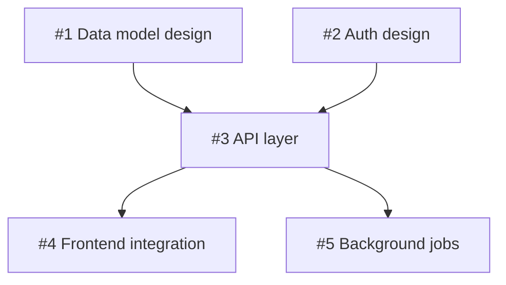

# Fabrik User Guide

Fabrik is an automated Claude Code SDLC driver powered by GitHub Issues and Projects.
This guide covers everything you need to set up, configure, and use Fabrik effectively.

For a quick overview see the [README](../README.md).
For details on the internal stage lifecycle, see [Stage Lifecycle](stage-lifecycle.md).

---

## Table of Contents

1. [Getting Started](#1-getting-started)
2. [Configuration Reference](#2-configuration-reference)
3. [Workflow Patterns](#3-workflow-patterns)
4. [Stage Reference](#4-stage-reference)
5. [Plugin & Skills](#5-plugin--skills)
6. [Labels Reference](#6-labels-reference)
7. [Permissions](#7-permissions)
8. [TUI Dashboard](#8-tui-dashboard)
9. [Observability](#9-observability)
10. [Troubleshooting](#10-troubleshooting)

---

## 1. Getting Started

### Prerequisites

- Go 1.26.1+
- [Claude Code CLI](https://docs.anthropic.com/en/docs/claude-code) installed and authenticated
- GitHub **classic** personal access token (`ghp_...`) with `repo`, `project`, and `workflow` scopes
  - Fine-grained tokens (`github_pat_...`) are **not supported** — GitHub Projects v2 GraphQL requires a classic PAT
  - Create one at: https://github.com/settings/tokens (select "Tokens (classic)")
  - If a fine-grained token is detected at startup, Fabrik prints a `[warn]` message and subsequent API calls include an actionable hint; see [GitHub API Returns 401 or Fine-Grained Token Warning](#github-api-returns-401-or-fine-grained-token-warning)
- A GitHub Project (v2) with board columns matching your stage names


### Initial Setup

**Option A: Install binary (requires `gh`)**

```bash
# Requires: gh auth login (with access to handarbeit/fabrik)
cd ~/bin  # or any directory on your PATH
gh release download --repo handarbeit/fabrik \
  --pattern "fabrik_*_$(uname -s | tr A-Z a-z)_$(uname -m | sed 's/x86_64/amd64/' | sed 's/aarch64/arm64/').tar.gz" \
  -O - | tar xz
# Platform-specific alternatives:
#   darwin/arm64:  --pattern "fabrik_*_darwin_arm64.tar.gz"
#   darwin/amd64:  --pattern "fabrik_*_darwin_amd64.tar.gz"
#   linux/amd64:   --pattern "fabrik_*_linux_amd64.tar.gz"
#   linux/arm64:   --pattern "fabrik_*_linux_arm64.tar.gz"
```

**Option B: Build from source (requires Go)**

```bash
# Build
go build -o fabrik .
```

Then initialize:

```bash
# Initialize stage configs, plugin, and config template
./fabrik init
# Creates:
#   .fabrik/stages/       — stage YAML configs
#   .fabrik/plugin/       — Claude Code plugin
#   .fabrik/config.yaml   — project config template (edit this)
# Updates:
#   .git/info/exclude     — adds .fabrik/repos/, .fabrik/worktrees/, .fabrik/debug/,
#                           and .fabrik/history.json so they don't appear as untracked
#                           in git status (local excludes, not committed to the repo)
```

Pass your GitHub Project URL to auto-populate `owner`, `project`, and `owner_type` in
`config.yaml`. The `--user` flag enables fully non-interactive setup:

```bash
./fabrik init --user you https://github.com/orgs/your-org/projects/5
# or for a personal project:
./fabrik init --user you https://github.com/users/you/projects/3
```

Without a URL, `fabrik init` behaves as before: if your terminal is interactive it
prompts for owner, repo, project number, and username; otherwise it writes a
fully-commented template for you to fill in.

To refresh plugin skills without touching stages or config (e.g., after upgrading Fabrik):

```bash
./fabrik upgrade
```

Edit `.fabrik/config.yaml` with your project settings and commit it to git. Add your
GitHub token to a gitignored `.env` file:

```
# .env (gitignored — keep secrets here)
# Use a CLASSIC personal access token (ghp_...) — not a fine-grained token (github_pat_...)
# Required scopes: repo, project, workflow
# Create at: https://github.com/settings/tokens (select "Tokens (classic)")
FABRIK_TOKEN=ghp_...
```

> **Note:** When a `.git/` directory is present, Fabrik refuses to start if `.env` exists but is not listed in `.gitignore` (prevents accidental token leaks). In directories **without** `.git/` — containers, CI workspaces, or bare directories — this check is skipped and `.env` is loaded normally without requiring a `.gitignore` entry.

### Create a Project Board

Create a GitHub Project (v2) for your repository. Add board columns that correspond to
your stage names -- the column name must match the `name` field in each stage YAML file
exactly (case-sensitive). The default pipeline uses:

`Backlog` -> `Specify` -> `Research` -> `Plan` -> `Implement` -> `Review` -> `Validate` -> `Done`

### Compatibility Notes

> **Warning:** Global Claude Code plugins can interfere with Fabrik's headless sessions. Do not install global plugins on machines running Fabrik as a service. The `superpowers` plugin is a known offender — if installed globally, it injects unexpected behaviour into Fabrik's Claude sessions and causes duplicate comments on issues.
>
> To check for the problematic plugin:
> ```bash
> ls ~/.claude/plugins/cache/claude-plugins-official/
> ```
> If `superpowers` appears, remove it:
> ```bash
> rm -rf ~/.claude/plugins/cache/claude-plugins-official/superpowers
> ```
> See [§10 Troubleshooting → Duplicate Comments on Issues](#10-troubleshooting) for full details.

### First Run

With settings in `.fabrik/config.yaml`:

```bash
./fabrik
```

Or pass settings as flags:

```bash
./fabrik \
  --owner your-org \
  --repo your-repo \
  --project 1 \
  --user your-github-username
```

Fabrik polls the project board every 30 seconds by default (configurable with `--poll`
or `poll:` in `config.yaml`).
Move an issue to `Specify` on the board to start processing it.

### Git Repositories and Worktrees

Fabrik always bare-clones each managed repository on first access. Run Fabrik from any directory (no need to be inside a git checkout of a managed repo):

```bash
mkdir ~/my-fabrik-dir && cd ~/my-fabrik-dir
fabrik init
./fabrik --owner myorg --project 5 --user me
# No --repo needed — Fabrik processes all repos on the board
```

Fabrik **always bare-clones** each managed repository on first access:
- Bare clones are stored at `.fabrik/repos/<owner>-<repo>.git`
- Worktrees are created at `.fabrik/worktrees/<owner>-<repo>/issue-N/` on branch `fabrik/issue-N`
- One worktree manager runs per discovered repository, all sharing the same poll loop

**`.fabrik/repos/` is excluded from git tracking by default** (gitignored). Bare clone directories can be very large and should not be committed to your repository. When you run `fabrik init` inside a git repo, these paths are also added to `.git/info/exclude` automatically.

To restrict processing to a single repository, pass `--repo owner/repo`.

The `.fabrik/` directory (config, stages, plugin) always lives in the directory where you run `fabrik`.

### Git Clone Protocol (HTTPS vs SSH)

By default, Fabrik uses HTTPS to bare-clone managed repos (`https://github.com/<owner>/<repo>.git`). Users who authenticate via SSH keys can switch to SSH clone URLs instead.

#### Using SSH

Pass `--ssh` on the command line or add `git_ssh: true` to `.fabrik/config.yaml`:

```bash
# One-time: use SSH for this run
fabrik --ssh --owner myorg --project 5 --user me

# Persistent: add to .fabrik/config.yaml
git_ssh: true
```

The environment variable `FABRIK_GIT_SSH=true` is also supported (useful in CI).

When SSH mode is active, Fabrik uses `git@github.com:<owner>/<repo>.git` as the clone URL. This requires your SSH key to be registered with GitHub and accessible via `ssh-agent`.

> **Startup behavior with SSH mode:** When `--ssh` / `git_ssh: true` is set, Fabrik suppresses the HTTPS credential helper startup check (described below) — it is not applicable. No equivalent SSH agent availability check runs at startup. If your SSH key is absent or unloaded when a clone or fetch runs, git will fail at that point rather than at startup. To verify your agent before running Fabrik: `ssh -T git@github.com`.

#### HTTPS Credential Helper Warning

When using HTTPS (the default), Fabrik checks at startup whether a git credential helper is configured. If none is found, you'll see an advisory warning:

```
[startup] warn: no git credential helper configured; HTTPS cloning may prompt for credentials.
[startup] warn: configure one (e.g. git-credential-osxkeychain) or use --ssh / git_ssh: true in .fabrik/config.yaml.
```

This warning is non-fatal. If you use a GitHub token in your environment (`FABRIK_TOKEN` or `GITHUB_TOKEN`) and your git is configured to use it (e.g., via a credential helper or token-in-URL), cloning will work without further configuration.

To resolve the warning, either:
- Configure a credential helper: `git config --global credential.helper osxkeychain` (macOS), or `git config --global credential.helper store`
- Or switch to SSH mode with `--ssh` / `git_ssh: true`

#### Existing Bare Clones

**Switching between HTTPS and SSH does not re-clone existing bare repos.** Once Fabrik has cloned a repo, it reuses the existing bare clone with its original remote URL. The SSH/HTTPS setting only affects new clones.

If you switch to SSH mode after existing bare clones were created, those clones will continue to fetch via HTTPS. To switch an existing bare clone to SSH, update its remote URL directly:

```bash
git -C .fabrik/repos/owner-repo.git remote set-url origin git@github.com:owner/repo.git
```

#### URL Rewriting

If you have `url.<base>.insteadOf` configured in your global `~/.gitconfig` (a common way to redirect HTTPS to SSH globally), Fabrik will notice at startup and print an informational message. Git applies URL rewriting transparently, so Fabrik's HTTPS clone URLs will automatically use your SSH configuration — no additional Fabrik setting is needed.

### Auto-upgrade

The `--auto-upgrade` flag enables Fabrik to upgrade itself when idle. After 2
consecutive idle polls, Fabrik checks the GitHub Releases API for a newer version.
If one is found, it downloads the new binary, replaces the running executable,
runs `fabrik upgrade` to refresh plugin skills, and re-execs itself.

**Dev builds (built from source)** follow the same 2 idle poll threshold but use a
different upgrade path. Fabrik detects that it is a dev build (version string starts
with `dev`) and checks whether it is running from a `handarbeit/fabrik` or
`handarbeit/fabrik` source checkout. If so, it compares the running binary's embedded
commit SHA against the local `HEAD`:

- **Local commits ahead of the binary**: rebuild immediately from the current working
  tree (`go build -o fabrik .`) without pulling — useful when you have local changes
  you've already compiled once.
- **Remote `origin/main` ahead of HEAD**: run `git pull --ff-only` to update, then
  rebuild.

After rebuilding, Fabrik runs `fabrik upgrade` (non-interactive, silent — see below)
and re-execs the new binary. This keeps dev builds current with the same hands-off
experience as release binaries.

> **`fabrik upgrade` in non-interactive mode**: Whether called automatically during
> auto-upgrade or run standalone, `fabrik upgrade` behaves differently depending on
> whether a TTY is attached. With no TTY (non-interactive), it auto-refreshes plugin
> skills silently — no prompt, no confirmation required. With a TTY (interactive), it
> prompts once before applying any skill updates. This means automated environments
> (CI, background processes, auto-upgrade re-exec) always get a clean, unattended
> skill refresh.

```bash
./fabrik --auto-upgrade --owner your-org --repo your-repo --project 1 --user you
```

> **Upgrading from v0.0.28 or earlier?** Before v0.0.29, `--auto-upgrade` fetched
> from the private `handarbeit/fabrik` repo. The v0.0.29 release switched the
> upgrade source to the public `handarbeit/fabrik` repo — but this change cannot
> self-apply: a binary built before v0.0.29 will never auto-receive it. If you are
> running an older binary, upgrade once manually:
> ```bash
> gh release download --repo handarbeit/fabrik \
>   --pattern "fabrik_*_$(uname -s | tr A-Z a-z)_$(uname -m | sed 's/x86_64/amd64/' | sed 's/aarch64/arm64/').tar.gz" \
>   -O - | tar xz
> ```
> After that, `--auto-upgrade` will keep you current automatically.

### Instance Lock

> **Note:** When Fabrik starts, it creates a PID lock file at `.fabrik/fabrik.lock`. If a second instance attempts to start in the same directory, it reads the lock file, logs an error identifying the running process, and exits immediately. The lock is automatically released when the process exits — including on crash or SIGKILL — so there is no need to manually delete the file after an unclean shutdown.
>
> See [§10 Troubleshooting → Multiple Fabrik Instances](#10-troubleshooting) if you encounter a stale lock or need to run multiple instances against different projects.

---

## 2. Configuration Reference

### Settings Overview

Fabrik resolves settings in this order (highest to lowest priority):

```
CLI flag  >  shell env var  >  .env file  >  .fabrik/config.yaml  >  built-in default
```

Use `.fabrik/config.yaml` for non-secret project settings (commit it to git).
Use `.env` for secrets only (`FABRIK_TOKEN` / `GITHUB_TOKEN`).

### `.fabrik/config.yaml`

Generated by `fabrik init`. Commit this file — it carries project settings with the repo.

```yaml
# .fabrik/config.yaml
owner: your-org
# repo: your-repo  # omit for multi-repo mode (processes all repos on the board)
project: 1
user: your-github-username

# Optional settings (defaults shown):

# Path to stage YAML configs directory.
# stages: ./.fabrik/stages

# Polling interval in seconds. Lower values are more responsive; higher values
# reduce GitHub API usage. Tradeoff: 10s is very responsive but consumes ~360 REST
# requests/hour; 30s (default) is a good balance.
# poll: 30

# Maximum number of parallel Claude sessions. Tune based on your API tier capacity.
# Each active session counts against your Anthropic API concurrency limit.
# max_concurrent: 5

# Maximum stage failures before pausing an issue. When exceeded, fabrik:paused and
# stage:<name>:failed labels are applied. Set to 0 for unlimited retries.
# max_retries: 3

# Auto-advance issues through stages without human card moves on the board.
# When true, completed issues advance to the next stage automatically.
# Per-stage auto_advance: in stage YAML can override this setting per-stage.
# yolo: false

# When idle, check handarbeit/fabrik GitHub Releases for a newer version. After 2
# consecutive idle polls, Fabrik downloads the new binary, runs fabrik upgrade,
# and re-execs. Requires internet access to the GitHub Releases API.
# auto_upgrade: false

# Disable the interactive TUI dashboard (enabled by default when a real terminal is detected).
# tui: false

# Save raw Claude output to .fabrik/debug/ for diagnosing unexpected behavior
# or prompt issues. Files are named by issue number and stage.
# debug_output: false

# Project version shown in the TUI footer. Auto-inferred from package.json,
# go.mod (returns module path, not semver), Cargo.toml, or pyproject.toml.
# Set explicitly to override auto-inference (e.g., version: "1.2.0").
# version: ""
```

**Multi-repo mode:** When `repo:` is commented out or omitted, Fabrik processes issues from *all* repositories on the project board. Use this when your project board spans multiple repos (cross-org collaborations, monorepos with independent sub-repos, or a single board managing several distinct services). To restrict Fabrik to one repository, uncomment and set `repo:`.

**Note:** `.fabrik/config.yaml` should NOT be listed in `.gitignore`. Fabrik warns
(non-fatal) if it is.

### `.env` File

Keep only secrets here. When a `.git/` directory is present, Fabrik refuses to start if `.env` exists but is not listed in `.gitignore` (prevents accidental token leaks). In directories without `.git/` (containers, CI, bare directories), this check is skipped and `.env` is loaded normally.

```
# .env (gitignored)
# Classic personal access token (ghp_...) required — see https://github.com/settings/tokens
FABRIK_TOKEN=ghp_...         # Preferred token env var (needs repo, project, workflow scopes)
GITHUB_TOKEN=ghp_...         # Fallback token env var
```

For per-developer identity overrides (when your username differs from config.yaml):

```
FABRIK_USER=my-personal-username
```

### Command-Line Flags

| Flag | Description | Default |
|------|-------------|---------|
| `--owner` | GitHub repo owner (org or user) | required |
| `--repo` | GitHub repo name; omit to enable multi-repo mode (processes all repos on the board) | optional |
| `--project` | GitHub Project (v2) number | required |
| `--user` | Your GitHub username -- only processes comments by this user | required |
| `--token` | GitHub API token | `$GITHUB_TOKEN` |
| `--stages` | Directory containing stage YAML configs | `./.fabrik/stages` |
| `--yolo` | Auto-advance issues through stages without human approval | `false` |
| `--auto-upgrade` | When idle, self-upgrade from handarbeit/fabrik GitHub Releases | `false` |
| `--notui` | Disable the interactive TUI dashboard | TUI on by default |
| `--plugin-dir` | Path to Fabrik plugin directory (overrides `.fabrik/plugin/`) | auto-detected |
| `--poll` | Poll interval in seconds | `30` |
| `--max-concurrent` | Maximum number of concurrent issue workers | `5` |
| `--max-retries` | Max failed stage attempts before pausing the issue (0 = unlimited) | `3` |
| `--debug-output` | Save Claude stage output to `.fabrik/debug/` | `false` |

### Environment Variables

| Variable | `config.yaml` key | Description | Default |
|----------|-------------------|-------------|---------|
| `FABRIK_TOKEN` | *(secrets only)* | GitHub **classic** personal access token (`ghp_...`) with `repo`, `project`, `workflow` scopes (preferred) | required |
| `GITHUB_TOKEN` | *(secrets only)* | GitHub **classic** personal access token (`ghp_...`) — fallback when `FABRIK_TOKEN` is unset | required |
| `FABRIK_OWNER` | `owner` | GitHub repo owner | -- |
| `FABRIK_REPO` | `repo` | GitHub repo name; optional — omitting enables multi-repo mode (all repos on the board) | -- |
| `FABRIK_PROJECT_NUMBER` | `project` | GitHub Project (v2) number | -- |
| `FABRIK_USER` | `user` | Your GitHub username | -- |
| `FABRIK_STAGES` | `stages` | Stage configs directory | `./.fabrik/stages` |
| `FABRIK_YOLO` | `yolo` | Auto-advance (`true`/`1`/`yes`) | `false` |
| `FABRIK_POLL` | `poll` | Poll interval in seconds | `30` |
| `FABRIK_MAX_CONCURRENT` | `max_concurrent` | Max parallel Claude sessions | `5` |
| `FABRIK_MAX_RETRIES` | `max_retries` | Max retries before pausing (0 = unlimited) | `3` |
| `FABRIK_AUTO_UPGRADE` | `auto_upgrade` | Self-upgrade when idle (`true`/`1`/`yes`) | `false` |
| `FABRIK_TUI` | `tui` | Disable TUI dashboard (`false`/`0`/`no`) | `true` |
| `FABRIK_PLUGIN_DIR` | *(no config.yaml key)* | Override plugin directory | `.fabrik/plugin/` |
| `FABRIK_DEBUG_OUTPUT` | `debug_output` | Save raw Claude output for debugging | `false` |
| `FABRIK_REVIEW_WAIT_TIMEOUT` | *(no config.yaml key)* | Minutes to wait for all requested PR reviewers to submit before auto-advancing (positive integer; invalid or unset values default to 15) | `15` |

Token precedence: `--token` flag > `FABRIK_TOKEN` > `GITHUB_TOKEN`

### Stage YAML Reference

Each stage is a YAML file in your stages directory. The filename is arbitrary; the
`name` field determines which board column it matches.

```yaml
name: Research            # Required. Must match a Project board column exactly.
order: 2                  # Required. Lower values processed earlier in the pipeline.
skill: fabrik-research    # Plugin skill to use (recommended; alternative to inline prompt).
                          #   When set, Fabrik sends a minimal directive and Claude loads
                          #   the skill methodology via the plugin system.
comment_skill: fabrik-research-comment  # Plugin skill for comment review (overrides comment_prompt).
prompt: |                 # Inline prompt (used when skill is not set; legacy but still supported).
  You are a research agent...
comment_prompt: |         # Inline comment-review prompt (used when comment_skill is not set).
  You are reviewing user comments...
model: sonnet             # Optional. Claude model: "opus", "sonnet", etc.
max_turns: 50             # Optional. Max conversation turns per main stage invocation.
comment_max_turns: 15     # Optional. Max turns when processing user comments. Defaults to
                          #   min(max_turns, 15) when max_turns is set, otherwise 15.
                          #   Keeps comment processing bounded independently of stage budget.
read_only: true           # Optional. Stashes the dirty worktree before Claude runs and
                          #   restores it after. Use for analysis stages that should not
                          #   modify files (e.g., Specify, Research).
update_issue_body: false  # Optional. Allow FABRIK_ISSUE_UPDATE_BEGIN/END markers in Claude
                          #   output to update the issue body. By convention only Specify
                          #   sets this to true.
post_to_pr: true          # Optional. Routes detailed Claude output to the linked PR; a
                          #   brief summary is still posted on the issue. Falls back to
                          #   posting on the issue if no linked PR is found.
create_draft_pr: true     # Optional. Pushes the branch and creates a draft PR *before*
                          #   Claude runs. Idempotent if a PR already exists.
mark_pr_ready_on_complete: true  # Optional. Marks the draft PR as review-ready after the
                                 #   stage completes. Triggers external review bots.
auto_advance: false       # Optional. Per-stage override for the global yolo setting.
                          #   true  = always auto-advance this stage (even if yolo: false)
                          #   false = never auto-advance this stage (even if yolo: true)
                          #   omit  = inherit the global yolo setting
cleanup_worktree: false   # Optional. Removes the issue worktree instead of invoking Claude.
                          #   Use for terminal stages (e.g., Done) where no further work
                          #   is needed on the branch.
wait_for_reviews: false   # Optional. When true and auto-advance is active, Fabrik waits for
                          #   all requested PR reviewers to submit before advancing the issue.
                          #   Controlled by FABRIK_REVIEW_WAIT_TIMEOUT (default 15 minutes).
                          #   See §3 Pending Reviewer Gate for full details.
allowed_tools:            # Optional. REPLACES the default tool set — not additive. When set,
  - Read                  #   only these tools are allowed; the default list is not added.
  - Grep                  #   When omitted, Fabrik uses a comprehensive default covering common
  - Glob                  #   SDLC tools: Read, Edit, Write, Glob, Grep, TodoWrite, Skill, Task,
                          #   Bash(git:*), Bash(gh:*), Bash(go:*), Bash(npm:*), Bash(npx:*),
                          #   Bash(yarn:*), Bash(pnpm:*), Bash(make:*), Bash(cargo:*),
                          #   Bash(python:*), Bash(pip:*), Bash(uv:*), Bash(pytest:*),
                          #   Bash(ls:*), Bash(cat:*), Bash(rm:*), Bash(cp:*), Bash(mv:*),
                          #   Bash(mkdir:*), Bash(find:*).
                          #   Use this to restrict read-only stages (Research, Plan, Specify)
                          #   or to limit Claude to project-specific tools.
disable_adaptive_thinking: true  # Optional. Disables Claude Code's adaptive (auto-reduced)
                                 #   thinking budget. Default: true.
effort_level: high        # Optional. Claude Code thinking effort: low, medium, high, max.
                          #   Default: high. Controls how much the model "thinks" before
                          #   responding. Higher values use more tokens.
completion:
  type: claude            # Only supported type (default).
```

Either `skill` or `prompt` is required (unless `cleanup_worktree` is true). When `skill`
is set, Fabrik sends a directive prompt telling Claude to follow the named skill; the
skill provides the detailed methodology via the plugin system. Prefer `skill` for complex
stages — it supports rich methodology, quality checklists, and scope boundaries. Use
`prompt` for simple single-purpose stages or quick overrides.

**`auto_advance` and `yolo` interaction:**

There are four cases:

1. Global `yolo: true` in `config.yaml` → all stages auto-advance after completion.
2. Per-stage `auto_advance: true` in stage YAML → this stage always auto-advances, regardless of whether global `yolo` is true or false.
3. Per-stage `auto_advance: false` in stage YAML → this stage never auto-advances, even when global `yolo: true`. This is a meaningful override — explicitly setting `false` is different from omitting the field.
4. Per-stage `auto_advance:` absent from stage YAML → the stage inherits the global `yolo` setting.

A fifth case applies at the issue level: adding the `fabrik:yolo` label to an issue forces auto-advance for that issue even when `auto_advance: false` is set in the stage YAML. The `fabrik:yolo` label also triggers auto-merge of the linked PR when the Validate stage completes (equivalent to running with `--yolo` globally, but scoped to a single issue).

**Thinking budget (`disable_adaptive_thinking`, `effort_level`):**

These two fields control how much Claude "thinks" before responding. `disable_adaptive_thinking: true` (the default) turns off Claude Code's adaptive thinking budget, which would otherwise auto-reduce thinking depth to save tokens. With adaptive thinking disabled, the `effort_level` field directly controls thinking intensity: `low`, `medium`, `high`, or `max`. The default `effort_level` is `high` (changed from `max` in v0.0.33 to reduce token usage without sacrificing quality). Use `effort_level: max` only for your most demanding stages — complex implementation or thorough review work — where higher token cost is justified.

---

## 3. Workflow Patterns

### How Issues Move Through the Pipeline

1. Create an issue and add it to your GitHub Project board.
2. Move the issue to a stage column (e.g., `Specify`).
3. Fabrik picks it up on the next poll, creates a worktree, and invokes Claude Code.
4. Claude works in the worktree and posts progress as issue comments.
5. When Claude completes the stage, the `stage:<name>:complete` label is applied.
6. In `--yolo` mode, the issue is automatically moved to the next stage column.
   Otherwise, a human reviews and drags the card.

### The Specify Stage

The Specify stage is the first active stage. It takes a rough backlog issue and
refines it into a clear, unambiguous spec:

- Surfaces missing requirements, ambiguities, and edge cases as questions
- Checks consistency with existing project features and documentation
- Researches prior art and established patterns on the web
- Rewrites the issue body with a structured spec

The user answers questions via comments. Claude incorporates the answers and updates
the issue body. Once all questions are resolved, the stage completes and the issue is
ready for Research.

### Steering with Comments

Fabrik responds to natural language comments you post on an issue. Claude sees the full
issue body and all prior comments, so context carries forward.

**Effective comment patterns:**

- *"Please link the PR to this issue"* -- Claude creates the PR link
- *"Let's use approach B instead"* -- Claude updates the plan and continues
- *"The answer to your question about X is Y"* -- Claude incorporates your answer
- *"Please push and link the PR"* -- Claude pushes the branch and creates a draft PR

When you post a comment:
1. Fabrik reacts with eyes to acknowledge the comment.
2. Claude is invoked with the stage's comment prompt (or a default).
3. Claude performs any requested actions.
4. If the issue body should be updated, Claude outputs the new body between
   `FABRIK_ISSUE_UPDATE_BEGIN` and `FABRIK_ISSUE_UPDATE_END` markers.
5. Fabrik updates the issue body and strips the markers from the posted comment.
6. Fabrik reacts with rocket to mark the comment as processed.

The rocket reaction is durable -- on restart, Fabrik skips comments that already have it.

### Reaction Flow

| Reaction | Meaning |
|----------|---------|
| Eyes | Comment received and queued for processing |
| Rocket | Comment has been fully processed |

### When to Intervene

You do not need to babysit the pipeline. The intended human role is:

- **File issues** with clear specs in the body (or let Specify refine them).
- **Answer questions** when Specify or Research surfaces unknowns.
- **Move cards** (or use `--yolo` to automate this).
- **Comment** to steer when the plan goes sideways or you want to redirect.
- **Review PRs** before merging -- Fabrik gets them review-ready, not merge-ready (unless `--yolo` or `fabrik:yolo` label is active, in which case Fabrik auto-merges after Validate).

### Draft PR Workflow

The Implement stage creates a **draft PR** linked to the issue. This gives you a place
to review incrementally. The Review stage then rebases, reviews, fixes, and pushes --
turning the draft into a review-ready PR.

### Retry and Escalation

When a stage doesn't complete (Claude doesn't output `FABRIK_STAGE_COMPLETE`):

1. **Cooldown**: Fabrik waits `poll_interval x 10` seconds (default 5 minutes) before retrying.
2. **Resume**: On retry, Claude resumes the existing conversation session with full context.
   The worktree is left as-is (no rebase) to preserve Claude's context.
3. **WIP commit**: Partial work is committed and pushed to preserve progress.
4. **Max retries**: After `--max-retries` failures (default 3):
   - `fabrik:paused` and `stage:<name>:failed` labels are added
   - An explanatory comment is posted on the issue
   - The issue stops being processed until a human investigates

To resume after escalation: remove the `fabrik:paused` label. Fabrik will clear the
failed label, reset the retry count, and try again immediately.

### Stages Waiting for Input

A stage can signal that it needs user input before it can proceed by outputting
`FABRIK_BLOCKED_ON_INPUT`. This is different from a failure — the stage is not broken,
it just needs a question answered.

When a stage outputs `FABRIK_BLOCKED_ON_INPUT`:
1. `fabrik:paused` and `fabrik:awaiting-input` labels are added to the issue
2. The retry counter is **not** incremented — this does not count as a failure
3. The issue waits silently until the configured Fabrik user (`--user` / `FABRIK_USER`) posts a new comment

When the configured user posts a new comment:
1. Fabrik detects the comment and automatically removes both labels
2. Comment processing is triggered immediately (no manual card move needed)
3. The comment processing run can output `FABRIK_STAGE_COMPLETE` to finish the stage
   directly, without needing an additional stage invocation

This is the intended mechanism for Q&A in stages like Specify — Claude asks a question,
the configured user answers it in a comment, and the stage resumes automatically.

### Dependency-Based Sequencing (Formations)

Fabrik supports dependency-based sequencing of issues using GitHub's native "Blocked by" relationships. This enables **formations** — coordinated sets of issues that execute in parallel where possible and respect ordering constraints automatically.

#### Setting Up Dependencies

To mark one issue as blocked by another on GitHub.com:

1. Open the issue in GitHub
2. In the right sidebar, find the **Relationships** section
3. Click **"Mark as blocked by"**
4. Search for and select the blocking issue (same repo or cross-repo)

Repeat for each dependency. This uses GitHub's native `blockedBy` GraphQL field (available on all GitHub plans since August 21, 2025).

#### How Fabrik Detects and Respects Dependencies

Fabrik uses the `fabrik:blocked` label to track blocked issues. The label lifecycle is fully automatic:

1. **Detection**: On each poll, issues with `fabrik:blocked` are deep-fetched every cycle to detect unblocking promptly (within one poll interval, typically ~30 seconds).
2. **First block**: When Fabrik first detects that an issue is blocked, it posts a comment listing the open blocking issues and adds the `fabrik:blocked` label automatically. Fabrik creates this label on first use — no pre-creation needed.
3. **While blocked**: The issue is skipped silently each poll cycle (no duplicate comments).
4. **Automatic unblocking**: When all blocking issues are closed, Fabrik removes `fabrik:blocked` and resumes processing on the next poll — no human action required.

**Key behavior callouts:**

- **The first stage (Specify) always runs regardless of blockers** — dependencies only gate subsequent stages. This allows a formation to be fully specified before execution begins.
- **Independent issues start in parallel** — issues with no blockers are dispatched concurrently up to the configured `MaxConcurrent` limit.
- **Failed issues retry independently** — a failure in one formation member does not affect siblings.
- **Cross-repo dependencies are supported** — a blocking issue can be in a different repository. Fabrik displays cross-repo blockers as `owner/repo#N` in log output.

#### Formation Recipe

1. **File all issues** for the formation. Write specs at the right level of granularity — each issue should be independently implementable.
2. **Add blocked-by edges** in GitHub using the Relationships sidebar (see above).
3. **Label all issues `fabrik:yolo`** — this makes the formation hands-free. Without `fabrik:yolo`, each stage requires a manual card move on the project board.
4. **Move all issues to Specify** on the project board. Fabrik will pick them up on the next poll.
5. **Watch it run** — Fabrik executes Specify for all issues in parallel, then gates subsequent stages on dependency resolution automatically.

#### Example Formation



In this 5-issue formation:
- Issues #1 and #2 start immediately in parallel (no blockers)
- Issue #3 starts after both #1 and #2 are closed
- Issues #4 and #5 start after #3 is closed (in parallel with each other)

**Real-world validation:** A 9-issue formation with 7 dependency edges was run on the Ambient project — 4 issues started in parallel, all pipeline constraints were respected automatically, completing in ~88 minutes wall-clock time at $31 total cost.

### Issue Decomposition

When Plan determines that an issue is too broad for a single Implement cycle, it can autonomously split it into focused sub-issues — each small enough to implement cleanly and independently.

**No user configuration required.** Decomposition is Plan's judgment call. If the issue is well-scoped, Plan produces a normal implementation plan. If it's too broad, Plan decomposes it.

#### What Happens

1. **Plan creates sub-issues** via `gh` CLI, labels them `fabrik:sub-issue`, and adds them to the project board.
2. **Plan sets up "blocked by" edges** between sub-issues where sequential ordering is required.
3. **Plan outputs `FABRIK_DECOMPOSED`** and stops — no `FABRIK_STAGE_COMPLETE` is emitted.
4. **The engine adds `stage:Plan:complete`** to the parent issue and moves it to Done.
5. **Sub-issues appear in Research** and flow through the full pipeline independently.

Sub-issues form a [formation](#dependency-based-sequencing-formations) automatically — dependency edges set by Plan are enforced during execution.

#### What You Observe

- The parent issue moves to Done on the project board (its label set shows `stage:Plan:complete`).
- New issues appear in Research, each labeled `fabrik:sub-issue`.
- If Plan set up blocking edges, sub-issues that depend on each other will wait as a formation.

#### Depth Limit

Sub-issues (those labeled `fabrik:sub-issue`) are **never decomposed further**. If Plan encounters an issue with that label, it produces a normal implementation plan regardless of scope. Maximum decomposition depth is 1.

### Pending Reviewer Gate

When a stage has `wait_for_reviews: true` set and auto-advance is active (global `yolo: true`, per-stage `auto_advance: true`, or the `fabrik:yolo` label on the issue), Fabrik waits for all requested PR reviewers to submit their reviews before advancing the issue to the next stage.

#### Enabling the Gate

Add `wait_for_reviews: true` to the relevant stage YAML (typically Review or Validate):

```yaml
name: Review
order: 4
wait_for_reviews: true
...
```

The gate only fires when auto-advance is active. If you're manually dragging cards through the board, the gate has no effect — you control the timing.

#### Label Lifecycle

When the gate is active, Fabrik adds the `fabrik:awaiting-review` label to the issue. This label:

- Makes the wait state visible on the project board
- Is cleared automatically when all requested reviewers submit (approve, request changes, or comment)
- Is also cleared when the `FABRIK_REVIEW_WAIT_TIMEOUT` elapses (fail-open: Fabrik advances the issue even without all reviews)

#### Timeout Configuration

Set `FABRIK_REVIEW_WAIT_TIMEOUT` to the number of minutes Fabrik should wait before giving up and advancing anyway. Must be a positive integer; invalid or unset values default to 15 minutes. There is no way to disable the timeout entirely — the minimum value is 1 minute.

```bash
FABRIK_REVIEW_WAIT_TIMEOUT=30  # Wait up to 30 minutes for reviewers
```

#### Two-Phase Mechanism

The gate uses a two-phase design to handle the propagation delay between when Fabrik requests reviewers and when GitHub's API returns them in the PR data:

1. **Phase 1 (always-gate):** On stage completion, Fabrik immediately adds `fabrik:awaiting-review` and skips auto-advance. This fires even before reviewer assignments propagate.
2. **Phase 2 (catch-up):** On subsequent poll cycles, Fabrik re-fetches the PR with fresh GraphQL data and evaluates whether all requested reviewers have submitted. When they have (or the timeout elapses), the gate clears and auto-advance proceeds.

This means there is always at least one extra poll cycle delay after stage completion — typically 30 seconds.

#### Restart Persistence

The timeout is based on the timestamp of when the `fabrik:awaiting-review` label was added to the issue, which is stored in GitHub's event history. If Fabrik restarts while waiting, it recalculates the remaining wait time from the label timestamp rather than resetting the clock.

---

## 4. Stage Reference

### Default Pipeline

| Stage | Order | Purpose |
|-------|-------|---------|
| **Backlog** | -- | Parking lot. No stage config needed. |
| **Specify** | 0 | Refine rough issues into clear, unambiguous specs. |
| **Research** | 1 | Explore codebase, surface technical findings and questions. |
| **Plan** | 2 | Design implementation approach with task checklist. |
| **Implement** | 3 | Write code and tests, commit frequently, push to branch. |
| **Review** | 4 | Rebase, review, fix issues, push. Posts output on PR. |
| **Validate** | 5 | Run tests, verify requirements, confirm PR is ready. |
| **Done** | 99 | Terminal state. Cleanup stage removes worktree. Item remains on the board. |

#### Done Stage and Archiving

When an issue reaches Done, Fabrik:
1. **Removes the worktree** — frees disk space from the issue's working copy
2. **Adds `stage:Done:complete`** — marks cleanup as finished

**Note:** Auto-archive is currently disabled. It was removing items from the board before users could see them, and is being reworked to track actual Done stage completion time. Items will remain in the Done column until auto-archive is re-enabled in a future release. When re-enabled, archived items will not be deleted — they will remain accessible via the project board's "Archive" view in GitHub.

### Customizing Stages

```bash
# Initialize with defaults
./fabrik init

# Edit stage configs and skills
vim .fabrik/stages/research.yaml
vim .fabrik/plugin/skills/fabrik-research/SKILL.md

# Or point to a custom stages directory
./fabrik --stages ./my-custom-stages ...
```

You can add, remove, or reorder stages. Stages must have `name`, `order`, and either
`skill` or `prompt`. The `name` must match a board column and `order` values define
the sequence.

---

## 5. Plugin & Skills

### How Skills Work

Each stage references a **skill** -- a markdown file that contains detailed methodology
for how Claude should approach the stage. Skills are packaged as a Claude Code plugin
in `.fabrik/plugin/` and loaded via `--plugin-dir` on each Claude invocation.

The default skills are:

| Skill | Purpose |
|-------|---------|
| `fabrik-specify` | Requirements clarification, consistency checks, prior art research; preserves the Problem section verbatim (never compressed) and places it first in the spec |
| `fabrik-research` | Codebase exploration, technical analysis, constraint discovery; includes a Documentation Impact section for user-facing features |
| `fabrik-plan` | Implementation design, task checklist, decision documentation; includes explicit doc update tasks in the checklist for user-facing features |
| `fabrik-implement` | Code writing, testing, committing, pushing; updates `USER_GUIDE.md` and/or `README.md` in the same PR for user-facing features — never defers documentation to a follow-up issue |
| `fabrik-review` | Code review, fix issues, rebase, prepare PR |
| `fabrik-validate` | Final verification, test suite, requirements check |

### Customizing Skills

Skills live in `.fabrik/plugin/skills/<skill-name>/SKILL.md`. Edit them to change
how Claude approaches each stage. Changes take effect on the next Claude invocation.

The stage YAML references the skill by name:
```yaml
skill: fabrik-research    # loads .fabrik/plugin/skills/fabrik-research/SKILL.md
```

### Skill vs Prompt

- **`skill:`** references a plugin skill file (recommended). The skill contains rich
  methodology, quality checklists, and scope boundaries.
- **`prompt:`** is an inline prompt string in the YAML (legacy, still supported).
  Useful for quick customization but harder to maintain for complex stages.

When `skill` is set, Fabrik sends a minimal directive:
```
You are operating as the Fabrik Research agent for issue #42.
Follow the instructions in the fabrik-research skill exactly.
```

The skill is auto-loaded by Claude Code via the plugin system.

### Built-in Skill: `/cut-release`

The `/cut-release` skill automates the Fabrik release process — pre-flight checks, release notes, commit/tag/push, and documentation issue filing — in a single invocation.

#### Invocation

```
/cut-release              # Auto-suggests next patch bump; confirms version with you
/cut-release v0.0.12      # Uses the explicit version; no confirmation prompt
```

#### Pre-flight checks

Before doing anything, `/cut-release`:

1. Verifies the working tree is clean (`git status --porcelain`). Stops if dirty.
2. Pulls latest main (`git pull origin main`).
3. Runs `go build ./...` and `go test -race ./...`. Stops if either fails.

The build/test gate is mandatory — broken releases are worse than delayed ones.

#### Version determination

- Reads the latest tag via `git describe --tags --abbrev=0`.
- If you provided an explicit version, validates it: must be valid semver with a `v` prefix and greater than the current tag.
- If no version is provided, auto-suggests the next patch bump (e.g. `v0.0.11` → `v0.0.12`) and confirms with you before proceeding.

#### Change gathering

Runs `git log <last-tag>..HEAD --oneline` and groups commits into four categories:

| Category | What goes here |
|----------|---------------|
| **Features** | New user-facing capabilities |
| **Fixes** | Bug fixes |
| **Improvements** | Enhancements to existing features |
| **Internal** | Refactoring, test improvements, CI — summarized briefly, not enumerated |

Merge commits and `Co-Authored-By` lines are ignored.

#### Release notes format

Writes `release-notes.md` in the repo root:

```markdown
# Fabrik <version>

## Features
- Description of feature (#issue)

## Fixes
- Description of fix (#issue)

## Improvements
- Description of improvement (#issue)

## Internal
- Summary of internal changes

## Upgrading

\```bash
# Auto-upgrade from a running Fabrik instance
# Fabrik checks for new releases each poll cycle and upgrades automatically with --auto-upgrade

# Or download directly
gh release download --repo handarbeit/fabrik --pattern '*<os>_<arch>*' -O - | tar xz
\```
```

Empty category sections are omitted. The `release-notes.md` file **must be committed before the tag push** because the GitHub Actions release workflow (`release.yml`) uses it to populate the GitHub Release body.

#### Commit, tag, and push

Once the release notes are written, `/cut-release` proceeds without a confirmation prompt (pre-flight already passed):

1. `git add release-notes.md`
2. Commits with message: `Release notes for <version>`
3. Creates the tag: `git tag <version>`
4. Pushes branch and tag together: `git push origin main <version>`
5. Reports the triggered GitHub Actions run URL.

**Never force-push tags.** If a tag already exists at that version, `/cut-release` stops and tells you.

#### Documentation issue

After a successful push, `/cut-release` automatically files a GitHub issue:

- **Title**: `Update docs for v<version>`
- **Labels**: `documentation`, `fabrik:yolo`
- **Board position**: Added to the Fabrik PM project board and moved to the **Specify** column

The `fabrik:yolo` label means Fabrik will pick it up automatically and run it through the pipeline. You don't need to do anything else for documentation updates after cutting a release.

### Built-in Skill: `/audit-documentation`

The `/audit-documentation` skill compares recently shipped features against `USER_GUIDE.md`, `README.md`, and `docs/index.md`, then files GitHub issues for gaps and closes existing documentation issues whose gaps are now covered.

#### Invocation

```
/audit-documentation                  # Scan issues closed in the last 30 days
/audit-documentation --since v0.0.20  # Scan issues referenced in commits since a tag
```

#### What it does

1. **Discovers source issues** — finds recently closed issues using the selected mode (see below).
2. **Filters** — excludes issues labeled `documentation` and issues that are infrastructure/tooling-only with no user-facing behavior change.
3. **Reads the docs** — reads `USER_GUIDE.md`, `README.md`, and `docs/index.md` in full.
4. **Analyzes gaps** — for each filtered issue, checks whether the feature is adequately described in the docs. Groups related issues into single gap entries. Errs on the side of filing — false positives are refined by the Specify stage; false negatives cause documentation drift.
5. **Clears the deck** — for each existing open `documentation` issue whose gap is now clearly and completely covered, closes it with a comment.
6. **Files new gap issues** — for each newly identified gap, creates a GitHub issue labeled `documentation` and `fabrik:yolo`, and places it in the **Specify** column on the PM board.

#### Modes

**Date-based mode (default):** Fetches closed issues via `gh issue list --state closed --search "closed:>$CUTOFF_DATE" --limit 200`.

**Tag-based mode (`--since <tag>`):** Two passes — extracts `#NNN` references from commit messages since the tag, then scans merged PRs for `Closes #NNN` references.

#### Output

After running, `/audit-documentation` prints a structured summary:

```
## Audit Documentation — Summary

**Period**: <date range or tag range scanned>

**Issues scanned**: <N>
**Issues excluded**: <N>
  - <issue#>: <title> — <reason>

**Documentation gaps found**: <N>

**New gap issues filed** (<N>):
  - #<number>: <title>

**Existing documentation issues closed** (<N>):
  - #<number>: <title>

**Existing documentation issues left open** (<N>):
  - #<number>: <title> — <reason left open>
```

If no gaps are found, it reports: "No documentation gaps found — docs appear current."

#### Known limitations

- **Rate limits**: May apply for repos with hundreds of closed issues.
- **Tag-based mode coverage**: Misses issues whose PRs used `Fixes` or bare URLs instead of `Closes #NNN` in the PR body.

### Plugin Development

For developing the plugin itself, use `--plugin-dir` to point at your working copy:
```bash
./fabrik --plugin-dir ./plugin/fabrik-plugin ...
```

---

## 6. Labels Reference

### Fabrik-Managed Labels

> Fabrik auto-seeds all managed labels on the configured repository at startup — creating them with their descriptions and colors if they do not already exist, so the GitHub UI shows meaningful hover text.

| Label | Purpose |
|-------|---------|
| `fabrik:locked:<user>` | Issue being processed by this user's instance |
| `fabrik:editing` | Issue body being updated (comment processing) |
| `fabrik:paused` | Processing paused (max retries exceeded or manual) |
| `fabrik:awaiting-input` | Stage paused waiting for user input; auto-clears on a new comment from the configured user |
| `fabrik:awaiting-review` | Issue waiting for all requested PR reviewers to submit; set when `wait_for_reviews: true` stage completes with auto-advance active; cleared when all reviewers submit or `FABRIK_REVIEW_WAIT_TIMEOUT` elapses |
| `fabrik:blocked` | Issue is waiting for one or more blocking issues to close; added and removed automatically by the engine (Fabrik creates this label on first use — no pre-creation needed) |
| `stage:<name>:in_progress` | Stage actively running |
| `stage:<name>:complete` | Stage completed successfully |
| `stage:<name>:failed` | Stage hit max retries |

### User-Set Labels

| Label | Effect |
|-------|--------|
| `model:opus` | Override Claude model to Opus for this issue |
| `model:sonnet` | Override Claude model to Sonnet for this issue |
| `effort:low` | Override thinking effort to low for this issue |
| `effort:medium` | Override thinking effort to medium for this issue |
| `effort:high` | Override thinking effort to high for this issue |
| `effort:max` | Override thinking effort to max for this issue |
| `fabrik:paused` | Manually pause processing (add to pause, remove to resume) |
| `fabrik:yolo` | Force auto-advance for this issue even when `auto_advance: false`; also triggers auto-merge of the linked PR when Validate completes |
| `fabrik:cruise` | Auto-advances through all stages like `fabrik:yolo` but stops at Validate — no auto-merge, no move to Done. If both `fabrik:cruise` and `fabrik:yolo` are present, `fabrik:yolo` takes precedence. |
| `fabrik:unrestricted` | Pass `--dangerously-skip-permissions` instead of `--permission-mode dontAsk` for this issue; bypasses the default tool allowlist entirely. Use only when a stage needs tools outside the default set or when the default posture prevents required work. **Caution:** removes all tool restrictions. |

Model label precedence: `model:<name>` label > stage YAML `model` field > default.

Effort label precedence: `max > high > medium > low`. If multiple `effort:` labels are present, the highest-ranked value wins and a warning is logged.

---

## 7. Permissions

Fabrik passes `--permission-mode dontAsk` to every Claude Code invocation. In this mode Claude does not prompt for tool permissions — tools not in the allowed set are silently denied rather than triggering an interactive prompt. This ensures Fabrik works correctly in headless mode and shared environments regardless of the user's `~/.claude/settings.json`. Fabrik does not require users to pre-configure permissions in their Claude Code settings.

**Default allowed-tool set** (used when a stage does not specify `allowed_tools`):

| Category | Tools |
|----------|-------|
| File operations | `Read`, `Edit`, `Write`, `Glob`, `Grep` |
| Task management | `TodoWrite`, `Skill`, `Task` |
| Git & GitHub | `Bash(git:*)`, `Bash(gh:*)` |
| Build systems | `Bash(go:*)`, `Bash(npm:*)`, `Bash(npx:*)`, `Bash(yarn:*)`, `Bash(pnpm:*)`, `Bash(make:*)`, `Bash(cargo:*)` |
| Python | `Bash(python:*)`, `Bash(pip:*)`, `Bash(uv:*)`, `Bash(pytest:*)` |
| Shell utilities | `Bash(ls:*)`, `Bash(cat:*)`, `Bash(rm:*)`, `Bash(cp:*)`, `Bash(mv:*)`, `Bash(mkdir:*)`, `Bash(find:*)` |

**`allowed_tools` replaces the defaults — it is not additive.** When a stage sets `allowed_tools`, only those tools are permitted; the default list above is not merged in. This is intentional: Research, Plan, and Specify stages set `allowed_tools` to a read-only subset to prevent Claude from writing files during those stages.

**`fabrik:unrestricted` bypasses everything** — passes `--dangerously-skip-permissions` instead, granting Claude full tool access. Use this label only when a stage requires tools outside the default set (e.g. `deno`, `bun`, or other non-standard toolchains).

**Note on personal `~/.claude/settings.json`:** Under `dontAsk` mode, tools the user has explicitly allowed in their own `permissions.allow` remain allowed in addition to Fabrik's list — this does not break the isolation goal, it just means personal extras carry through. If your organization deploys managed settings (MDM/enterprise level), a `deny` rule in managed settings cannot be overridden by `--allowedTools` — that is outside Fabrik's control.

---

## 8. TUI Dashboard

The interactive terminal dashboard is enabled by default when running in a real terminal. To disable it, use `--notui`:

```bash
./fabrik --notui --owner your-org --repo your-repo --project 1 --user you
```

### Layout

The TUI shows a compact header with poll status, an In Progress pane showing active
Claude sessions, a scrollable History pane with completed jobs, and a status bar
(footer) displaying REST and GraphQL rate limit stats.

### Keyboard Shortcuts

| Key | Action |
|-----|--------|
| `Tab` | Switch focus between In Progress and History panes |
| `Up/Down` or `j/k` | Navigate items within the focused pane |
| `l` | Open `fabrik watch` for selected issue (live Claude output, stage tabs, PR/CI status) |
| `enter` | Toggle inline detail panel for the selected item |
| `r` | Resume Claude session for selected history item (history pane only, item must not be active) |
| `Escape` | Close open dialogs; with no dialog open, triggers quit confirmation |
| `n` / `N` | Cancel quit or clear-all confirmation dialogs |
| `c` | Delete selected history entry |
| `C` | Clear all history (with confirmation) |
| `?` | Toggle help panel (keybindings and labels reference) |
| `q` | Quit |

#### Help Panel (`?`)

Pressing `?` opens an overlay that displays all keybindings and a labels reference. The labels reference covers every label Fabrik uses:

| Label | Meaning |
|-------|---------|
| `fabrik:yolo` | Auto-advance through all stages and auto-merge PR on Validate completion |
| `fabrik:cruise` | Auto-advance through all stages without auto-merging the PR |
| `fabrik:paused` | Issue processing is paused |
| `fabrik:awaiting-input` | Stage is blocked waiting for user input |
| `fabrik:awaiting-review` | Stage completed; waiting for outstanding PR reviewer requests |
| `fabrik:locked:<user>` | Issue is locked for editing by the specified user |
| `stage:<name>:in_progress` | Named stage is currently running |
| `stage:<name>:complete` | Named stage completed successfully |
| `stage:<name>:failed` | Named stage failed (hit max retries) |
| `model:<name>` | Override the model for this issue (e.g. `model:opus`) |
| `effort:<level>` | Override thinking effort for this issue (`low`, `medium`, `high`, `max`) |
| `fabrik:unrestricted` | Bypass default permission posture; passes `--dangerously-skip-permissions` instead |

Dismiss the panel by pressing `?` again or `Esc`.

In terminals that support OSC 8 hyperlinks (Ghostty, iTerm2, WezTerm, Kitty), issue numbers (`#NNN`) in the In Progress and History panes are hyperlinks. **Cmd+click** (macOS) or **Ctrl+click** (Linux) on a `#NNN` to open the corresponding GitHub issue in your browser; **Cmd+click** / **Ctrl+click** the board title in the footer to open the project board. Use keyboard navigation for selection and scrolling.

### What's Displayed

**In Progress**: Issue number, stage name, elapsed time, issue title, latest status message.

**History**: Issue number, stage name, success/fail icon, duration, timestamp, turns used,
cost, and issue title. Status icons:

| Icon | Meaning |
|------|---------|
| `✓` | Stage completed successfully |
| `✗` | Stage failed (hit max retries) |
| `?` | Stage blocked / awaiting user input |
| `↻` | Stage retrying |
| `💬` | Issue has unprocessed comments |

### History Persistence

Job history is saved to `.fabrik/history.json` (project-local, alongside `.fabrik/config.yaml`) and restored on restart.

---

## 9. Observability

### `fabrik watch` — Per-Issue TUI

The recommended way to monitor a running issue is `fabrik watch`:

```bash
fabrik watch 42
# or with explicit credentials:
fabrik watch 42 --owner myorg --repo myrepo --token ghp_...
```

This opens a real-time terminal UI that shows:
- Issue title, labels, and current stage
- **Live Claude output** — streams from the `.log` file as Claude writes it (no polling)
- **Stage history** — completed stages with duration and cost
- **PR status** — linked PR number, open/draft/merged state
- **CI check results** — compact pass/fail/pending summary
- **Comment count** — updates on each GitHub poll

#### Keyboard shortcuts

| Key | Action |
|-----|--------|
| `↑` / `↓` or `k` / `j` | Scroll live output |
| `g` / `G` | Jump to top / bottom of output |
| `left` / `h` | Switch to previous stage tab |
| `right` / `l` | Switch to next stage tab |
| `i` | Open interactive Claude session in the issue's worktree (resumes current stage) |
| `esc` | Quit (same as `q`) |
| `q` / `ctrl+c` | Quit |

The session ID for the active Claude session is shown in the header when available.

#### Credentials

`fabrik watch` reads owner, repo, and poll interval from `.fabrik/config.yaml` (see §2). Without a GitHub token, it shows local log output and stage history but skips GitHub API calls (PR/CI/comments).

### Log Files

Session logs are saved to `.fabrik/logs/<owner>-<repo>/issue-<N>/` (relative to the project working directory) as NDJSON (one JSON event per line). Each stage produces a `.log` file written continuously during execution — `fabrik watch` follows this file live. To view a log manually:

```bash
ls -lt .fabrik/logs/<owner>-<repo>/issue-42/

# Render a completed log as human-readable text
cat .fabrik/logs/<owner>-<repo>/issue-42/<stage>-output-<timestamp>.json | fabrik stream-filter | less -R
```

Logs are namespaced by repository: `.fabrik/logs/<owner>-<repo>/issue-<N>/`.

`fabrik stream-filter` reads NDJSON or JSON array Claude output from stdin and renders thinking blocks, text responses, and tool calls as human-readable text.

### Poll Log

Fabrik writes engine-level output to `.fabrik/fabrik.log` in the project working directory. This file is **truncated on each startup** and contains only the current run.

The poll log captures:
- Deep-fetch decisions (which issues were shallow-skipped vs. fully fetched)
- Dispatch events (which issues were dispatched to workers and why)
- Upgrade checks and idle-upgrade transitions
- GitHub API rate limit stats per poll cycle

The poll log is written in both TUI and non-TUI modes. It is most useful for post-mortem debugging of engine-level behavior — for example, diagnosing why an issue was not picked up during a poll cycle.

### Auto-migration from `~/.fabrik/`

On the first startup after upgrading from a pre-v0.0.32 release, Fabrik automatically migrates session files and stage logs from `~/.fabrik/sessions/` and `~/.fabrik/logs/` to `<cwd>/.fabrik/sessions/` and `<cwd>/.fabrik/logs/`. The migration is idempotent (files whose destination already exists are skipped) and handles cross-device filesystems. Empty source directories are removed after migration.

### Debug Output

Enable `--debug-output` to save Claude's raw output to `.fabrik/debug/` in the
working directory. Useful for diagnosing prompt issues or unexpected behavior.

### Subprocess Environment

Claude Code is invoked with a clean, isolated environment — environment variables
from the parent process do not leak into Claude subprocesses. If you previously
relied on ambient env vars being available inside Claude (e.g., API keys or tool
paths set in your shell), pass them explicitly via your stage YAML or a shell
wrapper script.

### Rate Limit Monitoring

Fabrik reports GitHub API rate limit stats in each poll cycle (visible in the TUI
status bar (footer) or plain-text log output):
- REST API: requests remaining / limit
- GraphQL API: points remaining / limit

The GraphQL query uses a two-phase fetch to minimize rate limit consumption:

1. **Shallow board scan** — fetches all items with lightweight fields (`updatedAt`,
   labels, status). Items whose `updatedAt` hasn't changed since the last poll are
   skipped entirely.
2. **Targeted detail fetch** — runs only for items that passed the shallow filter.
   The one exception is `fabrik:blocked` items, which always receive a forced
   deep-fetch regardless of `updatedAt`. This is necessary because the issue that's
   _blocking_ a blocked item can be closed without bumping the blocked item's own
   `updatedAt` timestamp.

   Items with `fabrik:awaiting-input` or `fabrik:awaiting-review` do **not** force a
   deep-fetch. New user comments bump the issue's `updatedAt`; PR review submissions
   bump the linked PR's `updatedAt` — both are captured by the shallow scan, so the
   targeted detail fetch fires naturally when there is actually something new to see.

Typical cost is ~5–30 points per poll depending on active items, well within the
5,000 points/hour limit.

---

## 10. Troubleshooting

### GitHub API Returns 401 or "Fine-Grained Token" Warning

Fabrik requires a **classic** personal access token (`ghp_...`). Fine-grained tokens (`github_pat_...`) are **not supported** because GitHub Projects v2 GraphQL — which Fabrik uses for status updates and board queries — is not available to fine-grained PATs.

**Symptoms:**
- Startup warning: `[warn] Fine-grained personal access tokens (github_pat_...) do not support GitHub Projects v2 GraphQL...`
- Error on first API call: `GitHub API returned 401: ... If you used a fine-grained access token...`

**Fix:**
1. Go to https://github.com/settings/tokens and select **"Tokens (classic)"**
2. Generate a new token with scopes: `repo`, `project`, `workflow`
3. Update `FABRIK_TOKEN` in your `.env` file with the new `ghp_...` token

### Startup Board Validation Failure

On every startup, Fabrik fetches the project board and compares stage names in `.fabrik/stages/*.yaml` to the column names on the board. If any non-cleanup stage is missing from the board, Fabrik exits with an error listing the mismatched names.

To fix: ensure stage YAML `name` fields match board column names exactly (case-sensitive). If you renamed a column on the board, update the matching stage YAML. Extra board columns (with no matching stage) produce a warning but don't block startup.

### Issue Not Being Picked Up

- Confirm the board column name exactly matches a stage YAML `name` (case-sensitive).
- Confirm the issue is on the project board.
- Check for `fabrik:locked:<other-user>` label (another instance has it).
- Check for stuck `fabrik:editing` label (remove manually if stale).
- Check the poll log -- the issue may be filtered by `updatedAt` caching. Restart Fabrik
  to force a fresh scan.

### Stage Keeps Retrying

A stage that never outputs `FABRIK_STAGE_COMPLETE` retries after each cooldown. Causes:

- **Claude needs user input** -- answer the questions in the issue comments.
- **Missing context** -- add detail to the issue body.
- **Bug in the skill** -- check the SKILL.md in `.fabrik/plugin/skills/`.

After `--max-retries` failures, the issue is paused with `fabrik:paused`. Remove the
label to resume.

### Stale Worktrees

Worktrees are at `.fabrik/worktrees/<owner>-<repo>/issue-N/` on branch `fabrik/issue-N`. On each stage
invocation, Fabrik rebases onto latest main (unless it's a retry, which preserves the
worktree as-is to maintain Claude's context). If the rebase conflicts, it's silently
aborted and Claude works from the current base.

To manually clean up:
```bash
git worktree remove --force .fabrik/worktrees/<owner>-<repo>/issue-N
git branch -D fabrik/issue-N
```

### Killed or Interrupted Sessions

Claude sessions are stored at `.fabrik/sessions/issue-N/<stage>.session` (relative to the project working directory). On retry, Fabrik resumes from the session file. The Implement stage commits frequently to minimize lost work.

To force a fresh session:
1. Remove: `rm .fabrik/sessions/issue-N/<stage>.session`
2. Remove `stage:<name>:complete` label if incorrectly applied
3. Fabrik starts a fresh session on next poll

### Comment Reprocessed After Restart

The rocket reaction is the durable "processed" marker. If a comment gets reprocessed
after restart, it means the rocket was not applied before shutdown (killed mid-flight).
This is expected for in-flight comments.

### Issue Body Not Updated

If you see `FABRIK_ISSUE_UPDATE_BEGIN/END` markers in stage comments, the markers
are being processed correctly -- the issue body is updated and the markers are stripped
from the posted comment. If the markers appear verbatim, update Fabrik to the latest
version.

### Post-to-PR Output Missing

For stages with `post_to_pr: true`:
- Confirm the issue has a linked PR (via "Development" section or `Closes #N` in PR body)
- If no PR is found, output falls back to the issue

### Raw JSON in Comments

If you see raw JSON dumped in issue/PR comments, the output was too large for the JSON
parser or the format changed. Fabrik now posts an error message instead of raw JSON.
Check `.fabrik/logs/<owner>-<repo>/issue-N/` for the full output.

### Multi-User and Multi-Instance Operation

Multiple users and multiple Fabrik instances can safely share a project board.

**Comment processing**: Fabrik processes comments from *any* author, not just the
configured `--user`. Human colleagues, code-review bots (Copilot, Gemini), and
other Fabrik instances all trigger comment processing. Only two categories are
skipped: comments that start with `🏭 **Fabrik` (Fabrik's own output) and comments
that already carry a 🚀 rocket reaction (already processed).

**Multi-instance locking**: The `fabrik:locked:<user>` label is still the
concurrency guard, but acquisition now uses a **lock-then-verify** protocol:

1. An instance adds its `fabrik:locked:<username>` label.
2. It waits 2 seconds to let a competing instance place its own lock.
3. It re-fetches the issue's labels.
4. If no other `fabrik:locked:*` label is present → proceed.
5. If a competing lock exists → **lexicographic tie-breaking**: the instance
   whose username sorts *lower* alphabetically keeps its lock and proceeds;
   the instance whose username sorts *higher* removes its lock and skips this
   issue for this poll cycle. On the next poll, the winner's lock is already
   visible, so the loser skips cleanly without retrying.

This guarantees that exactly one instance processes each issue at a time, even
when multiple instances poll simultaneously.

### Duplicate Comments on Issues

If a single stage run produces multiple comments on the issue (each with the
`🏭 Fabrik — stage:` header), the cause is almost always globally-installed
Claude Code plugins interfering with Fabrik's headless sessions.

The `superpowers` plugin is a known offender — its SessionStart hook causes
Claude to spawn parallel Agent subagents, each producing separate output that
Fabrik posts as individual comments.

**Fix:**
- Remove interfering global plugins: `rm -rf ~/.claude/plugins/cache/claude-plugins-official/superpowers`
- Check for other global plugins: `ls ~/.claude/plugins/cache/claude-plugins-official/`
- Fabrik's behavior should be governed only by the repo's CLAUDE.md and the Fabrik plugin — not personal global plugins

**Prevention:** Avoid installing global Claude Code plugins on machines that run Fabrik.

### Multiple Fabrik Instances

Running two Fabrik processes against the same project board causes duplicate
dispatches, wasted API credits, and conflicting comments. Each instance has its
own in-memory deduplication, so they can't detect each other.

Starting with v0.0.30, Fabrik acquires an exclusive file lock on
`.fabrik/fabrik.lock` at startup. If another instance is already running for
the same project, it exits with a clear error. The lock is automatically
released if the process crashes.

To check for stale instances: `pgrep -la fabrik`

### Plugin Not Loading

If Claude doesn't seem to follow the skill instructions:
- Verify `.fabrik/plugin/` exists (run `fabrik init` if not)
- Check that the stage YAML has `skill:` set (not `prompt:`)
- For development, use `--plugin-dir` to point at your working copy
- Verify Claude Code version supports `--plugin-dir`
