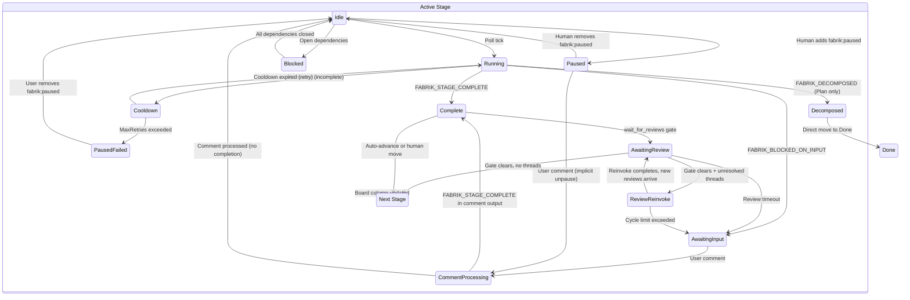

# Fabrik Issue State Machine

This document is the formal specification of Fabrik's issue-level state machine: how an issue moves between states across multiple invocations of the engine. It covers every reachable state, every event that triggers a transition, every label mutation, and every guard condition.

**Companion document:** [`stage-lifecycle.md`](stage-lifecycle.md) describes the per-invocation lifecycle (what happens before, during, and after a single Claude invocation). This document describes the cross-invocation state machine (how an issue progresses through the pipeline over time). They are complementary.

**As-built specification:** This document describes what the code actually does, not what it ideally should do. Discrepancies between intended and actual behavior are flagged with `> **Bug?:**` callout blocks.

**Source of truth for:** state enumeration, transition tables, label semantics, and guard conditions. Supersedes partial label references in CLAUDE.md.

---

## Pipeline Overview

Issues traverse a linear pipeline of stages, each corresponding to a column on the GitHub Project board:

```
Specify → Research → Plan → Implement → Review → Validate → Done
```

| Stage | Order | Read-Only | UpdateIssueBody | PostToPR | CreateDraftPR | MarkPRReady | WaitForReviews | CleanupWorktree |
|-------|-------|-----------|-----------------|----------|---------------|-------------|----------------|-----------------|
| Specify | 0 | Yes | Yes | No | No | No | No | No |
| Research | 1 | Yes | No | No | No | No | No | No |
| Plan | 2 | Yes | No | No | No | No | No | No |
| Implement | 3 | No | No | Yes | Yes | Yes | No | No |
| Review | 4 | No | No | Yes | No | Yes | Yes* | No |
| Validate | 5 | No | No | Yes | No | No | Yes* | No |
| Done | 99 | N/A | N/A | No | No | No | No | Yes |

\* All flags in this table reflect the **default stage configuration** shipped in `.fabrik/stages/`. Each flag is opt-in per stage YAML and may differ in custom configurations. `wait_for_reviews` is enabled for Review and Validate in the defaults.

---

## 1. State Enumeration

A state is defined by the tuple `(BoardColumn, ControllingLabelSet)`. Not every label combination is a valid state — only reachable combinations are enumerated.

### 1.1 Controlling Labels

These labels define distinct states (their presence changes what the engine does with an item):

| Label | Type | Defines State? |
|-------|------|----------------|
| `fabrik:locked:<user>` | Lock | Yes — gates processing by other instances |
| `fabrik:editing` | Mutex | Yes — prevents stage dispatch during comment processing |
| `fabrik:paused` | Pause | Yes — blocks all processing unless a comment arrives |
| `fabrik:awaiting-input` | Sub-pause | Yes (with `fabrik:paused`) — blocked-on-input variant |
| `fabrik:awaiting-review` | Gate | Yes — review gate is active |
| `fabrik:blocked` | Dependency | Yes — blocked by open dependency issues |
| `stage:<X>:in_progress` | Progress | Yes — a stage invocation is active |
| `stage:<X>:complete` | Completion | Yes — stage finished successfully |
| `stage:<X>:failed` | Failure | Yes — stage exhausted retry limit |

### 1.2 Modifier Labels (Guard Conditions)

These labels do not define distinct states but influence transition behavior:

| Label | Effect |
|-------|--------|
| `fabrik:yolo` | Forces auto-advance; triggers auto-merge at Validate; overrides `auto_advance: false` |
| `fabrik:cruise` | Forces auto-advance without auto-merge; stops at Validate completion; suppressed by yolo |
| `fabrik:unrestricted` | Passes `--dangerously-skip-permissions` to Claude Code |
| `model:<name>` | Selects a specific model for this issue (e.g., `model:opus`) |
| `effort:<level>` | Overrides stage effort level (`low`, `medium`, `high`, `max`); highest wins |
| `base:<branch>` | Overrides worktree base branch; must exist on remote |
| `fabrik:sub-issue` | Informational; marks issue as created by decomposition |

### 1.3 Reachable States by Board Column

For each board column, the reachable sub-states are listed. States are written as `Column + {labels}`. An issue in a column with no controlling labels is in the **Idle** sub-state for that column.

#### Specify / Research / Plan / Implement / Review / Validate (Active Stages)

Each active stage column has the same set of reachable sub-states:

| Sub-State | Labels Present | Description |
|-----------|---------------|-------------|
| **Idle** | (none of the controlling labels) | Ready for the engine to pick up |
| **Locked + In Progress** | `fabrik:locked:<user>`, `stage:<X>:in_progress` | Stage invocation is active |
| **Editing** | `fabrik:editing` | Comment processing is active (Claude invoked for comment review) |
| **Paused** | `fabrik:paused` | Manually paused or engine-escalated pause; no work until unpause or comment |
| **Paused + Failed** | `fabrik:paused`, `stage:<X>:failed` | Engine paused after MaxRetries exhausted |
| **Awaiting Input** | `fabrik:paused`, `fabrik:awaiting-input` | Claude signaled FABRIK_BLOCKED_ON_INPUT; waiting for user comment |
| **Awaiting Review** | `fabrik:awaiting-review`, `stage:<X>:complete` | Review gate active; waiting for PR reviewers (only on stages with `wait_for_reviews: true`) |
| **Blocked** | `fabrik:blocked` | Dependency gate active; waiting for blocking issues to close |
| **Complete** | `stage:<X>:complete` | Stage finished; waiting for advancement (manual or auto) |
| **Locked by Other** | `fabrik:locked:<other_user>` | Another Fabrik instance owns this issue |
| **Cooldown** | (no label; in-memory `processedSet` timestamp) | Stage attempted but didn't complete; waiting for cooldown to expire |

> **Note:** The Cooldown sub-state is purely in-memory — there is no label for it. The engine uses `processedSet[stageKey]` timestamps to enforce cooldown. On restart, cooldown state is lost and the item is retried immediately.

#### Done (Cleanup Stage)

| Sub-State | Labels Present | Description |
|-----------|---------------|-------------|
| **Pending Cleanup** | (none) | Worktree exists; engine will remove it |
| **Complete** | `stage:Done:complete` | Worktree removed; terminal state |
| **Paused** | `fabrik:paused` | Manually paused; cleanup skipped |

### 1.4 Label Semantics Reference

| Label | Added By | When Added | Removed By | When Removed | Gates |
|-------|----------|------------|------------|--------------|-------|
| `fabrik:locked:<user>` | `processItem` | Before stage invocation (lock-then-verify protocol) | `releaseLock` | On stage completion, permanent failure, blocked-on-input, decomposed, or lock conflict loss | Prevents other instances from processing the item |
| `fabrik:editing` | `processComments` | Step 2 of comment processing | `processComments` | Step 9 of comment processing (also on error paths) | Prevents `processItem` from starting a new stage invocation |
| `fabrik:paused` | `escalateFailedStage`, `blockOnInput`, `pauseForReviewTimeout`, `pauseForReviewCycleLimit`, `attemptMergeOnValidate` (on ErrNotMergeable) | After MaxRetries, FABRIK_BLOCKED_ON_INPUT, review timeout, review cycle limit, or unmergeable PR | User (manual removal), or `processItem` (on new comment that triggers unpause) | When user removes it manually, or user comments on a paused issue | Blocks all processing; user comment is an implicit resume |
| `fabrik:awaiting-input` | `blockOnInput`, `pauseForReviewTimeout`, `pauseForReviewCycleLimit` | After FABRIK_BLOCKED_ON_INPUT or review timeout/cycle limit | `unblockAwaitingInput` | When user comment arrives | Combined with `fabrik:paused`, identifies the "awaiting user input" pause variant |
| `fabrik:awaiting-review` | `handleStageComplete` (Path 1), `checkReviewGate` (Path 2) | Path 1: optimistically after stage completion when `wait_for_reviews: true` (does not check reviewer state — data is stale). Path 2: when `LinkedPRReviewRequests` is non-empty (real gate evaluation) | `checkReviewGate` (both natural clear and timeout paths) | When all reviewers submit, or when timeout elapses (removed by `checkReviewGate` before `pauseForReviewTimeout` is called) | Blocks auto-advance until review gate clears |
| `fabrik:blocked` | `checkDependencies` | When open blocking issues exist (first transition only — idempotent) | `checkDependencies` | When all blocking issues close | Blocks stage start (first stage is exempt) |
| `stage:<X>:in_progress` | `processItem` | After lock acquired and verified | `releaseLock` | Same as `fabrik:locked:<user>` | Informational — shows which stage is active on GitHub |
| `stage:<X>:complete` | `handleStageComplete`, `handleDecomposed`, cleanup stage handler | After Claude signals FABRIK_STAGE_COMPLETE or FABRIK_DECOMPOSED; or after worktree cleanup | Never removed | Permanent | Prevents re-invocation of the stage; triggers catch-up advancement |
| `stage:<X>:failed` | `escalateFailedStage` | After MaxRetries exhausted | `clearFailedStage` | When user removes `fabrik:paused` (manual unpause) | Indicates permanent failure; paired with `fabrik:paused` |
| `fabrik:yolo` | User (manual) | Any time | User (manual) | Any time | Forces auto-advance; triggers auto-merge at Validate; overrides `auto_advance: false` per stage |
| `fabrik:cruise` | User (manual) | Any time | User (manual) | Any time | Forces auto-advance without merge; stops at Validate; suppressed when yolo is also present |
| `fabrik:unrestricted` | User (manual) | Any time | User (manual) | Any time | Passes `--dangerously-skip-permissions` instead of `--permission-mode dontAsk` |
| `model:<name>` | User (manual) | Any time | User (manual) | Any time | Selects Claude model; first label wins if multiple present |
| `effort:<level>` | User (manual) | Any time | User (manual) | Any time | Overrides stage effort level; highest-ranked wins if multiple present |
| `base:<branch>` | User (manual) | Before Research (recommended) | User (manual) | Any time | Overrides worktree base branch; falls back to default if branch not found on remote |
| `fabrik:sub-issue` | Plan stage (via Claude) | During decomposition | N/A | N/A | Informational — marks sub-issues created by decomposition |

---

## 2. Event Enumeration

Nine distinct event types drive state transitions:

### 2.1 Poll Tick

**Trigger:** The engine's poll loop fires on a configurable interval (`PollSeconds`).

**Code path:** `poll()` → `itemMayNeedWork()` (shallow filter) → `FetchItemDetails()` (deep fetch) → `itemNeedsWork()` (full filter) → catch-up loop → dispatch loop → `processItem()`

**Effect:** The primary driver of all state transitions. Each poll cycle evaluates every item on the board through the filter chain and dispatches work for qualifying items.

### 2.2 New User Comment

**Trigger:** A user posts a comment on an issue or its linked PR. Detected by `findNewComments()` — filters out Fabrik-generated comments (prefix `🏭 **Fabrik`) and already-processed comments (ROCKET reaction or `processedSet` entry).

**Code path:** `itemNeedsWork()` detects new comments → `processItem()` routes to `processComments()` or triggers unpause/unblock

**Effect:** Can trigger three distinct behaviors:
1. **Unpause:** On a paused issue, the comment removes `fabrik:paused` (and clears failed state if present) and falls through to comment processing
2. **Unblock awaiting-input:** On an awaiting-input issue, removes both `fabrik:paused` and `fabrik:awaiting-input`, then routes to `processComments()`
3. **Comment processing:** On an active (non-paused) issue, routes directly to `processComments()`

### 2.3 PR Review Submitted

**Trigger:** A reviewer submits a review on the linked PR (APPROVED, CHANGES_REQUESTED, or COMMENTED). Changes `item.LinkedPRReviewRequests` — a submitted reviewer is removed from the outstanding requests list.

**Code path:** Detected by the catch-up loop in `poll()` via `checkReviewGate()`, which inspects `item.LinkedPRReviewRequests` after `FetchItemDetails()`

**Effect:** Can clear the review gate (all outstanding reviewers submitted), allowing auto-advance to proceed. Does not directly trigger a stage invocation.

### 2.4 PR Review Threads with Feedback

**Trigger:** Reviewers leave inline code comments on the linked PR in unresolved review threads. These are real GitHub comments with `DatabaseID`s.

**Code path:** Detected by `buildReviewThreadComments()` in the catch-up loop → `dispatchReviewReinvoke()` → async `processComments()` with synthetic comments

**Effect:** Triggers a review reinvocation cycle — the stage agent is re-invoked via `processComments()` with the review thread comments as input, allowing it to address reviewer feedback. This is a **distinct event type** from regular comment processing (see §6.2).

### 2.5 Blocking Issue Closed

**Trigger:** An issue listed in `item.BlockedBy` transitions to the CLOSED state.

**Code path:** `processItem()` → `checkDependencies()` inspects `item.BlockedBy[].State`

**Effect:** When all blocking issues are closed, `fabrik:blocked` is removed and the stage proceeds. The `fabrik:blocked` label forces deep-fetch bypass in `itemMayNeedWork()` so dependency state changes are detected even when the blocked issue's `updatedAt` hasn't changed.

### 2.6 Claude Output Markers

**Trigger:** Claude's output contains one of the Fabrik markers. Checked after each stage invocation.

**Markers and priority order** (enforced by the `if/else if` dispatch chain in `processItem()`):
1. `FABRIK_STAGE_COMPLETE` — highest priority; checked first via `checkCompletion()`
2. `FABRIK_DECOMPOSED` — checked second; only honored if `completed` is false and `err == nil`
3. `FABRIK_BLOCKED_ON_INPUT` — checked third; only honored if `completed` and `decomposed` are both false and `err == nil`

**Code path:** `processItem()` → outcome dispatch based on which marker is present

**Effect:**
- **FABRIK_STAGE_COMPLETE:** `handleStageComplete()` — adds completion label, potentially advances to next stage
- **FABRIK_DECOMPOSED:** `handleDecomposed()` — adds completion label, moves issue directly to Done
- **FABRIK_BLOCKED_ON_INPUT:** `blockOnInput()` — adds `fabrik:paused` + `fabrik:awaiting-input`
- **None of the above:** cooldown retry path; eventually `escalateFailedStage()` if MaxRetries exceeded

### 2.7 Manual Label Change

**Trigger:** A human adds or removes a label on the issue via the GitHub UI.

**Code path:** Detected on the next poll cycle when labels are fetched

**Effect varies by label:**
- Adding `fabrik:paused` → engine skips the item (unless a comment arrives)
- Removing `fabrik:paused` from a failed issue → `clearFailedStage()` resets retry state
- Adding `fabrik:yolo` or `fabrik:cruise` → enables auto-advance (even mid-run, due to label re-fetch in `handleStageComplete()`)
- Adding `model:<name>` or `effort:<level>` → takes effect on next Claude invocation

### 2.8 Issue Closed

**Trigger:** The issue is closed on GitHub (e.g., by PR merge with `Closes #N`).

**Code path:** `itemMayNeedWork()` and `itemNeedsWork()` check `item.IsClosed`

**Effect:** Closed issues are skipped unless:
1. The current stage is a cleanup stage (`CleanupWorktree: true`) — cleanup can remove the worktree
2. The current stage has a `stage:<X>:complete` label — the catch-up loop can advance to the next stage (e.g., a PR merge closes an issue sitting in Validate with `stage:Validate:complete`; it needs to move to Done)

### 2.9 Review Reinvoke

**Trigger:** The catch-up loop detects unresolved PR review thread comments after the review gate clears.

**Code path:** `poll()` catch-up loop → `buildReviewThreadComments()` → cycle limit check → `dispatchReviewReinvoke()` → async goroutine → `processComments()` with synthetic comments

**Distinct from regular comment processing because:**
- Uses synthetic comments derived from PR review threads (`LinkedPRReviewThreadComments`), not issue comments
- Has cycle limits (`MaxReviewCycles`, default 5) — exceeding pauses the issue
- Has timeout integration (review wait timeout can also trigger pause)
- Dispatches asynchronously via goroutine with semaphore slot
- The `inFlight` guard prevents double-dispatch across poll cycles
- Resolves review threads (marks them resolved on GitHub) after processing

---

## 3. Transition Tables

### 3.1 Happy Path — Linear Stage Progression

This table shows the normal flow when an issue progresses through the pipeline without interruption.

| Current State | Event | Guard | Resulting State | Labels Added | Labels Removed | Side Effects |
|--------------|-------|-------|-----------------|--------------|----------------|--------------|
| Column `<X>`, Idle | Poll tick | Stage exists, not paused/locked/editing/blocked, cooldown expired | Column `<X>`, Locked + In Progress | `fabrik:locked:<user>`, `stage:<X>:in_progress` | | Lock-then-verify protocol (2s delay), worktree ensured, Claude invoked |
| Column `<X>`, Locked + In Progress | FABRIK_STAGE_COMPLETE | shouldAdvance=false (see below) | Column `<X>`, Complete | `stage:<X>:complete` | `fabrik:locked:<user>`, `stage:<X>:in_progress`, `stage:<X>:failed` (if present) | Output posted; draft PR created (if `create_draft_pr`); PR marked ready (if `mark_pr_ready_on_complete`); lock released |
| Column `<X>`, Complete | Human moves to next column | — | Column `<Y>`, Idle | | | Manual board column move |
| Column `<X>`, Locked + In Progress | FABRIK_STAGE_COMPLETE | shouldAdvance=true (see below) | Column `<Y>`, Idle | `stage:<X>:complete` | `fabrik:locked:<user>`, `stage:<X>:in_progress`, `stage:<X>:failed` (if present) | Output posted; draft PR / mark ready (if configured); board column updated to next stage; lock released |
| Column `<X>`, Complete | Poll tick (catch-up) | yolo or cruise active, `stage:<X>:complete` present, no pending comments | Column `<Y>`, Idle | | | Board column updated to next stage (Path 2 advancement) |

**`shouldAdvance` resolution (Path 1, `handleStageComplete`):**

1. `yoloActive = cfg.Yolo || hasYoloLabel(item)` — re-fetches labels first to pick up mid-run changes
2. `cruiseActive = !yoloActive && hasCruiseLabel(item)` — suppressed when yolo is active
3. `shouldAdvance = yoloActive || cruiseActive`
4. If `stage.AutoAdvance != nil` AND neither `fabrik:yolo` nor `fabrik:cruise` label is present: `shouldAdvance = *stage.AutoAdvance` — this means `auto_advance: false` in YAML overrides `cfg.Yolo` (the `--yolo` flag), but explicit yolo/cruise labels override `auto_advance: false`
5. If `cruiseActive && stage.Name == "Validate"`: `shouldAdvance = false` — cruise stops at Validate

**Catch-up loop `shouldAdvance` resolution (Path 2):** The catch-up loop first checks `cfg.Yolo || hasYoloLabel(item) || hasCruiseLabel(item)` — items without any of these are skipped entirely. Then: if neither yolo nor cruise LABEL is present and `stage.AutoAdvance` is explicitly false, the item is skipped. This produces the same behavior as Path 1.

**Validate → Done special cases:**

| Current State | Event | Guard | Resulting State | Labels Added | Labels Removed | Side Effects |
|--------------|-------|-------|-----------------|--------------|----------------|--------------|
| Validate, Locked + In Progress | FABRIK_STAGE_COMPLETE | yolo active | Done, Pending Cleanup | `stage:Validate:complete` | `fabrik:locked:<user>`, `stage:Validate:in_progress` | PR merged; board column updated to Done |
| Validate, Complete | Poll tick (catch-up) | yolo active | Done, Pending Cleanup | | | PR merged; board column updated to Done |
| Validate, Locked + In Progress | FABRIK_STAGE_COMPLETE | cruise active (no yolo) | Validate, Complete | `stage:Validate:complete` | `fabrik:locked:<user>`, `stage:Validate:in_progress` | Cruise stops here — no merge, no advancement to Done |
| Validate, Complete | Poll tick (catch-up) | cruise active (no yolo) | Validate, Complete | | | Cruise catch-up skips Validate — no merge, no advancement |
| Done, Pending Cleanup | Poll tick | Worktree exists on disk | Done, Complete | `stage:Done:complete` | | Worktree removed from disk |

### 3.2 Off-Path Transitions

#### Pause / Unpause

| Current State | Event | Guard | Resulting State | Labels Added | Labels Removed | Side Effects |
|--------------|-------|-------|-----------------|--------------|----------------|--------------|
| Any active column, Idle | Human adds `fabrik:paused` | — | Same column, Paused | | | Engine skips item on next poll |
| Same column, Paused | Human removes `fabrik:paused` | — | Same column, Idle | | | Engine processes item on next poll |
| Same column, Paused | New user comment | — | Same column, Idle → comment processing | | `fabrik:paused` | Unpause; `clearFailedStage()` also called (clears any failed label + resets retries); falls through to `processComments()` |

#### Lock Conflict (Multi-Instance)

| Current State | Event | Guard | Resulting State | Labels Added | Labels Removed | Side Effects |
|--------------|-------|-------|-----------------|--------------|----------------|--------------|
| Any column, Idle | Poll tick (two instances) | Both acquire lock | Depends on tie-break | `fabrik:locked:<user>` (both) | Loser's lock removed | 2s verify delay; lexicographic tie-break: lower username wins, higher username yields |
| Any column, Locked by Other | Poll tick | `fabrik:locked:<other>` present | Same (skipped) | | | `itemNeedsWork` returns false; `processItem` also checks and skips |

#### Dependency Blocking

| Current State | Event | Guard | Resulting State | Labels Added | Labels Removed | Side Effects |
|--------------|-------|-------|-----------------|--------------|----------------|--------------|
| Any column (not first stage), Idle | Poll tick | Open blockers in `item.BlockedBy` | Same column, Blocked | `fabrik:blocked` | | Comment posted listing blockers (first time only); TUI event emitted |
| Same column, Blocked | Poll tick | All blockers now CLOSED | Same column, Idle | | `fabrik:blocked` | Item eligible for processing on next poll |
| First stage, Idle | Poll tick | Open blockers exist | Same column, Idle | | | First stage is exempt from dependency blocking |

#### Awaiting Input (FABRIK_BLOCKED_ON_INPUT)

| Current State | Event | Guard | Resulting State | Labels Added | Labels Removed | Side Effects |
|--------------|-------|-------|-----------------|--------------|----------------|--------------|
| Column `<X>`, Locked + In Progress | FABRIK_BLOCKED_ON_INPUT | `completed` and `decomposed` both false, no error | Same column, Awaiting Input | `fabrik:paused`, `fabrik:awaiting-input` | `fabrik:locked:<user>`, `stage:<X>:in_progress` | Lock released |
| Same column, Awaiting Input | New user comment | — | Same column → comment processing | | `fabrik:paused`, `fabrik:awaiting-input` | `unblockAwaitingInput()` clears processedSet entry; routes to `processComments()` |

#### Awaiting Review (wait_for_reviews gate)

| Current State | Event | Guard | Resulting State | Labels Added | Labels Removed | Side Effects |
|--------------|-------|-------|-----------------|--------------|----------------|--------------|
| Column `<X>`, Locked + In Progress | FABRIK_STAGE_COMPLETE | `wait_for_reviews: true`, shouldAdvance | Same column, Awaiting Review | `stage:<X>:complete`, `fabrik:awaiting-review` | `fabrik:locked:<user>`, `stage:<X>:in_progress` | Path 1: optimistic label application; lock released; returns without advancing |
| Same column, Awaiting Review + Complete | Poll tick (catch-up) | Outstanding reviewers remain, not timed out | Same (blocked) | `fabrik:awaiting-review` (idempotent) | | checkReviewGate logs pending reviewers |
| Same column, Awaiting Review + Complete | PR review submitted | All reviewers submitted | Same column, Complete → advance | | `fabrik:awaiting-review` | Gate cleared; falls through to advance or review reinvoke |
| Same column, Awaiting Review + Complete | Poll tick (catch-up) | Timeout elapsed | Same column, Awaiting Input | `fabrik:paused`, `fabrik:awaiting-input` | `fabrik:awaiting-review` | `pauseForReviewTimeout()` posts explanatory comment |

#### Cooldown Retry and Failed Stage Escalation

| Current State | Event | Guard | Resulting State | Labels Added | Labels Removed | Side Effects |
|--------------|-------|-------|-----------------|--------------|----------------|--------------|
| Column `<X>`, Locked + In Progress | No marker in output | `claudeRan` is true (includes both error-free runs and runs that errored mid-execution; excludes only start failures like binary-not-found) | Same column, Cooldown | | | `processedSet[stageKey]` updated; cooldown = `PollSeconds * 10`; lock NOT released (stays locked through retries) |
| Same column, Cooldown | Poll tick | Cooldown expired | Same column, Locked + In Progress (retry) | | `stage:<X>:failed` (if present from prior escalation) | Claude re-invoked with `resume=true` |
| Same column, Cooldown | Retry count ≥ MaxRetries | `claudeRan && MaxRetries > 0` | Same column, Paused + Failed | `fabrik:paused`, `stage:<X>:failed` | `fabrik:locked:<user>`, `stage:<X>:in_progress` | `escalateFailedStage()` posts comment; lock released |
| Same column, Paused + Failed | Human removes `fabrik:paused` | `stage:<X>:failed` present OR `pausedDueToRetries` in memory | Same column, Idle | | `stage:<X>:failed` | `clearFailedStage()` resets retryCount, pausedDueToRetries, processedSet, reviewCycleCount |

#### Cleanup Stage

| Current State | Event | Guard | Resulting State | Labels Added | Labels Removed | Side Effects |
|--------------|-------|-------|-----------------|--------------|----------------|--------------|
| Done, Pending Cleanup | Poll tick | Worktree exists, not paused, not already complete | Done, Complete | `stage:Done:complete` | | Worktree removed; no lock/Claude/comment processing |
| Done, Complete | Poll tick | Already complete | Done, Complete (no-op) | | | Skipped by both `itemMayNeedWork` and `processItem` |

#### Review Reinvoke

| Current State | Event | Guard | Resulting State | Labels Added | Labels Removed | Side Effects |
|--------------|-------|-------|-----------------|--------------|----------------|--------------|
| Column `<X>`, Awaiting Review + Complete | Review gate clears + unresolved thread comments | Not in-flight, cycle count < MaxReviewCycles | Same column (comment processing via async goroutine) | `fabrik:editing` (during processing) | | `dispatchReviewReinvoke()` spawns goroutine; `reviewCycleCount` incremented; `inFlight` set; semaphore acquired |
| Column `<X>`, Awaiting Review + Complete | Review gate clears + unresolved thread comments | Cycle count ≥ MaxReviewCycles | Same column, Awaiting Input | `fabrik:paused`, `fabrik:awaiting-input` | | `pauseForReviewCycleLimit()` posts comment |
| Column `<X>`, Awaiting Review + Complete | Review gate clears + unresolved thread comments | Already in-flight | Same (skipped) | | | Previous reinvoke goroutine still running; skipped entirely (no cycle-limit check) |

---

## 4. Comment Processing Lifecycle

When new comments are detected on an issue (or synthetic review comments on a PR), the engine processes them through `processComments()`. This is an 11-step flow.

### 4.1 Comment Detection

`findNewComments()` filters `item.Comments` to find unprocessed comments:

1. Skip comments already in `processedSet` (in-memory, session-scoped)
2. Skip comments with body starting with `🏭 **Fabrik` (engine-generated output)
3. Skip comments with a ROCKET (🚀) reaction (durable cross-restart marker)

> **Invariant:** every engine-emitted `AddComment` call must start with `🏭 **Fabrik — <context>**`. This is an engine-wide convention enforced by `TestAddCommentCompliance` in `engine/compliance_test.go`, not just a detection heuristic.

### 4.2 The 11-Step Flow

| Step | Action | Code | Side Effects |
|------|--------|------|--------------|
| 1 | React with 👀 to all new comments | `AddCommentReaction("eyes")` / `AddPRReviewCommentReaction("eyes")` | Signals acknowledgment to the user |
| 2 | Add `fabrik:editing` label | `AddLabelToIssue("fabrik:editing")` | Prevents `processItem` from starting a new stage invocation |
| 3 | Ensure worktree exists | `EnsureWorktree()` | Creates or updates worktree; writes context files |
| 4 | Invoke Claude with comment review prompt | `InvokeForComments()` | Uses `comment_prompt` / `comment_skill` and `comment_max_turns` |
| 5 | Check for FABRIK_STAGE_COMPLETE in output | `checkCompletion()` | Determines if comment processing resolved the stage |
| 6 | Extract and apply FABRIK_ISSUE_UPDATE if present | `extractUpdatedBody()` | Only applied if `update_issue_body: true` |
| 7 | Strip all Fabrik markers from output | `stripLine()` calls | Removes FABRIK_STAGE_COMPLETE, FABRIK_BLOCKED_ON_INPUT, FABRIK_DECOMPOSED, FABRIK_SUMMARY_BEGIN/END |
| 8 | Post or update stage comment | `AddComment()` / `UpdateComment()` | For `post_to_pr` stages: always posts new comment on issue (labeled as "comment review"); for other stages: rewrites existing stage comment or creates new one |
| 9 | Remove `fabrik:editing` label | `RemoveLabelFromIssue("fabrik:editing")` | Releases the editing mutex |
| 10 | React with 🚀 to all processed comments + resolve review threads | `AddCommentReaction("rocket")` / `AddPRReviewCommentReaction("rocket")` + `ResolveReviewThread()` | Marks comments as processed (durable); resolves addressed review threads |
| 11 | If FABRIK_STAGE_COMPLETE was detected: handle completion | `handleStageComplete()` | Same completion flow as a normal stage invocation (advance, PR ops, etc.) |

### 4.3 Comment Processing Entry Points

Comments can trigger processing through three paths in `processItem()`:

1. **Awaiting-input unblock:** `isAwaitingInput(item)` is true + new comments → `unblockAwaitingInput()` → `processComments()`
2. **Paused unpause:** `fabrik:paused` present + new comments → remove `fabrik:paused`, `clearFailedStage()` → fall through → `processComments()`
3. **Normal comment processing:** Item is not paused → `findNewComments()` finds comments → `processComments()`

### 4.4 markCommentsSeenByStage

After a stage invocation (not comment processing), `markCommentsSeenByStage()` adds ROCKET reactions to all pre-existing comments that were included in the prompt as context. This prevents those comments from triggering the awaiting-input unblock logic on subsequent polls.

---

## 5. PR Lifecycle Integration

### 5.1 Draft PR Creation

**When:** After a stage signals FABRIK_STAGE_COMPLETE, if the stage has `create_draft_pr: true`.

**Code path:** `processItem()` → `ensureDraftPR()`

**Flow:**
1. Check for existing PR via `FindPRForIssue()` — if found, ensure body contains `Closes #N` and return
2. Push the issue branch via `PushBranch()`
3. Create draft PR via `CreateDraftPR()` with title from issue, targeting `baseBranch`, body containing `Closes #N`

### 5.2 Mark PR Ready

**When:** After a stage signals FABRIK_STAGE_COMPLETE, if the stage has `mark_pr_ready_on_complete: true`.

**Code path:** `processItem()` → `markPRReady()`

**Flow:**
1. Push the issue branch
2. Find PR number (uses `knownPR` from `ensureDraftPR` if available, else `FindPRForIssue()`)
3. `MarkPRReady()` transitions draft → ready-for-review

**Note:** This triggers external review bots and populates `LinkedPRReviewRequests`, which is why the review gate in `handleStageComplete()` (Path 1) is always optimistic — reviewer data is stale at that point.

### 5.3 Linked PR Discovery

Fabrik discovers PR comments through the `closedByPullRequestsReferences` GraphQL field, which traverses issue → linked PRs → PR comments. The `Closes #N` keyword in the PR body creates this linkage.

### 5.4 Auto-Merge on Validate

**When:** Validate stage completes and yolo is active (either `cfg.Yolo` or `fabrik:yolo` label).

**Code path:** `handleStageComplete()` → `attemptMergeOnValidate()` (Path 1); or catch-up loop → `attemptMergeOnValidate()` (Path 2)

**Flow:**
1. Find linked PR via `FindPRForIssue()`
2. Attempt merge via `MergePR()`
3. On `ErrNotMergeable`: post comment, add `fabrik:paused`, return error (prevents completion label from being added, allowing retry)
4. On other API errors: return error (same retry behavior)
5. On success: log and return nil

**Important — Path 1 vs Path 2 distinction:** In Path 1 (`handleStageComplete`), the merge runs BEFORE adding `stage:Validate:complete`. On merge failure, the completion label is not added, so `itemNeedsWork` won't skip the stage and the engine can retry the entire Validate invocation after cooldown. In Path 2 (catch-up loop), the completion label already exists when `attemptMergeOnValidate()` runs (the catch-up loop operates on items with `stage:Validate:complete`). A merge failure in Path 2 pauses the issue but does NOT remove the completion label — the stage will not be re-invoked; only the merge attempt will be retried after unpausing.

---

## 6. Review Gate and Review Reinvoke

### 6.1 Two-Phase Review Gate

The review gate has two paths that handle different timing scenarios:

**Path 1: `handleStageComplete()` (inside worker goroutine)**
- Runs immediately after a stage completes
- Reviewer data is STALE (reviewers are assigned only after `MarkPRReady`, which just ran)
- Optimistically applies `fabrik:awaiting-review` label
- Returns without advancing — defers to Path 2

**Path 2: Catch-up loop in `poll()` (in poll goroutine)**
- Runs on subsequent poll cycles for items with `stage:<X>:complete`
- Has FRESH reviewer data from `FetchItemDetails()`
- Calls `checkReviewGate()` for the real gate evaluation
- Three outcomes:
  - `(blocked=true, timedOut=false)` — still waiting; `fabrik:awaiting-review` maintained
  - `(blocked=false, timedOut=false)` — gate cleared naturally; `fabrik:awaiting-review` removed; advance or reinvoke
  - `(blocked=false, timedOut=true)` — gate cleared by timeout; `fabrik:awaiting-review` removed; `pauseForReviewTimeout()` pauses issue

### 6.2 Review Reinvoke Mechanics

After the review gate clears (Path 2), if there are unresolved PR review thread comments with actionable content:

1. `buildReviewThreadComments()` collects inline comments from unresolved review threads that haven't been processed (no ROCKET reaction, not in `processedSet`)
2. **inFlight guard:** If a reinvoke goroutine from a previous poll cycle is still running, the entire reinvoke path is skipped (including cycle-limit checks)
3. **Cycle limit check:** `reviewCycleCount[stageKey]` is compared against `MaxReviewCycles` (default 5)
   - If exceeded: `pauseForReviewCycleLimit()` adds `fabrik:paused` + `fabrik:awaiting-input` and posts comment
   - If not exceeded: increment count, dispatch reinvoke
4. `dispatchReviewReinvoke()` spawns an async goroutine:
   - Marks item in `inFlight` (prevents double-dispatch by dispatch loop)
   - Acquires semaphore slot (respects `MaxConcurrent`)
   - Calls `processComments()` with the synthetic review comments
   - On exit: releases semaphore, clears `inFlight`

**Review thread resolution:** Step 10 of `processComments()` resolves addressed review threads via `ResolveReviewThread()` after adding ROCKET reactions.

### 6.3 Review Reinvoke vs Regular Comment Processing

| Aspect | Regular Comments | Review Reinvoke |
|--------|-----------------|-----------------|
| Source | `item.Comments` (issue comments) | `item.LinkedPRReviewThreadComments` (PR inline comments) |
| Detection | `findNewComments()` | `buildReviewThreadComments()` |
| Dispatch | Synchronous in `processItem()` | Async goroutine via `dispatchReviewReinvoke()` |
| Cycle limits | None | `MaxReviewCycles` (default 5) |
| Timeout | None | Integrated with `ReviewWaitTimeout` |
| Thread resolution | No | Yes — resolves review threads after processing |
| inFlight guard | Uses dispatch loop's `inFlight` check | Has its own `inFlight` check in catch-up loop |

### 6.4 Decompose Path

**Trigger:** Claude outputs `FABRIK_DECOMPOSED` marker (expected only from Plan stage).

**Marker priority:** `FABRIK_STAGE_COMPLETE` > `FABRIK_DECOMPOSED` > `FABRIK_BLOCKED_ON_INPUT`. If `completed` is true, `decomposed` is not checked. Both `decomposed` and `blockedOnInput` require `err == nil`.

**Code path:** `processItem()` → `handleDecomposed()`

**Flow:**
1. Add `stage:<X>:complete` label (prevents re-invocation on restart)
2. Look up "Done" column on the project board
3. Move the issue directly to Done, bypassing all remaining pipeline stages

**References:** [ADR-017: Decomposed Marker State Machine](../adrs/017-decomposed-marker-state-machine.md)

---

## 7. Edge Case States

### 7.1 Cooldown Retry

When Claude runs but does not output any completion marker, the engine enters a cooldown retry loop. This applies both when Claude exits cleanly without a marker and when it exits with an error (e.g., timeout, crash). Only start failures (binary not found, `exec.Error`, `os.PathError`) skip the cooldown — the item is retried on the next poll instead.

- **Cooldown duration:** `PollSeconds * 10` (e.g., 30s poll → 300s cooldown)
- **State:** In-memory only (`processedSet[stageKey]` timestamp). No label is added for cooldown.
- **Lock behavior:** The lock (`fabrik:locked:<user>` and `stage:<X>:in_progress`) is NOT released during cooldown. This prevents other instances from picking up the item.
- **Resume behavior:** On retry, `resume=true` is passed to Claude (resumes the session rather than starting fresh)
- **On restart:** Cooldown state is lost. The lock label is still present but `lockedIssues` in-memory map is empty — the shutdown cleanup removes lock labels. If the process crashes without cleanup, the lock label remains as a stale artifact until another instance or manual cleanup removes it.

### 7.2 Failed Stage / Pause on Retry Limit

When a stage fails `MaxRetries` times (default: configurable, 0 disables):

1. `escalateFailedStage()` adds `fabrik:paused` + `stage:<X>:failed`
2. Posts an explanatory comment
3. Sets `pausedDueToRetries[stageKey] = true` in memory
4. Releases the lock

**Recovery:** User investigates, makes fixes, then removes `fabrik:paused`. On next poll, `processItem()` detects the failed label (or in-memory `pausedDueToRetries`) and calls `clearFailedStage()`, which:
- Removes `stage:<X>:failed`
- Resets `retryCount`, `pausedDueToRetries`, `processedSet` (clears cooldown), and `reviewCycleCount`

### 7.3 Multi-Instance Lock Protocol

Per [ADR-007](../adrs/007-label-based-locking.md):

1. Instance acquires `fabrik:locked:<user>` label
2. Waits `lockVerifyDelay` (2 seconds) for competing instances to place their locks
3. Re-fetches labels via `FetchLabels()`
4. If another `fabrik:locked:*` label is present: **lexicographic tie-break** — lower username wins (proceeds), higher username loses (releases lock and skips)
5. Winner proceeds with stage invocation; loser returns nil

**Edge cases:**
- Identical usernames: both proceed (unsupported configuration)
- API error on re-fetch: winner proceeds (optimistic; logs warning)
- Lock is released on: completion, permanent failure (MaxRetries), blocked-on-input, decomposed, or lock conflict loss. NOT released on cooldown retry.

### 7.4 Closed-Issue Catch-Up

Closed issues are normally skipped by `itemMayNeedWork()` and `itemNeedsWork()`. Exceptions:

1. **Cleanup stages:** A closed issue in Done with a worktree still needs cleanup
2. **Complete-labeled items:** A closed issue with `stage:<X>:complete` can be advanced by the catch-up loop (e.g., PR merge closes the issue while it's in Validate with the complete label — it needs to move to Done)

**Stale lock cleanup:** `cleanupClosedIssueLocks()` runs every poll cycle and removes `fabrik:locked:<user>` labels from any closed issues on the board. This handles stale locks left when an issue was closed while a stage was in-flight.

### 7.5 In-Memory vs Durable State

| State | In-Memory | Durable (Label/Reaction) | Behavior on Restart |
|-------|-----------|--------------------------|---------------------|
| Cooldown timer | `processedSet[stageKey]` | None | Lost — item retried immediately |
| Retry count | `retryCount[stageKey]` | None | Lost — retries restart from 0 |
| Paused-due-to-retries | `pausedDueToRetries[stageKey]` | `fabrik:paused` + `stage:<X>:failed` | Labels survive; in-memory flag lost but `processItem()` detects the failed label directly |
| Review cycle count | `reviewCycleCount[stageKey]` | None | Lost — cycle count restarts from 0 |
| Comment processed | `processedSet[key]` | ROCKET (🚀) reaction | Reaction survives restart; in-memory dedup is defense-in-depth |
| Lock tracking | `lockedIssues[iKey]` | `fabrik:locked:<user>` label | Label may survive if process crashes; `cleanupLockedIssues()` runs on graceful shutdown |
| Last updatedAt | `lastUpdatedAt[iKey]` | None | Lost — all items re-evaluated on first poll |
| Deep-fetch failure | `deepFetchFailureTime[iKey]` | None | Lost — failed items retried immediately |

---

## 8. Invalid / Unexpected States

The engine handles unexpected label combinations (from manual human manipulation) through its guard chain. The behavior is defined by the order of checks in `itemMayNeedWork()`, `itemNeedsWork()`, and `processItem()`.

### 8.1 Guard Chain Order in `processItem()`

Guards are checked in this order. The first matching guard determines behavior:

| Priority | Guard | Check | Behavior |
|----------|-------|-------|----------|
| 1 | No matching stage | `FindStage(stages, item.Status) == nil` | Skip (return nil) |
| 2 | Repo not ready | `ensureRepoReady()` fails | Skip (ErrSkipItem) or return error |
| 3 | Locked by other user | `fabrik:locked:<other>` present | Skip with log |
| 4 | Editing | `fabrik:editing` present | Skip with log |
| 5 | Awaiting input + comment | `isAwaitingInput()` + new comments | Unblock → comment processing |
| 6 | Awaiting input, no comment | `isAwaitingInput()` | Skip with log |
| 7 | Paused + comment | `fabrik:paused` + new comments | Unpause → fall through |
| 8 | Paused, no comment | `fabrik:paused` | Skip with log |
| 9 | Dependencies blocked | `checkDependencies()` returns true | Skip (label + comment handled by checkDependencies) |
| 10 | Cleanup stage | `stage.CleanupWorktree` | Remove worktree, add complete label |
| 11 | Failed label + unpause detection | `stage:<X>:failed` present or `pausedDueToRetries` | `clearFailedStage()` then continue |
| 12 | New comments | `findNewComments()` non-empty | `processComments()` |
| 13 | PR item | `item.IsPR` | Skip (PRs only support comments) |
| 14 | Stage complete | `stage:<X>:complete` present | Skip |
| 15 | Cooldown active | `processedSet[stageKey]` within cooldown | Skip |
| 16 | (all guards pass) | — | Acquire lock → invoke Claude |

### 8.2 Notable Unexpected Scenarios

**`fabrik:editing` without active comment processing:**
If a human manually adds `fabrik:editing`, the engine skips the item (guard 4). The label must be manually removed for processing to resume.

**`stage:<X>:complete` without board column advancement:**
The item is skipped by guard 14 in `processItem()`. The catch-up loop will attempt to advance it if yolo/cruise/autoAdvance is active. Without auto-advance, it waits for a human to move the board column.

**`fabrik:paused` on a complete item:**
The catch-up loop checks `fabrik:paused` and skips paused items. The item will not be advanced until unpaused.

**`fabrik:awaiting-review` without `stage:<X>:complete`:**
The catch-up loop only processes items with the complete label, so `fabrik:awaiting-review` alone has no effect in the catch-up path. In `processItem()`, the label is not checked — it's only relevant in the catch-up loop.

**`stage:<X>:failed` without `fabrik:paused`:**
`processItem()` guard 11 detects this as an "unpause" scenario — the user has already removed `fabrik:paused`, so `clearFailedStage()` resets retry state and processing continues.

**Multiple `stage:<X>:in_progress` labels:**
No special handling. Each is independent. The engine only checks the in_progress label for the current stage's column.

> **Bug?:** The catch-up loop checks `fabrik:paused` but does NOT check `fabrik:editing`. If a human manually applies `stage:<X>:complete` while `fabrik:editing` is on, the catch-up loop would attempt to advance the item. In practice, `fabrik:editing` is only present during the brief window of comment processing (seconds to minutes), making this race unlikely but theoretically possible.

---

## 9. Concurrency Model

### 9.1 Semaphore

`Engine.sem` is a buffered channel of size `MaxConcurrent` (default 5). Both the dispatch loop and `dispatchReviewReinvoke()` acquire slots from this semaphore before invoking Claude.

### 9.2 inFlight Map

`Engine.inFlight` (`sync.Map`) tracks items currently being processed by worker goroutines. Key: `issueKey` string, Value: `bool` (isPR).

- **Set by:** dispatch loop (before goroutine launch) and `dispatchReviewReinvoke()` (inside goroutine, before semaphore acquire)
- **Cleared by:** goroutine defer (after `processItem()` or `processComments()` returns)
- **Used by:** dispatch loop (skip already in-flight items) and catch-up loop (skip reinvoke if already in-flight)

### 9.3 Worktree Mutex

Git operations that write `.git/config` are not concurrent-safe. `WorktreeManager.mu` serializes worktree creation and updates within a single repo.

### 9.4 Catch-Up vs Dispatch Ordering

Within a single `poll()` call:

1. **Catch-up loop** runs first — processes items with `stage:<X>:complete` labels for yolo/cruise advancement, review gate evaluation, and review reinvoke dispatch
2. **Dispatch loop** runs second — processes items that need stage invocations or comment processing

The `advancedItems` map prevents items advanced by the catch-up loop from having their `lastUpdatedAt` re-cached (which would make them invisible on the next poll). The `inFlight` map prevents items dispatched by `dispatchReviewReinvoke()` in the catch-up loop from being double-dispatched by the dispatch loop.

### 9.5 processedSet Mutex

`Engine.mu` (sync.Mutex) protects all in-memory state maps: `processedSet`, `lockedIssues`, `retryCount`, `pausedDueToRetries`, `reviewCycleCount`, `lastUpdatedAt`, `deepFetchFailureTime`, `lastUsage`, `lastCompleted`, `lastBlocked`, `totalTokens`, `lastReportedCost`. Critical sections are kept small — typically a single map read/write.

---

## 10. State Diagrams

### 10.1 Happy Path — Linear Stage Progression

```mermaid
stateDiagram-v2
    direction LR

    [*] --> Specify_Idle : Issue added to board
    Specify_Idle --> Specify_Running : Poll tick
    Specify_Running --> Specify_Complete : FABRIK_STAGE_COMPLETE

    Specify_Complete --> Research_Idle : Auto-advance or human move
    Research_Idle --> Research_Running : Poll tick
    Research_Running --> Research_Complete : FABRIK_STAGE_COMPLETE

    Research_Complete --> Plan_Idle : Auto-advance or human move
    Plan_Idle --> Plan_Running : Poll tick
    Plan_Running --> Plan_Complete : FABRIK_STAGE_COMPLETE

    Plan_Complete --> Implement_Idle : Auto-advance or human move
    Implement_Idle --> Implement_Running : Poll tick
    Implement_Running --> Implement_Complete : FABRIK_STAGE_COMPLETE
    note right of Implement_Running : Draft PR created\nPR marked ready

    Implement_Complete --> Review_Idle : Auto-advance or human move
    Review_Idle --> Review_Running : Poll tick
    Review_Running --> Review_Complete : FABRIK_STAGE_COMPLETE

    Review_Complete --> Validate_Idle : Auto-advance or human move
    Validate_Idle --> Validate_Running : Poll tick
    Validate_Running --> Validate_Complete : FABRIK_STAGE_COMPLETE
    Validate_Complete --> Done_Pending : Yolo: merge + advance

    Done_Pending --> Done_Complete : Worktree cleaned up
    Done_Complete --> [*]
```



### 10.2 Off-Path Flows



### 10.3 Review Reinvoke Cycle

```mermaid
stateDiagram-v2
    direction TB

    StageComplete --> CheckReviewGate : Catch-up loop (Path 2)
    CheckReviewGate --> WaitingForReviewers : Outstanding reviewers
    CheckReviewGate --> TimedOut : Timeout elapsed
    CheckReviewGate --> GateCleared : All reviewers submitted

    WaitingForReviewers --> CheckReviewGate : Next poll tick

    TimedOut --> PausedForTimeout : pauseForReviewTimeout()
    note right of PausedForTimeout : fabrik:paused\nfabrik:awaiting-input

    GateCleared --> CheckThreads : buildReviewThreadComments()
    CheckThreads --> Advance : No unresolved threads
    CheckThreads --> CheckInFlight : Unresolved threads exist

    CheckInFlight --> SkipReinvoke : Already in-flight
    CheckInFlight --> CheckCycleLimit : Not in-flight

    CheckCycleLimit --> PausedForCycles : cycleCount >= MaxReviewCycles
    note right of PausedForCycles : fabrik:paused\nfabrik:awaiting-input

    CheckCycleLimit --> DispatchReinvoke : cycleCount < MaxReviewCycles
    DispatchReinvoke --> ProcessComments : Async goroutine
    ProcessComments --> CheckReviewGate : Next poll (if new reviews arrive)
    ProcessComments --> Advance : Stage complete after addressing feedback

    SkipReinvoke --> CheckReviewGate : Next poll tick
```

---

## Appendix A: Two Paths to Stage Advancement

Stage advancement can occur through two code paths:

| Aspect | Path 1: `handleStageComplete()` | Path 2: Catch-up loop in `poll()` |
|--------|--------------------------------|-----------------------------------|
| **Runs in** | Worker goroutine | Poll goroutine |
| **Triggered by** | Claude outputs FABRIK_STAGE_COMPLETE | Poll cycle finds `stage:<X>:complete` label |
| **Review data** | Stale (just ran MarkPRReady) | Fresh (from FetchItemDetails) |
| **Review gate** | Optimistic: applies `fabrik:awaiting-review`, returns | Real: calls `checkReviewGate()`, evaluates timeout |
| **Label freshness** | Re-fetched (handles mid-run yolo/cruise) | Already fresh from deep fetch |
| **Merge at Validate** | `attemptMergeOnValidate()` called directly | `attemptMergeOnValidate()` called from catch-up |
| **Advancement** | `advanceToNextStage()` if should advance and no gate | `advanceToNextStage()` after gate evaluation |

**Label re-fetch in Path 1:** At `stages.go:55`, `handleStageComplete()` calls `FetchLabels()` to pick up changes made while the stage was running (e.g., `fabrik:yolo` added mid-run). This ensures the advancement decision uses current label state, not the stale snapshot from dispatch time.

## Appendix B: Guard Evaluation in `itemMayNeedWork()` (Shallow Pre-Filter)

`itemMayNeedWork()` runs on shallow board data (limited labels, no comments) and determines whether an item warrants the expensive `FetchItemDetails()` call.

| Check | Passes If |
|-------|-----------|
| Stage exists | `FindStage(stages, item.Status) != nil` |
| Closed issue | Not closed, OR cleanup stage, OR has `stage:<X>:complete` label |
| Cleanup stage | Worktree exists on disk (local filesystem check only) |
| updatedAt cache | `item.UpdatedAt` is newer than cached value, OR cooldown expired, OR `fabrik:blocked` label present |
| Deep-fetch failure cooldown | No recent `FetchItemDetails` failure, OR failure cooldown expired |

**Note:** `itemMayNeedWork()` intentionally does NOT check lock, editing, pause, or dependency labels — those require the full label set from deep fetch and are checked in `itemNeedsWork()`.

## Appendix C: Guard Evaluation in `itemNeedsWork()` (Full Filter)

`itemNeedsWork()` runs after `FetchItemDetails()` has populated comments and the full label set.

| Priority | Check | Passes If |
|----------|-------|-----------|
| 1 | Stage exists | `FindStage` returns non-nil |
| 2 | Closed issue | Not closed, OR cleanup stage, OR has `stage:<X>:complete` |
| 3 | Cleanup stage | Not paused, not complete, worktree exists |
| 4 | Locked by other | No `fabrik:locked:<other>` label |
| 5 | Awaiting input | `isAwaitingInput()` true AND new comments exist |
| 6 | Paused | Not paused, OR paused with new comments |
| 7 | New comments | Any unprocessed comments → true |
| 8 | PR item | Not a PR (PRs only support comments, checked after comment check) |
| 9 | Stage complete | No `stage:<X>:complete` label |
| 10 | Cooldown | Not attempted, OR cooldown expired |
