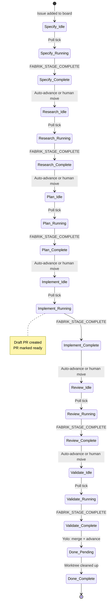
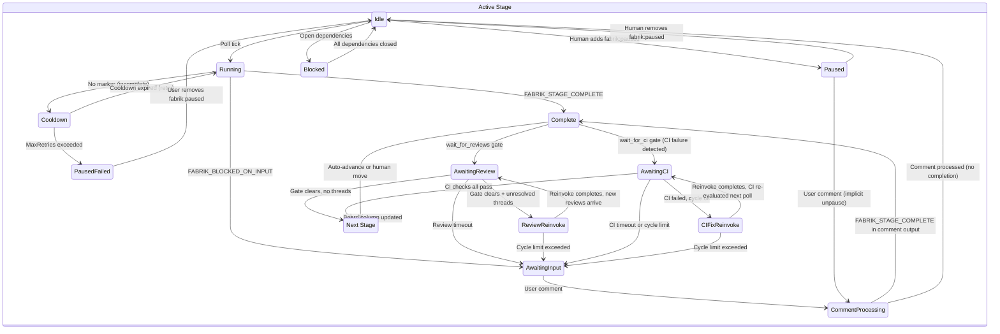
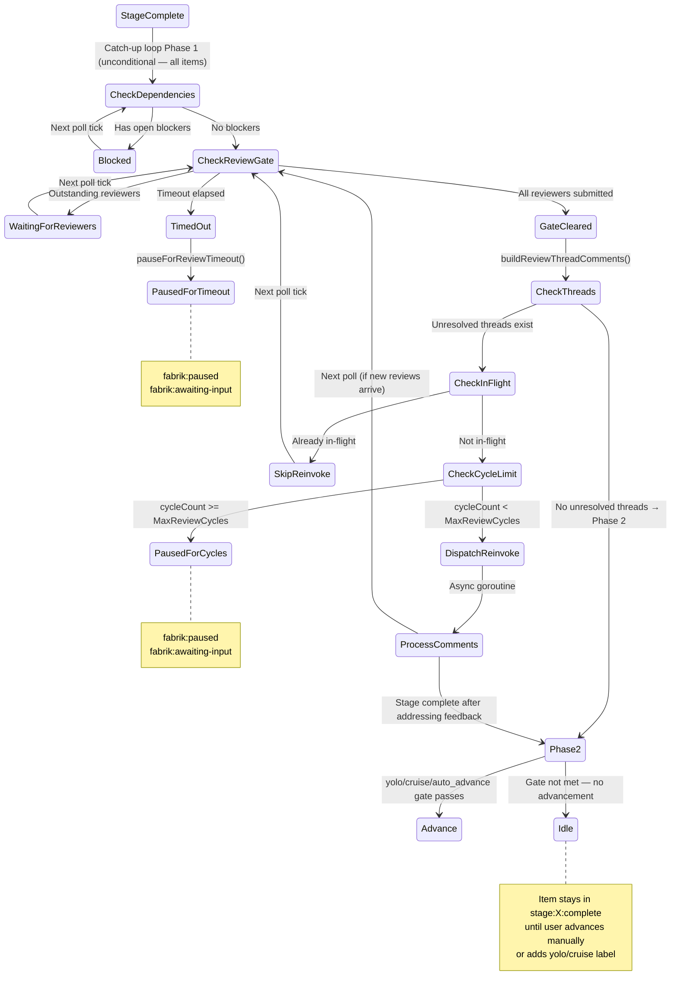

# Fabrik Issue State Machine

Every issue in Fabrik follows a defined lifecycle: from intake through a series of AI-driven stages (Specify → Research → Plan → Implement → Review → Validate → Done), with automated gates at key transitions. The diagram below shows the happy path at a glance.

<figure>

<figcaption>Fabrik issue lifecycle — linear pipeline with gate annotations. Review Gate holds advancement until all PR reviewers submit; CI Gate holds until checks pass; Merge Gate holds until rebase conflicts are resolved.</figcaption>
</figure>

**Not an engineer?** The diagram and the [Pipeline Overview](#pipeline-overview) table are the fastest way to understand Fabrik's workflow.

**Engine contributor or debugger?** The dense reference below covers every reachable state, every label mutation, every guard condition, and the visual state diagrams in [§10](#10-state-diagrams). Use the [State Enumeration](#1-state-enumeration) section as the authoritative source when diagnosing unexpected engine behavior.

---

This document is the formal specification of Fabrik's issue-level state machine: how an issue moves between states across multiple invocations of the engine. It covers every reachable state, every event that triggers a transition, every label mutation, and every guard condition.

**Companion document:** [`stage-lifecycle.md`](stage-lifecycle.md) describes the per-invocation lifecycle (what happens before, during, and after a single Claude invocation). This document describes the cross-invocation state machine (how an issue progresses through the pipeline over time). They are complementary.

**As-built specification:** This document describes what the code actually does, not what it ideally should do. Discrepancies between intended and actual behavior are flagged with `> **Bug?:**` callout blocks.

**Source of truth for:** state enumeration, transition tables, label semantics, and guard conditions. Supersedes partial label references in CLAUDE.md.

---

## Pipeline Overview

Issues traverse a linear pipeline of stages, each corresponding to a column on the GitHub Project board:

```
Specify → Research → Plan → Implement → Review → Validate → Done
```

| Stage | Order | Read-Only | PostToPR | CreateDraftPR | MarkPRReady | WaitForReviews | CleanupWorktree |
|-------|-------|-----------|----------|---------------|-------------|----------------|-----------------|
| Specify | 0 | Yes | No | No | No | No | No |
| Research | 1 | Yes | No | No | No | No | No |
| Plan | 2 | Yes | No | No | No | No | No |
| Implement | 3 | No | Yes | Yes | Yes | No | No |
| Review | 4 | No | Yes | No | Yes | Yes* | No |
| Validate | 5 | No | Yes | No | No | Yes* | No |
| Done | 99 | N/A | No | No | No | No | Yes |

\* All flags in this table reflect the **default stage configuration** shipped in `.fabrik/stages/`. Each flag is opt-in per stage YAML and may differ in custom configurations. `wait_for_reviews` is enabled for Review and Validate in the defaults.

---

## 1. State Enumeration

A state is defined by the tuple `(BoardColumn, ControllingLabelSet)`. Not every label combination is a valid state — only reachable combinations are enumerated.

### 1.1 Controlling Labels

These labels define distinct states (their presence changes what the engine does with an item):

| Label | Type | Defines State? |
|-------|------|----------------|
| `fabrik:locked:<user>` | Lock | Yes — gates processing by other instances |
| `fabrik:editing` | Mutex | Yes — prevents stage dispatch during comment processing |
| `fabrik:paused` | Pause | Yes — blocks all processing unless a comment arrives |
| `fabrik:awaiting-input` | Sub-pause | Yes (with `fabrik:paused`) — blocked-on-input variant |
| `fabrik:awaiting-review` | Gate | Yes — review gate is active |
| `fabrik:awaiting-ci` | Gate | Yes — CI gate is active; waiting for CI checks to pass (checks may be running or have failed) |
| `fabrik:rebase-needed` | Gate | Yes — merge-conflict gate is active; PR is not mergeable against its base |
| `fabrik:blocked` | Dependency | Yes — blocked by open dependency issues |
| `stage:<X>:in_progress` | Progress | Yes — a stage invocation is active |
| `stage:<X>:complete` | Completion | Yes — stage finished successfully |
| `stage:<X>:failed` | Failure | Yes — stage exhausted retry limit |

### 1.2 Modifier Labels (Guard Conditions)

These labels do not define distinct states but influence transition behavior:

| Label | Effect |
|-------|--------|
| `fabrik:yolo` | Forces auto-advance; triggers GitHub native auto-merge at Validate; overrides `auto_advance: false` |
| `fabrik:cruise` | Forces auto-advance without auto-merge; stops at Validate completion; cruise wins over yolo for auto-merge (PR is not auto-merged even when yolo is also present), but the stop-at-Validate behaviour is overridden by yolo (issue advances to Done) |
| `fabrik:auto-merge-enabled` | Engine-internal; marks that GitHub's native auto-merge has been enabled on the linked PR; anchors the convergence budget start time; bypasses legacy merge/CI gates |
| `fabrik:unrestricted` | Passes `--dangerously-skip-permissions` to Claude Code |
| `fabrik:extend-turns` | Pre-grants a 2× turn budget for every stage invocation and comment processing invocation while present; persists across stages; removed only at the Done cleanup stage or manually; no-op when `max_turns == 0` (stage) or always applies for comments since `commentMaxTurns` is never 0 |
| `model:<name>` | Selects a specific model for this issue (e.g., `model:opus`) |
| `effort:<level>` | Overrides stage effort level (`low`, `medium`, `high`, `max`); highest wins |
| `base:<branch>` | Overrides worktree base branch; falls back to default if not on remote; updates PR base if PR exists |
| `fabrik:sub-issue` | Informational; marks issue as created by Fabrik's sub-issue spawn mechanism |

### 1.3 Reachable States by Board Column

For each board column, the reachable sub-states are listed. States are written as `Column + {labels}`. An issue in a column with no controlling labels is in the **Idle** sub-state for that column.

#### Specify / Research / Plan / Implement / Review / Validate (Active Stages)

Each active stage column has the same set of reachable sub-states:

| Sub-State | Labels Present | Description |
|-----------|---------------|-------------|
| **Idle** | (none of the controlling labels) | Ready for the engine to pick up |
| **Locked + In Progress** | `fabrik:locked:<user>`, `stage:<X>:in_progress` | Stage invocation is active |
| **Editing** | `fabrik:editing` | Comment processing is active (Claude invoked for comment review) |
| **Paused** | `fabrik:paused` | Manually paused or engine-escalated pause; no work until unpause or comment |
| **Paused + Failed** | `fabrik:paused`, `stage:<X>:failed` | Engine paused after MaxRetries exhausted |
| **Awaiting Input** | `fabrik:paused`, `fabrik:awaiting-input` | Claude signaled FABRIK_BLOCKED_ON_INPUT; waiting for user comment. Engine posts a dedicated `🏭 **Fabrik** — @<user>:` notification comment so GitHub delivers a mobile push to the configured operator (`cfg.User`). If Claude's output included a `FABRIK_SUMMARY` block, the question is embedded as a blockquote. |
| **Awaiting Review** | `fabrik:awaiting-review`, `stage:<X>:complete` | Review gate active; waiting for PR reviewers (only on stages with `wait_for_reviews: true`) |
| **Awaiting CI** | `fabrik:awaiting-ci` | CI gate active; waiting for CI checks to pass (pending or failed); `stage:<X>:complete` is withheld until CI clears (only on stages with `wait_for_ci: true`) |
| **Rebase Needed** | `fabrik:rebase-needed` (+ `fabrik:awaiting-ci` when `wait_for_ci: true`) | Merge-conflict detected; PR is not mergeable against its base; engine dispatching a rebase re-invocation. Applies to both the conjunctive gate path (`wait_for_ci: true` stages, via `checkMergeabilityGate`) and the legacy auto-merge path (yolo+Validate without `wait_for_ci`, via `attemptMergeOnValidate`) |
| **Blocked** | `fabrik:blocked` | Dependency gate active; waiting for blocking issues to close |
| **Complete** | `stage:<X>:complete` | Stage finished; waiting for advancement (manual or auto) |
| **Locked by Other** | `fabrik:locked:<other_user>` | Another Fabrik instance owns this issue |
| **Cooldown** | (no label; in-memory `LastAttemptAt[stageName]` in `itemstate.StageState`) | Stage attempted but didn't complete; waiting for dispatch cooldown to expire |

> **Note:** The Cooldown sub-state is purely in-memory — there is no label for it. The engine uses `LastAttemptAt[stageName]` from `itemstate.StageState` (written by `StageAttempted` mutation) to enforce dispatch cooldown. On restart, cooldown state is lost and the item is retried immediately.
>
> Distinct from Cooldown is **Deferred Dispatch**: an item whose dispatch was skipped in the current poll cycle solely because a worker from a prior cycle is still running. Deferred-Dispatch items still receive the `CooldownAt("periodic-re-eval")` stamp at end-of-poll — the cooldown avoids repeated deep-fetch evaluation (and the fallback GraphQL fetch when the cache is invalidated or disabled) for an item the dispatch guard (`snap.Worker() != nil`) would block anyway. Prompt re-dispatch after the prior worker exits is guaranteed by `WorkerExited → WorkerLifecycleChanged`, which is in `wakeChFlags` and wakes the poll loop immediately (#544). Note: `WorkerLifecycleChanged` is excluded from `cycleSetFlags` (Fix B, issue #576) so it does not bypass the cooldown gate via `mayNeedWork`. For successful workers, `StatusChanged` from `advanceToNextStage` adds the item to cycleSet (bypassing the cooldown) so the next stage dispatches promptly. For aborted workers (max-turns, error), the cooldown expires naturally and the next ticker poll re-evaluates the item. See §3.2, §9.2, and §9.9.

#### Done (Cleanup Stage)

| Sub-State | Labels Present | Description |
|-----------|---------------|-------------|
| **Pending Cleanup** | (none) | Worktree exists; engine will remove it |
| **Complete** | `stage:Done:complete` | Worktree removed; terminal state |
| **Paused** | `fabrik:paused` | Manually paused; cleanup skipped |

### 1.4 Label Semantics Reference

| Label | Added By | When Added | Removed By | When Removed | Gates |
|-------|----------|------------|------------|--------------|-------|
| `fabrik:locked:<user>` | `processItem` | Before stage invocation (lock-then-verify protocol) | `releaseLock` | On stage completion, permanent failure, blocked-on-input, or lock conflict loss | Prevents other instances from processing the item |
| `fabrik:editing` | `processComments` | Step 2 of comment processing | `processComments` | Step 9 of comment processing (also on error paths). Removal uses bounded retry (≤3 attempts, 500ms/1s/2s backoff) for transient network errors; `ErrNotFound` is a silent no-op. Stale labels with no active Worker are cleaned up at startup by `runStartupCleanup()`. | Pre-dispatch gate in `itemNeedsWork` (prevents goroutine launch); defense-in-depth check retained in `processItem` for the race window. Symmetric with `fabrik:locked:<other-user>`. Note: `JobStartedEvent` is emitted at `processComments` entry (step 0) — *before* `fabrik:editing` is added at step 2. The pre-dispatch gate only blocks *new* dispatches; the active session's `JobStartedEvent` fires before the label exists. |
| `fabrik:paused` | `escalateFailedStage`, `blockOnInput`, `pauseForReviewTimeout`, `pauseForReviewCycleLimit`, `pauseForCITimeout`, `pauseForCIFixCycleLimit`, `pauseForRebaseCycleLimit`, `attemptMergeOnValidate` (on ErrNotMergeable rebase cycle limit reached, or CI wait timeout) | After MaxRetries, FABRIK_BLOCKED_ON_INPUT, review/CI/rebase timeout or cycle limit | User (manual removal), or `processItem` (on new comment that triggers unpause) | When user removes it manually, or user comments on a paused issue | Blocks all processing; user comment is an implicit resume |
| `fabrik:awaiting-input` | `blockOnInput`, `pauseForReviewTimeout`, `pauseForReviewCycleLimit`, `pauseForCITimeout`, `pauseForCIFixCycleLimit` | After FABRIK_BLOCKED_ON_INPUT or review/CI timeout/cycle limit | `unblockAwaitingInput`; `handleStageComplete` (on FABRIK_STAGE_COMPLETE, to clear any orphaned label); `handleNoWorkNeeded` (on FABRIK_NO_WORK_NEEDED); `cleanupClosedIssueTransientLabels` (defensive sweep) | When user comment arrives; when a stage completes (removes any orphaned label that survived a manual `fabrik:paused` removal); or when issue is closed (defensive sweep — label has no meaning on a closed issue) | Combined with `fabrik:paused`, identifies the "awaiting user input" pause variant |
| `fabrik:awaiting-review` | `handleStageComplete` (Path 1 — only when `wait_for_ci: false`), `checkReviewGate` (Path 2) | Path 1: optimistically after stage completion when `wait_for_reviews: true` **and `wait_for_ci: false`** (does not check reviewer state — data is stale; omitted for `wait_for_ci: true` stages because Path 2 handles the gate after CI clears). Path 2: when `LinkedPRReviewRequests` is non-empty OR when `len(outstanding)==0 && !hasReviews` (the bot self-submission case — covers Copilot/Gemini-style reviewers that don't appear in the formal requested-reviewer list but still need to submit a review) | `checkReviewGate` (both natural clear and timeout paths); `cleanupClosedIssueTransientLabels` (defensive sweep) | When all reviewers submit, or when timeout elapses (removed by `checkReviewGate` before `pauseForReviewTimeout` is called); or when issue is closed (defensive sweep) | Phase 1 / Phase 2 reprompt timers in `checkReviewGate` fire on label-applied-at age (not on `updatedAt` movement). A non-responsive bot reviewer produces no comment / no review / no PR activity, so `updatedAt` never moves — without periodic re-evaluation the timers would never get a chance to fire. The catch-up loop's blocked-path records `CooldownAt("review-blocked")` (via `CooldownRecorded{Reason: "review-blocked"}` mutation) so `itemMayNeedWork`'s cooldown retry path re-admits the item every 10 × `PollSeconds` (same pattern as `fabrik:blocked`); a per-poll cache bypass is intentionally avoided because long-lived review-waiting items would otherwise become a permanent GraphQL hot path. Blocks auto-advance until review gate clears |
| `fabrik:awaiting-ci` | `handleStageComplete` (on FABRIK_STAGE_COMPLETE for `wait_for_ci: true` stages; idempotent); `checkCIGate` (on confirmed CI failure; idempotent) | `handleStageComplete`: immediately on FABRIK_STAGE_COMPLETE — replaces premature `stage:X:complete` and keeps the item in the CI-await window (ADR 032). `checkCIGate`: when CI check runs for the PR head SHA have `conclusion: failure/timed_out/action_required`. | `checkCIGate` (when `mergeable_state ∈ {clean, unstable}`, when CI check classification reports all-green, or when gate times out); `attemptMergeOnValidate` (when `mergeable_state ∈ {clean, unstable}` shortcut fires); `cleanupClosedIssueTransientLabels` (defensive sweep) | When GitHub's `mergeable_state` indicates the PR is mergeable (v0.0.52 shortcut — the `MergeableStateAccepted` allowlist); when all CI checks pass (green) under the per-check classification fallback; when timeout elapses (removed before `pauseForCITimeout` is called); or when issue is closed (defensive sweep) | Signals CI gate is active (pending or failed); triggers `itemMayNeedWork` updatedAt cache bypass; suppresses dispatcher re-invocation (`itemNeedsWork` returns false); blocks auto-advance until CI gate clears. **`stage:X:complete` is absent while this label is present — it is added by `checkCIGate` when CI clears (R5) or when `mergeable_state` shortcut clears the gate (v0.0.52).** |
| `fabrik:rebase-needed` | `checkMergeabilityGate` (catch-up loop, `wait_for_ci: true` stages); `checkAutoMergeConvergence` (convergence flow, yolo+Validate with `fabrik:auto-merge-enabled`) | When GitHub reports `mergeable == false` on the linked PR — a confirmed base-branch conflict. Applied idempotently in both paths. NOT added when `mergeable == null` (GitHub still computing). | `checkMergeabilityGate` (when mergeable flips back to true); `checkAutoMergeConvergence` (when PR merges or closes); `cleanupClosedIssueTransientLabels` (defensive sweep) | When GitHub reports `mergeable == true` (after Claude's rebase push lands), or when PR merges/closes; or when issue is closed (defensive sweep) | Signals confirmed merge conflict; triggers `itemMayNeedWork` updatedAt cache bypass (base-branch advances don't bump the item's `updatedAt`); blocks CI gate and auto-advance until rebase resolves the conflict |
| `fabrik:auto-merge-enabled` | `attemptMergeOnValidate` (yolo, non-cruise, Validate completion) | After successful `enablePullRequestAutoMerge` GraphQL call — signals GitHub is handling the merge atomically. Also serves as the idempotency guard (prevents re-calling the mutation) and the budget-start anchor (timestamp read by `FetchLabelAppliedAt` to compute convergence budget elapsed time). | `checkAutoMergeConvergence` (when PR merges, PR closes, user disables auto-merge, or budget exhausts); `cleanupClosedIssueTransientLabels` (defensive sweep) | When GitHub merges the PR; when PR is closed without merging; when user disables auto-merge in GitHub UI; or when convergence budget exhausts (→ `pauseForConvergenceFailed`); or when issue is closed (defensive sweep) | Engine-internal label. Bypasses legacy merge/CI gate dispatch — `checkAutoMergeConvergence` is the sole Phase 1 handler while present. Triggers `itemMayNeedWork` updatedAt cache bypass (convergence state changes independently of issue `updatedAt`). `stage:Validate:complete` remains in place while this label is present; `checkAutoMergeConvergence` removes it when the PR merges and the item advances to Done. NOT applied when `fabrik:cruise` is also present (cruise wins). |
| `fabrik:blocked` | `checkDependencies` | When open blocking issues exist (first transition only — idempotent) | `PushUnblockObserver` (primary — fires immediately on blocker close, any column); `checkDependencies` (defense-in-depth — fires via `dep-blocked` cooldown-retry for items in stage columns) | When all blocking issues close | Pre-dispatch gate in `itemNeedsWork` prevents re-dispatch after the label is set (parallel to `fabrik:editing` post-#550 and `fabrik:locked:<other>` always); **exception**: when the `dep-blocked` cooldown has expired (or no store entry exists), `itemNeedsWork` admits the item for one dependency re-check per `10 × PollSeconds` — `checkDependencies` either re-stamps the cooldown (still blocked) or removes the label (resolved). Initial detection (first dispatch, label not yet set) still reaches `checkDependencies` normally. Blocks stage start. Push path removes the label even for items in non-stage columns (Backlog, Done, custom columns) that would otherwise never be re-evaluated by `processItem`. |
| `stage:<X>:in_progress` | `processItem` | After lock acquired and verified | `releaseLock` | Same as `fabrik:locked:<user>` | Informational — shows which stage is active on GitHub |
| `stage:<X>:complete` | `handleStageComplete` (for non-`wait_for_ci` stages), `checkCIGate` (for `wait_for_ci: true` stages — added only after CI passes), `handleNoWorkNeeded` (emitting stage + all skipped stages), cleanup stage handler | `handleStageComplete`: after Claude signals FABRIK_STAGE_COMPLETE on stages without `wait_for_ci: true`. `checkCIGate`: when all CI checks pass (R5) — this is the conjunctive gate (ADR 032): `stage:X:complete` is deferred until the CI gate actually clears, not applied on FABRIK_STAGE_COMPLETE. After FABRIK_NO_WORK_NEEDED (emitting stage + all subsequent non-cleanup stages) or worktree cleanup. | Never removed | Permanent | Prevents re-invocation of the stage; triggers catch-up advancement |
| `stage:<X>:failed` | `escalateFailedStage` | After MaxRetries exhausted | `clearFailedStage` | When user removes `fabrik:paused` (manual unpause) | Indicates permanent failure; paired with `fabrik:paused` |
| `fabrik:yolo` | User (manual) | Any time | User (manual) | Any time | Forces auto-advance; triggers auto-merge at Validate; overrides `auto_advance: false` per stage |
| `fabrik:cruise` | User (manual) | Any time | User (manual) | Any time | Forces auto-advance without merge; stops at Validate; cruise wins over yolo for auto-merge (auto-merge suppressed even when yolo present); stop-at-Validate is overridden when yolo is also present (issue advances to Done, but PR is not auto-merged) |
| `fabrik:unrestricted` | User (manual) | Any time | User (manual) | Any time | Passes `--dangerously-skip-permissions` instead of `--permission-mode dontAsk` |
| `fabrik:extend-turns` | User (manual) | Any time | `processItem` cleanup branch or User (manual) | At Done cleanup stage completion; or manual removal | Pre-grants 2× `stage.MaxTurns` budget for every stage invocation while present; no-op for stage path when `max_turns == 0` (unlimited); also pre-grants 2× `commentMaxTurns(stage)` budget for every comment processing invocation (comment budget is never 0); subsequent extensions beyond 2× require progress detection for both paths; persists across all intermediate stages |
| `model:<name>` | User (manual) | Any time | User (manual) | Any time | Selects Claude model; first label wins if multiple present |
| `effort:<level>` | User (manual) | Any time | User (manual) | Any time | Overrides stage effort level; highest-ranked wins if multiple present |
| `base:<branch>` | User (manual) | Before Research (recommended) | User (manual) | Any time | Overrides worktree base branch; falls back to default if branch not found on remote; if a PR exists, its base branch is updated to match on each stage invocation |
| `fabrik:sub-issue` | `preImplement` (engine-side) | Applied to each spawned child issue during pre-Implement spawn step | N/A | N/A | Informational — marks issues created by Fabrik's sub-issue spawn mechanism; no engine-side gate semantics |
| `fabrik:children-spawned` | `preImplement` (engine-side) | After all `FABRIK_SPAWN_CHILD_*` children are successfully created and linked as blockedBy of parent | User (manual, to re-trigger spawn) | If user wants fresh spawn (must also close orphan children) | Idempotency guard — prevents `preImplement` from re-spawning children on retry; while present, `preImplement` is a no-op |

---

## 2. Event Enumeration

Thirteen distinct event types drive state transitions (§2.1–2.11, §2.13, §2.14), plus one TUI display event (§2.12) that does not drive transitions:

### 2.1 Poll Tick

**Trigger:** The engine's poll loop fires on a configurable interval (`PollSeconds`).

**Code path:** `poll()` → `itemMayNeedWork()` (shallow filter) → `FetchItemDetails()` (deep fetch) → `itemNeedsWork()` (full filter) → catch-up loop → dispatch loop → `processItem()`

**Effect:** The primary driver of all state transitions. Each poll cycle evaluates every item on the board through the filter chain and dispatches work for qualifying items.

### 2.2 New User Comment

**Trigger:** A user posts a comment on an issue or its linked PR. Detected by `findNewComments()` — filters out Fabrik-generated comments (prefix `🏭 **Fabrik`) and already-processed comments (ROCKET reaction or `CommentProcessed` entry in `itemstate.Store`).

**Code path:** `itemNeedsWork()` detects new comments → `processItem()` routes to `processComments()` or triggers unpause/unblock

**Effect:** Can trigger three distinct behaviors:
1. **Unpause:** On a paused issue, the comment removes `fabrik:paused` (and clears failed state if present) and falls through to comment processing
2. **Unblock awaiting-input:** On an awaiting-input issue, removes both `fabrik:paused` and `fabrik:awaiting-input`, then routes to `processComments()`
3. **Comment processing:** On an active (non-paused) issue, routes directly to `processComments()`

### 2.3 PR Review State Change

**Trigger:** A `pull_request_review` webhook event with `action` ∈ {`submitted`, `edited`, `dismissed`} arrives. All three actions carry the full review object (author, state, body, DatabaseID) and are routed through the same review-upsert path in `applyPullRequestReviewDelta`. The webhook action itself is not stored — only the review state (from the payload's `review.state` field, normalised to uppercase) is recorded in `item.LinkedPRReviews` (upserted by `DatabaseID`).

- `submitted` — reviewer submitted a new review (APPROVED, CHANGES_REQUESTED, or COMMENTED).
- `edited` — reviewer edited an in-progress review (the only action some bot reviewers, e.g. GitHub Copilot, ever send).
- `dismissed` — a prior APPROVED or CHANGES_REQUESTED review was dismissed; the stored state becomes `DISMISSED`.

**Code path:** Delta applied by `applyPullRequestReviewDelta` → `itemstate.PRReviewSubmitted` upsert → catch-up loop in `poll()` re-evaluates `checkReviewGate()`.

**Effect:** Can clear the review gate when `len(outstanding) == 0` and at least one non-DISMISSED review exists. A DISMISSED review does not satisfy the `hasReviews` condition. Does not directly trigger a stage invocation.

### 2.4 PR Review Threads with Feedback

**Trigger:** Reviewers leave inline code comments on the linked PR in unresolved review threads. These are real GitHub comments with `DatabaseID`s.

**Code path:** Detected by `buildReviewThreadComments()` in the catch-up loop → `dispatchReviewReinvoke()` → async `processComments()` with synthetic comments

**Effect:** Triggers a review reinvocation cycle — the stage agent is re-invoked via `processComments()` with the review thread comments as input, allowing it to address reviewer feedback. This is a **distinct event type** from regular comment processing (see §6.2).

### 2.5 Blocking Issue Closed

**Trigger:** An issue listed in `item.BlockedBy` transitions to the CLOSED state, OR a dependent item's `BlockedBy` slice is populated for the first time via deep-fetch while all listed blockers are already closed.

**Primary code path (push-based): `PushUnblockObserver`**

`PushUnblockObserver` is registered on `engine.store` and fires on two distinct events. The dependent unblocks within seconds regardless of which event arrives first.

**Trigger 1 — `StateChanged` (blocker closes):** When a blocker Y closes:

1. The observer calls `store.All()` to scan all known items.
2. For each item X that carries `fabrik:blocked` and has Y in its `BlockedBy` list, it checks every remaining blocker via `store.Get()` (fresher than `dep.State` from the last board fetch; falls back to `dep.State == "CLOSED"` if the blocker is not in the store).
3. If all of X's blockers are now closed, the observer dispatches `removeBlockedIfResolved` on a goroutine, which removes `fabrik:blocked` via `RemoveLabelFromIssue` (3 attempts, exponential backoff, idempotent) and applies the cache write-through.

**Trigger 2 — `BlockedByChanged` (dependent's `BlockedBy` first populated via deep-fetch):** `BlockedBy` is a deep-fetch-only field — after bootstrap every item has `BlockedBy = nil` until its first `ItemDeepFetched` mutation. If Trigger 1 fires before the dependent's first deep-fetch, the dependent's `BlockedBy` is empty and the scan silently skips it. When the dependent IS later deep-fetched, the Store emits `BlockedByChanged`, and the observer reacts:

1. It reads the post-mutation snapshot of the dependent item X directly (no `store.All()` scan).
2. If `BlockedBy` is empty after the mutation, it returns immediately (no-op — `BlockedByChanged` only fires when the slice actually changes, so this guards against a deep-fetch that clears or results in an empty dependency list).
3. If X carries `fabrik:blocked` and all listed blockers are closed in the store, it dispatches `removeBlockedIfResolved` on a goroutine.

Both triggers are idempotent — double-removal races are handled correctly (`ErrNotFound` is treated as success by `removeBlockedIfResolved`).

This path **bypasses `processItem` and `itemMayNeedWork` entirely**, so it works for items in any column — including Backlog, Done, or custom non-stage columns where `itemMayNeedWork` would return false. No comment is posted; the push path is a label-removal-only operation. Observer decisions (skipped, unblocked, or still-blocked reasons) are emitted under the `[push-unblock]` log tag in `fabrik.log`.

**Defense-in-depth path (pull-based): `itemNeedsWork` exception + `processItem()` → `checkDependencies()`**

`processItem()` applies `CooldownRecorded{Reason: "dep-blocked"}` each time `checkDependencies()` returns true (blocked). While the cooldown is active the pre-filter skips deep-fetch entirely (no goroutine, no GraphQL burn — #576 fix preserved). When the cooldown expires, `itemNeedsWork` detects the expiry via `snap.CooldownAt("dep-blocked")` and admits the item — bypassing the #576 pre-dispatch gate for this one re-check — so `processItem` → `checkDependencies` can re-evaluate: if still blocked it re-stamps the cooldown (resetting the 150s window); if resolved it removes `fabrik:blocked`. A missing store entry (cold-start or restart) also admits the item, since no active cooldown exists. This path fires once per `10 × PollSeconds` for items in configured stage columns and serves as defense-in-depth for missed webhook events.

Note: within `checkDependencies()`, for each blocker the engine first consults `store.Get(blocker).IsClosed()` (the cache's view) and only falls back to `dep.State != "CLOSED"` from the GraphQL deep-fetch if the blocker is not present in the store. This preference avoids false "still blocked" conclusions caused by GitHub indexer lag, which can delay `dep.State` updates by several seconds after a blocker actually closes.

**Concurrency note:** Neither `StateChanged` nor `BlockedByChanged` is in `wakeChFlags` or `cycleSetFlags`, so `PushUnblockObserver` fires do not wake the poll loop or populate `mayNeedWork`. Label removal is a direct side effect dispatched on a goroutine to avoid blocking the store notification call path. Double-removal races (two blockers closing within milliseconds, or both triggers firing for the same item) are handled correctly — `ErrNotFound` is treated as success by `removeBlockedIfResolved`.

### 2.6 Claude Output Markers

**Trigger:** Claude's output contains one of the Fabrik markers. Checked after each stage invocation.

**Markers and priority order** (enforced by the `if/else if` dispatch chain in `processItem()`):
1. `FABRIK_STAGE_COMPLETE` + `FABRIK_NO_WORK_NEEDED` (both present) — highest priority among `completed == true` paths; `completed && noWorkNeeded` branch fires before the plain `completed` branch
2. `FABRIK_STAGE_COMPLETE` (alone) — next; handled by the plain `completed` branch
3. `FABRIK_BLOCKED_ON_INPUT` — checked last; only honored if `completed` is false and `err == nil`

`FABRIK_NO_WORK_NEEDED` is ignored unless `FABRIK_STAGE_COMPLETE` also appears in the same output — the no-work path requires the emitting stage to explicitly declare itself complete. The timeout/kill recovery path that scans buffered output for `FABRIK_STAGE_COMPLETE` does not trigger the no-work path (only `FABRIK_STAGE_COMPLETE` is scanned in that recovery path, not `FABRIK_NO_WORK_NEEDED`).

**Code path:** `processItem()` → outcome dispatch based on which marker is present

**Effect:**
- **FABRIK_STAGE_COMPLETE** + **FABRIK_NO_WORK_NEEDED:** `handleNoWorkNeeded()` — adds completion label for emitting stage; adds dummy `stage:<name>:complete` labels and one-line "skipped" comments for each subsequent non-cleanup stage; moves issue directly to Done; no PR created (see §6.7)
- **FABRIK_STAGE_COMPLETE:** `handleStageComplete()` — adds completion label, potentially advances to next stage
- **FABRIK_BLOCKED_ON_INPUT:** `blockOnInput()` — adds `fabrik:paused` + `fabrik:awaiting-input`
- **None of the above:** cooldown retry path; eventually `escalateFailedStage()` if MaxRetries exceeded

**`FABRIK_SPAWN_CHILD_BEGIN/END` blocks** are not processed inline — they are structured data emitted by the Plan stage and preserved in the Plan stage comment. The engine's `preImplement` step reads them at Implement dispatch time to create child issues. See §6.6.

**Invocation-level kill paths:** The `max_wall_time` and inactivity timeout mechanisms (see §7.6) can terminate the Claude process before it writes a clean `{"type":"result"}` line. After such a kill, `runClaude()` retroactively scans the already-buffered output for `FABRIK_STAGE_COMPLETE` in intermediate `{"type":"assistant"}` NDJSON lines via `extractTextFromAssistantTurns()`. If found, `completed=true` is returned and the invocation is treated identically to a live `FABRIK_STAGE_COMPLETE`. If not found, `completed=false` is returned and the invocation routes to the cooldown/retry path. These kills are distinguished from engine-shutdown cancellation by the `wasTimedOut` flag, so they do not trigger the hard-error path.

### 2.7 Manual Label Change

**Trigger:** A human adds or removes a label on the issue via the GitHub UI.

**Code path:** Detected on the next poll cycle when labels are fetched

**Effect varies by label:**
- Adding `fabrik:paused` → engine skips the item (unless a comment arrives)
- Removing `fabrik:paused` from a failed issue → `clearFailedStage()` resets retry state
- Adding `fabrik:yolo` or `fabrik:cruise` → enables auto-advance (even mid-run, due to label re-fetch in `handleStageComplete()`)
- Adding `model:<name>` or `effort:<level>` → takes effect on next Claude invocation

### 2.8 Issue Closed

**Trigger:** The issue is closed on GitHub (e.g., by PR merge with `Closes #N`).

**Code path:** `itemMayNeedWork()` and `itemNeedsWork()` check `item.IsClosed`

**Effect:** Closed issues are skipped unless:
1. The current stage is a cleanup stage (`CleanupWorktree: true`) — cleanup can remove the worktree
2. The current stage has a `stage:<X>:complete` label — the catch-up loop can advance to the next stage (e.g., a PR merge closes an issue sitting in Validate with `stage:Validate:complete`; it needs to move to Done)

### 2.9 Review Reinvoke

**Trigger:** The catch-up loop Phase 1 detects unresolved PR review thread comments on any `stage:<X>:complete` item (or `fabrik:awaiting-ci` item on a `wait_for_ci: true` stage) — regardless of whether the item has `fabrik:yolo`, `fabrik:cruise`, or any `auto_advance` config. Phase 1 runs unconditionally; only Phase 2 (stage advancement) is gated on those labels.

**Code path:** `poll()` catch-up loop Phase 1 → `buildReviewThreadComments()` → cycle limit check → `dispatchReviewReinvoke()` → async goroutine → `processComments()` with synthetic comments

**Distinct from regular comment processing because:**
- Uses synthetic comments derived from PR review threads (`LinkedPRReviewThreadComments`), not issue comments
- Has cycle limits (`MaxReviewCycles`, default 5) — exceeding pauses the issue
- Has timeout integration (review wait timeout can also trigger pause)
- Dispatches asynchronously via goroutine with semaphore slot
- The worker guard (`snap.Worker() != nil`) prevents double-dispatch across poll cycles
- Resolves review threads (marks them resolved on GitHub) after processing

### 2.10 CI Check Completed

**Trigger:** CI check runs on the PR head SHA transition from pending to a terminal state (success, failure, etc.). Fabrik detects this by polling `FetchCheckRuns` (REST) on each catch-up loop iteration — there are no webhooks.

**Code path:** `poll()` catch-up loop Phase 1 → `checkCIGate()` → `FetchLinkedPR()` (REST, for head SHA) → `FetchPRMergeableState()` (REST, single-PR endpoint) → if `mergeable_state ∈ {clean, unstable}`: gate clears immediately (`addCompleteLabelAndRemoveCI`); otherwise → `FetchCheckRuns()` (REST) → evaluates check run statuses → optionally dispatches `dispatchCIFixReinvoke()` → async goroutine → `processComments()` with synthetic CI failure comment

**`mergeable_state` shortcut (v0.0.52):** Before classifying raw check_runs, `checkCIGate` queries GitHub's branch-protection-aware `mergeable_state` on the linked PR. When the value is `clean` (ready to merge per branch protection) or `unstable` (non-required checks failing but still mergeable per `github.MergeableStateAccepted`), the gate clears immediately and the per-check classification is skipped. Other states (`blocked`, `behind`, `dirty`, `unknown`, `has_hooks`, `draft`, empty) fall through to the existing classification so failure-vs-pending dispatch decisions still work for genuinely-blocked PRs. Rationale: GitHub's branch protection is the source of truth for "is this mergeable" — non-required check_run failures (e.g., workflow cleanup jobs like `Cleanup artifacts`) do not block merges per branch protection, so Fabrik's gate must not block on them either. The `mergeable_state` field is null on the list endpoint used by `FetchLinkedPR`, so a separate single-PR REST call is required (`FetchPRMergeableState`).

**Distinct from Review Reinvoke because:**
- Triggered by check run status changes, not reviewer submissions
- Uses `fabrik:awaiting-ci` label (not `fabrik:awaiting-review`)
- Only active on stages with `wait_for_ci: true`
- `fabrik:awaiting-ci` is applied by `handleStageComplete` on FABRIK_STAGE_COMPLETE (the in-flight CI-await marker, present for both pending and failed checks); `stage:X:complete` is **withheld** until `checkCIGate` confirms CI is green (ADR 032)
- Timeout tracked via `FetchLabelAppliedAt` on `fabrik:awaiting-ci` (durable across restarts), not in-memory
- CI-fix cycle counter is `StageState.CIFixCycles[stageName]` in `itemstate.Store` (written by `CIFixCycleIncremented` mutation; read via `snap.CIFixCycles(stageName)`)

### 2.11 Base Branch Advanced

**Trigger:** The PR's base branch moves forward (a different PR merges) while this branch is sitting in the post-`stage:Validate:complete` catch-up window. GitHub recomputes `mergeable` on the linked PR; if the new base conflicts with this branch, `mergeable` transitions from `true` (or `null`) to `false`.

**Code path:** `poll()` catch-up loop Phase 1 → `checkMergeabilityGate()` → `FetchLinkedPR()` (REST, for PR number) → `FetchPRMergeable()` (REST, for the single-PR `mergeable` field) → evaluates the flag → optionally dispatches `dispatchRebaseReinvoke()` → async goroutine → `processComments()` with a synthetic rebase-required comment

**Distinct from CI Check Completed because:**
- Triggered by base-branch movement, not check run status changes
- Uses `fabrik:rebase-needed` label (not `fabrik:awaiting-ci`)
- Runs **before** the CI gate in catch-up Phase 1 — a PR that cannot merge has no reason to spin on CI-await
- Only active on stages with `wait_for_ci: true` (same opt-in as the CI gate — these are the stages admitted to the catch-up window via `fabrik:awaiting-ci`)
- `fabrik:rebase-needed` is only applied on **confirmed conflict** (`mergeable == false`), not on `mergeable == null` (GitHub still computing)
- Rebase cycle counter is `StageState.RebaseCycles[stageName]` in `itemstate.Store` (written by `RebaseCycleIncremented` mutation; read via `snap.RebaseCycles(stageName)`)
- Resolution relies on Claude rebasing in the worktree (to handle semantic collisions like duplicated ADR numbers) rather than an engine-side `git rebase`

### 2.12 TurnProgressEvent (TUI Display Event)

**Trigger:** A `{"type":"user"}` NDJSON line is written to Claude's stdout pipe during a Claude invocation. Each logical turn (one user→assistant cycle) begins with exactly one such line (either the initial prompt or a tool-result response), so this fires once per logical turn.

**Code path:** `runClaude()` stdout pipe → `turnCountingWriter.Write()` → detects `type == "user"` line → increments per-invocation counter → calls `claudeTurnProgress(issueNumber, turnsUsed, maxTurns)` → `Engine.emit(TurnProgressEvent{...})` → TUI channel

**Effect:** Purely additive display — does not trigger any state transitions, label mutations, or issue processing. The TUI consumes `TurnProgressEvent` to update the live turn counter shown in:
- The In Progress pane row for the active issue (width-adaptive badge `[N/M turns]` / `[N/M]` / omitted)
- The detail panel for the selected active item (`Turns: N/M`)

`TurnProgressEvent` is only emitted in TUI mode (`claudeTurnProgress` is nil in plain-text mode and tests). It uses the non-blocking `emit` path (drop-if-full), so turn-progress updates are best-effort and may be dropped under backpressure. This does not affect engine behavior because the event is display-only; at most one event is produced per logical turn.

**`MaxTurns` in the event** carries the effective budget for the current invocation — `effectiveBudget` as computed in `InvokeClaude()` (which already accounts for `opts.MaxTurnsOverride` from the extension loop). This means:
- First invocation without `fabrik:extend-turns`: `stage.MaxTurns`
- First invocation with `fabrik:extend-turns`: `2 × stage.MaxTurns`
- Extension loop second iteration: `stage.MaxTurns` (per-invocation limit, not cumulative)

### 2.13 Manual Assignee Change

**Webhook event:** `issues.assigned` / `issues.unassigned`

**Detection:** `applyIssuesDelta` (boardcache/delta.go:382) applies `IssueAssigneesUpdated`, which emits the `AssigneesChanged` flag. The `mayNeedWorkObserver` and `wakeChObserver` (engine/observers.go) include `AssigneesChanged` in `wakeChFlags`, so the assignment fires both a wake signal and a `mayNeedWork` cycleSet entry.

**Effect:** Dispatcher re-evaluates the item on the next poll cycle. The engine does not currently filter dispatch on assignee — assignee changes do not change what work happens, only that the item is re-considered. Future assignee-as-dispatch-filter work (planned, not yet filed) will give this event additional dispatch semantics.

**Why:** Assignment is a strong "please look at this" signal from the user, and is the mechanical underpinning of multi-user shared boards (each fabrik instance picking up only items assigned to its `cfg.User`).

### 2.14 Worker Lifecycle

**Source:** Engine-internal mutation, not a webhook.

**Detection:** The dispatch loop (and each reinvoke dispatcher — `dispatchReviewReinvoke`, `dispatchCIFixReinvoke`, `dispatchRebaseReinvoke`) applies `WorkerEntered{Repo, Number, StageName, StartedAt}` synchronously before the goroutine is launched. `WorkerExited{Repo, Number}` is deferred at the top of each goroutine so it fires on any exit path (context cancel, `ensureRepoReady` failure, normal return). Both mutations emit `WorkerChanged | WorkerLifecycleChanged`; `WorkerLifecycleChanged` (not the broader `WorkerChanged`) is the flag in `wakeChFlags`. `WorkerHeartbeat` and `WorkerPIDSet` emit only `WorkerChanged` and do not wake the poll loop — this prevents deep-fetch churn for active workers (30s heartbeat × N workers would otherwise trigger repeated deep-fetches for items that can't be dispatched anyway).

**Effect:** `WorkerExited` adds the item to `mayNeedWork` and, when `wakeCh != nil`, fires the `wakeChObserver` so the dispatcher re-evaluates within milliseconds. In headless runs (`--notui` or any configuration without a wake channel), the mutation populates `mayNeedWork` for the next ticker-driven poll (within `PollSeconds`); there is no immediate wake. Either way, re-evaluation does not depend on cooldown expiry or external events. This eliminates the previous race where self-advance to the next stage would wait up to 150s (`PollSeconds × 10`) if the departing worker had not finished cleanup before the post-advance dispatch loop ran.

**Dispatch guard:** The dispatch loop uses `snap.Worker() != nil` (Store-backed) instead of the former `e.inFlight.Load(iKey)` (sync.Map). Because `WorkerEntered` is applied before `wg.Add(1)` and before the goroutine starts, `snap.Worker() != nil` is true from the instant the goroutine is scheduled — there is no window where a new dispatch cycle could race in and double-dispatch the item.

**Why:** Worker lifecycle is engine state the dispatcher must react to. Pre-Fix B (issue #544), it lived in `e.inFlight` (sync.Map) outside the Store — a known bypass that violated ADR 036's single-owner reactive cache invariant. `WorkerEntered`/`WorkerExited` complete the migration begun by the Phase 5 F3 store unification.

---

## 3. Transition Tables

### 3.1 Happy Path — Linear Stage Progression

This table shows the normal flow when an issue progresses through the pipeline without interruption.

| Current State | Event | Guard | Resulting State | Labels Added | Labels Removed | Side Effects |
|--------------|-------|-------|-----------------|--------------|----------------|--------------|
| Column `<X>`, Idle | Poll tick | Stage exists, not paused/locked/editing/blocked, cooldown expired | Column `<X>`, Locked + In Progress | `fabrik:locked:<user>`, `stage:<X>:in_progress` | | Lock-then-verify protocol (2s delay), worktree ensured, Claude invoked |
| Column `<X>`, Locked + In Progress | FABRIK_STAGE_COMPLETE | shouldAdvance=false (see below) | Column `<X>`, Complete | `stage:<X>:complete` | `fabrik:locked:<user>`, `stage:<X>:in_progress`, `stage:<X>:failed` (if present) | Output posted; draft PR created (if `create_draft_pr`); PR marked ready (if `mark_pr_ready_on_complete`); lock released |
| Column `<X>`, Complete | Human moves to next column | — | Column `<Y>`, Idle | | | Manual board column move |
| Column `<X>`, Locked + In Progress | FABRIK_STAGE_COMPLETE | shouldAdvance=true (see below) | Column `<Y>`, Idle | `stage:<X>:complete` | `fabrik:locked:<user>`, `stage:<X>:in_progress`, `stage:<X>:failed` (if present) | Output posted; draft PR / mark ready (if configured); board column updated to next stage; lock released |
| Column `<X>`, Complete | Poll tick (catch-up) | yolo or cruise active, `stage:<X>:complete` present, no pending comments | Column `<Y>`, Idle | | | Board column updated to next stage (Path 2 advancement) |

**`shouldAdvance` resolution (Path 1, `handleStageComplete`):**

1. `yoloActive = cfg.Yolo || hasYoloLabel(item)` — re-fetches labels first to pick up mid-run changes
2. `cruiseActive = !yoloActive && hasCruiseLabel(item)` — suppressed when yolo is active
3. `shouldAdvance = yoloActive || cruiseActive`
4. If `stage.AutoAdvance != nil` AND neither `fabrik:yolo` nor `fabrik:cruise` label is present: `shouldAdvance = *stage.AutoAdvance` — this means `auto_advance: false` in YAML overrides `cfg.Yolo` (the `--yolo` flag), but explicit yolo/cruise labels override `auto_advance: false`
5. If `cruiseActive && stage.Name == "Validate"`: `shouldAdvance = false` — cruise stops at Validate

**Catch-up loop `shouldAdvance` resolution (Path 2):** The catch-up loop first checks `cfg.Yolo || hasYoloLabel(item) || hasCruiseLabel(item)` — items without any of these are skipped entirely. Then: if neither yolo nor cruise LABEL is present and `stage.AutoAdvance` is explicitly false, the item is skipped. This produces the same behavior as Path 1.

> **Self-advance wake guarantee (Fix B, #544):** When `advanceToNextStage` runs, two independent wake events fire: the new column status (`LocalStatusUpdated → StatusChanged`) and the worker exit (`WorkerExited → WorkerLifecycleChanged`). Both flags are in `wakeChFlags`. When `wakeCh != nil` (TUI mode or any wake-channel-enabled setup), the `wakeChObserver` fires and the dispatcher re-evaluates within milliseconds, without waiting for cooldown expiry. In headless runs (`--notui` or any configuration without a wake channel), re-evaluation occurs within `PollSeconds` via the next ticker poll. This eliminates the previous race where the departing worker was still alive when the post-advance dispatch loop ran, causing the item to receive a 150s `CooldownAt("periodic-re-eval")` stamp and wait the full cooldown window before the next stage was dispatched.
>
> The same guarantee applies to the **Review → Validate catch-up advance**: when a review reinvoke worker exits after clearing the review gate, `WorkerExited → WorkerLifecycleChanged` wakes the poll loop and adds the item to `mayNeedWork`. The next poll's catch-up loop sees `stage:Review:complete` and advances to Validate (typically within 15s). Pre-Fix B, this transition depended on external event noise — e.g., an unrelated `check_run` webhook for a different PR opportunistically waking the dispatcher — because `CooldownAt("review-blocked")` was still active from the gate-waiting period. The `CooldownAt("review-blocked")` retry timer (10 × PollSeconds) remains valid for non-responsive bot reviewers where no event fires, but it is no longer the primary re-admission path after the gate clears.

**Validate → Done special cases:**

| Current State | Event | Guard | Resulting State | Labels Added | Labels Removed | Side Effects |
|--------------|-------|-------|-----------------|--------------|----------------|--------------|
| Validate, Locked + In Progress | FABRIK_STAGE_COMPLETE | yolo active | Done, Pending Cleanup | `stage:Validate:complete` | `fabrik:locked:<user>`, `stage:Validate:in_progress` | PR merged; board column updated to Done |
| Validate, Complete | Poll tick (catch-up) | yolo active | Done, Pending Cleanup | | | PR merged; board column updated to Done |
| Validate, Locked + In Progress | FABRIK_STAGE_COMPLETE | cruise active (no yolo) | Validate, Complete | `stage:Validate:complete` | `fabrik:locked:<user>`, `stage:Validate:in_progress` | Cruise stops here — no merge, no advancement to Done |
| Validate, Complete | Poll tick (catch-up) | cruise active (no yolo) | Validate, Complete | | | Cruise catch-up skips Validate — no merge, no advancement |
| Done, Pending Cleanup | Poll tick | Worktree exists on disk | Done, Complete | `stage:Done:complete` | | Worktree removed from disk |

### 3.2 Off-Path Transitions

#### Pause / Unpause

| Current State | Event | Guard | Resulting State | Labels Added | Labels Removed | Side Effects |
|--------------|-------|-------|-----------------|--------------|----------------|--------------|
| Any active column, Idle | Human adds `fabrik:paused` | — | Same column, Paused | | | Engine skips item on next poll |
| Same column, Paused | Human removes `fabrik:paused` | — | Same column, Idle | | | Engine processes item on next poll |
| Same column, Paused | New user comment | — | Same column, Idle → comment processing | | `fabrik:paused` | Unpause; `clearFailedStage()` also called (clears any failed label + resets retries); falls through to `processComments()` |

#### Lock Conflict (Multi-Instance)

| Current State | Event | Guard | Resulting State | Labels Added | Labels Removed | Side Effects |
|--------------|-------|-------|-----------------|--------------|----------------|--------------|
| Any column, Idle | Poll tick (two instances) | Both acquire lock | Depends on tie-break | `fabrik:locked:<user>` (both) | Loser's lock removed | 2s verify delay; lexicographic tie-break: lower username wins, higher username yields |
| Any column, Locked by Other | Poll tick | `fabrik:locked:<other>` present | Same (skipped) | | | `itemNeedsWork` returns false; `processItem` also checks and skips |

#### Dependency Blocking

| Current State | Event | Guard | Resulting State | Labels Added | Labels Removed | Side Effects |
|--------------|-------|-------|-----------------|--------------|----------------|--------------|
| Any column, Idle | Poll tick | Open blockers in `item.BlockedBy` | Same column, Blocked | `fabrik:blocked` | | Comment posted listing blockers (first time only); TUI event emitted |
| Same column, Blocked | Blocker closes (`StateChanged`) OR dependent's `BlockedBy` first populated via deep-fetch (`BlockedByChanged`) | All of X's blockers now CLOSED (store-side view) | Same column, Idle | | `fabrik:blocked` | Push path: `PushUnblockObserver` fires immediately; `StateChanged` scans all items (O(n)); `BlockedByChanged` checks only the dependent item (O(k blockers)); works for any column including Backlog/Done; no comment posted |
| Stage column, Blocked | Poll tick (dep-blocked cooldown retry) | All blockers now CLOSED (`dep.State` view) | Same column, Idle | | `fabrik:blocked` | Pull path (defense-in-depth): `processItem` → `checkDependencies`; only for items in stage columns |

#### Awaiting Input (FABRIK_BLOCKED_ON_INPUT)

| Current State | Event | Guard | Resulting State | Labels Added | Labels Removed | Side Effects |
|--------------|-------|-------|-----------------|--------------|----------------|--------------|
| Column `<X>`, Locked + In Progress | FABRIK_BLOCKED_ON_INPUT | `completed` false, no error | Same column, Awaiting Input | `fabrik:paused`, `fabrik:awaiting-input` | `fabrik:locked:<user>`, `stage:<X>:in_progress` | Lock released |
| Same column, Awaiting Input | New user comment | — | Same column → comment processing | | `fabrik:paused`, `fabrik:awaiting-input` | `unblockAwaitingInput()` clears `LastAttemptAt` for the stage; routes to `processComments()` |

#### Awaiting Review (wait_for_reviews gate)

| Current State | Event | Guard | Resulting State | Labels Added | Labels Removed | Side Effects |
|--------------|-------|-------|-----------------|--------------|----------------|--------------|
| Column `<X>`, Locked + In Progress | FABRIK_STAGE_COMPLETE | `wait_for_reviews: true`, shouldAdvance | Same column, Awaiting Review | `stage:<X>:complete`, `fabrik:awaiting-review` | `fabrik:locked:<user>`, `stage:<X>:in_progress` | Path 1: optimistic label application; lock released; returns without advancing |
| Same column, Awaiting Review + Complete | Poll tick (catch-up) | Outstanding reviewers remain, not timed out | Same (blocked) | `fabrik:awaiting-review` (idempotent) | | checkReviewGate logs pending reviewers |
| Same column, Awaiting Review + Complete | PR review submitted | All reviewers submitted | Same column, Complete → advance | | `fabrik:awaiting-review` | Gate cleared; falls through to advance or review reinvoke |
| Same column, Awaiting Review + Complete | Poll tick (catch-up) | Timeout elapsed | Same column, Awaiting Input | `fabrik:paused`, `fabrik:awaiting-input` | `fabrik:awaiting-review` | `pauseForReviewTimeout()` posts explanatory comment |

#### Awaiting CI (wait_for_ci gate)

In the conjunctive gate design (ADR 032), `stage:X:complete` is **withheld** until the CI gate actually clears. `handleStageComplete` adds `fabrik:awaiting-ci` as the durable in-flight marker; `checkCIGate` adds `stage:X:complete` once CI passes.

| Current State | Event | Guard | Resulting State | Labels Added | Labels Removed | Side Effects |
|--------------|-------|-------|-----------------|--------------|----------------|--------------|
| Column `<X>`, Locked + In Progress | FABRIK_STAGE_COMPLETE | `wait_for_ci: true` | Same column, Awaiting CI | `fabrik:awaiting-ci` | `fabrik:locked:<user>`, `stage:<X>:in_progress` | Conjunctive gate: `stage:<X>:complete` NOT added here — deferred to `checkCIGate` when CI passes (ADR 032). `fabrik:awaiting-review` is NOT seeded here (even when `wait_for_reviews: true`) — Path 2 (`checkReviewGate` in catch-up loop) fires after CI clears and `stage:X:complete` is present. Dispatcher will not re-invoke while `fabrik:awaiting-ci` is present (`itemNeedsWork` returns false for R3). |
| Same column, Awaiting CI | Poll tick (catch-up) | CI checks still pending (no failure) | Same (blocked) | (none — `fabrik:awaiting-ci` already present) | | `checkCIGate` logs pending checks; re-evaluates next poll |
| Same column, Awaiting CI | Poll tick (catch-up) | Any CI check failed | Same column, Awaiting CI (failure confirmed) | `fabrik:awaiting-ci` (idempotent) | | CI failure detected; dispatch CI-fix reinvoke or pause on cycle limit |
| Same column, Awaiting CI | Poll tick (catch-up) | All CI checks green (or no CI configured — R5) | Same column, Complete → advance | `stage:<X>:complete` | `fabrik:awaiting-ci` | Gate cleared; `checkCIGate` adds `stage:<X>:complete` and removes `fabrik:awaiting-ci`; falls through to advance (or merge for Validate+yolo) |
| Same column, Awaiting CI | Poll tick (catch-up) | `mergeable_state ∈ {clean, unstable}` (v0.0.52 shortcut) | Same column, Complete → advance | `stage:<X>:complete` | `fabrik:awaiting-ci` | Gate cleared via `mergeable_state` shortcut **before** the per-check classification runs; non-required check_run failures (e.g. workflow cleanup jobs) no longer block. `addCompleteLabelAndRemoveCI` runs; falls through to advance. |
| Same column, Awaiting CI | Poll tick (catch-up) | `fabrik:awaiting-ci` applied ≥ CIWaitTimeout ago | Same column, Awaiting Input | `fabrik:paused`, `fabrik:awaiting-input` | `fabrik:awaiting-ci` | `pauseForCITimeout()` posts explanatory comment; timeout detected via `FetchLabelAppliedAt` |

**Merge-conflict gate (`wait_for_ci: true` only; runs before the CI gate):**

| Current State | Event | Guard | Resulting State | Labels Added | Labels Removed | Side Effects |
|--------------|-------|-------|-----------------|--------------|----------------|--------------|
| Same column, Awaiting CI | Poll tick (catch-up) | `mergeable == false` on linked PR | Same column, Rebase Needed | `fabrik:rebase-needed` | | Dispatch rebase reinvoke or pause on cycle limit |
| Same column, Rebase Needed (Awaiting CI + rebase-needed) | Poll tick (catch-up) | `mergeable == true` on linked PR (Claude's rebase push landed) | Same column, Awaiting CI → (CI gate evaluates next) | | `fabrik:rebase-needed` | Gate cleared; catch-up falls through to the CI gate on the same poll |
| Same column, Awaiting CI | Poll tick (catch-up) | `mergeable == null` (GitHub still computing) | Same (blocked, no label) | | | Re-evaluated on next poll; no label churn for transient unknown state |
| Same column, Rebase Needed | Poll tick (catch-up) | `snap.RebaseCycles(stageName)` ≥ `MaxRebaseCycles` | Same column, Awaiting Input | `fabrik:paused`, `fabrik:awaiting-input` | | `pauseForRebaseCycleLimit()` posts explanatory comment; `fabrik:rebase-needed` is left in place so the human can see why Fabrik stopped |

#### Cooldown Retry and Failed Stage Escalation

| Current State | Event | Guard | Resulting State | Labels Added | Labels Removed | Side Effects |
|--------------|-------|-------|-----------------|--------------|----------------|--------------|
| Column `<X>`, Locked + In Progress | `max_wall_time` exceeded | SIGTERM→10s→SIGKILL; `FABRIK_STAGE_COMPLETE` found in buffered assistant stream | Same column, Complete | `stage:<X>:complete` | `fabrik:locked:<user>`, `stage:<X>:in_progress` | `extractTextFromAssistantTurns()` recovers marker; same completion flow as live FABRIK_STAGE_COMPLETE |
| Column `<X>`, Locked + In Progress | `max_wall_time` exceeded | SIGTERM→10s→SIGKILL; no `FABRIK_STAGE_COMPLETE` in buffered stream | Same column, Cooldown | | | `wasTimedOut=true`; routes to cooldown/retry (not a hard error); lock NOT released |
| Column `<X>`, Locked + In Progress | Inactivity timeout (15m) | No streamed output for 15 consecutive minutes; `FABRIK_STAGE_COMPLETE` found in buffered stream | Same column, Complete | `stage:<X>:complete` | `fabrik:locked:<user>`, `stage:<X>:in_progress` | Same completion flow |
| Column `<X>`, Locked + In Progress | Inactivity timeout (15m) | No streamed output for 15 consecutive minutes; no `FABRIK_STAGE_COMPLETE` in buffered stream | Same column, Cooldown | | | `wasTimedOut=true`; routes to cooldown/retry; lock NOT released |
| Column `<X>`, Locked + In Progress | No marker in output | `claudeRan` is true (includes both error-free runs and runs that errored mid-execution; excludes only start failures like binary-not-found) | Same column, Cooldown | | | `CooldownAt("periodic-re-eval")` recorded (via `CooldownRecorded`); cooldown = `PollSeconds * 10`; lock NOT released (stays locked through retries) |
| Same column, Cooldown | Poll tick | Cooldown expired | Same column, Locked + In Progress (retry) | | `stage:<X>:failed` (if present from prior escalation) | Claude re-invoked with `resume=true` |
| Same column, Cooldown | Retry count ≥ MaxRetries | `claudeRan && MaxRetries > 0` | Same column, Paused + Failed | `fabrik:paused`, `stage:<X>:failed` | `fabrik:locked:<user>`, `stage:<X>:in_progress` | `escalateFailedStage()` posts comment; lock released |
| Same column, Paused + Failed | Human removes `fabrik:paused` | `stage:<X>:failed` present OR `snap.PausedByEngine(stageName)` | Same column, Idle | | `stage:<X>:failed` | `clearFailedStage()` applies `StageRetryCleared`, `EngineUnpaused`, `StageLastAttemptCleared`, `EngineCyclesCleared` |

> **In-flight items and cooldown (#544):** `CooldownAt("periodic-re-eval")` **is** stamped for in-flight items (those where a prior worker is still running at end-of-poll). Stamping is intentional: without it, once a prior expired cooldown ages out, the item would be re-admitted to the deep-fetch path on every poll cycle until the worker exits — causing repeated unnecessary deep-fetch evaluation work (and the fallback GraphQL fetch when the cache is invalidated or disabled) for items that can't be dispatched anyway (`snap.Worker() != nil` blocks them). The prompt re-dispatch after the worker finishes is guaranteed by `WorkerExited → WorkerLifecycleChanged`, which is in `wakeChFlags` and wakes the poll loop immediately. Note: `WorkerLifecycleChanged` is excluded from `cycleSetFlags` (Fix B, issue #576), so it does not bypass the cooldown gate via `mayNeedWork` — but the cooldown is already expired (or was already bypassed by an entry in cycleSet from earlier in the worker's lifecycle). See §2.14, §9.2, and §9.9.

#### Turn Limit Extension

When Claude exits a stage invocation due to `max_turns` (i.e., the per-invocation turn usage satisfies `invUsage.TurnsUsed >= currentBudget` and `!completed && err == nil`), the engine evaluates whether to extend before entering the cooldown/retry path.

**Extension trigger condition:** `!completed && err == nil && stage.MaxTurns > 0 && invUsage.TurnsUsed >= currentBudget`

**Hard cap:** 3× `stage.MaxTurns` total across all invocations. When `totalMultiple >= 3`, no further extension is attempted.

**Per-stage progress signals:**

| Stage | Progress Signal | API Cost |
|-------|----------------|----------|
| **Implement** | New git commit (HEAD SHA changed) OR (baseline was clean AND working tree is now dirty — uncommitted file edits by Claude) | Zero — local git only |
| **Review** | New git commit OR `LinkedPRResolvedThreadCount` increased | One `FetchItemDetails` GraphQL call (only if no new commit) |
| **Validate** | Total comment count on issue/PR increased | One `FetchItemDetails` GraphQL call |
| **All others** (Research, Specify, Plan, custom) | No signal — always fail on turn-limit | None |

The "baseline clean AND working tree dirty" guard for Implement prevents a pre-existing dirty worktree (e.g. from a prior interrupted session) from counting as progress. Only new uncommitted changes made during the invocation trigger extension.

**Extension loop behavior (within a single `processItem` call — no poll-cycle gap):**

1. At invocation start, a `progressBaseline` is snapshotted: git HEAD SHA (Implement, Review), working-tree dirty state (Implement), comment count (Validate), and resolved thread count (Review).
2. Claude is invoked with the current budget.
3. If the turn limit is hit AND `totalMultiple < 3`: call `detectProgress`. If progress → `totalMultiple++`, re-invoke with `--resume`. If no progress or progress check fails → proceed to cooldown/retry as today.
4. Output is accumulated across all invocations before posting as a single stage comment.
5. WIP commit and push are deferred to after the loop.

**`fabrik:extend-turns` label:** When present at invocation start, the first invocation receives `2 × stage.MaxTurns` as its budget (pre-granted extension, no progress check required for the first turn-limit hit). Subsequent extensions beyond 2× still require the progress check. The label **persists across all intermediate stages** — it is not removed on stage completion. It is removed only in the cleanup (Done) stage branch of `processItem`, after the `stage:Done:complete` label is added. `ErrNotFound` on removal is treated as success (user removed it manually). The label is a no-op when `stage.MaxTurns == 0`.

**Log tag:** `[#N extend-turns]` — emitted on **every** `detectProgress` call (pass or fail), reporting the evaluated signals and `has_progress=true/false`. When extension is granted, an additional line logs the new budget multiple and cumulative turns used.

| Current State | Event | Guard | Resulting State | Labels Added | Labels Removed | Side Effects |
|--------------|-------|-------|-----------------|--------------|----------------|--------------|
| Column `<X>`, Locked + In Progress | Turn limit hit | `totalMultiple < 3`; progress detected | Same column, Locked + In Progress (extension) | | | `totalMultiple++`; `resume=true`; output accumulated; no WIP commit or push between extensions |
| Column `<X>`, Locked + In Progress | Turn limit hit | `totalMultiple >= 3` (hard cap) | Same column, Cooldown | | | Hard cap reached; treated as turn-limit failure; `CooldownAt("periodic-re-eval")` recorded; WIP commit + push |
| Column `<X>`, Locked + In Progress | Turn limit hit | No progress detected or progress check failed | Same column, Cooldown | | | No extension; treated as turn-limit failure; `CooldownAt("periodic-re-eval")` recorded; WIP commit + push |
| Column `<X>`, Locked + In Progress | FABRIK_STAGE_COMPLETE (any extension) | `completed = true` | Same column, Complete | `stage:<X>:complete` | `fabrik:locked:<user>`, `stage:<X>:in_progress` | Normal completion flow; extend-turns label persists to next stage |

#### Cleanup Stage

| Current State | Event | Guard | Resulting State | Labels Added | Labels Removed | Side Effects |
|--------------|-------|-------|-----------------|--------------|----------------|--------------|
| Done, Pending Cleanup | Poll tick | Worktree exists, not paused, not already complete | Done, Complete | `stage:Done:complete` | `fabrik:extend-turns` (if present) | Worktree removed; no lock/Claude/comment processing |
| Done, Complete | Poll tick | Already complete | Done, Complete (no-op) | | | Skipped by both `itemMayNeedWork` and `processItem` |

#### Review Reinvoke

| Current State | Event | Guard | Resulting State | Labels Added | Labels Removed | Side Effects |
|--------------|-------|-------|-----------------|--------------|----------------|--------------|
| Column `<X>`, Awaiting Review + Complete | Review gate clears + unresolved thread comments | `snap.Worker() == nil`, cycle count < MaxReviewCycles | Same column (comment processing via async goroutine) | `fabrik:editing` (during processing) | | `dispatchReviewReinvoke()` spawns goroutine; `ReviewCycleIncremented` applied; `WorkerEntered` applied; semaphore acquired |
| Column `<X>`, Awaiting Review + Complete | Review gate clears + unresolved thread comments | Cycle count ≥ MaxReviewCycles | Same column, Awaiting Input | `fabrik:paused`, `fabrik:awaiting-input` | | `pauseForReviewCycleLimit()` posts comment |
| Column `<X>`, Awaiting Review + Complete | Review gate clears + unresolved thread comments | `snap.Worker() != nil` | Same (skipped) | | | Previous reinvoke goroutine still running; skipped entirely (no cycle-limit check) |

#### CI Fix Reinvoke

| Current State | Event | Guard | Resulting State | Labels Added | Labels Removed | Side Effects |
|--------------|-------|-------|-----------------|--------------|----------------|--------------|
| Column `<X>`, Awaiting CI | Poll tick (catch-up) | CI failed; `snap.Worker() == nil`; `snap.CIFixCycles(stageName)` < MaxCiFixCycles | Same column (CI-fix goroutine running) | `fabrik:editing` (during processing) | | `dispatchCIFixReinvoke()` spawns goroutine; `CIFixCycleIncremented` applied; `WorkerEntered` applied; semaphore acquired; synthetic CI-fix comment passed to `processComments()` |
| Column `<X>`, Awaiting CI | Poll tick (catch-up) | CI failed; `snap.CIFixCycles(stageName)` ≥ MaxCiFixCycles | Same column, Awaiting Input | `fabrik:paused`, `fabrik:awaiting-input` | | `pauseForCIFixCycleLimit()` posts explanatory comment |
| Column `<X>`, Awaiting CI | Poll tick (catch-up) | CI failed; `snap.Worker() != nil` | Same (skipped) | | | Previous CI-fix goroutine still running; skipped entirely |

#### Rebase Reinvoke

| Current State | Event | Guard | Resulting State | Labels Added | Labels Removed | Side Effects |
|--------------|-------|-------|-----------------|--------------|----------------|--------------|
| Column `<X>`, Rebase Needed + Complete | Poll tick (catch-up) | `mergeable == false`; `snap.Worker() == nil`; `snap.RebaseCycles(stageName)` < MaxRebaseCycles | Same column (rebase goroutine running) | `fabrik:editing` (during processing) | | `dispatchRebaseReinvoke()` spawns goroutine; `RebaseCycleIncremented` applied; `WorkerEntered` applied; semaphore acquired; synthetic rebase-required comment passed to `processComments()` |
| Column `<X>`, Rebase Needed + Complete | Poll tick (catch-up) | `mergeable == false`; `snap.RebaseCycles(stageName)` ≥ MaxRebaseCycles | Same column, Awaiting Input | `fabrik:paused`, `fabrik:awaiting-input` | | `pauseForRebaseCycleLimit()` posts explanatory comment (usually signals a semantic conflict needing human judgment) |
| Column `<X>`, Rebase Needed + Complete | Poll tick (catch-up) | `mergeable == false`; `snap.Worker() != nil` | Same (skipped) | | | Previous rebase goroutine still running; skipped entirely |

---

## 4. Comment Processing Lifecycle

When new comments are detected on an issue (or synthetic review comments on a PR), the engine processes them through `processComments()`. This is an 11-step flow.

### 4.1 Comment Detection

`findNewComments()` filters `item.Comments` to find unprocessed comments using three independent dedup signals:

1. **In-memory `CommentProcessed` in `itemstate.Store`** (session-scoped) — skip comments whose ID is recorded via `snap.CommentProcessed(c.ID)` (written by `CommentProcessed` mutation). Fast but lost on restart.
2. **`🏭 **Fabrik` body prefix** (engine-authored output convention) — skip comments whose body starts with this header. Durable but requires the header to be present.
3. **🚀 ROCKET reaction** (durable, cross-restart) — skip comments that already have a rocket reaction. Applied to user comments by `processComments` step 10 after processing; **also applied by the engine to every comment it posts** immediately after `AddComment` succeeds.

Any single signal catching the comment is sufficient to skip it. The three signals are orthogonal — any two can fail independently without triggering the self-review loop.

**Dedup coverage by comment type:**
- **Engine-authored comments**: carry signals (2) and (3) — the `🏭 **Fabrik` prefix (when formatted via `formatOutputComment`) and a 🚀 reaction added by the engine at post time.
- **User comments**: carry signals (1) and (3) after processing — the `CommentProcessed` entry added to `itemstate.Store` during `processComments`, and the 🚀 reaction added at step 10.

> **Invariant:** every engine-emitted `AddComment` call must start with `🏭 **Fabrik — <context>**`. This is an engine-wide convention enforced by `TestAddCommentCompliance` in `engine/compliance_test.go`, not just a detection heuristic.

### 4.2 The 11-Step Flow

| Step | Action | Code | Side Effects |
|------|--------|------|--------------|
| 0 | Emit `JobStartedEvent` + defer `JobCompletedEvent{Skipped:true}` | `e.emitStructural(tui.JobStartedEvent{...})` | TUI active-pane entry created; deferred `JobCompletedEvent{Skipped:true}` fires unconditionally on function return (cleanup guard). `HistoryPaneComponent` filters it out — only `InvocationObserver`'s `Skipped:false` event reaches history. This is the TUI work-boundary — fires at `processComments` entry before any external I/O. |
| 1 | React with 👀 to all new comments | `AddCommentReaction("eyes")` / `AddPRReviewCommentReaction("eyes")` | Signals acknowledgment to the user |
| 2 | Add `fabrik:editing` label | `AddLabelToIssue("fabrik:editing")` | Pre-dispatch gate in `itemNeedsWork` (prevents goroutine launch); defense-in-depth check retained in `processItem` for the race window. Symmetric with `fabrik:locked:<other-user>`. `JobStartedEvent` already fired at step 0 — the active session registers as in-progress in the TUI before this label is added. |
| 3 | Ensure worktree exists | `EnsureWorktree()` | Creates or updates worktree; writes context files |
| 4 | Invoke Claude with comment review prompt | `InvokeForComments()` | Uses `comment_prompt` / `comment_skill` and `comment_max_turns` |
| 5 | Check for FABRIK_STAGE_COMPLETE in output | `checkCompletion()` | Determines if comment processing resolved the stage |
| 6 | Extract and apply FABRIK_ISSUE_UPDATE if present | `extractUpdatedBody()` | Applied unconditionally when markers are present; stripped from output regardless |
| 7 | Strip all Fabrik markers from output | `stripLine()` calls | Removes FABRIK_STAGE_COMPLETE, FABRIK_BLOCKED_ON_INPUT, FABRIK_NO_WORK_NEEDED, FABRIK_SUMMARY_BEGIN/END |
| 8 | Post or update stage comment | `AddComment()` / `UpdateComment()` | For `post_to_pr` stages: always posts new comment on issue (labeled as "comment review"); for other stages: rewrites existing stage comment or creates new one. **Review-reinvoke branch (Step 8b):** when the input batch is all-`ReviewThreadID` comments (`isReviewReinvoke` == true) and `output != ""`, also posts a Fabrik-marked `"<StageName> (review feedback addressed)"` comment on the linked PR (via `FindPRForIssue`); includes per-thread footer with path:line for each addressed thread; skipped if no linked PR is found (logs warning). The issue comment is always posted first; the PR comment is additive. |
| 9 | Remove `fabrik:editing` label | `RemoveLabelFromIssue("fabrik:editing")` | Releases the editing mutex |
| 10 | React with 🚀 to all processed comments + resolve review threads | `AddCommentReaction("rocket")` / `AddPRReviewCommentReaction("rocket")` + `ResolveReviewThread()` | Marks comments as processed (durable); resolves addressed review threads |
| 11 | If FABRIK_STAGE_COMPLETE was detected: handle completion | `handleStageComplete()` | Same completion flow as a normal stage invocation (advance, PR ops, etc.) |

### 4.3 Turn Limit Extension

When Claude exits a comment processing invocation due to `comment_max_turns` (i.e., `invUsage.TurnsUsed >= currentBudget` and `!invCompleted && err == nil`), the engine evaluates whether to extend before returning partial output.

**Extension trigger condition:** `!invCompleted && err == nil && currentBudget > 0 && invUsage.TurnsUsed >= currentBudget`

Note: `currentBudget > 0` is only satisfied when `fabrik:extend-turns` is present (label absent → `currentBudget = 0` → no extension possible). **This differs from stage invocations (§3)**, where the progress-based extension loop fires whenever `stage.MaxTurns > 0` is hit — the label only pre-grants the 2× first budget there. Comment processing is intentionally label-gated: extending comment-review turns is a new opt-in capability, and changing no-label behavior would silently extend comment budgets for all existing issues.

**Hard cap:** 3× `commentMaxTurns(stage)` total across all invocations. When `totalMultiple >= 3`, no further extension is attempted.

**`commentMaxTurns(stage)`:** Returns `CommentMaxTurns` if set, else `MaxTurns`, else `50`. This value is always > 0 (unlike `stage.MaxTurns` which can be 0 for unlimited).

**Per-stage progress signals:** Same signals as the stage invocation path — see §3 Turn Limit Extension table. For no-signal stages (Research, Specify, Plan, Done), `detectProgress` returns `false` immediately, so `fabrik:extend-turns` grants the 2× pre-budget for the first invocation but no further extension.

**Extension loop behavior (within a single `processComments` call):**

1. `hadExtendTurnsLabel` snapshotted before the loop. If present: `currentBudget = 2 × commentMaxTurns(stage)`, `totalMultiple = 2`. If absent: `currentBudget = 0`, `totalMultiple = 1`.
2. `snapshotBaseline` called before the loop (same function as stage path).
3. `InvokeForComments` called with `opts.MaxTurnsOverride = currentBudget`. Session resume is handled internally by `InvokeClaudeForComments` — no loop-level session management needed.
4. If limit hit AND `totalMultiple < 3`: call `detectProgress`. If progress → `totalMultiple++`, `currentBudget = commentMaxTurns(stage)`, re-invoke. If no progress or error → return partial output.
5. Output accumulated across all invocations before posting as a single comment.
6. Usage totals (tokens, turns) and `InvocationRecorded` store event applied once after loop completes.

**`fabrik:extend-turns` label:** When present, the first comment processing invocation receives `2 × commentMaxTurns(stage)` as its budget (pre-granted, no progress check required for the first turn-limit hit).

**Log tag:** `[#N extend-turns]` — same tag as stage path. Emitted on each `detectProgress` call. When extension is granted, an additional line logs the new budget multiple and cumulative turns used. `[#N stats]` emitted after loop with final accumulated usage.

| Current State | Event | Guard | Resulting State | Labels Added | Labels Removed | Side Effects |
|--------------|-------|-------|-----------------|--------------|----------------|--------------|
| Comment Processing, In Progress | Turn limit hit | `totalMultiple < 3`; progress detected | Comment Processing, In Progress (extension) | | | `totalMultiple++`; `currentBudget = commentMaxTurns(stage)`; output accumulated; `InvocationRecorded` deferred |
| Comment Processing, In Progress | Turn limit hit | `totalMultiple >= 3` (hard cap) | Comment Processing, Complete (partial) | | | Hard cap reached; partial output posted; `InvocationRecorded` applied |
| Comment Processing, In Progress | Turn limit hit | No progress detected or progress check failed | Comment Processing, Complete (partial) | | | No extension; partial output posted |
| Comment Processing, In Progress | FABRIK_STAGE_COMPLETE (any extension) | `invCompleted = true` | Comment Processing, Complete | | | Normal comment completion flow; output posted |

### 4.4 Comment Processing Entry Points

Comments can trigger processing through three paths in `processItem()`:

1. **Awaiting-input unblock:** `isAwaitingInput(item)` is true + new comments → `unblockAwaitingInput()` → `processComments()`
2. **Paused unpause:** `fabrik:paused` present + new comments → remove `fabrik:paused`, `clearFailedStage()` → fall through → `processComments()`
3. **Normal comment processing:** Item is not paused → `findNewComments()` finds comments → `processComments()`

### 4.5 markCommentsSeenByStage

After a stage invocation (not comment processing), `markCommentsSeenByStage()` adds ROCKET reactions to all pre-existing comments that were included in the prompt as context. This prevents those comments from triggering the awaiting-input unblock logic on subsequent polls.

---

## 5. PR Lifecycle Integration

### 5.1 Draft PR Creation

**When:** After a stage signals FABRIK_STAGE_COMPLETE, if the stage has `create_draft_pr: true`. An early-guard path also runs before output is posted when both `create_draft_pr: true` and `post_to_pr: true` are set, so the PR exists before `postOutputToPR` runs.

**Code path:** `processItem()` → `ensureDraftPR()`

**Flow (idempotent, up to 3 attempts with exponential backoff):**
1. Check for an existing open PR via `FetchLinkedPR()` — if found open and not merged, ensure body contains `Closes #N` and return its number. Closed or merged PRs are ignored; a new PR will be created.
2. Push the issue branch via `PushBranch()`
3. Build a seed body from `.fabrik-context/` files (issue summary, plan approach, verification placeholder)
4. Create draft PR via `CreateDraftPR()` with title from issue, targeting `baseBranch`, body ending with `Closes #N`

Transient errors (network errors, 5xx) are retried with backoff (base delay 500ms, doubled each attempt). Non-transient errors (4xx including 422) return immediately without retry. Returns `(prNumber, nil)` on success, `(0, error)` on failure.

**Success logging:** `[#N pr] created draft PR #<num> (branch: fabrik/issue-N)`

**Failure logging:** `[#N pr] failed to create draft PR for branch fabrik/issue-N: <error>`

### 5.5 PR Creation Failure Path

**Trigger:** Stage with `create_draft_pr: true` emits `FABRIK_STAGE_COMPLETE`, but `ensureDraftPR` returns `(0, error)` after exhausting its in-process retry loop.

**Critical invariant:** `handleStageComplete` is NOT called when PR creation fails. The stage does not advance. `stage:<X>:complete` is not added.

**Retry counting:** Each PR creation failure increments the same per-stage `Attempts` counter used by `StageRetryIncremented`. The `StageRetryCleared` mutation (which resets the counter) fires only on PR creation success, not on failure. This means PR creation failures count against `MaxRetries` just like Claude failures.

**Code path (completion block in `processItem`):**

```
FABRIK_STAGE_COMPLETE received
  → if stage.CreateDraftPR and prNumber == 0:
      prErr = ensureDraftPR(item, baseBranch)
      if prErr != nil:
          if MaxRetries > 0:
              StageRetryIncremented
              if Attempts >= MaxRetries:
                  escalatePRCreationFailure()  → fabrik:paused, stage:<X>:failed, comment
                  releaseLock()
                  return
          PRCreationFailedRecorded            → sets in-memory flag for R5
          releaseLock()
          return                               → NO handleStageComplete
      else:
          updatePRVerification(prNumber, summary)
  releaseLock()
  StageRetryCleared, EngineUnpaused
  handleStageComplete()                        → stage:X:complete, optional advance
```

**Escalation comment** (posted by `escalatePRCreationFailure`): Names PR creation as the failure cause (not Claude), includes the manual workaround command using the actual base branch: `` `gh pr create --head fabrik/issue-N --base <baseBranch> --body "Closes #N"` ``, and instructs the user to remove `fabrik:paused` to resume.

**`PRCreationFailed` in-memory flag (R5):** `StageState.PRCreationFailed map[string]bool` records that Claude completed a stage but the draft PR could not be created. This flag does not survive engine restarts. It is cleared by `StageRetryCleared` (on PR creation success). On restart, the item re-runs Claude, which is safe and conservative — Claude's commits are idempotent.

**R5 skip-Claude retry path:** On the next poll cycle for an item with `PRCreationFailed[stageName] == true`, the engine checks this flag early in `runStage` (before the Claude invocation). If `ensureDraftPR` now succeeds, the engine calls `handleStageComplete` directly — no Claude re-invocation needed, since the worktree already has the commits from the prior run. If `ensureDraftPR` still fails, the retry counter is incremented and the escalation path applies when `MaxRetries` is reached.

| State | Trigger | Action | Outcome |
|-------|---------|--------|---------|
| Locked + In Progress | `FABRIK_STAGE_COMPLETE` + `create_draft_pr` + PR creation fails | `PRCreationFailedRecorded`; lock released; NO `handleStageComplete` | Item waits for next poll |
| Locked + In Progress | `FABRIK_STAGE_COMPLETE` + `create_draft_pr` + PR creation fails + `Attempts >= MaxRetries` | `escalatePRCreationFailure`: `fabrik:paused`, `stage:<X>:failed`, comment | Issue paused for human intervention |
| Locked + In Progress | `PRCreationFailed` flag set; `ensureDraftPR` succeeds on retry (R5) | `StageRetryCleared`, `handleStageComplete` — no Claude run | Stage advances normally |

### 5.2 Mark PR Ready

**When:** After a stage signals FABRIK_STAGE_COMPLETE, if the stage has `mark_pr_ready_on_complete: true`.

**Code path:** `processItem()` → `markPRReady()`

**Flow:**
1. Push the issue branch
2. Find PR number (uses `knownPR` from `ensureDraftPR` if available, else `FindPRForIssue()`)
3. `MarkPRReady()` transitions draft → ready-for-review; retries up to 3 times on transient 5xx errors with exponential backoff (500ms / 1s / 2s); non-transient errors (4xx, including 429) are logged immediately without retry

**Note:** This triggers external review bots and populates `LinkedPRReviewRequests`, which is why the review gate in `handleStageComplete()` (Path 1) is always optimistic — reviewer data is stale at that point.

### 5.3 Linked PR Discovery

Fabrik discovers PR comments through the `closedByPullRequestsReferences` GraphQL field, which traverses issue → linked PRs → PR comments. The `Closes #N` keyword in the PR body creates this linkage.

### 5.4 Auto-Merge on Validate (yolo issues)

**When:** Validate stage completes and the issue has `fabrik:yolo` (or global `cfg.Yolo`) and does NOT have `fabrik:cruise`.

**Code path:** `handleStageComplete()` → `attemptMergeOnValidate()` (Path 1); or catch-up loop Phase 2 → `attemptMergeOnValidate()` (Path 2 — when `fabrik:auto-merge-enabled` is absent)

**Flow:**
1. If `fabrik:auto-merge-enabled` is already present on the issue: return nil (idempotent — auto-merge was already enabled in a previous invocation).
2. Fetch linked PR via `FetchLinkedPR()`.
3. Call `EnablePullRequestAutoMerge(owner, repo, pr.Number, AutoMergeStrategy)`. The strategy defaults to `MERGE` and is configurable via `FABRIK_AUTO_MERGE_STRATEGY`. On failure: log a guidance message and return a retriable error (next poll retries).
4. On success: apply `fabrik:auto-merge-enabled` label. GitHub now owns the merge decision atomically — no Fabrik-side `MergePR` call. Done advancement is deferred to `checkAutoMergeConvergence` in Phase 1 of the catch-up loop.

**`cruise > yolo` precedence:** If `fabrik:cruise` is present on the issue, `attemptMergeOnValidate` returns immediately without calling `EnablePullRequestAutoMerge`. Cruise items keep the current `stage:Validate:complete` behavior: the branch is maintained (rebase reinvoke, CI-fix reinvoke) but merging is left to the user.

See **section 5.5** for how Fabrik monitors the convergence flow after auto-merge is enabled.

**Non-yolo issues:** Items without `fabrik:yolo` and without `fabrik:cruise` follow the same behavior as cruise for purposes of merge tracking — `checkMergeabilityGate` and `checkCIGate` continue to operate using `MaxRebaseCycles` / `MaxCiFixCycles` per-gate cycle limits. `EnablePullRequestAutoMerge` is never called for these issues. This is unchanged from pre-5.4 behavior.

---

### 5.5 Post-Validate Convergence Monitor (yolo issues)

After `fabrik:auto-merge-enabled` is applied (section 5.4), every Phase 1 iteration of the catch-up loop calls `checkAutoMergeConvergence()` instead of the legacy `checkMergeabilityGate` / `checkCIGate` path. All merge decisions for the issue are delegated to GitHub's server-side auto-merge logic.

**Convergence budget:**

- The budget starts when `fabrik:auto-merge-enabled` is applied. The start timestamp is stored durably in GitHub's issue event log (`FetchLabelAppliedAt("fabrik:auto-merge-enabled")`), so it survives engine restarts.
- The budget is configured via `FABRIK_CONVERGENCE_BUDGET` (Go duration syntax, e.g., `30m`). Default: 30 minutes. Set to `0` to disable the budget — Fabrik waits indefinitely for auto-merge to complete (or for the user to disable auto-merge in the GitHub UI). `MaxRebaseCycles` / `MaxCiFixCycles` cycle-count gates are NOT consulted while `fabrik:auto-merge-enabled` is present.
- On each Phase 1 iteration: `elapsed = time.Since(budgetStart)`. If `elapsed > budget`, `pauseForConvergenceFailed()` fires.

**`checkAutoMergeConvergence()` decision tree:**

| Observed state | Action |
|---|---|
| PR merged or closed | Remove `fabrik:auto-merge-enabled` + `fabrik:rebase-needed` (if present); existing machinery advances to Done |
| `AutoMergeEnabled == false` (user disabled) | Apply `fabrik:paused` + `fabrik:awaiting-input`; remove `fabrik:auto-merge-enabled`; post comment with resume options (prevents Phase 2 from re-enabling auto-merge on the next poll) |
| Budget exhausted | Call `pauseForConvergenceFailed()` (see below) |
| `mergeable_state == "unknown"` | Wait — GitHub still computing after a push; re-evaluate next poll |
| `mergeable_state == "dirty"` (conflict) | Dispatch rebase reinvoke (one per conflict transition); increment `RebaseCycles` for observability only (not a gate); skip if worker in-flight |
| Any other state (`clean`, `blocked`, `behind`, `unstable`, `has_hooks`) | Wait — GitHub is handling it |

**Rebase reinvoke + auto-merge re-enable:**
GitHub disables auto-merge on every push. After `dispatchRebaseReinvoke()` completes successfully (Claude resolved conflicts, pushed), `EnablePullRequestAutoMerge` is called again to re-arm auto-merge. This is the only scenario where auto-merge is re-enabled without going through `attemptMergeOnValidate`.

**`pauseForConvergenceFailed()` — convergence budget exhausted:**
Fetches fresh PR state (`FetchLinkedPR`), `FetchCommitsBehind`, `FetchCheckRuns`, and current rebase cycle count. Posts a structured pause comment containing:
- Total wall-clock elapsed time and configured budget
- Number of rebase reinvokes dispatched
- Commits-behind-base count
- Current `mergeable_state`
- Latest CI check run summary (passed / failed / pending)
- Three named user options: (1) manual rebase + re-yolo, (2) switch to cruise, (3) leave as-is

Then: applies `fabrik:paused` + `fabrik:awaiting-input`; removes `fabrik:auto-merge-enabled`. Does NOT add `fabrik:awaiting-ci` (CI may be healthy; the convergence failure is about the merge window, not CI).

**`RebaseCycles` vs. budget:** Under the convergence flow, `RebaseCycles` is incremented on every rebase dispatch for observability and for inclusion in the pause comment. It is NOT consulted as a gate. `MaxRebaseCycles` has no effect while `fabrik:auto-merge-enabled` is present. When `FABRIK_CONVERGENCE_BUDGET=0`, the budget check is skipped entirely — Fabrik waits indefinitely for the PR to be merged or closed.

**State transitions for yolo Validate convergence:**

| State | Trigger | New state | Labels added | Labels removed |
|---|---|---|---|---|
| Validate, Complete | Poll tick (Phase 2) | Validate, Convergence | `fabrik:auto-merge-enabled` | |
| Validate, Convergence | PR merged (GitHub) | Done, Pending Cleanup | | `fabrik:auto-merge-enabled`, `fabrik:rebase-needed` |
| Validate, Convergence | `mergeable_state=dirty` (conflict) | Validate, Convergence + Rebase in-flight | `fabrik:rebase-needed` | |
| Validate, Convergence + Rebase in-flight | Rebase push succeeds | Validate, Convergence | | |
| Validate, Convergence | Budget exhausted | Validate, Paused | `fabrik:paused`, `fabrik:awaiting-input` | `fabrik:auto-merge-enabled` |
| Validate, Convergence | User disables auto-merge in GitHub UI | Validate, Paused | `fabrik:paused`, `fabrik:awaiting-input` | `fabrik:auto-merge-enabled` |

---

## 6. Review Gate and Review Reinvoke

### 6.1 Two-Phase Review Gate

The review gate has two paths that handle different timing scenarios:

**Path 1: `handleStageComplete()` (inside worker goroutine)**
- Runs immediately after a stage completes
- Reviewer data is STALE (reviewers are assigned only after `MarkPRReady`, which just ran)
- Optimistically applies `fabrik:awaiting-review` label **only when `wait_for_ci: false`** (stages with `wait_for_ci: true` skip Path 1 seeding — Path 2 handles the gate after CI clears, avoiding spurious re-application of `fabrik:awaiting-review` from stale data; #617)
- Returns without advancing — defers to Path 2

**Path 2: Catch-up loop in `poll()` (in poll goroutine)**
- Runs on subsequent poll cycles for items with `stage:<X>:complete`
- Has FRESH reviewer data from `FetchItemDetails()` (both `LinkedPRReviewRequests` and `LinkedPRReviews`)
- **`LinkedPRReviewRequests` is kept current via two independent paths:** (1) an explicit `pull_request.review_request_removed` webhook fires and `applyPullRequestDelta` applies `PRReviewRequestRemoved`; (2) any `pull_request_review` event (action=`submitted`, `edited`, or `dismissed`) is received — `applyPullRequestReviewDelta` applies `PRReviewRequestRemoved` as a side effect, even when the `review_request_removed` side-effect webhook does not arrive (observed reliably for Copilot `edited`-action reviews). This means the cache can reflect the cleared reviewer list within seconds of a review arriving, without waiting for the next deep-fetch cycle.
- Calls `checkReviewGate()` for the real gate evaluation
- **Gate clears only when `len(LinkedPRReviewRequests) == 0` AND at least one non-DISMISSED review exists in `LinkedPRReviews`.** This means: no requested reviewers are outstanding AND at least one review with `State != "DISMISSED"` has been submitted. Waiting on `LinkedPRReviews` (not just `LinkedPRReviewRequests`) is what catches bot reviewers like Copilot and Gemini that self-trigger via webhooks without ever appearing in the formal requested-reviewer list. DISMISSED reviews are excluded from this check because a dismissed review indicates the reviewer's prior response was revoked — the gate must re-block until a new non-dismissed review arrives or the reviewer re-submits. This filter is necessary because the `dismissed` webhook action is now processed (not silently dropped), and there is a race window between a `pull_request_review.dismissed` event and the subsequent `pull_request.review_requested` event that re-adds the reviewer to outstanding.
- `ReviewRequest.IsBot` is populated from `requestedReviewer.__typename == "Bot"` in the GraphQL query, with a login-pattern fallback (`*[bot]`, `*-bot`, `copilot-*`, `dependabot`, `gemini-code-assist`). This drives the bot-aware escalation ladder.
- Four outcomes from `checkReviewGate()`:
  - `(blocked=true, timedOut=false)` — still waiting; `fabrik:awaiting-review` maintained. Either outstanding requested reviewers remain, or no reviews submitted yet (bots may still be processing). Also returned after Phase 1 (bot re-prompt fired, waiting for Phase 2 window).
  - `(blocked=false, timedOut=false)` — gate cleared naturally; `fabrik:awaiting-review` removed; `fabrik:bot-reprompted` label cleaned if present; advance or reinvoke.
  - `(blocked=false, timedOut=true)` — gate cleared by timeout; `fabrik:awaiting-review` removed; `pauseForReviewTimeout()` pauses issue. Fires at `1× ReviewWaitTimeout` for mixed/pure-human outstanding (existing path) or at `2× ReviewWaitTimeout` for pure-bot outstanding (Phase 2 — after the re-prompt window expired).

**Bot-aware escalation ladder (pure-bot outstanding only):**

When all outstanding requested reviewers are bots (detected via `ReviewRequest.IsBot`) and `item.LinkedPRNumber > 0`, `checkReviewGate` applies a two-phase escalation instead of immediately pausing:

- **Phase 1 (fires at 1× `ReviewWaitTimeout` from `fabrik:awaiting-review`):** For each outstanding bot reviewer: deletes then re-adds the formal review request (DELETE+POST to `requested_reviewers` — the delete-then-add cycle is required to re-trigger the bot's webhook; a plain POST is a silent no-op if the reviewer is already listed), posts an `@<login> just checking in` comment on the linked PR. After processing all bot reviewers, applies the single fixed label `fabrik:bot-reprompted` (idempotency guard — ≤50 chars, GitHub REST API limit). Returns `(true, false)` — still blocked. Phase 1 fires once per gate cycle (idempotency enforced by presence of `fabrik:bot-reprompted`).

- **Phase 2 (fires at 1× `ReviewWaitTimeout` from `fabrik:bot-reprompted`):** If the bot still has not responded after a full additional `ReviewWaitTimeout` window, `fabrik:bot-reprompted` is removed, `fabrik:awaiting-review` is removed, and `(false, true)` is returned. The caller fires `pauseForReviewTimeout()`, which detects Phase 2 context from the pre-cleanup `item.Labels` snapshot and posts a named, contextual pause comment explaining that a re-prompt was already attempted. Bot logins in the Phase 2 comment are derived from `LinkedPRReviewRequests` (bots haven't responded, so they're still in the list). Human-in-the-loop is preserved — the engine never auto-advances past a `wait_for_reviews: true` gate.

**Mixed bot+human outstanding:** Phase 1 does NOT fire. The gate falls through to the existing `pauseForReviewTimeout()` at `1× ReviewWaitTimeout` from `fabrik:awaiting-review`, unchanged. Re-prompting humans is not appropriate (they have inbox notifications; webhooks don't apply).

**`pauseForReviewTimeout()` enhanced comment:** In all timeout paths (Phase 2, mixed, pure-human), the pause comment now names all outstanding reviewers and tags each as `(bot)` or `(human)` for easy triage. In Phase 2, the comment explicitly notes that a re-prompt was already attempted and provides four recovery options.

**`ReviewWaitTimeout` semantics (depends on outstanding-reviewer mix):**

| Outstanding reviewers | Meaning of `ReviewWaitTimeout` |
|---|---|
| Pure bot(s) | How long before Phase 1 fires (bot re-prompt); Phase 2 pause triggers at 2× (1× from `fabrik:awaiting-review` + 1× from `fabrik:bot-reprompted`) |
| Mixed bot(s) + human(s) | How long before the engine pauses for human input (existing behavior, Phase 1 does not fire) |
| Pure human(s) | How long before the engine pauses for human input (existing behavior, unchanged) |

**Label lifecycle for bot escalation:**
- `fabrik:bot-reprompted` — single fixed label (22 chars, well under GitHub's 50-char REST API limit); applied once after Phase 1 finishes re-prompting all outstanding bots; removed when Phase 2 fires (as part of Phase 2 cleanup), when the gate clears naturally via `removeAwaitingReviewLabel` (all reviewers submitted), or when the issue is closed (defensive sweep by `cleanupClosedIssueTransientLabels`). Only exists while the pure-bot escalation is in progress within a gate cycle.
- `fabrik:awaiting-review` — applied on first block; removed on natural gate clear or when Phase 2 fires; persists while the issue is paused (mixed/human/Phase-2 timeout paths — `pauseForReviewTimeout` does not remove it).

### 6.2 Review Reinvoke Mechanics

The catch-up loop in `poll()` is split into two phases for every non-paused non-cleanup item that has either `stage:<X>:complete` OR `fabrik:awaiting-ci` (on a `wait_for_ci: true` stage):

**Phase 1 — unconditional (all items, regardless of yolo/cruise/auto_advance):**
1. `checkDependencies()` — if blocked, skip
2. `checkReviewGate()` — **only when `stage:<X>:complete` is present** (skipped during the CI-await window when `fabrik:awaiting-ci` is present but `stage:X:complete` is absent — prevents spurious `fabrik:awaiting-review` re-application from stale board data; #617). When run: if awaiting reviewers, skip; if timed out, pause
3. `buildReviewThreadComments()` collects inline comments from unresolved review threads (no ROCKET reaction, not in `snap.CommentProcessed(c.ID)`)
4. **Worker guard (`snap.Worker() != nil`):** If a reinvoke goroutine from a previous poll cycle is still running, the entire reinvoke path is skipped (including cycle-limit checks)
5. **Cycle limit check:** `snap.ReviewCycles(stage.Name)` is compared against `MaxReviewCycles` (default 5)
   - If exceeded: `pauseForReviewCycleLimit()` adds `fabrik:paused` + `fabrik:awaiting-input` and posts comment
   - If not exceeded: increment count, dispatch reinvoke via `dispatchReviewReinvoke()`:
     - Applies `WorkerEntered` (prevents double-dispatch)
     - Acquires semaphore slot (respects `MaxConcurrent`)
     - Calls `processComments()` with the synthetic review comments asynchronously
     - On exit: releases semaphore, applies `WorkerExited`
   - Either way: `continue` — Phase 2 is skipped this cycle; item re-evaluated on next poll
6. **Merge-conflict gate** (only reached if no review reinvoke was dispatched in step 5; only runs for stages with `wait_for_ci: true`, the same opt-in as the CI gate): `checkMergeabilityGate()` fetches GitHub's `mergeable` flag for the linked PR
   - `mergeable == true` (or no PR): clear any stale `fabrik:rebase-needed` label; fall through to the CI gate
   - `mergeable == null` (GitHub still computing) **or** transient API error on either REST call: block this item for the rest of Phase 1 (skip to next item) — re-evaluated on the next poll (**no label churn** — mirrors the CI gate's R10c rule and matches how the CI gate handles its own transient errors)
   - `mergeable == false` (confirmed conflict): apply `fabrik:rebase-needed` idempotently, then **worker guard (`snap.Worker() != nil`)** + **cycle limit check** (`snap.RebaseCycles(stage.Name)` vs `MaxRebaseCycles`, default 3):
     - If exceeded: `pauseForRebaseCycleLimit()` pauses issue
     - If not exceeded: dispatch `dispatchRebaseReinvoke()`; `continue`. The catch-up loop never reaches the CI gate while a conflict is outstanding — there is no point spinning on CI-await when the branch cannot merge.
7. **CI gate** (only reached if the merge-conflict gate cleared): `checkCIGate()` evaluates CI for stages with `wait_for_ci: true`
   - **`mergeable_state` shortcut (v0.0.52):** before fetching check runs, `checkCIGate` queries `FetchPRMergeableState()` on the linked PR. If the value is `clean` or `unstable` (per `github.MergeableStateAccepted`), the gate clears immediately: `addCompleteLabelAndRemoveCI()` adds `stage:<X>:complete` and removes `fabrik:awaiting-ci`; the per-check classification is skipped. Other states (`blocked`, `behind`, `dirty`, `unknown`, `has_hooks`, `draft`, empty) fall through to the per-check classification below. Rationale: GitHub's branch protection is the source of truth for "is this mergeable" — non-required check_run failures (e.g., workflow cleanup jobs) do not block merges per branch protection, so Fabrik must not block on them either.
   - Per-check classification (fallback): fetches `FetchCheckRuns()` and applies R1–R6
   - Pending/API error: skip (blocked, not failed); item re-evaluated on next poll
   - Timed out: `pauseForCITimeout()` pauses issue
   - CI failed: **worker guard (`snap.Worker() != nil`)** + **cycle limit check** (`snap.CIFixCycles(stage.Name)` vs `MaxCiFixCycles`):
     - If exceeded: `pauseForCIFixCycleLimit()` pauses issue
     - If not exceeded: dispatch `dispatchCIFixReinvoke()`; `continue`

**Phase 2 — gated (yolo/cruise/auto_advance only):**
- Only runs when no reinvoke was dispatched in Phase 1 (review, rebase, and CI-fix reinvoke all `continue`)
- Gated on: `e.cfg.Yolo` OR `fabrik:yolo` label OR `fabrik:cruise` label OR stage `auto_advance: true`
- Runs `attemptMergeOnValidate()` (yolo only), skips if unprocessed comments exist, then calls `advanceToNextStage()`

**processComments widening:** `processComments()` itself also merges any unresolved `LinkedPRReviewThreadComments` at entry, before Step 1. This closes the race where a user nudge arrives before the catch-up loop Phase 1 fires — the review thread comments are addressed in the same invocation as the nudge comment.

**Review thread resolution:** Step 10 of `processComments()` resolves addressed review threads via `ResolveReviewThread()` after adding ROCKET reactions.

**PR summary comment:** Step 8b of `processComments()` posts a Fabrik-marked `"<StageName> (review feedback addressed)"` comment on the linked PR when the invocation is a review-reinvoke (all-`ReviewThreadID` batch) and `output != ""`. The comment includes Claude's cleaned output plus a machine-generated per-thread footer listing `path:line — resolved` for each unique `ReviewThreadID` in the input batch (deduped; line resolved from `Comment.Line` with `OriginalLine` fallback). This gives reviewers a visible record in the PR timeline that their inline feedback was addressed.

### 6.3 Review Reinvoke vs Regular Comment Processing

| Aspect | Regular Comments | Review Reinvoke |
|--------|-----------------|-----------------|
| Source | `item.Comments` (issue comments) | `item.LinkedPRReviewThreadComments` (PR inline comments) |
| Detection | `findNewComments()` | `buildReviewThreadComments()` |
| Dispatch | Synchronous in `processItem()` | Async goroutine via `dispatchReviewReinvoke()` |
| Cycle limits | None | `MaxReviewCycles` (default 5) |
| Timeout | None | Integrated with `ReviewWaitTimeout` |
| Thread resolution | Yes — `processComments()` merges unresolved `LinkedPRReviewThreadComments` at entry, so a user nudge resolves threads in the same invocation | Yes — resolves review threads after processing |
| PR summary posting | None | Posts `"<StageName> (review feedback addressed)"` on the linked PR with per-thread footer (one `path:line — resolved` bullet per unique `ReviewThreadID`); skipped when `output == ""` or no linked PR |
| Worker guard | Uses dispatch loop's `snap.Worker() != nil` | Has its own `snap.Worker() != nil` check in catch-up loop |

### 6.4 CI Gate and CI-Fix Reinvoke

#### 6.4.1 Two-Phase CI Gate

The CI gate has two paths that handle different timing scenarios:

**Path 1: `attemptMergeOnValidate()` (Merge Guard)**
- Embedded directly in the auto-merge path for Validate+yolo items
- Uses `itemstate.Store` → `LinkedPRState.CIMergePendingSince` (via `CIMergePendingStarted`/`CIMergePendingCleared` mutations) to track how long CI has been pending
- Fetches PR head SHA via `FetchLinkedPR()` (REST), then check run statuses via `FetchCheckRuns()` (REST)
- **R5:** No check runs → gate clears (repo has no CI). The `LinkedPRState.HasHadChecks` post-push delay guard applies to `checkCIGate()` (Path 2) only, not to this merge-guard path
- **R4:** All checks green → apply `CIMergePendingCleared`; clear `fabrik:awaiting-ci`; proceed to merge
- **R3:** Any check failed → add `fabrik:awaiting-ci`; return error (advance skipped)
- **R2:** Any check pending → apply `CIMergePendingStarted` on first observation; return error (**R10c:** no label applied — avoids label churn for transient pending state)
- **R6:** Pending elapsed ≥ `CIWaitTimeout` → post comment; add `fabrik:paused` + `fabrik:awaiting-input`; return error

**Path 2: Catch-up loop Phase 1 (`checkCIGate()`)**
- Runs for items with `fabrik:awaiting-ci` on stages with `wait_for_ci: true` (admitted by broadened catch-up loop entry guard: `!hasComplete && !(hasAwaitingCI && isWaitForCI)` — see ADR 032)
- Has FRESH data from `FetchItemDetails()` and makes targeted REST calls for head SHA and check runs
- Uses `FetchLabelAppliedAt` on `fabrik:awaiting-ci` for timeout tracking (durable across restarts)
- Three outcomes:
  - `(ciBlocked=true, ciFailure=false, ciTimedOut=false)` — checks still pending; skip to next item (`fabrik:awaiting-ci` already present — no additional label needed)
  - `(ciBlocked=true, ciFailure=true, ciTimedOut=false)` — failure confirmed; `fabrik:awaiting-ci` applied idempotently; dispatch `dispatchCIFixReinvoke()` or pause on cycle limit
  - `(ciBlocked=false, ciFailure=false, ciTimedOut=true)` — `fabrik:awaiting-ci` has been present ≥ `CIWaitTimeout`; pause via `pauseForCITimeout()`
- **Gate cleared outcome:** When all checks pass (or no check runs exist — R5), `checkCIGate` calls `addCompleteLabelAndRemoveCI`: adds `stage:X:complete` and removes `fabrik:awaiting-ci`. This is the only place `stage:X:complete` is added for `wait_for_ci: true` stages (conjunctive gate invariant, ADR 032).

**Two different timeout strategies:**
- **Path 1** (merge guard): `itemstate.Store` → `LinkedPRState.CIMergePendingSince`. Acceptable because merge-guard state is transient — engine restarts simply re-evaluate CI on the next poll (store is in-memory only; not persisted across restarts).
- **Path 2** (catch-up loop): `FetchLabelAppliedAt` REST call on `fabrik:awaiting-ci`. Durable across restarts because the label itself persists. The label is present from the moment Claude emits FABRIK_STAGE_COMPLETE on a `wait_for_ci: true` stage, so timeout tracking is accurate from the start of the CI-await window.

#### 6.4.2 CI Fix Reinvoke Mechanics

The catch-up loop Phase 1 calls `checkCIGate()` after the review gate check. When CI has failed:

1. **Worker guard (`snap.Worker() != nil`):** If a CI-fix goroutine from a previous poll is still running for this item, skip dispatch entirely (no cycle-limit check either)
2. **Cycle limit check:** `snap.CIFixCycles(stage.Name)` is compared against `MaxCiFixCycles` (default 5)
   - If exceeded: `pauseForCIFixCycleLimit()` adds `fabrik:paused` + `fabrik:awaiting-input` and posts comment
   - If not exceeded: increment count, dispatch reinvoke via `dispatchCIFixReinvoke()`:
     - Applies `WorkerEntered` (prevents double-dispatch)
     - Acquires semaphore slot (respects `MaxConcurrent`)
     - Calls `buildCIFixComment()` to construct a synthetic `gh.Comment` (`DatabaseID: 0`) with a structured CI failure report — classifies each failed check as **NEW REGRESSION** (not failing on base branch) or **pre-existing** (also failing on base branch)
     - Calls `processComments()` with the synthetic comment and the `ci_fix_skill` (falls back to `comment_skill` if unset)
     - On exit: releases semaphore, applies `WorkerExited`

**`DatabaseID: 0` guard:** Synthetic CI-fix comments have `DatabaseID: 0`, which skips the 👀 and 🚀 reaction steps in `processComments()` (reactions require a real GitHub comment ID).

**CI-fix cycle counter reset:** `StageState.CIFixCycles[stageName]` is reset to 0 by `clearFailedStage()` (via `EngineCyclesCleared` mutation) when the user removes `fabrik:paused` from a paused-failed item, allowing fresh CI-fix attempts after human intervention. `StageState.RebaseCycles[stageName]` is reset in the same call for the same reason.

#### 6.4.3 CI Fix Reinvoke vs Review Reinvoke

| Aspect | Review Reinvoke | CI Fix Reinvoke |
|--------|-----------------|-----------------|
| Trigger | Unresolved PR review thread comments | CI check runs with failure/timed_out/action_required conclusion |
| Source data | `item.LinkedPRReviewThreadComments` | `FetchCheckRuns()` REST call on PR head SHA |
| Label on waiting | `fabrik:awaiting-review` (always applied) | `fabrik:awaiting-ci` (applied by `handleStageComplete` on FABRIK_STAGE_COMPLETE; present for both pending and failed checks — covers the full CI-await window) |
| Timeout tracking | In-memory `ReviewWaitTimeout` timer | `FetchLabelAppliedAt` on `fabrik:awaiting-ci` (durable across restarts; label is present from FABRIK_STAGE_COMPLETE onwards) |
| Cycle counter | `snap.ReviewCycles(stageName)` / `ReviewCycleIncremented` | `snap.CIFixCycles(stageName)` / `CIFixCycleIncremented` |
| Max cycles | `MaxReviewCycles` (default 5) | `MaxCiFixCycles` (default 5) |
| Skill | `comment_skill` | `ci_fix_skill` (falls back to `comment_skill`) |
| Synthetic comment | PR review thread text | Structured CI failure report with NEW REGRESSION classification |
| Worker guard | Yes — `snap.Worker() != nil` | Yes — `snap.Worker() != nil` |
| Thread resolution | Yes — `ResolveReviewThread()` after processing | No |
| PR summary comment | Yes — `"<StageName> (review feedback addressed)"` on linked PR | No |
| Stage gate config | `wait_for_reviews: true` | `wait_for_ci: true` |

### 6.5 Merge-Conflict Gate and Rebase Reinvoke

The merge-conflict gate is a third prong of the catch-up loop Phase 1, sitting between review reinvoke and the CI gate. It is the direct response to the failure mode in which a base-branch advance during the CI-await window leaves a PR unmergeable — the CI gate alone will happily keep polling check runs on the branch head while the real blocker is a conflict.

**Note:** `attemptMergeOnValidate()` (§5.4, the legacy auto-merge path for stages without `wait_for_ci: true`) now uses the same `snap.RebaseCycles(stage.Name)` + `RebaseCycleIncremented`, `dispatchRebaseReinvoke()`, and `pauseForRebaseCycleLimit()` pattern as the conjunctive gate described in this section. Both paths share the same per-item store field; `MaxRebaseCycles` applies to both.

#### 6.5.1 Gate Mechanics

`checkMergeabilityGate()` runs only when `stage.WaitForCI` is true (the same opt-in that admits items to the catch-up window via `fabrik:awaiting-ci`). It returns `(blocked, conflict)`:

- `(false, false)` — clear: no linked PR, or `mergeable == true`. Any stale `fabrik:rebase-needed` label is removed. Caller falls through to the CI gate.
- `(true, false)` — GitHub reports `mergeable == null` (still computing) **or** a transient API error was seen on either REST call. The gate blocks but **no label is applied** — unknown states must not produce label churn (same principle as the CI gate's R10c). Caller skips to the next item; the next poll re-evaluates.
- `(true, true)` — confirmed conflict (`mergeable == false`). `fabrik:rebase-needed` is applied idempotently. The caller in `poll()` dispatches a rebase reinvoke or pauses on the cycle limit.

Two REST calls are made: `FetchLinkedPR` for the PR number, then `FetchPRMergeable` (hitting `/repos/{owner}/{repo}/pulls/{number}`). The single-PR endpoint is required — the list endpoint used by `FetchLinkedPR` does not return `mergeable`.

#### 6.5.2 Ordering Against the CI Gate

The merge-conflict gate runs **before** the CI gate so that a confirmed conflict preempts CI-await polling. The rationale: a PR that cannot merge has no reason to wait for CI, and Claude on CI-fix reinvoke cannot productively act on a branch that must first be rebased. When the merge gate emits `conflict`, Phase 1 `continue`s without reaching the CI gate.

When the merge gate clears (`mergeable == true`), Phase 1 falls through to the CI gate on the same poll. When the merge gate is blocked with no confirmed conflict (`mergeable == null` or a transient API error), Phase 1 skips to the next item — the next poll re-evaluates once GitHub has a definite answer or the API recovers.

#### 6.5.3 Rebase Reinvoke Mechanics

When `checkMergeabilityGate` returns `conflict=true`:

1. **Worker guard (`snap.Worker() != nil`):** if a rebase goroutine from a previous poll is still running for this item, skip dispatch entirely (no cycle-limit check).
2. **Cycle limit check:** `snap.RebaseCycles(stage.Name)` is compared against `MaxRebaseCycles` (default 3 — lower than review/CI because rebase either works in one shot or needs human judgment):
   - If exceeded: `pauseForRebaseCycleLimit()` pauses the issue with `fabrik:paused` + `fabrik:awaiting-input`; `fabrik:rebase-needed` is intentionally left in place so the reason is visible.
   - If not exceeded: increment count, dispatch `dispatchRebaseReinvoke()`:
     - Applies `WorkerEntered` (prevents double-dispatch)
     - Acquires semaphore slot (respects `MaxConcurrent`)
     - Calls `buildRebaseComment()` to construct a synthetic `gh.Comment` (`DatabaseID: 0`) instructing Claude to `git fetch origin <base> && git rebase origin/<base>`, resolve conflicts conservatively (never dropping code from base), watch for semantic collisions (duplicated ADR numbers, migration slots), run the project's build + tests, and force-push with `--force-with-lease`.
     - Calls `processComments()` with the synthetic comment and the `rebase_skill` (falls back to `comment_skill` if unset)
     - On exit: releases semaphore, applies `WorkerExited`

**`DatabaseID: 0` guard:** like the CI-fix and review synthetic comments, the rebase synthetic comment uses `DatabaseID: 0` so `processComments()` skips the 👀 and 🚀 reaction steps (no real GitHub comment exists to react to).

#### 6.5.4 Why Claude Rebases (Not the Engine)

The engine could in principle run `git fetch && git rebase` directly from the worker, but does not. Automatic rebase is *right most of the time* and *catastrophically wrong sometimes*: two PRs independently pick `adr-054.md`, both PRs pick migration slot `0042`, both PRs add a new line at the same point in a shared config file. A mechanical rebase drops one side silently; a Claude-driven rebase can rename, renumber, and keep both contributions. The synthetic comment explicitly flags this — "watch for semantic collisions" — so Claude's judgment is applied where it matters.

The cost is a re-invocation rather than an inline `exec.Cmd`. This is why `MaxRebaseCycles` defaults to 3 rather than 5: if Claude cannot rebase cleanly in three attempts the conflict almost certainly needs a human.

#### 6.5.5 Rebase Reinvoke vs CI Fix Reinvoke

| Aspect | CI Fix Reinvoke | Rebase Reinvoke |
|--------|-----------------|-----------------|
| Trigger | CI check runs in failure state | `mergeable == false` on linked PR |
| Source data | `FetchCheckRuns()` REST call on PR head SHA | `FetchPRMergeable()` REST call on linked PR |
| Label on waiting | `fabrik:awaiting-ci` (only on confirmed failure) | `fabrik:rebase-needed` (only on confirmed `mergeable == false`) |
| Order in Phase 1 | After merge-conflict gate | Before CI gate |
| Cycle counter | `snap.CIFixCycles(stageName)` / `CIFixCycleIncremented` | `snap.RebaseCycles(stageName)` / `RebaseCycleIncremented` |
| Max cycles | `MaxCiFixCycles` (default 5) | `MaxRebaseCycles` (default 3) |
| Skill | `ci_fix_skill` (falls back to `comment_skill`) | `rebase_skill` (falls back to `comment_skill`) |
| Synthetic comment | Structured CI failure report with NEW REGRESSION classification | Rebase instructions with explicit semantic-collision guidance |
| Thread resolution | No | No |
| PR summary comment | No | No |
| Stage gate config | `wait_for_ci: true` | `wait_for_ci: true` (same opt-in — these are the stages that enter the catch-up window) |
| Label left on pause | `fabrik:awaiting-ci` removed before pause | `fabrik:rebase-needed` **retained** on pause so the human sees the reason |

**References:** [ADR-028: Merge-Conflict Gate and Rebase Reinvoke](../adrs/028-merge-conflict-gate-and-rebase-reinvoke.md)

### 6.6 Pre-Implement Spawn Path

**Trigger:** The Implement stage dispatcher calls `preImplement()` before the Claude invocation on every Implement dispatch. `preImplement` is a no-op unless the Plan stage comment contains `FABRIK_SPAWN_CHILD_BEGIN/END` blocks AND the parent issue does not yet have `fabrik:children-spawned`.

**`FABRIK_SPAWN_CHILD_*` marker convention:** Plan emits structured blocks in its output to declare sub-issues to spawn:

```
FABRIK_SPAWN_CHILD_BEGIN owner/repo
TITLE: <single-line title for the new issue>

<full scoped spec body — multiple paragraphs OK>
FABRIK_SPAWN_CHILD_END
```

These blocks persist in the Plan stage comment — they are data, not consumed-and-stripped signals. The `preImplement` engine step reads them from the most-recent Plan comment body at Implement dispatch time.

**Code path:** `processItem()` → Implement stage dispatch → `preImplement()` (in `engine/spawn.go`)

**Idempotency guard:** If the parent issue has `fabrik:children-spawned`, `preImplement` returns immediately (no-op). Manual removal of this label (and closing of orphaned children) is required to trigger a fresh spawn.

**Flow (when spawn blocks are present and not yet spawned):**
1. Validate all target repos: call `ensureRepoReady` for each unique target repo in the spawn blocks. If any repo is not in Fabrik's managed set, post an error comment listing the gaps, add `fabrik:paused`, and stop — no children are created.
2. For each `FABRIK_SPAWN_CHILD_BEGIN/END` block in document order:
   - `CreateIssue(owner, repo, title, body+footer)` via REST — returns `(number, nodeID)`
   - `AddProjectV2ItemById(board.ProjectID, nodeID)` — adds child to the same project board; returns `childItemID`
   - `AddBlockedByIssue(parent.NodeID, nodeID)` — links child as a `blockedBy` dependency of the parent
   - `AddLabelToIssue` for `fabrik:sub-issue` on the child (informational)
   - `UpdateProjectItemStatus(board.ProjectID, childItemID, sf.FieldID, specifyOptionID)` — moves child to the `Specify` column (or first non-Backlog, non-terminal column as fallback). **Non-fatal**: if `e.statusField` is nil (startup fetch failed) or no viable column exists, the child lands in Backlog and a warning is logged; spawn continues.
   - Conditional `AddLabelToIssue` for `fabrik:yolo` on the child if the parent has `fabrik:yolo`; conditional `AddLabelToIssue` for `fabrik:cruise` if the parent has `fabrik:cruise`. Both are **non-fatal** (failure logs a warning, spawn continues). `base:<branch>` labels are **not** inherited.
   - On any failure in the fatal steps (CreateIssue, AddProjectV2ItemById, AddBlockedByIssue): post error comment naming completed and failed children, add `fabrik:paused` to parent, stop without adding `fabrik:children-spawned`
3. After all children are created and linked, add `fabrik:children-spawned` to the parent.

**After spawn:** `preImplement` returns `(true, nil)` (spawned=true). `processItem` returns without invoking Claude. On the next poll cycle, `checkDependencies` sees the new `blockedBy` edges and adds `fabrik:blocked`, gating the parent until all children close.

**Partial spawn failure:** `fabrik:children-spawned` is NOT applied if any step fails. On retry (after user removes `fabrik:paused`), `preImplement` re-runs all steps from the beginning — v1 does not skip already-created children. Users must manually close orphaned children before re-advancing.

**Recursive decomposition:** A child issue created by `preImplement` runs the full Fabrik pipeline. If the child's own Plan emits `FABRIK_SPAWN_CHILD_*` blocks, the child's Implement dispatch triggers another `preImplement` — grandchildren are created identically. There is no depth limit.

**References:** [ADR-048: Engine-Side Pre-Implement Spawn](../adrs/048-spawn-child-engine-side.md)

### 6.7 No Work Needed Path

**Trigger:** Claude outputs both `FABRIK_STAGE_COMPLETE` and `FABRIK_NO_WORK_NEEDED` in the same invocation output. Expected most commonly from the Plan stage when Research findings show no code or documentation changes are needed.

**Key invariant:** `FABRIK_NO_WORK_NEEDED` alone has no effect. Both markers must co-occur. This keeps Claude honest — the emitting stage must declare itself complete before the bypass fires.

**Marker priority:** This path fires in the `completed && noWorkNeeded` branch, which precedes the plain `completed` branch in `processItem()`'s dispatch chain. This ensures PR creation (`ensureDraftPR`) and `markPRReady` — both in the plain `completed` branch — are not called.

**Mutual exclusivity:** `FABRIK_NO_WORK_NEEDED` is mutually exclusive with `FABRIK_BLOCKED_ON_INPUT` (structurally: `blockedOnInput` is only reached when `completed` is false).

**Code path:** `processItem()` → `handleNoWorkNeeded()`

**Flow:**
1. Release lock; clear retry state (`StageRetryCleared`, `EngineUnpaused`)
2. Add `stage:<current>:complete` label for the emitting stage (with cache write-through)
3. Find `doneOrder`: iterate `e.cfg.Stages` for the stage with `CleanupWorktree == true`; fall back to `math.MaxInt` if none exists
4. For each stage with `Order > current.Order && Order < doneOrder`:
   - Add `stage:<name>:complete` label (with cache write-through)
   - Post one-line comment: `_Skipped: no work needed (FABRIK_NO_WORK_NEEDED emitted by <stage>)._` (no rocket reaction — engine-generated metadata)
5. Move the issue to Done via `UpdateProjectItemStatus` (nil/ok guards: looks up Done column, skips if not found)
6. **No PR is created** — `ensureDraftPR` and `markPRReady` are not called

**State transitions:**

| Before | Trigger | After | Labels Added | Labels Removed |
|---|---|---|---|---|
| Column `<X>`, Locked + In Progress | `FABRIK_STAGE_COMPLETE` + `FABRIK_NO_WORK_NEEDED` | Done, Pending Cleanup | `stage:<X>:complete`, `stage:<Y>:complete` … (all subsequent non-cleanup stages) | `fabrik:locked:<user>`, `stage:<X>:in_progress` |

**References:** [ADR-045: No Work Needed Marker](../adrs/045-no-work-needed-marker.md)

---

## 7. Edge Case States

### 7.1 Cooldown Retry

When Claude runs but does not output any completion marker, the engine enters a cooldown retry loop. This applies both when Claude exits cleanly without a marker and when it exits with an error (e.g., timeout, crash). Only start failures (binary not found, `exec.Error`, `os.PathError`) skip the cooldown — the item is retried on the next poll instead.

- **Cooldown duration:** `PollSeconds * 10` (e.g., 30s poll → 300s cooldown)
- **State:** In-memory only (`CooldownAt("periodic-re-eval")` written to `itemstate.Store` via `CooldownRecorded` mutation). No label is added for cooldown.
- **Lock behavior:** The lock (`fabrik:locked:<user>` and `stage:<X>:in_progress`) is NOT released during cooldown. This prevents other instances from picking up the item.
- **Resume behavior:** On retry, `resume=true` is passed to Claude (resumes the session rather than starting fresh)
- **On restart:** Cooldown state is lost. On clean shutdown, `fabrik:locked:<user>` is removed by the deferred `cleanupLockedIssues()` path and is NOT present on restart. After a crash or unclean exit, the label remains on GitHub and is detected by `runStartupCleanup()` on next startup, which removes it (logging `[#N startup] found stale lock label from prior crash — removing`). `stage:*:in_progress` labels are also removed by the startup cleanup pass (§9.7) after the first poll cycle populates the store.
- **Stage-complete exemption:** Items where `stage:X:complete` appears in the shallow label set are NOT subject to cooldown retry — they have no work to retry. When the cooldown-expired branch fires in `itemMayNeedWork()`, the engine checks for `stage:X:complete` in shallow labels before returning `true`; if present, it returns `false`. This prevents perpetual deep-fetch loops for terminal items (cruise+Validate complete, paused+complete, closed-with-stage-complete) where every poll after cooldown expiry would otherwise trigger a no-op deep-fetch indefinitely.

### 7.2 Failed Stage / Pause on Retry Limit

When a stage fails `MaxRetries` times (default: configurable, 0 disables):

1. `escalateFailedStage()` adds `fabrik:paused` + `stage:<X>:failed`
2. Posts an explanatory comment
3. Sets `PausedByEngine(stageName)` via `itemstate.EnginePaused` mutation
4. Releases the lock

**Recovery:** User investigates, makes fixes, then removes `fabrik:paused`. On next poll, `processItem()` detects the failed label (or `snap.PausedByEngine(stageName)` from the store) and calls `clearFailedStage()`, which:
- Removes `stage:<X>:failed`
- Resets retry count (`StageRetryCleared`), engine-paused flag (`EngineUnpaused`), cooldown (`StageLastAttemptCleared`), and review cycle count (`EngineCyclesCleared`)

### 7.3 Multi-Instance Lock Protocol

Per [ADR-007](../adrs/007-label-based-locking.md):

1. Instance acquires `fabrik:locked:<user>` label
2. Waits `lockVerifyDelay` (2 seconds) for competing instances to place their locks
3. Re-fetches labels via `FetchLabels()`
4. If another `fabrik:locked:*` label is present: **lexicographic tie-break** — lower username wins (proceeds), higher username loses (releases lock and skips)
5. Winner proceeds with stage invocation; loser returns nil

**Edge cases:**
- Identical usernames: both proceed (unsupported configuration)
- API error on re-fetch: winner proceeds (optimistic; logs warning)
- Lock is released on: completion, permanent failure (MaxRetries), blocked-on-input, or lock conflict loss. NOT released on cooldown retry.

### 7.4 Closed-Issue Catch-Up

Closed issues are normally skipped by `itemMayNeedWork()` and `itemNeedsWork()`. Exceptions:

1. **Cleanup stages:** A closed issue in Done with a worktree still needs cleanup
2. **Complete-labeled items:** A closed issue with `stage:<X>:complete` can be advanced by the catch-up loop (e.g., PR merge closes the issue while it's in Validate with the complete label — it needs to move to Done)

**Stale lock cleanup:** `cleanupClosedIssueLocks()` runs every poll cycle and removes `fabrik:locked:<user>` labels from any closed issues on the board. This handles stale locks left when an issue was closed while a stage was in-flight.

**Transient label sweep:** `cleanupClosedIssueTransientLabels()` runs every poll cycle (immediately after `cleanupClosedIssueLocks`) and removes the following transient lifecycle labels from any closed issues: `fabrik:awaiting-review`, `fabrik:awaiting-ci`, `fabrik:awaiting-input`, `fabrik:rebase-needed`, `fabrik:bot-reprompted`. These labels have no meaning once an issue is closed and leaving them behind can cause confusion. The sweep is idempotent (treats `ErrNotFound` as success) and non-fatal (API errors are logged as warnings and processing continues). Operates on cache data from `e.readClient.FetchProjectBoard(...)` — labels come from the most recent deep-fetch (`FetchItemDetails`, up to 20 labels). Items never deep-fetched carry no labels in the store (probe-based bootstrap does not populate labels). In practice, closed terminal items are seeded by `BootstrapFromProbe` and skipped by `runProbeAndDeepFetch`, so they will not be deep-fetched; the sweep sees empty label sets for these items and skips them (no matching transient labels to remove). Active items receive labels on the first deep-fetch cycle. A one-shot startup scan (`runStartupTransientLabelScan`) runs after the first successful poll to handle stale labels on closed issues that may have been missed during a prior crash — it scans the Store directly, no extra GitHub call needed.

### 7.5 In-Memory vs Durable State

| State | In-Memory | Durable (Label/Reaction) | Behavior on Restart |
|-------|-----------|--------------------------|---------------------|
| Stage invocation timestamp | `itemstate.Store` → `StageState.LastAttemptAt[stageName]` | None | Lost — item retried immediately |
| Periodic re-eval cooldown | `itemstate.Store` → `ItemState.CooldownAt["periodic-re-eval"]` | None | Lost — item retried immediately |
| Retry count | `itemstate.Store` → `StageState.Attempts[stageName]` | None | Lost — retries restart from 0 |
| Paused-due-to-retries | `itemstate.Store` → `StageState.PausedByEngine[stageName]` | `fabrik:paused` + `stage:<X>:failed` | Labels survive; in-memory flag lost but `processItem()` detects the failed label directly |
| Review cycle count | `itemstate.Store` → `StageState.ReviewCycles[stageName]` | None | Lost — cycle count restarts from 0 |
| CI-fix cycle count | `itemstate.Store` → `StageState.CIFixCycles[stageName]` | None | Lost — cycle count restarts from 0 |
| Rebase cycle count | `itemstate.Store` → `StageState.RebaseCycles[stageName]` | None | Lost — cycle count restarts from 0 |
| CI merge pending since | `itemstate.Store` → `LinkedPRState.CIMergePendingSince` | None | Lost — merge guard re-evaluates CI fresh on next poll |
| Comment processed | `itemstate.Store` → `StageState.ProcessedComments[commentID]` | ROCKET (🚀) reaction | Reaction survives restart; in-memory dedup is defense-in-depth |
| Lock tracking | `itemstate.Store` → `ItemState.Lock` | `fabrik:locked:<user>` label | Label may survive if process crashes; `cleanupLockedIssues()` runs on graceful shutdown |
| Change-feed set | `Engine.mayNeedWork[iKey]` (`Engine.mayNeedWorkMu`) | None | Lost — all items re-evaluated on first poll |
| Deep-fetch failure | `itemstate.Store` → `ItemState.LastDeepFetchFailureAt` | None | Lost — failed items retried immediately |

### 7.6 Invocation-Level Kill Mechanisms

Two proactive kill mechanisms cap how long a single Claude invocation can run. Both are implemented in `runClaude()` in `engine/claude.go` and operate independently of the engine-level context cancellation.

**`max_wall_time` (per-stage YAML field)**
- Configured as a Go duration string in stage YAML (e.g., `max_wall_time: "45m"`). Absent or zero means no cap.
- Implemented via `context.WithTimeout` wrapping the invocation context; the clock starts when the process is spawned.
- When the deadline fires, `cmd.Cancel` executes the graceful kill sequence: SIGTERM to the process group, 10-second grace, SIGKILL.
- Recommended for long-running stages (Implement, Review) to bound worst-case hang time.

**Inactivity timeout (hardcoded 15 minutes)**
- A watchdog goroutine resets a 15-minute timer on every byte of stdout received via `activityWriter`.
- When no output arrives for 15 consecutive minutes, the watchdog calls `killProcGroupGraceful()` directly and sets `inactivityFired`.
- Acts as backstop for stages with no `max_wall_time` (or when the process produces occasional output but never completes).

**Shared post-kill behavior:**
1. `extractTextFromAssistantTurns(rawOutput)` scans the already-buffered output for `FABRIK_STAGE_COMPLETE` appearing in the `text` content of any `{"type":"assistant"}` NDJSON line.
2. If found: returns `completed=true` — the invocation is treated identically to a live `FABRIK_STAGE_COMPLETE`.
3. If not found: returns `completed=false` — routes to cooldown/retry (see §3.2 and §7.1), not a hard error.

**`wasTimedOut` flag:** `inactivityFired.Load() || (stageCtx.Err() == context.DeadlineExceeded && ctx.Err() == nil)` — distinguishes our kills from engine-shutdown context cancellation. When `wasTimedOut=true`, the no-marker path follows the same cooldown/retry flow as a clean exit without markers. When `ctx.Err() != nil && !wasTimedOut` (engine shutdown), `runClaude` returns immediately with zero output.

**Kill sequence:** `killProcGroupGraceful(pid, issueNumber, label)` sends `syscall.SIGTERM` to `-pid` (the entire process group), sleeps 10 seconds, then sends `syscall.SIGKILL`. This terminates grandchild processes (e.g., background `sleep` spawned by Monitor tool) that would otherwise hold the stdout pipe open past `cmd.WaitDelay`.

**No-op on Windows:** `killProcGroupGraceful` is a no-op on Windows (process groups work differently). Both timeout mechanisms still fire and set their flags, but the kill is a best-effort `cmd.Cancel`.

### 7.7 Poll Loop Idle Backoff and Webhook Health State

The poll loop's effective interval grows when there is nothing to do (idle backoff). The cap on that backoff depends on the webhook stream health state.

**Idle backoff algorithm** (`computeEffectiveInterval` in `engine/poll.go`):
- Base interval: `PollSeconds` (default 30s).
- Activity multiplier: doubles each poll cycle where no work was dispatched, up to the idle cap.
- Activity reset: only a poll cycle where `result.Active == true` (work was dispatched or a deep fetch ran) resets `idleStart` and the multiplier back to 1×. A `wakeCh` signal triggers an immediate poll but does **not** unconditionally reset the backoff — the multiplier is only reset if that poll finds active work.
- Rate-limit adjustment (`nextRateLimitLow` + `computeEffectiveInterval` in `engine/poll.go`):
  - **Activation**: rate-limit backoff engages when remaining GraphQL quota drops below 20% (`rateLimitBackoffThreshold`). The actual remaining fraction is passed to `computeEffectiveInterval` as `rateLimitRatio`.
  - **Clearance**: backoff clears only when quota rises above 50% (`rateLimitHealthyThreshold`). Between 20% and 50% the state is sticky — backoff remains active to prevent thrashing on boards where quota fluctuates near the activation point.
  - **Stepwise escalation**: the multiplier scales with depletion depth — 2× at >=10% remaining (includes the 20%–50% sticky zone), 4× at >=5% and <10%, 6× at >=1% and <5%, 10× (`rateLimitMaxBackoffMultiplier`) below 1%.
  - **No idle cap**: the rate-limit component has no 5-minute ceiling; it is capped only at `rateLimitMaxBackoffMultiplier × configuredInterval`.
  - **Independence from idle backoff**: activity detection (items dispatched) resets idle backoff but does NOT reset rate-limit backoff.

**Idle cap selection** (`effectiveIdleCap` in `engine/poll.go`):

| Webhook stream state | Idle cap |
|---------------------|----------|
| `WebhookStreamHealthy` | 60 minutes (`webhookIdleCap`) |
| `WebhookStreamStartingUp` | 60 minutes (`webhookIdleCap`) |
| `WebhookStreamUnhealthy` | 5 minutes (`maxIdleBackoff`) |
| Webhook mode disabled | 5 minutes (`maxIdleBackoff`) |

When the webhook stream is healthy or starting up, steady-state polling is suppressed to a 60-minute safety-net interval. Events that arrive on the webhook stream signal the `wakeCh` channel, which triggers an immediate poll regardless of the current interval. The backoff multiplier is preserved unless that poll finds active work (see "Activity reset" above).

**Webhook stream health states** (managed by `webhookManager` in `engine/webhook.go`):

| State | Meaning | Idle cap used | TUI indicator |
|-------|---------|---------------|---------------|
| `WebhookStreamStartingUp` | Subprocess launched; no reconcile tick has completed yet. State persists until the first `reconcileTicker` tick confirms no drift. | 60 min | Blue ○ |
| `WebhookStreamHealthy` | Most recent `reconcileTicker` tick found no drift between in-memory cache and GitHub | 60 min | Green ● |
| `WebhookStreamUnhealthy` | Cache is known to be out of sync (most recent `reconcileTicker` tick found drift, Pause/Reconcile/Resume in progress), OR subprocess failed to start / was permanently disabled by the 422 circuit-breaker | 5 min | Yellow ◌ |

**State transitions (reconcile-driven — webhooks no longer drive health state):**
- `StartingUp → Healthy`: first `reconcileTicker` tick completes with no drift (or drift is reconciled).
- `StartingUp/Healthy → Unhealthy`: `reconcileTicker` tick finds drift between cache and GitHub; triggers Pause → Reconcile(freshBoard) → Resume.
- `Unhealthy → Healthy`: immediately after Reconcile+Resume completes successfully within the same tick.
- `* → StartingUp`: subprocess restart (secret rotation, crash recovery) resets state; next tick re-evaluates.

Webhooks continue to apply deltas to the cache via `ApplyDelta` but no longer drive health state. Event silence does not produce health transitions — only `LightReconcile` drift detection does.

**Webhook mode is always non-fatal.** If the `gh webhook forward` subprocess fails to start, the stream state stays `Unhealthy` and the 5-minute idle cap applies. The poll loop continues normally.

**References:** [ADR-032: Webhook-Driven Event Delivery](../adrs/032-webhook-event-delivery.md)

### 7.8 Webhook Wake Semantics: Burst Coalescence and Self-Feedback

**Burst coalescence.** `wakeCh` is a buffered channel with capacity 1. When multiple webhook events arrive in rapid succession, at most one wake is queued. The wakeChObserver uses a non-blocking send (`select { case wakeCh <- struct{}{}: default: }`), so additional fires while the channel is full are dropped. A burst of N simultaneous events produces at most 1 extra poll cycle. Test: `TestHandleWebhookBurstCoalescence` in `engine/webhook_test.go`.

**Observer-based signaling (Phase 3-H).** `wakeCh` is no longer signaled directly by the webhook handler. Instead, `newWakeChObserver` is registered on the shared store. The observer fires a non-blocking send whenever a `Change` includes any `wakeChFlag` (`StatusChanged | LabelsChanged | CommentsChanged | LockChanged | LinkedPRChanged | AssigneesChanged | WorkerLifecycleChanged`). The webhook handler calls `deltaFn(eventType, body)`, which applies typed mutations to the cache store via boardcache delta functions; those Apply calls synchronously invoke all registered observers, including wakeChObserver. Changes that don't affect dispatch eligibility (e.g., `InvocationChanged`, `StageStateChanged`, `WorkerChanged` from heartbeats/PID-sets) are filtered out and do not wake the poll loop. `AssigneesChanged` was added in issue #543; `WorkerLifecycleChanged` was added in Fix B (issue #544). `WorkerLifecycleChanged` is in `wakeChFlags` (for the wake channel) but excluded from `cycleSetFlags` (for `mayNeedWorkObserver`) to prevent early-return goroutine exits from bypassing the cooldown gate — see §9.2 and §9.9 (Fix B, issue #576).

**Self-feedback loop (known gap).** Fabrik runs as the human operator's own GitHub account. Every API action Fabrik takes — label mutations, comment posts, status field updates, PR opens — generates webhook events from that account. These events arrive at the webhook handler and signal `wakeCh` (via the observer), triggering one extra poll cycle per burst of activity. The burst-coalescence guarantee bounds the damage: a stage advance producing N API actions generates at most 1 extra poll.

**Sender-filter approach — considered and rejected.** Suppressing `wakeCh` signals when `sender.login` matches `cfg.User` would eliminate these spurious wakes, but `cfg.User` is the human operator's login. Filtering by it would also suppress every event the user generates (comments, label changes, PR reviews) — the most important input class. Sender filtering is only viable when Fabrik runs as a dedicated bot account separate from any human user. That is a future change; no sender filtering is currently implemented.

**Backoff impact.** Before the fix for issue #490, the `case <-e.wakeCh:` branch unconditionally reset `e.idleStart` and `prevMultiplier = 1` before calling `doPollCycle`. Self-feedback events would therefore destroy the idle-backoff state on every stage advance, defeating the GraphQL budget savings webhooks provide. After the fix, those unconditional resets are removed. A webhook wake triggers an immediate poll, but backoff is preserved unless `result.Active == true` (see 7.7).

---

## 8. Invalid / Unexpected States

The engine handles unexpected label combinations (from manual human manipulation) through its guard chain. The behavior is defined by the order of checks in `itemMayNeedWork()`, `itemNeedsWork()`, and `processItem()`.

### 8.1 Guard Chain Order in `processItem()`

Guards are checked in this order. The first matching guard determines behavior:

| Priority | Guard | Check | Behavior |
|----------|-------|-------|----------|
| 1 | No matching stage | `FindStage(stages, item.Status) == nil` | Skip (return nil) |
| 2 | Repo not ready | `ensureRepoReady()` fails | Skip (ErrSkipItem) or return error |
| 3 | Locked by other user | `fabrik:locked:<other>` present | Skip with log |
| 4 | Editing | `fabrik:editing` present | Skip with log (defense-in-depth; primary gate is in `itemNeedsWork`) |
| 5 | Awaiting input + comment | `isAwaitingInput()` + new comments | Unblock → comment processing |
| 6 | Awaiting input, no comment | `isAwaitingInput()` | Skip with log |
| 7 | Paused + comment | `fabrik:paused` + new comments | Unpause → fall through |
| 8 | Paused, no comment | `fabrik:paused` | Skip with log |
| 9 | Dependencies blocked | `checkDependencies()` returns true | Skip (label + comment handled by checkDependencies) |
| 10 | Cleanup stage | `stage.CleanupWorktree` | Remove worktree, add complete label |
| 11 | Failed label + unpause detection | `stage:<X>:failed` present or `snap.PausedByEngine(stage.Name)` | `clearFailedStage()` then continue |
| 12 | New comments | `findNewComments()` non-empty | `processComments()` |
| 13 | PR item | `item.IsPR` | Skip (PRs only support comments) |
| 14 | Stage complete | `stage:<X>:complete` present | Skip |
| 15 | Cooldown active | `snap.LastAttemptAt(stage.Name)` within cooldown window | Skip |
| 16 | (all guards pass) | — | Acquire lock → invoke Claude |

### 8.2 Notable Unexpected Scenarios

**`fabrik:editing` without active comment processing:**
If `fabrik:editing` is left orphaned by a prior crash (no active `processComments` goroutine), the engine skips the item — first at the `itemNeedsWork` pre-dispatch gate (preventing goroutine launch), then at guard 4 in `processItem` (defense-in-depth). On restart, `runStartupCleanup()` automatically removes stale `fabrik:editing` labels from items with no active Worker — the same startup self-healing mechanism that handles `fabrik:locked:<user>`. Both labels are cleaned up in parallel on restart, so a crashed Fabrik instance leaves no permanent stuck state. If a human *manually* applies `fabrik:editing`, the label must be manually removed for processing to resume (startup cleanup only runs once per restart and only for items with no active Worker).

**`stage:<X>:complete` without board column advancement:**
The item is skipped by guard 14 in `processItem()`. The catch-up loop will attempt to advance it if yolo/cruise/autoAdvance is active. Without auto-advance, it waits for a human to move the board column.

**`fabrik:paused` on a complete item:**
The catch-up loop checks `fabrik:paused` and skips paused items. The item will not be advanced until unpaused.

**`fabrik:awaiting-review` without `stage:<X>:complete`:**
The catch-up loop only processes items with the complete label, so `fabrik:awaiting-review` alone has no effect in the catch-up path. In `processItem()`, the label is not checked — it's only relevant in the catch-up loop.

**`stage:<X>:failed` without `fabrik:paused`:**
`processItem()` guard 11 detects this as an "unpause" scenario — the user has already removed `fabrik:paused`, so `clearFailedStage()` resets retry state and processing continues.

**Multiple `stage:<X>:in_progress` labels:**
No special handling. Each is independent. The engine only checks the in_progress label for the current stage's column.

---

## 9. Concurrency Model

### 9.1 Semaphore

`Engine.sem` is a buffered channel of size `MaxConcurrent` (default 5). The dispatch loop, `dispatchReviewReinvoke()`, and `dispatchCIFixReinvoke()` all acquire slots from this semaphore before invoking Claude.

### 9.2 Worker In-Flight Guard (formerly inFlight Map)

**`Engine.inFlight` (`sync.Map`) has been removed (Fix B, issue #544).** The dispatch guard is now entirely Store-backed.

The dispatch loop uses `snap.Worker() != nil` to detect whether a goroutine is already running for an item. `WorkerEntered{Repo, Number, StageName, StartedAt}` is applied synchronously before `wg.Add(1)` and before the goroutine is launched, so the store guard is effective from the instant the goroutine is scheduled. The reinvoke dispatchers (`dispatchReviewReinvoke`, `dispatchCIFixReinvoke`, `dispatchRebaseReinvoke`) follow the same pattern. `WorkerExited` is deferred **at the top of each goroutine** in all four dispatchers — main (`engine/poll.go`) and the three reinvoke dispatchers — so it fires on every exit path, including processItem's many early-return guards (paused, blocked, awaiting-input, locked-by-other, stage-complete, etc.).

- **Set by:** dispatch loop applies `WorkerEntered` before goroutine launch; each reinvoke dispatcher applies `WorkerEntered` before goroutine launch
- **Cleared by:** goroutine-top `defer store.Apply(WorkerExited{...})` — fires on any exit path including processItem early-returns, context cancel, `ensureRepoReady` failure, panic-after-recover, or normal completion
- **Read by:** `snap.Worker() != nil` — used by all dispatch guards (main loop, reinvoke catch-up guards), the idle display ("workers active" log), and **auto-upgrade guard** (the idle-period check refuses to fire while any worker is in-flight, to avoid `syscall.Exec` killing live workers; a separate startup check fires unconditionally before the first `doPollCycle()` call — no in-flight guard is needed there because no workers exist at that point)
- **Idempotent:** the `WorkerExited` mutation handler (`internal/itemstate/store.go`) returns 0 changes when `item.Worker == nil`, so a redundant defer (e.g. an inner `defer WorkerExited` inside `processItem` firing in addition to the goroutine-top defer) does not produce spurious observer notifications.

Both mutations emit `WorkerChanged | WorkerLifecycleChanged` (§2.14). Only `WorkerLifecycleChanged` is in `wakeChFlags`, so worker entry and exit wake the poll loop via `newWakeChObserver`. `WorkerHeartbeat` and `WorkerPIDSet` emit only `WorkerChanged` and do not feed the wake pipeline.

`WorkerLifecycleChanged` remains in `wakeChFlags` (wake channel still fires on goroutine entry/exit) but is **excluded from `cycleSetFlags`** (used by `newMayNeedWorkObserver`). This prevents early-return goroutine exits — e.g. from a dep-blocked item — from bypassing the cooldown gate for items that did no useful work. Non-blocked items are still re-evaluated promptly: the wake channel fires, the poll loop runs, and any item that passes `itemNeedsWork` is dispatched. See §9.9 (pre-dispatch label gates and wake-loop avoidance) and ADR-039.

> **Wake channel scope:** the wakeChObserver is registered only when a wake channel is configured (TUI mode or any other configuration that calls `SetWakeCh`). In headless / `--notui` runs, `WorkerLifecycleChanged` does **not** populate `mayNeedWork` (it is excluded from `cycleSetFlags` — see Fix B, issue #576) and does not trigger an immediate wake (no wake channel). Re-evaluation in headless runs is driven by `StatusChanged`/`LabelsChanged` events (which ARE in `cycleSetFlags`) or the next ticker-driven poll (within `PollSeconds`). The dispatch re-evaluation guarantee is therefore "by the next scheduled poll" (≤ `PollSeconds`) for worker-exit events in headless mode, and "within milliseconds" in TUI mode (wake channel fires on `WorkerLifecycleChanged` via `wakeChFlags`).

### 9.3 Worktree Mutex

Git operations that write `.git/config` are not concurrent-safe. `WorktreeManager.mu` serializes worktree creation and updates within a single repo.

### 9.4 Catch-Up vs Dispatch Ordering

Within a single `poll()` call:

1. **Catch-up loop** runs first — processes items with `stage:<X>:complete` labels for yolo/cruise advancement, review gate evaluation, and review reinvoke dispatch
2. **Dispatch loop** runs second — processes items that need stage invocations or comment processing

The `advancedItems` map tracks items that the catch-up loop advanced during this poll cycle. Items in `advancedItems` are excluded from the deferred `CooldownAt["periodic-re-eval"]` refresh at the end of `poll()`, so they appear in the next poll cycle's cycleSet naturally (via the observer that fires when their status changes) rather than being suppressed by cooldown. Items dispatched by `dispatchReviewReinvoke()` in the catch-up loop are guarded from double-dispatch by the dispatch loop via `snap.Worker() != nil` (see §9.2).

### 9.5 Engine.mu Mutex

`Engine.mu` (sync.Mutex) protects in-memory state that is not covered by its own synchronization primitive: `totalTokens`, `lastReportedCost`. Critical sections are kept small — typically a single map read/write. `Engine.mayNeedWork` is protected by its own `Engine.mayNeedWorkMu` (a separate mutex) so that observer callbacks writing to `mayNeedWork` from any goroutine don't contend with `Engine.mu`-held code paths.

Per-item engine state previously stored in `Engine.mu`-protected maps has been migrated to `itemstate.Store` (Phase 3-E and 3-F; see ADR-036). Those fields — `Lock`, `LastTokenUsage`, `LastInvocationCompleted`, `LastInvocationBlocked`, `LastDeepFetchFailureAt`, `LinkedPR.HasHadChecks`, `LinkedPR.CIMergePendingSince`, plus the Phase 3-F fields `StageState.LastAttemptAt`, `StageState.Attempts`, `StageState.PausedByEngine`, `StageState.ReviewCycles`, `StageState.CIFixCycles`, `StageState.RebaseCycles`, `StageState.ProcessedComments`, and `ItemState.CooldownAt` — are now read via `e.store.Get(repo, n)` (returning an immutable `Snapshot`) and written via `e.store.Apply(Mutation)`. The Store has its own internal mutex; no `Engine.mu` guard is needed for these fields.

### 9.6 Engine Internal State (itemstate.Store)

Per-item state lives in a single shared `*itemstate.Store` instance. The Engine creates it (`sharedStore := itemstate.NewStore(nil)` in `New()`), assigns it to `eng.store`, and passes it to `boardcache.NewCacheImpl`. All mutations — engine-side (locks, invocations, stage state) and webhook/reconcile-side (status, labels, comments, linked-PR fields) — flow through `sharedStore.Apply`. `NewWithDeps` (test factory) constructs its own independent store because it never creates a `CacheImpl`.

**Phase 5 F2 (issue #562):** The previously separate `linkedPRs map[string]*gh.PRDetails` and `prNumToKey map[string]string` CacheImpl maps were migrated into `itemstate.Store`: PR detail fields (Title, State, Merged, Draft) are now stored in `LinkedPRState` via `PRDetailsUpdated` mutations, and the PR→issue reverse-index is `store.prToKey` (populated by `PRHeadSHAUpdated` / `PRDetailsUpdated`; queried via `store.GetByPRKey`).

**Phase 5 F4 (issue #563):** The previously separate `checkRuns map[string][]gh.CheckRun` CacheImpl map (check-run lists keyed by commit SHA) was migrated into `itemstate.Store` as `pendingCheckRuns map[string][]gh.CheckRun`. This pre-linkage buffer holds check runs for SHAs not yet linked to any item. When `PRHeadSHAUpdated` fires (establishing the SHA→item mapping), the buffer is drained into `LinkedPR.CheckRuns` via upsert-by-ID. `FetchCheckRuns` now reads from `store.CheckRunsBySHA`, which returns the union of `pendingCheckRuns[sha]` and the linked item's `LinkedPR.CheckRuns`; on total miss it falls back to GitHub and populates the Store via `CheckRunCompleted` mutations. See §9.8 for `CheckRunChanged` flag semantics.

Field ownership is by **mutation type**, not by store identity: a reader calling `store.Get("owner/repo", 1)` receives a Snapshot with all field groups populated regardless of which code path applied each mutation. This is the single-Store design originally proposed in ADR-036 and completed in Phase 5 F3 (issue #537).

The following fields are stored in `ItemState` / `LinkedPRState` and accessed exclusively through the store:

| `ItemState` field | Mutation (write) | Snapshot accessor (read) | Former Engine map |
|---|---|---|---|
| `Lock` (`LockState`) | `LocalLockAcquired`, `LocalLockReleased` | `snap.Lock()` | `e.lockedIssues[iKey]` |
| `LastTokenUsage` | `InvocationRecorded{Usage: ...}` | `snap.State().LastTokenUsage` | `e.lastUsage[iKey]` |
| `LastInvocationCompleted` | `InvocationRecorded{Completed: ...}` | `snap.State().LastInvocationCompleted` | `e.lastCompleted[iKey]` |
| `LastInvocationBlocked` | `InvocationRecorded{Blocked: ...}` | `snap.State().LastInvocationBlocked` | `e.lastBlocked[iKey]` |
| `LastDeepFetchFailureAt` | `DeepFetchFailed{At: ...}` (set); `ItemDeepFetched` (clears) | `snap.State().LastDeepFetchFailureAt` | `e.deepFetchFailureTime[iKey]` |
| `LinkedPR.CheckRuns` | `CheckRunCompleted` (when SHA is already in `shaToKey`); `PRHeadSHAUpdated` drain (flushes `pendingCheckRuns[sha]`); fallback populate in `FetchCheckRuns` | `snap.LinkedPR().CheckRuns` | CacheImpl: `c.checkRuns[sha]` (Phase 5 F4: migrated to Store in #563) |
| `LinkedPR.HasHadChecks` | `PRChecksObserved` (REST path); `CheckRunCompleted` and `PRHeadSHAUpdated` drain (webhook path) | `snap.LinkedPR().HasHadChecks` | `e.prHasHadChecks[iKey]` |
| `LinkedPR.CIMergePendingSince` | `CIMergePendingStarted{At: ...}` (set); `CIMergePendingCleared` (clear) | `snap.LinkedPR().CIMergePendingSince` | `e.ciMergePendingSince[iKey]` |
| `LinkedPR.Number`, `LinkedPR.HeadSHA` | `PRHeadSHAUpdated{LinkedPRNum, SHA}` | `snap.LinkedPR().Number`, `snap.LinkedPR().HeadSHA` | CacheImpl: `c.prNumToKey[pk]` (routing), `c.linkedPRs[pk].HeadSHA` (Phase 5 F2: migrated in #562) |
| `LinkedPR.Title`, `LinkedPR.State`, `LinkedPR.Merged`, `LinkedPR.Draft` | `PRDetailsUpdated{Title, State, Merged, Draft}` | `snap.LinkedPR().Title`, etc. | CacheImpl: `c.linkedPRs[pk].*` (Phase 5 F2: migrated in #562) |
| `StageState.LastAttemptAt` | `StageAttempted{StageName, At}` (set); `StageLastAttemptCleared` (clear) | `snap.LastAttemptAt(stageName)` | `e.processedSet[stageKey]` (invocation timestamp) |
| `ItemState.CooldownAt` | `CooldownRecorded{Reason, Until}` | `snap.CooldownAt(reason)` | `e.processedSet[stageKey]` (cooldown timestamp; same key, different semantic — now split) |
| `StageState.Attempts` | `StageRetryIncremented` (increment); `StageRetryCleared` (reset) | `snap.Attempts(stageName)` | `e.retryCount[stageKey]` |
| `StageState.PausedByEngine` | `EnginePaused` (set); `EngineUnpaused` (clear) | `snap.PausedByEngine(stageName)` | `e.pausedDueToRetries[stageKey]` |
| `StageState.ReviewCycles` | `ReviewCycleIncremented` (increment); `EngineCyclesCleared` (reset) | `snap.ReviewCycles(stageName)` | `e.reviewCycleCount[stageKey]` |
| `StageState.CIFixCycles` | `CIFixCycleIncremented` (increment); `EngineCyclesCleared` (reset) | `snap.CIFixCycles(stageName)` | `e.ciFixCycleCount[stageKey]` |
| `StageState.RebaseCycles` | `RebaseCycleIncremented` (increment); `EngineCyclesCleared` (reset) | `snap.RebaseCycles(stageName)` | `e.rebaseCycleCount[stageKey]` |
| `StageState.ProcessedComments` | `CommentProcessed{CommentID, At}` | `snap.CommentProcessed(commentID)` | `e.processedSet["…comment-ID"]` |
| `Worker` (`*WorkerHandle`) | `WorkerEntered{StageName, StartedAt}` (placeholder, before goroutine launch); `LocalLockAcquired{Worker: &WorkerHandle{...}}` (full details, after lock acquired); `WorkerPIDSet{PID}` (update PID); `WorkerHeartbeat{At}` (update `LastSignAt`); `WorkerExited` (clear) | `snap.Worker()` | N/A (new in Phase 3-G; `WorkerEntered` added in Fix B, #544) |

**`mayNeedWork` (Phase 3-H):** The map `e.mayNeedWork map[string]bool` (protected by `e.mayNeedWorkMu`) is the Phase 3-H replacement for the removed `e.seenUpdatedAt` map. It is populated by the `mayNeedWorkObserver` registered once on the shared store whenever a Change includes any `wakeChFlag`. All mutation types — engine-side and webhook/reconcile-side — now fire through the same observer registration. Each poll cycle drains the map into a local `cycleSet` — only items in the set (or with bypass conditions) proceed to deep-fetch evaluation. See section 9.8 for the full observer pattern description.

See also: ADR-036 (`adrs/036-reactive-cache-single-owner.md`) for the full rationale and the Phase 5 F3 addendum documenting the unification. ADR-038 (`adrs/038-dual-store-observer-wiring.md`) documents the historical dual-store registration design (superseded by the unification).

### 9.7 Worker Liveness (Heartbeat and Stale-Lock Recovery)

Phase 3-G adds a heartbeat-based liveness system that allows the engine to detect and recover from stale `fabrik:locked:<user>` labels left by crashed worker processes.

#### WorkerHandle Struct

```go
type WorkerHandle struct {
    PID        int       // Claude subprocess PID (0 until cmd.Start() returns)
    StageName  string    // name of the stage being invoked
    StartedAt  time.Time // time LocalLockAcquired was applied
    LastSignAt time.Time // time of the most recent WorkerHeartbeat mutation
}
```

`ItemState.Worker` is non-nil while a worker goroutine is in flight; nil when no worker is active. `snap.Worker()` returns a deep copy (nil-safe).

#### Heartbeat Protocol

Every Claude-spawning dispatch path starts a heartbeat goroutine at dispatch time:

| Dispatch site | File |
|---|---|
| `processItem()` — main stage invocation | `engine/item.go` |
| `dispatchReviewReinvoke()` — review comment processing | `engine/reviews.go` |
| `dispatchCIFixReinvoke()` — CI failure re-processing | `engine/ci.go` |
| `dispatchRebaseReinvoke()` — rebase conflict re-processing | `engine/merge_gate.go` |

**Lifecycle per dispatch path:**

This is the *engine-state lifecycle* (goroutine boundary). A parallel *TUI-presentation lifecycle* (`JobStartedEvent`/`JobCompletedEvent`) fires at the work boundary — inside `processItem`/`processComments` past all early-return guards — not at goroutine launch. See Appendix E for the full comparison.

0. **Before goroutine launch:** `store.Apply(WorkerEntered{StageName, StartedAt})` — placeholder Worker set so `snap.Worker() != nil` is true from the instant the goroutine is scheduled. `WorkerEntered` emits `WorkerLifecycleChanged`, which wakes the poll loop.
1. **Inside goroutine (after lock acquired):** `store.Apply(LocalLockAcquired{Worker: &WorkerHandle{StageName, StartedAt, PID: 0}})` — full Worker details replace the placeholder (PID=0 until subprocess starts). `processItem` also emits `JobStartedEvent` here (at the lock-acquired boundary) and defers `JobCompletedEvent{Skipped:true}`.
2. A `done := make(chan struct{})` is created; `defer close(done)` is set on the dispatch goroutine.
3. `go startHeartbeat(ctx, repo, number, done)` — heartbeat goroutine starts. It applies `WorkerHeartbeat{At: time.Now()}` every 30 seconds until `done` is closed or `ctx` is cancelled. `WorkerHeartbeat` emits only `WorkerChanged` (not `WorkerLifecycleChanged`) so it does not wake the poll loop.
4. Claude is invoked. After `cmd.Start()`, `opts.OnPIDReady(pid)` applies `WorkerPIDSet{PID: pid}` — the Claude subprocess PID is recorded in Worker. Emits only `WorkerChanged`.
5. When the dispatch goroutine exits (defer): `close(done)` stops the heartbeat goroutine; `store.Apply(WorkerExited{})` sets `Worker = nil`. `WorkerExited` emits `WorkerLifecycleChanged`, deterministically waking the poll loop.

**No-op semantics:**
- `WorkerHeartbeat` is a no-op when `Worker == nil` (race-safe: heartbeat may fire just after `WorkerExited`).
- `WorkerPIDSet` is a no-op when `Worker == nil`.
- `WorkerExited` is idempotent (safe to apply when already nil).

#### Stale-Worker Detector (Runtime Crash Case)

`startWorkerDetector(ctx)` launches a background goroutine in `Run()` that scans for stale workers every 30 seconds.

**Detection criteria:** `Worker != nil` AND `time.Since(Worker.LastSignAt) > 2 minutes`.

**PID=0 skip:** Workers with `PID == 0` (PID not yet set) are skipped regardless of heartbeat age — they are in the narrow window between `LocalLockAcquired` and `cmd.Start()`.

**Signal-0 liveness check** (`os.FindProcess(pid)` + `process.Signal(syscall.Signal(0))`):

| Outcome | Action |
|---------|--------|
| Signal-0 fails (PID dead) | `store.Apply(WorkerExited{})` + `RemoveLabel(fabrik:locked:<user>)` + `RemoveLabel(stage:<StageName>:in_progress)` + log cleanup message |
| Signal-0 succeeds (PID alive) | Log warning only; do not remove labels or kill the process; re-check on next scan |

`StageName` for label construction is taken from `Worker.StageName`, which was set at dispatch time.

#### Startup Cleanup Pass (Restart Case)

When a Fabrik process crashes, deferred cleanup never runs. On the next startup, stale `fabrik:locked:<user>` and `stage:*:in_progress` labels may remain on issues. The startup cleanup pass removes them.

**Trigger:** Immediately after the first `doPollCycle()` completes (not a wall-clock timer). This guarantees the store is populated before the scan in both webhook and non-webhook modes.

**Grace period:** Any lock acquired during the first poll cycle already has `Worker != nil` in the store (set by `LocalLockAcquired`). The scan skips these items — no artificial sleep is needed.

**Detection:** Scan `store.All()` for items where:
- `snap.Labels()` contains `"fabrik:locked:" + e.cfg.User` (raw label check — `Lock.HeldByThis` is nil on restart since no `LocalLockAcquired` was applied in this session), AND
- `snap.Worker() == nil`

**Cleanup per item:**
1. `RemoveLabel(fabrik:locked:<user>)` from GitHub (with write-through to cache).
2. For each label in `snap.Labels()` matching `strings.HasPrefix("stage:") && strings.HasSuffix(":in_progress")`: `RemoveLabel(label)` from GitHub (with write-through). `StageName` is unavailable; labels are identified by pattern.
3. `store.Apply(WorkerExited{})` — no-op since `Worker` is already nil; applied for idempotency.
4. Log the cleanup at `"startup"` tag.

#### Updated `fabrik:locked:<user>` Label Lifecycle

The lock label is now removed by four paths (previously two):

| Path | Trigger | Function |
|------|---------|----------|
| Normal completion | Stage completes (any outcome) | `releaseLock()` |
| Graceful shutdown | Engine receives SIGINT/SIGTERM | `cleanupLockedIssues()` |
| **Stale-worker detector** | Worker PID dead + heartbeat stale > 2min | `cleanupStaleWorker()` |
| **Startup cleanup** | Engine restart; Worker nil + lock label present | `runStartupCleanup()` |

### 9.8 Change-feed / Observer Pattern (Phase 3-H)

Phase 3-H wires `itemstate.Store.Subscribe` into the engine to replace polling-based "has this item changed?" detection with a reactive change-feed. The key concept: after every non-no-op `Store.Apply` call, registered observers are called synchronously (outside the store's write-lock) with a `Change` value indicating which fields changed and for which item.

#### Single-Store Architecture (Phase 5 F3)

There is exactly one `*itemstate.Store` instance. `Engine.New()` creates it and passes it to `boardcache.NewCacheImpl`. Both `eng.store` and `cacheImpl.store` reference the same pointer. Field ownership is by mutation type:

| Mutation category | Mutation types | ChangeFlags produced |
|-------------------|----------------|----------------------|
| Engine-side | `LocalLockAcquired`, `LocalLockReleased`, `InvocationRecorded`, `StageAttempted`, `CooldownRecorded`, `WorkerEntered`, `WorkerPIDSet`, `WorkerHeartbeat`, `WorkerExited`, `PRChecksObserved`, … | `LockChanged`, `InvocationChanged`, `StageStateChanged`, `CooldownChanged`, `WorkerChanged`, `WorkerLifecycleChanged` (only `WorkerEntered`/`WorkerExited`), `LinkedPRChanged` (partial) |
| Webhook/reconcile-side | `IssueLabeled`, `IssueUnlabeled`, `IssueCommentCreated`, `PRReviewSubmitted`, `CheckRunCompleted`, … | `LabelsChanged`, `CommentsChanged`, `LinkedPRChanged`, `AssigneesChanged`, … |
| Both | `LocalStatusUpdated` (reconcile/webhook delta path **and** engine write-through via `cacheImpl.UpdateItemStatus`) | `StatusChanged` |

Because both categories write to the same store, any `store.Get(...)` returns a Snapshot with all field groups populated. `CacheImpl.Subscribe` is a thin wrapper over `c.store.Subscribe`; since `c.store` is the shared store, engine code should call `e.store.Subscribe` directly rather than going through `cacheImpl.Subscribe` to avoid double-registration.

**Boundary note**: After Phase 5 F4 (issue #563), **all** per-item and pre-linkage state lives in `itemstate.Store`. `CacheImpl` retains only `paused`, `recentMissCache`, `projectID/Title/OwnerType`, and `localDeltaAt` — none of which are per-item state. `checkRuns` was migrated to `Store.pendingCheckRuns` (Phase 5 F4, #563); `linkedPRs` was migrated to `LinkedPRState` via `PRDetailsUpdated` (Phase 5 F2, #562). `FetchLinkedPR` and `FetchCheckRuns` now reconstruct their results from Store snapshots.

#### ChangeFlags and Their Trigger Mutations

All ChangeFlags are produced by the single shared store. Field ownership is by mutation type (see table above).

| ChangeFlag | Mutation category | Trigger mutations |
|------------|-------------------|-------------------|
| `StatusChanged` | Both | `LocalStatusUpdated` (reconcile, board fetch, `projects_v2_item` webhook delta); also engine-side via `cacheImpl.UpdateItemStatus` called from `advanceToNextStage`/`handleStageComplete` (`stages.go`) |
| `LabelsChanged` | Webhook/reconcile | `IssueLabeled`, `IssueUnlabeled`, `LocalLabelAdded`, `LocalLabelRemoved` |
| `LockChanged` | Engine-side | `LocalLockAcquired`, `LocalLockReleased` |
| `LinkedPRChanged` | Both | PR review, check runs, head SHA updates (webhook); `PRChecksObserved`, `CIMergePendingStarted/Cleared` (engine) |
| `CommentsChanged` | Webhook/reconcile | `IssueCommentCreated`, `LocalCommentAdded` |
| `AssigneesChanged` | Webhook/reconcile | `IssueAssigneesUpdated` (via `applyIssuesDelta` on `issues.assigned`/`issues.unassigned` events) |
| `InvocationChanged` | Engine-side | `InvocationRecorded` (token usage, completed, blocked, IsComment) |
| `StageStateChanged` | Engine-side | `StageAttempted`, `StageRetryIncremented`, `ReviewCycleIncremented`, etc. |
| `WorkerChanged` | Engine-side | `WorkerEntered`, `LocalLockAcquired` (with Worker), `WorkerPIDSet`, `WorkerHeartbeat`, `WorkerExited` — all worker-handle mutations |
| `WorkerLifecycleChanged` | Engine-side | `WorkerEntered`, `WorkerExited` only — lifecycle transitions that change dispatch eligibility; emitted alongside `WorkerChanged`; this is the wake-relevant sub-flag |
| `CooldownChanged` | Engine-side | `CooldownRecorded` |
| `DeepFetchChanged` | Engine-side | `DeepFetchFailed`, `ItemDeepFetched` |
| `ItemRemoved` | Reset | `Store.Reset` for items present in the old map but absent from the new items slice |
| `CheckRunChanged` | Webhook/reconcile | `CheckRunCompleted` when SHA is **not** yet in `shaToKey` — run buffered into `Store.pendingCheckRuns`; also emitted (combined with `LinkedPRChanged`) by `PRHeadSHAUpdated` when the buffer is drained. **Not in `wakeChFlags`**: the CI gate is catch-up-driven (the catch-up loop polls on every cycle), not wake-driven. The flag exists for observability (future TUI consumers) without forcing a poll wake. |

#### wakeChFlags: Which Changes Wake the Poll Loop

The `wakeChObserver` is registered once on the shared store. It fires a non-blocking send on `wakeCh` when `Change.Fields & wakeChFlags != 0`:

```
wakeChFlags = StatusChanged | LabelsChanged | CommentsChanged | LockChanged | LinkedPRChanged | AssigneesChanged | WorkerLifecycleChanged
```

`AssigneesChanged` was added in issue #543 so that assignment webhooks wake the dispatcher. `WorkerLifecycleChanged` was added in Fix B (issue #544) so that `WorkerEntered` and `WorkerExited` mutations deterministically wake the poll loop. The broader `WorkerChanged` flag (which also covers `WorkerHeartbeat` and `WorkerPIDSet`) is intentionally **not** in `wakeChFlags` — heartbeats fire every 30s per active worker and would otherwise cause repeated deep-fetch cycles for items that cannot be dispatched. See §2.14.

**`cycleSetFlags` (issue #576):** `newMayNeedWorkObserver` uses a narrower constant — `cycleSetFlags = wakeChFlags &^ WorkerLifecycleChanged` — rather than `wakeChFlags`. `WorkerLifecycleChanged` is excluded so that `WorkerExited` from an early-return goroutine (e.g. a dep-blocked item) does not bypass the cooldown gate by adding the item to `mayNeedWork`. The wake channel (`newWakeChObserver`) still uses the full `wakeChFlags`, so non-blocked items are re-evaluated promptly on worker exit. See §9.2 and §9.9.

Changes that do NOT fire `wakeCh`: `InvocationChanged`, `StageStateChanged`, `CooldownChanged`, `WorkerChanged` (from heartbeats/PID-sets/lock-with-worker), `TitleBodyChanged`, `StateChanged`, `BlockedByChanged`, `DeepFetchChanged`, `BaseBranchChanged`, `ItemRemoved`, `CheckRunChanged` (CI gate is catch-up-driven; see §9.8 ChangeFlag table).

The unconditional `wakeCh <- struct{}{}` send that previously lived in the webhook handler has been removed. The observer path is the sole mechanism for immediate wake — but `wakeChObserver` is only registered when `wakeCh != nil`. In headless runs (`--notui` or any configuration without a wake channel), `mayNeedWorkObserver` (always registered) alone populates the pre-filter set; `wakeCh` is never signalled and there is no immediate dispatcher wake. Because all mutation types flow through the single shared store, the single `wakeChObserver` registration (when present) is sufficient — no per-source registration is needed.

#### Registered Observers and Where They Live

| Observer | Registered on | Fires when | Emits |
|----------|--------------|-----------|-------|
| `wakeChObserver` | shared store (once) | `Change.Fields & wakeChFlags != 0` | `wakeCh <- struct{}{}` (non-blocking) |
| `mayNeedWorkObserver` | shared store (once) | `Change.Fields & cycleSetFlags != 0` (excludes `WorkerLifecycleChanged` — see §9.9) | adds `repo#number` to `e.mayNeedWork` |
| `InvocationObserver` | shared store | `Change.Fields & InvocationChanged != 0` | `tui.JobCompletedEvent` |
| `StageChangeObserver` | shared store | `Change.Fields & StatusChanged != 0` | `tui.StageChangedEvent` |
| Pause observer (closure) | `CacheImpl.SubscribePause` | `Pause()` / `Resume()` | `tui.WebhookStatusEvent` |

All observers are registered in `Engine.Run()` after extracting `cacheImpl`. Their unsubscribe funcs are deferred so observers are cleaned up when `Run()` returns.

#### mayNeedWork Set: Poll Cycle Pre-Filter

`Engine.mayNeedWork map[string]bool` (protected by `Engine.mayNeedWorkMu`) is populated by `mayNeedWorkObserver` on every change that includes `wakeChFlags`. At the start of each poll cycle, `poll()` drains it to a local `cycleSet`:

```go
cycleSet := func() map[string]bool {
    e.mayNeedWorkMu.Lock()
    defer e.mayNeedWorkMu.Unlock()
    s := e.mayNeedWork
    e.mayNeedWork = make(map[string]bool)
    return s
}()
```

Each item in `board.Items` passes the pre-filter if **any** of these bypass conditions apply:

| Bypass condition | Rationale |
|-----------------|-----------|
| Item is in `cycleSet` | Observer saw a relevant change since last poll |
| Stage has `CleanupWorktree: true` | Cleanup triggers on local filesystem state, not board changes |
| Item has `fabrik:awaiting-ci` label | CI gate must be evaluated every poll |
| Item has `fabrik:rebase-needed` label | Rebase gate must be evaluated every poll |
| `snap.HasExpiredCooldown(now)` is true | Periodic re-evaluation window has passed |

Items not meeting any bypass condition are skipped for that poll cycle (no deep-fetch, no dispatch). Items with an **active** CooldownAt (not yet expired) are also skipped — the CooldownAt["periodic-re-eval"] entry gates time-based re-evaluation.

This replaces the removed `engine.seenUpdatedAt map[string]time.Time`, which performed an equivalent "has this item changed?" gate via timestamp comparison.

#### CacheImpl.SubscribePause

In addition to `Store.Subscribe`, `CacheImpl` exposes `SubscribePause(fn func(bool)) func()` for components that need to react to pause/resume transitions (e.g., the TUI `WebhookStatusEvent`). Pause observers are called **outside `c.mu`** — `Pause()` and `Resume()` snapshot the list before releasing `c.mu`, then call observers on the snapshot. This mirrors `Store`'s snapshot-then-call pattern. Observers registered via `SubscribePause` MUST NOT call `Pause()` or `Resume()` re-entrantly. Because `c.mu` is released before observers are called, calling other `CacheImpl` methods from an observer is deadlock-free; however, calling `Pause`/`Resume` from within a pause observer produces semantic re-entrancy (double-fire, inconsistent paused state).

#### Invariants

- **I1 (Single fire)**: Each `Store.Apply` call produces at most one `Change` per observer registration. `Store.Reset` produces one `Change` per item (add, update, or removal). Observers are called in registration order.
- **I2 (Outside lock)**: Observers are called after the store's write-lock is released. Observers may safely call `store.Get` or other read methods without deadlock.
- **I3 (Single registration)**: Each observer is registered exactly once on the shared store. Since `engine.store` and `cacheImpl.store` are the same pointer, calling both `e.store.Subscribe(obs)` and `cacheImpl.Subscribe(obs)` registers the observer twice, causing every Apply to fire it twice. Register once via `e.store.Subscribe`. See ADR-038 for the historical dual-store design that this replaced.
- **I4 (Non-blocking wakeCh)**: The `wakeChObserver` always uses a non-blocking send. A full `wakeCh` (capacity 1) means a poll is already pending; dropping the signal is correct (burst coalescence).

**References:** [ADR-036: Reactive Cache Single-Owner](../adrs/036-reactive-cache-single-owner.md), [ADR-038: Observer Wiring (historical dual-store design)](../adrs/038-dual-store-observer-wiring.md).

### 9.9 Pre-Dispatch Label Gates and Wake-Loop Avoidance

**Problem:** When `processItem` returns early — without invoking Claude — `WorkerExited` fires with `WorkerLifecycleChanged`. Before Fix B (issue #576), `WorkerLifecycleChanged` was in `wakeChFlags` and was used by `newMayNeedWorkObserver` to populate `mayNeedWork` (the cycleSet). This caused the blocked item to bypass the cooldown gate on the next poll cycle, be deep-fetched, pass through `itemNeedsWork`, dispatch another goroutine, hit the same early-return — creating a tight wake-loop at 2-3 Hz that burned GraphQL budget.

**Pattern:** Labels that cause `processItem` to return early without invoking Claude must be checked in `itemNeedsWork` **before** goroutine launch. This is the pre-dispatch gate pattern. The gate prevents `WorkerEntered`/`WorkerExited` from firing at all — no goroutine means no `WorkerLifecycleChanged`, no wake signal, no cycleSet entry.

**Currently gated labels in `itemNeedsWork`:**

| Label | Gate Added | Notes |
|-------|-----------|-------|
| `fabrik:locked:<other>` | Always (original) | Items owned by another instance |
| `fabrik:editing` | Issue #550 | Items in active comment processing |
| `fabrik:blocked` | Issue #576 | Items waiting for blocking issues to close |

**Defense-in-depth (Fix B, issue #576):** `cycleSetFlags` excludes `WorkerLifecycleChanged`. Even if a pre-dispatch gate is missing for a given early-return label, `WorkerExited` no longer bypasses the cooldown gate via `mayNeedWork`. The item is still re-evaluated on cooldown expiry (`CooldownAt["dep-blocked"]`) or when a genuinely-new event fires `LabelsChanged`/`StatusChanged`. Fix A (pre-dispatch gate) eliminates goroutine launch; Fix B ensures the loop cannot self-perpetuate even if Fix A is absent for some future early-return path.

**Other early-return paths:** `fabrik:awaiting-input` and `fabrik:paused` are conditionally gated in `itemNeedsWork` — they return `false` when no new comment is present, preventing goroutine launch and the associated wake-loop. `fabrik:awaiting-review` is handled by the catch-up loop rather than by an early-return inside `processItem`, so it does not apply this pattern. Future additions to `processItem` that introduce early-return paths should add a corresponding pre-dispatch gate in `itemNeedsWork`; Fix B's `cycleSetFlags` provides defense-in-depth while a gate is absent.

**Cross-references:** §1.4 (label semantics), §9.2 (`cycleSetFlags` split), ADR-039 (decision record for the `wakeChFlags`/`cycleSetFlags` split).

---

## 10. State Diagrams

### 10.1 Happy Path — Linear Stage Progression



### 10.2 Off-Path Flows



### 10.3 Review Reinvoke Cycle



---

## Appendix A: Two Paths to Stage Advancement

Stage advancement can occur through two code paths:

| Aspect | Path 1: `handleStageComplete()` | Path 2: Catch-up loop in `poll()` |
|--------|--------------------------------|-----------------------------------|
| **Runs in** | Worker goroutine | Poll goroutine |
| **Triggered by** | Claude outputs FABRIK_STAGE_COMPLETE | Poll cycle finds `stage:<X>:complete` label |
| **Review data** | Stale (just ran MarkPRReady) | Fresh (from FetchItemDetails) |
| **Review gate** | Optimistic: applies `fabrik:awaiting-review`, returns | Real: calls `checkReviewGate()`, evaluates timeout |
| **Label freshness** | Re-fetched (handles mid-run yolo/cruise) | Already fresh from deep fetch |
| **Merge at Validate** | `attemptMergeOnValidate()` called directly | `attemptMergeOnValidate()` called from catch-up (yolo only) |
| **Advancement** | `advanceToNextStage()` if should advance and no gate | `advanceToNextStage()` after Phase 2 gate (yolo/cruise/auto_advance) |

**Label re-fetch in Path 1:** At `stages.go:55`, `handleStageComplete()` calls `FetchLabels()` to pick up changes made while the stage was running (e.g., `fabrik:yolo` added mid-run). This ensures the advancement decision uses current label state, not the stale snapshot from dispatch time.

**Path 2 is split into two phases:**

| Phase | Gate | What it does |
|-------|------|--------------|
| **Phase 1** | Unconditional (all `stage:<X>:complete` non-paused non-cleanup items; also items with `fabrik:awaiting-ci` on `wait_for_ci: true` stages — they have no `stage:<X>:complete` until CI clears) | `checkDependencies()` → `checkReviewGate()` → `buildReviewThreadComments()` / `dispatchReviewReinvoke()` → `checkMergeabilityGate()` → `checkCIGate()` / `dispatchCIFixReinvoke()` (review reinvoke and CI-fix reinvoke are mutually exclusive per poll cycle) |
| **Phase 2** | `fabrik:yolo` (cfg or label) OR `fabrik:cruise` label OR stage `auto_advance: true` | `attemptMergeOnValidate()` (yolo only) → `findNewComments()` deferral → `advanceToNextStage()` |

Phase 1 ensures inline PR review thread comments (from Copilot, Gemini, or human reviewers) are addressed and CI failures are fixed on **all** issues, not just yolo/cruise ones. Phase 2 keeps stage advancement gated as before. Items that dispatch a reinvoke in Phase 1 (review reinvoke or CI-fix reinvoke) skip Phase 2 on that poll cycle and are re-evaluated on the next poll.

## Appendix B: Shallow Pre-Filter (`Engine.poll()` pre-filter + `itemMayNeedWork()`)

Shallow pre-filtering is a two-pass process that avoids the expensive `FetchItemDetails()` GraphQL call for items that clearly don't need work:

**Pass 1 — `Engine.poll()` pre-filter** (runs first, on every item in the board snapshot):

| Check | Passes If |
|-------|-----------|
| cycleSet / cooldown pre-filter | Item is in `cycleSet` (a Store observer fired for a relevant change), OR has a bypass label (`fabrik:awaiting-ci`, `fabrik:awaiting-review`, `fabrik:rebase-needed` — need per-poll evaluation because their unblocking events don't bump `updatedAt`), OR cleanup stage (checks local filesystem), OR `CooldownAt` has expired (periodic re-evaluation window), OR item is not yet in the engine store. Items with an active `CooldownAt` and no other signal are suppressed. See "Cooldown Cache-Key Strategy" section in Appendix B below. |

**Pass 2 — `itemMayNeedWork()`** (runs after the pre-filter admits the item, on shallow board data):

| Check | Passes If |
|-------|-----------|
| Stage exists | `FindStage(stages, item.Status) != nil` |
| Closed issue | Not closed, OR cleanup stage, OR has `stage:<X>:complete` label |
| Cleanup stage | Worktree exists on disk (local filesystem check only) |
| Deep-fetch failure cooldown | No recent `FetchItemDetails` failure, OR failure cooldown expired |

**Note:** `itemMayNeedWork()` intentionally does NOT check `updatedAt`, the cycleSet/cooldown gate, lock, editing, pause, or dependency labels — those are either handled by the `poll.go` pre-filter (Pass 1) or require the full label set from deep fetch and are checked in `itemNeedsWork()`.

### Cooldown Cache-Key Strategy

The engine uses two distinct in-memory stores (both in `itemstate.Store`) for cooldown tracking, split to prevent the #504 regression where invocation timestamps and periodic-re-eval cooldowns shared the same key:

- **`StageState.LastAttemptAt[stageName]`** — written by `StageAttempted` mutation when Claude actually runs for a stage. Read via `snap.LastAttemptAt(stageName)`. This is the "I already ran Claude on this stage" invocation gate.
- **`ItemState.CooldownAt[reason]`** — written by `CooldownRecorded{Reason: reason}` mutations for periodic re-evaluation gating. Read via `snap.HasActiveCooldown(now)` / `snap.HasExpiredCooldown(now)` (iterate all reasons) or `snap.CooldownAt(reason)` for a specific key. Active reason keys: `"periodic-re-eval"` (poll-rate throttle for all items), `"dep-blocked"` (dependency gate), `"review-blocked"` (review gate). This is the "don't deep-fetch this item too frequently" cooldown; dispatch suppression for incomplete stages uses `LastAttemptAt[stageName]` instead.

**What writes `CooldownAt("periodic-re-eval")`:**
- `processItem()` sets it when cleanup completes (cleanup-stage terminal path)
- The deferred cache-write block in `Engine.poll()` (invoked by the `doPollCycle` closure) sets it for non-advanced, non-cleanup `deepFetchCandidates` after each full poll cycle — a belt-and-suspenders refresh that caps deep-fetch frequency to once per cooldown period. **In-flight items (`snap.Worker() != nil`) are included**: the cooldown prevents repeated deep-fetch evaluation (and the fallback GraphQL fetch when the cache is invalidated or disabled) for items the dispatch guard would block anyway. Prompt re-dispatch after the prior-cycle worker exits is guaranteed by `WorkerExited → WorkerLifecycleChanged`, which is in `wakeChFlags` and adds the item to `mayNeedWork`, bypassing any active cooldown (#544). The `stage:X:complete` terminal-only guard was removed in Phase 3-F: `LastAttemptAt[stageName]` (not `CooldownAt`) now carries dispatch suppression for incomplete stages, so refreshing `CooldownAt["periodic-re-eval"]` for all non-cleanup items is safe regardless of completion state (#504 structural fix).

**What writes other `CooldownAt` reason keys:**
- `CooldownAt("dep-blocked")`: `processItem()` sets it via `CooldownRecorded{Reason: "dep-blocked"}` each time `checkDependencies()` returns true — blocked on dependencies
- `CooldownAt("review-blocked")`: `checkReviewGate()` (catch-up loop) sets it via `CooldownRecorded{Reason: "review-blocked"}` when the review gate blocks — ensures Phase 1/Phase 2 reprompt timers fire via the cooldown retry path even when no `updatedAt` change occurs

**What bypasses the cooldown gate (returns `true` regardless of cooldown):**
- `fabrik:awaiting-ci` label: CI check-run completions don't bump `updatedAt`, so forced re-evaluation is necessary
- `fabrik:awaiting-review` label: review-submission webhooks don't bump `updatedAt`; forced re-evaluation ensures gate clearance within one poll cycle of webhook receipt (issue #616)
- `fabrik:rebase-needed` label: base-branch advances don't bump `updatedAt`
- `stage:X:complete` label is ABSENT and cooldown has expired: retry for genuinely incomplete stages

**What suppresses the cooldown gate (returns `false` despite expired cooldown):**
- `stage:X:complete` label is PRESENT in shallow labels AND `fabrik:awaiting-review` is absent: completed stages with no pending review need no retry (introduced in #488 to fix perpetual deep-fetch loop). Items with both `stage:X:complete` and `fabrik:awaiting-review` bypass the cooldown gate entirely (via `hasAwaitingLabel` in `poll.go`) and are retried every poll cycle so Phase 1/Phase 2 timers can fire — not merely every cooldown period (updated in #616).

**Root-cause fix (#488):** Terminal items (cruise+Validate complete, paused+complete, closed-with-stage-complete) triggered a perpetual deep-fetch loop: `CooldownAt("periodic-re-eval")` was only written by `processItem()` when work actually ran, so after cooldown expiry, `itemMayNeedWork()` returned `true` on every poll cycle indefinitely — each producing a no-op deep-fetch that did not update the cooldown. The fix has two parts: (1) primary — check `stage:X:complete` in shallow labels before returning `true` from the cooldown-expired branch, with an exemption for `fabrik:awaiting-review` items (which also carry `stage:X:complete` but need periodic re-evaluation for Phase 1/Phase 2 timers); (2) belt-and-suspenders — the deferred block in `Engine.poll()` sets `CooldownAt("periodic-re-eval")` for non-advanced `deepFetchCandidates` after each full cycle, capping deep-fetch frequency to once per cooldown period for all items (not just terminal ones). **Phase 3-F structural fix (#504):** The original Part 2 was scoped to terminal items only (`stage:X:complete` present in the full label set) because refreshing incomplete-stage entries reset the cooldown timer and prevented retries from firing. Phase 3-F removes this constraint: `LastAttemptAt[stageName]` (written only by `StageAttempted`, never by observation) now carries dispatch suppression independently of `CooldownAt`, so refreshing `CooldownAt["periodic-re-eval"]` for ALL non-cleanup items is safe — incomplete stages still retry after their `LastAttemptAt` cooldown expires, regardless of the `CooldownAt["periodic-re-eval"]` entry.

## Appendix C: Guard Evaluation in `itemNeedsWork()` (Full Filter)

`itemNeedsWork()` runs after `FetchItemDetails()` has populated comments and the full label set.

| Priority | Check | Passes If |
|----------|-------|-----------|
| 1 | Stage exists | `FindStage` returns non-nil |
| 2 | Closed issue | Not closed, OR cleanup stage, OR has `stage:<X>:complete` |
| 3 | Cleanup stage | Not paused, not complete, worktree exists |
| 4 | Locked by other | No `fabrik:locked:<other>` label |
| 5 | Awaiting input | `isAwaitingInput()` true AND new comments exist |
| 6 | Paused | Not paused, OR paused with new comments |
| 7 | New comments | Any unprocessed comments → true |
| 8 | PR item | Not a PR (PRs only support comments, checked after comment check) |
| 9 | Stage complete | No `stage:<X>:complete` label |
| 10 | Cooldown | Not attempted, OR cooldown expired |

---

## Appendix D: In-Memory Board Cache Lifecycle

The engine always maintains an in-memory cache of board state in `boardcache.CacheImpl`, wired as `e.readClient` for production runs (tests using `engine.NewWithDeps` bypass the cache and use `boardcache.GitHubAdapter` directly). The cache is the unified source of truth for downstream engine logic and reactive observers (`PushUnblockObserver`, `StageChangeObserver`, etc.) regardless of whether webhooks are configured. This appendix describes the cache lifecycle, delta semantics, reconciliation, and stream-health failover.

### D.1 Bootstrap

The cache is bootstrapped via `ProbeProjectBoard → BootstrapFromProbe`. Both startup paths use the same probe-based cold-start:

1. **Webhook startup path** — when `--webhooks` is enabled, before `wm.Start()` is called (before the webhook listener binds), the engine calls `e.client.ProbeProjectBoard(...)` and feeds the results to `cacheImpl.BootstrapFromProbe(probeItems, projectID, e.cfg.Stages)`. This pre-bootstrap closes the gap between webhook subprocess start and the first poll cycle, so deltas don't land in an empty cache. If the probe returns zero items (transient indexer hiccup), the cache is left virgin and the first poll retries.

2. **First-poll path** — when the cache is not yet bootstrapped (webhooks disabled, or webhook-startup probe failed), the first `poll()` cycle calls `ProbeProjectBoard` and passes the results to `BootstrapFromProbe`. On subsequent polls (cache already bootstrapped), the probe-and-refresh path (`runProbeAndDeepFetch`) replaces the bootstrap; see D.4.

`BootstrapFromProbe` calls `Store.Reset` with synthetic items constructed from probe results, then applies `TerminalFlagSet{Terminal: true}` for each item that is both closed and in a cleanup stage (`CleanupWorktree: true`). Seeding the terminal flag prevents `runProbeAndDeepFetch` from calling `FetchItemDetails` on closed Done items on the first poll cycle. Deep fields (comments, linked PR data) are not populated at bootstrap; they are fetched lazily on the first active-item probe cycle.

`Store.Reset` fires observer notifications for every item (one `Change` per item, with non-zero `Fields`). `mayNeedWorkObserver` is always registered in `Engine.Run()` before bootstrap and is the mechanism that makes bootstrapped items visible to the dispatch loop via the next ticker poll — no external webhook event is needed to unblock them. `wakeChObserver` is also registered before bootstrap, but only when `wakeCh != nil`; in headless runs there is no wake channel, so visibility of bootstrapped items relies solely on `mayNeedWorkObserver` and the next ticker-driven poll (within `PollSeconds`).

If the probe fails (transient network error), the cache stays unbootstrapped and the next poll cycle retries. No data is lost. Labels are not available from probe results; they are populated by `FetchItemDetails` on the first active-item deep-fetch cycle.

### D.2 Delta Application

Every verified webhook payload is passed to `cacheImpl.ApplyDelta(eventType, payload []byte)` before the poll loop is woken. `ApplyDelta` is a no-op when `IsPaused()` returns true. Otherwise it dispatches to a typed handler.

#### D.2.1 Unknown-item fallback

When a delta handler looks up an item that is not yet in the cache (e.g., `issues.labeled` arrives before `issues.opened`), the handler calls `ensureIssueInStore(owner, fullRepo, issueNumber)`. This helper:
1. Fast path: if the item is already in the Store, returns immediately.
2. Miss path: calls `fallback.FetchProjectItem(owner, repo, issueNumber)` via REST GET `/repos/{owner}/{repo}/issues/{number}`, applies `IssueOpened{Item: *pi}` to the Store, then continues with the original delta.

This resolves the "fabrik went deaf" bug class where webhooks for new issues were silently dropped because the issue had not yet been seen in a board reconcile.

**Exception**: `issues.opened` itself creates the item from the webhook payload directly (no REST call needed — the payload contains full issue data). `issues.transferred` and `issues.deleted` remove the item rather than ensuring it.

#### D.2.2 Webhook event coverage table

All handlers hold the write lock for their mutation only. No lock is held during network calls (the `ensureIssueInStore` fallback fetch and `resolvePRLinkage` auto-heal are performed without holding `c.mu` — ADR 037 lock-ordering invariant).

**PR→issue auto-heal and the authoritative mapping path**: When a `pull_request`, `pull_request_review`, `pull_request_review_comment`, or `check_run` webhook arrives for a PR whose linked issue is not yet indexed in `store.prToKey`, the handler calls `resolvePRLinkage` to determine which issue the PR closes. `resolvePRLinkage` first checks `store.GetByPRKey` for an authoritative engine-recorded mapping. Only when no authoritative mapping is present does it fall back to fetching the PR body via REST and scanning it with the `reClosingKeyword` regex. The authoritative mapping is written by `CacheImpl.RecordPRLinkage`, which the engine calls immediately after `CreateDraftPR` succeeds (and also when an existing PR is found on restart), so the index is populated before any webhooks arrive for the new PR. This eliminates mismaps from prose issue references in PR bodies (e.g., "before fixes #598 landed, Closes #602" would have matched `#598` first without the authoritative path).

| Event type | Action | Handler decision | Cache mutation | Engine reaction |
|------------|--------|-----------------|---------------|-----------------|
| `issues` | `opened` | Create item from payload | `IssueOpened` (builds item from full webhook payload; no API call) | Item appears in next `FetchProjectBoard` |
| `issues` | `closed` | Fallback if missing; update state | `IssueClosed` | `IsClosed=true`; `itemMayNeedWork` skips unless cleanup stage |
| `issues` | `reopened` | Fallback if missing; update state | `IssueReopened` | `IsClosed=false`; re-enters dispatch |
| `issues` | `transferred` | Remove item | `store.Remove` (cleans `prToKey` index automatically) | Item gone from next board fetch |
| `issues` | `deleted` | Remove item | `store.Remove` (cleans `prToKey` index automatically) | Item gone from next board fetch |
| `issues` | `edited` | Fallback if missing; update title+body | `IssueEdited` | `Title`/`Body` updated; next FetchItemDetails serves updated body |
| `issues` | `assigned` | Fallback if missing; update assignees | `IssueAssigneesUpdated` (full list replace) | `Assignees` updated |
| `issues` | `unassigned` | Fallback if missing; update assignees | `IssueAssigneesUpdated` (full list replace) | `Assignees` updated |
| `issues` | `labeled` | Fallback if missing; add label | `IssueLabeled` | `Labels` updated; poll woken for next dispatch |
| `issues` | `unlabeled` | Fallback if missing; remove label | `IssueUnlabeled` | `Labels` updated; poll woken |
| `issues` | `milestoned`, `demilestoned`, `locked`, `unlocked`, `pinned`, `unpinned` | No-op | — | No engine state depends on these fields |
| `issue_comment` | `created` | Guard: item must be in Store; append comment | `IssueCommentCreated` | Comment appears in next FetchItemDetails; poll woken for comment processing |
| `issue_comment` | `edited`, `deleted` | No-op | — | Reaction-based state machine reads reactions not bodies; next deep-fetch heals |
| `pull_request` | `opened`, `closed`, `reopened`, `synchronize` | Look up issue via `store.GetByPRKey` (authoritative mapping from `RecordPRLinkage`); auto-heal via `resolvePRLinkage` (REST + regex) if not found; update SHA and PR details | `PRHeadSHAUpdated` + `PRDetailsUpdated`; `DeepFetchInvalidated` on auto-heal | `shaToKey` + `prToKey` updated; CI gate can evaluate this SHA; `LinkedPR.Title/State/Merged/Draft` populated |
| `pull_request` | `ready_for_review` | Look up linked issue via `store.GetByPRKey`; read current `LinkedPR` snapshot; apply `Draft=false` | `PRDetailsUpdated{Draft: false}` (preserves Title/State/Merged from snapshot) | `LinkedPR.Draft=false`; PR no longer draft; review bots can see it |
| `pull_request` | `converted_to_draft` | Look up linked issue via `store.GetByPRKey`; read current `LinkedPR` snapshot; apply `Draft=true` | `PRDetailsUpdated{Draft: true}` (preserves Title/State/Merged from snapshot) | `LinkedPR.Draft=true`; PR back to draft |
| `pull_request` | `review_requested` | Look up linked issue via `store.GetByPRKey`; replace reviewer list | `PRReviewRequested` (full list replace) | `LinkedPRReviewRequests` updated; review gate re-evaluated |
| `pull_request` | `review_request_removed` | Look up linked issue via `store.GetByPRKey`; remove one reviewer | `PRReviewRequestRemoved` (remove by login) | `LinkedPRReviewRequests` updated |
| `pull_request` | `labeled`, `unlabeled`, `assigned`, `unassigned`, `edited` | No-op | — | PR-level labels/assignees/metadata not tracked; `Closes #N` linkage healed by next Reconcile |
| `pull_request_review` | `submitted`, `edited`, `dismissed` | Route via `store.GetByPRKey`; auto-heal if missing; all three actions carry the full review object and are processed identically (upsert by DatabaseID) | `PRReviewSubmitted` + `PRReviewRequestRemoved` (side effect); `PRHeadSHAUpdated` + `DeepFetchInvalidated` on auto-heal | `LinkedPRReviews` updated (state stored as-is, uppercased); `LinkedPRReviewRequests` also updated (reviewer removed) — covers cases where `review_request_removed` webhook is not fired (e.g. Copilot edited reviews); review gate re-evaluated; DISMISSED state excludes the review from `hasReviews` in `checkReviewGate` |
| `pull_request_review_comment` | `created` | Route via `store.GetByPRKey`; auto-heal if missing | `ReviewThreadCommentAdded`; `DeepFetchInvalidated` | Thread comment appears; review reinvoke path can see it |
| `pull_request_review_comment` | `edited`, `deleted` | No-op | — | Thread comment content not decision-relevant; next deep-fetch heals |
| `check_run` | `completed` | Upsert in `checkRuns[sha]`; index via `shaToKey`; auto-heal if SHA unknown | `CheckRunCompleted`; `PRHeadSHAUpdated` + `DeepFetchInvalidated` on auto-heal | CI gate evaluates conclusion; `LinkedPRCheckRuns` updated |
| `check_run` | `created`, `rerequested`, `requested_action` | No-op | — | Only terminal state (`completed`) matters for CI gate |
| `check_suite` | `completed`, `requested`, `rerequested` | No-op | — | Check suites are coarse aggregates; individual runs tracked via `check_run.completed` |
| `projects_v2_item` | `created` | Call `FetchItemDetails` by `content_node_id`; apply as new item | `IssueOpened` | Item appears in board; triggers dispatch on next poll |
| `projects_v2_item` | `edited` | Update `Status` via `itemIDToKey` reverse lookup | `ProjectV2ItemEdited` | `Status` updated; stage selection uses new column |
| `projects_v2_item` | `deleted`, `archived` | Remove item | `store.RemoveByItemID` (cleans `prToKey` index automatically) | Item gone from next board fetch |
| `projects_v2_item` | `restored` | No-op | — | Next Reconcile re-adds the item from the full board snapshot |
| `projects_v2_item` | `reordered` | No-op | — | Column order not modeled in Fabrik's cache or engine |

### D.3 Cache Read Semantics

`CacheImpl` implements `boardcache.ReadClient`. When the poll loop calls a read method:

| Method | Cache behavior |
|--------|----------------|
| `FetchProjectBoard` | Returns reconstructed board from `items` map; falls back to GitHub when cache is empty |
| `FetchItemDetails` | Serves deep fields from cache when `deepFetched[key]` is true; falls back to GitHub and populates on miss; logs `[cache] miss for #N — fetching from GitHub` |
| `FetchCheckRuns` | Serves from `checkRuns[sha]`; falls back and caches on miss |
| `FetchLinkedPR` | Cache hit when `snap.LinkedPR().Title != ""` (set by `PRDetailsUpdated`); reconstructs `*gh.PRDetails` from Store snapshot; falls back to GitHub REST on miss and applies `PRDetailsUpdated` write-back |
| `FetchPRMergeable` | Always delegates to fallback (mergeability changes without webhook events) |
| `FetchPRMergeableState` | Always delegates to fallback |
| `FetchLabels` | Serves from `item.Labels` when item is cached; falls back on miss |
| `FetchStatusField` | Always delegates to fallback (static field metadata) |
| `RateLimitStats` | Always delegates to fallback |

### D.4 Reconciliation

Reconciliation operates at two levels:

**Periodic status-only sweep (Layer 2)**

At the top of every `poll()` cycle (~15 s), when the in-memory cache is bootstrapped (`cacheImpl != nil` and `cacheImpl.ProjectID() != ""`), the engine runs a two-step gate:

1. **Gate step** — `e.client.FetchProjectUpdatedAt(projectID)`: fetches the single `updatedAt` field for the project node (`node(id:$id){ ...on ProjectV2 { updatedAt } }`). Cost: ~1 GraphQL point per poll cycle. If the returned timestamp equals `e.lastProjectUpdatedAt` (no project-level change since last cycle), the batch is skipped entirely.

2. **Batch step** — fired only when the timestamp has advanced: `e.client.FetchProjectItemStatusBatch(projectID)` returns `itemNodeID → statusName` for every board item (paginated in pages of 100, no nested fields). The result is passed to `cacheImpl.ApplyStatusBatch(updates)`.

`ApplyStatusBatch` holds the write lock for one pass:
- For each `(itemID, newStatus)` pair, look up the cache key via `itemIDToKey`.
- If the status differs from the cached value, update `Status` and `UpdatedAt`. Unchanged items are skipped (no observer notifications).
- Unknown item IDs (not yet bootstrapped) are silently skipped.

After a successful batch step, `e.lastProjectUpdatedAt` is updated to the new timestamp so the next poll cycle can compare correctly.

**First poll cycle**: `e.lastProjectUpdatedAt` starts at the zero value (`time.Time{}`). The first real `updatedAt` returned by GitHub is always later than zero, so the batch fires on the first cycle. This catches any Status drift that occurred before engine start.

**GitHub API limitation**: GitHub's `ProjectV2.items` does not support a `since` filter or `orderBy: UPDATED_AT`. The full batch (`FetchProjectItemStatusBatch`) is the only way to identify which specific items changed once the gate fires. The Store's existing diff in `ApplyStatusBatch` de-dupes unchanged-Status items so no spurious observer notifications are emitted.

**Gate placement**: The gate runs before `e.readClient.FetchProjectBoard(...)` in `poll()`, so the cache holds the latest Status values when the board is read and items are dispatched in the same cycle.

**Gate inactive when**: `e.readClient` is not a `*boardcache.CacheImpl` (non-cache mode), or `cacheImpl.ProjectID()` is empty (bootstrap not yet complete).

**Per-poll probe (`runProbeAndDeepFetch`)**

After the Layer 2 status gate above, every `poll()` cycle on a bootstrapped cache calls `runProbeAndDeepFetch(cacheImpl)`. This replaces the previous unconditional full-shallow `FetchProjectBoard` + `Reconcile` call, reducing per-poll GraphQL cost ~5–10× on idle boards by eliminating the `labels(first:30)` and `closedByPullRequestsReferences(first:5)` nested connections.

The probe loop:

1. Calls `e.client.ProbeProjectBoard(...)` — fetches only scalar fields per item plus `closedByPullRequestsReferences(first:1)` for linked-PR drift detection. No `labels` connection at any nesting level.

2. For each probe item, computes `effectiveUpdatedAt = max(issue.updatedAt, projectItem.updatedAt, linkedPR.updatedAt)`.

3. **Stage-membership guard**: checks `stages.FindStage(e.cfg.Stages, pi.Status)`.
   - **New item** (not yet in store): if the column has no matching Fabrik stage, the item is skipped entirely — no `store.Apply`, no `FetchItemDetails`. It is still recorded in the `newKeys` tracking set before the guard fires, so it is not evicted by the post-loop tombstoning pass.
   - **Existing item** (already in store): `ProbeBoardItemUpdated` is applied so `Status`, `IsClosed`, and related fields stay current (important when items drift into or out of unconfigured columns), but `FetchItemDetails` is skipped.

4. **New item** (not in store): seeds minimal state via `IssueOpened`, then calls `FetchItemDetails` unconditionally to populate labels and deep fields.

5. **Linkage drift** (`probe.linkedPRNumber ≠ cached LinkedPR.Number`): applies `DeepFetchInvalidated` to reset `LastSeenSourceUpdatedAt`, then falls through to the staleness check.

6. Applies `ProbeBoardItemUpdated` (updates `IsClosed`, `State`, `IsPR`, `Status`, `UpdatedAt`; **explicitly skips `Labels`** to preserve the cached label set populated by prior deep-fetches or webhook deltas).

7. **Staleness check**: calls `cacheImpl.IsItemCacheFresh(repo, number, effectiveUpdatedAt)`. If the cache is fresh (cached `LastSeenSourceUpdatedAt >= effectiveUpdatedAt`), continues without GitHub traffic. If stale, calls `FetchItemDetails` to refresh.

8. After the item loop, removes from the store any items no longer present in the probe result (they left the board). A guard skips removal when the probe returns 0 items and the cache is non-empty (transient indexer hiccup).

`FetchItemDetails` writes `ItemDeepFetched` to the Store, updating `LastSeenSourceUpdatedAt` to the new `effectiveUpdatedAt`. The candidates loop that runs later in the same poll cycle sees these items as fresh (via `IsItemCacheFresh`) and skips duplicate fetches.

**Terminal-item skip**

An item is **terminal** once Fabrik has confirmed it has nothing left to do: its status is a cleanup stage (e.g. `Done`), its labels include `stage:<StageName>:complete`, and no transient lifecycle label (`fabrik:awaiting-review`, `fabrik:awaiting-ci`, `fabrik:awaiting-input`, `fabrik:rebase-needed`, `fabrik:bot-reprompted`) or lock label (`fabrik:locked:*`) is present.

Terminal state is stored as a `Terminal bool` field in `ItemState` and set/cleared via the `TerminalFlagSet` mutation.

**When the flag is set**: after a successful `FetchItemDetails` call in either `runProbeAndDeepFetch` or the admit pass, if `isTerminalPredicate(labels, status, stages)` returns true. Logged once (first-time only) at `[poll] terminal flag set`.

**When the flag is cleared**:
- `applyProbeItem` clears `Terminal` whenever the item's `Status` changes (probe shows the item left the cleanup column).
- `applyShallowItem` clears it on any status change during reconciliation.
- `applyProjectV2ItemEdited` (Layer 2 status sweep) clears it when the board status changes.
- `LocalStatusUpdated` clears it when the engine itself changes the item's status.
- The probe loop's terminal gate and the admit pass terminal gate each clear the flag explicitly and log `[poll] terminal flag cleared (status drifted to ...)` when the probe shows the item in a non-cleanup stage.

**Probe-loop skip**: the terminal gate in `runProbeAndDeepFetch` runs **before** `ProbeBoardItemUpdated` is applied (ordering constraint: the cached `Terminal` flag must be read before `applyProbeItem` would clear it on a status change). If `Terminal == true` and the probe's status is still a cleanup stage, the item is skipped without any deep-fetch. If `Terminal == true` but the probe shows a non-cleanup status, the flag is cleared and the item falls through to normal probe processing.

**Admit-pass skip**: the same gate in the per-poll admit pass (before the `cycleSet` check) unconditionally skips items that are terminal and still in the cleanup stage. This guard is redundant for the normal probe path (where `runProbeAndDeepFetch` already handled the item) but covers non-cache and paused-cache modes.

**Cold-start (startup scan)**: after `runStartupTransientLabelScan` removes stale transient labels, `runStartupTerminalScan` iterates all items in the Store and applies `TerminalFlagSet{Terminal: true}` to any that pass the terminal predicate. This uses bootstrap label data already present in the Store — no GitHub API call is needed. On a 362-item board with 340 terminal Done items, this eliminates ~340 deep-fetches on the first poll cycle.

**`Reconcile` is drift-recovery only**: `cacheImpl.Reconcile(board)` is called only during drift-recovery in webhook mode (see below). It is no longer called on every poll cycle, and it is not called during cold-start bootstrap — that path uses `BootstrapFromProbe` instead.

**Full reconcile — drift-recovery (webhook mode)**

`LightReconcile` returns the fresh board snapshot when drift is detected, which the `reconcileTicker` goroutine passes directly to `cacheImpl.Reconcile(board)` — avoiding a second API call. `reconcileCache` (the older full-fetch-and-reconcile helper) is retained but is no longer called by the engine.

`Reconcile` performs a deep partial update:
- For each item in the fresh board snapshot: update shallow fields (`Status`, shallow `Labels`, `UpdatedAt`, etc.) in-place. Deep fields (`Comments`, `LinkedPR*`, etc.) are **preserved** from the existing cache entry to avoid triggering a burst of FetchItemDetails calls after each reconciliation.
- Items present in the cache but absent from the new snapshot are removed (they were archived or moved off the board).
- `itemIDToKey` and `shaToKey` are rebuilt.
- Logs `[reconciliation] N items differed` at the end.

### D.5 Stream-Health Failover

Health transitions are driven by the `reconcileTicker` goroutine (`engine/poll.go`), which calls `cacheImpl.LightReconcile(...)` on each tick (default: every 3 minutes, configurable via `--reconcile-interval` / `FABRIK_RECONCILE_INTERVAL`):

| `LightReconcile` result | Action |
|-------------------------|--------|
| No drift | `wm.transitionHealthState(Healthy, "")` — no-op if already healthy; logs if recovering from unhealthy |
| Drift detected | `wm.transitionHealthState(Unhealthy, reason)` → `cacheImpl.Pause()` → `cacheImpl.Reconcile(freshBoard)` → `cacheImpl.Resume()` → `wm.transitionHealthState(Healthy, "drift reconciled")` |
| Network error | Log warning; no state change (treat as "unable to determine", not drift) |

When `IsPaused()` is true:
- `ApplyDelta` is a no-op (deltas are dropped rather than applied to a potentially stale cache).
- All `CacheImpl` read methods fall through to the `fallback` ReadClient (live GitHub API), so correctness is preserved at the cost of increased GraphQL usage.

On drift recovery, `LightReconcile` returns the fresh board it already fetched; this is passed directly to `cacheImpl.Reconcile(freshBoard)` before `Resume()`, so the cache is coherent immediately when `IsPaused()` returns false.

**API cost:** Each `LightReconcile` tick costs ~1 GraphQL call (`FetchProjectBoard`). At the default 3-minute cadence: ≤ 20 calls/hour — negligible against the 5000-point/hour budget.

**`healthChangeFn` removed (issue #641):** The callback-based `healthChangeFn` pattern (ADR-034) has been replaced. The `reconcileTicker` goroutine owns the full Pause/Reconcile/Resume sequence directly; no indirection through a closure is required.

### D.6 Cache Mode

The `--board-cache` flag has been removed. `CacheImpl` is now wired unconditionally for production runs. The cache is freshened by:

1. **Per-poll probe (`runProbeAndDeepFetch`)** (always active on bootstrapped cache) — see D.4
2. **Layer 2 status sweep** (always active) — see D.4 and D.7
3. **Webhook deltas** (when `--webhooks` is enabled) — see D.2
4. **Light-reconcile drift recovery** (when `--webhooks` is enabled) — see D.5

Tests that need to bypass the cache use `engine.NewWithDeps`, which wires `boardcache.GitHubAdapter` directly. This bypasses the Store-mutation pipeline and silently disables observers, so it is intended only for unit tests that don't exercise Store-driven behavior.

### D.7 Status field reconciliation in user mode

In user mode (PAT-based, repo-level webhooks via `gh webhook forward`), GitHub does **not** deliver `projects_v2_item` events. Board-column changes — including the Status field that drives stage selection — are invisible to the webhook stream. Fabrik uses a four-layer strategy to keep the cached Status current despite this gap:

| Layer | Mechanism | Latency | Cost |
|-------|-----------|---------|------|
| **0** Write-through | After any successful mutation call in the engine (status, labels, comments), the corresponding `CacheImpl` method is called immediately | Zero | Zero |
| **1** Per-event refresh | After `ApplyDelta` for an `issues` or `issue_comment` event, fetches the current Status: fast path (`FetchProjectItemStatus`) when the item's `itemID` is cached; fallback (`LookupIssueProjectItem`) when it isn't yet (e.g., brand-new issues arriving via `issues.opened` before `projects_v2_item.created`) | Seconds (best-effort) | ~1–5 pts/event |
| **2** Periodic status sweep | In-poll `updatedAt` gate: `FetchProjectUpdatedAt` (~1 pt) every poll cycle (~15 s); fires `FetchProjectItemStatusBatch` + `ApplyStatusBatch` only when project timestamp advances | Up to 15 s | ~1 pt/cycle idle; O(⌈N/100⌉) pts when gate fires |
| **Startup bootstrap** | `ProbeProjectBoard` + `BootstrapFromProbe` on cold start (both webhook and polling-only modes) | Startup only | ~250 nodes |
| **Drift-recovery** | Full `FetchProjectBoard` + `Reconcile` when `reconcileTicker` detects drift | Minutes | Full board cost |

**Residual latency**: For external column moves (user moves issue on the board), the upper bound on detection latency is the main poll cadence (~15 s) — Layer 2 runs at the top of every `poll()` cycle. If the column move happens to coincide with any other issue activity (a comment, label change, etc.), Layer 1 may catch it sooner. Layer 0 applies only to Fabrik's own mutations.

**Layer 0 write-through convention**: Every engine call site that mutates dispatch-relevant cache state **must** call the corresponding `CacheImpl` write-through method immediately after the API call succeeds. The safe type-assertion pattern used at every site:

```go
if cacheImpl, ok := e.readClient.(*boardcache.CacheImpl); ok {
    cacheImpl.<Method>(boardcache.ItemKey(item.Repo, item.Number), ...)
}
```

This is a no-op when `e.readClient` is a `GitHubAdapter` (cache-disabled mode), so the guard is always safe to include.

**Covered mutation types and their `CacheImpl` methods:**

| Mutation | `CacheImpl` method | Dispatch relevance |
|----------|--------------------|--------------------|
| `UpdateProjectItemStatus` | `UpdateItemStatus` | Stage selection reads `Status` |
| `AddLabelToIssue` | `ApplyLabelAdded` | Label guards (`fabrik:locked`, `stage:*:complete`, etc.) |
| `RemoveLabelFromIssue` | `ApplyLabelRemoved` | Same |
| `AddComment` (issue-targeted) | `ApplyCommentAdded` | Comment dispatch reads `Comments` for rocket-reaction checks |

**Excluded mutation types** (annotated with `// no write-through: excluded —` at each call site):

| Mutation | Reason excluded |
|----------|----------------|
| `AddCommentReaction` | Reactions are not read from cache for dispatch decisions |
| `AddPRReviewCommentReaction` | Same |
| `AddComment` targeting a PR number | Posts to PR comment thread, not issue cache |
| `UpdateIssueBody` | Issue body is not read from cache for dispatch decisions |
| `CreateDraftPR` | PR existence is resolved live via `FindPRForIssue`; not cached |
| `MarkPRReady` | Draft state is not read from cache for dispatch decisions |
| `MergePR` | Merge state is not read from cache for dispatch decisions |

**`CacheImpl` existence guard**: All three new write-through methods (`ApplyLabelAdded`, `ApplyLabelRemoved`, `ApplyCommentAdded`) call `c.store.Get(repo, number)` before applying the mutation. If the key is not present in the Store (i.e., was never bootstrapped), the method returns without creating a phantom Store entry.

**Layer 1 scope**: Only `issues` and `issue_comment` event types trigger a per-event status fetch. `pull_request`, `pull_request_review`, `check_run`, and other event types are excluded from Layer 1 (finding the linked issue for a PR event requires an O(N) cache scan; `check_run` does not carry an item ID). Layer 2's per-poll-cycle gate covers these cases within ~15 s.

For new issues whose `itemID` is not yet in the cache (e.g., added via `issues.opened` before a `projects_v2_item.created` event is received), Layer 1 falls back to `LookupIssueProjectItem` to populate both `itemID` and current Status in one GraphQL query (`repository.issue.projectItems`). If `cache.ProjectID()` is empty (Bootstrap not yet complete), the fallback is skipped. After a successful fallback, subsequent Layer 1 calls for the same issue use the cheaper `FetchProjectItemStatus` fast path.

## Appendix E: Goroutine-Boundary vs. Work-Boundary Lifecycle

Two parallel lifecycle mechanisms track active work in Fabrik. They exist at different abstraction layers and must not be conflated.

### E.1 Engine-State Lifecycle (Goroutine Boundary)

`WorkerEntered` / `WorkerExited` mark the goroutine boundary — the interval during which a dispatch goroutine is allocated and running. Introduced in Fix B (issue #544, PR #568).

| Event | Applied | Where |
|-------|---------|-------|
| `WorkerEntered{StageName, StartedAt}` | Synchronously **before** `wg.Add(1)` and goroutine launch | `engine/poll.go` (main dispatch), `engine/reviews.go`, `engine/ci.go`, `engine/merge_gate.go` |
| `WorkerExited{}` | Deferred **at the top of each goroutine** — fires on every exit path | Same four files |

**Purpose:** Prevent double-dispatch. `snap.Worker() != nil` is the guard. Because `WorkerEntered` is applied before the goroutine starts, the guard is effective from the instant the goroutine is scheduled. `WorkerExited` wakes the poll loop via `WorkerLifecycleChanged` so the next stage dispatches promptly after the goroutine exits.

**Coverage:** All exit paths including `processItem` early-returns, context cancel, `ensureRepoReady` failure, and normal completion.

### E.2 TUI-Presentation Lifecycle (Work Boundary)

`JobStartedEvent` / `JobCompletedEvent` mark the work boundary — the interval during which Claude is actually running. Introduced in issue #578.

| Event | Emitted | Where |
|-------|---------|-------|
| `JobStartedEvent{...}` | **Past all early-return guards**, at the "committed to real work" point | `engine/item.go` (after lock acquired + `WorkerExited` deferred); `engine/comments.go` (at function entry, after log line) |
| `JobCompletedEvent{Skipped:true}` (cleanup guard, unconditional) | Deferred immediately after `JobStartedEvent`; fires on every function return including success | Same two sites — `HistoryPaneComponent` filters these out; only `InvocationObserver`'s `Skipped:false` event reaches history |
| `JobCompletedEvent{Skipped:false}` (authoritative success path) | By `InvocationObserver` when `InvocationRecorded` is applied to the store | `engine/observers.go` |

**Purpose:** Drive the TUI active pane. "In Progress (N)" reflects items where Claude is running, not items whose goroutines have merely launched.

**Why the distinction matters:** A goroutine that launches and immediately hits a `fabrik:blocked` early-return allocates a worker slot for ~1ms but does not invoke Claude. The goroutine-boundary lifecycle must track it (to prevent double-dispatch). The TUI-presentation lifecycle must not track it (to avoid ghost "In Progress" entries in the active pane that never clear).

**Constraint for contributors:** Do NOT move `JobStartedEvent` emission back to the goroutine-launch site (dispatch goroutines in `poll.go` or reinvoke dispatchers). Ghost entries from early-return paths have no matching `JobCompletedEvent` and persist in the active pane indefinitely. Issue #578 was filed for exactly this bug. The constraint is documented in the `ActivePaneComponent` struct comment in `tui/active.go`.

### E.3 Summary of Differences

| Dimension | Engine-State Lifecycle | TUI-Presentation Lifecycle |
|-----------|----------------------|--------------------------|
| Events | `WorkerEntered` / `WorkerExited` | `JobStartedEvent` / `JobCompletedEvent` |
| Boundary | Goroutine lifetime | Claude invocation interval |
| Applied at | Goroutine launch / goroutine exit | Past all early-return guards / invocation return |
| Coverage | Every goroutine including early-returns | Only goroutines that invoke Claude |
| Consumer | `itemstate.Store` observers (dispatch guard, wake channel) | `tui.ActivePaneComponent` (active pane display) |
| Idempotent on double-fire? | Yes (`WorkerExited` is a no-op when Worker is nil) | Yes (`delete(a.active, key)` is a no-op on missing key) |
| Introduced | PR #568 (Fix B, issue #544) | Issue #578 |
