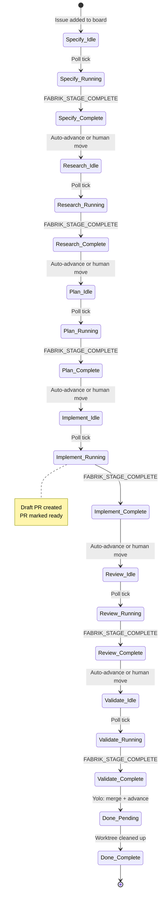
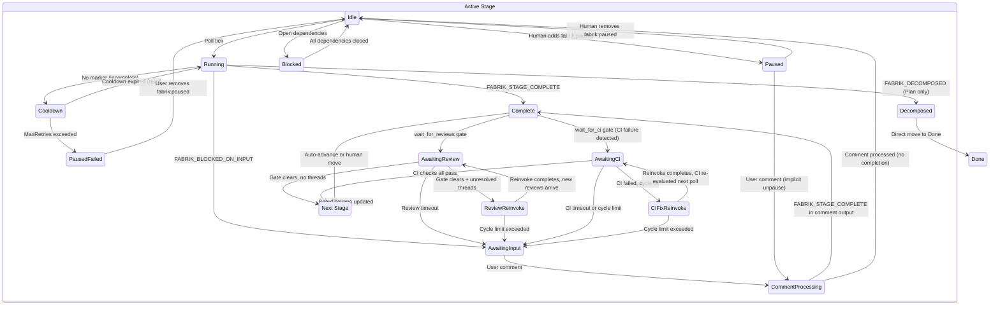
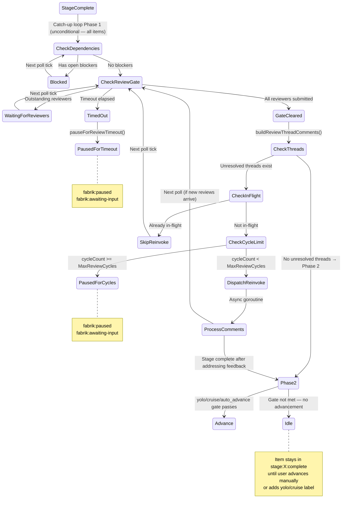

# Fabrik Issue State Machine

Every issue in Fabrik follows a defined lifecycle: from intake through a series of AI-driven stages (Specify → Research → Plan → Implement → Review → Validate → Done), with automated gates at key transitions. The diagram below shows the happy path at a glance.

<figure>

<figcaption>Fabrik issue lifecycle — linear pipeline with gate annotations. Review Gate holds advancement until all PR reviewers submit; CI Gate holds until checks pass; Merge Gate holds until rebase conflicts are resolved.</figcaption>
</figure>

**Not an engineer?** The diagram and the [Pipeline Overview](#pipeline-overview) table are the fastest way to understand Fabrik's workflow.

**Engine contributor or debugger?** The dense reference below covers every reachable state, every label mutation, every guard condition, and the visual state diagrams in [§10](#10-state-diagrams). Use the [State Enumeration](#1-state-enumeration) section as the authoritative source when diagnosing unexpected engine behavior.

---

This document is the formal specification of Fabrik's issue-level state machine: how an issue moves between states across multiple invocations of the engine. It covers every reachable state, every event that triggers a transition, every label mutation, and every guard condition.

**Companion document:** [`stage-lifecycle.md`](stage-lifecycle.md) describes the per-invocation lifecycle (what happens before, during, and after a single Claude invocation). This document describes the cross-invocation state machine (how an issue progresses through the pipeline over time). They are complementary.

**As-built specification:** This document describes what the code actually does, not what it ideally should do. Discrepancies between intended and actual behavior are flagged with `> **Bug?:**` callout blocks.

**Source of truth for:** state enumeration, transition tables, label semantics, and guard conditions. Supersedes partial label references in CLAUDE.md.

---

## Pipeline Overview

Issues traverse a linear pipeline of stages, each corresponding to a column on the GitHub Project board:

```
Specify → Research → Plan → Implement → Review → Validate → Done
```

| Stage | Order | Read-Only | PostToPR | CreateDraftPR | MarkPRReady | WaitForReviews | CleanupWorktree |
|-------|-------|-----------|----------|---------------|-------------|----------------|-----------------|
| Specify | 0 | Yes | No | No | No | No | No |
| Research | 1 | Yes | No | No | No | No | No |
| Plan | 2 | Yes | No | No | No | No | No |
| Implement | 3 | No | Yes | Yes | Yes | No | No |
| Review | 4 | No | Yes | No | Yes | Yes* | No |
| Validate | 5 | No | Yes | No | No | Yes* | No |
| Done | 99 | N/A | No | No | No | No | Yes |

\* All flags in this table reflect the **default stage configuration** shipped in `.fabrik/stages/`. Each flag is opt-in per stage YAML and may differ in custom configurations. `wait_for_reviews` is enabled for Review and Validate in the defaults.

---

## 1. State Enumeration

A state is defined by the tuple `(BoardColumn, ControllingLabelSet)`. Not every label combination is a valid state — only reachable combinations are enumerated.

### 1.1 Controlling Labels

These labels define distinct states (their presence changes what the engine does with an item):

| Label | Type | Defines State? |
|-------|------|----------------|
| `fabrik:locked:<user>` | Lock | Yes — gates processing by other instances |
| `fabrik:editing` | Mutex | Yes — prevents stage dispatch during comment processing |
| `fabrik:paused` | Pause | Yes — blocks all processing unless a comment arrives |
| `fabrik:awaiting-input` | Sub-pause | Yes (with `fabrik:paused`) — blocked-on-input variant |
| `fabrik:awaiting-review` | Gate | Yes — review gate is active |
| `fabrik:awaiting-ci` | Gate | Yes — CI gate is active; waiting for CI checks to pass (checks may be running or have failed) |
| `fabrik:rebase-needed` | Gate | Yes — merge-conflict gate is active; PR is not mergeable against its base |
| `fabrik:blocked` | Dependency | Yes — blocked by open dependency issues |
| `stage:<X>:in_progress` | Progress | Yes — a stage invocation is active |
| `stage:<X>:complete` | Completion | Yes — stage finished successfully |
| `stage:<X>:failed` | Failure | Yes — stage exhausted retry limit |

### 1.2 Modifier Labels (Guard Conditions)

These labels do not define distinct states but influence transition behavior:

| Label | Effect |
|-------|--------|
| `fabrik:yolo` | Forces auto-advance; triggers auto-merge at Validate; overrides `auto_advance: false` |
| `fabrik:cruise` | Forces auto-advance without auto-merge; stops at Validate completion; suppressed by yolo |
| `fabrik:unrestricted` | Passes `--dangerously-skip-permissions` to Claude Code |
| `fabrik:extend-turns` | Pre-grants a 2× turn budget for the next stage invocation; auto-removed on stage success; no-op when `max_turns == 0` |
| `model:<name>` | Selects a specific model for this issue (e.g., `model:opus`) |
| `effort:<level>` | Overrides stage effort level (`low`, `medium`, `high`, `max`); highest wins |
| `base:<branch>` | Overrides worktree base branch; falls back to default if not on remote; updates PR base if PR exists |
| `fabrik:sub-issue` | Informational; marks issue as created by decomposition |

### 1.3 Reachable States by Board Column

For each board column, the reachable sub-states are listed. States are written as `Column + {labels}`. An issue in a column with no controlling labels is in the **Idle** sub-state for that column.

#### Specify / Research / Plan / Implement / Review / Validate (Active Stages)

Each active stage column has the same set of reachable sub-states:

| Sub-State | Labels Present | Description |
|-----------|---------------|-------------|
| **Idle** | (none of the controlling labels) | Ready for the engine to pick up |
| **Locked + In Progress** | `fabrik:locked:<user>`, `stage:<X>:in_progress` | Stage invocation is active |
| **Editing** | `fabrik:editing` | Comment processing is active (Claude invoked for comment review) |
| **Paused** | `fabrik:paused` | Manually paused or engine-escalated pause; no work until unpause or comment |
| **Paused + Failed** | `fabrik:paused`, `stage:<X>:failed` | Engine paused after MaxRetries exhausted |
| **Awaiting Input** | `fabrik:paused`, `fabrik:awaiting-input` | Claude signaled FABRIK_BLOCKED_ON_INPUT; waiting for user comment |
| **Awaiting Review** | `fabrik:awaiting-review`, `stage:<X>:complete` | Review gate active; waiting for PR reviewers (only on stages with `wait_for_reviews: true`) |
| **Awaiting CI** | `fabrik:awaiting-ci` | CI gate active; waiting for CI checks to pass (pending or failed); `stage:<X>:complete` is withheld until CI clears (only on stages with `wait_for_ci: true`) |
| **Rebase Needed** | `fabrik:rebase-needed`, `fabrik:awaiting-ci` | Merge-conflict gate active; PR is not mergeable against its base; engine dispatching a rebase re-invocation (only on stages with `wait_for_ci: true`) |
| **Blocked** | `fabrik:blocked` | Dependency gate active; waiting for blocking issues to close |
| **Complete** | `stage:<X>:complete` | Stage finished; waiting for advancement (manual or auto) |
| **Locked by Other** | `fabrik:locked:<other_user>` | Another Fabrik instance owns this issue |
| **Cooldown** | (no label; in-memory `processedSet` timestamp) | Stage attempted but didn't complete; waiting for cooldown to expire |

> **Note:** The Cooldown sub-state is purely in-memory — there is no label for it. The engine uses `processedSet[stageKey]` timestamps to enforce cooldown. On restart, cooldown state is lost and the item is retried immediately.

#### Done (Cleanup Stage)

| Sub-State | Labels Present | Description |
|-----------|---------------|-------------|
| **Pending Cleanup** | (none) | Worktree exists; engine will remove it |
| **Complete** | `stage:Done:complete` | Worktree removed; terminal state |
| **Paused** | `fabrik:paused` | Manually paused; cleanup skipped |

### 1.4 Label Semantics Reference

| Label | Added By | When Added | Removed By | When Removed | Gates |
|-------|----------|------------|------------|--------------|-------|
| `fabrik:locked:<user>` | `processItem` | Before stage invocation (lock-then-verify protocol) | `releaseLock` | On stage completion, permanent failure, blocked-on-input, decomposed, or lock conflict loss | Prevents other instances from processing the item |
| `fabrik:editing` | `processComments` | Step 2 of comment processing | `processComments` | Step 9 of comment processing (also on error paths) | Prevents `processItem` from starting a new stage invocation |
| `fabrik:paused` | `escalateFailedStage`, `blockOnInput`, `pauseForReviewTimeout`, `pauseForReviewCycleLimit`, `pauseForCITimeout`, `pauseForCIFixCycleLimit`, `pauseForRebaseCycleLimit`, `attemptMergeOnValidate` (on ErrNotMergeable or CI wait timeout) | After MaxRetries, FABRIK_BLOCKED_ON_INPUT, review/CI/rebase timeout or cycle limit, or unmergeable PR | User (manual removal), or `processItem` (on new comment that triggers unpause) | When user removes it manually, or user comments on a paused issue | Blocks all processing; user comment is an implicit resume |
| `fabrik:awaiting-input` | `blockOnInput`, `pauseForReviewTimeout`, `pauseForReviewCycleLimit`, `pauseForCITimeout`, `pauseForCIFixCycleLimit` | After FABRIK_BLOCKED_ON_INPUT or review/CI timeout/cycle limit | `unblockAwaitingInput` | When user comment arrives | Combined with `fabrik:paused`, identifies the "awaiting user input" pause variant |
| `fabrik:awaiting-review` | `handleStageComplete` (Path 1), `checkReviewGate` (Path 2) | Path 1: optimistically after stage completion when `wait_for_reviews: true` (does not check reviewer state — data is stale). Path 2: when `LinkedPRReviewRequests` is non-empty (real gate evaluation) | `checkReviewGate` (both natural clear and timeout paths) | When all reviewers submit, or when timeout elapses (removed by `checkReviewGate` before `pauseForReviewTimeout` is called) | Blocks auto-advance until review gate clears |
| `fabrik:awaiting-ci` | `handleStageComplete` (on FABRIK_STAGE_COMPLETE for `wait_for_ci: true` stages; idempotent); `checkCIGate` (on confirmed CI failure; idempotent) | `handleStageComplete`: immediately on FABRIK_STAGE_COMPLETE — replaces premature `stage:X:complete` and keeps the item in the CI-await window (ADR 032). `checkCIGate`: when CI check runs for the PR head SHA have `conclusion: failure/timed_out/action_required`. | `checkCIGate` (when CI passes or gate times out) | When all CI checks pass (green); or when timeout elapses (removed before `pauseForCITimeout` is called) | Signals CI gate is active (pending or failed); triggers `itemMayNeedWork` updatedAt cache bypass; suppresses dispatcher re-invocation (`itemNeedsWork` returns false); blocks auto-advance until CI gate clears. **`stage:X:complete` is absent while this label is present — it is added by `checkCIGate` when CI clears (R5).** |
| `fabrik:rebase-needed` | `checkMergeabilityGate` (catch-up loop) | When GitHub reports `mergeable == false` on the linked PR — a confirmed base-branch conflict. NOT added when `mergeable == null` (GitHub still computing) — same no-churn principle as R10c. Applied idempotently. | `checkMergeabilityGate` (when mergeable flips back to true) | When GitHub reports `mergeable == true` on the next poll (e.g., after Claude pushes a rebase) | Signals confirmed merge conflict; triggers `itemMayNeedWork` updatedAt cache bypass (base-branch advances don't bump the item's `updatedAt`); blocks CI gate and auto-advance until rebase resolves the conflict |
| `fabrik:blocked` | `checkDependencies` | When open blocking issues exist (first transition only — idempotent) | `checkDependencies` | When all blocking issues close | Blocks stage start (first stage is exempt) |
| `stage:<X>:in_progress` | `processItem` | After lock acquired and verified | `releaseLock` | Same as `fabrik:locked:<user>` | Informational — shows which stage is active on GitHub |
| `stage:<X>:complete` | `handleStageComplete` (for non-`wait_for_ci` stages), `checkCIGate` (for `wait_for_ci: true` stages — added only after CI passes), `handleDecomposed`, cleanup stage handler | `handleStageComplete`: after Claude signals FABRIK_STAGE_COMPLETE on stages without `wait_for_ci: true`. `checkCIGate`: when all CI checks pass (R5) — this is the conjunctive gate (ADR 032): `stage:X:complete` is deferred until the CI gate actually clears, not applied on FABRIK_STAGE_COMPLETE. After FABRIK_DECOMPOSED or worktree cleanup. | Never removed | Permanent | Prevents re-invocation of the stage; triggers catch-up advancement |
| `stage:<X>:failed` | `escalateFailedStage` | After MaxRetries exhausted | `clearFailedStage` | When user removes `fabrik:paused` (manual unpause) | Indicates permanent failure; paired with `fabrik:paused` |
| `fabrik:yolo` | User (manual) | Any time | User (manual) | Any time | Forces auto-advance; triggers auto-merge at Validate; overrides `auto_advance: false` per stage |
| `fabrik:cruise` | User (manual) | Any time | User (manual) | Any time | Forces auto-advance without merge; stops at Validate; suppressed when yolo is also present |
| `fabrik:unrestricted` | User (manual) | Any time | User (manual) | Any time | Passes `--dangerously-skip-permissions` instead of `--permission-mode dontAsk` |
| `fabrik:extend-turns` | User (manual) | Any time | `processItem` (on success) or User (manual) | On successful stage completion; or manual removal | Pre-grants 2× `stage.MaxTurns` budget for the first invocation; no-op when `max_turns == 0` (unlimited); subsequent extensions beyond 2× still require progress detection |
| `model:<name>` | User (manual) | Any time | User (manual) | Any time | Selects Claude model; first label wins if multiple present |
| `effort:<level>` | User (manual) | Any time | User (manual) | Any time | Overrides stage effort level; highest-ranked wins if multiple present |
| `base:<branch>` | User (manual) | Before Research (recommended) | User (manual) | Any time | Overrides worktree base branch; falls back to default if branch not found on remote; if a PR exists, its base branch is updated to match on each stage invocation |
| `fabrik:sub-issue` | Plan stage (via Claude) | During decomposition | N/A | N/A | Informational — marks sub-issues created by decomposition |

---

## 2. Event Enumeration

Eleven distinct event types drive state transitions (§2.1–2.11), plus one TUI display event (§2.12) that does not drive transitions:

### 2.1 Poll Tick

**Trigger:** The engine's poll loop fires on a configurable interval (`PollSeconds`).

**Code path:** `poll()` → `itemMayNeedWork()` (shallow filter) → `FetchItemDetails()` (deep fetch) → `itemNeedsWork()` (full filter) → catch-up loop → dispatch loop → `processItem()`

**Effect:** The primary driver of all state transitions. Each poll cycle evaluates every item on the board through the filter chain and dispatches work for qualifying items.

### 2.2 New User Comment

**Trigger:** A user posts a comment on an issue or its linked PR. Detected by `findNewComments()` — filters out Fabrik-generated comments (prefix `🏭 **Fabrik`) and already-processed comments (ROCKET reaction or `processedSet` entry).

**Code path:** `itemNeedsWork()` detects new comments → `processItem()` routes to `processComments()` or triggers unpause/unblock

**Effect:** Can trigger three distinct behaviors:
1. **Unpause:** On a paused issue, the comment removes `fabrik:paused` (and clears failed state if present) and falls through to comment processing
2. **Unblock awaiting-input:** On an awaiting-input issue, removes both `fabrik:paused` and `fabrik:awaiting-input`, then routes to `processComments()`
3. **Comment processing:** On an active (non-paused) issue, routes directly to `processComments()`

### 2.3 PR Review Submitted

**Trigger:** A reviewer submits a review on the linked PR (APPROVED, CHANGES_REQUESTED, or COMMENTED). Changes `item.LinkedPRReviewRequests` — a submitted reviewer is removed from the outstanding requests list.

**Code path:** Detected by the catch-up loop in `poll()` via `checkReviewGate()`, which inspects `item.LinkedPRReviewRequests` after `FetchItemDetails()`

**Effect:** Can clear the review gate (all outstanding reviewers submitted), allowing auto-advance to proceed. Does not directly trigger a stage invocation.

### 2.4 PR Review Threads with Feedback

**Trigger:** Reviewers leave inline code comments on the linked PR in unresolved review threads. These are real GitHub comments with `DatabaseID`s.

**Code path:** Detected by `buildReviewThreadComments()` in the catch-up loop → `dispatchReviewReinvoke()` → async `processComments()` with synthetic comments

**Effect:** Triggers a review reinvocation cycle — the stage agent is re-invoked via `processComments()` with the review thread comments as input, allowing it to address reviewer feedback. This is a **distinct event type** from regular comment processing (see §6.2).

### 2.5 Blocking Issue Closed

**Trigger:** An issue listed in `item.BlockedBy` transitions to the CLOSED state.

**Code path:** `processItem()` → `checkDependencies()` inspects `item.BlockedBy[].State`

**Effect:** When all blocking issues are closed, `fabrik:blocked` is removed and the stage proceeds. Blocked items are subject to normal `updatedAt` cache filtering — no forced deep-fetch on every poll. `processItem()` sets `processedSet[stageKey]` each time `checkDependencies()` returns true (blocked). This ensures the cooldown-retry path in `itemMayNeedWork()` re-evaluates blocked items after `10 × PollSeconds` even if the blocked item's own `updatedAt` never changes when its dependency closes.

### 2.6 Claude Output Markers

**Trigger:** Claude's output contains one of the Fabrik markers. Checked after each stage invocation.

**Markers and priority order** (enforced by the `if/else if` dispatch chain in `processItem()`):
1. `FABRIK_STAGE_COMPLETE` — highest priority; checked first via `checkCompletion()`
2. `FABRIK_DECOMPOSED` — checked second; only honored if `completed` is false and `err == nil`
3. `FABRIK_BLOCKED_ON_INPUT` — checked third; only honored if `completed` and `decomposed` are both false and `err == nil`

**Code path:** `processItem()` → outcome dispatch based on which marker is present

**Effect:**
- **FABRIK_STAGE_COMPLETE:** `handleStageComplete()` — adds completion label, potentially advances to next stage
- **FABRIK_DECOMPOSED:** `handleDecomposed()` — adds completion label, moves issue directly to Done
- **FABRIK_BLOCKED_ON_INPUT:** `blockOnInput()` — adds `fabrik:paused` + `fabrik:awaiting-input`
- **None of the above:** cooldown retry path; eventually `escalateFailedStage()` if MaxRetries exceeded

**Invocation-level kill paths:** The `max_wall_time` and inactivity timeout mechanisms (see §7.6) can terminate the Claude process before it writes a clean `{"type":"result"}` line. After such a kill, `runClaude()` retroactively scans the already-buffered output for `FABRIK_STAGE_COMPLETE` in intermediate `{"type":"assistant"}` NDJSON lines via `extractTextFromAssistantTurns()`. If found, `completed=true` is returned and the invocation is treated identically to a live `FABRIK_STAGE_COMPLETE`. If not found, `completed=false` is returned and the invocation routes to the cooldown/retry path. These kills are distinguished from engine-shutdown cancellation by the `wasTimedOut` flag, so they do not trigger the hard-error path.

### 2.7 Manual Label Change

**Trigger:** A human adds or removes a label on the issue via the GitHub UI.

**Code path:** Detected on the next poll cycle when labels are fetched

**Effect varies by label:**
- Adding `fabrik:paused` → engine skips the item (unless a comment arrives)
- Removing `fabrik:paused` from a failed issue → `clearFailedStage()` resets retry state
- Adding `fabrik:yolo` or `fabrik:cruise` → enables auto-advance (even mid-run, due to label re-fetch in `handleStageComplete()`)
- Adding `model:<name>` or `effort:<level>` → takes effect on next Claude invocation

### 2.8 Issue Closed

**Trigger:** The issue is closed on GitHub (e.g., by PR merge with `Closes #N`).

**Code path:** `itemMayNeedWork()` and `itemNeedsWork()` check `item.IsClosed`

**Effect:** Closed issues are skipped unless:
1. The current stage is a cleanup stage (`CleanupWorktree: true`) — cleanup can remove the worktree
2. The current stage has a `stage:<X>:complete` label — the catch-up loop can advance to the next stage (e.g., a PR merge closes an issue sitting in Validate with `stage:Validate:complete`; it needs to move to Done)

### 2.9 Review Reinvoke

**Trigger:** The catch-up loop Phase 1 detects unresolved PR review thread comments on any `stage:<X>:complete` item (or `fabrik:awaiting-ci` item on a `wait_for_ci: true` stage) — regardless of whether the item has `fabrik:yolo`, `fabrik:cruise`, or any `auto_advance` config. Phase 1 runs unconditionally; only Phase 2 (stage advancement) is gated on those labels.

**Code path:** `poll()` catch-up loop Phase 1 → `buildReviewThreadComments()` → cycle limit check → `dispatchReviewReinvoke()` → async goroutine → `processComments()` with synthetic comments

**Distinct from regular comment processing because:**
- Uses synthetic comments derived from PR review threads (`LinkedPRReviewThreadComments`), not issue comments
- Has cycle limits (`MaxReviewCycles`, default 5) — exceeding pauses the issue
- Has timeout integration (review wait timeout can also trigger pause)
- Dispatches asynchronously via goroutine with semaphore slot
- The `inFlight` guard prevents double-dispatch across poll cycles
- Resolves review threads (marks them resolved on GitHub) after processing

### 2.10 CI Check Completed

**Trigger:** CI check runs on the PR head SHA transition from pending to a terminal state (success, failure, etc.). Fabrik detects this by polling `FetchCheckRuns` (REST) on each catch-up loop iteration — there are no webhooks.

**Code path:** `poll()` catch-up loop Phase 1 → `checkCIGate()` → `FetchLinkedPR()` (REST, for head SHA) → `FetchCheckRuns()` (REST) → evaluates check run statuses → optionally dispatches `dispatchCIFixReinvoke()` → async goroutine → `processComments()` with synthetic CI failure comment

**Distinct from Review Reinvoke because:**
- Triggered by check run status changes, not reviewer submissions
- Uses `fabrik:awaiting-ci` label (not `fabrik:awaiting-review`)
- Only active on stages with `wait_for_ci: true`
- `fabrik:awaiting-ci` is applied by `handleStageComplete` on FABRIK_STAGE_COMPLETE (the in-flight CI-await marker, present for both pending and failed checks); `stage:X:complete` is **withheld** until `checkCIGate` confirms CI is green (ADR 032)
- Timeout tracked via `FetchLabelAppliedAt` on `fabrik:awaiting-ci` (durable across restarts), not in-memory
- CI-fix cycle counter is `ciFixCycleCount` (keyed by `issueKey + "-" + stageName`)

### 2.11 Base Branch Advanced

**Trigger:** The PR's base branch moves forward (a different PR merges) while this branch is sitting in the post-`stage:Validate:complete` catch-up window. GitHub recomputes `mergeable` on the linked PR; if the new base conflicts with this branch, `mergeable` transitions from `true` (or `null`) to `false`.

**Code path:** `poll()` catch-up loop Phase 1 → `checkMergeabilityGate()` → `FetchLinkedPR()` (REST, for PR number) → `FetchPRMergeable()` (REST, for the single-PR `mergeable` field) → evaluates the flag → optionally dispatches `dispatchRebaseReinvoke()` → async goroutine → `processComments()` with a synthetic rebase-required comment

**Distinct from CI Check Completed because:**
- Triggered by base-branch movement, not check run status changes
- Uses `fabrik:rebase-needed` label (not `fabrik:awaiting-ci`)
- Runs **before** the CI gate in catch-up Phase 1 — a PR that cannot merge has no reason to spin on CI-await
- Only active on stages with `wait_for_ci: true` (same opt-in as the CI gate — these are the stages admitted to the catch-up window via `fabrik:awaiting-ci`)
- `fabrik:rebase-needed` is only applied on **confirmed conflict** (`mergeable == false`), not on `mergeable == null` (GitHub still computing)
- Rebase cycle counter is `rebaseCycleCount` (keyed by `issueKey + "-" + stageName`)
- Resolution relies on Claude rebasing in the worktree (to handle semantic collisions like duplicated ADR numbers) rather than an engine-side `git rebase`

### 2.12 TurnProgressEvent (TUI Display Event)

**Trigger:** A `{"type":"user"}` NDJSON line is written to Claude's stdout pipe during a Claude invocation. Each logical turn (one user→assistant cycle) begins with exactly one such line (either the initial prompt or a tool-result response), so this fires once per logical turn.

**Code path:** `runClaude()` stdout pipe → `turnCountingWriter.Write()` → detects `type == "user"` line → increments per-invocation counter → calls `claudeTurnProgress(issueNumber, turnsUsed, maxTurns)` → `Engine.emit(TurnProgressEvent{...})` → TUI channel

**Effect:** Purely additive display — does not trigger any state transitions, label mutations, or issue processing. The TUI consumes `TurnProgressEvent` to update the live turn counter shown in:
- The In Progress pane row for the active issue (width-adaptive badge `[N/M turns]` / `[N/M]` / omitted)
- The detail panel for the selected active item (`Turns: N/M`)

`TurnProgressEvent` is only emitted in TUI mode (`claudeTurnProgress` is nil in plain-text mode and tests). It uses the non-blocking `emit` path (drop-if-full), so turn-progress updates are best-effort and may be dropped under backpressure. This does not affect engine behavior because the event is display-only; at most one event is produced per logical turn.

**`MaxTurns` in the event** carries the effective budget for the current invocation — `effectiveBudget` as computed in `InvokeClaude()` (which already accounts for `opts.MaxTurnsOverride` from the extension loop). This means:
- First invocation without `fabrik:extend-turns`: `stage.MaxTurns`
- First invocation with `fabrik:extend-turns`: `2 × stage.MaxTurns`
- Extension loop second iteration: `stage.MaxTurns` (per-invocation limit, not cumulative)

---

## 3. Transition Tables

### 3.1 Happy Path — Linear Stage Progression

This table shows the normal flow when an issue progresses through the pipeline without interruption.

| Current State | Event | Guard | Resulting State | Labels Added | Labels Removed | Side Effects |
|--------------|-------|-------|-----------------|--------------|----------------|--------------|
| Column `<X>`, Idle | Poll tick | Stage exists, not paused/locked/editing/blocked, cooldown expired | Column `<X>`, Locked + In Progress | `fabrik:locked:<user>`, `stage:<X>:in_progress` | | Lock-then-verify protocol (2s delay), worktree ensured, Claude invoked |
| Column `<X>`, Locked + In Progress | FABRIK_STAGE_COMPLETE | shouldAdvance=false (see below) | Column `<X>`, Complete | `stage:<X>:complete` | `fabrik:locked:<user>`, `stage:<X>:in_progress`, `stage:<X>:failed` (if present) | Output posted; draft PR created (if `create_draft_pr`); PR marked ready (if `mark_pr_ready_on_complete`); lock released |
| Column `<X>`, Complete | Human moves to next column | — | Column `<Y>`, Idle | | | Manual board column move |
| Column `<X>`, Locked + In Progress | FABRIK_STAGE_COMPLETE | shouldAdvance=true (see below) | Column `<Y>`, Idle | `stage:<X>:complete` | `fabrik:locked:<user>`, `stage:<X>:in_progress`, `stage:<X>:failed` (if present) | Output posted; draft PR / mark ready (if configured); board column updated to next stage; lock released |
| Column `<X>`, Complete | Poll tick (catch-up) | yolo or cruise active, `stage:<X>:complete` present, no pending comments | Column `<Y>`, Idle | | | Board column updated to next stage (Path 2 advancement) |

**`shouldAdvance` resolution (Path 1, `handleStageComplete`):**

1. `yoloActive = cfg.Yolo || hasYoloLabel(item)` — re-fetches labels first to pick up mid-run changes
2. `cruiseActive = !yoloActive && hasCruiseLabel(item)` — suppressed when yolo is active
3. `shouldAdvance = yoloActive || cruiseActive`
4. If `stage.AutoAdvance != nil` AND neither `fabrik:yolo` nor `fabrik:cruise` label is present: `shouldAdvance = *stage.AutoAdvance` — this means `auto_advance: false` in YAML overrides `cfg.Yolo` (the `--yolo` flag), but explicit yolo/cruise labels override `auto_advance: false`
5. If `cruiseActive && stage.Name == "Validate"`: `shouldAdvance = false` — cruise stops at Validate

**Catch-up loop `shouldAdvance` resolution (Path 2):** The catch-up loop first checks `cfg.Yolo || hasYoloLabel(item) || hasCruiseLabel(item)` — items without any of these are skipped entirely. Then: if neither yolo nor cruise LABEL is present and `stage.AutoAdvance` is explicitly false, the item is skipped. This produces the same behavior as Path 1.

**Validate → Done special cases:**

| Current State | Event | Guard | Resulting State | Labels Added | Labels Removed | Side Effects |
|--------------|-------|-------|-----------------|--------------|----------------|--------------|
| Validate, Locked + In Progress | FABRIK_STAGE_COMPLETE | yolo active | Done, Pending Cleanup | `stage:Validate:complete` | `fabrik:locked:<user>`, `stage:Validate:in_progress` | PR merged; board column updated to Done |
| Validate, Complete | Poll tick (catch-up) | yolo active | Done, Pending Cleanup | | | PR merged; board column updated to Done |
| Validate, Locked + In Progress | FABRIK_STAGE_COMPLETE | cruise active (no yolo) | Validate, Complete | `stage:Validate:complete` | `fabrik:locked:<user>`, `stage:Validate:in_progress` | Cruise stops here — no merge, no advancement to Done |
| Validate, Complete | Poll tick (catch-up) | cruise active (no yolo) | Validate, Complete | | | Cruise catch-up skips Validate — no merge, no advancement |
| Done, Pending Cleanup | Poll tick | Worktree exists on disk | Done, Complete | `stage:Done:complete` | | Worktree removed from disk |

### 3.2 Off-Path Transitions

#### Pause / Unpause

| Current State | Event | Guard | Resulting State | Labels Added | Labels Removed | Side Effects |
|--------------|-------|-------|-----------------|--------------|----------------|--------------|
| Any active column, Idle | Human adds `fabrik:paused` | — | Same column, Paused | | | Engine skips item on next poll |
| Same column, Paused | Human removes `fabrik:paused` | — | Same column, Idle | | | Engine processes item on next poll |
| Same column, Paused | New user comment | — | Same column, Idle → comment processing | | `fabrik:paused` | Unpause; `clearFailedStage()` also called (clears any failed label + resets retries); falls through to `processComments()` |

#### Lock Conflict (Multi-Instance)

| Current State | Event | Guard | Resulting State | Labels Added | Labels Removed | Side Effects |
|--------------|-------|-------|-----------------|--------------|----------------|--------------|
| Any column, Idle | Poll tick (two instances) | Both acquire lock | Depends on tie-break | `fabrik:locked:<user>` (both) | Loser's lock removed | 2s verify delay; lexicographic tie-break: lower username wins, higher username yields |
| Any column, Locked by Other | Poll tick | `fabrik:locked:<other>` present | Same (skipped) | | | `itemNeedsWork` returns false; `processItem` also checks and skips |

#### Dependency Blocking

| Current State | Event | Guard | Resulting State | Labels Added | Labels Removed | Side Effects |
|--------------|-------|-------|-----------------|--------------|----------------|--------------|
| Any column (not first stage), Idle | Poll tick | Open blockers in `item.BlockedBy` | Same column, Blocked | `fabrik:blocked` | | Comment posted listing blockers (first time only); TUI event emitted |
| Same column, Blocked | Poll tick | All blockers now CLOSED | Same column, Idle | | `fabrik:blocked` | Item eligible for processing on next poll |
| First stage, Idle | Poll tick | Open blockers exist | Same column, Idle | | | First stage is exempt from dependency blocking |

#### Awaiting Input (FABRIK_BLOCKED_ON_INPUT)

| Current State | Event | Guard | Resulting State | Labels Added | Labels Removed | Side Effects |
|--------------|-------|-------|-----------------|--------------|----------------|--------------|
| Column `<X>`, Locked + In Progress | FABRIK_BLOCKED_ON_INPUT | `completed` and `decomposed` both false, no error | Same column, Awaiting Input | `fabrik:paused`, `fabrik:awaiting-input` | `fabrik:locked:<user>`, `stage:<X>:in_progress` | Lock released |
| Same column, Awaiting Input | New user comment | — | Same column → comment processing | | `fabrik:paused`, `fabrik:awaiting-input` | `unblockAwaitingInput()` clears processedSet entry; routes to `processComments()` |

#### Awaiting Review (wait_for_reviews gate)

| Current State | Event | Guard | Resulting State | Labels Added | Labels Removed | Side Effects |
|--------------|-------|-------|-----------------|--------------|----------------|--------------|
| Column `<X>`, Locked + In Progress | FABRIK_STAGE_COMPLETE | `wait_for_reviews: true`, shouldAdvance | Same column, Awaiting Review | `stage:<X>:complete`, `fabrik:awaiting-review` | `fabrik:locked:<user>`, `stage:<X>:in_progress` | Path 1: optimistic label application; lock released; returns without advancing |
| Same column, Awaiting Review + Complete | Poll tick (catch-up) | Outstanding reviewers remain, not timed out | Same (blocked) | `fabrik:awaiting-review` (idempotent) | | checkReviewGate logs pending reviewers |
| Same column, Awaiting Review + Complete | PR review submitted | All reviewers submitted | Same column, Complete → advance | | `fabrik:awaiting-review` | Gate cleared; falls through to advance or review reinvoke |
| Same column, Awaiting Review + Complete | Poll tick (catch-up) | Timeout elapsed | Same column, Awaiting Input | `fabrik:paused`, `fabrik:awaiting-input` | `fabrik:awaiting-review` | `pauseForReviewTimeout()` posts explanatory comment |

#### Awaiting CI (wait_for_ci gate)

In the conjunctive gate design (ADR 032), `stage:X:complete` is **withheld** until the CI gate actually clears. `handleStageComplete` adds `fabrik:awaiting-ci` as the durable in-flight marker; `checkCIGate` adds `stage:X:complete` once CI passes.

| Current State | Event | Guard | Resulting State | Labels Added | Labels Removed | Side Effects |
|--------------|-------|-------|-----------------|--------------|----------------|--------------|
| Column `<X>`, Locked + In Progress | FABRIK_STAGE_COMPLETE | `wait_for_ci: true` | Same column, Awaiting CI | `fabrik:awaiting-ci` (+ `fabrik:awaiting-review` if `wait_for_reviews: true`) | `fabrik:locked:<user>`, `stage:<X>:in_progress` | Conjunctive gate: `stage:<X>:complete` NOT added here — deferred to `checkCIGate` when CI passes (ADR 032). Dispatcher will not re-invoke while `fabrik:awaiting-ci` is present (`itemNeedsWork` returns false for R3). |
| Same column, Awaiting CI | Poll tick (catch-up) | CI checks still pending (no failure) | Same (blocked) | (none — `fabrik:awaiting-ci` already present) | | `checkCIGate` logs pending checks; re-evaluates next poll |
| Same column, Awaiting CI | Poll tick (catch-up) | Any CI check failed | Same column, Awaiting CI (failure confirmed) | `fabrik:awaiting-ci` (idempotent) | | CI failure detected; dispatch CI-fix reinvoke or pause on cycle limit |
| Same column, Awaiting CI | Poll tick (catch-up) | All CI checks green (or no CI configured — R5) | Same column, Complete → advance | `stage:<X>:complete` | `fabrik:awaiting-ci` | Gate cleared; `checkCIGate` adds `stage:<X>:complete` and removes `fabrik:awaiting-ci`; falls through to advance (or merge for Validate+yolo) |
| Same column, Awaiting CI | Poll tick (catch-up) | `fabrik:awaiting-ci` applied ≥ CIWaitTimeout ago | Same column, Awaiting Input | `fabrik:paused`, `fabrik:awaiting-input` | `fabrik:awaiting-ci` | `pauseForCITimeout()` posts explanatory comment; timeout detected via `FetchLabelAppliedAt` |

**Merge-conflict gate (`wait_for_ci: true` only; runs before the CI gate):**

| Current State | Event | Guard | Resulting State | Labels Added | Labels Removed | Side Effects |
|--------------|-------|-------|-----------------|--------------|----------------|--------------|
| Same column, Awaiting CI | Poll tick (catch-up) | `mergeable == false` on linked PR | Same column, Rebase Needed | `fabrik:rebase-needed` | | Dispatch rebase reinvoke or pause on cycle limit |
| Same column, Rebase Needed (Awaiting CI + rebase-needed) | Poll tick (catch-up) | `mergeable == true` on linked PR (Claude's rebase push landed) | Same column, Awaiting CI → (CI gate evaluates next) | | `fabrik:rebase-needed` | Gate cleared; catch-up falls through to the CI gate on the same poll |
| Same column, Awaiting CI | Poll tick (catch-up) | `mergeable == null` (GitHub still computing) | Same (blocked, no label) | | | Re-evaluated on next poll; no label churn for transient unknown state |
| Same column, Rebase Needed | Poll tick (catch-up) | `rebaseCycleCount` ≥ `MaxRebaseCycles` | Same column, Awaiting Input | `fabrik:paused`, `fabrik:awaiting-input` | | `pauseForRebaseCycleLimit()` posts explanatory comment; `fabrik:rebase-needed` is left in place so the human can see why Fabrik stopped |

#### Cooldown Retry and Failed Stage Escalation

| Current State | Event | Guard | Resulting State | Labels Added | Labels Removed | Side Effects |
|--------------|-------|-------|-----------------|--------------|----------------|--------------|
| Column `<X>`, Locked + In Progress | `max_wall_time` exceeded | SIGTERM→10s→SIGKILL; `FABRIK_STAGE_COMPLETE` found in buffered assistant stream | Same column, Complete | `stage:<X>:complete` | `fabrik:locked:<user>`, `stage:<X>:in_progress` | `extractTextFromAssistantTurns()` recovers marker; same completion flow as live FABRIK_STAGE_COMPLETE |
| Column `<X>`, Locked + In Progress | `max_wall_time` exceeded | SIGTERM→10s→SIGKILL; no `FABRIK_STAGE_COMPLETE` in buffered stream | Same column, Cooldown | | | `wasTimedOut=true`; routes to cooldown/retry (not a hard error); lock NOT released |
| Column `<X>`, Locked + In Progress | Inactivity timeout (15m) | No streamed output for 15 consecutive minutes; `FABRIK_STAGE_COMPLETE` found in buffered stream | Same column, Complete | `stage:<X>:complete` | `fabrik:locked:<user>`, `stage:<X>:in_progress` | Same completion flow |
| Column `<X>`, Locked + In Progress | Inactivity timeout (15m) | No streamed output for 15 consecutive minutes; no `FABRIK_STAGE_COMPLETE` in buffered stream | Same column, Cooldown | | | `wasTimedOut=true`; routes to cooldown/retry; lock NOT released |
| Column `<X>`, Locked + In Progress | No marker in output | `claudeRan` is true (includes both error-free runs and runs that errored mid-execution; excludes only start failures like binary-not-found) | Same column, Cooldown | | | `processedSet[stageKey]` updated; cooldown = `PollSeconds * 10`; lock NOT released (stays locked through retries) |
| Same column, Cooldown | Poll tick | Cooldown expired | Same column, Locked + In Progress (retry) | | `stage:<X>:failed` (if present from prior escalation) | Claude re-invoked with `resume=true` |
| Same column, Cooldown | Retry count ≥ MaxRetries | `claudeRan && MaxRetries > 0` | Same column, Paused + Failed | `fabrik:paused`, `stage:<X>:failed` | `fabrik:locked:<user>`, `stage:<X>:in_progress` | `escalateFailedStage()` posts comment; lock released |
| Same column, Paused + Failed | Human removes `fabrik:paused` | `stage:<X>:failed` present OR `pausedDueToRetries` in memory | Same column, Idle | | `stage:<X>:failed` | `clearFailedStage()` resets retryCount, pausedDueToRetries, processedSet, reviewCycleCount |

#### Turn Limit Extension

When Claude exits a stage invocation due to `max_turns` (i.e., the per-invocation turn usage satisfies `invUsage.TurnsUsed >= currentBudget` and `!completed && err == nil`), the engine evaluates whether to extend before entering the cooldown/retry path.

**Extension trigger condition:** `!completed && err == nil && stage.MaxTurns > 0 && invUsage.TurnsUsed >= currentBudget`

**Hard cap:** 3× `stage.MaxTurns` total across all invocations. When `totalMultiple >= 3`, no further extension is attempted.

**Per-stage progress signals:**

| Stage | Progress Signal | API Cost |
|-------|----------------|----------|
| **Implement** | New git commit (HEAD SHA changed) OR (baseline was clean AND working tree is now dirty — uncommitted file edits by Claude) | Zero — local git only |
| **Review** | New git commit OR `LinkedPRResolvedThreadCount` increased | One `FetchItemDetails` GraphQL call (only if no new commit) |
| **Validate** | Total comment count on issue/PR increased | One `FetchItemDetails` GraphQL call |
| **All others** (Research, Specify, Plan, custom) | No signal — always fail on turn-limit | None |

The "baseline clean AND working tree dirty" guard for Implement prevents a pre-existing dirty worktree (e.g. from a prior interrupted session) from counting as progress. Only new uncommitted changes made during the invocation trigger extension.

**Extension loop behavior (within a single `processItem` call — no poll-cycle gap):**

1. At invocation start, a `progressBaseline` is snapshotted: git HEAD SHA (Implement, Review), working-tree dirty state (Implement), comment count (Validate), and resolved thread count (Review).
2. Claude is invoked with the current budget.
3. If the turn limit is hit AND `totalMultiple < 3`: call `detectProgress`. If progress → `totalMultiple++`, re-invoke with `--resume`. If no progress or progress check fails → proceed to cooldown/retry as today.
4. Output is accumulated across all invocations before posting as a single stage comment.
5. WIP commit and push are deferred to after the loop.

**`fabrik:extend-turns` label:** When present at invocation start, the first invocation receives `2 × stage.MaxTurns` as its budget (pre-granted extension, no progress check required for the first turn-limit hit). Subsequent extensions beyond 2× still require the progress check. The label is auto-removed on successful stage completion; `ErrNotFound` on removal is treated as success (user removed it manually). The label is a no-op when `stage.MaxTurns == 0`.

**Log tag:** `[#N extend-turns]` — emitted on **every** `detectProgress` call (pass or fail), reporting the evaluated signals and `has_progress=true/false`. When extension is granted, an additional line logs the new budget multiple and cumulative turns used.

| Current State | Event | Guard | Resulting State | Labels Added | Labels Removed | Side Effects |
|--------------|-------|-------|-----------------|--------------|----------------|--------------|
| Column `<X>`, Locked + In Progress | Turn limit hit | `totalMultiple < 3`; progress detected | Same column, Locked + In Progress (extension) | | | `totalMultiple++`; `resume=true`; output accumulated; no WIP commit or push between extensions |
| Column `<X>`, Locked + In Progress | Turn limit hit | `totalMultiple >= 3` (hard cap) | Same column, Cooldown | | | Hard cap reached; treated as turn-limit failure; `processedSet` updated; WIP commit + push |
| Column `<X>`, Locked + In Progress | Turn limit hit | No progress detected or progress check failed | Same column, Cooldown | | | No extension; treated as turn-limit failure; `processedSet` updated; WIP commit + push |
| Column `<X>`, Locked + In Progress | FABRIK_STAGE_COMPLETE (any extension) | `completed = true` | Same column, Complete | `stage:<X>:complete` | `fabrik:locked:<user>`, `stage:<X>:in_progress`, `fabrik:extend-turns` (if present) | Normal completion flow; extend-turns label auto-removed |

#### Cleanup Stage

| Current State | Event | Guard | Resulting State | Labels Added | Labels Removed | Side Effects |
|--------------|-------|-------|-----------------|--------------|----------------|--------------|
| Done, Pending Cleanup | Poll tick | Worktree exists, not paused, not already complete | Done, Complete | `stage:Done:complete` | | Worktree removed; no lock/Claude/comment processing |
| Done, Complete | Poll tick | Already complete | Done, Complete (no-op) | | | Skipped by both `itemMayNeedWork` and `processItem` |

#### Review Reinvoke

| Current State | Event | Guard | Resulting State | Labels Added | Labels Removed | Side Effects |
|--------------|-------|-------|-----------------|--------------|----------------|--------------|
| Column `<X>`, Awaiting Review + Complete | Review gate clears + unresolved thread comments | Not in-flight, cycle count < MaxReviewCycles | Same column (comment processing via async goroutine) | `fabrik:editing` (during processing) | | `dispatchReviewReinvoke()` spawns goroutine; `reviewCycleCount` incremented; `inFlight` set; semaphore acquired |
| Column `<X>`, Awaiting Review + Complete | Review gate clears + unresolved thread comments | Cycle count ≥ MaxReviewCycles | Same column, Awaiting Input | `fabrik:paused`, `fabrik:awaiting-input` | | `pauseForReviewCycleLimit()` posts comment |
| Column `<X>`, Awaiting Review + Complete | Review gate clears + unresolved thread comments | Already in-flight | Same (skipped) | | | Previous reinvoke goroutine still running; skipped entirely (no cycle-limit check) |

#### CI Fix Reinvoke

| Current State | Event | Guard | Resulting State | Labels Added | Labels Removed | Side Effects |
|--------------|-------|-------|-----------------|--------------|----------------|--------------|
| Column `<X>`, Awaiting CI | Poll tick (catch-up) | CI failed; not in-flight; `ciFixCycleCount` < MaxCiFixCycles | Same column (CI-fix goroutine running) | `fabrik:editing` (during processing) | | `dispatchCIFixReinvoke()` spawns goroutine; `ciFixCycleCount` incremented; `inFlight` set; semaphore acquired; synthetic CI-fix comment passed to `processComments()` |
| Column `<X>`, Awaiting CI | Poll tick (catch-up) | CI failed; `ciFixCycleCount` ≥ MaxCiFixCycles | Same column, Awaiting Input | `fabrik:paused`, `fabrik:awaiting-input` | | `pauseForCIFixCycleLimit()` posts explanatory comment |
| Column `<X>`, Awaiting CI | Poll tick (catch-up) | CI failed; already in-flight | Same (skipped) | | | Previous CI-fix goroutine still running; skipped entirely |

#### Rebase Reinvoke

| Current State | Event | Guard | Resulting State | Labels Added | Labels Removed | Side Effects |
|--------------|-------|-------|-----------------|--------------|----------------|--------------|
| Column `<X>`, Rebase Needed + Complete | Poll tick (catch-up) | `mergeable == false`; not in-flight; `rebaseCycleCount` < MaxRebaseCycles | Same column (rebase goroutine running) | `fabrik:editing` (during processing) | | `dispatchRebaseReinvoke()` spawns goroutine; `rebaseCycleCount` incremented; `inFlight` set; semaphore acquired; synthetic rebase-required comment passed to `processComments()` |
| Column `<X>`, Rebase Needed + Complete | Poll tick (catch-up) | `mergeable == false`; `rebaseCycleCount` ≥ MaxRebaseCycles | Same column, Awaiting Input | `fabrik:paused`, `fabrik:awaiting-input` | | `pauseForRebaseCycleLimit()` posts explanatory comment (usually signals a semantic conflict needing human judgment) |
| Column `<X>`, Rebase Needed + Complete | Poll tick (catch-up) | `mergeable == false`; already in-flight | Same (skipped) | | | Previous rebase goroutine still running; skipped entirely |

---

## 4. Comment Processing Lifecycle

When new comments are detected on an issue (or synthetic review comments on a PR), the engine processes them through `processComments()`. This is an 11-step flow.

### 4.1 Comment Detection

`findNewComments()` filters `item.Comments` to find unprocessed comments using three independent dedup signals:

1. **In-memory `processedSet`** (session-scoped) — skip comments whose key is already present. Fast but lost on restart.
2. **`🏭 **Fabrik` body prefix** (engine-authored output convention) — skip comments whose body starts with this header. Durable but requires the header to be present.
3. **🚀 ROCKET reaction** (durable, cross-restart) — skip comments that already have a rocket reaction. Applied to user comments by `processComments` step 10 after processing; **also applied by the engine to every comment it posts** immediately after `AddComment` succeeds.

Any single signal catching the comment is sufficient to skip it. The three signals are orthogonal — any two can fail independently without triggering the self-review loop.

**Dedup coverage by comment type:**
- **Engine-authored comments**: carry signals (2) and (3) — the `🏭 **Fabrik` prefix (when formatted via `formatOutputComment`) and a 🚀 reaction added by the engine at post time.
- **User comments**: carry signals (1) and (3) after processing — the `processedSet` entry added during `processComments`, and the 🚀 reaction added at step 10.

> **Invariant:** every engine-emitted `AddComment` call must start with `🏭 **Fabrik — <context>**`. This is an engine-wide convention enforced by `TestAddCommentCompliance` in `engine/compliance_test.go`, not just a detection heuristic.

### 4.2 The 11-Step Flow

| Step | Action | Code | Side Effects |
|------|--------|------|--------------|
| 1 | React with 👀 to all new comments | `AddCommentReaction("eyes")` / `AddPRReviewCommentReaction("eyes")` | Signals acknowledgment to the user |
| 2 | Add `fabrik:editing` label | `AddLabelToIssue("fabrik:editing")` | Prevents `processItem` from starting a new stage invocation |
| 3 | Ensure worktree exists | `EnsureWorktree()` | Creates or updates worktree; writes context files |
| 4 | Invoke Claude with comment review prompt | `InvokeForComments()` | Uses `comment_prompt` / `comment_skill` and `comment_max_turns` |
| 5 | Check for FABRIK_STAGE_COMPLETE in output | `checkCompletion()` | Determines if comment processing resolved the stage |
| 6 | Extract and apply FABRIK_ISSUE_UPDATE if present | `extractUpdatedBody()` | Applied unconditionally when markers are present; stripped from output regardless |
| 7 | Strip all Fabrik markers from output | `stripLine()` calls | Removes FABRIK_STAGE_COMPLETE, FABRIK_BLOCKED_ON_INPUT, FABRIK_DECOMPOSED, FABRIK_SUMMARY_BEGIN/END |
| 8 | Post or update stage comment | `AddComment()` / `UpdateComment()` | For `post_to_pr` stages: always posts new comment on issue (labeled as "comment review"); for other stages: rewrites existing stage comment or creates new one. **Review-reinvoke branch (Step 8b):** when the input batch is all-`ReviewThreadID` comments (`isReviewReinvoke` == true) and `output != ""`, also posts a Fabrik-marked `"<StageName> (review feedback addressed)"` comment on the linked PR (via `FindPRForIssue`); includes per-thread footer with path:line for each addressed thread; skipped if no linked PR is found (logs warning). The issue comment is always posted first; the PR comment is additive. |
| 9 | Remove `fabrik:editing` label | `RemoveLabelFromIssue("fabrik:editing")` | Releases the editing mutex |
| 10 | React with 🚀 to all processed comments + resolve review threads | `AddCommentReaction("rocket")` / `AddPRReviewCommentReaction("rocket")` + `ResolveReviewThread()` | Marks comments as processed (durable); resolves addressed review threads |
| 11 | If FABRIK_STAGE_COMPLETE was detected: handle completion | `handleStageComplete()` | Same completion flow as a normal stage invocation (advance, PR ops, etc.) |

### 4.3 Comment Processing Entry Points

Comments can trigger processing through three paths in `processItem()`:

1. **Awaiting-input unblock:** `isAwaitingInput(item)` is true + new comments → `unblockAwaitingInput()` → `processComments()`
2. **Paused unpause:** `fabrik:paused` present + new comments → remove `fabrik:paused`, `clearFailedStage()` → fall through → `processComments()`
3. **Normal comment processing:** Item is not paused → `findNewComments()` finds comments → `processComments()`

### 4.4 markCommentsSeenByStage

After a stage invocation (not comment processing), `markCommentsSeenByStage()` adds ROCKET reactions to all pre-existing comments that were included in the prompt as context. This prevents those comments from triggering the awaiting-input unblock logic on subsequent polls.

---

## 5. PR Lifecycle Integration

### 5.1 Draft PR Creation

**When:** After a stage signals FABRIK_STAGE_COMPLETE, if the stage has `create_draft_pr: true`.

**Code path:** `processItem()` → `ensureDraftPR()`

**Flow:**
1. Check for existing PR via `FindPRForIssue()` — if found, ensure body contains `Closes #N` and return
2. Push the issue branch via `PushBranch()`
3. Create draft PR via `CreateDraftPR()` with title from issue, targeting `baseBranch`, body containing `Closes #N`

### 5.2 Mark PR Ready

**When:** After a stage signals FABRIK_STAGE_COMPLETE, if the stage has `mark_pr_ready_on_complete: true`.

**Code path:** `processItem()` → `markPRReady()`

**Flow:**
1. Push the issue branch
2. Find PR number (uses `knownPR` from `ensureDraftPR` if available, else `FindPRForIssue()`)
3. `MarkPRReady()` transitions draft → ready-for-review

**Note:** This triggers external review bots and populates `LinkedPRReviewRequests`, which is why the review gate in `handleStageComplete()` (Path 1) is always optimistic — reviewer data is stale at that point.

### 5.3 Linked PR Discovery

Fabrik discovers PR comments through the `closedByPullRequestsReferences` GraphQL field, which traverses issue → linked PRs → PR comments. The `Closes #N` keyword in the PR body creates this linkage.

### 5.4 Auto-Merge on Validate

**When:** Validate stage completes and yolo is active (either `cfg.Yolo` or `fabrik:yolo` label).

**Code path:** `handleStageComplete()` → `attemptMergeOnValidate()` (Path 1); or catch-up loop → `attemptMergeOnValidate()` (Path 2)

**Flow:**
1. Find linked PR via `FindPRForIssue()`
2. Attempt merge via `MergePR()`. `MergePR` first checks the PR's `merged` field — if the PR was already merged (e.g., by a human), it returns nil immediately (no-op success). Otherwise it checks `mergeable` and attempts the merge.
3. On `ErrNotMergeable`: post comment, add `fabrik:paused`, return error (prevents completion label from being added, allowing retry)
4. On other API errors: return error (same retry behavior)
5. On success (including already-merged): log and return nil — advancement proceeds

**Important — Path 1 vs Path 2 distinction:** In Path 1 (`handleStageComplete`), the merge runs BEFORE adding `stage:Validate:complete`. On merge failure, the completion label is not added, so `itemNeedsWork` won't skip the stage and the engine can retry the entire Validate invocation after cooldown. In Path 2 (catch-up loop), the completion label already exists when `attemptMergeOnValidate()` runs (the catch-up loop operates on items with `stage:Validate:complete`). A merge failure in Path 2 pauses the issue but does NOT remove the completion label — the stage will not be re-invoked; only the merge attempt will be retried after unpausing.

---

## 6. Review Gate and Review Reinvoke

### 6.1 Two-Phase Review Gate

The review gate has two paths that handle different timing scenarios:

**Path 1: `handleStageComplete()` (inside worker goroutine)**
- Runs immediately after a stage completes
- Reviewer data is STALE (reviewers are assigned only after `MarkPRReady`, which just ran)
- Optimistically applies `fabrik:awaiting-review` label
- Returns without advancing — defers to Path 2

**Path 2: Catch-up loop in `poll()` (in poll goroutine)**
- Runs on subsequent poll cycles for items with `stage:<X>:complete`
- Has FRESH reviewer data from `FetchItemDetails()` (both `LinkedPRReviewRequests` and `LinkedPRReviews`)
- Calls `checkReviewGate()` for the real gate evaluation
- **Gate clears only when `len(LinkedPRReviewRequests) == 0` AND `len(LinkedPRReviews) > 0`.** This means: no requested reviewers are outstanding AND at least one review has been submitted. Waiting on `LinkedPRReviews` (not just `LinkedPRReviewRequests`) is what catches bot reviewers like Copilot and Gemini that self-trigger via webhooks without ever appearing in the formal requested-reviewer list.
- Three outcomes:
  - `(blocked=true, timedOut=false)` — still waiting; `fabrik:awaiting-review` maintained. Either outstanding requested reviewers remain, or no reviews have been submitted yet (bots may still be processing).
  - `(blocked=false, timedOut=false)` — gate cleared naturally; `fabrik:awaiting-review` removed; advance or reinvoke
  - `(blocked=false, timedOut=true)` — gate cleared by timeout (`ReviewWaitTimeout`, default 15 min); `fabrik:awaiting-review` removed; `pauseForReviewTimeout()` pauses issue. The timeout applies whether we were waiting for requested reviewers or for bot reviewers that never submitted.

### 6.2 Review Reinvoke Mechanics

The catch-up loop in `poll()` is split into two phases for every non-paused non-cleanup item that has either `stage:<X>:complete` OR `fabrik:awaiting-ci` (on a `wait_for_ci: true` stage):

**Phase 1 — unconditional (all items, regardless of yolo/cruise/auto_advance):**
1. `checkDependencies()` — if blocked, skip
2. `checkReviewGate()` — if awaiting reviewers, skip; if timed out, pause
3. `buildReviewThreadComments()` collects inline comments from unresolved review threads (no ROCKET reaction, not in `processedSet`)
4. **inFlight guard:** If a reinvoke goroutine from a previous poll cycle is still running, the entire reinvoke path is skipped (including cycle-limit checks)
5. **Cycle limit check:** `reviewCycleCount[stageKey]` is compared against `MaxReviewCycles` (default 5)
   - If exceeded: `pauseForReviewCycleLimit()` adds `fabrik:paused` + `fabrik:awaiting-input` and posts comment
   - If not exceeded: increment count, dispatch reinvoke via `dispatchReviewReinvoke()`:
     - Marks item in `inFlight` (prevents double-dispatch)
     - Acquires semaphore slot (respects `MaxConcurrent`)
     - Calls `processComments()` with the synthetic review comments asynchronously
     - On exit: releases semaphore, clears `inFlight`
   - Either way: `continue` — Phase 2 is skipped this cycle; item re-evaluated on next poll
6. **Merge-conflict gate** (only reached if no review reinvoke was dispatched in step 5; only runs for stages with `wait_for_ci: true`, the same opt-in as the CI gate): `checkMergeabilityGate()` fetches GitHub's `mergeable` flag for the linked PR
   - `mergeable == true` (or no PR): clear any stale `fabrik:rebase-needed` label; fall through to the CI gate
   - `mergeable == null` (GitHub still computing) **or** transient API error on either REST call: block this item for the rest of Phase 1 (skip to next item) — re-evaluated on the next poll (**no label churn** — mirrors the CI gate's R10c rule and matches how the CI gate handles its own transient errors)
   - `mergeable == false` (confirmed conflict): apply `fabrik:rebase-needed` idempotently, then **inFlight guard** + **cycle limit check** (`rebaseCycleCount[stageKey]` vs `MaxRebaseCycles`, default 3):
     - If exceeded: `pauseForRebaseCycleLimit()` pauses issue
     - If not exceeded: dispatch `dispatchRebaseReinvoke()`; `continue`. The catch-up loop never reaches the CI gate while a conflict is outstanding — there is no point spinning on CI-await when the branch cannot merge.
7. **CI gate** (only reached if the merge-conflict gate cleared): `checkCIGate()` evaluates CI check runs for stages with `wait_for_ci: true`
   - Pending/API error: skip (blocked, not failed); item re-evaluated on next poll
   - Timed out: `pauseForCITimeout()` pauses issue
   - CI failed: **inFlight guard** + **cycle limit check** (`ciFixCycleCount[stageKey]` vs `MaxCiFixCycles`):
     - If exceeded: `pauseForCIFixCycleLimit()` pauses issue
     - If not exceeded: dispatch `dispatchCIFixReinvoke()`; `continue`

**Phase 2 — gated (yolo/cruise/auto_advance only):**
- Only runs when no reinvoke was dispatched in Phase 1 (review, rebase, and CI-fix reinvoke all `continue`)
- Gated on: `e.cfg.Yolo` OR `fabrik:yolo` label OR `fabrik:cruise` label OR stage `auto_advance: true`
- Runs `attemptMergeOnValidate()` (yolo only), skips if unprocessed comments exist, then calls `advanceToNextStage()`

**processComments widening:** `processComments()` itself also merges any unresolved `LinkedPRReviewThreadComments` at entry, before Step 1. This closes the race where a user nudge arrives before the catch-up loop Phase 1 fires — the review thread comments are addressed in the same invocation as the nudge comment.

**Review thread resolution:** Step 10 of `processComments()` resolves addressed review threads via `ResolveReviewThread()` after adding ROCKET reactions.

**PR summary comment:** Step 8b of `processComments()` posts a Fabrik-marked `"<StageName> (review feedback addressed)"` comment on the linked PR when the invocation is a review-reinvoke (all-`ReviewThreadID` batch) and `output != ""`. The comment includes Claude's cleaned output plus a machine-generated per-thread footer listing `path:line — resolved` for each unique `ReviewThreadID` in the input batch (deduped; line resolved from `Comment.Line` with `OriginalLine` fallback). This gives reviewers a visible record in the PR timeline that their inline feedback was addressed.

### 6.3 Review Reinvoke vs Regular Comment Processing

| Aspect | Regular Comments | Review Reinvoke |
|--------|-----------------|-----------------|
| Source | `item.Comments` (issue comments) | `item.LinkedPRReviewThreadComments` (PR inline comments) |
| Detection | `findNewComments()` | `buildReviewThreadComments()` |
| Dispatch | Synchronous in `processItem()` | Async goroutine via `dispatchReviewReinvoke()` |
| Cycle limits | None | `MaxReviewCycles` (default 5) |
| Timeout | None | Integrated with `ReviewWaitTimeout` |
| Thread resolution | Yes — `processComments()` merges unresolved `LinkedPRReviewThreadComments` at entry, so a user nudge resolves threads in the same invocation | Yes — resolves review threads after processing |
| PR summary posting | None | Posts `"<StageName> (review feedback addressed)"` on the linked PR with per-thread footer (one `path:line — resolved` bullet per unique `ReviewThreadID`); skipped when `output == ""` or no linked PR |
| inFlight guard | Uses dispatch loop's `inFlight` check | Has its own `inFlight` check in catch-up loop |

### 6.4 CI Gate and CI-Fix Reinvoke

#### 6.4.1 Two-Phase CI Gate

The CI gate has two paths that handle different timing scenarios:

**Path 1: `attemptMergeOnValidate()` (Merge Guard)**
- Embedded directly in the auto-merge path for Validate+yolo items
- Uses in-memory `ciMergePendingSince` map (keyed by `issueKey`) to track how long CI has been pending
- Fetches PR head SHA via `FetchLinkedPR()` (REST), then check run statuses via `FetchCheckRuns()` (REST)
- **R5:** No check runs → gate clears (repo has no CI). The `prHasHadChecks` post-push delay guard applies to `checkCIGate()` (Path 2) only, not to this merge-guard path
- **R4:** All checks green → clear `ciMergePendingSince`; clear `fabrik:awaiting-ci`; proceed to merge
- **R3:** Any check failed → add `fabrik:awaiting-ci`; return error (advance skipped)
- **R2:** Any check pending → start timer in `ciMergePendingSince` (first observation); return error (**R10c:** no label applied — avoids label churn for transient pending state)
- **R6:** Pending elapsed ≥ `CIWaitTimeout` → post comment; add `fabrik:paused` + `fabrik:awaiting-input`; return error

**Path 2: Catch-up loop Phase 1 (`checkCIGate()`)**
- Runs for items with `fabrik:awaiting-ci` on stages with `wait_for_ci: true` (admitted by broadened catch-up loop entry guard: `!hasComplete && !(hasAwaitingCI && isWaitForCI)` — see ADR 032)
- Has FRESH data from `FetchItemDetails()` and makes targeted REST calls for head SHA and check runs
- Uses `FetchLabelAppliedAt` on `fabrik:awaiting-ci` for timeout tracking (durable across restarts)
- Three outcomes:
  - `(ciBlocked=true, ciFailure=false, ciTimedOut=false)` — checks still pending; skip to next item (`fabrik:awaiting-ci` already present — no additional label needed)
  - `(ciBlocked=true, ciFailure=true, ciTimedOut=false)` — failure confirmed; `fabrik:awaiting-ci` applied idempotently; dispatch `dispatchCIFixReinvoke()` or pause on cycle limit
  - `(ciBlocked=false, ciFailure=false, ciTimedOut=true)` — `fabrik:awaiting-ci` has been present ≥ `CIWaitTimeout`; pause via `pauseForCITimeout()`
- **Gate cleared outcome:** When all checks pass (or no check runs exist — R5), `checkCIGate` calls `addCompleteLabelAndRemoveCI`: adds `stage:X:complete` and removes `fabrik:awaiting-ci`. This is the only place `stage:X:complete` is added for `wait_for_ci: true` stages (conjunctive gate invariant, ADR 032).

**Two different timeout strategies:**
- **Path 1** (merge guard): In-memory `ciMergePendingSince` map. Acceptable because merge-guard state is transient — engine restarts simply re-evaluate CI on the next poll.
- **Path 2** (catch-up loop): `FetchLabelAppliedAt` REST call on `fabrik:awaiting-ci`. Durable across restarts because the label itself persists. The label is present from the moment Claude emits FABRIK_STAGE_COMPLETE on a `wait_for_ci: true` stage, so timeout tracking is accurate from the start of the CI-await window.

#### 6.4.2 CI Fix Reinvoke Mechanics

The catch-up loop Phase 1 calls `checkCIGate()` after the review gate check. When CI has failed:

1. **inFlight guard:** If a CI-fix goroutine from a previous poll is still running for this item, skip dispatch entirely (no cycle-limit check either)
2. **Cycle limit check:** `ciFixCycleCount[stageKey]` is compared against `MaxCiFixCycles` (default 5)
   - If exceeded: `pauseForCIFixCycleLimit()` adds `fabrik:paused` + `fabrik:awaiting-input` and posts comment
   - If not exceeded: increment count, dispatch reinvoke via `dispatchCIFixReinvoke()`:
     - Marks item in `inFlight` (prevents double-dispatch)
     - Acquires semaphore slot (respects `MaxConcurrent`)
     - Calls `buildCIFixComment()` to construct a synthetic `gh.Comment` (`DatabaseID: 0`) with a structured CI failure report — classifies each failed check as **NEW REGRESSION** (not failing on base branch) or **pre-existing** (also failing on base branch)
     - Calls `processComments()` with the synthetic comment and the `ci_fix_skill` (falls back to `comment_skill` if unset)
     - On exit: releases semaphore, clears `inFlight`

**`DatabaseID: 0` guard:** Synthetic CI-fix comments have `DatabaseID: 0`, which skips the 👀 and 🚀 reaction steps in `processComments()` (reactions require a real GitHub comment ID).

**CI-fix cycle counter reset:** `ciFixCycleCount[stageKey]` is reset to 0 by `clearFailedStage()` when the user removes `fabrik:paused` from a paused-failed item, allowing fresh CI-fix attempts after human intervention. `rebaseCycleCount[stageKey]` is reset in the same call for the same reason.

#### 6.4.3 CI Fix Reinvoke vs Review Reinvoke

| Aspect | Review Reinvoke | CI Fix Reinvoke |
|--------|-----------------|-----------------|
| Trigger | Unresolved PR review thread comments | CI check runs with failure/timed_out/action_required conclusion |
| Source data | `item.LinkedPRReviewThreadComments` | `FetchCheckRuns()` REST call on PR head SHA |
| Label on waiting | `fabrik:awaiting-review` (always applied) | `fabrik:awaiting-ci` (applied by `handleStageComplete` on FABRIK_STAGE_COMPLETE; present for both pending and failed checks — covers the full CI-await window) |
| Timeout tracking | In-memory `ReviewWaitTimeout` timer | `FetchLabelAppliedAt` on `fabrik:awaiting-ci` (durable across restarts; label is present from FABRIK_STAGE_COMPLETE onwards) |
| Cycle counter | `reviewCycleCount[stageKey]` | `ciFixCycleCount[stageKey]` |
| Max cycles | `MaxReviewCycles` (default 5) | `MaxCiFixCycles` (default 5) |
| Skill | `comment_skill` | `ci_fix_skill` (falls back to `comment_skill`) |
| Synthetic comment | PR review thread text | Structured CI failure report with NEW REGRESSION classification |
| inFlight guard | Yes — shared `inFlight` sync.Map | Yes — same `inFlight` sync.Map |
| Thread resolution | Yes — `ResolveReviewThread()` after processing | No |
| PR summary comment | Yes — `"<StageName> (review feedback addressed)"` on linked PR | No |
| Stage gate config | `wait_for_reviews: true` | `wait_for_ci: true` |

### 6.5 Merge-Conflict Gate and Rebase Reinvoke

The merge-conflict gate is a third prong of the catch-up loop Phase 1, sitting between review reinvoke and the CI gate. It is the direct response to the failure mode in which a base-branch advance during the CI-await window leaves a PR unmergeable — the CI gate alone will happily keep polling check runs on the branch head while the real blocker is a conflict.

#### 6.5.1 Gate Mechanics

`checkMergeabilityGate()` runs only when `stage.WaitForCI` is true (the same opt-in that admits items to the catch-up window via `fabrik:awaiting-ci`). It returns `(blocked, conflict)`:

- `(false, false)` — clear: no linked PR, or `mergeable == true`. Any stale `fabrik:rebase-needed` label is removed. Caller falls through to the CI gate.
- `(true, false)` — GitHub reports `mergeable == null` (still computing) **or** a transient API error was seen on either REST call. The gate blocks but **no label is applied** — unknown states must not produce label churn (same principle as the CI gate's R10c). Caller skips to the next item; the next poll re-evaluates.
- `(true, true)` — confirmed conflict (`mergeable == false`). `fabrik:rebase-needed` is applied idempotently. The caller in `poll()` dispatches a rebase reinvoke or pauses on the cycle limit.

Two REST calls are made: `FetchLinkedPR` for the PR number, then `FetchPRMergeable` (hitting `/repos/{owner}/{repo}/pulls/{number}`). The single-PR endpoint is required — the list endpoint used by `FetchLinkedPR` does not return `mergeable`.

#### 6.5.2 Ordering Against the CI Gate

The merge-conflict gate runs **before** the CI gate so that a confirmed conflict preempts CI-await polling. The rationale: a PR that cannot merge has no reason to wait for CI, and Claude on CI-fix reinvoke cannot productively act on a branch that must first be rebased. When the merge gate emits `conflict`, Phase 1 `continue`s without reaching the CI gate.

When the merge gate clears (`mergeable == true`), Phase 1 falls through to the CI gate on the same poll. When the merge gate is blocked with no confirmed conflict (`mergeable == null` or a transient API error), Phase 1 skips to the next item — the next poll re-evaluates once GitHub has a definite answer or the API recovers.

#### 6.5.3 Rebase Reinvoke Mechanics

When `checkMergeabilityGate` returns `conflict=true`:

1. **inFlight guard:** if a rebase goroutine from a previous poll is still running for this item, skip dispatch entirely (no cycle-limit check).
2. **Cycle limit check:** `rebaseCycleCount[stageKey]` is compared against `MaxRebaseCycles` (default 3 — lower than review/CI because rebase either works in one shot or needs human judgment):
   - If exceeded: `pauseForRebaseCycleLimit()` pauses the issue with `fabrik:paused` + `fabrik:awaiting-input`; `fabrik:rebase-needed` is intentionally left in place so the reason is visible.
   - If not exceeded: increment count, dispatch `dispatchRebaseReinvoke()`:
     - Marks item in `inFlight` (prevents double-dispatch)
     - Acquires semaphore slot (respects `MaxConcurrent`)
     - Calls `buildRebaseComment()` to construct a synthetic `gh.Comment` (`DatabaseID: 0`) instructing Claude to `git fetch origin <base> && git rebase origin/<base>`, resolve conflicts conservatively (never dropping code from base), watch for semantic collisions (duplicated ADR numbers, migration slots), run the project's build + tests, and force-push with `--force-with-lease`.
     - Calls `processComments()` with the synthetic comment and the `rebase_skill` (falls back to `comment_skill` if unset)
     - On exit: releases semaphore, clears `inFlight`

**`DatabaseID: 0` guard:** like the CI-fix and review synthetic comments, the rebase synthetic comment uses `DatabaseID: 0` so `processComments()` skips the 👀 and 🚀 reaction steps (no real GitHub comment exists to react to).

#### 6.5.4 Why Claude Rebases (Not the Engine)

The engine could in principle run `git fetch && git rebase` directly from the worker, but does not. Automatic rebase is *right most of the time* and *catastrophically wrong sometimes*: two PRs independently pick `adr-054.md`, both PRs pick migration slot `0042`, both PRs add a new line at the same point in a shared config file. A mechanical rebase drops one side silently; a Claude-driven rebase can rename, renumber, and keep both contributions. The synthetic comment explicitly flags this — "watch for semantic collisions" — so Claude's judgment is applied where it matters.

The cost is a re-invocation rather than an inline `exec.Cmd`. This is why `MaxRebaseCycles` defaults to 3 rather than 5: if Claude cannot rebase cleanly in three attempts the conflict almost certainly needs a human.

#### 6.5.5 Rebase Reinvoke vs CI Fix Reinvoke

| Aspect | CI Fix Reinvoke | Rebase Reinvoke |
|--------|-----------------|-----------------|
| Trigger | CI check runs in failure state | `mergeable == false` on linked PR |
| Source data | `FetchCheckRuns()` REST call on PR head SHA | `FetchPRMergeable()` REST call on linked PR |
| Label on waiting | `fabrik:awaiting-ci` (only on confirmed failure) | `fabrik:rebase-needed` (only on confirmed `mergeable == false`) |
| Order in Phase 1 | After merge-conflict gate | Before CI gate |
| Cycle counter | `ciFixCycleCount[stageKey]` | `rebaseCycleCount[stageKey]` |
| Max cycles | `MaxCiFixCycles` (default 5) | `MaxRebaseCycles` (default 3) |
| Skill | `ci_fix_skill` (falls back to `comment_skill`) | `rebase_skill` (falls back to `comment_skill`) |
| Synthetic comment | Structured CI failure report with NEW REGRESSION classification | Rebase instructions with explicit semantic-collision guidance |
| Thread resolution | No | No |
| PR summary comment | No | No |
| Stage gate config | `wait_for_ci: true` | `wait_for_ci: true` (same opt-in — these are the stages that enter the catch-up window) |
| Label left on pause | `fabrik:awaiting-ci` removed before pause | `fabrik:rebase-needed` **retained** on pause so the human sees the reason |

**References:** [ADR-028: Merge-Conflict Gate and Rebase Reinvoke](../adrs/028-merge-conflict-gate-and-rebase-reinvoke.md)

### 6.6 Decompose Path

**Trigger:** Claude outputs `FABRIK_DECOMPOSED` marker (expected only from Plan stage).

**Marker priority:** `FABRIK_STAGE_COMPLETE` > `FABRIK_DECOMPOSED` > `FABRIK_BLOCKED_ON_INPUT`. If `completed` is true, `decomposed` is not checked. Both `decomposed` and `blockedOnInput` require `err == nil`.

**Code path:** `processItem()` → `handleDecomposed()`

**Flow:**
1. Add `stage:<X>:complete` label (prevents re-invocation on restart)
2. Look up "Done" column on the project board
3. Move the issue directly to Done, bypassing all remaining pipeline stages

**References:** [ADR-017: Decomposed Marker State Machine](../adrs/017-decomposed-marker-state-machine.md)

---

## 7. Edge Case States

### 7.1 Cooldown Retry

When Claude runs but does not output any completion marker, the engine enters a cooldown retry loop. This applies both when Claude exits cleanly without a marker and when it exits with an error (e.g., timeout, crash). Only start failures (binary not found, `exec.Error`, `os.PathError`) skip the cooldown — the item is retried on the next poll instead.

- **Cooldown duration:** `PollSeconds * 10` (e.g., 30s poll → 300s cooldown)
- **State:** In-memory only (`processedSet[stageKey]` timestamp). No label is added for cooldown.
- **Lock behavior:** The lock (`fabrik:locked:<user>` and `stage:<X>:in_progress`) is NOT released during cooldown. This prevents other instances from picking up the item.
- **Resume behavior:** On retry, `resume=true` is passed to Claude (resumes the session rather than starting fresh)
- **On restart:** Cooldown state is lost. The lock label is still present but `lockedIssues` in-memory map is empty — the shutdown cleanup removes lock labels. If the process crashes without cleanup, the lock label remains as a stale artifact until another instance or manual cleanup removes it.

### 7.2 Failed Stage / Pause on Retry Limit

When a stage fails `MaxRetries` times (default: configurable, 0 disables):

1. `escalateFailedStage()` adds `fabrik:paused` + `stage:<X>:failed`
2. Posts an explanatory comment
3. Sets `pausedDueToRetries[stageKey] = true` in memory
4. Releases the lock

**Recovery:** User investigates, makes fixes, then removes `fabrik:paused`. On next poll, `processItem()` detects the failed label (or in-memory `pausedDueToRetries`) and calls `clearFailedStage()`, which:
- Removes `stage:<X>:failed`
- Resets `retryCount`, `pausedDueToRetries`, `processedSet` (clears cooldown), and `reviewCycleCount`

### 7.3 Multi-Instance Lock Protocol

Per [ADR-007](../adrs/007-label-based-locking.md):

1. Instance acquires `fabrik:locked:<user>` label
2. Waits `lockVerifyDelay` (2 seconds) for competing instances to place their locks
3. Re-fetches labels via `FetchLabels()`
4. If another `fabrik:locked:*` label is present: **lexicographic tie-break** — lower username wins (proceeds), higher username loses (releases lock and skips)
5. Winner proceeds with stage invocation; loser returns nil

**Edge cases:**
- Identical usernames: both proceed (unsupported configuration)
- API error on re-fetch: winner proceeds (optimistic; logs warning)
- Lock is released on: completion, permanent failure (MaxRetries), blocked-on-input, decomposed, or lock conflict loss. NOT released on cooldown retry.

### 7.4 Closed-Issue Catch-Up

Closed issues are normally skipped by `itemMayNeedWork()` and `itemNeedsWork()`. Exceptions:

1. **Cleanup stages:** A closed issue in Done with a worktree still needs cleanup
2. **Complete-labeled items:** A closed issue with `stage:<X>:complete` can be advanced by the catch-up loop (e.g., PR merge closes the issue while it's in Validate with the complete label — it needs to move to Done)

**Stale lock cleanup:** `cleanupClosedIssueLocks()` runs every poll cycle and removes `fabrik:locked:<user>` labels from any closed issues on the board. This handles stale locks left when an issue was closed while a stage was in-flight.

### 7.5 In-Memory vs Durable State

| State | In-Memory | Durable (Label/Reaction) | Behavior on Restart |
|-------|-----------|--------------------------|---------------------|
| Cooldown timer | `processedSet[stageKey]` | None | Lost — item retried immediately |
| Retry count | `retryCount[stageKey]` | None | Lost — retries restart from 0 |
| Paused-due-to-retries | `pausedDueToRetries[stageKey]` | `fabrik:paused` + `stage:<X>:failed` | Labels survive; in-memory flag lost but `processItem()` detects the failed label directly |
| Review cycle count | `reviewCycleCount[stageKey]` | None | Lost — cycle count restarts from 0 |
| CI-fix cycle count | `ciFixCycleCount[stageKey]` | None | Lost — cycle count restarts from 0 |
| CI merge pending since | `ciMergePendingSince[issueKey]` | None | Lost — merge guard re-evaluates CI fresh on next poll |
| Comment processed | `processedSet[key]` | ROCKET (🚀) reaction | Reaction survives restart; in-memory dedup is defense-in-depth |
| Lock tracking | `lockedIssues[iKey]` | `fabrik:locked:<user>` label | Label may survive if process crashes; `cleanupLockedIssues()` runs on graceful shutdown |
| Last updatedAt | `lastUpdatedAt[iKey]` | None | Lost — all items re-evaluated on first poll |
| Deep-fetch failure | `deepFetchFailureTime[iKey]` | None | Lost — failed items retried immediately |

### 7.6 Invocation-Level Kill Mechanisms

Two proactive kill mechanisms cap how long a single Claude invocation can run. Both are implemented in `runClaude()` in `engine/claude.go` and operate independently of the engine-level context cancellation.

**`max_wall_time` (per-stage YAML field)**
- Configured as a Go duration string in stage YAML (e.g., `max_wall_time: "45m"`). Absent or zero means no cap.
- Implemented via `context.WithTimeout` wrapping the invocation context; the clock starts when the process is spawned.
- When the deadline fires, `cmd.Cancel` executes the graceful kill sequence: SIGTERM to the process group, 10-second grace, SIGKILL.
- Recommended for long-running stages (Implement, Review) to bound worst-case hang time.

**Inactivity timeout (hardcoded 15 minutes)**
- A watchdog goroutine resets a 15-minute timer on every byte of stdout received via `activityWriter`.
- When no output arrives for 15 consecutive minutes, the watchdog calls `killProcGroupGraceful()` directly and sets `inactivityFired`.
- Acts as backstop for stages with no `max_wall_time` (or when the process produces occasional output but never completes).

**Shared post-kill behavior:**
1. `extractTextFromAssistantTurns(rawOutput)` scans the already-buffered output for `FABRIK_STAGE_COMPLETE` appearing in the `text` content of any `{"type":"assistant"}` NDJSON line.
2. If found: returns `completed=true` — the invocation is treated identically to a live `FABRIK_STAGE_COMPLETE`.
3. If not found: returns `completed=false` — routes to cooldown/retry (see §3.2 and §7.1), not a hard error.

**`wasTimedOut` flag:** `inactivityFired.Load() || (stageCtx.Err() == context.DeadlineExceeded && ctx.Err() == nil)` — distinguishes our kills from engine-shutdown context cancellation. When `wasTimedOut=true`, the no-marker path follows the same cooldown/retry flow as a clean exit without markers. When `ctx.Err() != nil && !wasTimedOut` (engine shutdown), `runClaude` returns immediately with zero output.

**Kill sequence:** `killProcGroupGraceful(pid, issueNumber, label)` sends `syscall.SIGTERM` to `-pid` (the entire process group), sleeps 10 seconds, then sends `syscall.SIGKILL`. This terminates grandchild processes (e.g., background `sleep` spawned by Monitor tool) that would otherwise hold the stdout pipe open past `cmd.WaitDelay`.

**No-op on Windows:** `killProcGroupGraceful` is a no-op on Windows (process groups work differently). Both timeout mechanisms still fire and set their flags, but the kill is a best-effort `cmd.Cancel`.

### 7.7 Poll Loop Idle Backoff and Webhook Health State

The poll loop's effective interval grows when there is nothing to do (idle backoff). The cap on that backoff depends on the webhook stream health state.

**Idle backoff algorithm** (`computeEffectiveInterval` in `engine/poll.go`):
- Base interval: `PollSeconds` (default 30s).
- Activity multiplier: doubles each poll cycle where no work was dispatched, up to the idle cap.
- Activity reset: any dispatched work OR any received webhook event resets `idleStart` and the multiplier back to 1×.
- Rate-limit adjustment: when the GitHub API signals rate limit pressure (`rateLimitLow`), the effective interval is raised to `max(PollSeconds, 60s)`.

**Idle cap selection** (`effectiveIdleCap` in `engine/poll.go`):

| Webhook stream state | Idle cap |
|---------------------|----------|
| `WebhookStreamHealthy` | 60 minutes (`webhookIdleCap`) |
| `WebhookStreamStartingUp` | 60 minutes (`webhookIdleCap`) |
| `WebhookStreamUnhealthy` | 5 minutes (`maxIdleBackoff`) |
| Webhook mode disabled | 5 minutes (`maxIdleBackoff`) |

When the webhook stream is healthy or starting up, steady-state polling is suppressed to a 60-minute safety-net interval. Events that arrive on the webhook stream (`wakeCh` signal) reset the multiplier and trigger an immediate poll regardless of the current interval.

**Webhook stream health states** (managed by `webhookManager` in `engine/webhook.go`):

| State | Meaning | Idle cap used | TUI indicator |
|-------|---------|---------------|---------------|
| `WebhookStreamStartingUp` | Subprocess launched; within startup grace (30s); no event received yet | 60 min | Blue ○ |
| `WebhookStreamHealthy` | At least one event received within the last health window (10 min) | 60 min | Green ● |
| `WebhookStreamUnhealthy` | Grace expired with no first event, or health window (10 min) elapsed since last event | 5 min | Yellow ◌ |

**State transitions:**
- `StartingUp → Healthy`: first verified webhook event received at any point during grace or after.
- `StartingUp → Unhealthy`: `webhookStartupGrace` (30s) + `webhookHealthWindow` (10 min) elapsed with no event received.
- `Healthy → Unhealthy`: no event received for `webhookHealthWindow` (10 min).
- `* → StartingUp`: subprocess restart (secret rotation, crash recovery) resets grace.

**Webhook mode is always non-fatal.** If the `gh webhook forward` subprocess fails to start, the stream state stays `Unhealthy` and the 5-minute idle cap applies. The poll loop continues normally.

**References:** [ADR-032: Webhook-Driven Event Delivery](../adrs/032-webhook-event-delivery.md)

---

## 8. Invalid / Unexpected States

The engine handles unexpected label combinations (from manual human manipulation) through its guard chain. The behavior is defined by the order of checks in `itemMayNeedWork()`, `itemNeedsWork()`, and `processItem()`.

### 8.1 Guard Chain Order in `processItem()`

Guards are checked in this order. The first matching guard determines behavior:

| Priority | Guard | Check | Behavior |
|----------|-------|-------|----------|
| 1 | No matching stage | `FindStage(stages, item.Status) == nil` | Skip (return nil) |
| 2 | Repo not ready | `ensureRepoReady()` fails | Skip (ErrSkipItem) or return error |
| 3 | Locked by other user | `fabrik:locked:<other>` present | Skip with log |
| 4 | Editing | `fabrik:editing` present | Skip with log |
| 5 | Awaiting input + comment | `isAwaitingInput()` + new comments | Unblock → comment processing |
| 6 | Awaiting input, no comment | `isAwaitingInput()` | Skip with log |
| 7 | Paused + comment | `fabrik:paused` + new comments | Unpause → fall through |
| 8 | Paused, no comment | `fabrik:paused` | Skip with log |
| 9 | Dependencies blocked | `checkDependencies()` returns true | Skip (label + comment handled by checkDependencies) |
| 10 | Cleanup stage | `stage.CleanupWorktree` | Remove worktree, add complete label |
| 11 | Failed label + unpause detection | `stage:<X>:failed` present or `pausedDueToRetries` | `clearFailedStage()` then continue |
| 12 | New comments | `findNewComments()` non-empty | `processComments()` |
| 13 | PR item | `item.IsPR` | Skip (PRs only support comments) |
| 14 | Stage complete | `stage:<X>:complete` present | Skip |
| 15 | Cooldown active | `processedSet[stageKey]` within cooldown | Skip |
| 16 | (all guards pass) | — | Acquire lock → invoke Claude |

### 8.2 Notable Unexpected Scenarios

**`fabrik:editing` without active comment processing:**
If a human manually adds `fabrik:editing`, the engine skips the item (guard 4). The label must be manually removed for processing to resume.

**`stage:<X>:complete` without board column advancement:**
The item is skipped by guard 14 in `processItem()`. The catch-up loop will attempt to advance it if yolo/cruise/autoAdvance is active. Without auto-advance, it waits for a human to move the board column.

**`fabrik:paused` on a complete item:**
The catch-up loop checks `fabrik:paused` and skips paused items. The item will not be advanced until unpaused.

**`fabrik:awaiting-review` without `stage:<X>:complete`:**
The catch-up loop only processes items with the complete label, so `fabrik:awaiting-review` alone has no effect in the catch-up path. In `processItem()`, the label is not checked — it's only relevant in the catch-up loop.

**`stage:<X>:failed` without `fabrik:paused`:**
`processItem()` guard 11 detects this as an "unpause" scenario — the user has already removed `fabrik:paused`, so `clearFailedStage()` resets retry state and processing continues.

**Multiple `stage:<X>:in_progress` labels:**
No special handling. Each is independent. The engine only checks the in_progress label for the current stage's column.

> **Bug?:** The catch-up loop checks `fabrik:paused` but does NOT check `fabrik:editing`. If a human manually applies `stage:<X>:complete` while `fabrik:editing` is on, the catch-up loop would attempt to advance the item. In practice, `fabrik:editing` is only present during the brief window of comment processing (seconds to minutes), making this race unlikely but theoretically possible.

---

## 9. Concurrency Model

### 9.1 Semaphore

`Engine.sem` is a buffered channel of size `MaxConcurrent` (default 5). The dispatch loop, `dispatchReviewReinvoke()`, and `dispatchCIFixReinvoke()` all acquire slots from this semaphore before invoking Claude.

### 9.2 inFlight Map

`Engine.inFlight` (`sync.Map`) tracks items currently being processed by worker goroutines. Key: `issueKey` string, Value: `bool` (isPR).

- **Set by:** dispatch loop (before goroutine launch), `dispatchReviewReinvoke()` (inside goroutine, before semaphore acquire), and `dispatchCIFixReinvoke()` (inside goroutine, before semaphore acquire)
- **Cleared by:** goroutine defer (after `processItem()` or `processComments()` returns)
- **Used by:** dispatch loop (skip already in-flight items) and catch-up loop (skip reinvoke/CI-fix dispatch if already in-flight)

### 9.3 Worktree Mutex

Git operations that write `.git/config` are not concurrent-safe. `WorktreeManager.mu` serializes worktree creation and updates within a single repo.

### 9.4 Catch-Up vs Dispatch Ordering

Within a single `poll()` call:

1. **Catch-up loop** runs first — processes items with `stage:<X>:complete` labels for yolo/cruise advancement, review gate evaluation, and review reinvoke dispatch
2. **Dispatch loop** runs second — processes items that need stage invocations or comment processing

The `advancedItems` map prevents items advanced by the catch-up loop from having their `lastUpdatedAt` re-cached (which would make them invisible on the next poll). The `inFlight` map prevents items dispatched by `dispatchReviewReinvoke()` in the catch-up loop from being double-dispatched by the dispatch loop.

### 9.5 processedSet Mutex

`Engine.mu` (sync.Mutex) protects all in-memory state maps: `processedSet`, `lockedIssues`, `retryCount`, `pausedDueToRetries`, `reviewCycleCount`, `ciFixCycleCount`, `ciMergePendingSince`, `lastUpdatedAt`, `deepFetchFailureTime`, `lastUsage`, `lastCompleted`, `lastBlocked`, `totalTokens`, `lastReportedCost`. Critical sections are kept small — typically a single map read/write.

---

## 10. State Diagrams

### 10.1 Happy Path — Linear Stage Progression



### 10.2 Off-Path Flows



### 10.3 Review Reinvoke Cycle



---

## Appendix A: Two Paths to Stage Advancement

Stage advancement can occur through two code paths:

| Aspect | Path 1: `handleStageComplete()` | Path 2: Catch-up loop in `poll()` |
|--------|--------------------------------|-----------------------------------|
| **Runs in** | Worker goroutine | Poll goroutine |
| **Triggered by** | Claude outputs FABRIK_STAGE_COMPLETE | Poll cycle finds `stage:<X>:complete` label |
| **Review data** | Stale (just ran MarkPRReady) | Fresh (from FetchItemDetails) |
| **Review gate** | Optimistic: applies `fabrik:awaiting-review`, returns | Real: calls `checkReviewGate()`, evaluates timeout |
| **Label freshness** | Re-fetched (handles mid-run yolo/cruise) | Already fresh from deep fetch |
| **Merge at Validate** | `attemptMergeOnValidate()` called directly | `attemptMergeOnValidate()` called from catch-up (yolo only) |
| **Advancement** | `advanceToNextStage()` if should advance and no gate | `advanceToNextStage()` after Phase 2 gate (yolo/cruise/auto_advance) |

**Label re-fetch in Path 1:** At `stages.go:55`, `handleStageComplete()` calls `FetchLabels()` to pick up changes made while the stage was running (e.g., `fabrik:yolo` added mid-run). This ensures the advancement decision uses current label state, not the stale snapshot from dispatch time.

**Path 2 is split into two phases:**

| Phase | Gate | What it does |
|-------|------|--------------|
| **Phase 1** | Unconditional (all `stage:<X>:complete` non-paused non-cleanup items; also items with `fabrik:awaiting-ci` on `wait_for_ci: true` stages — they have no `stage:<X>:complete` until CI clears) | `checkDependencies()` → `checkReviewGate()` → `buildReviewThreadComments()` / `dispatchReviewReinvoke()` → `checkMergeabilityGate()` → `checkCIGate()` / `dispatchCIFixReinvoke()` (review reinvoke and CI-fix reinvoke are mutually exclusive per poll cycle) |
| **Phase 2** | `fabrik:yolo` (cfg or label) OR `fabrik:cruise` label OR stage `auto_advance: true` | `attemptMergeOnValidate()` (yolo only) → `findNewComments()` deferral → `advanceToNextStage()` |

Phase 1 ensures inline PR review thread comments (from Copilot, Gemini, or human reviewers) are addressed and CI failures are fixed on **all** issues, not just yolo/cruise ones. Phase 2 keeps stage advancement gated as before. Items that dispatch a reinvoke in Phase 1 (review reinvoke or CI-fix reinvoke) skip Phase 2 on that poll cycle and are re-evaluated on the next poll.

## Appendix B: Guard Evaluation in `itemMayNeedWork()` (Shallow Pre-Filter)

`itemMayNeedWork()` runs on shallow board data (limited labels, no comments) and determines whether an item warrants the expensive `FetchItemDetails()` call.

| Check | Passes If |
|-------|-----------|
| Stage exists | `FindStage(stages, item.Status) != nil` |
| Closed issue | Not closed, OR cleanup stage, OR has `stage:<X>:complete` label |
| Cleanup stage | Worktree exists on disk (local filesystem check only) |
| updatedAt cache | `item.UpdatedAt` is newer than cached value, OR cooldown expired, OR `fabrik:awaiting-ci` label present, OR `fabrik:rebase-needed` label present, OR stage has `wait_for_ci: true` AND `stage:<X>:complete` label present (mergeability and CI status can change without bumping `updatedAt`) |
| Deep-fetch failure cooldown | No recent `FetchItemDetails` failure, OR failure cooldown expired |

**Note:** `itemMayNeedWork()` intentionally does NOT check lock, editing, pause, or dependency labels — those require the full label set from deep fetch and are checked in `itemNeedsWork()`.

## Appendix C: Guard Evaluation in `itemNeedsWork()` (Full Filter)

`itemNeedsWork()` runs after `FetchItemDetails()` has populated comments and the full label set.

| Priority | Check | Passes If |
|----------|-------|-----------|
| 1 | Stage exists | `FindStage` returns non-nil |
| 2 | Closed issue | Not closed, OR cleanup stage, OR has `stage:<X>:complete` |
| 3 | Cleanup stage | Not paused, not complete, worktree exists |
| 4 | Locked by other | No `fabrik:locked:<other>` label |
| 5 | Awaiting input | `isAwaitingInput()` true AND new comments exist |
| 6 | Paused | Not paused, OR paused with new comments |
| 7 | New comments | Any unprocessed comments → true |
| 8 | PR item | Not a PR (PRs only support comments, checked after comment check) |
| 9 | Stage complete | No `stage:<X>:complete` label |
| 10 | Cooldown | Not attempted, OR cooldown expired |
