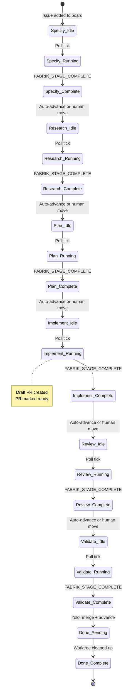
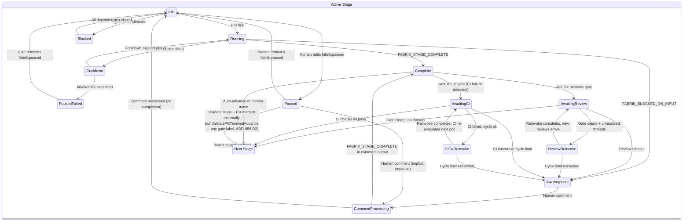
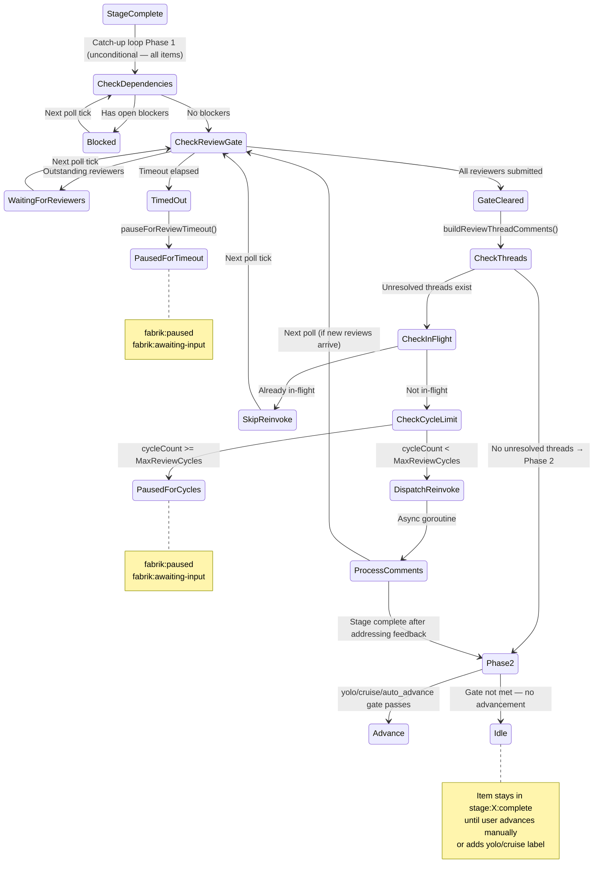

# Fabrik Issue State Machine

Every issue in Fabrik follows a defined lifecycle: from intake through a series of AI-driven stages (Specify → Research → Plan → Implement → Review → Validate → Done), with automated gates at key transitions. The diagram below shows the happy path at a glance.

<figure>

<figcaption>Fabrik issue lifecycle — linear pipeline with gate annotations. Review Gate holds advancement until all PR reviewers submit; CI Gate holds until checks pass; Merge Gate holds until rebase conflicts are resolved.</figcaption>
</figure>

**Not an engineer?** The diagram and the [Pipeline Overview](#pipeline-overview) table are the fastest way to understand Fabrik's workflow.

**Engine contributor or debugger?** The dense reference below covers every reachable state, every label mutation, every guard condition, and the visual state diagrams in [§10](#10-state-diagrams). Use the [State Enumeration](#1-state-enumeration) section as the authoritative source when diagnosing unexpected engine behavior.

---

This document is the formal specification of Fabrik's issue-level state machine: how an issue moves between states across multiple invocations of the engine. It covers every reachable state, every event that triggers a transition, every label mutation, and every guard condition.

**Companion document:** [`stage-lifecycle.md`](stage-lifecycle.md) describes the per-invocation lifecycle (what happens before, during, and after a single Claude invocation). This document describes the cross-invocation state machine (how an issue progresses through the pipeline over time). They are complementary.

**As-built specification:** This document describes what the code actually does, not what it ideally should do. Discrepancies between intended and actual behavior are flagged with `> **Bug?:**` callout blocks.

**Source of truth for:** state enumeration, transition tables, label semantics, and guard conditions. Supersedes partial label references in CLAUDE.md.

---

## Pipeline Overview

Issues traverse a linear pipeline of stages, each corresponding to a column on the GitHub Project board:

```
Specify → Research → Plan → Implement → Review → Validate → [Queued†] → Done
```

| Stage | Order | Read-Only | PostToPR | CreateDraftPR | MarkPRReady | WaitForReviews | CleanupWorktree |
|-------|-------|-----------|----------|---------------|-------------|----------------|-----------------|
| Specify | 0 | Yes | No | No | No | No | No |
| Research | 1 | Yes | No | No | No | No | No |
| Plan | 2 | Yes | No | No | No | No | No |
| Implement | 3 | No | Yes | Yes | Yes | No | No |
| Review | 4 | No | Yes | No | Yes | Yes* | No |
| Validate | 5 | No | Yes | No | No | Yes* | No |
| Queued† | 6 | — | — | — | — | — | — |
| Done | 99 | N/A | No | No | No | No | Yes |

\* All flags in this table reflect the **default stage configuration** shipped in `.fabrik/stages/`. Each flag is opt-in per stage YAML and may differ in custom configurations. `wait_for_reviews` is enabled for Review and Validate in the defaults.

† **Queued** is a *holding stage* (`holding_stage: true`) active only when `merge_train: on`. Items enter Queued when `attemptMergeOnValidate` routes to `advanceToQueued` instead of GitHub auto-merge. Per-item dispatch is suppressed (`itemMayNeedWork` / `itemNeedsWork` return false for holding stages); the batch handler `handleMergeTrainBatch` snapshots the Queued items once per poll cycle (via `groupQueuedByRepo`, which **excludes closed and `fabrik:paused` members** — see the poison-well guard under [Merge-Train Red-Batch Bisection](#merge-train-red-batch-bisection-adr-059-d4)) and dispatches `runMergeTrainWorker` when a batch is ready. `routeQueuedGroup` additionally **excludes any member whose resolved `base:<branch>` differs from the repository default** before forming the internal-train batch (`filterNonDefaultBaseMembers`, #1647/ADR-1647) — such a member is never merged into a trial branched from the default, and is left in Queued (not paused) with a one-time `fabrik:non-default-base-excluded` comment explaining it needs a manual merge. On a green trial-branch CI result, `landMergeTrainBatch` opens a landing integration PR, merges it, advances each member from Queued → Done via `advanceToNextStage`, and closes their individual PRs **and issues** (ADR-059 D3). The Queued column must exist on the GitHub Project board when `merge_train: on`; it is validated at startup.

---

## 1. State Enumeration

A state is defined by the tuple `(BoardColumn, ControllingLabelSet)`. Not every label combination is a valid state — only reachable combinations are enumerated.

### 1.1 Controlling Labels

These labels define distinct states (their presence changes what the engine does with an item):

| Label | Type | Defines State? |
|-------|------|----------------|
| `fabrik:locked:<user>` | Lock | Yes — gates processing by other instances |
| `fabrik:editing` | Mutex | Yes — prevents stage dispatch during comment processing |
| `fabrik:paused` | Pause | Yes — blocks processing on active stages unless a human comment arrives (cleanup stages ignore comments entirely while paused; a Validate-stage item with an externally merged PR can still advance via `runValidatePRTerminalAdvance` regardless of this label). Also applied by the comment-processing circuit breaker (§4.6) after N non-advancing comment-processing invocations within a rolling window, or by the success-agnostic no-op comment cycle breaker (§4.7) after N *consecutive* no-progress comment-processing invocations for the same stage, regardless of window. Also suppresses deep-fetch admission (not just dispatch) for items with no new activity this poll — see Appendix B's "Paused deep-fetch skip" note (#1379). |
| `fabrik:awaiting-input` | Sub-pause | Yes (with `fabrik:paused`) — blocked-on-input variant; also both comment-processing circuit breakers' trip pairing (§4.6, §4.7) |
| `fabrik:awaiting-review` | Gate | Yes — review gate is active |
| `fabrik:awaiting-ci` | Gate | Yes — CI gate is active; waiting for CI checks to pass (checks may be running or have failed) |
| `fabrik:rebase-needed` | Gate | Yes — merge-conflict gate is active; PR is not mergeable against its base |
| `fabrik:awaiting-done` | Gate | Yes — a `FABRIK_NO_WORK_NEEDED` decision has been made; the Done board move and/or issue close is still outstanding and is retried every poll, independent of `item.Status` |
| `fabrik:awaiting-placement` | Gate | Yes — a spawned child's initial project-board Status placement is still outstanding; retried every poll, independent of `item.Status`/`stages.FindStage` resolving a stage for the child's current column |
| `fabrik:awaiting-close` | Gate | Yes — `closeIssueIfNonDefaultBase`'s explicit `CloseIssue` call (ADR-1096) failed; the close is still outstanding and is retried every poll, independent of `item.Status` |
| `fabrik:awaiting-advance` | Gate | Yes — a terminal advance (`advanceToNextStage`, called from `advanceValidateTerminalItem`'s merged-PR path or `advanceConvergedPRToDone`) failed to move the project-board Status forward — most commonly a missing target Status option; the advance is still outstanding and is retried every poll, independent of `item.Status` |
| `fabrik:awaiting-runaway-alert` | Gate | Yes — the merge-train runaway guard (ADR-059 D8) already paused this member (`fabrik:paused` + `fabrik:awaiting-input` applied), but its `AddComment` alert call failed; the alert is still outstanding and is retried every poll, independent of `item.Status` (ADR-1533) |
| `fabrik:blocked` | Dependency | Yes — blocked by open dependency issues |
| `stage:<X>:in_progress` | Progress | Yes — a stage invocation is active |
| `stage:<X>:complete` | Completion | Yes — stage finished successfully |
| `stage:<X>:failed` | Failure | Yes — stage exhausted retry limit |
| `fabrik:revalidate` | Operator trigger | Transient — consumed by the revalidate-scan loop; triggers Validate re-entry then removes itself |

### 1.2 Modifier Labels (Guard Conditions)

These labels do not define distinct states but influence transition behavior:

| Label | Effect |
|-------|--------|
| `fabrik:yolo` | Forces auto-advance; triggers GitHub native auto-merge at Validate; overrides `auto_advance: false` |
| `fabrik:cruise` | Forces auto-advance without auto-merge; stops at Validate completion; cruise wins over yolo for both end-of-Validate decisions — the PR is not auto-merged and the issue does not advance to Done, even when yolo is also present |
| `fabrik:auto-merge-enabled` | Engine-internal; marks that GitHub's native auto-merge has been enabled on the linked PR; anchors the convergence budget start time; bypasses legacy merge/CI gates |
| `fabrik:unrestricted` | Passes `--dangerously-skip-permissions` to Claude Code |
| `fabrik:extend-turns` | Pre-grants a 2× turn budget for the first stage invocation and first comment processing invocation while present, with `max_wall_time` scaled by the same 2× factor for that invocation (§7.7, ADR-1206); persists across stages; removed only at the Done cleanup stage or manually; no-op when `max_turns == 0` (stage) or always applies for comments since `commentMaxTurns` is never 0 |
| `model:<name>` | Selects a specific model for this issue (e.g., `model:opus`) |
| `effort:<level>` | Overrides stage effort level (`low`, `medium`, `high`, `max`); highest wins |
| `base:<branch>` | Overrides worktree base branch; falls back to default if not on remote (checked via an authoritative `git ls-remote` probe, not just the local clone — see §1.3); updates PR base if PR exists |
| `review-authority:<mode>` | Overrides the stage's configured `review_authority` (`advisory`/`authoritative`) for this issue only; only meaningful alongside `wait_for_reviews: true`. No label → stage config governs. One recognized label → it wins. Both present → resolves to `authoritative` (more restrictive), with a logged warning. Malformed/unknown suffix → ignored, with a logged warning, falls back to stage config. See §6.1.1 and ADR-1261 |
| `expected-reviewers:<mode>` | Overrides the stage's configured `expected_reviewers` (`none`/`declared`) for this issue only; only meaningful alongside `wait_for_reviews: true`. No label → stage config governs (`nil` stays `nil`). `none` → resolves to `&[]string{}` (enables the FR-2 fast-advance path). `declared` → resolves to a fixed synthetic reviewer identity. Both present → resolves to `declared` (more restrictive — imposes waiting, unlike `none`'s immediate advance), with a logged warning. Malformed/unknown suffix → ignored, with a logged warning, falls back to stage config. See §6.1 and #1304 |
| `fabrik:sub-issue` | Informational; marks issue as created by Fabrik's sub-issue spawn mechanism |
| `fabrik:credited-pr:<N>` | Engine-internal; applied only by the two merge-train landing paths (`landMergeTrainBatch`, `landSingleton`) alongside `fabrik:awaiting-landing-verification`, recording the integration/singleton PR credited for the Done transition — never applied by the ordinary auto-merge path, whose credited PR is always rediscoverable via `FetchLinkedPR`. See §6.19 |

### 1.3 Reachable States by Board Column

For each board column, the reachable sub-states are listed. States are written as `Column + {labels}`. An issue in a column with no controlling labels is in the **Idle** sub-state for that column.

#### Specify / Research / Plan / Implement / Review / Validate (Active Stages)

Each active stage column has the same set of reachable sub-states:

| Sub-State | Labels Present | Description |
|-----------|---------------|-------------|
| **Idle** | (none of the controlling labels) | Ready for the engine to pick up |
| **Locked + In Progress** | `fabrik:locked:<user>`, `stage:<X>:in_progress` | Stage invocation is active |
| **Editing** | `fabrik:editing` | Comment processing is active (Claude invoked for comment review) |
| **Paused** | `fabrik:paused` | Manually paused or engine-escalated pause; no work until unpause or a human comment (bot-authored comments do not resume). Exception: a Validate-stage item whose PR was externally merged advances via `runValidatePRTerminalAdvance` regardless of this label. |
| **Paused + Failed** | `fabrik:paused`, `stage:<X>:failed` | Engine paused after MaxRetries exhausted |
| **Awaiting Input** | `fabrik:paused`, `fabrik:awaiting-input` | Claude signaled FABRIK_BLOCKED_ON_INPUT; waiting for user comment. Engine posts a dedicated `🏭 **Fabrik** — @<user>:` notification comment so GitHub delivers a mobile push to the configured operator (`cfg.User`). If Claude's output included a `FABRIK_SUMMARY` block, the question is embedded as a blockquote. |
| **Awaiting Review** | `fabrik:awaiting-review`, `stage:<X>:complete` | Review gate active; waiting for PR reviewers (only on stages with `wait_for_reviews: true`) |
| **Awaiting CI** | `fabrik:awaiting-ci` | CI gate active; waiting for CI checks to pass (pending or failed); `stage:<X>:complete` is withheld until CI clears (only on stages with `wait_for_ci: true`) |
| **Rebase Needed** | `fabrik:rebase-needed` (+ `fabrik:awaiting-ci` when `wait_for_ci: true`) | Merge-conflict detected; PR is not mergeable against its base; engine dispatching a rebase re-invocation. Applies to both the conjunctive gate path (`wait_for_ci: true` stages, via `checkMergeabilityGate`) and the legacy auto-merge path (yolo+Validate without `wait_for_ci`, via `attemptMergeOnValidate`). **Distinct from a `MergePR` CI refusal** (`gh.ErrNotMergeableCI` — a required check is `blocked`/pending, not a conflict): this label is applied only from `settle.Status == PRMergeConflicting`, never from `MergePR`'s own return value, so a CI refusal never enters this state or consumes a rebase cycle (ADR-933) |
| **Awaiting Done** | `fabrik:awaiting-done` | A `FABRIK_NO_WORK_NEEDED` decision has been made; the Done board move and/or issue close is still outstanding. Dispatch is suppressed for every non-cleanup stage regardless of which column the item is (still) sitting in — the settle scan (§6.8) retries every poll until it succeeds or escalates |
| **Awaiting Advance** | `fabrik:awaiting-advance` | A terminal advance (`advanceToNextStage`) failed to move the project-board Status forward — most commonly a missing target Status option; the item's own stage is already complete (this is not a dispatch-suppression state — nothing further would dispatch here regardless). The settle scan (§6.17) retries every poll until the board is fixed or escalates |
| **Blocked** | `fabrik:blocked` | Dependency gate active; waiting for blocking issues to close |
| **Complete** | `stage:<X>:complete` | Stage finished; waiting for advancement (manual or auto) |
| **Locked by Other** | `fabrik:locked:<other_user>` | Another Fabrik instance owns this issue |
| **Cooldown** | (no label; in-memory `LastAttemptAt[stageName]` in `itemstate.StageState`) | Stage attempted but didn't complete; waiting for dispatch cooldown to expire |

> **Note:** The Cooldown sub-state is purely in-memory — there is no label for it. The engine uses `LastAttemptAt[stageName]` from `itemstate.StageState` (written by `StageAttempted` mutation) to enforce dispatch cooldown. On restart, cooldown state is lost and the item is retried immediately.
>
> Distinct from Cooldown is **Deferred Dispatch**: an item whose dispatch was skipped in the current poll cycle solely because a worker from a prior cycle is still running. Deferred-Dispatch items still receive the `CooldownAt("periodic-re-eval")` stamp at end-of-poll — the cooldown avoids repeated deep-fetch evaluation (and the fallback GraphQL fetch when the cache is invalidated or disabled) for an item the dispatch guard (`snap.Worker() != nil`) would block anyway. Prompt re-dispatch after the prior worker exits is guaranteed by `WorkerExited → WorkerLifecycleChanged`, which is in `wakeChFlags` and wakes the poll loop immediately (#544). Note: `WorkerLifecycleChanged` is excluded from `cycleSetFlags` (Fix B, issue #576) so it does not bypass the cooldown gate via `mayNeedWork`. For successful workers, `StatusChanged` from `advanceToNextStage` adds the item to cycleSet (bypassing the cooldown) so the next stage dispatches promptly. For workers that ended without completing — whether preempted at the turn cap or genuinely errored — the cooldown expires naturally and the next ticker poll re-evaluates the item. See §3.2, §9.2, and §9.9.
>
> **Not listed above:** `fabrik:awaiting-placement` is a related but distinct marker applied to a spawned **child** issue whose initial board placement failed — by construction it is sitting **outside** any of these active-stage columns (typically `Backlog`, which is declared `unmanaged: true` — see below — and therefore never dispatched to regardless), so it never appears as a sub-state of an active-stage column. See §6.9.

#### Backlog (Unmanaged Stage)

| Sub-State | Labels Present | Description |
|-----------|---------------|-------------|
| **Parked** | (any / none) | Item sits in the column; engine never inspects it beyond the stage-membership check |

`itemMayNeedWork` and `itemNeedsWork` both return `false` for any stage with `unmanaged: true`, so these items are never dispatched to a per-item worker and never auto-advanced by the catch-up loop (same mechanism as `holding_stage`, see below). Unlike a holding stage, no batch handler ever acts on an unmanaged stage's items either — it is a pure no-op declaration. `stages/examples/backlog.yaml` (`name: Backlog`, `unmanaged: true`) is the shipped default; the hardcoded `"Backlog"` recognition in `checkStageColumnAlignment` (`engine/startup.go`) remains as a compat net for installs that predate this file — see [USER_GUIDE.md §Startup Board Validation](USER_GUIDE.md#startup-board-validation).

`unmanaged: true` is not rejected at load time when combined with `prompt`/`skill`/`cleanup_worktree`/`holding_stage` (mirroring the codebase's existing lack of mutual-exclusion validation between `cleanup_worktree` and `holding_stage` themselves), but the resulting configuration is safe, not just permissively invalid: every order-sensitive resolver that could otherwise pick an `Unmanaged` stage as "the" target for something, or hand it bookkeeping it never earned, skips it. `cleanupStage`/`holdingStage` (`engine/stages.go`) never return a stage with `Unmanaged: true`, even if it has the lowest `Order` or is `HoldingStage: true` — falling back to `nil` (same as "no such stage configured") if no eligible non-unmanaged stage remains. `NextStage` (`stages/stages.go`) walks past any `Unmanaged` stage when computing the next stage in the pipeline, so an operator who accidentally gives a parking column (e.g. `On Hold`) an `Order` between two dispatched stages does not strand items there — advancement continues to the next real stage instead. The gate-checked completion-label fill loop in `runValidatePRTerminalAdvance` (`engine/pr_terminal_advance.go`) stops at the first `CleanupWorktree` stage that is *not* also `Unmanaged`, so a misconfigured `unmanaged` + `cleanup_worktree` stage at a low `Order` cannot short-circuit the fill before any real gate-checked stage is considered. And `settleNoWorkNeeded`'s skip-labeling loop (`engine/no_work_needed_settle.go`) both excludes `Unmanaged` stages from its `doneOrder` boundary computation and never adds a skip label or "skipped" comment for an `Unmanaged` stage it steps over — a parking column an operator placed mid-pipeline gets none of the bookkeeping a real intermediate stage would.

#### Done (Cleanup Stage)

| Sub-State | Labels Present | Description |
|-----------|---------------|-------------|
| **Pending Cleanup** | (none) | Worktree exists; engine will remove it |
| **Complete** | `stage:Done:complete` | Worktree removed; terminal state |
| **Paused** | `fabrik:paused` | Manually paused; cleanup skipped |
| **Awaiting Landing Verification** | `fabrik:awaiting-landing-verification` (+ `fabrik:credited-pr:<N>` for a merge-train landing) | Just reached Done via a merge-attributable path; the post-Done backstop is confirming the credited PR actually merged. See §6.19. |

#### Queued (Holding Stage — `merge_train: on` only)

> This stage is a no-op for per-item dispatch. It is the **universal landing rendezvous**: a yolo (non-cruise) Validate completion under `merge_train: on` advances here via the dedicated `attemptMergeOnValidate` → `advanceToQueued` enqueue, and the `Queued` handler then picks the landing engine per repo (ADR-059 D6 — see [Engine Selection](#engine-selection-058-native-queue-vs-059-internal-train-adr-059-d6) below).

> **Reachable only via dedicated code (issue #1072).** `stages.NextStage` skips any `HoldingStage` exactly as it already skips `Unmanaged` — a holding stage is never returned as "the next stage" by generic positional advancement. The only call site that intentionally lands an item here is `advanceToQueued`, gated on `yoloActive && !cruise && merge_train: on` (`engine/stages.go`). Every other terminal-advance path — `runValidatePRTerminalAdvance` (cruise, human-merge, or any other gate-label convergence) and `advanceConvergedPRToDone` (non-train yolo convergence) — resolves `NextStage` from Validate and now lands directly on Done, never on Queued, regardless of `merge_train` state. Before this fix, `NextStage`'s purely positional walk landed *every* such path in Queued whenever the column was configured, stranding items with no active drain (ADR-1072).

| Sub-State | Labels Present | Description |
|-----------|---------------|-------------|
| **Waiting** | `stage:Validate:complete` | Item moved to Queued column; `advanceToQueued` added `stage:Validate:complete` atomically. Awaiting `handleMergeTrainBatch` to form a landing batch. |
| **Landing** | `stage:Validate:complete` | Batch assigned to `runMergeTrainWorker`; trial branch being assembled, combined-Validate CI polling, red-batch bisection (`state.bisecting`), one-at-a-time fallback, or landing integration PR open/merge in progress. |
| **Done** | *(none — advanced by `advanceToNextStage`)* | Integration PR merged; member advanced to Done column via `advanceToNextStage`; member PR closed with batch reference comment. |

`itemMayNeedWork` and `itemNeedsWork` both return `false` for any stage with `holding_stage: true`, so these items are never dispatched to a per-item worker. `processItem` also short-circuits on `stage.HoldingStage` as a defense-in-depth guard. The catch-up loop skips holding stages for the same reason. A closed item that nonetheless ends up stranded in Queued (e.g. a human `gh pr merge` outside the train) is rescued by the settle-scan backstop described in [§6.11](#611-closed-item-at-any-stage-advance-to-done).

**The same holding-stage exclusion that keeps dispatch off Queued items also blacks out PR feedback processing while they sit there** — review-reinvoke and comment processing never run on a Queued item either, since both live behind the identical `HoldingStage` admission gate. [§6.16](#616-queued-review-finding-ejection-settle-scan) describes the dedicated settle scan (`settleQueuedReviewFindings`, ADR-1208) that detects an unresolved review-thread finding arriving on a Queued member's linked PR and ejects it back onto a stage the ordinary reinvoke path can reach, rather than widening this section's dispatch exclusion itself.

##### Engine Selection: 058 Native Queue vs 059 Internal Train (ADR-059 D6)

`Queued` is **one board column served by two landing engines**. The single convergence owner `handleMergeTrainBatch` (ADR-056 — there is **no** parallel scanner) picks the engine **per repo** each poll, because `isMergeQueueEnabled` is a per-PR/per-repo signal and the `Queued` column may hold items from several repos at once.

**Selection algorithm.** `handleMergeTrainBatch` groups the current Queued snapshot by `owner/repo` (`groupQueuedByRepo`, preserving first-seen repo order and per-repo entry order), then `routeQueuedGroup` routes each group by the **poll-native** `LinkedPRIsMergeQueueEnabled` signal (populated by the GraphQL board query — never a REST `pulls` fetch, which always reports `false` for the queue flag, and never a webhook payload):

- **Queue-enabled repo** (`MergeQueue != "off" && LinkedPRIsMergeQueueEnabled`) → the **ADR-058 enqueue path**, invoked per item via `enqueueForQueue` (the same helper `attemptMergeOnValidate` uses on the `merge_train: off` path). It calls `EnqueuePullRequest` with the poll-native `LinkedPRHeadSHA` as the expected-OID guard and applies `fabrik:auto-merge-enabled` (idempotency + convergence anchor). `checkAutoMergeConvergence` then drains each enqueued item `Queued → Done` (it claims any `fabrik:auto-merge-enabled` item regardless of its column). Two guards: an item already carrying `fabrik:auto-merge-enabled` is mid-convergence and is **not** re-enqueued; an item whose `LinkedPRNumber`/`LinkedPRHeadSHA` is empty (cache miss) is **skipped this poll and retried next** (no REST fetch).
- **Non-queue repo** → the **ADR-059 internal merge train**: the group's remaining items form one per-repo batch. Before that batch is capped (`max_batch_size`) or dispatched, `filterNonDefaultBaseMembers` (#1647/ADR-1647) resolves each item's base branch via `baseBranchForItem` and drops any member whose resolved base differs from `DefaultBaseBranch()` — the train has no way to correctly land a member targeting a different base than the rest of the batch, so such a member is excluded from batching entirely rather than silently mis-based against the default. The no-`base:`-label fast path (`itemHasBaseLabel`) means this costs nothing for a train with no `base:`-labelled members, which is every existing train user. Filtering happens *before* the cap and *before* `dispatchMergeTrainWorker` snapshots `mergeTrainWorkerState.batchNumbers`, so an excluded member never occupies a batch-cap slot and never appears in any worker's `batchNumbers` set (avoiding an interaction with `settleQueuedReviewFindings`'s "safe upper bound" contract, ADR-1208 — see ADR-1647). The surviving items form one per-repo batch dispatched to a single `dispatchMergeTrainWorker` (already keyed `owner/repo` via `mergeTrainInFlight`), which lands members `Queued → Done` via `landMergeTrainBatch`.

**Batch-snapshot logging is deduped by composition (#1151).** `routeQueuedGroup` runs once per poll cycle for as long as any Queued items exist for a repo — including the full CI-wait duration of an in-flight train, which can span many poll cycles. Before dispatching, it computes an order-independent signature of the internal-train subset (`mergeTrainBatchSignature`: sorted item numbers, comma-joined) and compares it against `Engine.mergeTrainBatchSnapshotSeen` (a `sync.Map` keyed `owner/repo`). The `batch snapshot for <repo>: N item(s) — ...` line is only logged, and the stored signature updated, when the signature differs from the last-logged one for that repo — a membership or count change re-logs; a pure reordering of the same members (GraphQL item order is not guaranteed stable poll-to-poll) does not. Dispatch itself (`dispatchMergeTrainWorker`) always runs regardless of whether the log fired.

Both engines drain the same `Queued` column and advance their members to `Done` on land; only **who batches** differs (GitHub's queue vs Fabrik's trial branch). `max_batch_size` caps the internal-train subset **per repo group**, not the flat cross-repo batch — so a large repo A never starves repo B, and repo B's items can never be shoved into repo A's trial branch (the pre-D6 `batch[0]`-anchored latent multi-repo bug, now hardened by grouping).

**Precedence (FR-3).** For any item reaching a landing decision:

1. **Native merge queue present on the repo** (`MergeQueue != "off" && LinkedPRIsMergeQueueEnabled`) → **058 enqueue path**, *regardless of* `merge_train`. The queue always wins: a direct or trial-branch merge on a queue-required branch returns HTTP 405. Under `merge_train: off` this fires inline in `attemptMergeOnValidate`; under `merge_train: on` it fires from the `Queued` handler.
2. **Else `merge_train: on`** → the **internal train** (from the `Queued` handler).
3. **Else** → **legacy per-PR serial auto-merge** (`attemptMergeOnValidate`'s native-auto-merge / direct-merge fallback), unchanged from pre-merge-train behavior.

##### Merge-Train Landing Lifecycle (ADR-059 D3)

When `handleMergeTrainBatch` has a non-empty batch of Queued items, it calls `dispatchMergeTrainWorker`, which starts a goroutine running `runMergeTrainWorker`. The goroutine owns the full assembly-to-landing sequence:

**Two-PR model:** The goroutine creates two PRs: (1) a *draft CI PR* (`chore(merge-train): trial integration for #N…`) that triggers checks on the trial branch immediately, and (2) a *landing integration PR* (`[merge-train] batch: #N1, #N2, …`) opened only after trial CI passes. The draft CI PR is closed implicitly when the trial branch is deleted at cleanup.

**Trial assembly — merge conflicts (issue #1235):** `assembleTrialBranch` merges each batch member's head SHA into the trial worktree in sequence (`git merge --no-ff --no-edit`). A clean merge just continues to the next member. On conflict, it calls `resolveTrainConflict`, which first lists the conflicted paths (`unmergedPaths`, parsing `git status --porcelain` for the `UU`/`AA`/`DD`/`AU`/`UD`/`UA`/`DU` codes, returning each path paired with its two-letter status code as a `conflictedPath`) and classifies them against a single declared generated-path → regeneration-command mapping (`generatedFiles` in `engine/generated_files.go`; today's only entry is `docs/llms-full.txt` → `bash scripts/generate-llms-full.sh`). If `unmergedPaths` itself errors (e.g. a transient `git status` failure), `resolveTrainConflict` cannot classify anything and falls back to dispatching Claude for the full, unscoped conflict exactly as it would pre-#1235 — a deliberate, narrow tradeoff: a git-level failure says nothing about whether the conflict is confined to a generated path, so failing open to the safe pre-existing behavior is preferable to guessing (`TestResolveTrainConflict_UnmergedPathsErrorFallsBackToPlainClaude`). Otherwise, three outcomes:

- **No generated paths involved:** unchanged pre-#1235 behavior — `resolveConflictWithClaude` dispatches Claude with a synthetic comment instructing it to resolve every conflict marker and commit.
- **Confined entirely to declared generated path(s):** Claude is never invoked. `regenerateAndCommit` runs each distinct regeneration command once (deduplicated by command, not by path, so two paths sharing one command don't re-run it), bounded by a fixed `regenerationCommandTimeout` (5 minutes) via `exec.CommandContext` — unlike Claude dispatch, which is `ctx`-aware throughout, a hung regeneration command has no other circuit breaker, and a timed-out command fails the member closed (ejected with a diagnosable reason) rather than blocking the worker indefinitely. Staging follows the same scope as execution, not just the conflicted subset: for every command it runs, it stages *every* declared path (from the full `generatedFiles` mapping, not only the conflicted ones passed in) tied to that command, since running a shared command once regenerates all of its declared outputs as a side effect. A non-conflicted sibling path left unstaged here would surface as a dirty working-tree change in the next member's merge. It then verifies the tree is fully resolved before committing.
- **Mixed (a declared generated path conflicts alongside a normal path in the same member):** Claude is dispatched for the non-generated part only — the synthetic comment names the generated path(s) as out of scope and instructs Claude to stage only what it resolved and **not commit**. `regenerateAndCommit` always runs *after* Claude returns, never before: a co-conflicted non-generated file can itself be one of the generator's own source inputs (e.g. `docs/state-machine.md`, one of `generate-llms-full.sh`'s four `ORDERED` pages), so regenerating first would read stale/conflicted content. `regenerateAndCommit` performs the single commit that finalizes both parts once its own tree-wide `git diff --check` and unmerged-path checks pass.

`classifyConflictedPaths` treats a declared generated path as eligible for regeneration only when its conflict status carries no deletion intent. A status of `DD` (both sides deleted), `UD` (deleted by them), or `DU` (deleted by us) — `deletionInvolvingStatus` — routes the path into the non-generated bucket instead, so it reaches Claude like any other conflict rather than being silently regenerated: a contributor who deleted a declared generated file meant to remove it, and blindly rerunning the regeneration command would recreate content nobody wants (`TestMergeTrainWorker_DeletionConflictOnGeneratedPathRoutesToClaude`). `AA`/`UU`/`AU`/`UA` carry no deletion intent and remain eligible for regeneration as before. `classifyConflictedPaths` also returns this deletion-excluded subset separately (`deletionExcluded`, alongside `matched` and `nonGenerated`) precisely so the mixed-case call into `regenerateAndCommit` can pass it through as `protectedPaths`.

`protectedPaths` closes a further interaction between the two mechanisms above: if a matched path and a deletion-excluded sibling declare the *same* regeneration command, executing that command for the matched path also regenerates the sibling on disk as a side effect — even though the sibling isn't in `specs` and Claude (not regeneration) owns its resolution. `regenerateAndCommit` never stages such a sibling; instead it discards the command's side effect on that one path — restoring the working-tree file from the index via `git checkout-index -f` when Claude staged content for it, or removing the file entirely when Claude staged its deletion (`git rm`) — before staging and committing the rest as usual (`TestMergeTrainWorker_SharedCommandDoesNotOverwriteDeletionExcludedSibling`).

A regeneration failure (non-zero exit, inability to stage, conflict markers still present afterward, or — in the mixed case — Claude having committed prematurely despite being instructed not to) ejects the member via the existing `ejectMember` path with a diagnosable reason describing the specific failure — it never falls back to Claude. The premature-commit case is detected structurally, not by content: `regenerateAndCommit` requires `MERGE_HEAD` to still be present at entry (it is only ever called with the merge either still fully in conflict, or with Claude having resolved-and-staged but not committed the non-generated part) and fails closed immediately if it's already gone, before running any regeneration command. This is deliberately not a `git diff --cached` content comparison after the fact — that would miss the case where Claude's premature commit happens to write byte-identical content to what regeneration would have produced. This mirrors the existing unresolvable-conflict eject path (`assembleTrialBranch`'s abort-and-eject branch) and reuses the same three-way `(resolved, reason, err)` contract style as the pre-existing usage-limit sentinel handling described under ADR-1120 below: a non-nil `err` (the ADR-1120 usage-limit sentinel) is still a fatal assembly abort, never an ejection, in every one of these three outcomes.

`resolveConflictWithClaude` also guards against a false "resolved" verdict: `buildTrainConflictComment`'s fallback instructions tell Claude to run `git merge --abort` when it judges a conflict genuinely unresolvable, and an abort clears every conflict marker (and `MERGE_HEAD`) exactly as a real resolution would — `unmergedPaths` alone can't tell the two apart. `assembleTrialBranch` captures the trial worktree's HEAD SHA immediately before attempting each member's merge (`preMergeHEAD`) and threads it through `resolveTrainConflict` into `resolveConflictWithClaude`; after confirming no non-generated conflict markers remain, it additionally requires either `MERGE_HEAD` still present (merge legitimately in progress) or `HEAD` having moved past `preMergeHEAD` (a real commit happened). A `MERGE_HEAD`-less worktree still sitting on `preMergeHEAD` is treated as unresolved — an abort, not a resolution — so the member is ejected instead of silently landing with its whole contribution missing. This applies to both the plain and mixed conflict paths.

`assembleTrialBranch`'s own eject-on-unresolvable cleanup reuses that same captured `preMergeHEAD`: since resolution can now fail *after* a commit already landed on `wtDir` (e.g. `regenerateAndCommit`'s premature-commit guard tripping), `git merge --abort` alone is not sufficient cleanup — with `MERGE_HEAD` already gone, it is a silent no-op, and the bad commit would remain as `wtDir`'s HEAD, contaminating every subsequent member's merge attempt and the pushed trial branch. The eject path therefore unconditionally follows the best-effort abort with `git reset --hard <preMergeHEAD>`, which is a no-op when the abort already fully reverted things and the authoritative cleanup when it didn't. `git reset --hard` only rewinds tracked content, so the eject path also unconditionally runs `git clean -fd` afterward to remove any untracked files a failed resolution attempt (Claude, or a regeneration command) may have left behind — without it, a stray untracked file would make the *next* member's `git merge` fail with git's own "untracked working tree file would be overwritten by merge" error, which resolveTrainConflict would misclassify as a plain conflict (no `MERGE_HEAD`, no unmerged paths) and dispatch Claude against a worktree with nothing to resolve.

**Landing sequence (FR-1 through FR-5):**

1. **FR-1 — Open integration PR**: `landMergeTrainBatch` calls `CreatePR` (non-draft) with title `[merge-train] batch: #N1, #N2, …` and a body containing the idempotency marker `<!-- fabrik-merge-train-batch -->`. The body lists all batch members (issue number + title) **and a `Closes #N` line per member**. The member PRs are closed-not-merged (the change lands via this integration PR), so a member PR's own `Closes #N` never fires — the integration PR's `Closes #N` is what restores issue↔landing-PR connectivity and auto-closes each member issue when the integration PR merges **into the default branch**. (For a non-default base, or on auto-close lag, FR-3's explicit `CloseIssue` is the fallback.) The same `Closes #N` lines are carried on the trial *draft CI PR* body from assembly, since that draft PR IS the landing PR when reused (FR-5).

2. **FR-2 — Poll and merge**: `pollForMergeable` polls the integration PR with the same 30s interval as `pollTrainCI`, using `FetchPRDetails` (mergeable_state **and** head SHA in one call) and `classifyLandingCI` (ADR-1441, #1441) — the merge-train landing counterpart to `pollTrainCI`'s own check-run-aware classification, built from the same shared primitives (`gh.ClassifyCheckRuns`, `e.classifyRequiredContexts`, `describeCheckRuns`, `gh.MergeableStateAccepted`). `mergeable_state == "dirty"` rejects immediately with no check-run fetch; otherwise check runs on the head SHA are fetched and classified: a confirmed failure or required-context failure rejects; a check still pending keeps polling; an all-clear (plus required contexts satisfied) lands. Only with **zero check runs at all** does an accepted `mergeable_state` (`clean`/`unstable`, `gh.MergeableStateAccepted`) become load-bearing by itself — mirroring `pollTrainCI`'s own zero-check-runs fallback. Before ADR-1441, this step accepted `mergeable_state ∈ {"clean", "unstable"}` outright with no check-run awareness at all — the merge-train landing counterpart to the single-PR advance gate's pre-ADR-1441 shortcut, left unfixed by ADR-1153 and explicitly flagged there as a "candidate fast-follow." Once `classifyLandingCI` judges the PR landable, `MergePR` is called (no admin bypass). `MergePR` itself independently re-checks `mergeable_state` against the `clean`/`unstable` allowlist before merging (see "`MergePR`'s own CI precondition (ADR-933)" in §5, after §5.3) — normally a no-op here since `pollForMergeable` already judged the PR acceptable, but it closes a narrow TOCTOU window if the state flips between the two checks; this merge-side check is deliberately unchanged by ADR-1441 (its R3 decision: the merge path continues to defer to branch protection alone, per ADR-072's operator note). On timeout, a warning comment is posted on the first batch member and the function returns without advancing members (they remain in Queued for the next train cycle). On merge API failure — including `gh.ErrNotMergeableCI` from that TOCTOU window — an error comment is posted and landing aborts, leaving members in Queued to retry on the next train cycle; this is not escalated to a pause and does not touch `fabrik:rebase-needed`.

3. **FR-3 — Member lifecycle**: For each surviving batch member: (a) `advanceToNextStage` moves the item from Queued → Done on the project board; (b) `addLandedCommentWithRetry` posts `🏭 **Fabrik merge-train** — Landed via batch PR #<N>.` on the member PR — this is the sole cross-landing-path, member-scoped record of which PR actually landed the change (issue #1275), so a bare `AddComment` failure would silently and permanently lose it; the shared helper retries up to 3 attempts total with exponential backoff (`landedCommentRetryDelay`, base 200ms, doubling), gated on `isTransientError` (a non-transient error like a 404/422 short-circuits to the warn immediately, without wasting the backoff window) — on exhaustion it falls back to the pre-existing warn-and-continue behavior unchanged, never blocking or delaying landing; the identical helper is used by `landSingleton`'s equivalent comment post (`🏭 **Fabrik merge-train** — Landed one-at-a-time via singleton PR #<N>.`); (c) `CloseIssue` closes the member PR explicitly; (d) `CloseIssue` closes the member **issue** explicitly. Step (d) is the fallback that guarantees issue closure independent of the integration PR's `Closes #N` (which only auto-closes on merge into the default branch) — without it a member landed via a non-default base, or before auto-close propagates, is left landed-but-open. It is idempotent (a no-op on an already-closed issue). Members whose `Status == "Done"` are silently skipped (restart safety). The same close-issue fallback runs in the one-at-a-time singleton landing path (`landSingleton`) — but **only** in `landSingleton` is a failure of step (d) retried: on failure, `markMergeTrainMemberCloseOutstanding` writes `fabrik:awaiting-member-close`, and `settleMergeTrainMemberCloses` retries it every poll thereafter, escalating to `fabrik:paused` after `MaxRetries` (§6.10, ADR-061). `landMergeTrainBatch`'s own step (d) has no such retry — a deliberate, narrowly-scoped-fix decision (ADR-061 §Sibling Audit); a follow-up issue is expected to extend the same machinery to this path.

4. **FR-4 — Cleanup**: `CleanupTrainWorktree(name, deleteBranch: true)` runs in a `defer`, removing the trial worktree directory and deleting both the local and remote trial branch (`git push origin --delete`). This is the **single** call site responsible for local worktree removal per trial lifecycle — `assembleAndValidate` no longer removes the worktree itself after opening the draft CI PR (pre-#1151, it did, making every downstream cleanup call a guaranteed no-op on the success path); the trial worktree now stays checked out for the full CI-poll window and is reclaimed exactly once, here (or in the equivalent failure-path `cleanupTrialArtifacts` call), regardless of outcome. All cleanup steps are best-effort (failures are logged, not propagated) — but **only genuine failures are logged**: a `git worktree remove` failing because the path is already not a working tree, or a `git push --delete` failing because the remote ref already doesn't exist (e.g. removed by GitHub's own "delete branch on merge" behavior once the integration PR — which reuses the trial branch — merges), is classified as a no-op success and does not emit a `warn:` line (#1151). The remote-branch-delete push also runs with an SSH `LogLevel=ERROR` override scoped to this one invocation, suppressing the "Permanently added ... to the list of known hosts" notice without weakening `StrictHostKeyChecking`.

5. **FR-5 — Restart idempotency**: `findIntegrationPR` scans recent PRs via `ListPRs` (`state=all`) for **this trial's own** PR — `HeadRefName == trialBranch` (`fabrik/merge-train/<trialName>`) is the sole, mandatory identity gate (#1615, R1). The shared idempotency marker `<!-- fabrik-merge-train-batch -->` is checked too, but only as non-fatal corroboration: a branch match is returned regardless of whether the marker is present (a warning is logged if it's missing), and a marker match on a *different* branch is never returned, no matter how recently that PR was updated or how many repo-wide PRs `ListPRs` surfaces. Before #1615, the marker alone was sufficient — since every merge-train PR in the repo carries it, in any state, a later trial's search could return an unrelated, already-merged PR from a completely different batch, and `landMergeTrainBatch` would trust that PR's `Merged` field (`alreadyMerged`) to skip its own merge step and proceed straight to member advancement, closing the member PR and issue as though the batch had actually landed (reported in #1614). Once branch identity gates the match, the returned PR's `State`/`Merged` are inspected to decide what happens next: **open** — FR-1 is skipped, FR-2 proceeds as normal (poll, then merge); **merged** — FR-2 is also skipped (`alreadyMerged`) and FR-3 proceeds directly, now provably safe since identity is confirmed; **closed and unmerged** — a failed trial, not a reusable integration PR (R2) — routes to the escalation path below instead of FR-3, never treated as "already landed" (R5). Member advancement is additionally guarded, per member, by two checks: `Status == "Done"` (restart safety, unchanged) and, new in #1615, whether the member's issue number actually appears in the integration PR's body (`parseTrainMembers`) — a batch that dropped a member during assembly must not be able to claim it (R4). A member failing either the closed-unmerged trial check or the per-member membership check is escalated (below) rather than silently skipped or, worse, advanced.

**Landing-failure escalation (#1615, R4/R5).** When `findIntegrationPR` returns this trial's own PR closed and unmerged, `escalateClosedUnmergedTrial` escalates every survivor; when the matched (merged) integration PR's body doesn't list a specific member, that one member alone is escalated in place inside the FR-3 loop, leaving the rest of the batch to land normally. Both call the same `escalateStrandedTrainMember`, mirroring `ejectRedSingleton`'s reroute+comment+pause convention (§ "Merge-Train Red-Batch Bisection" below) rather than `ejectMember`'s counter/stay-in-Queued semantics — this is an infra-level landing failure (the integration PR itself, or the batch's own composition), not a retryable member-level defect: `rerouteQueuedMemberOffHolding` moves the member off Queued to `stageBeforeHolding` first (a failed reroute leaves the member untouched for the next poll to retry, exactly as `ejectRedSingleton`'s identical failure path); on success, an explanatory `🏭 **Fabrik merge-train — landing failed**` comment is posted (naming the closed PR, or the merged PR that dropped the member) and `pauseMergeTrainMember` applies `fabrik:paused` + `fabrik:awaiting-input`. The reentry guidance (`fabrik:revalidate` when the reroute target is literally named `"Validate"`, or naming the real blocking `stage:<target>:complete` label otherwise) is the same `reentryInstruction` helper `ejectRedSingleton` uses, so both escalation paths give identical, correct instructions for the same reroute target. No "landed via" comment is ever posted for an escalated member (R5/AC4), and R6 — that comment may only be emitted after the batch PR is observed `MERGED` — holds structurally once R1–R4 do: the FR-3 loop only ever reaches the comment for a member that passed both the branch-identity and membership checks on a PR whose `Merged` field is true.

`pollForMergeable`'s own polling loop never inspects `pr.State` — if this trial's PR is open when `findIntegrationPR` returns it but closes (unmerged) mid-poll, it is a narrower, deliberately out-of-scope variant of the same defect: the loop simply times out (unchanged pre-#1615 behavior, members remain in Queued for a fresh retry) rather than routing to the escalation path above, since it can't misattribute a landing the way the fixed bug could.

**State threading**: `board.ProjectID` is threaded from `handleMergeTrainBatch` → `dispatchMergeTrainWorker(ctx, batch, projectID)` → `mergeTrainWorkerState.projectID` (immutable after dispatch, no mutex needed). Inside `landMergeTrainBatch`, a minimal `&gh.ProjectBoard{ProjectID: projectID}` is constructed for the `advanceToNextStage` call.

**`mergeTrainInFlight` lifecycle**: set at `dispatchMergeTrainWorker` entry (LoadOrStore), cleared by `finishTrain` — the single ADR-067-mandated clear point, called from `prepareTrainWorker`'s own-failure defer and `runMergeTrainWorker`'s top-level defer (both on success and failure). The goroutine's entry in `mergeTrainInFlight` is therefore gone by the time the goroutine exits, and the next `handleMergeTrainBatch` poll cycle can dispatch a fresh train for any still-Queued members. `finishTrain` also clears the repo-scoped liveness registry inside `itemstate.Store` (`Store.ExitRepoWorker`, set by `dispatchMergeTrainWorker` alongside the `LoadOrStore` claim) — see §9.2, issue #1222. The two registries share the exact same set/clear lifecycle, but serve different purposes: `mergeTrainInFlight` is the atomic duplicate-launch claim plus the `assembling`/`bisecting`/`CIResult`/`prNum`/`trialName` sub-state; the Store registry is the single liveness answer the auto-upgrade idle guard and `mergeTrainWorkerActive` read.

##### Merge-Train Red-Batch Bisection (ADR-059 D4)

A batch is **usually green**: every member already passed Validate individually, so a batch fails only on a genuine cross-PR semantic conflict. `runMergeTrainWorker` is therefore structured as a **re-form loop** around a single combined validation per (re-formed) batch:

- **Green path is a hard invariant (D-d):** a green combined Validate costs **exactly one** validation and performs **zero** bisection — it lands immediately via `landMergeTrainBatch`. Bisection is strictly gated behind a red result.
- **`max_batch_size` cap (FR-4):** `handleMergeTrainBatch` caps the Queued snapshot to the first `MaxBatchSize` items (default 5) by entry order (`capBatch`), logging any truncation. This bounds the worst-case bisection depth.

**Bisection on red (FR-1):** when the combined Validate is red, `handleRedBatch` opens a **per-episode cost budget** (`used = 1` for the initial red validation, capped at `effectiveBisectCap()` = `MaxBisectValidations`, default `2·⌈log₂(max_batch_size)⌉ + 1 ≈ 7`) and calls `bisect`. `bisect` recursively halves the red member set in bors-ng order — validate half A; if red recurse into A; else validate half B; if red recurse into B — until a **red singleton** (the poisoner) is isolated. Every trial (initial and every sub-trial) is assembled by `assembleAndValidate` off the **same base SHA pinned once at batch start** (D-b, via `EnsureTrainWorktreeAt`), so redness is attributable to member composition, not a moving base branch (main-moved is D5, out of scope). Each sub-trial's branch + worktree + draft CI PR is reaped immediately by `cleanupTrialArtifacts`.

**Red singleton short-circuit (#1440, reroute added #1545):** a red batch of exactly one member is never handed to `handleRedBatch` at all — `runMergeTrainWorker`'s `TrainCIRed` branch checks `len(survivors) == 1` first and, when true, calls `ejectRedSingleton` directly. Bisection exists to isolate a poisoner among two or more members; a batch of one has nothing to isolate, so routing it through `bisect` (whose own `len(red) == 1` base case is a pure pass-through) would only reach the same poisoner-isolation ejection wording — "isolated by halving bisection," "retried in a future train with a different composition" — that is actively misleading for a batch that never had more than one member to begin with. `ejectRedSingleton`:
- **Reroutes off Queued before doing anything else (#1545 R1/R2):** calls `rerouteQueuedMemberOffHolding` — the same primitive and reroute-before-side-effects ordering [§6.16](#616-queued-review-finding-ejection-settle-scan) established for the structurally identical review-findings cause — to move the member's board Status from Queued to `stageBeforeHolding` (normally Validate) *before* posting a comment or pausing. Before this fix the member was paused **in place inside Queued**, a `HoldingStage` column `itemMayNeedWork`/`processItem`/`settleQueuedReviewFindings` all structurally refuse to touch — the pause was permanently unreachable by any stage, and the "fix it, then remove `fabrik:paused`" instruction had an unstated precondition that only a human moving the board card by hand could satisfy. If the reroute fails, nothing is posted and the member is not paused — it looks like nothing happened, and the very next poll's train re-forms the same singleton and re-hits this same disposition.
- Posts one comment stating plainly that the PR's own combined Validate is failing (never "ejected... isolated by halving bisection," never a promise of a differently-composed future train, never a conflict framing), still naming the failing check(s) via the shared `renderDiagnosticBlock` (#1420). The comment now names the reroute target stage and, **only when that target is literally named `"Validate"`**, instructs applying `fabrik:revalidate` — not a bare `fabrik:paused` removal (#1545 R4): `stage:Validate:complete` is already set from this item's original completion, so removing only `fabrik:paused` would silently no-op against `itemNeedsWork`'s completed-stage check. `fabrik:revalidate`'s existing handler (`handleRevalidateLabel`) clears `stage:Validate:complete` alongside `fabrik:paused`/`fabrik:awaiting-input`/etc. together, which is what actually makes Validate re-run. `handleRevalidateLabel` is itself hardcoded to that literal stage name, not generic over `stageBeforeHolding`'s (Order-derived) result — a Pruefer review finding on #1550 — so when the reroute target isn't literally `"Validate"` (a config-only edge case the merge-train unit test fixture exercises via an `"Implement"` stage; production `.fabrik/stages/*.yaml` always has Validate precede Queued, but nothing enforces it), the comment instead names the item's real blocking labels (`stage:<target>:complete`, `fabrik:paused`) directly and explains why `fabrik:revalidate` would not help there.
- Applies `fabrik:paused` + `fabrik:awaiting-input` **immediately** after the reroute succeeds, via the shared `pauseMergeTrainMember` helper, rather than accumulating toward `ejectMember`'s `mergeTrainEjectionCounts` 3-strike counter — every red-singleton disposition for the same member carries identical information, so counting to 3 would only measure retries of a deterministic outcome. **R3 design choice — reroute + pause, not reroute-without-pause:** unlike the review-findings cause (§6.16), a standalone combined-Validate failure has no external, persistent signal for the ordinary pipeline to re-detect once rerouted — the failure was only ever observed on the synthetic combined trial branch, never on the member's own already-green PR, and the ejection comment itself is filtered out of "new comment" detection by `findNewComments`' `🏭 **Fabrik` prefix skip. Rerouting without pausing would therefore land the member inertly on Validate with nothing to pick it back up — a *quieter* stranding than the pre-#1545 bug (no `fabrik:paused` signal at all). Reroute + pause keeps the human gate the original design already relied on, now on a column where clearing it via `fabrik:revalidate` actually works. See ADR-1545.
- Since the member leaves Queued entirely, the poison-well guard below no longer needs to do any work for it — the reroute alone removes it from every future Queued batch snapshot, whether or not the pause is later manually cleared incorrectly (a member re-admitted to Queued must complete Validate again first).

`handleRedBatch` and `bisect` are otherwise unchanged; every batch with two or more members bisects exactly as described in the rest of this section, and the arity guard above means bisection itself never sees a true singleton. `landOneAtATime`'s own red-singleton-ejection branch (below, FR-5) validates its member completely alone — the same true-singleton scenario, reached via a different path (bisection degrading a genuinely multi-member batch rather than the top-level arity guard) — so it also calls `ejectRedSingleton` rather than `ejectMember`, getting the identical wording/no-counter/immediate-pause disposition instead of leaving the pre-#1440 misleading wording live in a second reachable path.

**Eject + re-form + re-validate (FR-2/FR-3):** the isolated poisoner is ejected via `ejectMember` (D-a — the same shared `MaxMergeTrainEjections` counter that assembly-conflict ejections increment; D-c — the ejection comment is the attention marker; cap→pause reuse: after `MaxMergeTrainEjections` ejections the member gets `fabrik:paused` + `fabrik:awaiting-input`). The poisoner **remains in the Queued column** — `ejectMember` never moves it off the board — so a still-unpaused poisoner is retried in a future differently-composed train. **Poison-well guard:** once a member is `fabrik:paused` (or its issue is closed), `groupQueuedByRepo` excludes it from every subsequent batch snapshot. Without this, a poisoner that reds the combined Validate *even in isolation* — paused but left in Queued — would be re-snapshotted into every future batch, reding and bisecting the train indefinitely and starving clean members from ever landing. A human removing `fabrik:paused` after resolving the underlying conflict re-admits the member. `handleRedBatch` returns the surviving members; the main loop **re-forms and re-validates** them (a survivor batch is not assumed green — a second poisoner or interaction may remain). Terminal states are clean: an empty survivor set completes the train with nothing to land (the existing zero-survivor path); each episode ejects ≥1 member or falls back, so the loop runs ≤ N episodes.

**Ejection comment carries the combined-Validate diagnostic (#1420).** Because a merge-train failure is, by construction, a failure that does not exist on any member's own branch — it arises only from combining with a base that moved since the branch was cut — the combined-Validate run that observed it is the *only* place the failure output ever exists. `pollTrainCI` builds a `trainCIDiagnostic` (failing check names, output text/summary, and details/run URL for ordinary check-run failures; context names only for classic-commit-status `RequiredContextsFailed` failures, which carry no check-run output; a free-text `Note` for a dirty `mergeable_state` with no per-check signal at all) at the point of failure and threads it as a plain return value — never shared or mutable state — through `assembleAndValidate` → `bisect`/`handleRedBatch`/`landOneAtATime` → `ejectMember`/`ejectRedSingleton` (#1440: `landOneAtATime`'s red-singleton branch and the top-level arity-guard short-circuit above both terminate in `ejectRedSingleton` instead, for the true-singleton case), so the run that isolates the poisoner is always the diagnostic's origin, and bisection's later, unrelated re-validation of the reformed survivor batch cannot overwrite it. `ejectMember`/`ejectRedSingleton` render the diagnostic (bounded per-check inline excerpt, degrading to a head/tail truncation plus a details/run link when oversized, capped again at a whole-block hard limit well under GitHub's comment size limit) into **every** ejection comment for that failure — the first as fully as the last, so an operator doesn't pay for three uninformative cycles before learning there's something to look at — alongside a sentence naming the other members riding in that train attempt (or stating explicitly that none were present, for a single-member train), so the operator knows before investigating that the fault does not exist on their own branch. The pause-after-`MaxMergeTrainEjections` comment names the same failing check(s)/context(s) and links the permalink of the ejection comment that carries the full diagnostic, rather than repeating "resolve the underlying conflict" with nothing to act on. The three ejection call sites outside this issue's scope (unfetchable PR/head-SHA, unresolvable merge conflict) pass a nil diagnostic, leaving their ejection comments exactly as before. See ADR-1420.

**One-at-a-time fallback (FR-5):** when bisection cannot isolate a single culprit within the cost budget — either the budget is exhausted, or both halves validate green (a **non-isolable cross-PR interaction**: each half green alone, the union red — D-e, no bespoke interaction-detection in v1) — `handleRedBatch` logs the degrade clearly (never silent) and calls `landOneAtATime`, which validates and lands each remaining member as its **own singleton batch**. A green singleton lands via `landSingleton`; a red singleton (fails even in isolation) is disposed of via `ejectRedSingleton` (own-validation-failed wording, immediate pause, no counter — see above); a pending singleton stays in Queued. This dissolves any interaction by construction (no two members co-reside). Two non-obvious correctness points:

- **Per-singleton base re-pin:** unlike bisection (which pins the base once, D-b), `landOneAtATime` re-pins the base to the current `origin/<base>` before **each** singleton so a prior singleton's land is visible to the next member's validation — this is what actually dissolves a genuine `{A,B}` interaction (landing `A`, then validating `B` against `main`-with-`A`, which now goes red and ejects `B` rather than letting both land and poison `main`). This is a deliberate sequential base advance, distinct from the D5 concurrent main-moved race. Under the membership-keyed test seam this git step is skipped (the stub is stateless).
- **`landSingleton`, not `landMergeTrainBatch`:** `landSingleton` creates a **marker-free** integration PR. Reusing `landMergeTrainBatch` across sequential singletons would make a later singleton's `findIntegrationPR` match an earlier singleton's already-merged integration PR by the shared `<!-- fabrik-merge-train-batch -->` marker, skip the later singleton's own merge, and advance it to Done without landing its code — a data-loss bug. This was true when written; since #1615, `findIntegrationPR` gates on trial-branch identity first (FR-5 above), so a marker match on a different branch — including an earlier singleton's — is no longer possible on `findIntegrationPR`'s own side either. The reasoning above remains valid belt-and-suspenders documentation (and `landSingleton`'s marker-free design is unchanged), but the hazard it describes is no longer live even if a future change routed singletons through `landMergeTrainBatch`.

**Dispatch-guard logging:** `state.bisecting` (set for the duration of `handleRedBatch`) makes `dispatchMergeTrainWorker` log "bisecting red batch" for a re-dispatch attempt during bisection, rather than the misleading "CI red — needs attention".

**Runaway guard (ADR-059 D8):** a composition-agnostic rate cap that fires when a repo creates ≥ `MaxTrainTrialsPerWindow` trial branches (default 20) with **zero successful landings** within a rolling `TrainTrialWindowDuration` window (default 60 min). The guard is distinct from the poison-well guard (which terminates the loop) and the bisect cost cap (which degrades to one-at-a-time within one goroutine run): it bounds the cross-poll-cycle burst that occurs when infra is broken and every trial fails.

**Counter:** `assembleAndValidate` is a thin wrapper around `assembleAndValidateInner` (the single site where all trial branches are created) that calls `recordTrial(repoKey)` only when the trial's result is **not** `TrainCIGreen` (#1528). A green result is, by construction, either the landing attempt itself or a bisection sub-trial that just proved a sub-batch clean — never a "zero successful lands" event, which is the guard's entire premise. Before this fix, every trial counted unconditionally, including the green survivor-validation trial that confirms a bisection isolated its poisoner and is about to land — so a **successful** bisection could trip the guard on its own green trial, pausing the clean survivors it had just vindicated one second before they would have landed (deterministically for any 3-member poisoned batch under the default `MaxTrainTrialsPerWindow=6` test configuration, since bisecting a 3-member batch down to a single poisoner takes exactly 6 raw trials). The exclusion is by-outcome, not by-origin: a **red** bisection sub-trial still counts, exactly as before — it represents genuine "no progress," the same as a red top-level trial. `TrainCIPending` results and assembly errors also still count unconditionally, unchanged. The counter itself is a rolling window (slice of `time.Time`) keyed `owner/repo`, protected by `mergeTrainTrialsMu`. `resetTrialCounter(repoKey)` deletes the entry; it is called from both `landMergeTrainBatch` and `landSingleton` after a successful merge, so any train where survivors do land never accumulates toward the cap.

**Guard fires:** when `isRunawayTripped(repoKey)` returns `true` (count ≥ N within M minutes with zero resets), `fireRunawayGuard` is called. It:
- Logs the event at the `merge-train` tag (never silent): repo key, trial count, window duration, and member count.
- Applies `fabrik:paused` + `fabrik:awaiting-input` to **every member passed to it**, and posts an alert comment explaining the trial count seen, the window, and operator instructions — **atomically per member, and idempotently per episode** (ADR-1533, #1533).

**Atomicity and per-episode idempotency (ADR-1533):** `fireRunawayGuard` is called from three independent sites — twice inside `runMergeTrainWorker` (Hook 1, the worker goroutine) and once from `routeQueuedGroup` (Hook 2, the poll goroutine) — and nothing prevents Hook 1 and Hook 2 from running concurrently for the same `repoKey` once the shared trial counter trips: the poll loop does not check whether a worker is mid-firing. Each call site constructs its own, possibly-overlapping member slice from whatever local state it holds. Before #1533, this meant a member appearing in two racing calls' slices could receive a duplicate alert, and — independently — a member whose `AddComment` call happened to fail was left `fabrik:paused` with no comment and no retry path, since a paused member permanently drops out of `groupQueuedByRepo`'s Queued snapshot on every later poll.

The fix makes the whole pause+alert sequence for one `fireRunawayGuard` call a single critical section, serialized by `mergeTrainRunawayMu`, so two concurrent calls can never interleave their loops. Within that section, `mergeTrainRunawayAlerted` (an in-memory `map[string]int` keyed `"owner/repo#N"`, recording the trial count at which the member was last alerted) records which members have already been alerted **this episode**; a call re-encountering an already-alerted member at the same or a lower count skips it entirely (no duplicate comment, no redundant label calls) — a strictly *higher* count means genuinely new trials ran since the last alert (only possible after an operator manually resumes a paused member without the episode having ended via a successful land), and falls through to a fresh alert rather than being skipped. `resetTrialCounter` — the guard's only existing "this trip is over" signal, called on a successful land — also clears `mergeTrainRunawayAlerted` for the repo, so the next trip starts a fresh episode.

A member whose `AddComment` call fails is **not** marked alerted. Instead it is left with a new durable marker label, `fabrik:awaiting-runaway-alert` (the `fabrik:paused` application is unaffected — pausing never depends on the comment succeeding). `settleRunawayGuardAlertScan` (`engine/runaway_alert_settle.go`), a per-poll settle scan sourced directly from `board.Items` (not `groupQueuedByRepo`, which the member's own `fabrik:paused` label already excludes it from), retries the alert every poll independent of any `fireRunawayGuard` call ever reaching that member again. After `MaxRetries` failed retries, `escalateRunawayAlertFailure` posts a fallback comment carrying the same explanation — but the marker is removed, and the member marked alerted, **only if that fallback comment itself is confirmed posted**; on a persistent `AddComment` outage that outlasts the fallback attempt too, the marker stays and the settle scan keeps retrying indefinitely, so the one remaining diagnostic signal is never erased out from under a member that still has zero delivered explanation (#1533 review, finding 1). See §6.18 and the Label Semantics Reference (§1.4) for `fabrik:awaiting-runaway-alert`'s full added-by/removed-by contract.

**Two-hook dispatch:** the guard is checked at two complementary points to cover both the active batch and any beyond-cap Queued members:
1. **Hook 1 (worker-side, `runMergeTrainWorker`):** after the initial re-form trial and after `handleRedBatch` returns `runaway=true` (propagated from `bisect` or `landOneAtATime`). Pauses the active batch members (`membersToItems(survivors)` — the survivors of the initial trial assembly, which are all members when the guard trips during bisect before any ejection).
2. **Hook 2 (poll-side, `routeQueuedGroup`):** before `dispatchMergeTrainWorker` is called. If the counter is already tripped (from a prior worker run), pauses all `trainItems` in the current Queued snapshot and skips dispatch. This handles beyond-cap members that Hook 1 could not reach.

Hook 1 and Hook 2 **can** run concurrently for the same repo — the "beyond-cap members cannot form their own batch while the worker goroutine is still active" argument bounds only whether a *second train* can form, not whether Hook 2's own guard check can race Hook 1's. Correctness for the alerting side comes from `mergeTrainRunawayMu` and `mergeTrainRunawayAlerted` (above), not from an assumption that the two hooks never overlap.

**Operator resume:** once the runaway guard fires, all affected members have `fabrik:paused` and `fabrik:awaiting-input` applied and are therefore excluded from `groupQueuedByRepo` on every subsequent poll. No re-formation occurs until a human manually removes both `fabrik:paused` and `fabrik:awaiting-input` from each affected member. Before doing so, the operator should investigate the infra root cause (GitHub Actions billing, required-check configuration, base-branch health). The in-memory trial counter resets to zero on engine restart, but `fabrik:paused` labels persist on GitHub — so a restart alone does not re-enable the train; the labels must be cleared explicitly.

**`fireRunawayGuard` is deliberately exempted from the #1545 reroute fix** (R5 audit, below): unlike `ejectRedSingleton`'s pre-#1545 defect, a Queued member paused by the runaway guard is *not* stranded — `groupQueuedByRepo`/`routeQueuedGroup` re-admit an unpaused Queued member directly from `board.Items` on the very next poll, entirely independent of `itemMayNeedWork`/`processItem`'s `HoldingStage` exclusion (that exclusion only blocks *per-item stage dispatch*, not the batch handler's own board read). Rerouting every paused member to Validate instead would force each one through a full, redundant Validate re-run for a cause (infra-wide: billing, a broken base branch, all required checks erroring) no code stage can fix, and would make each member re-earn its way back into Queued via a fresh stage completion instead of simply resuming the batch it had already validated into.

##### Pause-in-Holding-Column Audit (#1545)

Any site that applies `fabrik:paused` to an item while its board Status is still a `HoldingStage` column (Queued) has the same structural defect `ejectRedSingleton` had before this issue: `itemMayNeedWork` excludes `HoldingStage` items from dispatch, `processItem` (the comment-unpause path) is never reached, and `settleQueuedReviewFindings` applies the identical closed/`fabrik:paused` exclusion — so nothing can ever act on the pause without a human manually moving the board card. Every such site was audited:

| Site | Disposition | Reason |
|---|---|---|
| `ejectRedSingleton` (standalone-validation-failure pause) | **Fixed** | Rerouted off Queued via `rerouteQueuedMemberOffHolding` before pausing (R1/R2, above). |
| `fireRunawayGuard` (member-pausing path) | **Exempted** | Its recovery path is already reachable: `groupQueuedByRepo`/`routeQueuedGroup` re-admit an unpaused Queued member directly from `board.Items`, bypassing the `HoldingStage` dispatch exclusion entirely (see the Runaway guard section above). Rerouting the whole paused column to Validate would force every member through a redundant re-run for a cause (persistent infra failure) no code stage can address. |
| `ejectMember`'s cap-reached pause (`MaxMergeTrainEjections`) | **Exempted — out of scope** | Governs the counter-driven bisection/conflict ejection ladder, explicitly excluded from this issue's Scope. `stayInQueue=true` for every cause it serves, so the member — paused or not — was always meant to stay in Queued for a future differently-composed train; that design is unchanged by this issue. |
| `checkAutoMergeConvergence`'s `fabrik:paused` sites (`engine/merge_gate.go`) | **Exempted — structurally unreachable** | Its only call site, `handleAutoMergeConvergence`, runs from the Phase 1 catch-up loop, which unconditionally excludes `HoldingStage` items before it is ever reached — so it cannot fire while an item's board Status is still Queued. An ADR-058-enqueued item that stays at `Status == "Queued"` is drained by `settleClosedItemsToDone` once **closed** (regardless of column), or simply sits, unpaused, in Queued until GitHub's native merge queue merges and closes it. |

**References:** ADR-1545 (this issue's R3 design record), [ADR-1208: Queued Review-Finding Ejection](../adrs/1208-queued-review-finding-ejection.md) (the reroute-before-side-effects precedent), [ADR-1420: Merge-Train Ejection Diagnostics](../adrs/1420-merge-train-ejection-diagnostics.md), issue #1545.

##### Merge-Train Serialization + Main-Moved Recovery (ADR-059 D5)

The batch validates a *combined batch* against `main` once; its correctness rests on **the `main` the batch validated against being the `main` it lands on**. Serializing the train (one batch in flight per repo) keeps `main` from moving under a validating batch; the only remaining mover is an **external direct push by a human**, which is detected and recovered. D5 adds two things without weakening the atomic `LoadOrStore` guard on `mergeTrainInFlight`.

**Durable, restart-safe in-flight reconstruction (FR-1/FR-4).** `dispatchMergeTrainWorker` keeps `LoadOrStore` as the sole race-critical, in-memory check (dispatch runs only from the single poll goroutine). Because that map is lost on restart, `runMergeTrainWorker` calls `reconstructTrainState` **inside the already-guarded goroutine, before pinning the base**, probing only *durable* artifacts — merge-train PRs via `ListPRs` and origin trial branches via `WorktreeManager.ListTrainBranchesOnOrigin()` (`git ls-remote --heads origin refs/heads/fabrik/merge-train/*`). A PR is recognized as a train PR by `isTrainPR` — structurally, by its `fabrik/merge-train/*` head branch (`HeadRefName`) alone (R7, #1615): every genuine trial PR, landing PR or unpromoted draft CI PR alike, is Fabrik-created on that branch. The batch marker (`<!-- fabrik-merge-train-batch -->`, carried by a landing PR, never by a draft CI PR) is corroboration only — `reconstructTrainState` logs when it's absent on a branch-matched PR, but never treats its presence *or* absence as identity. Before #1615's R7, `isTrainPR` accepted the marker **or** the branch — a PR whose body merely quoted the marker literal in prose (with nothing to do with any trial) was misidentified as a train PR; this is what let the sweep close a live, unrelated PR during reconstruction for a different batch, an incident that hit this very fix's own PR (see R8 below).

**Relevance filtering — the critical guard.** `ListPRs` returns `state=all`, so it also surfaces merged/closed integration PRs from *prior completed* batches; those still carry the batch marker but have **no members left in today's Queued snapshot** (members only leave Queued on a successful land). Reconstruction therefore selects the first train PR whose parsed members still intersect the current Queued batch (`filterBatchByNumbers(batch, parseTrainMembers(body))` non-empty). A historical PR that fails this test is **skipped** — routing on it would wrongly abort today's fresh batch (complete-deferred would find no still-Queued members and exit), permanently stalling the train after the first landing. A stale *open* train PR that fails the test is **closed** (and its branch cleaned) so it cannot later hijack `findIntegrationPR` during a fresh batch's landing — but only after a second, deliberately redundant structural check immediately before the `CloseIssue` call (R8, #1615): closing a PR is destructive and irreversible, so the identity that authorizes it is re-confirmed at the point of the action itself, not only inherited from the `isTrainPR` filter above it in the loop. A PR that reaches this point without a train-branch head ref is skipped and logged instead of closed — ambiguity fails closed, never toward a destructive action. From the selected relevant PR (or none), it routes to:

- **complete-deferred** — a **merged** marker PR whose members are still Queued (checked **first**, so already-landed work is never misclassified as an orphan): `completeDeferredLanding` parses the member `#N`s from the PR body (`parseTrainMembers`), intersects them with the still-Queued snapshot, and runs the idempotent `landMergeTrainBatch` (its `alreadyMerged` short-circuit skips the merge; its `Status == "Done"` guard prevents double-advance) to finish the member lifecycle; clears the in-flight marker;
- **resume** — an **open** train PR (with still-Queued members) backed by an origin trial branch: `resumeTrain` re-resolves the still-Queued members, re-polls CI on the existing trial head, and on green lands via `landGreenBatch` (with main-moved recovery); any non-green outcome (or no resolvable members) dissolves, so the next poll re-forms cleanly rather than re-entering bisection on resume; clears the in-flight marker;
- **dissolve** — an open train PR (with still-Queued members) without a backing trial branch: `dissolveBatch` (FR-5), commenting only on that PR's own members; clears the in-flight marker;
- **fresh** — nothing relevant, or only orphaned remnants: any orphaned `fabrik/merge-train/*` origin branch without a relevant PR is a crash remnant and is **cleaned up silently** (never `dissolveBatch`d with today's members — that would post confusing "batch dissolved" comments on unrelated fresh Queued issues), then `reconstructTrainState` returns `false` and the worker forms a new batch this poll (a fresh trial gets a new, unique branch name — no clash).

Reconstruction reads only durable state (never the map) and never launches a goroutine, so a restart with an empty map resumes/completes/dissolves an existing train rather than starting a duplicate. The `ls-remote` branch probe is gated under the `trainValidateFn` test seam (membership-keyed tests drive routing through `listPRsFn`).

**Main-moved (`behind`) recovery at the landing gate (FR-2/FR-6).** The green case calls `landGreenBatch`, which — before merging — checks whether the validated-green trial branch has fallen behind its base via `trialBehind` (`FetchCommitsBehind(base, trialBranch) > 0`; a probe error is treated as up-to-date, fail-safe). `MergeableStateAccepted` stays narrow — `behind` is **not** widened into it; it gets this dedicated branch. If up-to-date, `landGreenBatch` delegates to the unchanged `landMergeTrainBatch`. If behind (an external push advanced `main`), it re-pins the base to the current `origin/<base>` and **re-assembles the survivors off the new base** via `assembleAndValidate` (which reuses `resolveConflictWithClaude` for FR-6 rebase conflicts), re-runs the combined Validate, and loops back to the landing gate — bounded by `MaxTrainRebaseCycles` (default 3; `effectiveMaxTrainRebaseCycles`). On a green re-validation it loops back to the gate; on exhaustion, a non-green re-validation, or an assembly wipeout it **dissolves** the batch.

**Dissolve semantics (FR-5).** `dissolveBatch` closes the integration/CI PR if open (via `CloseIssue` — PRs are issues; there is no `ClosePR`), deletes the trial branch locally and on origin (`cleanupTrialArtifacts`), clears the `mergeTrainInFlight` entry (and, via `finishTrain`, the `itemstate.Store` repo-worker liveness marker), and posts an explanatory comment on each member so the outcome is observable. Members are left **untouched in the Queued column** — they only advance to Done on a successful land, so no status rollback is needed. It is idempotent (safe to re-run after a crash mid-dissolve: `CloseIssue` on an already-closed PR and cleanup on an already-deleted branch are best-effort no-ops; the comment may double-post — acceptable and observable). The next poll re-snapshots Queued and forms a fresh train.

**Compose-not-duplicate with bisection.** Main-moved rebase recovery lives **only** in `landGreenBatch` (the green landing path); a red re-validation after a rebase **dissolves** rather than entering bisection. The rebase-cycle budget (`MaxTrainRebaseCycles`) and the bisection cost cap (`MaxBisectValidations`) are therefore disjoint and never double-count — the next poll re-forms a fresh train that bisects cleanly.

**Per-repo isolation (FR-3).** Serialization is keyed strictly `owner/repo`, so trains for different repos run concurrently under the shared `MaxConcurrent` semaphore; the per-repo guard never cross-blocks distinct repos.

**References:** [ADR-1615: Structural Identity for Destructive Merge-Train Actions](../adrs/1615-structural-identity-for-destructive-actions.md).

### 1.4 Label Semantics Reference

| Label | Added By | When Added | Removed By | When Removed | Gates |
|-------|----------|------------|------------|--------------|-------|
| `fabrik:locked:<user>` | `processItem` | Before stage invocation (lock-then-verify protocol) | `releaseLock` | On stage completion, permanent failure, blocked-on-input, or lock conflict loss | Prevents other instances from processing the item |
| `fabrik:editing` | `processComments` | Step 2 of comment processing | `processComments` | Step 9 of comment processing (also on error paths). Removal uses bounded retry (≤3 attempts, 500ms/1s/2s backoff) for transient network errors; `ErrNotFound` is a silent no-op. Stale labels with no active Worker are cleaned up at startup by `runStartupCleanup()`. | Pre-dispatch gate in `itemNeedsWork` (prevents goroutine launch); defense-in-depth check retained in `processItem` for the race window. Symmetric with `fabrik:locked:<other-user>`. Note: `JobStartedEvent` is emitted at `processComments` entry (step 0) — *before* `fabrik:editing` is added at step 2. The pre-dispatch gate only blocks *new* dispatches; the active session's `JobStartedEvent` fires before the label exists. |
| `fabrik:paused` | `escalateFailedStage`, `blockOnInput`, `pauseForReviewTimeout`, `pauseForReviewCycleLimit`, `pauseForCITimeout`, `pauseForCIFixCycleLimit`, `pauseForRebaseCycleLimit`, `attemptMergeOnValidate` (on ErrNotMergeable rebase cycle limit reached, or CI wait timeout), `handleStopRequest` (TUI manual stop) and `runShutdownPause` (daemon clean-stop, ADR-1393) — both via the shared `pauseInterruptedIssue` primitive, `tripCommentBreaker` (comment-processing circuit breaker, #1089, §4.6) | After MaxRetries, FABRIK_BLOCKED_ON_INPUT, review/CI/rebase timeout or cycle limit, TUI `s`-key stop, a daemon-wide clean stop (SIGINT/SIGTERM, ADR-1393), or N non-advancing comment-processing invocations within the configured window (§4.6) | User (manual removal), or `processItem` (on new human comment that triggers unpause) | When user removes it manually, or a human comments on a paused issue | Blocks processing on active stages; a human comment is an implicit resume — bot-authored comments (`github.IsBotLogin`) and Fabrik's own output do not resume (`humanNewComments`, #1083). Cleanup stages ignore comments entirely while paused. A Validate-stage item with an externally merged PR can still advance via `runValidatePRTerminalAdvance` regardless of this label. `tripCommentBreaker` applies this label through the same `pauseIssue` helper as every other pause source, so the human-only resume guarantee applies uniformly (§4.6). Unchanged semantics for the daemon clean-stop writer (ADR-1393 R6) — as of #1379 also suppresses deep-fetch admission. |
| `fabrik:awaiting-input` | `blockOnInput`, `pauseForReviewTimeout`, `pauseForReviewCycleLimit`, `pauseForCITimeout`, `pauseForCIFixCycleLimit`, `handleStopRequest` (TUI manual stop) and `runShutdownPause` (daemon clean-stop, ADR-1393), `tripCommentBreaker` (comment-processing circuit breaker, #1089, §4.6) | After FABRIK_BLOCKED_ON_INPUT, review/CI timeout/cycle limit, TUI `s`-key stop, a daemon-wide clean stop, or a comment-processing circuit-breaker trip (§4.6) | `unblockAwaitingInput`; `handleStageComplete` (on FABRIK_STAGE_COMPLETE, to clear any orphaned label); `handleNoWorkNeeded` (on FABRIK_NO_WORK_NEEDED); `cleanupClosedIssueTransientLabels` (defensive sweep) | When a human comment arrives (bot comments do not resume); when a stage completes (removes any orphaned label that survived a manual `fabrik:paused` removal); or when issue is closed (defensive sweep — label has no meaning on a closed issue) | Combined with `fabrik:paused`, identifies the "awaiting user input" pause variant |
| `fabrik:awaiting-review` | `handleStageComplete` (Path 1 — only when `wait_for_ci: false`), `checkReviewGate` (Path 2), `reviewGateBlocksLanding` via `attemptMergeOnValidate` (Path 3 — the landing-decision gate, §6.6.6) | Path 1: optimistically after stage completion when `wait_for_reviews: true` **and `wait_for_ci: false`** (does not check reviewer state — data is stale; omitted for `wait_for_ci: true` stages because Path 2 handles the gate after CI clears). Path 2: when `LinkedPRReviewRequests` is non-empty OR when `len(outstanding)==0 && !hasReviews` (the bot self-submission case — covers Copilot/Gemini-style reviewers that don't appear in the formal requested-reviewer list but still need to submit a review). Path 3: immediately before any landing action (auto-merge enable, enqueue, direct merge, advance-to-`Queued`) when a **live** `FetchPRReviews`/`FetchPRReviewRequests` read shows the same clearing condition unmet — including when any fetch errors (either review fetch, or the `FetchLinkedPR` PR-number fallback), which blocks conservatively rather than clearing on unknown state. All three paths are idempotent and non-conflicting; Path 3 blocks and labels only, and never runs escalation or the timeout (those stay with `checkReviewGate`) | `checkReviewGate` (both natural clear and timeout paths); `cleanupClosedIssueTransientLabels` (defensive sweep, non-gate-checked stages only — see below) | When all reviewers submit, or when timeout elapses (removed by `checkReviewGate` before `pauseForReviewTimeout` is called); or when issue is closed at a non-gate-checked stage (defensive sweep). **Excluded from the sweep at a gate-checked stage (Validate, ADR-1387, R6)** — there, the settle-owner pair (`runValidatePRTerminalAdvance`/`settleClosedValidateAdvance`, §6.15) clears it atomically as part of its own transition instead | Phase 1 / Phase 2 reprompt timers in `checkReviewGate` fire on label-applied-at age (not on `updatedAt` movement). A non-responsive bot reviewer produces no comment / no review / no PR activity, so `updatedAt` never moves — without periodic re-evaluation the timers would never get a chance to fire. The catch-up loop's blocked-path records `CooldownAt("review-blocked")` (via `CooldownRecorded{Reason: "review-blocked"}` mutation) so `itemMayNeedWork`'s cooldown retry path re-admits the item every 10 × `PollSeconds` (same pattern as `fabrik:blocked`); a per-poll cache bypass is intentionally avoided because long-lived review-waiting items would otherwise become a permanent GraphQL hot path. Blocks auto-advance until review gate clears |
| `fabrik:awaiting-ci` | `handleStageComplete` (on FABRIK_STAGE_COMPLETE for `wait_for_ci: true` stages; idempotent); `checkCIGate` (on confirmed CI failure; idempotent) | `handleStageComplete`: immediately on FABRIK_STAGE_COMPLETE — replaces premature `stage:X:complete` and keeps the item in the CI-await window (ADR 032). `checkCIGate`: when CI check runs for the PR head SHA have `conclusion: failure/timed_out/action_required`. | `checkCIGate` (when `mergeable_state == "clean"`, when the check-run/required-context classification chain reports all-green — including for an `unstable` PR whose observed checks all passed, ADR-1441 — or when gate times out); `attemptMergeOnValidate` (when the `mergeable_state == "clean"` shortcut fires, ADR-1441); `cleanupClosedIssueTransientLabels` (defensive sweep) | When GitHub's `mergeable_state` is `"clean"` (v0.0.52 shortcut, narrowed by ADR-1441/#1441 to `clean` only — `unstable` no longer shortcuts here, see below); when all CI checks pass (green) under the per-check classification fallback (this is now the only path `unstable` can clear through); when timeout elapses (removed before `pauseForCITimeout` is called); or when issue is closed (defensive sweep) | Signals CI gate is active (pending or failed); triggers `itemMayNeedWork` updatedAt cache bypass; suppresses dispatcher re-invocation (`itemNeedsWork` returns false); blocks auto-advance until CI gate clears. **`stage:X:complete` is absent while this label is present — it is added by `checkCIGate` when CI clears (R5) or when the `mergeable_state == "clean"` shortcut clears the gate (v0.0.52/ADR-1441).** A confirmed check-run failure on an `unstable` PR (non-required check red) now applies this label and blocks, instead of the pre-ADR-1441 shortcut clearing it outright — see §2.10 and [ADR-1441](../adrs/1441-unstable-requires-check-run-classification.md). |
| `fabrik:rebase-needed` | `checkMergeabilityGate` (catch-up loop, `wait_for_ci: true` stages); `checkAutoMergeConvergence` (convergence flow, yolo+Validate with `fabrik:auto-merge-enabled`) | When GitHub reports `mergeable == false` on the linked PR — a confirmed base-branch conflict. Applied idempotently in both paths. NOT added when `mergeable == null` (GitHub still computing). | `checkMergeabilityGate` (when mergeable flips back to true); `checkAutoMergeConvergence` (when PR merges or closes); `handleValidateSHAInvalidation` (SHA-invalidation scan, §2.16 — the conflict determination was tied to a completion SHA that no longer exists); `cleanupClosedIssueTransientLabels` (defensive sweep) | When GitHub reports `mergeable == true` (after Claude's rebase push lands), or when PR merges/closes; when the linked PR's HEAD SHA changes after `stage:Validate:complete` was recorded, invalidating the prior mergeability determination (#1225); or when issue is closed (defensive sweep) | Signals confirmed merge conflict; triggers `itemMayNeedWork` updatedAt cache bypass (base-branch advances don't bump the item's `updatedAt`); blocks CI gate and auto-advance until rebase resolves the conflict. **Never applied for a `MergePR` CI refusal** (`gh.ErrNotMergeableCI`) — none of `MergePR`'s four call sites read its returned error to drive this label or increment a rebase cycle; see "`MergePR`'s own CI precondition (ADR-933)" in §5 |
| `fabrik:claude-limit` | `handleUsageLimitExit` | On a Claude invocation that exits because the account's usage limit was hit (`claudeUsageLimitError`, detected structurally in `interpretClaudeResult`/`classifyUsageLimitExit` from `resp.TerminalReason == "blocking_limit"` — never from output prose), gated on the label's own absence (idempotent — comment posted only on the absent→present transition) | The non-limit path in `finalizeStageOutcome`, unconditionally, immediately after the usage-limit branch — fires for success, blocked-on-input, no-work-needed, genuine failure/retry, and PR-creation failure alike; `settleClaudeLimitLabelSweep` (account-wide, once the suspension lifts); `cleanupClosedIssueTransientLabels` (defensive sweep, via `transientLifecycleLabels`) | On the next invocation that is not itself classified as a usage-limit exit; account-wide, every poll, once `claudeSuspendedUntilTime` reports no active suspension; or when issue is closed (defensive sweep) | Distinct from GitHub's own rate-limit terminology (`engine/backoff.go`/`engine/terminal.go`) — this is the Claude account usage limit, not the GitHub GraphQL budget. `StageAttempted` is recorded (so the normal dispatch cooldown applies, preventing a tight retry loop against the limit) but `StageRetryIncremented` is deliberately never called — the stage never ran, so this does not count against `max_retries`. Neither `stage:<name>:failed` nor `fabrik:paused` is applied. See §7.3 and ADR-1119, ADR-1183. |
| `fabrik:clear-claude-limit` | operator | Applied manually to any open board item to clear an active account-wide Claude usage-limit suspension without an engine restart | `settleClaudeLimitClearRequests`, the same poll cycle it was observed on | Consumed immediately — the scan clears the suspension once and removes the label from every carrying item in the same pass | One-shot command label, mirroring `fabrik:revalidate`. Not scoped to items also carrying `fabrik:claude-limit` — the suspension it clears is account-wide, not per-issue. See §7.3 and ADR-1183. |
| `fabrik:api-key-helper-detected` | `handleAPIKeyHelperDetected` | On a Claude invocation skipped because the worktree's own `.claude/settings.json` or `settings.local.json` sets `apiKeyHelper` (`apiKeyHelperDetectedError`, returned by `runInvocationWithExtension` before Claude is ever invoked — a repo-resident setting Fabrik cannot see until the worktree exists, distinct from the startup-time `checkAPIKeyHelper` preflight covering the managed-policy/user/`fabrikDir`-project layers), gated on the label's own absence (idempotent — comment posted only on the absent→present transition) | The non-detection path in `finalizeStageOutcome`, unconditionally, alongside the `fabrik:claude-limit` clear — fires for success, blocked-on-input, no-work-needed, genuine failure/retry, and PR-creation failure alike; `cleanupClosedIssueTransientLabels` (defensive sweep, via `transientLifecycleLabels`) | On the next invocation that is not itself classified as a usage-limit exit or an `apiKeyHelper` detection; or when issue is closed (defensive sweep) | Mirrors `fabrik:claude-limit`'s "stage never ran" shape exactly: `StageAttempted` is recorded (normal dispatch cooldown applies) but `StageRetryIncremented` is deliberately never called — does not count against `max_retries`. Neither `stage:<name>:failed` nor `fabrik:paused` is applied. Unlike `fabrik:claude-limit`, there is no account-wide settle sweep — the condition is inherently per-worktree, self-resolving once a human removes `apiKeyHelper` from the repo. See ADR-1346, R13. |
| `fabrik:tools-denied` | Inline in `finalizeStageOutcome`'s final `else` branch (the `toolsDenied` case) | On a Claude invocation whose tool call(s) were denied by the CLI's own permission layer (`claudeToolsDeniedError`, detected structurally in `interpretClaudeResult`'s clean-exit path from a non-empty `resp.PermissionDenials` array, gated on `!completed` — never from output prose), gated on the label's own absence (idempotent — comment posted only on the absent→present transition) | The non-denial path in `finalizeStageOutcome`, gated on `!toolsDenied` (unlike `fabrik:claude-limit`/`fabrik:api-key-helper-detected`, this invocation itself may BE the condition — the classification does not short-circuit, so the clear must not fire on the very detection it would erase); `cleanupClosedIssueTransientLabels` (defensive sweep, via `transientLifecycleLabels`) | On the next invocation that is not itself classified as a tools-denied exit; or when issue is closed (defensive sweep) | Structurally unlike its two siblings: the CLI exits cleanly (`is_error: false`, `terminal_reason: "completed"`) and real work may have happened before the denial, so this does NOT short-circuit `finalizeStageOutcome` — `commitWIP`, the branch push, and `markCommentsSeenByStage` all still run, mirroring `claudeTurnLimitError`/`claudeResumeFailureError`'s continue-processing shape rather than the did-not-run family's early return. `StageAttempted` is recorded (normal dispatch cooldown applies) but `StageRetryIncremented` is deliberately never called — does not count against `max_retries`. Bounded instead by its own `ToolsDeniedRetries`/`MaxToolsDeniedRetries` counter (default 3); at the bound, `pauseForToolsDeniedLimit` applies `fabrik:paused` + `fabrik:awaiting-input` (never `stage:<name>:failed` — the condition is never treated as a stage failure, even at the bound). Because classification is expressed as a non-nil `error` from `interpretClaudeResult`, `blockedOnInput := err == nil && ...` is structurally unreachable for a detected denial — the outcome is identical whether or not the worker also emits `FABRIK_BLOCKED_ON_INPUT`. See §7.3b and ADR-1523. |
| `fabrik:non-default-base-excluded` | `markNonDefaultBaseExcluded` (called from `filterNonDefaultBaseMembers`, `engine/poll.go`) | On a Queued member whose `base:<branch>` label resolves (via `baseBranchForItem`) to something other than `DefaultBaseBranch()`, gated on the label's own absence (idempotent — comment posted only on the absent→present transition); evaluated by `routeQueuedGroup` on every poll a Queued batch is considered | `filterNonDefaultBaseMembers` itself, the next poll the item's resolved base matches the default again (the `base:` label removed or changed, or the branch now exists) — no settle scan needed, since `routeQueuedGroup` re-evaluates every Queued item every poll; `cleanupClosedIssueTransientLabels` (defensive sweep, via `transientLifecycleLabels`) | On the next poll the exclusion no longer applies, or when issue is closed (defensive sweep) | Excludes the member from merge-train batching entirely (see "Engine Selection: 058 Native Queue vs 059 Internal Train" above) rather than silently mis-basing it against the default — the bug reported in #1646. Applied *before* the batch cap and *before* `dispatchMergeTrainWorker` snapshots `mergeTrainWorkerState.batchNumbers`, so an excluded member never occupies a batch-cap slot and never appears in any worker's `batchNumbers` set (ADR-1208 interaction avoided by construction). Fail-closed (excluded, no comment yet) when the repo's `WorktreeManager` isn't registered yet — AC1 requires the member is never included, not merely usually excluded. Never applies `fabrik:paused` or `stage:*:failed` — the member stays untouched in `Queued` for a manual merge. See ADR-1647. |
| `fabrik:awaiting-done` | `handleNoWorkNeeded` | As the very first mutation, the instant `processItem` decides `completed && noWorkNeeded` — before the `fabrik:awaiting-input` clear, before the emitting stage's completion label, before anything else (idempotent: a no-op if already present) | `clearNoWorkNeededMarker` (after a fully successful `settleNoWorkNeeded` pass — status moved to Done and issue closed); `escalateNoWorkNeededFailure` (after `MaxRetries` failed settle passes) | When the Done move and issue close have both succeeded (or were already true), or when escalated (`fabrik:paused` takes over dispatch suppression instead) | Suppresses dispatch of every non-cleanup stage in `itemMayNeedWork`/`itemNeedsWork`, independent of `item.Status` — the outstanding board move is exactly what may be failing, so the item can be observed sitting at any column while this label is present. Retried every poll by the no-work-needed settle scan, `settleNoWorkNeededScan` (`engine/poll_settle.go`; called from `poll()` in `engine/poll.go`, immediately after `runValidatePRTerminalAdvance`), which resolves the current stage via `stages.FindStage(e.cfg.Stages, item.Status)` and calls `settleNoWorkNeeded`. **Deliberately excluded from `cleanupClosedIssueTransientLabels`'s closed-issue defensive sweep** — unlike other gate labels, stripping it before the settle scan has finished would silently resurrect the bug this label exists to prevent (§6.8, ADR-060) |
| `fabrik:awaiting-member-close` | `markMergeTrainMemberCloseOutstanding` (`landSingleton`) | Only in the failure branch of `landSingleton`'s member-issue `CloseIssue` call — after the PR merge, Done-move, and member-PR close have already run (idempotent: a no-op if already present) | `clearMergeTrainMemberCloseMarker` (after a fully successful `settleMergeTrainMemberClose` pass — issue confirmed closed); `escalateMergeTrainMemberCloseFailure` (after `MaxRetries` failed settle passes) | When the member issue is confirmed closed (by us or by GitHub's own `Closes #N` auto-close), or when escalated (`fabrik:paused` takes over instead) | **Not** wired into `itemMayNeedWork`/`itemNeedsWork` or `transientLifecycleLabels` — by the time this label can be written, the item has already reached its terminal singleton-landing outcome, so there is no per-stage redispatch risk to guard against (§6.10, ADR-061). Retried every poll by `settleMergeTrainMemberCloses` (`engine/merge_train_member_close_settle.go`; called from `poll()` in `engine/poll.go`, immediately after `handleMergeTrainBatch`), which scans raw `board.Items` directly — independent of `merge_train: on/off`, `deepFetchCandidates`, and the terminal-skip optimization (#689) |
| `fabrik:awaiting-close` | `markNonDefaultBaseCloseOutstanding` (`closeIssueIfNonDefaultBase`) | Only in the failure branch of `closeIssueIfNonDefaultBase`'s explicit `CloseIssue` call — after the caller's Done-advance has already run (idempotent: a no-op if already present) | `clearNonDefaultBaseCloseMarker` (after a fully successful `settleNonDefaultBaseClose` pass — issue confirmed closed); `escalateNonDefaultBaseCloseFailure` (after `MaxRetries` failed settle passes) | When the issue is confirmed closed (by us or by any other actor), or when escalated (`fabrik:paused` takes over instead) | **Not** wired into `itemMayNeedWork`/`itemNeedsWork` or `transientLifecycleLabels` — structurally identical to `fabrik:awaiting-member-close`: by the time this label can be written, the item has already reached Done, so there is no per-stage redispatch risk to guard against (§6.13, ADR-1097). Retried every poll by `settleNonDefaultBaseCloses` (`engine/close_nondefault_base_settle.go`; called from `poll()` in `engine/poll.go`, immediately after `settleMergeTrainMemberCloses`), which scans raw `board.Items` directly |
| `fabrik:awaiting-advance` | `markAdvanceFailureOutstanding` (`recordAdvanceOutcome`) | Only in the failure branch of `recordAdvanceOutcome`'s `advanceToNextStage` call — `advanceToNextStage` is the last board mutation both call sites (`advanceValidateTerminalItem`'s merged-PR path, `advanceConvergedPRToDone`) make *before* it, so every other side effect that precedes it (gate-label clearing, completion-label filling, `fabrik:auto-merge-enabled` removal) has already run (idempotent: a no-op if already present — gated so a repeat failure in the same episode never posts a second comment, R5). A one-time explanatory comment naming the failing stage and the underlying error (`react=false`) is posted in the same branch. Note: `advanceToNextStage` is not the *final* mutation either call site makes — both unconditionally call `closeIssueIfNonDefaultBase` immediately afterward regardless of the advance's outcome (Pruefer, PR #1469 review, third round); see §6.17's "Scope" paragraph. | `clearAwaitingAdvanceMarker` only — after a fully successful `recordAdvanceOutcome` retry pass. Unlike every other label in this table, `escalateAwaitingAdvanceFailure` does **not** remove this marker (adds `fabrik:paused` alongside it instead) — see §6.17 for why. | When the terminal advance finally succeeds (board Status option now exists) | **Not** wired into `itemMayNeedWork`/`itemNeedsWork` or `transientLifecycleLabels` — structurally identical to `fabrik:awaiting-close`/`fabrik:awaiting-member-close`: by the time this label can be written, the item's own stage is already gate-complete, so there is no per-stage redispatch risk to guard against (§6.17, ADR-1422). Retried every poll by `settleAwaitingAdvanceScan` (`engine/advance_settle.go`; called from `poll()` in `engine/poll.go`, immediately after `settleClosedValidateAdvance`), which scans raw `board.Items` directly and shares the poll's `advancedItems` dedup map with `runValidatePRTerminalAdvance`/`settleClosedValidateAdvance`. Can coexist with `fabrik:paused` after an escalation — the settle scan's own guard (`hasLabel(fabrik:paused)`) is what suppresses further retries while paused, not the marker's absence |
| `fabrik:awaiting-placement` | `spawnChildren` (via `recordChildPlacementFailure`) | On any of the three `UpdateProjectItemStatus` failure branches at spawn time (call error, nil `statusField`, or no suitable status option) — applied to the **child** issue, not the parent | `clearChildPlacementMarker` (after a successful `settleChildPlacement` pass, or the closed-child short-circuit in the child board-placement settle scan); `escalateChildPlacementFailure` (after `MaxRetries` failed settle passes) | When placement succeeds, the child is observed closed, or escalation fires (`fabrik:paused` takes over) | Unlike `fabrik:awaiting-done`, this label does **not** suppress dispatch via `itemMayNeedWork`/`itemNeedsWork` — a child stranded in an unmatched column (typically `Backlog`) never resolves to a stage there in the first place, so there is no dispatch to suppress. Retried every poll by the child board-placement settle scan, `settleChildPlacements` (`engine/poll_settle.go`; called from `poll()` in `engine/poll.go`, immediately after `cleanupClosedIssueTransientLabels`), which is sourced from `board.Items` directly (**not** `deepFetchCandidates` — the child never passes `itemMayNeedWork`'s `stage == nil` guard to get there) and calls `settleChildPlacement`. **Deliberately excluded from `cleanupClosedIssueTransientLabels`'s closed-issue defensive sweep**, for the same reason as `fabrik:awaiting-done` — see §6.9, ADR-062 |
| `fabrik:awaiting-runaway-alert` | `markRunawayAlertOutstanding` (`fireRunawayGuard`) | Only in the failure branch of `fireRunawayGuard`'s per-member `AddComment` call — `fabrik:paused`/`fabrik:awaiting-input` are applied unconditionally regardless of this branch (idempotent: a no-op if already present) | `clearRunawayAlertMarker` (after a fully successful `settleRunawayGuardAlert` pass, or a racing `fireRunawayGuard` call for the same member succeeding first); `escalateRunawayAlertFailure`, but **only if its own fallback comment succeeds** (after `MaxRetries` failed settle passes) | When the alert comment is confirmed posted (by us or by a racing call), or when escalated **and** the fallback comment itself is confirmed posted — unlike every other marker in this family, `escalateRunawayAlertFailure` does not delegate to the shared `escalateSettle` helper, precisely so a persistently-failing `AddComment` (not just a transient one) cannot silently erase the marker while leaving the member with zero delivered explanation (#1533 review, finding 1); if the fallback comment also fails, the marker stays and `settleRunawayGuardAlertScan` keeps retrying indefinitely | **Deliberately not gated on `fabrik:paused`'s absence in its own settle scan** — unlike every sibling in this family (`fabrik:awaiting-member-close`, `fabrik:awaiting-close`, `fabrik:awaiting-advance`), `fabrik:paused` is present from the very first application of this marker (the pause never depends on the comment succeeding), so a paused-item guard here would make the scan a permanent no-op. Retried every poll by `settleRunawayGuardAlertScan` (`engine/runaway_alert_settle.go`; called from `poll()` in `engine/poll.go`, immediately after `settleMergeTrainMemberCloses`), which scans raw `board.Items` directly. See §6.18, ADR-1533 |
| `fabrik:awaiting-landing-verification` | `landMergeTrainBatch`/`landSingleton` (`engine/merge_train.go`), `advanceConvergedPRToDone` (`engine/merge_gate.go`), `advanceValidateTerminalItem`'s merged-PR branch (`engine/pr_terminal_advance.go`) | Immediately after each call site's own `advanceToNextStage`/`recordAdvanceOutcome` call succeeds — the item has actually reached Done, not merely attempted the advance (idempotent: a no-op if already present) | `clearLandingVerificationMarkers` (after a fully successful `settleLandingVerification` pass — credited PR confirmed merged); `failLandingVerification` (on a confirmed non-merge — R2's immediate reopen path, not gated by the retry counter); `escalateLandingVerificationFailure` (after `MaxRetries` failed inconclusive passes) | When the credited PR is confirmed merged, when a confirmed non-merge is found (fires on the same pass, R2), or when escalated (`fabrik:paused` takes over instead) | **Not** wired into `itemMayNeedWork`/`itemNeedsWork` or `transientLifecycleLabels` — by the time this label can be written, the item has already reached Done, so there is no per-stage redispatch risk to guard against (§6.19). Retried every poll by `settleLandingVerification` (`engine/landing_verification_settle.go`; called from `poll()` in `engine/poll.go`, immediately after `settleNonDefaultBaseCloses`), which scans raw `board.Items` directly. Two regimes never conflated: a confirmed failure fires immediately (AC1, "within one poll cycle"); an inconclusive result (API error, or no crediting reference discoverable) goes through the bounded retry-then-escalate regime and never reopens the issue on ambiguity (AC4). See §6.19, ADR-1616 |
| `fabrik:landing-verification-failed` | `failLandingVerification` | On a confirmed non-merge of the credited PR — alongside reopening the issue, moving it back to Validate, and removing `fabrik:awaiting-landing-verification`/`fabrik:credited-pr:<N>` | User (manual, after investigating and re-landing) | Manual only — this is a human-gated distinguishing label, not self-clearing | Lets an operator tell a landing-verification failure apart from an ordinary stage failure at a glance. See §6.19, ADR-1616 |
| `fabrik:auto-merge-enabled` | `attemptMergeOnValidate` (yolo, non-cruise, Validate completion) | After successful `enablePullRequestAutoMerge` GraphQL call — signals GitHub is handling the merge atomically. Also serves as the idempotency guard (prevents re-calling the mutation) and the budget-start anchor (timestamp read by `FetchLabelAppliedAt` to compute convergence budget elapsed time). | `checkAutoMergeConvergence` (when PR merges, PR closes, user disables auto-merge, or budget exhausts); `cleanupClosedIssueTransientLabels` (defensive sweep) | When GitHub merges the PR; when PR is closed without merging; when user disables auto-merge in GitHub UI; or when convergence budget exhausts (→ `pauseForConvergenceFailed`); or when issue is closed (defensive sweep) | Engine-internal label. Bypasses legacy merge/CI gate dispatch — `checkAutoMergeConvergence` is the sole Phase 1 handler while present. Triggers `itemMayNeedWork` updatedAt cache bypass (convergence state changes independently of issue `updatedAt`). `stage:Validate:complete` remains in place while this label is present; `checkAutoMergeConvergence` removes it when the PR merges and the item advances to Done. NOT applied when `fabrik:cruise` is also present (cruise wins). |
| `fabrik:blocked` | `checkDependencies` | When open blocking issues exist (first transition only — idempotent) | `PushUnblockObserver` (primary — fires immediately on blocker close, any column); `checkDependencies` (defense-in-depth — fires via `dep-blocked` cooldown-retry for items in stage columns) | When all blocking issues close | Pre-dispatch gate in `itemNeedsWork` prevents re-dispatch after the label is set (parallel to `fabrik:editing` post-#550 and `fabrik:locked:<other>` always); **exception**: when the `dep-blocked` cooldown has expired (or no store entry exists), `itemNeedsWork` admits the item for one dependency re-check per `10 × PollSeconds` — `checkDependencies` either re-stamps the cooldown (still blocked) or removes the label (resolved). Initial detection (first dispatch, label not yet set) still reaches `checkDependencies` normally. Blocks stage start. Push path removes the label even for items in non-stage columns (Backlog, Done, custom columns) that would otherwise never be re-evaluated by `processItem`. |
| `stage:<X>:in_progress` | `processItem` | After lock acquired and verified | `releaseLock` | Same as `fabrik:locked:<user>` | Informational — shows which stage is active on GitHub |
| `stage:<X>:complete` | `handleStageComplete` (for non-`wait_for_ci` stages), `checkCIGate` (for `wait_for_ci: true` stages — added only after CI passes), `handleNoWorkNeeded` (emitting stage + all skipped stages), cleanup stage handler | `handleStageComplete`: after Claude signals FABRIK_STAGE_COMPLETE on stages without `wait_for_ci: true`. `checkCIGate`: when all CI checks pass (R5) — this is the conjunctive gate (ADR 032): `stage:X:complete` is deferred until the CI gate actually clears, not applied on FABRIK_STAGE_COMPLETE. After FABRIK_NO_WORK_NEEDED (emitting stage + all subsequent non-cleanup stages) or worktree cleanup. For `stage:Validate:complete` specifically, `handleStageComplete` and `checkCIGate` also apply `ValidateCompletedAtSHA` carrying the current HEAD SHA so the SHA-invalidation scan (§2.16) can detect future SHA changes. | Never removed (exception: `stage:Validate:complete` is removed by the SHA-invalidation scan — §2.16 — when the linked PR's HEAD SHA changes after completion) | Permanent (exception: `stage:Validate:complete` is transient when the linked PR SHA changes after completion — §2.16) | Prevents re-invocation of the stage; triggers catch-up advancement |
| `stage:<X>:failed` | `escalateFailedStage` | After MaxRetries exhausted (includes retries exhausted due to repeated degenerate-output detections, §2.6/§7.2) | `clearFailedStage` | When user removes `fabrik:paused` (manual unpause) | Indicates permanent failure; paired with `fabrik:paused` |
| `fabrik:yolo` | User (manual) | Any time | User (manual) | Any time | Forces auto-advance; triggers auto-merge at Validate; overrides `auto_advance: false` per stage |
| `fabrik:cruise` | User (manual) | Any time | User (manual) | Any time | Forces auto-advance without merge; stops at Validate; cruise wins over yolo for both end-of-Validate decisions — auto-merge suppressed and the issue held at Validate — even when yolo is also present; both guards test the raw cruise label, not `cruiseActive` |
| `fabrik:unrestricted` | User (manual) | Any time | User (manual) | Any time | Passes `--dangerously-skip-permissions` instead of `--permission-mode dontAsk` |
| `fabrik:extend-turns` | User (manual) | Any time | `processItem` cleanup branch or User (manual) | At Done cleanup stage completion; or manual removal | Pre-grants 2× `stage.MaxTurns` budget for the first stage invocation while present, with `max_wall_time` scaled 2× to match for that invocation; no-op for stage path when `max_turns == 0` (unlimited); also pre-grants 2× `commentMaxTurns(stage)` budget (with matching 2× `max_wall_time` scaling) for the first comment processing invocation (comment budget is never 0); subsequent extensions beyond 2× reset to the base budget and unscaled deadline, require progress detection, for both paths; persists across all intermediate stages |
| `model:<name>` | User (manual) | Any time | User (manual) | Any time | Selects Claude model; first label wins if multiple present |
| `effort:<level>` | User (manual) | Any time | User (manual) | Any time | Overrides stage effort level; highest-ranked wins if multiple present |
| `base:<branch>` | User (manual) | Before Research (recommended) | User (manual) | Any time | Overrides worktree base branch; falls back to default if branch not found on remote; if a PR exists, its base branch is updated to match on each stage invocation. Resolution (`baseBranchForItem`/`resolveBaseLabelBranch`) first checks the local bare clone (`branchExists`, fast path); on a local miss it probes origin directly via `git ls-remote --heads` and, if confirmed there, fetches the branch into the local clone before honoring it — so a branch that exists on the remote but hasn't yet been fetched locally is not mistaken for genuinely absent. Only falls back to default when the `ls-remote` probe itself confirms absence (or errors, fail-safe) |
| `review-authority:<mode>` | User (manual) | Any time | User (manual) | Any time | Overrides the `wait_for_reviews` gate's `review_authority` for this issue only (`advisory`/`authoritative`); no label → stage config governs; one recognized label → it wins; both present → resolves to `authoritative` (more restrictive), warning logged; malformed/unknown suffix → ignored, warning logged, falls back to stage config. Resolved by `effectiveReviewAuthority`, consulted identically by `checkReviewGate`, `reviewGateBlocksLanding`, and `pauseForReviewTimeout`'s message. Only meaningful alongside `wait_for_reviews: true` — see §6.1.1, ADR-1261 |
| `expected-reviewers:<mode>` | User (manual) | Any time | User (manual) | Any time | Overrides the `wait_for_reviews` gate's `expected_reviewers` for this issue only (`none`/`declared`); no label → stage config governs (`nil` stays `nil`); one recognized label → it wins; both present → resolves to `declared` (more restrictive — imposes waiting), warning logged; malformed/unknown suffix → ignored, warning logged, falls back to stage config. Resolved by `effectiveExpectedReviewers`, consulted identically by `checkReviewGate`, `reviewGateBlocksLanding`, and `pauseForReviewTimeout`'s message. Only meaningful alongside `wait_for_reviews: true` — see §6.1, #1304 |
| `fabrik:sub-issue` | `spawnChildren` (engine-side, shared by `preImplement` and the Review/Validate mid-flight hook, §6.7.2 — ADR-1419) | Applied to each spawned child issue, from Plan (via pre-Implement) or a mid-flight Review/Validate declaration alike | N/A | N/A | Informational — marks issues created by Fabrik's sub-issue spawn mechanism; no engine-side gate semantics |
| `fabrik:children-spawned` | `spawnChildren` (engine-side, shared by `preImplement` and the Review/Validate mid-flight hook, §6.7.2 — ADR-1419) | After all `FABRIK_SPAWN_CHILD_*` children in one batch are successfully created and linked as blockedBy of parent, whichever stage originated the spawn | User (manual, to re-trigger spawn) | If user wants fresh spawn (must also close orphan children) | Idempotency guard against `preImplement` re-spawning the same Plan-declared batch on retry — while present, `preImplement` is a no-op. The Review/Validate mid-flight hook needs no equivalent guard (its own idempotency comes from parsing each dispatch's fresh `output` exactly once, §6.7.2), but still sets this label on a successful spawn — it remains true that this parent has spawned children at least once. |
| `fabrik:revalidate` | User (manual) | Applied to any issue to request Validate re-entry | Revalidate-scan loop (`handleRevalidateLabel`), plus `cleanupClosedIssueTransientLabels` (defensive sweep) | On Validate-stage items: immediately after removing all gate/completion labels; on non-Validate items: after logging a warning; on closed issues: defensive sweep | Triggers removal of `stage:Validate:complete`, `stage:Validate:failed`, `fabrik:paused`, `fabrik:awaiting-input`, `fabrik:awaiting-ci`, `fabrik:auto-merge-enabled`, then itself; resets `PausedByEngine`, `StageRetryCount`, `LastAttemptAt`, `EngineCycles` for Validate; Validate dispatches on the next poll cycle. Applied to non-Validate issues: only the trigger label is removed, no other action. Applied while a Validate worker is in-flight: held in place until the worker exits (FR-4). Bypasses the `updatedAt` cooldown cache via `hasAwaitingLabel` so stuck-Validate items with settled `updatedAt` are still deep-fetched. |

---

## 2. Event Enumeration

Thirteen distinct event types drive state transitions (§2.1–2.11, §2.13, §2.14), plus one TUI display event (§2.12) that does not drive transitions:

### 2.1 Poll Tick

**Trigger:** The engine's poll loop fires on a configurable interval (`PollSeconds`).

**Code path:** `poll()` → `itemMayNeedWork()` (shallow filter) → `FetchItemDetails()` (deep fetch) → `itemNeedsWork()` (full filter) → catch-up loop → dispatch loop → `processItem()`

**Effect:** The primary driver of all state transitions. Each poll cycle evaluates every item on the board through the filter chain and dispatches work for qualifying items.

### 2.2 New User Comment

**Trigger:** A user posts a comment on an issue or its linked PR. Detected by `findNewComments()` — filters out Fabrik-generated comments (prefix `🏭 **Fabrik`) and already-processed comments (ROCKET reaction or `CommentProcessed` entry in `itemstate.Store`).

**Code path:** `itemNeedsWork()` detects new comments → `processItem()` routes to `processComments()` or triggers unpause/unblock

**Effect:** Can trigger three distinct behaviors:
1. **Unpause:** On a paused issue, a **human** comment (`humanNewComments()` — excludes bot logins via `github.IsBotLogin`; Fabrik's own output is separately excluded upstream by `findNewComments`' `🏭 **Fabrik` body-prefix check) removes `fabrik:paused` (and clears failed state if present) and falls through to comment processing. A bot-authored comment does not unpause (#1083).
2. **Unblock awaiting-input:** On an awaiting-input issue, a **human** comment removes both `fabrik:paused` and `fabrik:awaiting-input`, then routes to `processComments()`. A bot-authored comment does not unblock.
3. **Comment processing:** On an active (non-paused) issue, any new comment (human or bot) routes directly to `processComments()` — unaffected by the human-only resume restriction above
4. **Circuit breaker trip:** Every `processComments()` invocation (from any of the three paths above, or from a review/CI-fix/rebase reinvoke, §6.2/§6.5/§6.6) records a comment-processing circuit-breaker invocation; if the issue accumulates N invocations within a rolling window with no forward progress, the engine applies `fabrik:paused` + `fabrik:awaiting-input` itself and suppresses further dispatch — see §4.6.

### 2.3 PR Review State Change

**Trigger:** A `pull_request_review` webhook event with `action` ∈ {`submitted`, `edited`, `dismissed`} arrives. All three actions carry the full review object (author, state, body, DatabaseID) and are routed through the same review-upsert path in `applyPullRequestReviewDelta`. The webhook action itself is not stored — only the review state (from the payload's `review.state` field, normalised to uppercase) is recorded in `item.LinkedPRReviews` (upserted by `DatabaseID`).

- `submitted` — reviewer submitted a new review (APPROVED, CHANGES_REQUESTED, or COMMENTED).
- `edited` — reviewer edited an in-progress review (the only action some bot reviewers, e.g. GitHub Copilot, ever send).
- `dismissed` — a prior APPROVED or CHANGES_REQUESTED review was dismissed; the stored state becomes `DISMISSED`.

**Code path:** Delta applied by `applyPullRequestReviewDelta` → `itemstate.PRReviewSubmitted` upsert → catch-up loop in `poll()` re-evaluates `checkReviewGate()`.

**Effect:** Can clear the review gate when `len(outstanding) == 0` and at least one non-DISMISSED review exists. A DISMISSED review does not satisfy the `hasReviews` condition. Does not directly trigger a stage invocation.

**The self-review escape hatch.** `hasReviews` does not check the review's author or state beyond "not DISMISSED" — a `COMMENTED` review submitted by the PR author itself satisfies it, even though GitHub forbids a PR author from *approving* their own PR. This is intentional, not an oversight: the advisory gate's real question is "has a human looked at this?", not "has a reviewer approved this?" (see §6.1.1 for the authoritative-mode distinction, which layers an approval requirement on top). On a repo with no reviewer ever requested — no CODEOWNERS, no review bot installed — a self-authored `COMMENTED` review is the supported manual way to clear an otherwise-unsatisfiable gate; `wait_for_reviews: false` is the supported stage-config setting for such a repo going forward. See `docs/USER_GUIDE.md`'s `wait_for_reviews` section for the operator-facing version of this note.

### 2.4 PR Review Threads with Feedback

**Trigger:** Reviewers leave inline code comments on the linked PR in unresolved review threads. These are real GitHub comments with `DatabaseID`s.

**Code path:** Detected by `buildReviewThreadComments()` in the catch-up loop → `dispatchReviewReinvoke()` → async `processComments()` with synthetic comments

**Effect:** Triggers a review reinvocation cycle — the stage agent is re-invoked via `processComments()` with the review thread comments as input, allowing it to address reviewer feedback. This is a **distinct event type** from regular comment processing (see §6.2).

### 2.5 Blocking Issue Closed

**Trigger:** An issue listed in `item.BlockedBy` transitions to the CLOSED state, OR a dependent item's `BlockedBy` slice is populated for the first time via deep-fetch while all listed blockers are already closed.

**Primary code path (push-based): `PushUnblockObserver`**

`PushUnblockObserver` is registered on `engine.store` and fires on two distinct events. The dependent unblocks within seconds regardless of which event arrives first.

**Trigger 1 — `StateChanged` (blocker closes):** When a blocker Y closes:

1. The observer calls `store.All()` to scan all known items.
2. For each item X that carries `fabrik:blocked` and has Y in its `BlockedBy` list, it checks every remaining blocker via `store.Get()` (fresher than `dep.State` from the last board fetch; falls back to `dep.State == "CLOSED"` if the blocker is not in the store).
3. If all of X's blockers are now closed, the observer dispatches `removeBlockedIfResolved` on a goroutine, which removes `fabrik:blocked` via `RemoveLabelFromIssue` (3 attempts, exponential backoff, idempotent) and applies the cache write-through.

**Trigger 2 — `BlockedByChanged` (dependent's `BlockedBy` first populated via deep-fetch):** `BlockedBy` is a deep-fetch-only field — after bootstrap every item has `BlockedBy = nil` until its first `ItemDeepFetched` mutation. If Trigger 1 fires before the dependent's first deep-fetch, the dependent's `BlockedBy` is empty and the scan silently skips it. When the dependent IS later deep-fetched, the Store emits `BlockedByChanged`, and the observer reacts:

1. It reads the post-mutation snapshot of the dependent item X directly (no `store.All()` scan).
2. If `BlockedBy` is empty after the mutation, it returns immediately (no-op — `BlockedByChanged` only fires when the slice actually changes, so this guards against a deep-fetch that clears or results in an empty dependency list).
3. If X carries `fabrik:blocked` and all listed blockers are closed in the store, it dispatches `removeBlockedIfResolved` on a goroutine.

Both triggers are idempotent — double-removal races are handled correctly (`ErrNotFound` is treated as success by `removeBlockedIfResolved`).

This path **bypasses `processItem` and `itemMayNeedWork` entirely**, so it works for items in any column — including Backlog, Done, or custom non-stage columns where `itemMayNeedWork` would return false. No comment is posted; the push path is a label-removal-only operation. Observer decisions (skipped, unblocked, or still-blocked reasons) are emitted under the `[push-unblock]` log tag in `fabrik.log`.

**Defense-in-depth path (pull-based): `itemNeedsWork` exception + `processItem()` → `checkDependencies()`**

`processItem()` applies `CooldownRecorded{Reason: "dep-blocked"}` each time `checkDependencies()` returns true (blocked). While the cooldown is active the pre-filter skips deep-fetch entirely (no goroutine, no GraphQL burn — #576 fix preserved). When the cooldown expires, `itemNeedsWork` detects the expiry via `snap.CooldownAt("dep-blocked")` and admits the item — bypassing the #576 pre-dispatch gate for this one re-check — so `processItem` → `checkDependencies` can re-evaluate: if still blocked it re-stamps the cooldown (resetting the 150s window); if resolved it removes `fabrik:blocked`. A missing store entry (cold-start or restart) also admits the item, since no active cooldown exists. This path fires once per `10 × PollSeconds` for items in configured stage columns and serves as defense-in-depth for missed webhook events.

Note: within `checkDependencies()`, for each blocker the engine first consults `store.Get(blocker).IsClosed()` (the cache's view) and only falls back to `dep.State != "CLOSED"` from the GraphQL deep-fetch if the blocker is not present in the store. This preference avoids false "still blocked" conclusions caused by GitHub indexer lag, which can delay `dep.State` updates by several seconds after a blocker actually closes.

**Resume-from-blocked live re-read (ADR-1419, requirement 6).** On the recheck path (`alreadyBlocked` — the item already carries `fabrik:blocked`), `checkDependencies` bypasses the cache entirely with a raw, uncached `FetchItemDetails` call before computing `openDeps`, rather than trusting the item snapshot's own (possibly stale) `BlockedBy` list — mirroring `recoverMissingPlanComment` (`engine/spawn.go`) and `verifyAndHealLinkage` (`engine/prcreate.go`). This fires unconditionally on `alreadyBlocked` alone — **not** additionally gated on the cached `item.BlockedBy` being non-empty. A stale-*empty* cache is exactly the shape a bypassed engine spawn produces: a stage agent calling `gh issue create` directly instead of emitting `FABRIK_SPAWN_CHILD` never creates a `blockedBy` edge, so the cached snapshot has always shown zero blockers even while `fabrik:blocked` is present from some other source (or becomes stale after a genuine edge is added out-of-band). Gating the live read on a non-empty cached list — the pre-#1419 behavior — would skip it entirely in that shape and trust the wrong empty list, silently clearing the label on nothing. This is the check that closes the observed regression (`repo-b#102`): a parent resuming from `fabrik:blocked` must re-verify its dependency set is *actually* satisfied, not merely that the cached count says so.

**Concurrency note:** Neither `StateChanged` nor `BlockedByChanged` is in `wakeChFlags` or `cycleSetFlags`, so `PushUnblockObserver` fires do not wake the poll loop or populate `mayNeedWork`. Label removal is a direct side effect dispatched on a goroutine to avoid blocking the store notification call path. Double-removal races (two blockers closing within milliseconds, or both triggers firing for the same item) are handled correctly — `ErrNotFound` is treated as success by `removeBlockedIfResolved`.

### 2.6 Claude Output Markers

**Trigger:** Claude's output contains one of the Fabrik markers. Checked after each stage invocation.

**Markers and priority order** (enforced by the `if/else if` dispatch chain in `processItem()`):
1. `FABRIK_STAGE_COMPLETE` + `FABRIK_NO_WORK_NEEDED` (both present) — highest priority among `completed == true` paths; `completed && noWorkNeeded` branch fires before the plain `completed` branch
2. `FABRIK_STAGE_COMPLETE` (alone) — next; handled by the plain `completed` branch
3. `FABRIK_BLOCKED_ON_INPUT` — checked last; only honored if `completed` is false and `err == nil`

`FABRIK_NO_WORK_NEEDED` is ignored unless `FABRIK_STAGE_COMPLETE` also appears in the same output — the no-work path requires the emitting stage to explicitly declare itself complete. The timeout/kill recovery path that scans buffered output for `FABRIK_STAGE_COMPLETE` does not trigger the no-work path (only `FABRIK_STAGE_COMPLETE` is scanned in that recovery path, not `FABRIK_NO_WORK_NEEDED`).

**Code path:** `processItem()` → outcome dispatch based on which marker is present

**Effect:**
- **FABRIK_STAGE_COMPLETE** + **FABRIK_NO_WORK_NEEDED:** `handleNoWorkNeeded()` — adds completion label for emitting stage; adds dummy `stage:<name>:complete` labels and one-line "skipped" comments for each subsequent non-cleanup stage; moves issue directly to Done; no PR created (see §6.8)
- **FABRIK_STAGE_COMPLETE:** `handleStageComplete()` — adds completion label, potentially advances to next stage
- **FABRIK_BLOCKED_ON_INPUT:** `blockOnInput()` — adds `fabrik:paused` + `fabrik:awaiting-input`
- **None of the above:** cooldown retry path; eventually `escalateFailedStage()` if MaxRetries exceeded

**`FABRIK_SPAWN_CHILD_BEGIN/END` blocks** are not processed inline — they are structured data emitted by the Plan stage and preserved in the Plan stage comment. The engine's `preImplement` step reads them at Implement dispatch time to create child issues. See §6.7.

**`FABRIK_PR_CREATE_BEGIN/END` blocks** are processed inline — the engine parses the block during `processItem()`, creates the draft PR with `Closes #N` prepended as the first line, and records the PR number before posting output. See §5.6.

**Invocation-level kill paths:** The `max_wall_time` and inactivity timeout mechanisms (see §7.7) can terminate the Claude process before it writes a clean `{"type":"result"}` line. After such a kill, `runClaude()` retroactively scans the already-buffered output for `FABRIK_STAGE_COMPLETE` in intermediate `{"type":"assistant"}` NDJSON lines via `extractTextFromAssistantTurns()`. If found, `completed=true` is returned and the invocation is treated identically to a live `FABRIK_STAGE_COMPLETE`. If not found, `completed=false` is returned and the invocation routes to the cooldown/retry path. These kills are distinguished from engine-shutdown cancellation by the `wasTimedOut` flag, so they do not trigger the hard-error path.

**Degenerate-output guard:** Before any of the marker-dispatch branches above run, `finalizeStageOutcome()` checks the stripped/trimmed output (`postOutput`) against `isDegenerateOutput()` — a conservative check for a single-line body that is nothing but a bare `@file` reference or an absolute filesystem path (e.g. `@/tmp/plan.md`, `/tmp/plan.md`). This catches a model writing its real stage output to a file and returning a dangling reference instead of emitting it inline (issue #1065). If it trips, regardless of which marker was present: the output is not posted as a comment, and `completed` is forced to `false` before the branches above evaluate — so `FABRIK_STAGE_COMPLETE` (with or without `FABRIK_NO_WORK_NEEDED`) cannot advance the stage on a degenerate body. The invocation instead falls through to the "None of the above" cooldown-retry path and, on the first detection, an explanatory comment is posted immediately (rather than staying silent until `MaxRetries`); at the retry limit it escalates via the normal `escalateFailedStage()` path (see §7.2), whose pause comment names the offending reference. The detector requires an unambiguous signal (`@`-prefix or a leading absolute path with ≥2 segments) and only ever matches single-line output — ordinary short prose (`N/A`, `TBD`, a one-sentence completion note, or a sentence that merely mentions a path) is not flagged.

### 2.7 Manual Label Change

**Trigger:** A human adds or removes a label on the issue via the GitHub UI.

**Code path:** Detected on the next poll cycle when labels are fetched

**Effect varies by label:**
- Adding `fabrik:paused` → engine skips the item (unless a human comment arrives)
- Removing `fabrik:paused` from a failed issue → `clearFailedStage()` resets retry state
- Adding `fabrik:yolo` or `fabrik:cruise` → enables auto-advance (even mid-run, due to label re-fetch in `handleStageComplete()`)
- Adding `model:<name>` or `effort:<level>` → takes effect on next Claude invocation

### 2.8 Issue Closed

**Trigger:** The issue is closed on GitHub (e.g., by PR merge with `Closes #N`).

**Code path:** `itemMayNeedWork()` and `itemNeedsWork()` check `item.IsClosed`

**Effect (ADR-1387):** A closed item is never dispatched to a Claude stage invocation. The closed-issue guard admits an item only if one of the following holds:
1. The current stage is a cleanup stage (`CleanupWorktree: true`) — cleanup can remove the worktree
2. The current stage has a `stage:<X>:complete` label — the catch-up loop can advance to the next stage (e.g., a PR merge closes an issue sitting in Validate with `stage:Validate:complete`; it needs to move to Done)

Everything else a closed item needs — advancing to Done, clearing stale labels, reaping a worktree, retrying a failed close — is board/label reconciliation performed by a `board.Items`-sourced settle scan, never by widening this admission gate. In particular, a closed item at a gate-checked stage (Validate) lacking `stage:Validate:complete` — carrying any gate label (`fabrik:awaiting-review`, `fabrik:paused`, `fabrik:awaiting-ci`) or none at all — is healed exclusively by `settleClosedValidateAdvance` (§6.15), independent of this admission gate. Before ADR-1387, this guard additionally admitted such items directly (a `!stageIsGateChecked(stage)` disjunct, plus explicit `fabrik:awaiting-ci`/`fabrik:auto-merge-enabled` admissions) on the theory that admission was the only way for the settle-owner to observe them — see §6.15 for why that coupling produced an unbounded post-close dispatch loop, and why removing it here is safe now that the settle-owner has its own independent feed.

**Comment-triggered dispatch is closed on the same terms (R1, ADR-1387).** Clause 2 above admits a closed, stage-complete item, so `itemNeedsWork` must also refuse every path that could turn a new comment on such an item into a Claude invocation. There are three: the `fabrik:awaiting-input` resume, the `fabrik:paused` unpause resume, and the plain new-comment fast path. A single `item.IsClosed && !stage.CleanupWorktree` guard sits ahead of all three, so a closed item carrying `stage:<X>:complete` **together with** `fabrik:paused` / `fabrik:awaiting-input` — reachable, since the pause paths apply those labels without touching the completion label — is not dispatched when a human comments. `processItem` carries the same guard ahead of its two resume branches as a redundant-but-explicit ownership boundary. The cleanup-stage exclusion is R1's stated exception and covers worktree reaping only; the plain new-comment path additionally keeps its own `!item.IsClosed` condition so a closed item at a cleanup stage is still never routed into comment processing.

**The `stage:<X>:complete` admission clause triggers a real `FetchItemDetails` deep fetch, pre-existing and unchanged by this ADR (raised on review, PR #1388).** A closed item admitted solely because `stage:<X>:complete` is present enters `deepFetchCandidates` like any other admitted item — `itemNeedsWork`'s later "already completed this stage" check is what actually withholds dispatch, not `itemMayNeedWork`'s shallow filter. In the common case this is transient (the settle-owner or catch-up loop moves the item off its current column the same poll it heals it), but if the board move itself keeps failing (`advanceToNextStage`'s `aerr`/`fillFailed` paths in `advanceValidateTerminalItem`, or the equivalent in `settleClosedItemsToDone`), the item can sit indefinitely with `stage:complete` set and the board column unchanged, paying one `FetchItemDetails` call per poll. This clause is not new: it was present in the closed-issue guard before commit `7311a14e` and is unmodified by R3's simplification (R3 only removed the `!stageIsGateChecked(stage)`, `fabrik:awaiting-ci`, and `fabrik:auto-merge-enabled` disjuncts) — so this ADR neither introduces nor changes this cost. A repeatedly-failing board move is itself an existing, unrelated failure mode (e.g. a missing status option, or a transient GitHub error) with no escalation path today; that gap is out of scope here, same as the "unresolved-PR polling cost" gap noted in §6.15.

**Outbound case — engine-initiated close (ADR-1096):** GitHub only honours `Closes #N` auto-close when the merged PR's base branch is the repository's *default* branch; on a `base:<branch>` repo where the PR targets a non-default base, the keyword is inert and nothing closes the issue, which stalls native dependency edges that unblock on close (not merge). Both terminal merge-advance paths — `runValidatePRTerminalAdvance` (cruise) and `advanceConvergedPRToDone` (non-train yolo) — call the shared helper `closeIssueIfNonDefaultBase(item, prNumber)` immediately after their board advance to Done, on a *confirmed* merge only (never for a PR closed without merging). The helper resolves the item's base via the `base:<branch>` label (`baseBranchForItem`) and the repo's actual default via `wm.DefaultBaseBranch()`; it calls `CloseIssue` only when they differ — when base equals default, GitHub's own auto-close already handles it, and skipping here is what prevents a double-close. The close is best-effort and idempotent (already-closed / `ErrNotFound` treated as success, failures logged and never block the advance); a failed close is durably retried via the `fabrik:awaiting-close` settle scan — see §6.13, ADR-1097. The merge-train path (`engine/merge_train.go`) and the `FABRIK_NO_WORK_NEEDED` short-circuit (`no_work_needed_settle.go`) already close explicitly and are unaffected.

### 2.9 Review Reinvoke

**Trigger:** The catch-up loop Phase 1 detects unresolved PR review feedback — inline thread comments **and/or** an unaddressed review body from any review whose state is not `DISMISSED` or `PENDING` (Finding 4, #1375; widened from `CHANGES_REQUESTED`-only to any non-`DISMISSED`/`PENDING` state by #1045, since a bot reviewer that submits its findings exclusively as `COMMENTED` — e.g. Pruefer — was otherwise silently unaddressed; see §6.2) — on any `stage:<X>:complete` item (or `fabrik:awaiting-ci` item on a `wait_for_ci: true` stage) — regardless of whether the item has `fabrik:yolo`, `fabrik:cruise`, or any `auto_advance` config, and regardless of whether `checkReviewGate` currently reports the gate `blocked` (R1, #1375, amending ADR-1250 — see §6.1.1). Phase 1 runs unconditionally; only Phase 2 (stage advancement) is gated on those labels.

**Code path:** `poll()` catch-up loop Phase 1 → `buildReviewFeedbackComments()` (`buildReviewThreadComments()` + `buildReviewBodyComments()`) → cycle limit check → `dispatchReviewReinvoke()` → async goroutine → `processComments()` with synthetic comments

**Distinct from regular comment processing because:**
- Uses synthetic comments derived from PR review threads (`LinkedPRReviewThreadComments`) and review bodies (`LinkedPRReviews[].Body`, keyed on a synthetic `"review-body:" + PRReview.DatabaseID` ID — no GitHub reaction endpoint exists for a top-level review, so `snap.CommentProcessed` is the only dedup mechanism for these, R7), not issue comments
- Has cycle limits (`MaxReviewCycles`, default 5) — exceeding pauses the issue via `pauseForReviewCycleLimit`, the terminal fallback for a verdict that never converges (R5), reached whether the gate cleared naturally or (under `review_authority: authoritative`) is still blocked
- Has timeout integration (review wait timeout can also trigger pause, but only when there is genuinely nothing actionable to reinvoke on)
- Dispatches asynchronously via goroutine with semaphore slot
- The worker guard (`snap.Worker() != nil`) prevents double-dispatch across poll cycles
- Resolves review threads (marks them resolved on GitHub) after processing; a review-body comment has no thread to resolve, so only its `CommentProcessed` record is what prevents reprocessing

**Yolo-merge guards against unresolved current-head review threads (#1207).** Review Reinvoke's own dispatch loop protects an item only while it is *parked* at a completed stage. With `fabrik:yolo`, Validate completing does not park anything — `attemptMergeOnValidate` (§2.10's `runValidatePRTerminalAdvance` discussion and `engine/stages.go`) advances out of Validate or enables GitHub auto-merge in the same flow, and native auto-merge then leaves the PR pending for however long CI takes, with GitHub poised to merge the instant checks go green. A review finding arriving inside that window is invisible to both the Review Reinvoke trigger above (nothing is parked to reinvoke) and to §2.16's SHA-invalidation scan (a review comment does not change the head SHA). Two guards close this, both built on `currentHeadReviewThreadComments` (which excludes threads GitHub marks `isOutdated` — superseded by a later push — so a stale-SHA thread never blocks indefinitely) rather than a parallel detection path — **note the scope split**: guard 1 (`attemptMergeOnValidate`) is scoped to inline thread comments only, unchanged by #1375; guard 2 (inside `handleReviewGate`) additionally covers unaddressed review bodies via `currentHeadReviewFeedbackComments` (`currentHeadReviewThreadComments` + all review-body comments, R8 — see §6.1.1/§6.2), since that guard sits directly alongside the wider Finding-4 reinvoke check it was already updated for:

- **Guard 1 — `attemptMergeOnValidate` (`engine/stages.go`):** before the merge-train/enqueue/enable logic, the function checks `currentHeadReviewThreadComments(item)`. If non-empty, it logs `"not advancing: N unresolved review thread(s) on <sha>"` and returns `(false, true, nil)` — the new third return value, `deferred`, distinguishes this from the two pre-existing benign `(false, nil)` cases (cruise label, no linked PR). `handleStageComplete` folds `deferred` into `shouldAdvance` exactly like `autoMergeEnabled`. No new retry plumbing is needed: poll.go's Phase 2 Validate branch already calls `attemptMergeOnValidate` on every poll while `fabrik:auto-merge-enabled` is absent, so once the review-reinvoke loop above resolves the thread, the very next poll proceeds normally.

  **Freshness caveat at the primary call site.** `handleStageComplete`'s own "Path 1" (§2.6/§2.9 above) is synchronous with the Claude invocation that just completed Validate, and reuses the pre-invocation item snapshot — the same staleness already documented for its `wait_for_reviews` handling a few lines below in `engine/stages.go`, and can be tens of minutes old on a long Validate run, not just a few seconds. A thread posted during that run is invisible to guard 1 at this call site, so Fabrik can proceed to enable auto-merge in this narrow window. This is deliberately not closed by re-fetching inside `attemptMergeOnValidate` — that would reintroduce the per-completion GraphQL round-trip Path 1 exists to avoid. It is closed instead by guard 2 on the very next poll: `fabrik:auto-merge-enabled` is now set, `poll()`'s deep-fetch (`selectDeepFetchCandidates`) has refreshed the item with current `LinkedPRReviewThreadComments`, and `handleReviewGate` disables auto-merge before GitHub can act on the miss. The resulting exposure is the same `PollSeconds`-bounded residual race already accepted for guard 2's convergence-window disable (see below), not a new unbounded gap. poll.go's own Phase 2 Validate retry — the other caller of `attemptMergeOnValidate` — always operates on deep-fetched, fresh data and is unaffected by this caveat.

  **Exception: the direct-merge fallback has no convergence window, so it gets a live re-check instead of trusting the caveat above.** The freshness caveat's reasoning ("a miss here is closed by guard 2 on the next poll") depends on there being a next poll to close it on — true for the native-auto-merge and merge-queue-enqueue paths, which leave the PR pending in a convergence window guard 2 monitors. It does not hold for the direct-merge fallback (taken when `EnablePullRequestAutoMerge` fails for any reason other than `ErrAutoMergeNotEnabled` — e.g. the PR is already in CLEAN or UNSTABLE status): that branch calls `MergePR` synchronously, in the same invocation, with no window and no later poll for guard 2 to act on. A thread that appeared during the staleness gap above would otherwise merge underneath both guards in one step — identified in review (Pruefer, PR #1211). Immediately before the `MergePR` call, `attemptMergeOnValidate` now does a raw, uncached `FetchItemDetails` re-read (the same "re-read immediately before an irreversible decision" idiom used by `checkDependencies`, `recoverMissingPlanComment`, and `verifyAndHealLinkage`) and re-checks `currentHeadReviewThreadComments` against the fresh data. A blocking thread defers (`(false, true, nil)`, same as guard 1 above); a fetch failure surfaces as an error so the existing retry-next-dispatch path handles it, rather than proceeding to merge on stale data.

- **Guard 2 — inside `handleReviewGate`, not `checkAutoMergeConvergence` (`engine/catch_up_handlers.go`):** the naive placement — inside `checkAutoMergeConvergence` (`engine/merge_gate.go`), the function that polls repeatedly during the auto-merge-enabled window — does not work. `catchUpPhase1Handlers` (§6.2) is `dependencies → reviewGate → autoMergeConvergence → mergeAndCIGates`, and each handler claims and stops the chain on `true`. Whenever fresh unresolved feedback (a thread comment or a review body, Finding 4) appears on an item that already carries `fabrik:auto-merge-enabled`, `handleReviewGate` (Handler 2) finds it via `buildReviewFeedbackComments` and dispatches a reinvoke on that same poll — claiming the item and preventing `handleAutoMergeConvergence` (Handler 3) from ever running. A check placed only in `checkAutoMergeConvergence` would therefore never fire in exactly the scenario it exists to catch. Guard 2 instead lives inside `handleReviewGate` itself: immediately before the `dispatchWithCycleLimit` call, if the item carries `fabrik:auto-merge-enabled` and `currentHeadReviewFeedbackComments(item)` is non-empty, `disableAutoMergeForReviewThreads` fires — logging `"disabling auto-merge: N unresolved review thread(s) on <sha>"`, then calling `DequeuePullRequest` (merge-queue-enabled PRs) or the new `DisablePullRequestAutoMerge` (native auto-merge PRs, mirroring `reenableAutoMergeAfterRebase`'s existing queue-aware branch), and only removing `fabrik:auto-merge-enabled` on mutation success. Mutation-before-label-removal is deliberate: on partial failure (mutation succeeds, label removal fails) the label stays, so the disable is retried next poll — the alternative order risks Fabrik going label-blind to a PR GitHub might still merge. Removing the label on success stops `handleAutoMergeConvergence` from running for this item at all (so it cannot fight the ejection-recovery ladder or misread the dequeue as a genuine ejection), and hands re-enablement to guard 1's existing retry loop once the review-reinvoke dispatch (fired on the same poll, immediately after) resolves the thread — the same remove-then-reapply idiom `pauseForMergeGroupStall` already uses for the convergence-budget anchor. `MaxReviewCycles` is unaffected — the disable is additive to the existing dispatch/cycle-limit/pause path in `handleReviewGate`, so the cycle limit still bounds and escalates regardless of which guard triggered the poll.

Both guards are an explicit stopgap for `fabrik:yolo` specifically (see #1071, which is expected to supersede this mechanism with a decidable "hold a valid signature from every required signer for this SHA" check); `fabrik:cruise` is unaffected because it already stops at Validate for human merge, well before either guard point.

### 2.10 CI Check Completed

**Trigger:** CI check runs on the PR head SHA transition from pending to a terminal state (success, failure, etc.). Fabrik detects this by polling on each catch-up loop iteration — there are no webhooks.

**Pending-over-failed precedence (#958):** Both `settlePRMergeState()` and `checkCIGate()` classify check runs via the shared `github.ClassifyCheckRuns()` helper, which (1) reduces check runs to the latest run per check *name* (highest ID wins — a stale completed/failed run left behind by a rerun under a new ID is discarded) and (2) treats any pending (`queued`/`in_progress`) run as taking **global precedence** over any failed run, regardless of whether the failed run is a different check name or a superseded run of the same name. A single failed check-run coexisting with a pending check-run on the same head therefore classifies as WAIT (`PRMergeUnsettled` / `ciBlocked=true, ciFailure=false`), never FAIL — the engine waits for the pending check to reach a terminal state instead of dispatching a CI-fix reinvoke. Per ADR-1410, this wait is bounded by liveness (no observed check-run progress for `CIWaitTimeout`, tracked via `LinkedPRState.LastCIProgressAt`), not elapsed time — a suite that keeps transitioning check-run state waits indefinitely, up to the separate, much larger `CIBackstopTimeout` absolute cap. Both call sites use the same helper so they cannot drift out of agreement. See §6.4 rule 19 and §6.5.1 for the full classification rules.

**Required-context awareness (ADR-933, #933):** `ClassifyCheckRuns()` alone has no concept of "required" — `skipped`/`neutral`/absent check runs fall through to `CheckRunsReady`, which is correct for a non-required job but wrong for a required one that simply never ran (e.g. a repo whose required signal is a classic commit status posted out-of-band, with GitHub Actions disabled). `settlePRMergeState()` layers a required-context pre-filter (`engine.classifyRequiredContexts()` → `github.ClassifyRequiredContexts()`) in front of every point where check-run classification alone would otherwise resolve to `PRMergeReady`: the zero-check-runs "no CI configured" fallback (§6.4 rules 13 & 17) and the check-runs-present "all green" fallback (§6.4 rule 19). The pre-filter checks each name in the repo's configured `required_status_contexts` (`.fabrik/config.yaml`, keyed by `"owner/repo"`; unconfigured repos are always a no-op — zero behavior change) against the union of check-run names and classic commit-status contexts (`FetchCombinedStatus`, fetched only when a required name isn't already resolvable from check runs) observed on the *exact* head SHA. Only a confirmed `success` counts; a confirmed failure resolves to `PRMergeBlocked`, and anything else not-yet-confirmed (missing, pending, `skipped`, `neutral`) resolves to `PRMergeUnsettled` — never silently to `PRMergeReady`. `checkCIGate()` mirrors this with a matching pre-check, `classifyCIFromRequiredContexts()`, run ahead of `classifyCIFromCheckRuns()`/`classifyCIFromMergeableState()` — necessary because a required-context failure sourced solely from a classic commit status has no check-run footprint for those two functions' checkRuns-only view to react to. The merge-train poller (`pollTrainCI()`, `engine/merge_train.go` — see §1.3's FR-2 mention of its 30s poll interval) classifies check runs via the same shared `github.ClassifyCheckRuns()` helper (replacing a previously-separate inline duplicate) and applies the identical required-context pre-filter to its trial-branch SHA. See [ADR-933](../adrs/933-required-status-context-config.md) for the full required-context design.

**`pollTrainCI`'s own `mergeable_state` shortcut — touched by ADR-1153, #1153.** `pollTrainCI` no longer treats an accepted `mergeable_state` (`clean`/`unstable`) as sufficient for `TrainCIGreen` by itself. `mergeable_state` is computed by GitHub from *required* checks only, so it can read as accepted while a *non-required* check (e.g. the actual test suite, if left unmarked-required) is still `queued`/`in_progress` on the trial SHA — exactly what happened on integration PR #1150, where the train merged 20 seconds after the sole required check went green, 14 seconds before the non-required test job itself reported. The two signals now compose instead of racing:

- `mergeable_state == "dirty"` still returns `TrainCIRed` immediately — unambiguous, unchanged.
- An accepted `mergeable_state` is recorded but no longer returns green by itself; it is necessary but not sufficient.
- The check-run pass (`gh.ClassifyCheckRuns` + the required-context pre-filter above) is the actual green determinant on the common path: any run still `queued`/`in_progress` keeps polling; a confirmed failing run — **required or not (Strict policy, ADR-1153)** — returns `TrainCIRed`; all-clear plus required contexts satisfied returns `TrainCIGreen`.
- **Zero check runs at all** (e.g. GitHub Actions disabled — the #933 case): there is no per-check completeness signal to consult, so an accepted `mergeable_state` combined with `RequiredContextsSatisfied` is the one remaining basis for `TrainCIGreen`. A confirmed required-context failure still returns `TrainCIRed` immediately, exactly as before.

Every terminal `pollTrainCI` decision now logs the specific check runs (name, status/conclusion) it was based on. See [ADR-1153](../adrs/1153-train-ci-completeness-over-mergeable-state.md) for the full design, the Strict non-required-failure policy rationale, and its relationship to ADR-072 (the single-PR `MergePR` self-gate, which still accepts `unstable` and is unaffected) and ADR-933 (whose required-context classifier is reused unmodified).

**`pollForMergeable`'s identical shortcut — fixed by ADR-1441, #1441 (previously the unfixed sibling ADR-1153 flagged and left open).** `pollForMergeable` (`engine/merge_train.go`, the merge-train *landing*-step poller — distinct from `pollTrainCI`'s *CI-poll* step above) used to treat an accepted `mergeable_state` as an unconditional green light for landing, with **no check-run fallback at all** — not even the partial classification `settlePRMergeState` had for other values. It now fetches `FetchPRDetails` (for `HeadSHA` alongside `MergeableState`) and classifies via a new `classifyLandingCI` helper that mirrors `pollTrainCI`'s composition exactly (same shared primitives — `gh.ClassifyCheckRuns`, `e.classifyRequiredContexts`, `describeCheckRuns`, `gh.MergeableStateAccepted` — same ordering, same zero-check-runs fallback), reusing `TrainCIResult` as its verdict type: `mergeable_state == "dirty"` → immediate reject, no check-run fetch; a confirmed check-run or required-context failure → reject; a check still pending → keep polling (bounded by `CIBackstopTimeout`, exactly as before); zero check runs → the `mergeableAccepted && RequiredContextsSatisfied` fallback. `classifyLandingCI` is a new function, not literally shared code with `pollTrainCI` (out of scope for #1441, already fixed) — see [ADR-1441](../adrs/1441-unstable-requires-check-run-classification.md) for why "one shared mechanism" is satisfied at the primitive level rather than by refactoring `pollTrainCI` itself.

**Code path:** `poll()` catch-up loop Phase 1 → `settlePRMergeState()` (one combined REST pass for `mergeable`, `mergeable_state`, and check runs) → `checkCIGate()` interprets the `PRSettleResult`:
- **`PRMergeTerminal` (`pr.Merged == true`):** `addCompleteLabelAndRemoveCI` → gate clears, advance to Done.
- **`PRMergeTerminal` (closed, not merged):** `pauseForPRClosedNotMerged()` posts comment naming the PR, adds `fabrik:paused` + `fabrik:awaiting-input`, removes `fabrik:awaiting-ci`, `fabrik:awaiting-review`, and `fabrik:rebase-needed` (all three gate labels, not just `fabrik:awaiting-ci` — ADR-1387 R6: `cleanupClosedIssueTransientLabels` no longer sweeps these independently for a closed item at Validate, so this is the only remaining place that clears them on the closed-unmerged/pause path). Returns `(false, false, false)`.
- **`PRMergeReady` from the `mergeable_state == "clean"` fast path (ADR-033/ADR-1441):** gate clears immediately (`addCompleteLabelAndRemoveCI`); per-check classification is skipped — GitHub has confirmed every check, required or not, passed. **`mergeable_state == "unstable"` is no longer a shortcut** (ADR-1441, #1441): it falls through, unmodified, into the same check-run/required-context classification chain described below that `"blocked"` and every other non-accepted value already use — a confirmed failure on a non-required check now blocks (`PRMergeBlocked`) instead of clearing the gate. `PRMergeReady` can still result for `unstable` PRs, but only when that classification chain itself finds nothing blocking (e.g. every observed check passed, or only skipped/neutral/cancelled conclusions are present).
- **A confirmed required-context failure (ADR-933):** `classifyCIFromRequiredContexts()` returns `(true, true, false)` unconditionally — a verdict, never a timeout, regardless of how long `fabrik:awaiting-ci` has been applied (ADR-1410, R3) — evaluated **before** the check-run/mergeable_state classification below, since the failure may be visible only via `settle.RequiredContextsStatus`/`RequiredFailed`, not `settle.CheckRuns`.
- **`PRMergeUnsettled` or `PRMergeBlocked` with `CheckRuns` populated:** `classifyCIFromCheckRuns()` classifies via `gh.ClassifyCheckRuns` first (ADR-1410):
  - **Confirmed failure (`CheckRunsFailed`):** returns `(true, true, false)` unconditionally — a verdict, never a timeout, regardless of elapsed time (R3, fixing the pre-ADR-1410 defect where a failure past the deadline was misreported as a timeout). Optionally dispatches `dispatchCIFixReinvoke()` → async goroutine → `processComments()` with synthetic CI failure comment.
  - **Still pending:** liveness-stall dwell (R1/R2) — a new `ciProgressStalledSince()` helper reads `LinkedPRState.LastCIProgressAt` from the `itemstate` store (set whenever a check run's content actually changes, or the head SHA advances — see §6.14.5); if that timestamp is zero (no progress observed yet this process's lifetime — cold start) or `time.Since(...) < CIWaitTimeout`, returns `(true, false, false)` (still blocked, re-evaluate next poll); once non-zero and elapsed ≥ `CIWaitTimeout`, removes `fabrik:awaiting-ci` and returns `(false, false, true)` (caller calls `pauseForCITimeout`).
  - **R3 (empty `CheckRuns` arm, `MergeableState == "blocked"`):** `hadChecks == false`; check `FetchLabelAppliedAt` dwell — unchanged by ADR-1410, since this case has no check-run signal to observe progress on at all; if < CIWaitTimeout → return `(true, false, false)` (dwell guard, not yet paused); if ≥ CIWaitTimeout → `pauseForRequiredNeverRunningCheck()` posts distinct comment, adds `fabrik:paused` + `fabrik:awaiting-input`, removes `fabrik:awaiting-ci`
  - **New guard (empty `CheckRuns` arm, `MergeableState ∉ {"", "unknown"}`):** `hadChecks == false`; checks `FetchLabelAppliedAt` inline — unchanged by ADR-1410, same "no signal to observe" reasoning — if `fabrik:awaiting-ci` has been present ≥ CIWaitTimeout, removes `fabrik:awaiting-ci` and returns `(false, false, true)` (caller calls `pauseForCITimeout`); otherwise returns `(true, false, false)` — `mergeable_state` actively blocking via a signal Fabrik cannot see via check_runs (e.g. a Commit Status / legacy Statuses API); re-evaluate on next poll.
  - **Post-push dwell guard (empty `CheckRuns` arm, `MergeableState ∈ {"", "unknown"}`):** when `hadChecks == false` AND `lpr.LastHeadSHAUpdate` is non-zero AND `time.Since(lpr.LastHeadSHAUpdate) < PostPushDwell` (default 90 s): return `(true, false, false)` — GitHub has not yet computed mergeability or started CI for the newly-pushed SHA; re-evaluate after the dwell window elapses. Zero `LastHeadSHAUpdate` (cold start / post-restart) falls through to R5 immediately (EC-1 preserved). `LastHeadSHAUpdate` is stamped in the Store's `PRHeadSHAUpdated` handler only when the SHA actually changes. Configured via `PostPushDwell` in `engine.Config`; set from `--post-push-dwell` flag (seconds) or `FABRIK_POST_PUSH_DWELL` env var; default 90 s.
  - **R5 (fallthrough):** `hadChecks == false` + `MergeableState ∈ {"", "unknown"}` + dwell elapsed (or `LastHeadSHAUpdate` zero) + required contexts satisfied or unconfigured (ADR-933) → `addCompleteLabelAndRemoveCI` → gate clears as "no CI configured"; `stage:<X>:complete` added

**Settling primitive consolidation (v0.0.53):** `settlePRMergeState()` reads `mergeable`, `mergeable_state`, and check runs in one pass before both the merge-conflict gate and the CI gate. This eliminates the split-brain where two separate REST calls within one poll cycle could observe different GitHub state. See §6.4 for the full specification. `MergeableState` is intentionally omitted from `PRSettleResult` in the hadChecks, post-push dwell, and HeadSHA-empty cases so that `checkCIGate`'s R3 path (`MergeableState == "blocked"` + empty CheckRuns) cannot misfire on those cases. The `mergeable_state` field is null on the list endpoint used by `FetchLinkedPR`, so `FetchPRMergeableFields()` (a separate single-PR REST call) provides both `mergeable` and `mergeable_state` in one request.

**`(false, false, false)` return semantics:** `checkCIGate` returns `(false, false, false)` for all of the following terminal conditions, which it handles internally (the poll.go call site never sees `ciTimedOut=true` for these): R1 merged PR, R2 closed-not-merged PR, R3 required-never-running check, no linked PR, all-green checks. The caller only calls `pauseForCITimeout` when `timedOut=true` — since ADR-1410, this fires only for a genuine liveness-dwell-exceeded condition (check-run progress stalled, or the R3/mergeable-state elapsed dwell), never for a confirmed CI failure (which returns `ciFailure=true` instead, unconditionally).

**Distinct from Review Reinvoke because:**
- Triggered by check run status changes, not reviewer submissions
- Uses `fabrik:awaiting-ci` label (not `fabrik:awaiting-review`)
- Only active on stages with `wait_for_ci: true`
- `fabrik:awaiting-ci` is applied by `handleStageComplete` on FABRIK_STAGE_COMPLETE (the in-flight CI-await marker, present for both pending and failed checks); `stage:X:complete` is **withheld** until `checkCIGate` confirms CI is green (ADR 032)
- Timeout tracked two different ways depending on which dwell applies (ADR-1410): the R3/mergeable-state-blocked dwells and the `settleAwaitingCIScan` backstop use `FetchLabelAppliedAt` on `fabrik:awaiting-ci` (durable across restarts — see §6.14.5); the check-run-pending liveness-stall dwell uses in-memory `LinkedPRState.LastCIProgressAt` instead (not durable — a restart resets it to "no progress observed yet," the safe cold-start default, never a blind escalation)
- CI-fix cycle counter is `StageState.CIFixCycles[stageName]` in `itemstate.Store` (written by `CIFixCycleIncremented` mutation; read via `snap.CIFixCycles(stageName)`)

**Single-owner Validate advance, split into an open-item and closed-item pair (`runValidatePRTerminalAdvance` / `settleClosedValidateAdvance`, R4 — ADR-056 D2, ADR-1387):** Both functions delegate to the same shared per-item logic, `advanceValidateTerminalItem`, and differ only in what they iterate and where they're called from. For each candidate item, `e.client.FetchLinkedPR` is called directly (not `e.readClient` — boardcache may have stale `Merged`/`State`), and the logic runs **regardless of which gate label** (`fabrik:awaiting-ci`, `fabrik:awaiting-review`, `fabrik:rebase-needed`, or any future label) is present — no disjointness maintained by label negation anywhere. Items already in `advancedItems` are skipped (no double-advance), and items carrying `fabrik:auto-merge-enabled` are excluded (that convergence flow is owned exclusively by `checkAutoMergeConvergence`, Phase 1). When `pr.Merged == true`: the shared logic iterates all pipeline stages in ascending `Order` from the stage after the highest already-complete stage up to (but not including) the cleanup-terminal stage, adding `stage:<N>:complete` for every `WaitForCI` or `WaitForReviews` gate-checked stage whose label is absent (with cache write-through; fail-fast on error for idempotent retry). After all completion labels are added, `removeAwaitingCILabel`, `removeAwaitingReviewLabel`, and `removeRebaseNeededLabel` are called as applicable, `fabrik:paused` + `fabrik:awaiting-input` are removed, and `advanceToNextStage()` is called. Immediately after the Done advance, `closeIssueIfNonDefaultBase(item, pr.Number)` runs (ADR-1096) and explicitly closes the issue when its resolved `base:<branch>` differs from the repo default — see §2.8. When `pr.State == "closed"` and `!pr.Merged` (closed without merging): `pauseForPRClosedNotMerged()` is called unless the item is already paused (to avoid duplicate comments). Neither function may ever dispatch workers or acquire `e.sem` (carries ADR-053 constraints; superseded by ADR-057).

- `runValidatePRTerminalAdvance` is the **open-item** owner: it iterates `deepFetchCandidates` (unchanged sourcing) and skips any `item.IsClosed` item — a redundant-but-explicit ownership boundary, since admission (§2.8) no longer lets a closed item reach `deepFetchCandidates` at a gate-checked stage in the first place.
- `settleClosedValidateAdvance` (§6.15) is the **closed-item** owner: it iterates `board.Items` directly, independent of dispatch admission entirely, so healing a closed item at Validate never depends on that item having been admitted to dispatch.

**Note:** Non-Validate-stage items with `fabrik:paused` and a merged PR are not handled by either function; they require manual label intervention to clear `fabrik:paused`, after which the normal catch-up loop advances them.

### 2.11 Base Branch Advanced

**Trigger:** The PR's base branch moves forward (a different PR merges) while this branch is sitting in the post-`stage:Validate:complete` catch-up window. GitHub recomputes `mergeable` on the linked PR; if the new base conflicts with this branch, `mergeable` transitions from `true` (or `null`) to `false`.

**Code path:** `poll()` catch-up loop Phase 1 → `settlePRMergeState()` (combined REST pass: `FetchLinkedPR` + `FetchPRMergeableFields` for `mergeable` and `mergeable_state`) → `checkMergeabilityGate()` interprets `PRSettleResult` → evaluates the flag → optionally dispatches `dispatchRebaseReinvoke()` → async goroutine → `processComments()` with a synthetic rebase-required comment

**Distinct from CI Check Completed because:**
- Triggered by base-branch movement, not check run status changes
- Uses `fabrik:rebase-needed` label (not `fabrik:awaiting-ci`)
- Runs **before** the CI gate in catch-up Phase 1 — a PR that cannot merge has no reason to spin on CI-await
- Only active on stages with `wait_for_ci: true` (same opt-in as the CI gate — these are the stages admitted to the catch-up window via `fabrik:awaiting-ci`)
- `fabrik:rebase-needed` is only applied on **confirmed conflict** (`mergeable == false`), not on `mergeable == null` (GitHub still computing)
- Rebase cycle counter is `StageState.RebaseCycles[stageName]` in `itemstate.Store` (written by `RebaseCycleIncremented` mutation; read via `snap.RebaseCycles(stageName)`)
- Resolution relies on Claude rebasing in the worktree (to handle semantic collisions like duplicated ADR numbers) rather than an engine-side `git rebase`

### 2.12 TurnProgressEvent (TUI Display Event)

**Trigger:** A `{"type":"user"}` NDJSON line is written to Claude's stdout pipe during a Claude invocation. Each logical turn (one user→assistant cycle) begins with exactly one such line (either the initial prompt or a tool-result response), so this fires once per logical turn.

**Code path:** `runClaude()` stdout pipe → `turnCountingWriter.Write()` → detects `type == "user"` line → increments per-invocation counter → calls `claudeTurnProgress(issueNumber, turnsUsed, maxTurns)` → `Engine.emit(TurnProgressEvent{...})` → TUI channel

**Effect:** Purely additive display — does not trigger any state transitions, label mutations, or issue processing. The TUI consumes `TurnProgressEvent` to update the live turn counter shown in:
- The In Progress pane row for the active issue (width-adaptive badge `[N/M turns]` / `[N/M]` / omitted)
- The detail panel for the selected active item (`Turns: N/M`)

`TurnProgressEvent` is only emitted in TUI mode (`claudeTurnProgress` is nil in plain-text mode and tests). It uses the non-blocking `emit` path (drop-if-full), so turn-progress updates are best-effort and may be dropped under backpressure. This does not affect engine behavior because the event is display-only; at most one event is produced per logical turn.

**`MaxTurns` in the event** carries the effective budget for the current invocation — `effectiveBudget` as computed in `InvokeClaude()` (which already accounts for `opts.MaxTurnsOverride` from the extension loop). This means:
- First invocation without `fabrik:extend-turns`: `stage.MaxTurns`
- First invocation with `fabrik:extend-turns`: `2 × stage.MaxTurns`
- Extension loop second iteration: `stage.MaxTurns` (per-invocation limit, not cumulative)

### 2.13 Manual Assignee Change

**Webhook event:** `issues.assigned` / `issues.unassigned`

**Detection:** `applyIssuesDelta` (boardcache/delta.go:382) applies `IssueAssigneesUpdated`, which emits the `AssigneesChanged` flag. The `mayNeedWorkObserver` and `wakeChObserver` (engine/observers.go) include `AssigneesChanged` in `wakeChFlags`, so the assignment fires both a wake signal and a `mayNeedWork` cycleSet entry.

**Effect:** Dispatcher re-evaluates the item on the next poll cycle. The engine does not currently filter dispatch on assignee — assignee changes do not change what work happens, only that the item is re-considered. Future assignee-as-dispatch-filter work (planned, not yet filed) will give this event additional dispatch semantics.

**Why:** Assignment is a strong "please look at this" signal from the user, and is the mechanical underpinning of multi-user shared boards (each fabrik instance picking up only items assigned to its `cfg.User`).

### 2.14 Worker Lifecycle

**Source:** Engine-internal mutation, not a webhook.

**Detection:** The dispatch loop (and each reinvoke dispatcher — `dispatchReviewReinvoke`, `dispatchCIFixReinvoke`, `dispatchRebaseReinvoke`) applies `WorkerEntered{Repo, Number, StageName, StartedAt}` synchronously before the goroutine is launched. `WorkerExited{Repo, Number}` is deferred at the top of each goroutine so it fires on any exit path (context cancel, `ensureRepoReady` failure, normal return). Both mutations emit `WorkerChanged | WorkerLifecycleChanged`; `WorkerLifecycleChanged` (not the broader `WorkerChanged`) is the flag in `wakeChFlags`. `WorkerHeartbeat` and `WorkerPIDSet` emit only `WorkerChanged` and do not wake the poll loop — this prevents deep-fetch churn for active workers (30s heartbeat × N workers would otherwise trigger repeated deep-fetches for items that can't be dispatched anyway).

**Effect:** `WorkerExited` adds the item to `mayNeedWork` and, when `wakeCh != nil`, fires the `wakeChObserver` so the dispatcher re-evaluates within milliseconds. In headless runs (`--notui` or any configuration without a wake channel), the mutation populates `mayNeedWork` for the next ticker-driven poll (within `PollSeconds`); there is no immediate wake. Either way, re-evaluation does not depend on cooldown expiry or external events. This eliminates the previous race where self-advance to the next stage would wait up to 150s (`PollSeconds × 10`) if the departing worker had not finished cleanup before the post-advance dispatch loop ran.

**Dispatch guard:** The dispatch loop uses `snap.Worker() != nil` (Store-backed) instead of the former `e.inFlight.Load(iKey)` (sync.Map). Because `WorkerEntered` is applied before `wg.Add(1)` and before the goroutine starts, `snap.Worker() != nil` is true from the instant the goroutine is scheduled — there is no window where a new dispatch cycle could race in and double-dispatch the item.

**Why:** Worker lifecycle is engine state the dispatcher must react to. Pre-Fix B (issue #544), it lived in `e.inFlight` (sync.Map) outside the Store — a known bypass that violated ADR 036's single-owner reactive cache invariant. `WorkerEntered`/`WorkerExited` complete the migration begun by the Phase 5 F3 store unification.

### 2.15 Revalidate Label (`fabrik:revalidate`)

**Source:** Operator-applied GitHub label.

**Detection:** A dedicated revalidate-scan loop, `settleRevalidateScan` (`engine/poll_settle.go`; called from `poll()` in `engine/poll.go`), runs after the paused-item recovery loop and before the dispatch loop. It iterates all `deepFetchCandidates` unconditionally (paused items included — FR-5). Items that don't carry `fabrik:revalidate` are skipped immediately. The loop is reached by stuck-Validate items because `fabrik:revalidate` is included in the `hasAwaitingLabel` pre-filter bypass at `poll.go:1294`, ensuring items with settled `updatedAt` are still deep-fetched on every poll.

**Effect (Validate-stage item, no in-flight worker):**
1. Removes `stage:Validate:complete`, `stage:Validate:failed`, `fabrik:paused`, `fabrik:awaiting-input`, `fabrik:awaiting-ci`, `fabrik:auto-merge-enabled` from GitHub (best-effort sequential REST calls; 404 responses are treated as already-absent and are not errors).
2. Removes `fabrik:revalidate` itself from GitHub.
3. For each successful removal: `cacheImpl.ApplyLabelRemoved` + `webhookMgr.RegisterEcho` (cache write-through and echo registration, same pattern as all other label mutations in the engine).
4. Applies four store resets: `StageRetryCleared`, `EngineUnpaused`, `StageLastAttemptCleared`, `EngineCyclesCleared` — all for `StageName: "Validate"`. This is the same full-reset sequence used by `clearFailedStage`.
5. Validate dispatches on the **next poll cycle**: the revalidate scan does not update `deepFetchCandidates` in place. After label removal, the item re-enters the board on the next poll with no blocking labels and no `LastAttemptAt` cooldown, so `itemNeedsWork` returns true and the dispatch loop invokes `processItem`.

**Effect (non-Validate item):** Logs a warning, removes only `fabrik:revalidate`, takes no other action.

**In-flight worker guard (FR-4):** If `snap.Worker() != nil` (a Validate invocation is still active), the label is left in place and the revalidate scan defers to the next poll cycle. When the worker exits, `WorkerExited` populates `mayNeedWork` and the next poll processes the label normally.

**Partial label-removal failure:** Each REST call is independent. If a removal fails (non-404 error), the engine logs a warning and continues. On the next poll, the item is still deep-fetched (if `fabrik:revalidate` was not yet removed), and the revalidate scan retries the remaining removals idempotently.

**Closed-issue cleanup:** `fabrik:revalidate` is in `transientLifecycleLabels`, so `cleanupClosedIssueTransientLabels` sweeps it from closed issues defensively (FR-7).

**Why:** Recovery from a stuck-Validate state previously required knowing and clearing 4–5 individual labels. `fabrik:revalidate` collapses recovery to one action. It stays useful even after structural CI-gate fixes (#855) for operator-initiated re-runs when CI infrastructure has recovered out-of-band, a flaky test was resolved manually, or other non-engine causes.

### 2.16 SHA-Invalidation Scan

**Source:** Automatic — triggered by `PRHeadSHAUpdated` events from any source (webhook, reconcile, deep-fetch probe).

**Detection:** A SHA-invalidation scan, `settleSHAInvalidationScan` (`engine/poll_settle.go`; called from `poll()` in `engine/poll.go`), runs immediately after the revalidate scan (§2.15) and before the dispatch loop. It iterates all `deepFetchCandidates`. Items that don't carry `stage:Validate:complete` are skipped immediately. For qualifying items it reads `snap.ValidateCompletedSHA()` (the HEAD SHA recorded when Validate last completed) and `snap.LinkedPR().HeadSHA` (the current PR HEAD). A mismatch triggers invalidation. Items are admitted to `deepFetchCandidates` via the standard `PRHeadSHAUpdated` → `LinkedPRChanged` → `mayNeedWorkObserver` → `cycleSet` observer pipeline — no bypass label is required.

**Effect (SHA mismatch, no in-flight worker):**
1. Removes `fabrik:rebase-needed`, `fabrik:auto-merge-enabled`, `fabrik:awaiting-ci`, `fabrik:awaiting-review`, `stage:Validate:complete` from GitHub (best-effort sequential REST calls; 404 responses are treated as already-absent and are not errors). `fabrik:rebase-needed` is included because a conflict determination tied to the invalidated completion SHA no longer describes reality (#1225).
2. For each successful removal: `cacheImpl.ApplyLabelRemoved` + `webhookMgr.RegisterEcho` (cache write-through and echo registration).
3. Applies `ValidateCompletedAtSHACleared` to zero `LinkedPR.ValidateCompletedSHA` in the Store.
4. Applies four store resets: `StageRetryCleared`, `EngineUnpaused`, `StageLastAttemptCleared`, `EngineCyclesCleared` — all for `StageName: "Validate"`.
5. Validate dispatches on the **next poll cycle**: after label removal, the item re-enters the board with no blocking labels and no `LastAttemptAt` cooldown, so `itemNeedsWork` returns true and the dispatch loop invokes `processItem`.

**Guards:**
- **FR-5 (empty completion SHA):** If `snap.ValidateCompletedSHA() == ""` — pre-feature legacy item, or worktree HEAD was unavailable at completion time — the scan skips the item unconditionally. Operators use `fabrik:revalidate` (§2.15) for legacy items.
- **FR-6 (in-flight worker):** If `snap.Worker() != nil` (a Validate invocation is active), the scan defers to the next poll. When the worker exits, `WorkerExited` re-populates `mayNeedWork` and the SHA-invalidation scan re-evaluates on the next poll.
- **FR-4 (idempotency):** After the first mismatch triggers clearance, `stage:Validate:complete` is removed. Subsequent `PRHeadSHAUpdated` events for the same SHA find the label absent — the scan's first guard (`!hasLabel(item.Labels, "stage:Validate:complete")`) causes an immediate skip.

**Loop prevention:** The SHA is recorded AFTER Claude's final commit and AFTER the worktree HEAD is finalized (`git rev-parse HEAD` in the worktree). The subsequent `PRHeadSHAUpdated` event for Validate's own commit arrives with `SHA == ValidateCompletedSHA`, so the mismatch check returns false and the scan is a no-op. The loop is architecturally closed.

**Partial label-removal failure:** If any REST removal fails (non-404 error), `hasError` is set and the function returns without applying Store mutations. `stage:Validate:complete` remains; the next poll re-runs the scan and retries idempotently.

**Why:** `stage:Validate:complete` validates a SHA, not an issue. A force-push, external commit, or operator rebase after Validate completes produces a new artifact that Fabrik has not validated. Without this scan, `attemptMergeOnValidate`'s auto-merge enablement would target the new SHA against a gate Fabrik never ran, risking auto-merge of unvalidated code. The scan closes this gap automatically for any SHA change, including ones the operator did not intend as a re-Validate signal.

---

### 2.17 Consecutive Resume Failure (Session Abandonment)

**Source:** Automatic — evaluated inline at the end of every Claude invocation, on both invocation paths: `InvokeClaude` (the primary stage run) and `InvokeClaudeForComments` (comment review), and transitively `merge_train.go`'s conflict-resolution invocation (which also goes through `InvokeForComments`). Unlike every other event in this section, it is not detected by a settle scan reading board/label state — it is classified structurally, in-process, from the CLI's own result object.

**Detection:** `interpretClaudeResult` (`engine/claude.go`) is the single funnel all three invocation paths converge on. When an invocation fails for a reason none of the more specific classifiers already claim (stale session, turn-cap `error_max_turns`, usage-limit `blocking_limit`, transient `api_error`), and the failing invocation itself passed a non-empty `--resume` session ID, `classifyResumeFailure` reads a plain-text sidecar counter file colocated with the session pointer (`<Stage>.session.resumefails`, alongside `<Stage>.session`) and increments it. The counter is durable across an engine restart — deliberately a plain file, not `itemstate.Store` (confirmed fully in-memory, resets on restart), since every sibling counter's resting place (`SliceRetries`, `ReviewCycles`, etc.) does not need to survive a restart but this one must. The counter is keyed purely to the session-pointer file path, which both `InvokeClaude` and `InvokeClaudeForComments` compute identically for a given (issue, stage) — so a failure from either path increments the same counter, and an alternating stage/comment-review failure sequence still reaches the threshold.

**Effect (count reaches `MaxResumeFailures`, default 2):**
1. Logs the abandonment (`claudeLog`, tag `resume`): session id, stage, consecutive-failure count, threshold, and the last error — the sole record of this event; see Guards below for why no comment or label is used.
2. Removes the session pointer file — the exact same `os.Remove` call the pre-existing stale-session path (§ "the errors[] substring `No conversation found with session ID`") already uses.
3. Resets the sidecar counter to 0.
4. The invocation's error is wrapped as `*claudeResumeFailureError` (`Cause`, `SessionID`, `ConsecutiveFailures`, `Threshold`, `Abandoned: true`) and returned to the caller — for every occurrence of this branch, not only the one that crosses the threshold, so a below-threshold failure is also visible to `finalizeStageOutcome`'s `MaxRetries` exemption (below).
5. No explicit "force cold start" signal is threaded anywhere: `resolveResumeSessionID` already treats an absent session file as a cold start identically for both `InvokeClaude` and `InvokeClaudeForComments` (logs a warning, returns `""`). The file's absence at step 2 *is* the cold-start signal for whichever invocation path runs next — guaranteed sequential, never concurrent, by the existing per-issue single-worker lock.

**Effect (below threshold — count incremented but not yet at `MaxResumeFailures`):** Same wrapped `*claudeResumeFailureError` is returned (with `Abandoned: false`), but the session pointer is left in place — only the sidecar counter is written. The next invocation still resumes normally; only reaching the threshold triggers abandonment.

**Effect (`finalizeStageOutcome`, `engine/item.go`, stage path only):** `resumeFailed := errors.As(err, &resumeFailErr)` is computed alongside the pre-existing `turnLimited` check. Unlike the usage-limit/api_error "did-not-run" family (which early-return before `commitWIP`/push), a resume failure does **not** short-circuit — a resumed session can break after real work happened, so `commitWIP`, the branch push, `markCommentsSeenByStage`, and `InvocationRecorded` all still run exactly as for any other incomplete run. `StageAttempted` is recorded unconditionally for any invocation that ran, satisfying the dispatch-cooldown requirement with no new call. In the final escalation block, `resumeFailed` is a third branch alongside `turnLimited`: it skips `StageRetryIncremented` entirely — for **every** consecutive resume failure up to `MaxResumeFailures`, not only the one that triggers abandonment, mirroring the `fabrik:claude-limit` precedent (ADR-1119). No label, no comment is applied from this branch.

**Effect (`engine/comments.go`, comment-review path):** No control-flow change. A resume failure is **not** excluded from `checkCommentBreaker`'s "no forward progress" counting the way a usage-limit hit is — it counts toward the comment-processing circuit breaker exactly like `*claudeAPIErrorExit` already does (ADR-1458), since the breaker is this path's only bound and a resume failure, unlike an account-wide usage limit, is specific to this issue's own session.

**Guards:**
- **Reset on evidence of a healthy session:** the sidecar counter resets to 0 on (a) a clean process exit (`runErr == nil`), (b) `FABRIK_STAGE_COMPLETE` found despite a trailing error, and (c) a turn-cap exit (`*claudeTurnLimitError`) — by construction a turn-cap exit consumed real turns and real cost, the strongest possible evidence the session is not the poisoned-session symptom this mechanism targets.
- **Untouched on a did-not-run exit:** a usage-limit (`blocking_limit`) or `api_error` exit neither increments nor resets the counter — the stage never ran, so the outcome says nothing about session health either way.
- **Untouched on a cold start's own failure:** if the failing invocation's own `--resume` session ID was empty (this call was itself a cold start), the failure is not attributable to a resumed session — the counter resets to 0 (clearing any stale leftover from a since-abandoned or since-pruned prior session lineage) and the plain, unwrapped error is returned. Normal `MaxRetries` accounting applies to this outcome exactly as before this mechanism existed.
- **No label, no issue comment:** unlike `fabrik:claude-limit` (which comments once per episode because the operator can act — wait, or clear the suspension), this condition is self-healing by construction: its entire purpose is that the *next* attempt succeeds without intervention. A comment or label here would be indistinguishable from the orphaned-durable-state leak §"`fabrik:claude-limit`" and ADR-1183 were written to clean up. If the guaranteed cold-start attempt also fails, that outcome has no `--resume` session ID attached (see the guard above) and is therefore a genuine, unexempted failure — it flows into the normal `MaxRetries` → `stage:<name>:failed` → `fabrik:paused` path, which already comments.
- **Independent of `MaxRetries`, by design:** every consecutive resume failure up to `MaxResumeFailures` is exempted from `StageRetryIncremented`, not only the abandoning one. If only the abandoning failure were exempted, the earlier ones would still burn `MaxRetries` budget and could pause the issue before the cold-start attempt this mechanism exists to produce is ever reached — reproducing, one layer up, the exact indefinite-retry bug this mechanism fixes.

**Why:** A `--resume` invocation resumes the same session every time, including when the session's own transcript (grown too large, or otherwise structurally broken) is the cause of the failure — every retry re-triggers the identical condition. Because `InvokeClaude` and `InvokeClaudeForComments` compute the identical session-pointer path for a given (issue, stage), a transcript poisoned by a long stage run equally poisons the next comment-review invocation, and vice versa; the counter and the abandonment must therefore be shared across both paths rather than kept separately, or an alternating failure sequence between the two paths would never reach the threshold. See #1414, ADR-1414.

---

## 3. Transition Tables

### 3.1 Happy Path — Linear Stage Progression

This table shows the normal flow when an issue progresses through the pipeline without interruption.

| Current State | Event | Guard | Resulting State | Labels Added | Labels Removed | Side Effects |
|--------------|-------|-------|-----------------|--------------|----------------|--------------|
| Column `<X>`, Idle | Poll tick | Stage exists, not paused/locked/editing/blocked, cooldown expired | Column `<X>`, Locked + In Progress | `fabrik:locked:<user>`, `stage:<X>:in_progress` | | Lock-then-verify protocol (2s delay), worktree ensured, Claude invoked |
| Column `<X>`, Locked + In Progress | FABRIK_STAGE_COMPLETE | shouldAdvance=false (see below) | Column `<X>`, Complete | `stage:<X>:complete` | `fabrik:locked:<user>`, `stage:<X>:in_progress`, `stage:<X>:failed` (if present) | Output posted; draft PR created (if `create_draft_pr`); PR marked ready (if `mark_pr_ready_on_complete`); lock released |
| Column `<X>`, Complete | Human moves to next column | — | Column `<Y>`, Idle | | | Manual board column move |
| Column `<X>`, Locked + In Progress | FABRIK_STAGE_COMPLETE | shouldAdvance=true (see below) | Column `<Y>`, Idle | `stage:<X>:complete` | `fabrik:locked:<user>`, `stage:<X>:in_progress`, `stage:<X>:failed` (if present) | Output posted; draft PR / mark ready (if configured); board column updated to next stage; lock released |
| Column `<X>`, Complete | Poll tick (catch-up) | yolo or cruise active, `stage:<X>:complete` present, no pending comments | Column `<Y>`, Idle | | | Board column updated to next stage (Path 2 advancement) |

**`shouldAdvance` resolution (Path 1, `handleStageComplete`):**

1. `yoloActive = cfg.Yolo || hasYoloLabel(item)` — re-fetches labels first to pick up mid-run changes
2. `cruiseActive = !yoloActive && hasCruiseLabel(item)` — false when yolo is active. This is **not** a precedence rule: it only avoids double-counting in step 3, where `yoloActive` already contributes the same `true`. Step 5 keys off the raw label, so cruise still wins at Validate.
3. `shouldAdvance = yoloActive || cruiseActive`
4. If `stage.AutoAdvance != nil` AND neither `fabrik:yolo` nor `fabrik:cruise` label is present: `shouldAdvance = *stage.AutoAdvance` — this means `auto_advance: false` in YAML overrides `cfg.Yolo` (the `--yolo` flag), but explicit yolo/cruise labels override `auto_advance: false`
5. If `hasCruiseLabel(item) && stage.Name == "Validate"`: `shouldAdvance = false` — cruise stops at Validate. Note the **raw label**, not `cruiseActive`: this fires even when yolo is also present, which is what makes cruise win the stop-at-Validate decision.

**Catch-up loop `shouldAdvance` resolution (Path 2):** The catch-up loop first checks `cfg.Yolo || hasYoloLabel(item) || hasCruiseLabel(item)` — items without any of these are skipped entirely. Then: if neither yolo nor cruise LABEL is present and `stage.AutoAdvance` is explicitly false, the item is skipped. This produces the same behavior as Path 1.

> **Self-advance wake guarantee (Fix B, #544):** When `advanceToNextStage` runs, two independent wake events fire: the new column status (`LocalStatusUpdated → StatusChanged`) and the worker exit (`WorkerExited → WorkerLifecycleChanged`). Both flags are in `wakeChFlags`. When `wakeCh != nil` (TUI mode or any wake-channel-enabled setup), the `wakeChObserver` fires and the dispatcher re-evaluates within milliseconds, without waiting for cooldown expiry. In headless runs (`--notui` or any configuration without a wake channel), re-evaluation occurs within `PollSeconds` via the next ticker poll. This eliminates the previous race where the departing worker was still alive when the post-advance dispatch loop ran, causing the item to receive a 150s `CooldownAt("periodic-re-eval")` stamp and wait the full cooldown window before the next stage was dispatched.
>
> The same guarantee applies to the **Review → Validate catch-up advance**: when a review reinvoke worker exits after clearing the review gate, `WorkerExited → WorkerLifecycleChanged` wakes the poll loop and adds the item to `mayNeedWork`. The next poll's catch-up loop sees `stage:Review:complete` and advances to Validate (typically within 15s). Pre-Fix B, this transition depended on external event noise — e.g., an unrelated `check_run` webhook for a different PR opportunistically waking the dispatcher — because `CooldownAt("review-blocked")` was still active from the gate-waiting period. The `CooldownAt("review-blocked")` retry timer (10 × PollSeconds) remains valid for non-responsive bot reviewers where no event fires, but it is no longer the primary re-admission path after the gate clears.

**Validate → Done special cases:**

| Current State | Event | Guard | Resulting State | Labels Added | Labels Removed | Side Effects |
|--------------|-------|-------|-----------------|--------------|----------------|--------------|
| Validate, Locked + In Progress | FABRIK_STAGE_COMPLETE | yolo active | Validate, Complete + Awaiting Merge | `stage:Validate:complete`, `fabrik:auto-merge-enabled` | `fabrik:locked:<user>`, `stage:Validate:in_progress` | GitHub auto-merge enabled via `enablePullRequestAutoMerge`; board advanced to Done only after GitHub merges the PR (deferred convergence monitor, §5.5). For `wait_for_ci: true` stages, `fabrik:awaiting-ci` is added instead and `stage:Validate:complete` is deferred to `checkCIGate` (ADR 032). |
| Validate, Complete | Poll tick (catch-up) | yolo active | Done, Pending Cleanup | | | Convergence monitor (`checkAutoMergeConvergence`) detects GitHub has merged the PR; board column updated to Done (§5.5) |
| Validate, Locked + In Progress | FABRIK_STAGE_COMPLETE | cruise active (no yolo) | Validate, Complete | `stage:Validate:complete` | `fabrik:locked:<user>`, `stage:Validate:in_progress` | Cruise stops here — no merge, no advancement to Done |
| Validate, Complete | Poll tick (catch-up) | cruise active (no yolo) | Validate, Complete | | | Cruise catch-up skips Validate — no merge, no advancement |
| Done, Pending Cleanup | Poll tick | Worktree exists on disk | Done, Complete | `stage:Done:complete` | | Worktree removed from disk |

### 3.2 Off-Path Transitions

#### Pause / Unpause

| Current State | Event | Guard | Resulting State | Labels Added | Labels Removed | Side Effects |
|--------------|-------|-------|-----------------|--------------|----------------|--------------|
| Any active column, Idle | Human adds `fabrik:paused` | — | Same column, Paused | | | Engine skips item on next poll |
| Same column, Paused | Human removes `fabrik:paused` | — | Same column, Idle | | | Engine processes item on next poll |
| Same column, Paused | New human comment | Not a bot login (`github.IsBotLogin`, `humanNewComments()`) | Same column, Idle → comment processing | | `fabrik:paused` | Unpause; `clearFailedStage()` also called (clears any failed label + resets retries); falls through to `processComments()`. A bot-authored comment does not match this guard and leaves the item Paused (#1083). |

> **This table covers `processItem`'s own unpause gate** — reachable only for a pause that fires *before* the stage is marked `stage:<X>:complete` (`escalateFailedStage`, `escalatePRCreationFailure`, `handleBoundaryViolation`, `pauseForSliceLimit`). A pause that fires *after* the stage is already complete (the four cycle-limit pause sites: review, CI-fix, rebase, enqueue — see §7.2 "Resumable Engine Pauses") is resumed by a different mechanism, `handleEngineUnpause` in the catch-up loop's Phase 1 handler chain (§6.2, Handler 0) — `processItem` is never dispatched for a stage-complete item with no new comment, so its gate above is structurally unreachable for those four sites. See ADR-1460.

#### Lock Conflict (Multi-Instance)

| Current State | Event | Guard | Resulting State | Labels Added | Labels Removed | Side Effects |
|--------------|-------|-------|-----------------|--------------|----------------|--------------|
| Any column, Idle | Poll tick (two instances) | Both acquire lock | Depends on tie-break | `fabrik:locked:<user>` (both) | Loser's lock removed | 2s verify delay; lexicographic tie-break: lower username wins, higher username yields |
| Any column, Locked by Other | Poll tick | `fabrik:locked:<other>` present | Same (skipped) | | | `itemNeedsWork` returns false; `processItem` also checks and skips |

#### Dependency Blocking

| Current State | Event | Guard | Resulting State | Labels Added | Labels Removed | Side Effects |
|--------------|-------|-------|-----------------|--------------|----------------|--------------|
| Any column, Idle | Poll tick | Open blockers in `item.BlockedBy` | Same column, Blocked | `fabrik:blocked` | | Comment posted listing blockers (first time only); TUI event emitted |
| Same column, Blocked | Blocker closes (`StateChanged`) OR dependent's `BlockedBy` first populated via deep-fetch (`BlockedByChanged`) | All of X's blockers now CLOSED (store-side view) | Same column, Idle | | `fabrik:blocked` | Push path: `PushUnblockObserver` fires immediately; `StateChanged` scans all items (O(n)); `BlockedByChanged` checks only the dependent item (O(k blockers)); works for any column including Backlog/Done; no comment posted |
| Stage column, Blocked | Poll tick (dep-blocked cooldown retry) | All blockers now CLOSED (`dep.State` view) | Same column, Idle | | `fabrik:blocked` | Pull path (defense-in-depth): `processItem` → `checkDependencies`; only for items in stage columns |

#### Awaiting Input (FABRIK_BLOCKED_ON_INPUT)

| Current State | Event | Guard | Resulting State | Labels Added | Labels Removed | Side Effects |
|--------------|-------|-------|-----------------|--------------|----------------|--------------|
| Column `<X>`, Locked + In Progress | FABRIK_BLOCKED_ON_INPUT | `completed` false, no error | Same column, Awaiting Input | `fabrik:paused`, `fabrik:awaiting-input` | `fabrik:locked:<user>`, `stage:<X>:in_progress` | Lock released |
| Same column, Awaiting Input | New human comment | Not a bot login (`github.IsBotLogin`, `humanNewComments()`) | Same column → comment processing | | `fabrik:paused`, `fabrik:awaiting-input` | `unblockAwaitingInput()` clears `LastAttemptAt`/retry state for the stage, applies `EngineCyclesCleared` (resets `ReviewCycles`/`ReviewBlockedCycles`/`CIFixCycles`/`RebaseCycles`/`EnqueueCycles`/`NoOpCommentCycles`, §4.7) and resets §4.6's `CommentBreaker` — the same full reset `clearFailedStage` applies for its own pause shape (#1555) — then routes to `processComments()`. A bot-authored comment does not match this guard and leaves the item Awaiting Input (#1083). |

#### TUI Manual Stop (s-key)

| Current State | Event | Guard | Resulting State | Labels Added | Labels Removed | Side Effects |
|--------------|-------|-------|-----------------|--------------|----------------|--------------|
| Column `<X>`, Locked + In Progress | User presses `s` in Active pane, confirms with `y` | Job is selected in TUI Active pane | Same column, Awaiting Input | `fabrik:paused`, `fabrik:awaiting-input` | `fabrik:locked:<user>`, `stage:<X>:in_progress` | TUI sends `StopRequest` on `stopCh`; `handleStopRequest` stores `"user_stop"` in `killReasonHolder` and calls `cancel()` on the per-issue context; worker exits via SIGTERM→SIGKILL escalation. `stage:<X>:in_progress` is now cleared **directly** by `handleStopRequest` itself (`removeInProgressLabel`), not by the worker goroutine's own `release()` path (ADR-1393 R2 — closes a pre-existing gap where the label's removal raced the worker's exit). Labels + comment are applied through the shared `pauseInterruptedIssue` primitive (ADR-1393 R3, `engine/mutate.go`) — the same one the daemon-wide clean stop below uses — which skips re-posting the comment if the store already shows `fabrik:paused` for this issue (idempotency guard). Resume: user removes `fabrik:paused` only — `fabrik:awaiting-input` is auto-cleared on next stage entry by `unblockAwaitingInput()`. If the worker has already exited when the stop arrives (no entry in `issueCtxs`), labels and comment are still applied. Any uncommitted worktree changes are committed (`chore: partial <Stage> stage progress (incomplete)`) and pushed by the worker's own cancellation path before it exits (ADR-1393 R8) — asynchronous to, and not ordered against, this comment/label write. |

#### Daemon Clean-Stop Shutdown (SIGINT/SIGTERM)

Generalizes TUI Manual Stop to every issue with a live worker at once, on receipt of the first
SIGINT/SIGTERM (bare-CLI Ctrl-C, or the TUI's `q`/Ctrl-C quit path, which self-raises `SIGTERM` on
its own PID — both routes converge on the same signal handler). See ADR-1393 for the full design
record.

| Current State | Event | Guard | Resulting State | Labels Added | Labels Removed | Side Effects |
|--------------|-------|-------|-----------------|--------------|----------------|--------------|
| Any column, Locked + In Progress (any issue with an active `Worker()` in the store) | First SIGINT/SIGTERM | — | Same column, Awaiting Input | `fabrik:paused`, `fabrik:awaiting-input` | `stage:<X>:in_progress` | The signal handler stores `"daemon_shutdown"` in every live `issueCtxs` holder, enumerates every store item with `Worker() != nil` into a snapshot (`inFlightSnapshot()`), *then* cancels the root context and launches `runShutdownPause(inFlight)` (`engine/shutdown.go`) as one more unit of work on `e.wg` — in that order. The enumeration happens strictly before `cancel()`, not inside `runShutdownPause`'s own goroutine: a worker cancelled before/while starting its Claude subprocess can reach its own cancellation branch and exit fast enough to beat a post-cancel scan, which would otherwise silently drop it from the pause set (review finding). One goroutine per issue in the captured snapshot then, in parallel, clears `stage:<Name>:in_progress` directly and pauses via the same `pauseInterruptedIssue` primitive TUI Manual Stop uses (ADR-1393 R2/R3), posting a `"paused by a daemon clean stop"` audit comment naming the interrupted stage. Idempotent under a retried/duplicate call: if the store already shows `fabrik:paused`, only the labels are reapplied — no second comment. `fabrik:locked:<user>` is removed separately by the pre-existing `cleanupLockedIssues()`, unchanged by this issue. |
| — (idle queue: no issue has an active `Worker()`) | First SIGINT/SIGTERM | No in-flight workers | — | — | — | `runShutdownPause()` returns immediately having written nothing — a stop with an idle queue is unchanged in speed and noise from before ADR-1393 (R9). |
| Any | Second SIGINT/SIGTERM during drain | — | Process exits (`os.Exit(1)`) | — | — | Force-quit: unconditional, unaffected by the pause-write phase's progress. `cleanupHook` runs (releases the terminal), then `os.Exit(1)` — no label cleanup, no wait. This is the operator's escape hatch when a clean stop is itself wedged (R5). |
| Any | Drain deadline elapses with no second signal | `e.wg` (workers + pause-write phase) has not completed within `DrainDeadline` (default 30s, `--drain-deadline`/`FABRIK_DRAIN_DEADLINE`) | Process exits (`Run()` returns) | — | — | `waitGroupTimeout` (`engine/shutdown.go`) bounds the same drain that used to be an unbounded `e.wg.Wait()`; on timeout a warning is logged and `drainAndExit` proceeds to exit anyway — any still-running pause-write goroutines are abandoned (accepted, not fixed — R5 requires this path to always terminate promptly). |

Any cancellation reaching `finalizeStageOutcome`'s early-out (`ctx.Err() != nil` — daemon shutdown,
TUI stop, or any future cancellation reason) now commits and best-effort pushes any uncommitted
worktree changes *before* releasing the lock (ADR-1393 R8) — see the TUI Manual Stop row above for
what a resumed issue's worktree looks like. This is a shared code path, not something specific to the
daemon-shutdown case.

**Startup recovery (ADR-1393 R7):** a `stage:<Name>:in_progress` label that survives with neither a
`fabrik:locked:<any-user>` label nor a `stage:<Name>:complete`/`failed` sibling — the shape a shutdown
pause write's own failure, a crash, or a force-quit can still produce despite the direct clear above —
is healed by a third startup pass, `runStartupBareInProgressScan` (§9.7), alongside the two
pre-existing conditional passes.

#### Awaiting Review (wait_for_reviews gate)

| Current State | Event | Guard | Resulting State | Labels Added | Labels Removed | Side Effects |
|--------------|-------|-------|-----------------|--------------|----------------|--------------|
| Column `<X>`, Locked + In Progress | FABRIK_STAGE_COMPLETE | `wait_for_reviews: true`, shouldAdvance | Same column, Awaiting Review | `stage:<X>:complete`, `fabrik:awaiting-review` | `fabrik:locked:<user>`, `stage:<X>:in_progress` | Path 1: optimistic label application; lock released; returns without advancing |
| Same column, Awaiting Review + Complete | Poll tick (catch-up) | Outstanding reviewers remain, not timed out | Same (blocked) | `fabrik:awaiting-review` (idempotent) | | checkReviewGate logs pending reviewers |
| Same column, Awaiting Review + Complete | PR review submitted | All reviewers submitted | Same column, Complete → advance | | `fabrik:awaiting-review` | Gate cleared; falls through to advance or review reinvoke |
| Same column, Awaiting Review + Complete | Poll tick (catch-up) | Timeout elapsed | Same column, Awaiting Input | `fabrik:paused`, `fabrik:awaiting-input` | `fabrik:awaiting-review` | `pauseForReviewTimeout()` posts explanatory comment |
| Validate column, Awaiting Review + Complete, **not** `fabrik:auto-merge-enabled` | Poll tick | Linked PR is **merged** (`pr.Merged == true`) | Done | `stage:<X>:complete` (for each gate-checked stage missing the label) | `fabrik:awaiting-review`, `fabrik:paused`, `fabrik:awaiting-input` (if present) | R4 (single owner — ADR-056 D2): `runValidatePRTerminalAdvance` — gate-label agnostic; applies symmetrically to `fabrik:awaiting-review` items just as to `fabrik:awaiting-ci` items. See Awaiting CI R4 row below. |

#### Awaiting CI (wait_for_ci gate)

In the conjunctive gate design (ADR 032), `stage:X:complete` is **withheld** until the CI gate actually clears. `handleStageComplete` adds `fabrik:awaiting-ci` as the durable in-flight marker; `checkCIGate` adds `stage:X:complete` once CI passes.

| Current State | Event | Guard | Resulting State | Labels Added | Labels Removed | Side Effects |
|--------------|-------|-------|-----------------|--------------|----------------|--------------|
| Column `<X>`, Locked + In Progress | FABRIK_STAGE_COMPLETE | `wait_for_ci: true` | Same column, Awaiting CI | `fabrik:awaiting-ci` | `fabrik:locked:<user>`, `stage:<X>:in_progress` | Conjunctive gate: `stage:<X>:complete` NOT added here — deferred to `checkCIGate` when CI passes (ADR 032). `fabrik:awaiting-review` is NOT seeded here (even when `wait_for_reviews: true`) — Path 2 (`checkReviewGate` in catch-up loop) fires after CI clears and `stage:X:complete` is present, and Path 3 (`reviewGateBlocksLanding`, §6.6.6) gates the landing decision on the pass CI clears. Dispatcher will not re-invoke while `fabrik:awaiting-ci` is present (`itemNeedsWork` returns false for R3). |
| Same column, Awaiting CI | Poll tick (catch-up) | Linked PR is **merged** (`pr.Merged == true`) | Same column, Complete → advance | `stage:<X>:complete` | `fabrik:awaiting-ci` | R1: `checkCIGate` detects merged PR before fetching check runs. `addCompleteLabelAndRemoveCI` runs; falls through to advance. No manual intervention required. |
| Same column, Awaiting CI | Poll tick (catch-up) | Linked PR is **closed without merging** (`pr.State == "closed"` and `pr.Merged == false`) | Same column, Awaiting Input | `fabrik:paused`, `fabrik:awaiting-input` | `fabrik:awaiting-ci`, `fabrik:awaiting-review`, `fabrik:rebase-needed` (whichever present — ADR-1387 R6) | R2: `pauseForPRClosedNotMerged()` posts comment naming the PR number. Human must reopen or create a new PR and remove `fabrik:paused` to resume. `stage:<X>:complete` is NOT added. `checkCIGate` returns `terminated=true` for this branch (ADR-1223), so `handleMergeAndCIGates` claims the item — Phase 2 does not run for it in the same poll pass. |
| Same column, Awaiting CI | Poll tick (catch-up) | CI checks still pending, **or** a failed check-run coexists with a pending check-run on the same head (#958 — pending always wins via `github.ClassifyCheckRuns`) | Same (blocked) | (none — `fabrik:awaiting-ci` already present) | | `checkCIGate` logs pending checks; re-evaluates next poll; no CI-fix dispatch, no `CIFixCycles` increment. Per ADR-1410, this state's own liveness-stall dwell (row below) is anchored on `LinkedPRState.LastCIProgressAt`, stamped every time this row's own re-observation actually changes check-run content. |
| Same column, Awaiting CI | Poll tick (catch-up) | CI check(s) failed **and nothing is pending** on the current head | Same column, Awaiting CI (failure confirmed) | `fabrik:awaiting-ci` (idempotent) | | CI failure detected; dispatch CI-fix reinvoke or pause on cycle limit (unless the current head already has a recorded CI-fix no-op — see §6.5.2). Per ADR-1410 (R3), this is a verdict and fires unconditionally, regardless of how long `fabrik:awaiting-ci` has been applied — never a timeout. |
| Same column, Awaiting CI | Poll tick (catch-up) | All CI checks green (or no CI configured — R5: `mergeableState ∈ {"", "unknown"}` + no check runs + `hadChecks == false` + dwell elapsed or zero `LastHeadSHAUpdate`) | Same column, Complete → advance | `stage:<X>:complete` | `fabrik:awaiting-ci` | Gate cleared; `checkCIGate` adds `stage:<X>:complete` and removes `fabrik:awaiting-ci`; falls through to advance (or merge for Validate+yolo) |
| Same column, Awaiting CI | Poll tick (catch-up) | `mergeableState ∈ {"", "unknown"}` + no check runs + `hadChecks == false` + `LastHeadSHAUpdate` non-zero + `time.Since(LastHeadSHAUpdate) < PostPushDwell` | Same (blocked, no label) | | | Post-push dwell guard: GitHub has not yet computed mergeability or started CI for the newly-pushed SHA. Returns `(true, false, false)`; re-evaluates on next poll. Zero `LastHeadSHAUpdate` (cold start / post-restart) falls through to R5 immediately (EC-1 preserved). |
| Same column, Awaiting CI | Poll tick (catch-up) | `mergeable_state == "clean"` (v0.0.52 shortcut, narrowed to `clean`-only by ADR-1441/#1441) | Same column, Complete → advance | `stage:<X>:complete` | `fabrik:awaiting-ci` | Gate cleared via `mergeable_state` shortcut **before** the per-check classification runs — GitHub has confirmed every check, required or not, passed. `addCompleteLabelAndRemoveCI` runs; falls through to advance. **`mergeable_state == "unstable"` no longer takes this row** (ADR-1441): it falls through to the check-run/required-context classification rows above (740–744) instead — a confirmed failure on a non-required check now blocks via row 743, not clears via this row. |
| Same column, Awaiting CI | Poll tick (catch-up) | `mergeable_state == "blocked"` + no check runs + `hadChecks == false` + `fabrik:awaiting-ci` applied < CIWaitTimeout ago | Same (blocked, no label) | | | R3 dwell guard: first-push window; checks may not have registered yet. Re-evaluated on next poll. |
| Same column, Awaiting CI | Poll tick (catch-up) | `mergeable_state == "blocked"` + no check runs + `hadChecks == false` + `fabrik:awaiting-ci` applied ≥ CIWaitTimeout ago | Same column, Awaiting Input | `fabrik:paused`, `fabrik:awaiting-input` | `fabrik:awaiting-ci` | R3: `pauseForRequiredNeverRunningCheck()` posts distinct comment explaining the PR is blocked but no check runs were ever observed — required check likely converted to `workflow_dispatch` but still required by branch protection. Human must run the check manually or remove from branch protection. `classifyCIFromMergeableState` returns `terminated=true` for this branch (ADR-1223), so `handleMergeAndCIGates` claims the item — Phase 2 does not run for it in the same poll pass. |
| Same column, Awaiting CI | Poll tick (catch-up) | `mergeableState ∉ {"", "unknown"}` (e.g. `behind`, `dirty`, `draft`, `has_hooks`) + no check runs + `hadChecks == false` + `fabrik:awaiting-ci` applied < CIWaitTimeout ago | Same (blocked, no label) | | | New guard (dwell not elapsed): `mergeable_state` actively blocking but no check_runs visible; returns `(true, false, false)`; re-evaluates on next poll. |
| Same column, Awaiting CI | Poll tick (catch-up) | `mergeableState ∉ {"", "unknown"}` (e.g. `behind`, `dirty`, `draft`, `has_hooks`) + no check runs + `hadChecks == false` + `fabrik:awaiting-ci` applied ≥ CIWaitTimeout ago | Same column, Awaiting Input | `fabrik:paused`, `fabrik:awaiting-input` | `fabrik:awaiting-ci` | New guard (timeout elapsed): removes `fabrik:awaiting-ci`, returns `(false, false, true)`; caller calls `pauseForCITimeout()` which posts explanatory comment and adds `fabrik:paused` + `fabrik:awaiting-input`. |
| Same column, Awaiting CI | Poll tick (catch-up) | Checks still pending, and `LinkedPRState.LastCIProgressAt` is non-zero (progress observed at least once this process's lifetime) with `time.Since(LastCIProgressAt) ≥ CIWaitTimeout` (ADR-1410) | Same column, Awaiting Input | `fabrik:paused`, `fabrik:awaiting-input` | `fabrik:awaiting-ci` | `classifyCIFromCheckRuns` returns `(false, false, true)`; caller calls `pauseForCITimeout()`, which posts explanatory comment. Liveness-stall dwell, not elapsed time — a `LastCIProgressAt` of zero (cold start / no progress observed yet) never escalates, only re-observes; see §6.14.5. |
| Same column, Awaiting CI (any classification) | Poll tick (`settleAwaitingCIScan`'s unconditional backstop) | `fabrik:awaiting-ci` applied ≥ `CIBackstopTimeout` ago (default 4h), independent of what any classifier would otherwise decide (ADR-1410, R5) | Same column, Awaiting Input | `fabrik:paused`, `fabrik:awaiting-input` | `fabrik:awaiting-ci` | `pauseForCITimeout()` posts explanatory comment; bounds per-poll cost regardless of CI duration — see §6.14.5. Unlike the row above, elapsed-time-based via `FetchLabelAppliedAt`, and fires even when a silent claim earlier in the handler chain would otherwise make `checkCIGate` unreachable (§6.14.1). |
| Validate column, any gate label (or none), paused or not + **not** `fabrik:auto-merge-enabled` | Poll tick | Linked PR is **merged** (`pr.Merged == true`) | Done | `stage:<X>:complete` (for each gate-checked stage missing the label) | gate labels (`fabrik:awaiting-ci`, `fabrik:awaiting-review`, `fabrik:rebase-needed`), `fabrik:paused`, `fabrik:awaiting-input` | R4 (single owner — ADR-056 D2): `runValidatePRTerminalAdvance` detects merged PR via direct `e.client.FetchLinkedPR` (not `e.readClient`). Iterates all pipeline stages in ascending Order from the highest already-complete stage onward, adding `stage:<N>:complete` for every `WaitForCI` or `WaitForReviews` gate-checked stage whose label is absent. Clears all gate labels + removes pause labels + advances. Gate-label agnostic: runs regardless of which gate label (`fabrik:awaiting-ci`, `fabrik:awaiting-review`, `fabrik:rebase-needed`, or any future label) is present. See ADR-057. |

> **R4b — Convergence-paused recovery:** Items paused by `pauseForConvergenceFailed` (convergence budget exhausted) carry `fabrik:paused + stage:Validate:complete` but hold **no** gate label (`fabrik:awaiting-ci` or `fabrik:awaiting-review`). The R4 row above admits these items via its "any gate label (or none), paused or not" guard. When their linked PR merges externally after the convergence pause, `runValidatePRTerminalAdvance` detects the merge, removes `fabrik:paused` + `fabrik:awaiting-input`, and advances to Done — no manual unpause required. This is distinct from the active convergence monitor path (`checkAutoMergeConvergence`), which is excluded from R4 by the `fabrik:auto-merge-enabled` guard: `pauseForConvergenceFailed` removes `fabrik:auto-merge-enabled` before pausing, so R4 correctly picks up the item on the next poll after the external merge.

**Merge-conflict gate (`wait_for_ci: true` only; runs before the CI gate):**

| Current State | Event | Guard | Resulting State | Labels Added | Labels Removed | Side Effects |
|--------------|-------|-------|-----------------|--------------|----------------|--------------|
| Same column, Awaiting CI | Poll tick (catch-up) | `mergeable == false` on linked PR | Same column, Rebase Needed | `fabrik:rebase-needed` | | Dispatch rebase reinvoke or pause on cycle limit |
| Same column, Rebase Needed (Awaiting CI + rebase-needed) | Poll tick (catch-up) | `mergeable == true` on linked PR (Claude's rebase push landed) | Same column, Awaiting CI → (CI gate evaluates next) | | `fabrik:rebase-needed` | Gate cleared; catch-up falls through to the CI gate on the same poll |
| Same column, Awaiting CI | Poll tick (catch-up) | `mergeable == null` (GitHub still computing) | Same (blocked, no label) | | | Re-evaluated on next poll; no label churn for transient unknown state |
| Same column, Rebase Needed | Poll tick (catch-up) | `snap.RebaseCycles(stageName)` ≥ `MaxRebaseCycles` | Same column, Awaiting Input | `fabrik:paused`, `fabrik:awaiting-input` | | `pauseForRebaseCycleLimit()` posts explanatory comment; `fabrik:rebase-needed` is left in place so the human can see why Fabrik stopped |

#### Cooldown Retry and Failed Stage Escalation

| Current State | Event | Guard | Resulting State | Labels Added | Labels Removed | Side Effects |
|--------------|-------|-------|-----------------|--------------|----------------|--------------|
| Column `<X>`, Locked + In Progress | `max_wall_time` exceeded | SIGTERM→10s→SIGKILL; `FABRIK_STAGE_COMPLETE` found in buffered assistant stream | Same column, Complete | `stage:<X>:complete` | `fabrik:locked:<user>`, `stage:<X>:in_progress` | `extractTextFromAssistantTurns()` recovers marker; same completion flow as live FABRIK_STAGE_COMPLETE |
| Column `<X>`, Locked + In Progress | `max_wall_time` exceeded | SIGTERM→10s→SIGKILL; no `FABRIK_STAGE_COMPLETE` in buffered stream | Same column, Cooldown | | | `wasTimedOut=true`; routes to cooldown/retry (not a hard error); lock NOT released |
| Column `<X>`, Locked + In Progress | Inactivity timeout (15m) | No streamed output for 15 consecutive minutes; `FABRIK_STAGE_COMPLETE` found in buffered stream | Same column, Complete | `stage:<X>:complete` | `fabrik:locked:<user>`, `stage:<X>:in_progress` | Same completion flow |
| Column `<X>`, Locked + In Progress | Inactivity timeout (15m) | No streamed output for 15 consecutive minutes; no `FABRIK_STAGE_COMPLETE` in buffered stream | Same column, Cooldown | | | `wasTimedOut=true`; routes to cooldown/retry; lock NOT released |
| Column `<X>`, Locked + In Progress | No marker in output | `claudeRan` is true (includes both error-free runs and runs that errored mid-execution; excludes only start failures like binary-not-found) | Same column, Cooldown | | | `CooldownAt("periodic-re-eval")` recorded (via `CooldownRecorded`); cooldown = `PollSeconds * 10`; lock NOT released (stays locked through retries) |
| Column `<X>`, Locked + In Progress | `FABRIK_STAGE_COMPLETE` present, but stripped output is degenerate (bare `@file`/absolute-path reference, §2.6) | `isDegenerateOutput(postOutput)` is true | Same column, Cooldown | | | Output not posted; `completed` forced to `false` before the marker-dispatch branches run; treated identically to "no marker in output" for retry purposes; first detection posts an immediate explanatory comment |
| Same column, Cooldown | Poll tick | Cooldown expired | Same column, Locked + In Progress (retry) | | `stage:<X>:failed` (if present from prior escalation) | Claude re-invoked with `resume=true` |
| Same column, Cooldown | Retry count ≥ MaxRetries | `claudeRan && !turnLimited && MaxRetries > 0` (genuine error, or a clean run that never emitted `FABRIK_STAGE_COMPLETE` — see §7.12 for why the latter counts here rather than as a slice) | Same column, Paused + Failed | `fabrik:paused`, `stage:<X>:failed` | `fabrik:locked:<user>`, `stage:<X>:in_progress` | `escalateFailedStage()` posts comment; lock released; `Attempts` incremented via `StageRetryIncremented` (#1199 — `turnLimited` outcomes never reach this row; see the row below) |
| Same column, Cooldown | Slice count ≥ MaxSliceRetries | `claudeRan && turnLimited && MaxSliceRetries > 0` | Same column, Paused + Awaiting Input | `fabrik:paused`, `fabrik:awaiting-input` | `fabrik:locked:<user>`, `stage:<X>:in_progress` | `pauseForSliceLimit()` posts a slice-budget comment (never "failed"); `SliceRetries` incremented via `SliceRetryIncremented`; **no** `stage:<X>:failed` — the stage has not failed (#1199, §7.12) |
| Same column, Paused + Failed | Human removes `fabrik:paused` | `stage:<X>:failed` present OR `snap.PausedByEngine(stageName)` | Same column, Idle | | `stage:<X>:failed` | `clearFailedStage()` applies `StageRetryCleared` (also zeroes `SliceRetries` — the two counters share one reset point), `EngineUnpaused`, `StageLastAttemptCleared`, `EngineCyclesCleared` |

> **In-flight items and cooldown (#544):** `CooldownAt("periodic-re-eval")` **is** stamped for in-flight items (those where a prior worker is still running at end-of-poll). Stamping is intentional: without it, once a prior expired cooldown ages out, the item would be re-admitted to the deep-fetch path on every poll cycle until the worker exits — causing repeated unnecessary deep-fetch evaluation work (and the fallback GraphQL fetch when the cache is invalidated or disabled) for items that can't be dispatched anyway (`snap.Worker() != nil` blocks them). The prompt re-dispatch after the worker finishes is guaranteed by `WorkerExited → WorkerLifecycleChanged`, which is in `wakeChFlags` and wakes the poll loop immediately. Note: `WorkerLifecycleChanged` is excluded from `cycleSetFlags` (Fix B, issue #576), so it does not bypass the cooldown gate via `mayNeedWork` — but the cooldown is already expired (or was already bypassed by an entry in cycleSet from earlier in the worker's lifecycle). See §2.14, §9.2, and §9.9.

#### Turn Limit Extension

> **The turn budget is a preemption mechanism, not a failure threshold.** It exists for two reasons, neither of which is "the work went wrong":
>
> 1. **Runaway guard** — bound an unbounded Claude loop.
> 2. **Time-slicer** — chop a large job so a single issue cannot starve every other issue of workers.
>
> When the budget is exhausted, the engine commits and pushes partial work, and the *next dispatch resumes the same Claude session* (`--resume`) against the same worktree. Work continues from where it stopped; nothing is discarded and nothing restarts. A capped invocation is a **slice boundary**, and a job needing several slices is normal — cost typically rises across slices as each resumed session carries more accumulated context.
>
> Treat "turn limit hit" throughout this section as *this slice ended*, never as *this stage failed*. The distinction is load-bearing: the CLI reports it structurally as `subtype: "error_max_turns"` / `terminal_reason: "max_turns"` (captured since #1178), separate from a genuine fault, and the TUI renders it as `↻ (turn limit)` rather than `✗ (error)`.
>
> **Retry accounting matches this model (#1199).** A turn-capped slice calls `SliceRetryIncremented`, not `StageRetryIncremented` — it is bounded by its own counter, `SliceRetries`/`MaxSliceRetries` (default 10), never by `MaxRetries` (default 3, unchanged). A job needing more slices than `max_retries` completes without pausing, as long as it stays within `MaxSliceRetries`. See §7.12 for the full detection/handling/recovery treatment, and #1191 for the operator-facing report this resolves.

When Claude exits a stage invocation due to `max_turns` (i.e., the per-invocation turn usage satisfies `invUsage.TurnsUsed >= currentBudget` and `!completed && err == nil`), the engine evaluates whether to extend before entering the cooldown/retry path.

**Extension trigger condition:** `!completed && err == nil && stage.MaxTurns > 0 && invUsage.TurnsUsed >= currentBudget`

**Hard cap:** 3× `stage.MaxTurns` total across all invocations. When `totalMultiple >= 3`, no further extension is attempted.

**Per-stage progress signals:**

| Stage | Progress Signal | API Cost |
|-------|----------------|----------|
| **Implement** | New git commit (HEAD SHA changed) OR (baseline was clean AND working tree is now dirty — uncommitted file edits by Claude) | Zero — local git only |
| **Review** | New git commit OR `LinkedPRResolvedThreadCount` increased | One `FetchItemDetails` GraphQL call (only if no new commit) |
| **Validate** | Total comment count on issue/PR increased | One `FetchItemDetails` GraphQL call |
| **All others** (Research, Specify, Plan, custom) | No signal — always fail on turn-limit | None |

The "baseline clean AND working tree dirty" guard for Implement prevents a pre-existing dirty worktree (e.g. from a prior interrupted session) from counting as progress. Only new uncommitted changes made during the invocation trigger extension.

**Extension loop behavior (within a single `processItem` call — no poll-cycle gap):**

1. At invocation start, a `progressBaseline` is snapshotted: git HEAD SHA (Implement, Review), working-tree dirty state (Implement), comment count (Validate), and resolved thread count (Review).
2. Claude is invoked with the current budget.
3. If the turn limit is hit AND `totalMultiple < 3`: call `detectProgress`. If progress → `totalMultiple++`, re-invoke with `--resume`. If no progress or progress check fails → proceed to cooldown/retry as today.
4. Output is accumulated across all invocations before posting as a single stage comment.
5. WIP commit and push are deferred to after the loop.

**`fabrik:extend-turns` label:** When present at invocation start, the first invocation receives `2 × stage.MaxTurns` as its budget (pre-granted extension, no progress check required for the first turn-limit hit). That same first invocation also gets `max_wall_time` scaled by the identical 2× factor (`scaledWallTime` in `engine/claude.go`, §7.7, ADR-1206), so the extra turn budget has proportionate wall-clock headroom instead of being killed on a deadline sized for the un-extended case. Subsequent extensions beyond 2× still require the progress check, reset to the un-multiplied `stage.MaxTurns` budget, and — since each such extension re-invokes with `--resume` and thus gets its own fresh `runClaude` call — run under the unscaled `max_wall_time` (their own correctly-sized window starting at that call's own spawn time, not a further-inflated one). The label **persists across all intermediate stages** — it is not removed on stage completion. It is removed only in the cleanup (Done) stage branch of `processItem`, after the `stage:Done:complete` label is added. `ErrNotFound` on removal is treated as success (user removed it manually). The label is a no-op when `stage.MaxTurns == 0` (which also means no wall-time scaling occurs — `scaledWallTime` cannot scale against a zero baseline).

**Log tag:** `[#N extend-turns]` — emitted on **every** `detectProgress` call (pass or fail), reporting the evaluated signals and `has_progress=true/false`. When extension is granted, an additional line logs the new budget multiple and cumulative turns used.

| Current State | Event | Guard | Resulting State | Labels Added | Labels Removed | Side Effects |
|--------------|-------|-------|-----------------|--------------|----------------|--------------|
| Column `<X>`, Locked + In Progress | Turn limit hit | `totalMultiple < 3`; progress detected | Same column, Locked + In Progress (extension) | | | `totalMultiple++`; `resume=true`; output accumulated; no WIP commit or push between extensions |
| Column `<X>`, Locked + In Progress | Turn limit hit | `totalMultiple >= 3` (hard cap) | Same column, Cooldown | | | Hard cap reached; slice ends (a **preemption**, not a failure — the session resumes on the next dispatch). Cooldown routes this to the slice counter (`SliceRetries`/`MaxSliceRetries`), never `MaxRetries` — see the "Slice count ≥ MaxSliceRetries" row above and §7.12 (#1199). `CooldownAt("periodic-re-eval")` recorded; WIP commit + push (skipped for `read_only` stages) |
| Column `<X>`, Locked + In Progress | Turn limit hit | No progress detected or progress check failed | Same column, Cooldown | | | No extension; slice ends (a **preemption**, not a failure). Same as the row above: Cooldown routes this to the slice counter, never `MaxRetries` (#1199, §7.12). `CooldownAt("periodic-re-eval")` recorded; WIP commit + push (skipped for `read_only` stages) |
| Column `<X>`, Locked + In Progress | FABRIK_STAGE_COMPLETE (any extension) | `completed = true` | Same column, Complete | `stage:<X>:complete` | `fabrik:locked:<user>`, `stage:<X>:in_progress` | Normal completion flow; extend-turns label persists to next stage |

#### Cleanup Stage

| Current State | Event | Guard | Resulting State | Labels Added | Labels Removed | Side Effects |
|--------------|-------|-------|-----------------|--------------|----------------|--------------|
| Done, Pending Cleanup | Poll tick | Worktree exists, not paused, not already complete | Done, Complete | `stage:Done:complete` | `fabrik:extend-turns` (if present) | Worktree removed; no lock/Claude/comment processing |
| Done, Complete | Poll tick | Already complete | Done, Complete (no-op) | | | Skipped by both `itemMayNeedWork` and `processItem` |

#### Review Reinvoke

| Current State | Event | Guard | Resulting State | Labels Added | Labels Removed | Side Effects |
|--------------|-------|-------|-----------------|--------------|----------------|--------------|
| Column `<X>`, Awaiting Review + Complete | Review gate clears + unresolved thread comments | `snap.Worker() == nil`, cycle count < MaxReviewCycles | Same column (comment processing via async goroutine) | `fabrik:editing` (during processing) | | `dispatchReviewReinvoke()` spawns goroutine; `ReviewCycleIncremented` applied; `WorkerEntered` applied; semaphore acquired |
| Column `<X>`, Awaiting Review + Complete | Review gate clears + unresolved thread comments | Cycle count ≥ MaxReviewCycles | Same column, Awaiting Input | `fabrik:paused`, `fabrik:awaiting-input` | | `pauseForReviewCycleLimit()` posts comment |
| Column `<X>`, Awaiting Review + Complete | Review gate clears + unresolved thread comments | `snap.Worker() != nil` | Same (skipped) | | | Previous reinvoke goroutine still running; skipped entirely (no cycle-limit check) |

#### CI Fix Reinvoke

| Current State | Event | Guard | Resulting State | Labels Added | Labels Removed | Side Effects |
|--------------|-------|-------|-----------------|--------------|----------------|--------------|
| Column `<X>`, Awaiting CI | Poll tick (catch-up) | CI failed; `snap.Worker() == nil`; `snap.LastCIFixNoOpSHA() != settle.PR.HeadSHA`; `snap.CIFixCycles(stageName)` < MaxCiFixCycles | Same column (CI-fix goroutine running) | `fabrik:editing` (during processing) | | `dispatchCIFixReinvoke()` spawns goroutine; `CIFixCycleIncremented` applied; `WorkerEntered` applied; semaphore acquired; synthetic CI-fix comment passed to `processComments()` |
| Column `<X>`, Awaiting CI | Poll tick (catch-up) | CI failed; `snap.LastCIFixNoOpSHA() == settle.PR.HeadSHA` (#958 leg 2) | Same (skipped) | | | A prior CI-fix reinvoke for this exact head SHA already observed no new commit pushed; dispatching again would repeat the same no-op. No dispatch, no `CIFixCycles` increment. `CIBackstopTimeout` remains the backstop if CI never resolves on this SHA (ADR-1410 — CI is a confirmed failure here, so the liveness-stall dwell does not apply; only the unconditional per-poll-cost backstop bounds this); the guard is implicitly cleared once the head SHA advances. |
| Column `<X>`, Awaiting CI | Poll tick (catch-up) | CI failed; `snap.CIFixCycles(stageName)` ≥ MaxCiFixCycles | Same column, Awaiting Input | `fabrik:paused`, `fabrik:awaiting-input` | | `pauseForCIFixCycleLimit()` posts explanatory comment |
| Column `<X>`, Awaiting CI | Poll tick (catch-up) | CI failed; `snap.Worker() != nil` | Same (skipped) | | | Previous CI-fix goroutine still running; skipped entirely |

#### Rebase Reinvoke

| Current State | Event | Guard | Resulting State | Labels Added | Labels Removed | Side Effects |
|--------------|-------|-------|-----------------|--------------|----------------|--------------|
| Column `<X>`, Rebase Needed + Complete | Poll tick (catch-up) | `mergeable == false`; `snap.Worker() == nil`; `snap.RebaseCycles(stageName)` < MaxRebaseCycles | Same column (rebase goroutine running) | `fabrik:editing` (during processing) | | `dispatchRebaseReinvoke()` spawns goroutine; `RebaseCycleIncremented` applied; `WorkerEntered` applied; semaphore acquired; synthetic rebase-required comment passed to `processComments()` |
| Column `<X>`, Rebase Needed + Complete | Poll tick (catch-up) | `mergeable == false`; `snap.RebaseCycles(stageName)` ≥ MaxRebaseCycles | Same column, Awaiting Input | `fabrik:paused`, `fabrik:awaiting-input` | | `pauseForRebaseCycleLimit()` posts explanatory comment (usually signals a semantic conflict needing human judgment) |
| Column `<X>`, Rebase Needed + Complete | Poll tick (catch-up) | `mergeable == false`; `snap.Worker() != nil` | Same (skipped) | | | Previous rebase goroutine still running; skipped entirely |

### 3.3 Comment Processing During Non-Pause Gate States

When a new user comment arrives while a non-pause gate label (`fabrik:awaiting-ci`, `fabrik:awaiting-review`, `fabrik:rebase-needed`, or `fabrik:auto-merge-enabled`) is active, the engine dispatches comment processing before evaluating the gate. This behavior is intentional: `item.go` checks for new comments (`len(newComments) > 0 → processComments()`) before reaching any gate check, and `itemNeedsWork` guard 7 admits any item with new comments regardless of gate labels.

| Current State | Event | Race Resolution | Resulting State | Notes |
|--------------|-------|-----------------|-----------------|-------|
| Column `<X>`, Awaiting CI | New user comment arrives | `snap.Worker() != nil` guard in catch-up loop reinvoke dispatch: if a comment worker is in-flight when the catch-up loop runs, the reinvoke (CI-fix, rebase, etc.) is skipped for that poll cycle | Comment processing runs; catch-up loop reinvoke skipped until worker exits | Intended: user may need to override CI behavior mid-gate. The next poll after the comment worker exits will re-evaluate the CI gate. |
| Column `<X>`, Awaiting Review | New user comment arrives | Same worker guard: review reinvoke skipped while comment worker is in-flight | Comment processing runs; review gate re-evaluated next poll | Intended: user may need to provide direction to Claude while awaiting review. |
| Column `<X>`, Rebase Needed | New user comment arrives | Same worker guard: rebase reinvoke skipped while comment worker is in-flight | Comment processing runs; rebase gate re-evaluated next poll | Intended: user may provide rebase guidance while gate is active. |
| Column `<X>`, Auto-Merge Enabled | New user comment arrives | Same worker guard | Comment processing runs; convergence monitor re-evaluated next poll | Intended: user may need to intervene while convergence is in progress. |

**Known limitation:** If both the catch-up loop and a comment arrive at the same poll cycle before any worker is recorded, both dispatches can fire in the same cycle. The `advancedItems` map prevents double-advancement within a single poll cycle; the `fabrik:editing` label added by the comment goroutine at entry prevents a second goroutine from launching immediately. This is not structurally exclusive — it is a best-effort guard.

### 3.4 Operator-Level and System-Level Transitions

These transitions are driven by operator actions or background engine scans rather than stage-lifecycle events. They do not fit the "stage-running → stage-complete" grammar of §3.1/§3.2.

| Event Source | Event | Current State | Effect | Labels Added | Labels Removed | Notes |
|-------------|-------|--------------|--------|--------------|----------------|-------|
| User (manual) | Assignee change | Any column | Re-evaluated on next poll; `AssigneesChanged` fires `wakeChObserver` | (none) | (none) | No label mutation. Assignee is read by `logf` for display only; it does not gate dispatch. See §2.13. |
| User (manual) | `fabrik:revalidate` applied | Validate-column, any state | Removes gate/completion labels; re-dispatches Validate on next poll | (none) | `stage:Validate:complete`, `stage:Validate:failed`, `fabrik:paused`, `fabrik:awaiting-input`, `fabrik:awaiting-ci`, `fabrik:auto-merge-enabled`, `fabrik:revalidate` (trigger removed last) | Back-edge into Validate. Resets `PausedByEngine`, `StageRetryCount`, `LastAttemptAt`, `EngineCycles` for Validate. See §2.15. |
| User (manual) | `fabrik:revalidate` applied | Non-Validate column | Only the trigger label is removed; no other action | (none) | `fabrik:revalidate` | Warning logged. See §2.15. |
| Engine scan | SHA-invalidation detected | Validate, Complete | Removes Validate completion; re-dispatches Validate on next poll | (none) | `stage:Validate:complete`, `fabrik:awaiting-ci`, `fabrik:awaiting-review`, `fabrik:rebase-needed`, `fabrik:auto-merge-enabled` | Back-edge into Validate. Triggered when `snap.ValidateCompletedSHA()` ≠ `LinkedPR.HeadSHA` — Claude pushed a new commit after Validate ran. See §2.16. |
| Engine (convergence monitor) | PR merged by GitHub auto-merge | Validate, Complete + `fabrik:auto-merge-enabled` | Removes convergence label; advances to Done | (none) | `fabrik:auto-merge-enabled` | `checkAutoMergeConvergence` detects `pr.Merged == true`; calls `advanceToNextStage`. The `stage:Validate:complete` label remains. See §5.5. |
| Engine (Implement dispatch) | `FABRIK_PR_CREATE_BEGIN/END` marker | Implement, Locked + In Progress | Draft PR created on GitHub; no stage advance | (none) | (none) | Engine reads marker from Claude output, calls `gh pr create --draft`; posts PR URL as a comment on the issue. Stage advance requires a separate `FABRIK_STAGE_COMPLETE`. See §5.6. |
| Engine / Claude | `FABRIK_STAGE_COMPLETE` + `FABRIK_NO_WORK_NEEDED` | Any stage, Locked + In Progress | All subsequent non-cleanup stages marked complete; issue moved to Done once the settle scan's Done-move/close succeeds (retried every poll if it fails; escalated to `fabrik:paused` after `MaxRetries`) | `fabrik:awaiting-done`, `stage:<X>:complete`, `stage:<Y>:complete` … (all subsequent non-cleanup stages) | `fabrik:locked:<user>`, `stage:<X>:in_progress`, `fabrik:awaiting-done` (once Done is reached or on escalation) | No PR created. Validate re-entry back-edge from `fabrik:revalidate` and SHA-invalidation are visible in §10.4. See §6.8. |

---

## 4. Comment Processing Lifecycle

When new comments are detected on an issue (or synthetic review comments on a PR), the engine processes them through `processComments()`. This is an 11-step flow.

### 4.1 Comment Detection

`findNewComments()` filters `item.Comments` to find unprocessed comments using four independent dedup signals:

1. **In-memory `CommentProcessed` in `itemstate.Store`** (session-scoped) — skip comments whose ID is recorded via `snap.CommentProcessed(c.ID)` (written by `CommentProcessed` mutation). Fast but lost on restart.
2. **`🏭 **Fabrik` body prefix** (engine-authored output convention) — skip comments whose body starts with this header. Durable but requires the header to be present.
3. **🚀 ROCKET reaction** (durable, cross-restart) — skip comments that already have a rocket reaction. Applied to user comments by `processComments` step 10 after processing; **also applied by the engine to every comment it posts** immediately after `AddComment` succeeds.
4. **Bot service-notice pattern** (content-based, `isBotServiceNotice`) — skip comments whose author matches `github.IsBotLogin` **and** whose body matches a known service-notice pattern from `botServiceNoticePatterns` (`engine/comments.go`), a flat, vendor-grouped list of literal case-insensitive substrings. Covers two vendors as of #1122, plus a third CodeRabbit marker added by #1141: Gemini's quota/rate-limit/sunset/unsupported-file-type notices (e.g. "daily quota limit", "you have reached your rate limit", "the consumer version of gemini code assist on github has been sunset"), CodeRabbit's rate-limit notice, matched primarily via its HTML comment marker (`rate limited by coderabbit.ai` — a structural, non-user-facing signal that won't drift when CodeRabbit rewrites its banner copy) with prose fallbacks ("## review limit reached", "you've reached your pr review limit, so we couldn't start this review") in case a future CodeRabbit variant omits the marker — the fallbacks are deliberately full-phrase rather than bare fragments, since a bare `"review limit reached"` substring would itself match a genuine bot review comment that quotes these very patterns (e.g. a diff review critiquing this pattern list) — and CodeRabbit's auto-generated acknowledgement-reply marker (`auto-generated reply by coderabbit`, matching the HTML comment `<!-- This is an auto-generated reply by CodeRabbit -->`), distinct from the rate-limit marker above: it covers a content-free "acknowledged, no action taken" reply rather than a quota-exhaustion notice, and — like the rate-limit marker — is matched structurally so it holds regardless of which acknowledgement phrasing CodeRabbit uses. Unlike signals 1–3, this is a content classification rather than a watermark: it must hold on every poll's raw fetch, so a matching comment never reaches `processComments` in the first place — no 👀 reaction, no worktree/Claude invocation, no reply. Because this signal excludes the comment before signal 1's watermark would ever be recorded by the normal `processComments` flow, `settleBotServiceNotices` — an unconditional per-poll scan over the raw board snapshot, independent of dispatch state — separately applies the 🚀 reaction and `CommentProcessed` watermark so the comment doesn't need to re-qualify via this pattern check on every future poll. Classification is per-comment, not per-author or per-length: a bot can post both a rate-limit notice and a genuine review on the same PR, and each comment is classified independently on its own body. Introduced to stop a runaway reply loop where a bot's quota-exhaustion auto-reply triggered a Fabrik "not actionable" reply, which in turn re-triggered the bot (#1083/#1088); extended in #1122 once Gemini was suspended and CodeRabbit became the active review bot with its own unmatched rate-limit phrasing; extended again in #1141 to cover CodeRabbit's acknowledgement-reply loop (see the outbound mention-neutralization invariant below — this marker was one half of a two-part fix, the other half being that the acknowledgement was also being re-triggered by Fabrik's own reply naming the bot). **Enforcement is now split across two points (#1221):** this raw-fetch exclusion inside `findNewComments` still governs whether a worker is dispatched at all for a bot-notice-only `item.Comments` backlog (a notice excluded here never causes `itemNeedsWork` to see "new work"), while a second chokepoint inside `processComments` itself (§6.2) applies the same `isBotServiceNotice` classifier to the fully-assembled working slice just before Step 1 — covering comments merged in from `item.LinkedPRReviewThreadComments` and comments supplied by any of the three reinvoke dispatchers (`dispatchReviewReinvoke`, `dispatchCIFixReinvoke`, `dispatchRebaseReinvoke`), none of which route through this `findNewComments` exclusion.

Any single signal catching the comment is sufficient to skip it. The four signals are orthogonal — any combination can fail independently without triggering the self-review loop.

**Dedup coverage by comment type:**
- **Engine-authored comments**: carry signals (2) and (3) — the `🏭 **Fabrik` prefix (when formatted via `formatOutputComment`) and a 🚀 reaction added by the engine at post time.
- **User comments**: carry signals (1) and (3) after processing — the `CommentProcessed` entry added to `itemstate.Store` during `processComments`, and the 🚀 reaction added at step 10.
- **Bot service-notice comments**: carry signal (4) immediately, then signals (1) and (3) once `settleBotServiceNotices` watermarks them on a later poll.

> **Invariant:** every engine-emitted `AddComment` call must start with `🏭 **Fabrik — <context>**`. This is an engine-wide convention enforced by `TestAddCommentCompliance` in `engine/compliance_test.go`, not just a detection heuristic.

> **Invariant (#1141):** generated stage/comment output never renders a live GitHub mention of a bot login. `neutralizeBotMentions` (`engine/mentions.go`) rewrites any `@<login>` where `github.IsBotLogin(login)` is true into an inline code span — `@coderabbitai` becomes `` `@coderabbitai` `` — so GitHub does not notify the bot, regardless of what the surrounding prose claims about whether a reply was posted. Detection is code-span-aware (text already inside backticks is skipped), which makes the rewrite idempotent. Applied inside the four points Claude-derived freeform text is embedded into posted or persisted content: `formatOutputComment`, `formatPRSummaryComment`, `formatReviewFeedbackComment` (all `engine/pr.go`), `updatePRVerification`'s PR-body `## Verification` rewrite (`engine/pr.go` — a `UpdateIssueBody` call outside the `AddComment` compliance funnel above, but equally capable of triggering a live mention), and `buildAwaitingInputComment` (`engine/item.go`). `github.IsBotLogin` gained a bare-literal `"coderabbitai"` match for this: CodeRabbit's GitHub API login carries a `[bot]` suffix (already matched), but its `@`-mention surface is the bare form, which the suffix rule alone does not catch. Fixes the #933 incident, where Fabrik's own "no action taken" comment-processing summary re-mentioned `@coderabbitai`, notifying the bot into another acknowledgement reply that Fabrik then processed again — see ADR-073.

### 4.2 The 11-Step Flow

| Step | Action | Code | Side Effects |
|------|--------|------|--------------|
| 0 | Emit `JobStartedEvent` + defer `JobCompletedEvent{Skipped:true}` | `e.emitStructural(tui.JobStartedEvent{...})` | TUI active-pane entry created; deferred `JobCompletedEvent{Skipped:true}` fires unconditionally on function return (cleanup guard). `HistoryPaneComponent` filters it out — only `InvocationObserver`'s `Skipped:false` event reaches history. This is the TUI work-boundary — fires at `processComments` entry before any external I/O. |
| 1 | React with 👀 to all new comments | `AddCommentReaction("eyes")` / `AddPRReviewCommentReaction("eyes")` | Signals acknowledgment to the user |
| 2 | Add `fabrik:editing` label | `AddLabelToIssue("fabrik:editing")` | Pre-dispatch gate in `itemNeedsWork` (prevents goroutine launch); defense-in-depth check retained in `processItem` for the race window. Symmetric with `fabrik:locked:<other-user>`. `JobStartedEvent` already fired at step 0 — the active session registers as in-progress in the TUI before this label is added. |
| 3 | Ensure worktree exists | `EnsureWorktree()` | Creates or updates worktree; writes context files |
| 4 | Invoke Claude with comment review prompt | `InvokeForComments()` | Uses `comment_prompt` / `comment_skill` and `comment_max_turns` |
| 5 | Check for FABRIK_STAGE_COMPLETE in output | `checkCompletion()` | Determines if comment processing resolved the stage |
| 6 | Extract and apply FABRIK_ISSUE_UPDATE if present | `extractUpdatedBody()` | Applied unconditionally when markers are present; stripped from output regardless |
| 7 | Strip all Fabrik markers from output | `stripLine()` calls | Removes FABRIK_STAGE_COMPLETE, FABRIK_BLOCKED_ON_INPUT, FABRIK_NO_WORK_NEEDED, FABRIK_SUMMARY_BEGIN/END |
| 8 | Post or update stage comment | `AddComment()` / `UpdateComment()` | For `post_to_pr` stages: always posts new comment on issue (labeled as "comment review"); for other stages: rewrites existing stage comment or creates new one. **Review-reinvoke branch (Step 8b):** when the input batch is all-`ReviewThreadID` comments (`isReviewReinvoke` == true) and `output != ""`, also posts a Fabrik-marked `"<StageName> (review feedback addressed)"` comment on the linked PR (via `FindPRForIssue`); includes per-thread footer with path:line for each addressed thread; skipped if no linked PR is found (logs warning). The issue comment is always posted first; the PR comment is additive. **Suppressed on `FABRIK_NO_WORK_NEEDED` (#1088):** when the invocation output contains `FABRIK_NO_WORK_NEEDED` (checked before markers are stripped), none of the three reply paths above post — no stage comment, no `post_to_pr` comment, no review-reinvoke PR summary. Posting *any* reply is what re-triggers a subscribed bot into a loop, so silence replaces the old "not actionable" message. Steps 6 (issue-body update), 9 (editing-label removal), 10 (🚀 reactions), and 11 (stage-complete handling) are unaffected — only the reply post itself is gated. |
| 9 | Remove `fabrik:editing` label | `RemoveLabelFromIssue("fabrik:editing")` | Releases the editing mutex |
| 10 | React with 🚀 to all processed comments + resolve review threads | `AddCommentReaction("rocket")` / `AddPRReviewCommentReaction("rocket")` + `ResolveReviewThread()` | Marks comments as processed (durable); resolves addressed review threads |
| 11 | If FABRIK_STAGE_COMPLETE was detected: handle completion | `handleStageComplete()` | Same completion flow as a normal stage invocation (advance, PR ops, etc.) |

### 4.3 Turn Limit Extension

When Claude exits a comment processing invocation due to `comment_max_turns` (i.e., `invUsage.TurnsUsed >= currentBudget` and `!invCompleted && err == nil`), the engine evaluates whether to extend before returning partial output.

**Extension trigger condition:** `!invCompleted && err == nil && currentBudget > 0 && invUsage.TurnsUsed >= currentBudget`

Note: `currentBudget > 0` is only satisfied when `fabrik:extend-turns` is present (label absent → `currentBudget = 0` → no extension possible). **This differs from stage invocations (§3)**, where the progress-based extension loop fires whenever `stage.MaxTurns > 0` is hit — the label only pre-grants the 2× first budget there. Comment processing is intentionally label-gated: extending comment-review turns is a new opt-in capability, and changing no-label behavior would silently extend comment budgets for all existing issues.

**Hard cap:** 3× `commentMaxTurns(stage)` total across all invocations. When `totalMultiple >= 3`, no further extension is attempted.

**`commentMaxTurns(stage)`:** Returns `CommentMaxTurns` if set, else `MaxTurns`, else `50`. This value is always > 0 (unlike `stage.MaxTurns` which can be 0 for unlimited).

**Per-stage progress signals:** Same signals as the stage invocation path — see §3 Turn Limit Extension table. For no-signal stages (Research, Specify, Plan, Done), `detectProgress` returns `false` immediately, so `fabrik:extend-turns` grants the 2× pre-budget for the first invocation but no further extension.

**Extension loop behavior (within a single `processComments` call):**

1. `hadExtendTurnsLabel` snapshotted before the loop. If present: `currentBudget = 2 × commentMaxTurns(stage)`, `totalMultiple = 2`. If absent: `currentBudget = 0`, `totalMultiple = 1`.
2. `snapshotBaseline` called before the loop (same function as stage path).
3. `InvokeForComments` called with `opts.MaxTurnsOverride = currentBudget`. Session resume is handled internally by `InvokeClaudeForComments` — no loop-level session management needed.
4. If limit hit AND `totalMultiple < 3`: call `detectProgress`. If progress → `totalMultiple++`, `currentBudget = commentMaxTurns(stage)`, re-invoke. If no progress or error → return partial output.
5. Output accumulated across all invocations before posting as a single comment.
6. Usage totals (tokens, turns) and `InvocationRecorded` store event applied once after loop completes.

**`fabrik:extend-turns` label:** When present, the first comment processing invocation receives `2 × commentMaxTurns(stage)` as its budget (pre-granted, no progress check required for the first turn-limit hit). That same first invocation also gets `max_wall_time` scaled by the identical 2× factor (`scaledWallTime` in `engine/claude.go`, §7.7, ADR-1206) — the same mechanism as the stage-invocation path (§3.2). Subsequent extensions reset to the un-multiplied `commentMaxTurns(stage)` budget and, via their own fresh `InvokeClaudeForComments`/`runClaude` call, run under the unscaled deadline.

**Log tag:** `[#N extend-turns]` — same tag as stage path. Emitted on each `detectProgress` call. When extension is granted, an additional line logs the new budget multiple and cumulative turns used. `[#N stats]` emitted after loop with final accumulated usage.

| Current State | Event | Guard | Resulting State | Labels Added | Labels Removed | Side Effects |
|--------------|-------|-------|-----------------|--------------|----------------|--------------|
| Comment Processing, In Progress | Turn limit hit | `totalMultiple < 3`; progress detected | Comment Processing, In Progress (extension) | | | `totalMultiple++`; `currentBudget = commentMaxTurns(stage)`; output accumulated; `InvocationRecorded` deferred |
| Comment Processing, In Progress | Turn limit hit | `totalMultiple >= 3` (hard cap) | Comment Processing, Complete (partial) | | | Hard cap reached; partial output posted; `InvocationRecorded` applied |
| Comment Processing, In Progress | Turn limit hit | No progress detected or progress check failed | Comment Processing, Complete (partial) | | | No extension; partial output posted |
| Comment Processing, In Progress | FABRIK_STAGE_COMPLETE (any extension) | `invCompleted = true` | Comment Processing, Complete | | | Normal comment completion flow; output posted |

### 4.4 Comment Processing Entry Points

Comments can trigger processing through three paths in `processItem()`:

1. **Awaiting-input unblock:** `isAwaitingInput(item)` is true + new **human** comments (`humanNewComments()`) → `unblockAwaitingInput()` → `processComments()`
2. **Paused unpause:** `fabrik:paused` present + new **human** comments (`humanNewComments()`) → remove `fabrik:paused`, `clearFailedStage()` → fall through → `processComments()`
3. **Normal comment processing:** Item is not paused → `findNewComments()` finds comments (human or bot) → `processComments()`

In paths 1 and 2, `humanNewComments()` only gates *whether* to resume — once a human comment authorizes it, the raw (unfiltered) comment set from `findNewComments()` is what's actually handed to `processComments()`, in the same `processItem` invocation. Any bot comments that accumulated while paused/awaiting-input are processed together with the resuming human comment, not deferred to a later poll (#1083) — except bot service-notice comments (§4.1 signal 4), which `findNewComments()` excludes from that raw set entirely regardless of pause state, since they are non-actionable either way.

All three paths ultimately source their candidate comments from `findNewComments()` (paths 1–2 via `humanNewComments()`'s wrapping, path 3 directly). But `processItem()`'s three paths are not the only route into `processComments()` — the three catch-up-loop reinvoke dispatchers (`dispatchReviewReinvoke`, `dispatchCIFixReinvoke`, `dispatchRebaseReinvoke`, §6.2) call it directly with comments built by `buildReviewThreadComments()` or a synthetic single-comment builder, neither of which goes through `findNewComments()`. A quota/rate-limit bot notice can therefore still reach `processComments()` as an entry in its working `comments` slice via one of these non-`findNewComments()` paths — the claim that it "never reaches `processComments()` via any path" was false, and as of #1221 that gap is closed differently: `processComments()` itself (§6.2) applies `isBotServiceNotice` as a single chokepoint to its fully-assembled working `comments` slice, immediately after the slice is assembled — covering the `findNewComments()`-sourced set (idempotently) as well as the `LinkedPRReviewThreadComments` merge and all three reinvoke dispatchers' input — before any reaction, label, worktree, or invocation side effect. `findNewComments()` is the enforcement point for whether a worker is dispatched at all (§4.1 signal 4); `processComments()` is the enforcement point for whether a comment — however it arrived — is ever handed to Claude or otherwise acted upon.

### 4.5 markCommentsSeenByStage

After a stage invocation (not comment processing), `markCommentsSeenByStage()` adds ROCKET reactions to all pre-existing comments that were included in the prompt as context. This prevents those comments from triggering the awaiting-input unblock logic on subsequent polls.

### 4.6 Comment-Processing Circuit Breaker (#1089)

Fixes 1/4 (#1087, ADR-069) and 2/4 (#1088, ADR-070) close the two known pumps behind the #1083 incident: a bot comment can no longer silently lift an operator's pause, and a known bot service-notice no longer spawns a worker or draws a reply. Neither fix, however, counts damage from a loop it doesn't recognize — a new bot-notice variant, a webhook that re-triggers on Fabrik's own reply some other way, or any other self-sustaining pattern not yet anticipated. The circuit breaker is a **defense-in-depth backstop of last resort**, not a replacement for fixes 1/4 or 2/4: if the same issue undergoes **N** comment-processing invocations within a rolling window **T** with **no forward progress**, the engine pauses the issue, posts an explanatory comment, emits a structural TUI event, and suppresses further dispatch. It should rarely if ever fire in practice.

**Counter.** Tracked per issue (not per stage — the #1083 incident stayed on one stage throughout, but a legitimate stage transition mid-window must not itself reset the count to a lower, easier-to-hit number) in `itemstate.Store` as `ItemState.CommentBreaker`: `InvocationsAt []time.Time` plus `LastAuthor string` (the author of the comment that triggered the most recent recorded invocation, surfaced in the trip comment). Two mutations drive it: `CommentBreakerInvocationRecorded{Repo, Number, At, Author, Cutoff}` (append, pruning any `InvocationsAt` entries older than `Cutoff` first when `Cutoff` is non-zero) and `CommentBreakerReset{Repo, Number}` (clear both fields; a no-op — no `Change` emitted — when already empty). The Store holds only raw timestamps; threshold/window business logic lives in the engine (`engine/comment_breaker.go`), mirroring the existing `mergeTrainTrials` runaway-guard precedent (ADR-059 D8). `recordCommentBreakerInvocation()` computes `Cutoff` from the current window and passes it on every append, so `InvocationsAt` is pruned at write time and doesn't grow without bound for an issue that receives invocations sparser than the window; `commentBreakerCount()` additionally prunes-and-counts on every read against `time.Now().Add(-window)` as a cheap belt-and-suspenders pass that also stays correct if the configured window shrinks between writes.

**Recording point.** `recordCommentBreakerInvocation()` is called inside `processComments` (`engine/comments.go`) immediately after the working comment slice is finalized (once the item's bot-service-notice filtering has run), before any setup side effect — the step 0 `JobStartedEvent` emission, the step 1 👀 reaction, the step 2 `fabrik:editing` label add, and step 3 worktree setup (§4.2) — and well before step 4's `InvokeForComments()` call. Recording this early (#1413) means a failure in any of the three setup steps counts as a cycle, not just an invocation-time failure: each of the three setup-failure early-return paths also calls `checkCommentBreaker()` (see "Trip action" below) with a reason describing the failing step, so a persistently failing setup step — e.g. a `fabrik:editing` label add that fails on every poll under GraphQL budget pressure — trips the breaker within the configured window instead of looping unbounded (the #1382/#1386 failure mode this closes). Before #1413, the record call sat immediately before the Claude invocation, so all three setup steps could fail indefinitely without ever incrementing the counter; ADR-1089's original rationale for that placement ("an early return before Claude runs... does not count as a wasted cycle") is superseded by ADR-1413.

**Threshold and window.** Default **N = 10** invocations within **T = 30 minutes**, both zero-means-default (mirroring `MaxTrainTrialsPerWindow`/`TrainTrialWindowDuration`): `Config.MaxCommentCyclesPerWindow` / `Config.CommentCycleWindow`, overridable via `--max-comment-cycles-per-window` / `--comment-cycle-window` flags, `FABRIK_MAX_COMMENT_CYCLES_PER_WINDOW` / `FABRIK_COMMENT_CYCLE_WINDOW` env vars, or `max_comment_cycles_per_window` / `comment_cycle_window` in `config.yaml` (flag > env > config.yaml > default 10 / 30m — same precedence order as every other zero-means-default engine setting).

**Reset triggers** (any one resets `InvocationsAt` to empty before the threshold is reached):

| Trigger | Hook point | Rationale |
|---|---|---|
| `stage:*:complete` transition | `handleStageComplete()` (`engine/stages.go`), reset called before any completion side effect | The one function reached on stage completion regardless of whether it originated from a plain stage run or from `finalizeComments`'s `completed` branch — a single choke point. |
| New commit on the branch | Inside `processComments`, comparing `gitHeadSHA(workDir)` immediately before and after the Claude invocation | Reuses the existing `gitHeadSHA` helper (already used by `detectProgress`, §3/§4.3); detects the commit locally without depending on a webhook-lagged PR head-SHA update. |
| PR state change | `CommentBreakerObserver` (`engine/observers.go`), subscribed to `itemstate.Store`, reacting to the `PRStateChanged` flag | `PRStateChanged` is a narrower sub-flag of `LinkedPRChanged`, set only by `PRDetailsUpdated` (a genuine PR-level transition: merged, closed, or draft↔ready). It is deliberately **not** keyed off the broader `LinkedPRChanged` — that flag also fires on `PRReviewSubmitted`/`PRReviewCommentCreated`/`ReviewThreadCommentAdded` (a new PR review or inline review comment), which is the same event that supplies the comment `processComments` is about to process for a review-reinvoke. Resetting on that broader flag would zero the counter on the same cycle that records its own invocation, capping the observed count at 1 forever and defeating the breaker for its primary PR-review-comment-loop use case (caught during PR review of #1089, fixed before merge). |
| Issue body edited (`FABRIK_ISSUE_UPDATE`) | Inside `publishCommentOutput`, in the existing `extractUpdatedBody(output) != ""` branch (§4.2 step 6) | Pre-PR stages (Specify/Research/Plan) iterate purely via issue-body edits — no commit, no PR yet, and no stage completion until the human is satisfied. Without this trigger, legitimate iterative Q&A in those stages could accumulate invocations toward the threshold with no other reset available. |
| Manual human unpause | `clearFailedStage()` (`engine/item.go`), alongside the existing `ReviewCycles`/`CIFixCycles`/`RebaseCycles`/`EnqueueCycles` clears | A human who investigates and manually removes `fabrik:paused` is explicitly giving the issue another shot; without this reset they would be re-tripped after a single subsequent invocation that hadn't yet produced one of the four automatic signals above. |

**Trip action.** `checkCommentBreaker(item, reason string)` is called from five points in `processComments`: each of the three setup-failure early-return paths (editing-label add, base-branch resolution, worktree setup — `reason` names the failing step and its error), the non-completing invocation-failure early-return path (`reason == ""`), and, when the invocation proceeds normally, after `publishCommentOutput`/`finalizeComments` (`reason == ""`, so any reset those steps applied takes effect first). When `commentBreakerCount() >= N`, `tripCommentBreaker(item, count, window, reason)`:
1. Applies `fabrik:paused` + `fabrik:awaiting-input` via the shared `pauseIssue()`/`pauseOpts` helper (ADR-065) — the **same** helper and **same** labels `pauseForReviewCycleLimit` and the merge-train runaway guard already use, so ADR-069's honorable-pause guarantee (a subsequent bot comment cannot silently lift the pause, §1.4 `fabrik:paused` row) applies automatically. No new label is introduced.
2. Posts an explanatory `🏭 **Fabrik — comment-processing circuit breaker tripped**` comment naming the invocation count, the window, the last comment author, and how to resume (remove `fabrik:paused`). When `reason` is non-empty (the tripping cycle was a setup failure, #1413), the comment gains an additional sentence naming the specific setup step and error that caused it — e.g. "The cycle that tripped this breaker failed during setup: the fabrik:editing label add failed: <error>." — so the pause is diagnosable rather than a bare "no forward progress" notice. `reason` is passed as a call parameter, not persisted in `itemstate` — it always describes the cycle that is tripping the breaker synchronously, in the same call, so no durable storage is needed (mirrors `LastAuthor`'s "only the triggering cycle's context matters" precedent).
3. Emits `tui.CommentBreakerTrippedEvent{IssueNumber, Repo, Title, StageName, InvocationCount, Window, LastCommentAuthor}` via `emitStructural` — the TUI's active pane renders it as a blocked entry, mirroring `IssueBlockedEvent` (§9.8).
4. Suppresses further dispatch: once `fabrik:paused` + `fabrik:awaiting-input` are present, the item is gated by the same paused/awaiting-input machinery as every other pause (§1.4, §4.4) — only a **human** comment (`humanNewComments()`) can resume it, and per §4.4 a resuming human comment is processed together with any bot chatter that accumulated during the pause, which itself records a fresh invocation and is subject to the breaker again.

**Scope note.** The breaker's suppression is a downstream consequence of the standard pause/awaiting-input labels, not a separate dispatch gate — it adds no new entry to `itemNeedsWork`/`itemMayNeedWork` (§8.1, Appendix C). This is unlike `fabrik:awaiting-done` or `fabrik:blocked`, which are engine-internal gates with their own dispatch-suppression wiring; the circuit breaker deliberately reuses the existing human-only pause semantics instead of introducing a fifth.

### 4.7 Success-Agnostic No-Op Comment Cycle Breaker (#1555)

`handarbeit/fabrik#1254`'s Validate stage redelivered the same stale, already-processed bot review body **seven** consecutive times — each a clean (`err == nil`) cycle: no commit, no issue-body update, no `FABRIK_STAGE_COMPLETE`. §4.6's breaker records every invocation regardless of success, but its counter is a **rolling 30-minute window**, sized for #1083's burst-loop shape (~995 invocations in rapid succession). A loop whose invocations are spaced sparser than 30 minutes — as this one was, driven by Fabrik's own self-upgrade restart cadence (the redelivery's actual root cause, fixed directly by §6.2's "Durable review-ids-addressed marker") — never accumulates enough entries within any single window to trip §4.6's breaker, no matter how many total invocations occur over the issue's lifetime. This section's counter is the safety net for that redelivery, not its fix; it is a second, independent breaker that closes the windowing gap regardless of what causes a cycle to be a no-op.

**Counter.** `StageState.NoOpCommentCycles map[string]int` (`internal/itemstate/itemstate.go`) — **per-stage**, unlike §4.6's item-scoped `CommentBreaker`, and **never time-pruned**, mirroring `ReviewCycles`/`ReviewBlockedCycles`'s shape (§6.2, ADR-1518) rather than `CommentBreaker`'s rolling-timestamp shape. Two mutations drive it: `NoOpCommentCycleIncremented{Repo, Number, StageName}` and `NoOpCommentCycleReset{Repo, Number, StageName}` (a no-op — no `Change` emitted — when already zero).

**Recording point.** `checkNoOpCommentCycle(item, stage, progressed bool, lastAuthor string)` (`engine/comment_noop_breaker.go`) is called from the same five mutually-exclusive exit points in `processComments` that call `checkCommentBreaker` (§4.6's "Trip action") — exactly one of the five executes per cycle. It is evaluated **first** at each site; only when it does not trip does `checkCommentBreaker` also run for that cycle:

```go
if !e.checkNoOpCommentCycle(item, stage, progressed, lastCommentAuthor(comments)) {
    e.checkCommentBreaker(item, reason)
}
```

Both counters still record every invocation independently — `NoOpCommentCycles` increments even on a cycle where §4.6's breaker is the one that ultimately trips. What's mutually exclusive is the pause **escalation**: at most one `fabrik:paused` application and one trip comment per cycle.

**`progressed` — R2's three signals, computed once per cycle.** `progressed := headChanged || extractUpdatedBody(output) != "" || completed`:
- `headChanged` — `gitHeadSHA(workDir)` compared immediately before/after `runCommentExtensionLoop` returns, the same comparison §4.6's own commit-reset trigger already uses.
- `extractUpdatedBody(output) != ""` — the same issue-body-update signal §4.6 uses, evaluated against the caller's own copy of `output` (`publishCommentOutput` takes `output` by value, so its internal marker-stripping never mutates the caller's copy).
- `completed` — the same `FABRIK_STAGE_COMPLETE`-derived bool threaded through the rest of `processComments`.

The three setup-failure sites (editing-label add, base-branch resolution, worktree setup) pass `progressed=false` directly — no invocation ran, so none of the three signals can be true by construction.

**No refund/decrement counterpart, unlike `ReviewCycles`.** `progressed=true` unconditionally **resets** the counter to 0; there is no partial-credit decrement. A cycle that would qualify for #1045's `ReviewCycleDecremented` refund in the review-gate path (a reinvoke dispatched while the gate was already clear, landing no commit) is, from this counter's perspective, indistinguishable from any other no-progress cycle — it correctly increments here. This counter and §6.2/ADR-1045's refund answer different questions: ADR-1045 asks "did this reinvoke change the review-gate verdict"; this counter asks "did this comment-processing cycle change anything observable on the issue."

**Threshold.** Default **10**, zero-means-default: `Config.MaxNoOpCommentCycles`, overridable via `--max-no-op-comment-cycles` flag, `FABRIK_MAX_NO_OP_COMMENT_CYCLES` env var, or `max_no_op_comment_cycles` in `config.yaml` — the same flag > env > config.yaml > default precedence as §4.6's own threshold.

**Deliberately not equal to `MaxReviewCycles`'s default (5).** Both counters observe the same `processComments` funnel (see below), but only `ReviewCycles` is ever refunded — a shared default would make `NoOpCommentCycles` the one that always trips first, silently nullifying ADR-1518's tolerate-forever guarantee at whatever count the shared value happened to be. An early version of this fix did ship both at 5 and isolated the collision out of the review-reinvoke tests with an inflated per-test override (`eng.cfg.MaxNoOpCommentCycles = 100`) rather than fixing the default — that hid, rather than resolved, the fact that `TestHandleReviewGate_FiveNoOpReinvokes_DoNotExhaustBudget_SixthGenuineFindingAddressed`'s own guarantee was false under the shipped default config. Live evidence on this repo during review (a healthy, mergeable PR accumulating 4 consecutive no-op comment-processing cycles from ordinary duplicate bot delivery) showed 5 was too tight regardless of the test-isolation question — normal operation was one round from tripping it. 10 was chosen as comfortably clear of that observed ordinary-churn ceiling while still being a hard bound. See ADR-1555's Consequences.

**Interaction with §6.2/ADR-1045's no-op refund on the review-reinvoke path.** Because `checkNoOpCommentCycle` runs at the same `processComments` funnel every dispatch source shares (§4.6), it also counts cycles dispatched via `dispatchReviewReinvoke`. `ReviewCycles`' refund (`ReviewCycleDecremented`) was deliberately built to forgive an unbounded run of no-op reinvokes as long as the review gate itself keeps returning a clear verdict (ADR-1518); this counter does not forgive the same cycles, so at the default threshold, ten consecutive no-op review-reinvoke rounds now pause the issue even where `ReviewCycles` alone would have tolerated more. This narrows ADR-1518's "forgive forever" guarantee to "forgive up to `MaxNoOpCommentCycles` consecutive rounds" in practice — deliberately, with enough headroom above both `MaxReviewCycles`'s own default and observed ordinary-operation churn that it should not be reached by a review bot behaving normally. An operator whose review bots need more than 10 consecutive no-op rounds before converging should raise `--max-no-op-comment-cycles`.

**Reset triggers are narrower than §4.6's five** — no `PRStateChanged` reset, no new `itemstate.Store` observer. Only R2's three signals above reset the counter, plus a manual unpause (below). If a future incident shows this is too narrow, that is a follow-up, not a blocking gap — this counter is a safety net, not the primary defense (the durable-marker fix in §6.2 is).

**Manual unpause — from either pause route.** `EngineCyclesCleared`'s `store.go` apply case deletes `StageState.NoOpCommentCycles[stageName]` alongside its existing deletes for `ReviewCycles`/`ReviewBlockedCycles`/`CIFixCycles`/`RebaseCycles`/`EnqueueCycles`. This breaker's own trip action (below) pauses via `fabrik:paused` **+** `fabrik:awaiting-input` — the resume path §1.4's table routes through `unblockAwaitingInput` (`isAwaitingInput(item)` true + a human comment), not `clearFailedStage` (which handles the separate `stage:<name>:failed` + `fabrik:paused` shape). Both `clearFailedStage` and `unblockAwaitingInput` apply `EngineCyclesCleared` and reset §4.6's `CommentBreaker`, so the counter is reset regardless of which of the two pause shapes an item is resumed from. (`unblockAwaitingInput` gained this call as part of #1555 — before that fix it cleared retry/pause state but not the cycle counters, so `NoOpCommentCycles` survived an awaiting-input resume at its tripped value and could re-trip on the very next cycle; see ADR-1555.)

**Trip action.** `tripNoOpCommentCycleBreaker` reuses `pauseIssue`/`pauseOpts` exactly like §4.6's breaker — `fabrik:paused` + `fabrik:awaiting-input`, ADR-069's honorable-pause guarantee. The trip comment (`🏭 **Fabrik — no-op comment-processing circuit breaker tripped**` — a distinct header from §4.6's `🏭 **Fabrik — comment-processing circuit breaker tripped**`, so an operator always knows which mechanism fired) names the stage, the consecutive no-progress count, and the last comment's author.

See [ADR-1555](../adrs/1555-success-agnostic-comment-cycle-breaker.md), which also covers the durable review-ids-addressed marker fix (§6.2) for the redelivery this counter is a safety net for.

---

## 5. PR Lifecycle Integration

### 5.1 Draft PR Creation

**When:** After a stage signals FABRIK_STAGE_COMPLETE, if the stage has `create_draft_pr: true`. An early-guard path also runs before output is posted when both `create_draft_pr: true` and `post_to_pr: true` are set, so the PR exists before `postOutputToPR` runs.

**Code path:** `processItem()` → `ensureDraftPR()`

**Flow (idempotent, up to 3 attempts with exponential backoff):**
1. Check for an existing open PR via `FetchLinkedPR()` — if found open and not merged, ensure body contains `Closes #N` and return its number. Closed or merged PRs are ignored; a new PR will be created.
2. Push the issue branch via `PushBranch()`
3. Build a seed body from `.fabrik-context/` files (issue summary, plan approach, verification placeholder)
4. Create draft PR via `CreateDraftPR()` with title from issue, targeting `baseBranch`, body ending with `Closes #N`

Transient errors (network errors, 5xx) are retried with backoff (base delay 500ms, doubled each attempt). Non-transient errors (4xx including 422) return immediately without retry. Returns `(prNumber, nil)` on success, `(0, error)` on failure.

**Success logging:** `[#N pr] created draft PR #<num> (branch: fabrik/issue-N)`

**Failure logging:** `[#N pr] failed to create draft PR for branch fabrik/issue-N: <error>`

### 5.5 PR Creation Failure Path

**Trigger:** Stage with `create_draft_pr: true` emits `FABRIK_STAGE_COMPLETE`, but `ensureDraftPR` returns `(0, error)` after exhausting its in-process retry loop.

**Critical invariant:** `handleStageComplete` is NOT called when PR creation fails. The stage does not advance. `stage:<X>:complete` is not added.

**Retry counting:** Each PR creation failure increments the same per-stage `Attempts` counter used by `StageRetryIncremented`. The `StageRetryCleared` mutation (which resets the counter) fires only on PR creation success, not on failure. This means PR creation failures count against `MaxRetries` just like Claude failures.

**Code path (completion block in `processItem`):**

```
FABRIK_STAGE_COMPLETE received
  → if stage.CreateDraftPR and prNumber == 0:
      prErr = ensureDraftPR(item, baseBranch)
      if prErr != nil:
          if MaxRetries > 0:
              StageRetryIncremented
              if Attempts >= MaxRetries:
                  escalatePRCreationFailure()  → fabrik:paused, stage:<X>:failed, comment
                  releaseLock()
                  return
          PRCreationFailedRecorded            → sets in-memory flag for R5
          releaseLock()
          return                               → NO handleStageComplete
      else:
          updatePRVerification(prNumber, summary)
  releaseLock()
  StageRetryCleared, EngineUnpaused
  handleStageComplete()                        → stage:X:complete, optional advance
```

**Escalation comment** (posted by `escalatePRCreationFailure`): Names PR creation as the failure cause (not Claude), includes the manual workaround command using the actual base branch: `` `gh pr create --head fabrik/issue-N --base <baseBranch> --body "Closes #N"` ``, and instructs the user to remove `fabrik:paused` to resume.

**`PRCreationFailed` in-memory flag (R5):** `StageState.PRCreationFailed map[string]bool` records that Claude completed a stage but the draft PR could not be created. This flag does not survive engine restarts. It is cleared by `StageRetryCleared` (on PR creation success). On restart, the item re-runs Claude, which is safe and conservative — Claude's commits are idempotent.

**R5 skip-Claude retry path:** On the next poll cycle for an item with `PRCreationFailed[stageName] == true`, the engine checks this flag early in `runStage` (before the Claude invocation). If `ensureDraftPR` now succeeds, the engine calls `handleStageComplete` directly — no Claude re-invocation needed, since the worktree already has the commits from the prior run. If `ensureDraftPR` still fails, the retry counter is incremented and the escalation path applies when `MaxRetries` is reached. **Exception:** for a `fabrik:children-spawned` Implement item with zero commits ahead of base (an empty coordinator, §6.7.1), this branch instead routes directly to `handleNoWorkNeeded` before ever attempting `ensureDraftPR` — see §6.7.1 for why this case self-heals to Done rather than retrying a doomed PR creation.

| State | Trigger | Action | Outcome |
|-------|---------|--------|---------|
| Locked + In Progress | `FABRIK_STAGE_COMPLETE` + `create_draft_pr` + PR creation fails | `PRCreationFailedRecorded`; lock released; NO `handleStageComplete` | Item waits for next poll |
| Locked + In Progress | `FABRIK_STAGE_COMPLETE` + `create_draft_pr` + PR creation fails + `Attempts >= MaxRetries` | `escalatePRCreationFailure`: `fabrik:paused`, `stage:<X>:failed`, comment | Issue paused for human intervention |
| Locked + In Progress | `PRCreationFailed` flag set; `ensureDraftPR` succeeds on retry (R5) | `StageRetryCleared`, `handleStageComplete` — no Claude run | Stage advances normally |

### 5.2 Mark PR Ready

**When:** After a stage signals FABRIK_STAGE_COMPLETE, if the stage has `mark_pr_ready_on_complete: true`.

**Code path:** `processItem()` → `markPRReady()`

**Flow:**
1. Push the issue branch
2. Find PR number (uses `knownPR` from `ensureDraftPR` if available, else `FindPRForIssue()`)
3. `MarkPRReady()` transitions draft → ready-for-review; retries up to 3 times on transient 5xx errors with exponential backoff (500ms / 1s / 2s); non-transient errors (4xx, including 429) are logged immediately without retry

**Note:** This triggers external review bots and populates `LinkedPRReviewRequests`, which is why the review gate in `handleStageComplete()` (Path 1) is always optimistic — reviewer data is stale at that point.

### 5.3 Linked PR Discovery

Fabrik discovers PR comments through the `closedByPullRequestsReferences` GraphQL field, which traverses issue → linked PRs → PR comments. The `Closes #N` keyword in the PR body creates this linkage.

**`MergePR`'s own CI precondition (ADR-933).** Before this addition, `github.Client.MergePR` gated only on GitHub's `mergeable` field (merge-conflict status), which stays `true` while required status checks are still pending or failing — a gap that branch protection (`enforce_admins`) normally masked, but which was live and unmitigated on `handarbeit/fabrik` (`enforce_admins: false`, engine token is an org admin). `MergePR` now self-gates instead of relying on branch protection: after the existing `mergeable` check passes, it calls `FetchPRMergeableFields` a second time and refuses to merge — without ever calling the merge endpoint — unless the returned `mergeable_state` satisfies `gh.MergeableStateAccepted` (`{clean, unstable}`). A refusal returns the sentinel `gh.ErrNotMergeableCI`, deliberately distinct from `gh.ErrNotMergeable` (the conflict/`dirty` case) so `errors.Is` lets callers tell "CI not green" apart from "merge conflict" — a CI refusal must never apply `fabrik:rebase-needed` or consume a rebase cycle. **This self-gate is deliberately unchanged by ADR-1441** (#1441, R3): the merge path continues to defer to `mergeable_state` alone, per ADR-072's operator note that a check that should refuse an engine merge belongs in branch protection's required-checks list, not in `MergePR`. Only the CI *advance* gate (`checkCIGate`, below) tightened — `checkCIGate` no longer shares this `{clean, unstable}` allowlist; its own fast path narrowed to `mergeable_state == "clean"` only (see §2.10, §6.4 rule 9).

This precondition runs identically inside `MergePR` regardless of caller, so all four call sites inherit it:

- `attemptMergeOnValidate`'s direct-merge fallback (§5.4) — the only call site with **no** independent `mergeable_state` gate upstream of `MergePR` (reached only when `wait_for_ci: false`), so this is where the precondition closes a real, previously-live gap.
- `dispatchRebaseReinvoke`'s already-clean-after-rebase fallback (`engine/merge_gate.go`, `reenableAutoMergeAfterRebase`) — narrows a TOCTOU window between `EnablePullRequestAutoMerge` returning `ErrAutoMergeAlreadyClean` and the direct `MergePR` call.
- `landSingleton` and `landMergeTrainBatch` (the merge-train landing sequence, §1.3 Queued, FR-2) — both already gated by `pollForMergeable`'s `classifyLandingCI` classification (ADR-1441), whose `mergeable_state` component uses the identical `{clean, unstable}` allowlist for its dirty-check and zero-check-runs fallback, so `MergePR`'s own check is normally a no-op there; it only fires in a narrow TOCTOU window between `pollForMergeable`'s last poll and the `MergePR` call.

None of the four call sites currently branch on `ErrNotMergeableCI` to escalate — each already logs the failure and lets the item retry on its existing cadence (a full Validate re-invocation for `attemptMergeOnValidate`, since that call site has no lighter-weight poll-only retry; the next poll's convergence pass for the rebase-reinvoke fallback; the next merge-train cycle, with members left in Queued, for the landing paths). This is unchanged behavior, not new machinery — `fabrik:rebase-needed` is applied earlier and independently by `checkMergeabilityGate` from `settle.Status == PRMergeConflicting`, never from `MergePR`'s own return value, so a CI refusal was already incapable of reaching the rebase-cycle path before this change.

### 5.4 Auto-Merge on Validate (yolo issues)

**When:** Validate stage completes and the issue has `fabrik:yolo` (or global `cfg.Yolo`) and does NOT have `fabrik:cruise`.

**Code path:** `handleStageComplete()` → `attemptMergeOnValidate()` (Path 1); or catch-up loop Phase 2 → `attemptMergeOnValidate()` (Path 2 — when `fabrik:auto-merge-enabled` is absent)

**Flow:**
1. If `fabrik:auto-merge-enabled` is already present on the issue: return nil (idempotent — auto-merge was already enabled in a previous invocation).
2. Fetch linked PR via `FetchLinkedPR()`.
3. Call `EnablePullRequestAutoMerge(owner, repo, pr.Number, AutoMergeStrategy)`. The strategy defaults to `MERGE` and is configurable via `FABRIK_AUTO_MERGE_STRATEGY`. On failure, two branches apply:
   - **`ErrAutoMergeNotEnabled`** (repo-level setting disabled): log a guidance message pointing to Settings → General → Allow auto-merge; return a retriable error (next poll retries). No direct-merge attempt.
   - **Any other error** (PR in a terminal GitHub state — e.g. CLEAN, UNSTABLE, or future variants where GitHub refuses to queue auto-merge): log the specific error, then attempt a direct `MergePR` call as a fallback. This is the **only** call site with no independent `mergeable_state` gate upstream of `MergePR` (reached whenever `wait_for_ci: false`), so `MergePR`'s own CI precondition ("`MergePR`'s own CI precondition (ADR-933)" above) does real work here. If `MergePR` succeeds: apply `fabrik:auto-merge-enabled` and return `(true, nil)`. If `MergePR` fails with `ErrNotMergeable` (DIRTY PR — a conflict): return `(false, err)` so existing rebase/CI-fix gates can act on it. If `MergePR` fails with `ErrNotMergeableCI` (a required check is `blocked`, or GitHub is still computing): return `(false, err)` as well, but this is **not** a conflict — `fabrik:rebase-needed` is never applied and no rebase cycle is consumed. Since `handleStageComplete` does not add `stage:Validate:complete` on either error, the whole Validate stage simply re-dispatches on the next poll.
4. On `EnablePullRequestAutoMerge` success: apply `fabrik:auto-merge-enabled` label. GitHub now owns the merge decision atomically — no Fabrik-side `MergePR` call. Done advancement is deferred to `checkAutoMergeConvergence` in Phase 1 of the catch-up loop.

**`cruise > yolo` precedence:** If `fabrik:cruise` is present on the issue, `attemptMergeOnValidate` returns immediately without calling `EnablePullRequestAutoMerge`. Cruise items keep the current `stage:Validate:complete` behavior: the branch is maintained (rebase reinvoke, CI-fix reinvoke) but merging is left to the user.

See **section 5.5** for how Fabrik monitors the convergence flow after auto-merge is enabled.

**Non-yolo issues:** Items without `fabrik:yolo` and without `fabrik:cruise` follow the same behavior as cruise for purposes of merge tracking — `checkMergeabilityGate` and `checkCIGate` continue to operate using `MaxRebaseCycles` / `MaxCiFixCycles` per-gate cycle limits. `EnablePullRequestAutoMerge` is never called for these issues. This is unchanged from pre-5.4 behavior.

---

### 5.5 Post-Validate Convergence Monitor (yolo issues)

After `fabrik:auto-merge-enabled` is applied (section 5.4), every Phase 1 iteration of the catch-up loop calls `checkAutoMergeConvergence()` instead of the legacy `checkMergeabilityGate` / `checkCIGate` path. All merge decisions for the issue are delegated to GitHub's server-side auto-merge logic (legacy native auto-merge) or to GitHub's **merge queue** (ADR-058). `handleAutoMergeConvergence` calls `settlePRMergeState()` before forwarding to `checkAutoMergeConvergence()`; the settle result is consumed for merge/CI state interpretation (eliminating the split-brain), though the merge/CI gates remain bypassed — see §6.4. The function is the **single mutation point** for the convergence/ejection lifecycle (ADR-056 — no parallel scanner is added); the merge-queue ejection classifier (ADR-058 D4) is composed into the same branch ladder.

**Convergence budget:**

- The budget starts when `fabrik:auto-merge-enabled` is applied. The start timestamp is stored durably in GitHub's issue event log (`FetchLabelAppliedAt("fabrik:auto-merge-enabled")`), so it survives engine restarts.
- The budget is configured via `FABRIK_CONVERGENCE_BUDGET` (Go duration syntax, e.g., `30m`). Default: 30 minutes. Set to `0` to disable the budget — Fabrik waits indefinitely for auto-merge to complete (or for the user to disable auto-merge in the GitHub UI). `MaxCiFixCycles` is not consulted while `fabrik:auto-merge-enabled` is present. `MaxRebaseCycles` IS consulted: the convergence path's rebase dispatch is bounded by the same `MaxRebaseCycles` gate used by `handleMergeAndCIGates`, preventing an unbounded rebase loop when a conflict is unresolvable (see `RebaseCycles vs. budget` below).
- On each Phase 1 iteration: `elapsed = time.Since(budgetStart)`. If `elapsed > budget`, `pauseForConvergenceFailed()` fires.

**`checkAutoMergeConvergence()` decision tree (ordered; first match wins):**

| # | Observed state | Action |
|---|---|---|
| ① | **Terminal-first** (`settle.Status == PRMergeTerminal \|\| pr.Merged \|\| pr.State == "closed"`) | `advanceConvergedPRToDone`: remove `fabrik:auto-merge-enabled` + `fabrik:rebase-needed`, advance to Done. **Checked FIRST** so a queue merge (which also *dequeues* the PR) is never misread as an ejection failure (the #913 trap). `settle.Status == PRMergeTerminal` already re-confirmed the merge via the authoritative single-PR endpoint, catching the window where the REST list endpoint still reports the PR open. On a **confirmed merge** (never for closed-without-merging), also calls `closeIssueIfNonDefaultBase(item, prNumber)` (ADR-1096) to explicitly close the issue when its resolved base differs from the repo default — see §2.8. |
| ② | **In-queue hand-off** (`settle.Status == PRMergeQueued`) | Record `LastEnqueuedSHA` (the SHA GitHub holds in the queue), log, and wait — **no label churn**. The queue owns the PR. Replaces #935's inline `settle.PR.IsInMergeQueue` read (ADR-056 D1 consolidation). Then falls to step ②′. |
| ②′ | **Merge-group stall** (`settle.Status == PRMergeQueued` persisting past `CIWaitTimeout`, ADR-058 D5) | `pauseForMergeGroupStall()`: post instructional comment, apply `fabrik:paused` + `fabrik:awaiting-input`, remove `fabrik:auto-merge-enabled`. Guards on `cfg.CIWaitTimeout > 0` (default 30 min). Dwell anchor: `FetchLabelAppliedAt("fabrik:auto-merge-enabled")` — set at first enqueue, survives restarts. **Detection signal**: `settle.Status == PRMergeQueued` persisting past the dwell means no merge-group CI ever reported (merge-group runs are observable as a status change away from `QUEUED`/`AWAITING_CHECKS`). **Idempotency**: `pauseForMergeGroupStall` removes `fabrik:auto-merge-enabled`, so `handleAutoMergeConvergence` returns false on the next poll (missing label guard, line 126), and the catch-up loop also skips `fabrik:paused` items unconditionally. **Resume**: operator fixes CI (adds `on: merge_group`), re-queues the PR manually, removes `fabrik:paused`. On the next Validate re-invoke, `attemptMergeOnValidate` re-applies `fabrik:auto-merge-enabled` with a fresh timestamp. **ADR-1410 note:** this dwell is structurally identical to the CI gate's own R3/mergeable-state liveness dwells (§6.14.5) — no merge-group CI has ever reported, so there is nothing to observe progress on — which is exactly why it needed no code change when `CIWaitTimeout` was repurposed for that same class of dwell; it correctly keeps reading `CIWaitTimeout` directly rather than the new, much larger `CIBackstopTimeout`. |
| ③ | **Auto-merge disabled** (`!pr.AutoMergeEnabled && !mergeQueueEnabled`) | Apply `fabrik:paused` + `fabrik:awaiting-input`; remove `fabrik:auto-merge-enabled`; post comment with resume options. **Guarded on `!mergeQueueEnabled`**: every enqueue-path PR has `AutoMergeEnabled == false` as its normal state (`EnqueuePullRequest` never sets `auto_merge`), so on a merge-queue repo a false flag is NOT a user action — misreading it would pause every ejected PR (a #913-adjacent trap). `mergeQueueEnabled = item.LinkedPRIsMergeQueueEnabled \|\| settle.PR.IsMergeQueueEnabled` (dual-source). |
| ④ | **Budget exhausted** | Call `pauseForConvergenceFailed()` (see below). Applies to both queue and non-queue repos — the ultimate strand safety-net. |
| ⑤ | `settle.Status == PRMergeUnsettled` | Wait — GitHub still computing after a push/dequeue; re-evaluate next poll. |
| ⑥ | `settle.Status == PRMergeConflicting` | Worker guard (`snap.Worker() != nil`) → skip if in-flight; cycle-limit check (`snap.RebaseCycles(stage) >= MaxRebaseCycles`) → `pauseForRebaseCycleLimit()`; otherwise increment `RebaseCycles` and dispatch a Claude rebase reinvoke. Shared by queue and non-queue repos; past step ②, a conflicting PR is guaranteed not-in-queue, so #935's inline in-queue guard here is removed (dead). On a queue repo this is the **ejection→resolve** path; the clean re-enqueue (⑦) fires later once the resolved PR re-derives clean. |

**Ejection-recovery ladder (steps ⑦–⑧) — merge-queue repos only (`mergeQueueEnabled == true`):**

| # | Observed state | Action |
|---|---|---|
| ⑦ | `settle.Status == PRMergeBlocked` (ejected, re-derived CI failure) | Worker guard → skip if in-flight; cycle-limit (`snap.CIFixCycles(stage) >= MaxCiFixCycles`) → `pauseForCIFixCycleLimit()`; otherwise increment `CIFixCycles` and dispatch a Claude ci-fix reinvoke. Re-enqueue (⑧) fires later once CI is fixed. |
| ⑧ | `settle.Status == PRMergeReady` (ejected, re-derived clean) **and** (`leftQueue \|\| (LastEnqueuedSHA != "" && pr.HeadSHA != LastEnqueuedSHA)`) | `reEnqueueOrPause` — re-enqueue fresh (see below). `leftQueue` (= `priorInQueue`) fires the immediate same-SHA ejection re-enqueue; the SHA-change clause fires the post-resolution tail re-enqueue. When neither holds (post-enqueue consistency window: `priorInQueue == false` and the SHA still equals `LastEnqueuedSHA`), **wait** — the PR is already enqueued and GitHub just hasn't reflected `isInMergeQueue == true` yet. |
| ⑨ | Non-queue fall-through (any other status) | Wait — GitHub's native auto-merge is handling it. |

**Poll-native ejection detection (the "left the queue" edge):** `leftQueue = priorInQueue` (settle.Status != PRMergeQueued is guaranteed past step ②). `priorInQueue` is the item's previous-poll `LinkedPRState.IsInMergeQueue`, captured in `poll.go` from the pre-fetch store snapshot **before** `ItemDeepFetched` overwrites the store with the current value, then threaded through `phase1Ctx` → `handleAutoMergeConvergence` → `checkAutoMergeConvergence` (ADR-058 D4 OQ-3). Reading "prior" from `e.store` inside the classifier would yield the already-overwritten current value, silently losing the edge. No webhook is required; `dequeued.reason` is never consulted for correctness.

**`reEnqueueOrPause` — bounded fresh re-enqueue (FR-3):**
1. **Merged-first re-confirmation at the mutation point** (the #913 trap): `FetchPRMerged` (authoritative single-PR endpoint) — if merged → `advanceConvergedPRToDone`; if the call errors → wait (never re-enqueue on an unconfirmed state). The REST list endpoint reports `merged == false` for several seconds after a queue merge, so this guard runs right before the dangerous mutation.
2. Worker-in-flight guard (`snap.Worker() != nil`) → skip.
3. `snap.EnqueueCycles(stage) >= MaxEnqueueCycles` → `pauseForEnqueueCycleLimit()` (queue-thrash exhaustion).
4. Otherwise `EnqueuePullRequest(owner, repo, prNum, pr.HeadSHA)` at the **fresh** head SHA (optimistic concurrency fails safe on a stale SHA; skipped if HeadSHA is empty), then apply `EnqueueCycleIncremented` + `PREnqueueRecorded`. Re-enqueue is always **fresh after off-queue resolution**, never re-enqueue-in-place, so conflict-heavy PRs do not starve the queue. An enqueue **failure does not** increment the cycle.

**Rebase reinvoke + auto-merge re-enable:**
GitHub disables auto-merge on every push. After `dispatchRebaseReinvoke()` completes successfully (Claude resolved conflicts, pushed), `EnablePullRequestAutoMerge` is called again to re-arm auto-merge — **but only on non-merge-queue repos** (`!item.LinkedPRIsMergeQueueEnabled`, ADR-058 D4). On a merge-queue repo the recovery path is re-enqueue, not native auto-merge, so the convergence monitor re-enqueues the resolved PR once it re-derives clean (step ⑧); re-enabling native auto-merge there would fight the queue model. This is the only scenario where auto-merge is re-enabled without going through `attemptMergeOnValidate`.

**`pauseForConvergenceFailed()` — convergence budget exhausted:**
Uses `settle.PR` (from the pre-fetched `PRSettleResult`) for PR diagnostic fields, `FetchCommitsBehind` for the commits-behind count, `settle.CheckRuns` for the CI summary, and the store for the current rebase cycle count — no independent `FetchLinkedPR` or `FetchCheckRuns` calls. Posts a structured pause comment containing:
- Total wall-clock elapsed time and configured budget
- Number of rebase reinvokes dispatched
- Commits-behind-base count
- Current `mergeable_state`
- Latest CI check run summary (passed / failed / pending)
- Three named user options: (1) manual rebase + re-yolo, (2) switch to cruise, (3) leave as-is

Then: applies `fabrik:paused` + `fabrik:awaiting-input`; removes `fabrik:auto-merge-enabled`. Does NOT add `fabrik:awaiting-ci` (CI may be healthy; the convergence failure is about the merge window, not CI).

**`RebaseCycles` vs. budget:** Under the convergence flow, `RebaseCycles` is incremented on every rebase dispatch. `MaxRebaseCycles` IS consulted as a gate — the same three-step guard used by `handleMergeAndCIGates` (in-flight guard → cycle-limit check → dispatch or `pauseForRebaseCycleLimit`) applies here. When `FABRIK_CONVERGENCE_BUDGET=0`, the time-based budget check is skipped, but `MaxRebaseCycles` still bounds rebase reinvokes — so an unresolvable conflict never produces an unbounded rebase loop.

**Cap composition (ADR-058 D4 FR-3):** Four bounded paths pause independently, first-to-trip wins, no double-pause (each pause returns immediately after applying `fabrik:paused`, and a paused item is skipped on the next poll):

| Cap | Counter | Increment site | Pause | Catches |
|---|---|---|---|---|
| `MaxEnqueueCycles` (default 5; `--max-enqueue-cycles` / `FABRIK_MAX_ENQUEUE_CYCLES`) | `EnqueueCycles` | each fresh re-enqueue trip (step ⑧) | `pauseForEnqueueCycleLimit` | queue-thrash loop (enqueue → eject → re-enqueue → eject) that no single sub-cap would catch |
| `MaxRebaseCycles` (default 3) | `RebaseCycles` | each rebase dispatch (step ⑥) | `pauseForRebaseCycleLimit` | unresolvable conflict |
| `MaxCiFixCycles` (default 5) | `CIFixCycles` | each ci-fix dispatch (step ⑦) | `pauseForCIFixCycleLimit` | persistent CI failure |
| `ConvergenceBudget` (default 30m; `0` disables) | wall-clock since `fabrik:auto-merge-enabled` applied | n/a (time-based) | `pauseForConvergenceFailed` | the ultimate strand safety-net |

`EnqueueCycles` is dedicated and independent of `RebaseCycles`/`CIFixCycles`: the sub-paths increment their own counter when they fire, while `EnqueueCycles` counts trips through the queue. All four counters are cleared by `EngineCyclesCleared` (applied by `clearFailedStage` on unpause/success), so a resumed issue starts fresh. `LastEnqueuedSHA` (on `LinkedPRState`) records the head SHA at the last enqueue (recorded both at the in-queue hand-off ② and at each re-enqueue ⑧), making the step-⑧ post-enqueue-window suppression SHA-precise.

**State transitions for yolo Validate convergence:**

| State | Trigger | New state | Labels added | Labels removed |
|---|---|---|---|---|
| Validate, Complete | Poll tick (Phase 2) | Validate, Convergence | `fabrik:auto-merge-enabled` | |
| Validate, Convergence | PR merged (GitHub, incl. via merge queue) | Done, Pending Cleanup | | `fabrik:auto-merge-enabled`, `fabrik:rebase-needed` |
| Validate, Convergence | `settle.Status=PRMergeQueued` (enqueued / in queue) | Validate, Convergence (hand-off) | | | *(no churn; queue owns the PR)* |
| Validate, Convergence | `settle.Status=PRMergeConflicting` (conflict, below `MaxRebaseCycles`) | Validate, Convergence + Rebase in-flight | `fabrik:rebase-needed` | |
| Validate, Convergence | `settle.Status=PRMergeConflicting` (conflict, at `MaxRebaseCycles` limit) | Validate, Paused | `fabrik:paused`, `fabrik:awaiting-input` | |
| Validate, Convergence + Rebase in-flight | Rebase push succeeds | Validate, Convergence | | |
| Validate, Convergence | **Ejected** + re-derived clean (`leftQueue`/SHA-changed), `EnqueueCycles < Max` | Validate, Convergence (re-enqueued) | | | *(merge-queue repos; `EnqueueCycles++`, `LastEnqueuedSHA` recorded)* |
| Validate, Convergence | **Ejected** + re-derived clean, `EnqueueCycles ≥ MaxEnqueueCycles` | Validate, Paused | `fabrik:paused`, `fabrik:awaiting-input` | | *(merge-queue repos; `pauseForEnqueueCycleLimit`)* |
| Validate, Convergence | **Ejected** + re-derived CI failure (`PRMergeBlocked`), `CIFixCycles < Max` | Validate, Convergence + CI-fix in-flight | | | *(merge-queue repos; `CIFixCycles++`)* |
| Validate, Convergence | Budget exhausted | Validate, Paused | `fabrik:paused`, `fabrik:awaiting-input` | `fabrik:auto-merge-enabled` |
| Validate, Convergence | User disables auto-merge in GitHub UI (**non-queue repo**) | Validate, Paused | `fabrik:paused`, `fabrik:awaiting-input` | `fabrik:auto-merge-enabled` |
| Validate, Convergence | `settle.Status=PRMergeQueued` persisting past `CIWaitTimeout` (merge-group stall, ADR-058 D5) | Validate, Paused | `fabrik:paused`, `fabrik:awaiting-input` | `fabrik:auto-merge-enabled` | *(merge-queue repos; `pauseForMergeGroupStall`; operator must add `on: merge_group` CI + re-queue)* |

### 5.6 Engine-Mechanized PR Creation (`FABRIK_PR_CREATE` Marker)

**Motivation:** If the Implement skill creates the draft PR directly via `gh pr create`, it can silently omit the `Closes #N` closing keyword. Without that keyword, GitHub's `closingIssuesReferences` / `closedByPullRequestsReferences` fields return empty, breaking every downstream gate (review gate, CI gate, auto-merge). To eliminate this failure class, PR creation is mechanized: the skill emits a structured marker block, the engine creates the PR with `Closes #N` guaranteed as the first line.

**Marker format:**

```
FABRIK_PR_CREATE_BEGIN [owner/repo]
TITLE: <single-line PR title>

<PR body content — no closing keyword>
FABRIK_PR_CREATE_END
```

- `BEGIN` and `END` must each be on their own line.
- Optional `owner/repo` on the `BEGIN` line (cross-repo target; v1: only same-repo supported).
- First non-empty line inside the block must be `TITLE: <title>`.
- Body is everything after the title line. Must be non-empty.
- The skill MUST NOT write any closing keyword (`Closes`, `Fixes`, `Resolves` + `#N`); the engine prepends one.

**Code path:** `processItem()` → `ParsePRCreateBlock()` → `processPRCreateMarker()`

**Processing** (runs when `stage.CreateDraftPR` and a `FABRIK_PR_CREATE_BEGIN/END` block is found in output, before output is posted):

1. **Cross-repo guard:** If the `BEGIN` line specifies a different `owner/repo`, the engine pauses the issue with `fabrik:paused` and a "cross-repo PR creation not supported in v1" comment. Does not create a PR.
2. **Idempotency:** Call `FetchLinkedPR()` — if an open PR already exists on `fabrik/issue-N`, use it (record in Store, skip create).
3. **Push branch:** Call `PushBranch()` (non-fatal warning if push fails — mirrors `ensureDraftPR`).
4. **Compose body:** `finalBody = "Closes #N\n\n" + block.Body`. This is the mechanized guarantee.
5. **Create PR:** Call `CreateDraftPR()` with the composed body and verbatim title. Up to 3 attempts with exponential backoff for transient errors.
6. **On success:** Cache write-through (`RecordPRLinkage`), `RegisterEcho("pull_request", "opened")`, post acknowledgement comment `"🏭 **Fabrik** — opened PR #M"` on the issue.
7. **On failure:** Apply `fabrik:paused`, post error comment, return error. `handleStageComplete` is NOT called — the stage does not advance.

After the marker block is processed, the `FABRIK_PR_CREATE_BEGIN/END` content is stripped from the output string before posting the stage comment.

**Malformed marker** (missing TITLE, empty body, missing END, invalid `owner/repo` format): `ParsePRCreateBlock` returns an error. The engine pauses the issue with `fabrik:paused` and a comment naming the malformation. Does not create a PR.

**Fallback to `ensureDraftPR`:** If no `FABRIK_PR_CREATE` marker is found and `stage.CreateDraftPR` is true, the engine falls back to the legacy `ensureDraftPR` path (§5.1). The post-Implement linkage backstop (§5.7) runs in either case.

**`PRCreationFailed` in-memory flag and retry path:** When the marker path fails to create a PR, the same `PRCreationFailed` and R5 retry path as §5.5 applies.

| State | Trigger | Action | Outcome |
|-------|---------|--------|---------|
| Locked + In Progress | `FABRIK_PR_CREATE` block found + valid | `processPRCreateMarker` → `CreateDraftPR` + acknowledgement comment | PR created with `Closes #N` as first line |
| Locked + In Progress | `FABRIK_PR_CREATE` block malformed | `fabrik:paused` + comment naming malformation | Issue paused; no PR created |
| Locked + In Progress | `FABRIK_PR_CREATE` block → cross-repo target | `fabrik:paused` + "cross-repo not supported" comment | Issue paused; no PR created |
| Locked + In Progress | `FABRIK_PR_CREATE` block → `CreateDraftPR` fails | `fabrik:paused` + error comment | Issue paused; no PR created |

### 5.7 Post-Implement Linkage Backstop

**Motivation:** Belt-and-braces for the case where a PR exists but lacks the `Closes #N` keyword — either because a legacy skill called `gh pr create` directly, because a `gh pr edit` overwrote the body, or because the engine-mechanized path (§5.6) failed and a fallback PR was opened manually.

**Trigger:** After the Implement stage signals `FABRIK_STAGE_COMPLETE` (via either the marker path or the `ensureDraftPR` fallback), before `handleStageComplete()` is called. Only runs when `stage.CreateDraftPR` is true.

**Code path:** `processItem()` → `verifyAndHealLinkage()`

**Flow:**

1. If `prNumber == 0` (no PR exists): skip, return true (no linkage to verify).
2. **Fast path (default-branch items only, `!itemHasBaseLabel(item)`):** call `FetchItemDetails(&item)` (GraphQL `closedByPullRequestsReferences`) to get fresh `item.LinkedPRNumber`.
   - If `item.LinkedPRNumber != 0`: linkage confirmed — return true. No further calls.
3. Otherwise — `item.LinkedPRNumber == 0`, or the item carries a `base:<branch>` label and skipped the fast path entirely — delegate unconditionally to `verifyAndHealLinkageByBody` (see below). **`item.LinkedPRNumber == 0` is never itself treated as "linkage missing"** — it is read only as "the fast path didn't confirm; fall through to the authoritative body check" (#1598, R1/R3). `closedByPullRequestsReferences` is populated asynchronously, so a read taken within seconds of the write that should have set it (PR creation, or a heal that just edited the body) can legitimately still be empty; the old flow trusted that emptiness as definitive and paused a correctly-linked issue.
4. `verifyAndHealLinkageByBody`: call `FetchLinkedPR()` to find the PR by branch name (`fabrik/issue-N`).
   - If no PR found: user has diverged from the `fabrik/issue-N` naming convention; log warning and return true (skip heal — do not pause).
5. Call `FetchPRClosingIssues()` (a direct REST fetch + regex parse of the PR body for `Closes`/`Fixes`/`Resolves #N` — synchronous, no propagation lag).
   - If the parsed set already contains the issue number: linkage confirmed — return true. No body edit.
6. Otherwise call `attemptLinkageHeal`:
   - **R2 guard:** fetch the current body (`GetIssueBody`) and re-check it with `gh.ParseClosingIssues` before writing anything. If the keyword is already present for this issue — the caller's own presence check (step 5, or the fast path's `item.LinkedPRNumber`) raced a lagging read — log and return success **without writing the body and without touching the idempotency guard**. This is what stops the historical duplicate-`Closes #N` write (#1598, R2).
   - **Body-length guard (FR-015):** if `len(currentBody) + len("Closes #N\n\n") > 65,300`, pause with `fabrik:paused` + "body too long for auto-heal" comment. Return false.
   - **Idempotency guard:** check `Snapshot.LinkageHealAttempted(stage.Name, prSHA)`. If true (a genuine heal — one that actually wrote the body — was already attempted once for this PR head SHA): pause with `fabrik:paused` + copy-paste `gh pr edit` recovery command. Return false.
   - Record `LinkageHealAttempted{Repo, Number, StageName, PRSHA}` mutation in Store (in-memory only), then heal: `balanceFences(currentBody)`, prepend `"Closes #N\n\n"`, call `UpdateIssueBody()`.
7. **Re-verify (only when a write happened in step 6):** call `FetchPRClosingIssues()` again (never `FetchItemDetails` — re-reading the async derived field a second time is exactly the race this fix removes).
   - If the parsed set now contains the issue number: post `"🏭 **Fabrik** — PR body auto-corrected: Closes #N prepended"` comment, return true.
   - If still absent: call `pauseForBrokenLinkage()` — `fabrik:paused` + copy-paste recovery command, with a reason string that is now unambiguous (`"auto-heal completed but PR body still lacks the closing keyword"`) because the body was actually checked, not inferred from a timeout (R4). This condition can now only mean the write itself didn't take (e.g. a further concurrent body edit) — the derived-field-lag case is structurally excluded by never consulting that field here.
8. If heal returns false: `handleStageComplete` is NOT called — `stage:Implement:complete` is NOT applied.

**`LinkageHealAttempted` in-memory flag:** `StageState.LinkageHealAttempted map[string]string` maps stage name to PR head SHA. In-memory only — does not survive engine restart. On restart, one more heal attempt is permitted (conservative / safe). Keyed by SHA so a force-push clears the guard naturally. Not recorded when step 6's R2 guard finds the keyword already present and skips the write — no attempt occurred, so nothing should count against the guard.

**`pauseForBrokenLinkage` comment:** Names PR number, issue number, failure reason, and provides a copy-paste `gh pr edit ... --body-file ...` command the user can run to manually add the closing keyword. After running the command, the user removes `fabrik:paused` to resume.

| State | Trigger | Action | Outcome |
|-------|---------|--------|---------|
| Locked + FABRIK_STAGE_COMPLETE | Fast path (`FetchItemDetails`) confirms linkage | Return true | `handleStageComplete` proceeds normally |
| Locked + FABRIK_STAGE_COMPLETE | Fast path empty/skipped, but PR body already carries the keyword (`FetchPRClosingIssues`) | Return true — no write | `handleStageComplete` proceeds normally; no duplicate keyword |
| Locked + FABRIK_STAGE_COMPLETE | No linkage in body; PR found on branch; body short; no prior heal | Auto-heal: prepend `Closes #N`, re-verify via `FetchPRClosingIssues` | If verified: comment + advance; if still missing: pause |
| Locked + FABRIK_STAGE_COMPLETE | No linkage in body; body too long (> 65,300 chars) | `fabrik:paused` + "body too long" comment | Issue paused for manual recovery |
| Locked + FABRIK_STAGE_COMPLETE | No linkage in body; heal already attempted for this SHA | `fabrik:paused` + copy-paste recovery comment | Issue paused for manual recovery |
| Locked + FABRIK_STAGE_COMPLETE | No PR found by branch name | Log warning; return true (user-diverged) | Stage advances normally |

**Non-default-base branch (`base:<branch>`) exception — now the shared path, not a separate implementation:** GitHub only populates `closingIssuesReferences` / `closedByPullRequestsReferences` for a PR targeting the repository's **default** branch — the field is structurally empty for a PR targeting any other branch, regardless of body content (#1046). Before #1598, the default-branch flow (steps 2–9 above) and the `base:<branch>` flow were two parallel implementations of the same heal/re-verify shape, one trusting the derived field throughout and one trusting the PR body throughout. #1598 collapsed them: `verifyAndHealLinkage` now only ever owns the cheap `item.LinkedPRNumber` **fast path** (step 2, skipped entirely when `itemHasBaseLabel(item)` is true), and both a `base:<branch>` item and a default-branch item whose fast path didn't confirm linkage fall through to the same `verifyAndHealLinkageByBody` — the body-based confirm/heal/re-verify logic described in steps 4–7. `attemptLinkageHeal` (step 6) is shared unchanged by both callers. The only remaining default-branch-specific behavior is the fast path itself; everything past it is now identical for both kinds of item. A default-branch item's log lines read `verifyAndHealLinkageByBody: ...` whenever the fast path doesn't confirm — a cosmetic consequence of the shared implementation, not a functional difference.

**Review-gate data feed (closed — #1050):** This section's fix addresses linkage *verification* only. The broader review-gate data feed (`LinkedPRReviewRequests`, `LinkedPRReviews` — see §6.1) is nested inside the same `closedByPullRequestsReferences` GraphQL field and remains structurally empty for `base:<branch>` repos. That gap is closed by a separate, additive REST-fetch branch inside `checkReviewGate` (§6.1) — `handleBrokenReviewLinkage` above now also returns the PR number it resolves, which `checkReviewGate` reuses to fetch reviews/requested-reviewers directly via `FetchPRReviews`/`FetchPRReviewRequests`. `LinkedPRReviewThreadComments` (the inline per-line comments consumed by review reinvoke) is unaffected — that field remains structurally empty for `base:<branch>` repos and is out of scope here.

---

### 5.8 Merge-Queue Awareness (ADR-058 D3)

When the linked PR's repository has GitHub's **merge queue** enabled, Fabrik's preemptive rebasing and branch mutations fight the queue: the queue already enforces "up-to-date at merge time," and **any push, rebase, or base-branch change to a PR currently in the queue ejects it**. Two guards make every engine-initiated git/PR mutation queue-aware, across **all** paths (yolo, cruise, manual). Both guards source their signal exclusively from the GraphQL-populated `ProjectItem` fields — never from `e.client.FetchLinkedPR` (the REST `pulls` endpoint does not carry these flags, so it always reports false). The convergence-owner conflict-dispatch site no longer reads `settle.PR.IsInMergeQueue` inline: D4 (§5.5) consolidates queue membership into the `PRMergeQueued` settle status, which intercepts an in-queue PR before the conflict branch is reached.

**Signal fields:**

- `ProjectItem.LinkedPRIsInMergeQueue` — the linked PR is currently *in* the merge queue (per-PR).
- `ProjectItem.LinkedPRIsMergeQueueEnabled` — the repository *requires* a merge queue (per-repo).

**Guard 1 — per-PR in-queue skip (FR-1).** When `LinkedPRIsInMergeQueue` is true, every branch/PR mutation is skipped. Fires on the in-queue signal **alone**, regardless of the `merge_queue` config kill-switch — a PR physically in the queue is queued no matter the config (it may have been queued before the operator flipped the switch). Helper: `prInMergeQueue(item)`.

**Guard 2 — per-repo stop-preemptive-rebase (FR-2).** When `LinkedPRIsMergeQueueEnabled` is true **and** `cfg.MergeQueue != "off"`, the *preemptive* rebase (behind-but-clean) in `updateWorktreeFromMain` is suppressed — the queue enforces up-to-date at merge time, so it is redundant. The `merge_queue: off` kill-switch restores legacy preemptive rebasing (mirrors the D2 enqueue kill-switch). Helper: `(*Engine).suppressPreemptiveRebase(item)`.

**FR-2 boundary — preemptive rebase vs. conflict resolution.** Preemptive rebasing (behind-but-clean) lives *exclusively* in `updateWorktreeFromMain`, which `git rebase --abort`s on any conflict and never resolves it. Genuine conflict resolution lives *exclusively* in `dispatchRebaseReinvoke`, gated on `settle.Status == PRMergeConflicting` (⟺ `mergeable_state == "dirty"`). A behind-but-clean PR is `"behind"`, never `PRMergeConflicting`, so suppressing the former (Guard 2) never suppresses the latter. Conflict resolution is therefore preserved and still runs when a PR is actually conflicting **and not** in the queue; it is skipped (via Guard 1) only when the PR is in the queue.

**Guarded mutation sites (completeness — FR-1):**

| Site | Mutation | Guard | FR |
|------|----------|-------|----|
| `engine/worktree.go` `updateWorktreeFromMain` (via `EnsureWorktree` `skipUpdate`) | per-stage `git rebase origin/<base>` | `item.go` / `comments.go` OR `prInMergeQueue \|\| suppressPreemptiveRebase` into `skipUpdate` | FR-1, FR-2 |
| `engine/pr.go` `ensureDraftPR`; `markPRReady` | `git push --force-with-lease` | `pushBranchUnlessQueued` | FR-1 |
| `engine/prcreate.go` `processPRCreateMarker` | `git push --force-with-lease` | `pushBranchUnlessQueued` | FR-1 |
| `engine/item.go` post-stage WIP push | `git push --force-with-lease` | `pushBranchUnlessQueued` | FR-1 |
| `engine/pr.go` `syncPRBase` | `UpdatePRBase` (PR base change) | early-return `if prInMergeQueue(item)` | FR-1 |
| `engine/catch_up_handlers.go` `handleMergeAndCIGates` | `dispatchRebaseReinvoke` (synthetic rebase + force-push) | for an in-queue PR `settlePRMergeState` returns `PRMergeQueued`, so `checkMergeabilityGate` clears `mergeConflict` and the rebase dispatch is never reached; the inline `prInMergeQueue \|\| settle.PR.IsInMergeQueue` guard at the dispatch site remains as a defensive backstop | FR-1 |
| `engine/merge_gate.go` `checkAutoMergeConvergence` | `dispatchRebaseReinvoke` (synthetic rebase + force-push) | **D4 (landed):** the in-queue PR is intercepted by the `PRMergeQueued` hand-off (step ②) before the conflict branch — a `PRMergeConflicting` settle is therefore guaranteed not-in-queue, so the former inline conflict-branch guard is removed (dead). After the PR leaves the queue, the conflict branch dispatches the rebase (the ejection→resolve composition); see §5.5 | FR-1 |
| `engine/stages.go` `attemptMergeOnValidate` `MergePR` fallback | direct merge | **no new guard** — the D2 enqueue early-return (`cfg.MergeQueue != "off" && pr.IsMergeQueueEnabled`) returns before `MergePR` is reached on a queue repo; a queued PR is never directly merged | FR-1 (audit) |

**Non-mutating (no guard needed):** `engine/pr_terminal_advance.go` rebase-needed handling is `removeRebaseNeededLabel` only (label cleanup, no git/PR mutation) and runs only after a PR is already merged/closed.

**Skill-side complement (ADR-1364):** the guards above cover only engine-initiated mutations. The `fabrik-validate` skill's own Pre-Completion Gate rebase is skill-initiated — it runs inside the worker subprocess via `gh`/`git`, with no access to the engine's `ProjectItem` snapshot — so none of the guards in the table above reach it. ADR-1364 extends the same queue-awareness principle to that site with an in-session `gh api graphql` check (plus an up-to-date check and a CI-freshness check comparing the base branch's commit time against the *earliest* start time among the PR's required-check runs, requiring every one of them to be currently successful — start time, not completion time, since a long-running check can finish after the base has moved again, and earliest rather than most recent, since one fresh required check does not vouch for a sibling required check that hasn't rerun), closing a gap where CI-fix re-invocation or `fabrik:revalidate` could otherwise push an already-enqueued PR out of its queue.

**Scope boundary.** These guards cover **engine-initiated** mutations. Claude-driven `git push`/`rebase` inside a stage (the default tool allowlist includes `Bash(git:*)`) is outside engine control. Stages rarely run while a PR is in the queue (queue entry happens at Validate completion), so the realistic exposure is the rebase-reinvoke synthetic comment — which is guarded at dispatch.

**WIP-preservation trade-off.** Skipping the post-stage push (`item.go`) when the PR is in the queue means in-flight WIP is not pushed for that cycle. This is acceptable: queue entry happens at Validate completion, so a stage rarely runs while the PR is queued.

**Backward-compat (FR-3).** Both signal fields are false-by-default, so on a non-queue repo (`LinkedPRIsMergeQueueEnabled == false`, `LinkedPRIsInMergeQueue == false`) every guard is a no-op and all rebase/mutation behavior is byte-for-byte unchanged (the ADR-058 D1 guarantee).

---

## 6. Review Gate and Review Reinvoke

### 6.1 Two-Phase Review Gate

The review gate has three paths that handle different timing scenarios:

**Path 1: `handleStageComplete()` (inside worker goroutine)**
- Runs immediately after a stage completes
- Reviewer data is STALE (reviewers are assigned only after `MarkPRReady`, which just ran)
- Optimistically applies `fabrik:awaiting-review` label **only when `wait_for_ci: false`** (stages with `wait_for_ci: true` skip Path 1 seeding — Path 2 handles the gate after CI clears, avoiding spurious re-application of `fabrik:awaiting-review` from stale data; #617)
- Returns without advancing — defers to Path 2

**Path 2: Catch-up loop in `poll()` (in poll goroutine)**
- Runs on subsequent poll cycles for items with `stage:<X>:complete`
- Has FRESH reviewer data from `FetchItemDetails()` (both `LinkedPRReviewRequests` and `LinkedPRReviews`)
- **`LinkedPRReviewRequests` is kept current via two independent paths:** (1) an explicit `pull_request.review_request_removed` webhook fires and `applyPullRequestDelta` applies `PRReviewRequestRemoved`; (2) any `pull_request_review` event (action=`submitted`, `edited`, or `dismissed`) is received — `applyPullRequestReviewDelta` applies `PRReviewRequestRemoved` as a side effect, even when the `review_request_removed` side-effect webhook does not arrive (observed reliably for Copilot `edited`-action reviews). This means the cache can reflect the cleared reviewer list within seconds of a review arriving, without waiting for the next deep-fetch cycle.
- Calls `checkReviewGate()` for the real gate evaluation
- **Gate clears only when `len(outstanding) == 0` AND at least one non-DISMISSED review exists.** This means: no requested reviewers are outstanding AND at least one review with `State != "DISMISSED"` has been submitted. Waiting on submitted reviews (not just requests) is what catches bot reviewers like Copilot and Gemini that self-trigger via webhooks without ever appearing in the formal requested-reviewer list. DISMISSED reviews are excluded from this check because a dismissed review indicates the reviewer's prior response was revoked — the gate must re-block until a new non-dismissed review arrives or the reviewer re-submits. This filter is necessary because the `dismissed` webhook action is now processed (not silently dropped), and there is a race window between a `pull_request_review.dismissed` event and the subsequent `pull_request.review_requested` event that re-adds the reviewer to outstanding. `reviewGateOutstanding(reviewRequests, reviews)` is a pure function over explicit slices (not `gh.ProjectItem`) — `checkReviewGate` selects which slices to pass, per the base:<branch> branch below. This clearing condition itself is unchanged by `expected_reviewers` (below); only the *waiting* behavior that precedes it changes.
- **FR-2 fast path — `expected_reviewers: []`.** Immediately after computing `outstanding`/`hasReviews`, `checkReviewGate` (and, identically, `reviewGateBlocksLanding` in Path 3) calls the pure function `reviewGateFastAdvance(outstanding, hasReviews, expected) bool`, where `expected` is `e.effectiveExpectedReviewers(item, stage)` — the per-issue `expected-reviewers:<mode>` label override (#1304) resolved on top of `stage.ExpectedReviewers`; see the "Per-issue override" bullet below. It returns true — and the gate clears with `(false, false, false)` exactly as "cleared naturally" below — only when `outstanding` is empty, `hasReviews` is false, **and** the stage explicitly declared `expected_reviewers: []` (see "Declared unrequested reviewers" below). A reviewer actually requested on the PR (`outstanding` non-empty) or an already-submitted review always takes precedence over the declaration, so this narrows waiting for *unrequested* reviewers only — it is not equivalent to `wait_for_reviews: false`, which ignores a requested reviewer outright. Placed after `handleBrokenReviewLinkage`/the base:<branch> REST-fallback resolution in both call sites, so it never fires on unconfirmed PR linkage. The advance is recorded via a distinct `e.logf(..., "awaiting-review", "expected_reviewers declared none expected and nothing was requested — advancing immediately\n")` line (the trail is `fabrik.log`/the TUI, not a new PR comment — every other "gate cleared naturally" path already posts nothing).
- On a **default-branch** item, the slices passed to `reviewGateOutstanding`/`reviewGateAllBots` are `item.LinkedPRReviewRequests`/`item.LinkedPRReviews` — the GraphQL-sourced fields, kept current via two independent paths: (1) an explicit `pull_request.review_request_removed` webhook fires and `applyPullRequestDelta` applies `PRReviewRequestRemoved`; (2) any `pull_request_review` event (action=`submitted`, `edited`, or `dismissed`) is received — `applyPullRequestReviewDelta` applies `PRReviewRequestRemoved` as a side effect, even when the `review_request_removed` side-effect webhook does not arrive (observed reliably for Copilot `edited`-action reviews). This means the cache can reflect the cleared reviewer list within seconds of a review arriving, without waiting for the next deep-fetch cycle.
- **On a `base:<branch>` item (#1050):** `closedByPullRequestsReferences` — and everything nested inside it, including `reviewRequests`/`latestReviews` — is structurally empty there (GitHub only populates it for PRs targeting the repository default branch), so `item.LinkedPRReviewRequests`/`item.LinkedPRReviews` are always empty regardless of the PR's actual review state. When `itemHasBaseLabel(item)` is true and `handleBrokenReviewLinkage` (§5.7) has resolved a PR number > 0, `checkReviewGate` instead calls `e.readClient.FetchPRReviews(owner, repo, prNumber)` and `e.readClient.FetchPRReviewRequests(owner, repo, prNumber)` — REST endpoints keyed on PR number, unaffected by the PR's base branch — and passes those slices to `reviewGateOutstanding`/`reviewGateAllBots` instead. `FetchPRReviewRequests`'s `IsBot` reproduces the GraphQL path's dual signal (REST `user.type == "Bot"`, with the same login-pattern fallback). If either REST call errors, the poll is treated conservatively as no-data (`nil` slices, gate stays blocked) rather than trusting a partial success — a warning is logged and the fetch retries on the next poll. Because `item.LinkedPRNumber` is always 0 on a `base:<branch>` repo, this PR-number resolution is not a one-time linkage-repair path — it is the steady-state lookup `handleBrokenReviewLinkage` performs on every poll while the gate is open. **Partially out of scope, updated by #1375:** `LinkedPRReviewThreadComments` (the inline per-line comments consumed by review reinvoke, §6.2) is unaffected by this fix and remains structurally empty for `base:<branch>` repos — `buildReviewThreadComments` has no REST fallback and this stays an accepted, pre-existing gap. `buildReviewBodyComments` (§6.2, Finding 4), however, now has its own REST fallback mirroring this one exactly: it resolves the PR number from `item.LinkedPRNumber` or, when zero, a side-effect-free `FetchLinkedPR` call (safe because `handleReviewGate` only reaches it after `checkReviewGate`'s own linkage check already ran this same poll without terminating), then calls `FetchPRReviews` directly — so a `CHANGES_REQUESTED` review's body is picked up on a `base:<branch>` repo too, closing the gap a Pruefer review comment identified during #1375: without this, the reinvoke-before-block fix (Finding 1) would have been silently unreachable for `base:<branch>` stages, since `buildReviewFeedbackComments` would always see an empty `item.LinkedPRReviews`.
- `ReviewRequest.IsBot` is populated from `requestedReviewer.__typename == "Bot"` in the GraphQL query, with a login-pattern fallback (`*[bot]`, `*-bot`, `copilot-*`, `dependabot`, `gemini-code-assist`). This drives the bot-aware escalation ladder.
- **Broken-linkage guard (FR-013/FR-014):** Before evaluating reviewers, `checkReviewGate()` checks whether `item.LinkedPRNumber == 0`. If so, it calls `FetchLinkedPR()` to look for a PR on the `fabrik/issue-N` branch. If a PR is found open and unmerged: **on a default-branch item**, the issue is paused with `fabrik:paused` and a comment — `"🏭 **Fabrik** — PR #M exists on branch fabrik/issue-N but is not linked to this issue via a closing keyword. Add Closes #N to the PR body and remove fabrik:paused to resume."` — and `(false, false, true)` is returned. `fabrik:awaiting-review` is NOT applied (FR-014). The `terminated=true` value (ADR-1223) signals that processing was already terminated via a direct `pauseIssue` call, distinct from "gate cleared naturally" — `handleReviewGate` checks it first and claims the item so Phase 2 does not advance it in the same poll pass. **On a `base:<branch>` item** (`itemHasBaseLabel(item)` true — `closedByPullRequestsReferences` is structurally empty there regardless of the PR body, so `item.LinkedPRNumber == 0` alone does not indicate broken linkage), `handleBrokenReviewLinkage` first calls `FetchPRClosingIssues` to parse the PR body directly: if it already contains `Closes #N`, linkage is confirmed and the function returns `(false, prNumber)` so the gate falls through to normal reviewer evaluation using the REST branch above (no pause); only if the body genuinely lacks the closing keyword does it pause, with wording that explains the base-branch limitation instead of implying `closingIssuesReferences` alone is diagnostic. If no PR is found on the branch (either case): gate falls through to the normal reviewer evaluation path with `prNumber == 0`, so the REST branch above is skipped and the (empty) GraphQL-sourced slices are used — same behavior as before #1050 in that specific sub-case.
- `checkReviewGate()` returns `(blocked, timedOut, terminated bool)` (ADR-1223). Four outcomes:
  - `(blocked=true, timedOut=false, terminated=false)` — still waiting; `fabrik:awaiting-review` maintained. Either outstanding requested reviewers remain, or no reviews submitted yet (bots may still be processing). Also returned after Phase 1 (bot re-prompt fired, waiting for Phase 2 window).
  - `(blocked=false, timedOut=false, terminated=false)` — gate cleared naturally; `fabrik:awaiting-review` removed; `fabrik:bot-reprompted` label cleaned if present; advance or reinvoke.
  - `(blocked=false, timedOut=true, terminated=false)` — gate cleared by timeout; `fabrik:awaiting-review` removed; `pauseForReviewTimeout()` pauses issue. Fires at `1× ReviewWaitTimeout` for mixed/pure-human outstanding (existing path) or at `2× ReviewWaitTimeout` for pure-bot outstanding (Phase 2 — after the re-prompt window expired).
  - `(blocked=false, timedOut=false, terminated=true)` — **processing already terminated** via a direct `pauseIssue` call inside `handleBrokenReviewLinkage` (see broken-linkage guard above). Before ADR-1223 this branch returned the same all-false tuple as "gate cleared naturally," so `handleReviewGate` did not claim the item and could fall through to `buildReviewThreadComments`/Phase 2, potentially dispatching a review reinvoke or advancing an item that had just been paused in the same poll pass. `handleReviewGate` now checks `terminated` first, ahead of `blocked`/`timedOut`, and claims (`return true`) immediately when it is set.

**Path 3: `reviewGateBlocksLanding()` inside `attemptMergeOnValidate` (landing decision)**
- Runs immediately before any landing action for a Validate item: auto-merge enable, merge-queue enqueue, direct merge, or advance-to-`Queued`. Positioned ahead of the `merge_train` fork, so both modes are gated identically — turning the merge train on cannot weaken the gate.
- Exists because Paths 1 and 2 leave a hole whenever `wait_for_ci` defers completion: within the single poll pass that clears CI, Path 2 has already skipped itself on the frozen `pctx.hasComplete`, and Phase 2 reaches the landing decision in that same iteration. See §6.6.6 for the full mechanism (#1216).
- Re-fetches review state **live** (`FetchPRReviews`/`FetchPRReviewRequests`) rather than reading `item.LinkedPRReviewRequests`/`LinkedPRReviews`, because `attemptMergeOnValidate`'s two callers have different freshness guarantees — and because a reviewer requested *during* the CI-await window must still block. PR number comes from `item.LinkedPRNumber`, falling back to `FetchLinkedPR` only when it is 0.
- Uses the same `reviewGateOutstanding` clearing condition as Path 2, so the two sites cannot disagree. Blocks conservatively on any fetch error — the review fetches (both slices discarded) and the `FetchLinkedPR` fallback alike. Only a PR that is *definitively absent* lets the landing through.
- **Blocks and labels only** — applies `fabrik:awaiting-review` idempotently and returns `(false, nil)`. It never runs the escalation ladder or the timeout: once it blocks, `stage:X:complete` is present, so Path 2 claims the item on the next poll and owns escalation from there.

**Declared unrequested reviewers (`expected_reviewers`, #1283).** Every real-world review bot — Pruefer, Gemini, CodeRabbit, Copilot — is unrequested and asynchronous: it polls or receives a webhook and posts a review without ever being formally requested, so it never appears in `ReviewRequest`/`outstanding`. Before #1283, `reviewGateAllBots(reviewRequests, outstanding)` computed `allBots := len(outstanding) > 0`, which is unconditionally `false` whenever nothing was formally requested — the escalation ladder below was therefore **unreachable dead code** for every self-submitting bot, the exact case it exists to handle; `fabrik:bot-reprompted` had been applied to zero issues, ever, in production. GitHub has no representation for "a reviewer will turn up here unrequested" (requesting these bots as reviewers is not possible; CODEOWNERS requires collaborator permissions a GitHub App does not hold; inferring from history fails open on a cold-started repo) — the information exists only in the operator's head, so it must be declared.

- **Declaration (`stages.Stage.ExpectedReviewers *[]string`, YAML `expected_reviewers`).** Mirrors the codebase's `*bool` tri-state idiom (`WaitForReviews`, `WaitForCI`): `nil` (key absent) — **undeclared**, unchanged default behavior (below); `&[]string{}` (`expected_reviewers: []`) — explicitly **no** unrequested reviewer is expected, enabling the FR-2 fast path above; non-empty — one or more declared identities, satisfied when **any** one responds (matches the existing any-author `hasReviews` clearing condition — requiring all would turn N declared bots into N independent points of failure, recreating the SPOF tracked in #1071). Only meaningful alongside `wait_for_reviews: true`; inert otherwise, mirroring `review_authority`'s precedent.
- **Load-time validation (`validateExpectedReviewers`, `stages/stages.go`, FR-8).** Each declared identity is trimmed and must be a bare, mention-resolvable handle: non-empty, no leading `@`, no trailing `[bot]`/`[Bot]`/`[BOT]` suffix (case-insensitive). A malformed identity fails `LoadAll` and stage load entirely — startup fails rather than silently never notifying anyone. This rejection is not academic: Fabrik's own first-party bot Pruefer's actual submitted-review author *is* `<slug>[bot]` (confirmed for `handarbeit/fabrik`'s own installation via both GraphQL, where `Bot.login` omits the suffix, and REST, where `user.login` carries it) — the declared form must be the suffix-free one, which is also GitHub's live `@`-mention surface.
- **Identity matching (`reviewerIdentityMatches`, `stripBotSuffix`, `declaredReviewersOutstanding`, `engine/reviews.go`).** A declared identity is matched against a live `PRReview.Author` by stripping a trailing `[bot]` from the author side, applying the existing `botMentionHandle` copilot-collapse to both sides, then comparing case-insensitively — tolerating both the suffixed (REST) and unsuffixed (GraphQL) forms the same login can arrive in. `declaredReviewersOutstanding(declared, reviews) []string` returns the declared names not yet matched to a non-DISMISSED review; this is the *declared* analogue of `outstanding`, computed independently of it (a declared identity is never a member of `ReviewRequest`, so it cannot be represented inside `outstanding` itself).
- **`reviewGateAllBots` extended (FR-3).** Signature is now `reviewGateAllBots(reviewRequests []gh.ReviewRequest, outstanding, declaredOutstanding []string) bool`. When `outstanding` is non-empty, behavior is byte-for-byte unchanged — declared reviewers never interfere with formally-requested-reviewer classification. When `outstanding` is empty, it now returns `len(declaredOutstanding) > 0` instead of unconditional `false` — the one-line fix that makes the ladder below reachable for a declared self-submitting bot.
- **A declaration is not evidence the reviewer exists (FR-6).** A declared-but-uninstalled bot is indistinguishable, at the gate, from a slow one: it still runs the same escalation ladder and still times out, naming the bot that never appeared.
- **`fabrik:bot-reprompted` idempotency guard is unrelaxed.** The label remains the single fixed, bot-agnostic guard described below; adding the declared-reviewer re-prompt path does not introduce a second label or a per-declaration guard — this is what prevents the runaway-mention class tracked in #1083/#1088.
- **Per-issue override — the `expected-reviewers:<mode>` label (#1304, extending #1283).** `expected_reviewers` is a stage-YAML-only setting by default, applying repo-wide to every issue on that stage. `expected-reviewers:none`/`expected-reviewers:declared` lets a single issue opt into (or out of) a declared value without editing stage config, mirroring `review-authority:<mode>`'s per-issue override idiom (§6.1.1). `extractExpectedReviewersOverride(issueNumber int, labels []string) *[]string` (`engine/reviews.go`) scans `item.Labels` for the `expected-reviewers:` prefix: `none` resolves to `&[]string{}`; `declared` resolves to `&[]string{expectedReviewersSyntheticName}` (`"e2e-synthetic-declared-reviewer"` — a fixed testing/e2e identity that never posts a real review; applying it to a production issue runs out the full re-prompt ladder before pausing). Precedence follows `extractReviewAuthorityOverride`'s "pick deterministically, don't arbitrate" convention: no label → stage config governs (`nil` stays `nil` — FR-5 default preserved); exactly one recognized label → it overrides the stage config for this issue only; both `expected-reviewers:none` and `expected-reviewers:declared` present → resolves to `declared` (the more restrictive mode — it imposes waiting/re-prompt-ladder obligation, unlike `none`'s immediate fast-advance), with a logged warning; a label whose suffix is neither exactly `none` nor `declared` (typo, casing, unknown value) → ignored with a logged warning, falls back to stage config — never a hard failure, never a silent escalation to `declared`. `effectiveExpectedReviewers(item gh.ProjectItem, stage *stages.Stage) *[]string` composes the extractor with the stage fallback and is the single resolution point `checkReviewGate`, `reviewGateBlocksLanding`, and `pauseForReviewTimeout`'s FR-4 status message all consult — none of the three reads `stage.ExpectedReviewers` directly anymore, so the advance gate, the landing gate, and the message describing declared-reviewer status can never disagree about which value applies to a given issue. The override changes nothing about *whether* the gate applies (`wait_for_reviews: true` on the stage is still required) — only which reviewers are expected once the gate is active.

**Bot-aware escalation ladder:**

The ladder engages whenever `reviewGateAllBots` is true and `item.LinkedPRNumber > 0` — either every outstanding *requested* reviewer is a bot (detected via `ReviewRequest.IsBot`, unchanged from before #1283), or nothing was requested and at least one *declared* `expected_reviewers` identity has not yet responded (`declaredOutstanding`, new in #1283). `checkReviewGate` applies a two-phase escalation instead of immediately pausing:

**A declared bot never preempts an authoritative human escalation (Finding 2, #1375).** At the `checkReviewGate` call site, the ladder's `allBots` is computed as `reviewGateAllBots(reviewRequests, outstanding, declaredOutstanding) && authorityReason == ""` — not `reviewGateAllBots(...)` alone. `authorityReason` (§6.1.1) is only ever non-empty once a requested human has already responded but with a verdict authoritative mode does not accept (`outstanding` is empty by the time it's set), so this cannot change behavior for the "human hasn't responded yet" case — `outstanding` non-empty already forces `allBots=false` via the per-reviewer loop below. It only closes the gap where a human *has* responded with a blocking verdict and a stage-declared bot is separately still outstanding: before this fix, `reviewGateAllBots`'s declared-reviewer branch (`len(outstanding)==0`) saw only the bot and returned `true`, routing the item into the bot re-prompt ladder instead of the human-escalation timeout path — deferring the human's `CHANGES_REQUESTED` verdict behind a full `ReviewWaitTimeout` bot-reprompt cycle that cannot possibly resolve it. `reviewGateAllBots`'s own signature and pure-function contract are unchanged; the gate is applied at the call site, preserving ADR-1283's "shared function, minimal call-site divergence" discipline.

- **Phase 1 (fires at 1× `ReviewWaitTimeout` from `fabrik:awaiting-review`):** For each outstanding *requested* bot reviewer: deletes then re-adds the formal review request (DELETE+POST to `requested_reviewers` — the delete-then-add cycle is required to re-trigger the bot's webhook; a plain POST is a silent no-op if the reviewer is already listed), posts an `@<login> just checking in` comment on the linked PR, using `botMentionHandle(login)` for the mention surface. For each *declared-but-unrequested* reviewer still outstanding (skipping any name already re-prompted above via the formal-request path, so a reviewer that is both requested and declared isn't mentioned twice): posts the same `@<name> just checking in` comment directly, using the declared identity verbatim (already FR-8-validated to be mention-resolvable) — **no** `DeleteReviewRequest`/`AddReviewRequest` call is made, since there is no GitHub review request to mutate for a reviewer that was never formally requested. This direct-mention path does not conflict with `neutralizeBotMentions`/#1141 (`engine/mentions.go`), which is scoped to Claude's freeform stage output, not this engine-authored re-prompt — Phase 1 already posted a live mention for requested bots before #1283. After processing both groups, applies the single fixed label `fabrik:bot-reprompted` (idempotency guard — ≤50 chars, GitHub REST API limit) exactly once. Returns `(true, false)` — still blocked. Phase 1 fires once per gate cycle (idempotency enforced by presence of `fabrik:bot-reprompted`) regardless of which group(s) triggered it.

- **Phase 2 (fires at 1× `ReviewWaitTimeout` from `fabrik:bot-reprompted`):** If no bot — requested or declared — has responded after a full additional `ReviewWaitTimeout` window, `fabrik:bot-reprompted` is removed, `fabrik:awaiting-review` is removed, and `(false, true)` is returned. The caller fires `pauseForReviewTimeout()`, which detects Phase 2 context from the pre-cleanup `item.Labels` snapshot and posts a named, contextual pause comment explaining that a re-prompt was already attempted. Bot logins in the Phase 2 comment are derived from `LinkedPRReviewRequests` (requested bots that haven't responded are still in that list) **plus** `declaredOutstanding` (declared-but-unrequested bots that never appear there at all) — folding both sources together is what lets the Phase 2 message flavor fire for a purely-declared reviewer, not just a formally requested one. Human-in-the-loop is preserved — the engine never auto-advances past a `wait_for_reviews: true` gate.

**Mixed bot+human outstanding:** Phase 1 does NOT fire. The gate falls through to the existing `pauseForReviewTimeout()` at `1× ReviewWaitTimeout` from `fabrik:awaiting-review`, unchanged. Re-prompting humans is not appropriate (they have inbox notifications; webhooks don't apply).

**`pauseForReviewTimeout()` messaging (FR-4):** In all timeout paths (Phase 2, mixed, pure-human), the pause comment names all *requested* outstanding reviewers and tags each as `(bot)` or `(human)` for easy triage, as before #1283. When the stage declares `expected_reviewers` (non-empty), the message additionally appends a per-declared-reviewer status line — e.g. `` Expected reviewers: `handarbeit-pruefer` reviewed; `gemini-code-assist` did not respond `` — built from live review data (`resolvedReviewData`, the same REST-fallback helper the authoritative-mode verdict messaging uses) via `declaredReviewersOutstanding`, so a partial response across multiple declared reviewers is diagnosable. This line is unconditional on which timeout branch fired (Phase 2 / mixed / generic), and replaces the old, pre-#1283 message's generic "no reviewers were requested" framing — which was true but told the operator nothing about *why* nobody was requested. In Phase 2, the comment additionally notes that a re-prompt was already attempted and provides four recovery options.

**`ReviewWaitTimeout` semantics (depends on outstanding-reviewer mix):**

| Outstanding reviewers | Meaning of `ReviewWaitTimeout` |
|---|---|
| Pure bot(s) — requested, declared, or both | How long before Phase 1 fires (bot re-prompt); Phase 2 pause triggers at 2× (1× from `fabrik:awaiting-review` + 1× from `fabrik:bot-reprompted`) |
| Mixed bot(s) + human(s) | How long before the engine pauses for human input (existing behavior, Phase 1 does not fire) |
| Pure human(s) | How long before the engine pauses for human input (existing behavior, unchanged) |
| Nothing requested, nothing declared/expected (undeclared stage) | Same as pure bot(s) above — FR-5's unchanged default |
| Nothing requested, `expected_reviewers: []` declared | N/A — the FR-2 fast path advances immediately instead |

**Label lifecycle for bot escalation:**
- `fabrik:bot-reprompted` — single fixed label (22 chars, well under GitHub's 50-char REST API limit); applied once after Phase 1 finishes re-prompting all outstanding bots (requested and/or declared); removed when Phase 2 fires (as part of Phase 2 cleanup), when the gate clears naturally via `removeAwaitingReviewLabel` (all reviewers submitted), or when the issue is closed (defensive sweep by `cleanupClosedIssueTransientLabels`). Only exists while the bot escalation is in progress within a gate cycle.
- `fabrik:awaiting-review` — applied on first block; removed on natural gate clear (including the FR-2 fast-advance path) or when Phase 2 fires; persists while the issue is paused (mixed/human/Phase-2 timeout paths — `pauseForReviewTimeout` does not remove it).

**Startup notice for under-specified stages (`stages.WarnUndeclaredReviewers`, FR-7).** On every startup, alongside the existing stage-drift check, Fabrik emits a one-line `[startup] notice:` for each `wait_for_reviews: true` stage with `ExpectedReviewers == nil` (undeclared). This is deliberately **not** part of drift detection (`WarnStageDrift`/`FilterNoOpKeys`), which stays silent by design here — an omitted declaration is a behaviorally-identical no-op under FR-5, so drift correctly has nothing to say about it. The notice answers a different question ("is this config under-specified?", not "is this config outdated?") and uses the same `warnings.Record`/`warnings.Clear` self-limiting idiom, keyed `"undeclared_reviewers:" + stage.Name`: informational only, never blocking, and it disappears the moment a declaration — including an explicit `expected_reviewers: []` — is added for that stage.

### 6.1.1 `review_authority`: Verdict-Aware Clearing (Authoritative Mode)

Everything in §6.1 describes **advisory** mode — the default, and the only mode that existed before ADR-1250. Advisory clears the gate on **existence**: `len(outstanding) == 0 && hasReviews`, regardless of what any review actually says. A `CHANGES_REQUESTED` review does not, by itself, block advancement; a required reviewer only needs to *submit*, not *approve*. This is why advisory mode's self-review escape hatch (§2.3) works at all: a `COMMENTED` review from the PR author is existence, not approval, and GitHub permits self-`COMMENT` while forbidding self-approval. Authoritative mode (below) layers an approval requirement on top of existence — on a repo with no reviewer and no branch-protection review requirement, a self-review still clears authoritative mode's own-repo fallback verdict check (the "Fabrik's own fallback" bullet below), since that check only fails on an active `CHANGES_REQUESTED`, not on the reviewer's identity.

`review_authority: authoritative` is a per-stage YAML opt-in (`stages.Stage.ReviewAuthority`, `{"", "advisory", "authoritative"}`, default `""`/advisory) that makes the same clearing branch additionally **verdict-aware**. It is orthogonal to Fabrik's autonomy controls (`yolo`/`cruise`/manual) — autonomy answers "does Fabrik proceed without a human clicking go?"; authority answers "what must be true before proceeding is allowed?" See [ADR-1250](../adrs/1250-review-authority-orthogonal-to-autonomy.md).

**Where the check lives.** `reviewGateAuthorityVerdict(reviewDecision string, reviews []gh.PRReview) (satisfied bool, reason string)` (`engine/reviews.go`) is a pure function called from **inside** the existing `len(outstanding) == 0 && hasReviews` branch of both `checkReviewGate` (Path 2, the advance gate) and `reviewGateBlocksLanding` (Path 3, the landing gate) — never as a parallel or replacement check. This is strictly additive: a PR with zero reviews stays blocked by the outer advisory condition regardless of mode, and advisory mode's existing behavior is completely untouched (the new check is gated on `effectiveReviewAuthority(item, stage) == "authoritative"` and never runs otherwise — zero extra API calls, zero behavior change for advisory/default repos).

**Per-issue override — the `review-authority:<mode>` label (#1261, extending ADR-1250).** `review_authority` is a stage-YAML-only setting by default, applying repo-wide to every issue on that stage. `review-authority:advisory`/`review-authority:authoritative` lets a single issue opt into (or out of) authoritative mode without editing stage config, mirroring the established `model:<name>`/`effort:<level>`/`base:<branch>` per-issue override idiom. `extractReviewAuthorityOverride(issueNumber int, labels []string) string` (`engine/reviews.go`) scans `item.Labels` for the `review-authority:` prefix and validates the suffix against the same `{"advisory", "authoritative"}` value set `stages.go`'s `validReviewAuthorities` enforces at YAML-load time. Precedence follows `extractEffortOverride`'s "pick deterministically, don't arbitrate" convention (rank array, prefer the higher-ranked/more-restrictive value), not `extractModelOverride`'s "first wins" convention: no label → stage config governs; exactly one recognized label → it overrides the stage config for this issue only; both `review-authority:advisory` and `review-authority:authoritative` present → resolves to `authoritative`, with a logged warning; a label whose suffix is neither exactly `advisory` nor `authoritative` (typo, casing, unknown value) → ignored with a logged warning, falls back to stage config — never a hard failure, never a silent escalation to authoritative. `effectiveReviewAuthority(item gh.ProjectItem, stage *stages.Stage) string` composes the extractor with the stage fallback (`override, else stage.ReviewAuthority`) and is the single resolution point `checkReviewGate`, `reviewGateBlocksLanding`, and `pauseForReviewTimeout`'s authoritative-mode pause message all consult — none of the three reads `stage.ReviewAuthority` directly anymore, so the advance gate, the landing gate, and the message describing why a pause happened can never disagree about which mode applies to a given issue. The override changes nothing about *whether* the gate applies (`wait_for_reviews: true` on the stage is still required for either gate to engage at all) — only the verdict-strictness once the gate is active. See [ADR-1261](../adrs/1261-per-issue-review-authority-label-override.md).

**Verdict source, preferred then fallback:**
1. **GitHub's `reviewDecision`, when it reflects a real branch-protection review requirement** — one of `APPROVED`, `CHANGES_REQUESTED`, `REVIEW_REQUIRED` (computed server-side, including CODEOWNERS-required approvals and required-approval-count rules — Fabrik does no CODEOWNERS parsing of its own). Satisfied only on `APPROVED`. `REVIEW_REQUIRED` covers both "zero reviews yet" and "some, but not enough, approvals" (e.g. a required-approval-count of 2 with only 1 approval so far) — GitHub reports the same value for both, and `reviewGateAuthorityVerdict` is only reached once `hasReviews` is already true, so in practice this branch represents the not-enough-approvals case.
2. **Fabrik's own fallback, when `reviewDecision` is `""`** (no branch-protection review requirement configured on the repo) — satisfied unless any review in the caller's `reviews` slice has `State == "CHANGES_REQUESTED"`. This exists so `authoritative` mode is never a silent no-op on a repo without branch protection; without it, opting in on such a repo would be indistinguishable from advisory. On the `base:<branch>` REST fallback path, `reviews` comes from `FetchPRReviews` (`github/prs.go`), which collapses each author's full review history down to one entry — critically, a `COMMENTED` follow-up submission never overwrites a prior formal verdict (`APPROVED`/`CHANGES_REQUESTED`/`DISMISSED`) from the same author during that collapse, so a reviewer who requests changes and later leaves a comment-only follow-up still reads as an active `CHANGES_REQUESTED` here, matching GitHub's own review-decision semantics (COMMENTED is informational, not a state transition).
3. **Any other non-empty `reviewDecision`** (an undocumented future GitHub enum value) blocks conservatively rather than falling through to the fallback in (2) — GitHub did report a real verdict, just not one Fabrik recognizes yet, so treating it as "no requirement configured" could wrongly satisfy the gate.

**Fetching `reviewDecision`.** `FetchPRReviewDecision(owner, repo string, prNumber int) (string, error)` (`github/prs.go`) is a GraphQL-by-PR-number query (`repository(owner,name){ pullRequest(number){ reviewDecision } }`), mirroring `prNodeID`'s shape rather than nesting inside `closedByPullRequestsReferences` — REST has no equivalent field, and this shape works identically for default-branch and `base:<branch>` items with no `ProjectItem` schema change, no webhook-delta freshness plumbing, and no caching (`boardcache.CacheImpl.FetchPRReviewDecision` always delegates, mirroring `FetchPRReviews`/`FetchPRReviewRequests`' "review state is highly volatile" rationale). The call is made only when `stage.ReviewAuthority == "authoritative"` and the gate has already reached the "would otherwise clear" branch, so the extra GraphQL round-trip is paid only by stages that opt in, and only on the poll where it would matter.

**Fetch failure blocks conservatively.** A `FetchPRReviewDecision` error at either gate site does **not** clear the gate and does **not** silently fall back to the no-branch-protection computation — it is treated as unknown state, mirroring the existing `FetchPRReviews`/`FetchPRReviewRequests` failure handling in both functions. At `checkReviewGate` this falls through into the existing still-waiting/escalation logic with the reason `"review verdict unreadable (fetch failed), blocking conservatively"`; at `reviewGateBlocksLanding` it returns from `holdLandingForReview` with an equivalent message.

**No PR number resolved.** If `checkReviewGate`'s `prNumber <= 0` at the point authoritative mode would consult it (linkage not yet resolved), the gate blocks with reason `"review verdict unreadable — no PR number resolved"` rather than skipping the check.

**Non-clear → reinvoke first, pause only at `MaxReviewCycles` (R1, #1375, amending ADR-1250).** `review_authority` governs **merging**, never **working**. A verdict that does not clear (most commonly an unresolved `CHANGES_REQUESTED`) does **not** make Fabrik sit idle waiting for a human — `handleReviewGate` (§6.2) computes `buildReviewFeedbackComments()` (unresolved inline thread comments plus unaddressed review bodies) *before* ever consuming `checkReviewGate`'s `blocked`/`timedOut` return, and dispatches a bounded reinvoke whenever that set is non-empty, regardless of `blocked` state. Per GitHub's REST contract, a `CHANGES_REQUESTED` review always carries a non-empty body, so there is always something actionable to reinvoke on — the reinvoke, not a pause, is the primary response to a change request. The reinvoke loop is bounded by the pre-existing `MaxReviewCycles`/`dispatchWithCycleLimit`/`pauseForReviewCycleLimit` machinery (§6.2), plus a non-convergence terminal check independent of any single poll's dedup outcome (R1/R2, ADR-1518): **the cycle-limit pause fires whenever the gate is still `blocked`/`timedOut` *and* `max(ReviewCycles, ReviewBlockedCycles)` has reached `MaxReviewCycles`** — including on a poll where the currently-outstanding feedback happens to have already been deduped as processed (`snap.CommentProcessed`), which is exactly the steady state immediately after the `MaxReviewCycles`-th reinvoke and was previously unreachable (#1518). `pauseForReviewTimeout` remains reserved for the genuinely different case: nothing actionable to reinvoke on *at all* — a plain "nobody has responded yet" block, which can only have a structurally-zero cycle count (a reinvoke can only ever fire in response to actual review content), so the two pause reasons cannot collide. See [ADR-1375](../adrs/1375-review-authority-reinvoke-not-pause.md), which amends this ADR-1250 consequence, and [ADR-1518](../adrs/1518-review-gate-non-convergence-terminal-check.md) for the terminal-check/`ReviewBlockedCycles` mechanism.

**Messaging distinguishes "no reviews yet" from "reviews exist but the verdict blocks."** `checkAwaitingReviewTimeout` takes an `authorityReason` parameter (non-empty only when the authoritative check blocked) and uses it verbatim as both the wait-log reason and the timeout-pause reason, instead of the generic `"no reviews submitted yet"` / `"pending reviewers"` text — which would otherwise misleadingly suggest nobody has reviewed at all. `pauseForReviewTimeout`'s standard (non-Phase-2) message additionally live-fetches the verdict and reuses `reviewGateAuthorityVerdict` itself when authoritative mode is on, appending its `reason` string verbatim (e.g. `"no branch-protection review requirement; bob requested changes"` — the reviewer's login comes from `reviewGateAuthorityVerdict`'s own fallback-branch message, not a separate helper) — so this line can never disagree with why the gate is actually blocking, and covers `REVIEW_REQUIRED`/fetch-failure cases too, not just an active `CHANGES_REQUESTED` review. `item.LinkedPRNumber`/`item.LinkedPRReviews` are structurally empty for `base:<branch>` items (same gap as the existing `pendingLine`), so this resolves the PR and its reviews via the same `FetchLinkedPR`/`FetchPRReviews` REST fallback `checkReviewGate`/`reviewGateBlocksLanding` use, rather than omitting the line there.

**`yolo`/`cruise` never bypass the gate — no new branching needed.** Because the check lives inside the shared clearing predicate rather than at `attemptMergeOnValidate`/`handleStageComplete`'s yolo/cruise decision points, `authoritative + yolo` "waits" for free: `attemptMergeOnValidate` simply never reaches its merge/enqueue logic while `reviewGateBlocksLanding` returns `true`, exactly like an outstanding-reviewer block today. Once the verdict clears (a fix pushed → stale review dismissed on push → re-review → `APPROVED`, or a required approval lands), `yolo` merges immediately with no human click required — the *timing* is still automatic, only the *gate* has tightened. `cruise` composes identically at both layers: `hasCruiseLabel` is checked *before* `reviewGateBlocksLanding` is ever consulted (§1's cruise-wins-over-yolo precedent — cruise is checked on the raw label, not `cruiseActive` — applies unchanged here), so a cruise item never even reaches the authoritative check — cruise's "leave the PR for human merge" behavior is unaffected by `review_authority`.

**Unit tests:** `TestReviewGateAuthorityVerdict` (`engine/reviews_test.go`) is the pure-function table (`APPROVED`/`CHANGES_REQUESTED`/`REVIEW_REQUIRED`/empty-with-clean-reviews/empty-with-`CHANGES_REQUESTED`/empty-with-`DISMISSED`-`CHANGES_REQUESTED`). `TestCheckReviewGate_Authoritative_*` and `TestCheckReviewGate_NonDefaultBase_Authoritative_*` cover the advance gate across `reviewDecision` × branch-protection-present/absent × default-branch/`base:<branch>` × fetch-error. `TestAttemptMergeOnValidate_Authoritative_*` covers the identical matrix at the landing gate, plus `TestAttemptMergeOnValidate_Authoritative_CruiseSkipsAutoMerge` (cruise composition) — `attemptMergeOnValidate`'s own yolo-vs-advisory tests (`TestAttemptMergeOnValidate_YoloEnablesAutoMerge` etc.) already exercise the yolo path unconditionally, since the function has no yolo-specific branching to begin with. `TestCheckReviewGate_Advisory_ChangesRequestedReview_StillClears` and `TestAttemptMergeOnValidate_Advisory_ChangesRequestedReview_StillMerges` are explicit non-regression controls: advisory mode clears/merges regardless of a `CHANGES_REQUESTED` verdict, and `FetchPRReviewDecision` is asserted never called. For the per-issue label override (#1261): `TestExtractReviewAuthorityOverride` and `TestEffectiveReviewAuthority` (`engine/reviews_test.go`) cover the extractor and resolution-helper precedence matrix directly (no label, single label, both labels, malformed suffix). `TestCheckReviewGate_LabelOverride_*` and `TestAttemptMergeOnValidate_LabelOverride_*` (`engine/reviews_test.go`/`engine/stages_test.go`) re-run the label-authoritative-on-advisory-stage and label-advisory-on-authoritative-stage cases at both gate sites, plus `TestAttemptMergeOnValidate_LabelOverride_Authoritative_CruiseSkipsAutoMerge`/`_YoloWaitsForGate` confirming `yolo`/`cruise` compose with a label-resolved gate exactly as they do with a stage-YAML-resolved one.

### 6.2 Review Reinvoke Mechanics

The catch-up loop in `poll()` is split into two phases for every non-paused non-cleanup item that has either `stage:<X>:complete` OR `fabrik:awaiting-ci` (on a `wait_for_ci: true` stage):

**Phase 1 — unconditional, ordered handler list (`catchUpPhase1Handlers`):**

Phase 1 is implemented as an explicit ordered slice of named handler methods (`catchUpPhase1Handlers` in `engine/catch_up_handlers.go`). Each handler returns `true` to claim the item — Phase 2 is skipped for this item this cycle — or `false` to pass through to the next handler. **Ordering is structurally enforced by slice position** (ADR-056 D3); a future reorder requires a deliberate code change and triggers a test failure, rather than occurring as an accidental side effect of a `continue` insertion.

**Handler 0: `handleEngineUnpause`** (#1460 — numbered 0, not renumbering Handlers 1-4 below, to avoid an invasive cross-reference cascade) — runs first, unconditionally, ahead of every other Phase 1 handler. It is the actual resume trigger for the four cycle-limit pause sites (`pauseForReviewCycleLimit`, `pauseForCIFixCycleLimit`, `pauseForRebaseCycleLimit`, `pauseForEnqueueCycleLimit`; see §7.2 "Resumable Engine Pauses"): checks `snap.PausedByEngine(stage.Name)`; if true — meaning the item reached this handler chain (so `fabrik:paused` is currently absent, per both the main catch-up loop's and `settleAwaitingCIScan`'s admission filters) while still carrying a stale `itemstate.EnginePaused` record from before the label was removed — it calls `clearFailedStage()`, the same reset `processItem`'s own unpause gate already uses (zeroing `ReviewCycles`/`CIFixCycles`/`RebaseCycles`/`EnqueueCycles`, clearing `Attempts`, resetting `LastAttemptAt`, and resetting the comment circuit breaker). Always returns `false` — it only resets state, never claims — so the rest of the chain evaluates the just-reset counters in the *same* pass, letting a genuine resume converge in one poll rather than two. See ADR-1460 for why this handler exists at all (`processItem`'s pre-existing unpause gate is structurally unreachable for these four sites — they only ever fire post-stage-completion, where `itemNeedsWork` never re-dispatches `processItem`).

**Handler 1: `handleDependencies`** — thin wrapper around `checkDependencies()`. If the item has unresolved blocking dependencies, claims the item (returns true); otherwise passes through. `checkDependencies`'s own bool return **is** the Phase 1 claim signal directly (no translation layer, unlike the review/CI gates below) — so its cycle-detection branch (a bounded BFS finds the item is itself a transitive blocker of one of its own blockers) also returns `true` when it pauses the issue via `pauseIssue` (ADR-1223), rather than reusing the `false` value returned for "no open dependencies." Before this fix the cycle-detection pause fell through unclaimed, the same overloaded-return bug present in the review/CI gates.

**Handler 2: `handleReviewGate`** — only active when `stage:<X>:complete` is present (`pctx.hasComplete == true`; skipped during the CI-await window when `fabrik:awaiting-ci` is present but `stage:X:complete` is absent — prevents spurious `fabrik:awaiting-review` re-application from stale board data; #617):
- `checkReviewGate()` runs first (side effects — label application, the bot-reprompt ladder — happen regardless of what the caller does with the return value), yielding `(blocked, timedOut, terminated)`. `terminated` (a direct pause already issued by `handleBrokenReviewLinkage`, ADR-1223) is claimed immediately, exactly as before.
- **Reinvoke-before-block (R1, #1375, amending ADR-1250):** `buildReviewFeedbackComments()` — unresolved inline review-thread comments (`buildReviewThreadComments()`, unmodified) **plus** unaddressed review-body comments (`buildReviewBodyComments()`, new) — is computed unconditionally next, *before* `blocked`/`timedOut` are consumed. If that combined set is non-empty, the reinvoke below dispatches regardless of whether the gate is currently `blocked` — this is what makes the reinvoke reachable at all under `review_authority: authoritative`, where an unresolved `CHANGES_REQUESTED` would otherwise keep `checkReviewGate` returning `blocked=true` indefinitely (Finding 1). Only when this set is empty does the handler fall through to the pre-existing tail: if `blocked`, records `CooldownRecorded{Reason: "review-blocked"}` so `itemMayNeedWork`'s expiry path re-evaluates the item every 10 × PollSeconds, then claims; if `timedOut`, calls `pauseForReviewTimeout()` and claims.
  - `buildReviewBodyComments()` turns each unaddressed non-`DISMISSED`/non-`PENDING` review's top-level body into a synthetic `gh.Comment` (`ID: "review-body:" + PRReview.DatabaseID`, `DatabaseID: 0`) — **as of #1045, widened from `CHANGES_REQUESTED`-only.** `DISMISSED` (no longer an active verdict) and `PENDING` (not yet submitted) are the only states skipped, plus empty bodies and `DatabaseID == 0` reviews (no stable ID to dedup on). `CHANGES_REQUESTED`, `COMMENTED`, and `APPROVED` bodies are all now treated as potentially actionable. **Superseded rationale (#1375, kept for history):** the original version skipped `COMMENTED`/`APPROVED` outright, reasoning that automated reviewers like Copilot/Gemini routinely submit a `COMMENTED` review whose body is a generic summary, not actionable feedback, and that admitting it would trigger a reinvoke on every `wait_for_reviews` stage far beyond a `CHANGES_REQUESTED` verdict's scope. That reasoning held only while every `COMMENTED` reviewer submitted generic summaries; it stopped holding once a reviewer that submits its *entire finding set* as `COMMENTED` (Pruefer, severity-gated raise-only `REQUEST_CHANGES`, #1251) started running on `handarbeit/fabrik` — the gate cleared normally on those reviews (a non-`DISMISSED` review from an author satisfies `hasReviews`), but the findings were never routed to the fixer, reproducing #1207's "merge past unresolved feedback" failure shape through a filter instead of a race. #1045's fix is to widen actionability rather than add an author-based discriminator (an `expected_reviewers`-keyed approach was proposed and withdrawn — it would have relocated #1407's "silently drops an undeclared identity's findings" failure into the gate) and pay the reopened cost down via the no-op cycle exemption immediately below, rather than filtering on state. `reviewGateAuthorityVerdict` (§6.1.1, the separate merge/landing decision) is unaffected — it still treats only `CHANGES_REQUESTED` as blocking; that split is unchanged by #1045. Dedup is via `snap.CommentProcessed(id)` only — GitHub's REST reactions API has no endpoint for a top-level review body, so there is no ROCKET-reaction backstop the way a real thread comment gets (R7); this is what bounds the reinvoke to one dispatch per genuinely new review, not one per poll (the #1083 runaway shape). The synthetic comment's `DatabaseID: 0` routes it through the pre-existing "synthetic comment, skip reaction calls" branches in `acknowledgeComments`/`finalizeComments` automatically. On a `base:<branch>` item, `item.LinkedPRReviews` is structurally empty (§6.1's base:<branch> note) — `buildReviewBodyComments()` REST-falls-back exactly like `checkReviewGate()` does (resolve PR number, then `FetchPRReviews`), so this reinvoke path is reachable there too. `buildReviewThreadComments()` has no equivalent fallback and stays an accepted gap for that repo shape.
  - **Durable review-ids-addressed marker (R3, #1555).** `snap.CommentProcessed(id)` above is an *in-memory* record — wiped by every self-upgrade restart (`syscall.Exec`, §4.7's root cause discussion). Because a review body has no reaction-endpoint backstop (R7, above), that restart-wipe is a single point of failure: `handarbeit/fabrik#1254` observed the same already-addressed review body redelivered seven consecutive times, each restart re-admitting it as "new." `buildReviewBodyCommentsFromReviews` (`engine/reviews.go`) now consults a second, durable, GitHub-sourced fallback for any candidate not already `snap.CommentProcessed`: every review-feedback PR comment `formatReviewFeedbackComment` posts already lists which review bodies it addressed, so the fix embeds a machine-readable trailer — `<!-- fabrik:review-ids-addressed: N,N -->` — in that existing artifact. `durablyAddressedReviewIDs` resolves the linked PR and fetches its comments via `GitHubClient.FetchIssueComments` (a new interface method, deliberately **not** added to `boardcache.ReadClient` — this is a one-shot, restart-triggered lookup, not a per-poll cache-worthy read), scanning for the marker. A hit backfills `snap.CommentProcessed` so every subsequent call in the same process takes the fast, no-fetch path again. **Lazy, not unconditional:** the fetch only fires when at least one candidate isn't already known-processed in memory — at steady state (nothing outstanding) this costs zero extra API calls; immediately after a restart it costs exactly one fetch per PR with an outstanding review body, not per poll. **Accepted residual gap:** the marker only exists once a review-feedback PR comment is actually posted — a cycle that lands no PR output (e.g. every candidate filtered upstream, `output == ""`) still depends on the in-memory record alone for that narrower case; §4.7's `NoOpCommentCycles` counter is the safety net for it. See [ADR-1555](../adrs/1555-success-agnostic-comment-cycle-breaker.md).
  - **No-op cycle exemption (#1045).** `handleReviewGate` still increments `ReviewCycles` synchronously before dispatch, exactly as before — `dispatchWithCycleLimit` (below) is unchanged and shared with rebase/CI-fix cycle dispatch. `dispatchReviewReinvoke` (`engine/reviews.go`) additionally snapshots `HEAD` via `gitHeadSHA(workDir)` in its `build()` hook, before `processComments()` runs, and compares it again in a new `after` hook once `processComments()` returns. When the two match — and only when the "before" snapshot was itself readable (`headBefore != ""`) — it applies `itemstate.ReviewCycleDecremented` (floored at 0), netting that dispatch back to unchanged. This mirrors `dispatchCIFixReinvoke`'s existing `gitHeadSHA` before/after pattern (below), with one deliberate divergence: CI-fix's no-op record only short-circuits *future* dispatches for the same head SHA, it does not stop the counter incrementing for the no-op dispatch itself; the review-cycle exemption prevents the increment from sticking at all. The check is scoped to "no new commit" only, uniformly — it does not distinguish "Claude ran and did nothing" from "the batch was filtered to empty before Claude ran" (the #1221 chokepoint below). **It does not reach the #1221 case**: `processComments()`'s notice filter runs before `wm.EnsureWorktree`, so when every candidate comment is filtered out, the worktree is never touched that cycle and `gitHeadSHA` fails identically in `build()` and `after()` — there is no `HEAD` to compare, `headBefore == ""`, and no decrement fires. `TestCatchUpLoop_ReviewReinvoke_AllNoticeThread_NoInvocation`'s `ReviewCycles == 1` assertion is therefore unchanged by #1045 — see the #1221 paragraph below. See [ADR-1045](../adrs/1045-review-body-comment-actionability-and-noop-budget.md).
  - **`ReviewBlockedCycles` — the never-refunded non-convergence counter (R3, #1518, ADR-1518).** `#1045`'s refund above is deliberately unconditional for its own scenario — five, or an unbounded number of, consecutive no-op reinvokes on non-blocking feedback (advisory-mode `COMMENTED` junk overviews that never held up the gate at all) must keep being forgiven forever (`TestHandleReviewGate_FiveNoOpReinvokes_DoNotExhaustBudget_SixthGenuineFindingAddressed`). But that same unconditional refund can also mask a genuinely non-converging loop: if every reinvoke against an unresolved authoritative verdict happens to be a no-op on `HEAD`, `ReviewCycles` never accumulates past 1, and the cycle-limit check below never fires. The two scenarios are structurally distinguishable at dispatch time — `checkReviewGate`'s own `blocked`/`timedOut` return (computed before `buildReviewFeedbackComments()` is even built) is true only when the gate itself is still failing to clear. `handleReviewGate` therefore also applies `itemstate.ReviewBlockedCycleIncremented` — alongside the existing pre-dispatch `ReviewCycleIncremented`, never in place of it — exactly when a reinvoke is about to be dispatched *and* `blocked || timedOut` is true at that moment. It has no decrement counterpart: a no-op reinvoke dispatched while the gate was genuinely blocked is non-convergence evidence regardless of whether it happened to land a commit. A reinvoke dispatched while `!blocked && !timedOut` (#1045's own shape) never increments this counter, so that refund stays unconditional exactly as #1045 requires.
  - **Terminal check independent of this poll's dedup outcome (R1/R2, #1518, ADR-1518).** Both the cycle-limit check below (inside the `buildReviewFeedbackComments() > 0` branch) and a new check in the pre-existing `blocked`/`timedOut` fallback tail now compare against `max(snap.ReviewCycles(stage.Name), snap.ReviewBlockedCycles(stage.Name))`, not `ReviewCycles` alone — closing the gap `ReviewBlockedCycles` exists to close. The fallback-tail check fires whenever `blocked || timedOut` is true and that max has already reached `MaxReviewCycles`, calling `pauseForReviewCycleLimit()` directly and claiming the item **before** the tail's own `CooldownRecorded`/`pauseForReviewTimeout` branches are reached — so a gate that is still failing to clear cannot fall through to the timeout pause merely because the currently-outstanding feedback happens to already be deduped as processed on this particular poll. Gated on `blocked || timedOut`, so the naturally-cleared case (`buildReviewFeedbackComments()` empty *and* the gate itself cleared) is untouched; a genuine "nobody has ever reviewed" block can only have a structurally-zero cycle count (no reinvoke has ever had content to fire on), so it can never satisfy the `>=` comparison and R4 (`pauseForReviewTimeout` for that case) holds without an explicit special case.
- **Yolo-merge guard 2 (#1207):** if the item carries `fabrik:auto-merge-enabled` and `currentHeadReviewFeedbackComments()` (current-head thread comments, via `currentHeadReviewThreadComments()`'s existing `isOutdated` filtering, **plus** all review-body comments — a review body has no thread and therefore no `isOutdated` signal; every body comment is treated as always-current-head, an explicit, documented R8 simplification, not an oversight) is non-empty, `disableAutoMergeForReviewThreads()` runs here — **before** the worker/cycle-limit checks below, on the same poll. This has to live inside Handler 2 rather than inside Handler 3 (`handleAutoMergeConvergence`/`checkAutoMergeConvergence`): Handler 2 always claims the item and stops the Phase 1 chain whenever `buildReviewFeedbackComments()` is non-empty, so a check placed only in Handler 3 would never run in that same cycle. See §2.9 for the full guard-1/guard-2 design.
- **Worker guard (`snap.Worker() != nil`):** if a reinvoke goroutine from a previous poll cycle is still running, claims the item without dispatching or incrementing the cycle count.
- **Cycle limit check** (`max(snap.ReviewCycles(stage.Name), snap.ReviewBlockedCycles(stage.Name))` vs `MaxReviewCycles`, default 5 — the `max`, not `ReviewCycles` alone, is #1518/ADR-1518's fix for the refund-masking gap above): if exceeded, `pauseForReviewCycleLimit()` adds `fabrik:paused` + `fabrik:awaiting-input` and claims — this is the terminal fallback (R5) for a verdict that never converges, reached whether the gate cleared naturally or is still authoritatively blocked. If not exceeded: increment count via `ReviewCycleIncremented` (plus `ReviewBlockedCycleIncremented` when `blocked || timedOut` at that moment, per the bullet above), dispatch `dispatchReviewReinvoke()` (applies `WorkerEntered`, acquires semaphore, calls `processComments()` asynchronously with the combined thread+body comment set), set `advancedItems[key] = true`, claim.
- `isReviewReinvoke()` (`engine/comments.go`, consulted by `publishCommentOutput` when the reinvoke's `processComments()` call completes) recognizes a comment as review-reinvoke-eligible when `ReviewThreadID != ""` **or** its `ID` carries the `"review-body:"` prefix — so a reinvoke batch that is mixed (thread comments + a review body) or consists solely of review bodies still posts the PR feedback summary comment, not just a pure-thread-comment batch.

**Handler 3: `handleAutoMergeConvergence`** — if the item does not have `fabrik:auto-merge-enabled`, passes through. If it does: calls `settlePRMergeState()` to build a `PRSettleResult`, then forwards to `checkAutoMergeConvergence()` which consumes the settle result for `PRMergeUnsettled`/`PRMergeConflicting` branch decisions. Claims the item (returns true). The merge/CI gates remain bypassed — GitHub owns the merge decision for these items — but `checkAutoMergeConvergence()` no longer independently interprets `mergeable_state` or calls `FetchPRMergeableFields`/`FetchCheckRuns`.

**Handler 4: `handleMergeAndCIGates`** — calls `settlePRMergeState()` once (the settle call shared by both gates), then the merge-conflict gate, then the CI gate. Merge runs before CI per ADR-028: a PR made unmergeable by a base-branch advance must be rebased before the engine spins on CI-await polls. See §6.4 for the full settling primitive specification.

- **Settle call:** `settlePRMergeState()` fetches `mergeable`, `mergeable_state`, and check runs in a single pass, returning a typed `PRSettleResult`. Both gates below consume this result and do not make additional REST calls — eliminating the split-brain where two separate REST calls within one poll cycle could observe different GitHub state.

- **Merge-conflict gate** (`checkMergeabilityGate()` interprets `PRSettleResult`):
  - `PRMergeNoPR` or `PRMergeTerminal`: no-op; fall through to the CI gate
  - `PRMergeReady`: clear any stale `fabrik:rebase-needed` label; fall through to the CI gate
  - `PRMergeBlocked` (CI checks failed): clear any stale `fabrik:rebase-needed` label; fall through to the CI gate so `checkCIGate` can classify and dispatch the CI-fix reinvoke
  - `PRMergeUnsettled`: claims the item, blocking it for the rest of Phase 1 (**no label churn** — ADR-032 R10c)
  - `PRMergeConflicting` (`mergeable == false`): apply `fabrik:rebase-needed` idempotently, then **worker guard (`snap.Worker() != nil`)** + **cycle limit check** (`snap.RebaseCycles(stage.Name)` vs `MaxRebaseCycles`, default 3):
    - If exceeded: `pauseForRebaseCycleLimit()` pauses issue and claims
    - If not exceeded: increment count via `RebaseCycleIncremented`, dispatch `dispatchRebaseReinvoke()`, set `advancedItems[key] = true`, claim. The CI gate is never reached while a conflict is outstanding — there is no point spinning on CI-await when the branch cannot merge.

- **CI gate** (`checkCIGate()` interprets `PRSettleResult`; only active when `stage.WaitForCI == true`):
  - **`PRMergeTerminal` (merged):** gate clears immediately (`addCompleteLabelAndRemoveCI`); handler returns false (advance falls through to Phase 2)
  - **`PRMergeTerminal` (closed, not merged):** `pauseForPRClosedNotMerged()` adds `fabrik:paused` + `fabrik:awaiting-input`, removes `fabrik:awaiting-ci`, `fabrik:awaiting-review`, and `fabrik:rebase-needed` (ADR-1387 R6); handler returns false
  - **`PRMergeReady` (`mergeable_state == "clean"`, or all checks green under the classification chain below — ADR-1441):** gate clears immediately via `addCompleteLabelAndRemoveCI()`. For the `clean` case, per-check classification is skipped: GitHub's branch protection is the source of truth once every check, required or not, has passed. **`mergeable_state == "unstable"` no longer shortcuts here** (ADR-1441, #1441) — it falls through to the check-run/required-context classification below, exactly like `PRMergeBlocked`/`PRMergeUnsettled`, so a confirmed failure on a non-required check now blocks instead of clearing.
  - **`PRMergeBlocked` or `PRMergeUnsettled` with `CheckRuns` populated:** per-check classification via `github.ClassifyCheckRuns()` (#958) applies; any pending run (at any check name) → blocked, not failed — this holds even if a *different* check, or a stale lower-ID run of the *same* check, has already failed; only when nothing is pending does a failed run count as CI failed → **worker guard (`snap.Worker() != nil`)** + **no-op debounce guard** (`snap.LastCIFixNoOpSHA() == settle.PR.HeadSHA` → skip; §6.5.2) + **cycle limit check** (`snap.CIFixCycles(stage.Name)` vs `MaxCiFixCycles`): if exceeded, `pauseForCIFixCycleLimit()` claims; if not exceeded, increment count via `CIFixCycleIncremented`, dispatch `dispatchCIFixReinvoke()`, set `advancedItems[key] = true`, claim. Per ADR-1410 (R3), the failed-CI branch fires unconditionally — never gated on elapsed time. When still pending instead, `checkCIGate` applies a liveness-stall dwell (`ciProgressStalledSince`, `LinkedPRState.LastCIProgressAt`) rather than an elapsed-time one — see §6.14.5.
  - **`PRMergeUnsettled` with empty `CheckRuns` and `MergeableState == "blocked"`:** R3 — check `FetchLabelAppliedAt` dwell (elapsed-time, unchanged by ADR-1410 — no check-run signal exists here to observe progress on); if < CIWaitTimeout → dwell guard, not yet paused; if ≥ CIWaitTimeout → `pauseForRequiredNeverRunningCheck()`
  - **`PRMergeUnsettled` with empty `CheckRuns` and `MergeableState ∉ {"", "unknown"}`:** non-empty branch-protection signal (e.g. `behind`, `dirty`, `has_hooks`) with no visible check_runs — checks `FetchLabelAppliedAt` inline (elapsed-time, unchanged by ADR-1410, same reasoning); if ≥ CIWaitTimeout, removes `fabrik:awaiting-ci` and returns `(false, false, true)` (caller calls `pauseForCITimeout`); otherwise returns `(true, false, false)`, re-evaluates next poll
  - **`PRMergeUnsettled` with empty `CheckRuns` and empty `MergeableState`:** hadChecks/dwell/post-push window — re-evaluates next poll; no label churn
  - Timed out (generic path): `pauseForCITimeout()` pauses issue

**After Phase 1 + Phase 2 — single-owner Validate advance (`runValidatePRTerminalAdvance`, R4 — ADR-056 D2, ADR-057):** A single authoritative scan iterates `deepFetchCandidates` for all Validate-stage items not in the `fabrik:auto-merge-enabled` convergence flow, regardless of which gate label (`fabrik:awaiting-ci`, `fabrik:awaiting-review`, `fabrik:rebase-needed`, or any future label) is present. For each, `e.client.FetchLinkedPR` is called directly (not `e.readClient` — boardcache may have stale state). When `pr.Merged == true`: iterates all pipeline stages in ascending Order from the stage after the highest already-complete stage up to (but not including) the cleanup-terminal stage, adding `stage:<N>:complete` for every `WaitForCI` or `WaitForReviews` gate-checked stage whose label is absent (with cache write-through; fail-fast on error for idempotent retry). After all labels are added, `removeAwaitingCILabel`, `removeAwaitingReviewLabel`, and `removeRebaseNeededLabel` are called as applicable, `fabrik:paused` + `fabrik:awaiting-input` are removed, and `advanceToNextStage()` is called. Items already in `advancedItems` are skipped (prevents double-advance). This self-heals Validate-stage items merged externally regardless of which gate was active, without requiring a manual unpause. The function never dispatches workers or acquires `e.sem` — label-mutation-only path (see ADR-053 constraints; superseded in structure by ADR-057).

**Phase 2 — gated (yolo/cruise/auto_advance only):**
- Only runs when no Phase 1 handler claimed the item (i.e., all handlers returned false)
- Gated on: `e.cfg.Yolo` OR `fabrik:yolo` label OR `fabrik:cruise` label OR stage `auto_advance: true`
- Runs `attemptMergeOnValidate()` (yolo only), skips if unprocessed comments exist, then calls `advanceToNextStage()`

**processComments widening:** `processComments()` itself also merges any unresolved `LinkedPRReviewThreadComments` at entry, before Step 1. This closes the race where a user nudge arrives before the catch-up loop Phase 1 fires — the review thread comments are addressed in the same invocation as the nudge comment.

**Bot service-notice chokepoint (#1221):** immediately after that merge, and before Step 1, `processComments()` filters the fully-assembled `comments` slice through `isBotServiceNotice` (`filterBotServiceNotices`, §4.1 signal 4) — the single point every comment reaching `processComments()` passes through regardless of source (`findNewComments()`, the `LinkedPRReviewThreadComments` merge above, or a reinvoke dispatcher's `build()` output). If the filtered result is empty, `processComments()` returns immediately, before any reaction, label, worktree setup, or Claude invocation — mirroring the `claudeSuspendedUntilTime` early-return earlier in the function. This closes a review-thread bypass: bot reviewers (Gemini, CodeRabbit) post non-actionable service notices via inline review comments, not only via issue comments, and `buildReviewThreadComments()` (used by both `dispatchReviewReinvoke`'s precheck and the merge above) filters only ROCKET reaction and `CommentProcessed` — it does not itself classify bot notices. Left unfixed by design: `dispatchReviewReinvoke`'s precheck and the catch-up loop's `ReviewCycles` increment (§6.2 Handler 2) still use the unfiltered `buildReviewThreadComments()` count, so an un-watermarked, notice-only review thread still dispatches a worker each poll (immediately no-op'd by this chokepoint) and still consumes a review cycle — self-limiting via `MaxReviewCycles`/`pauseForReviewCycleLimit` rather than silently free. Watermarking bot notices within `LinkedPRReviewThreadComments` (extending `settleBotServiceNoticesForItem`, currently scoped to `item.Comments` only) is a deliberate follow-up, not required to close the processing risk this chokepoint addresses.

**Why #1045's no-op cycle exemption (§6.2 Handler 2) does not subsume this case.** That exemption compares `gitHeadSHA(workDir)` before and after the reinvoke, and this chokepoint returns from `processComments()` at the point quoted above — *before* `wm.EnsureWorktree` ever runs. There is therefore no worktree to read a `HEAD` from at either snapshot point; `gitHeadSHA` fails identically before and after, and `dispatchReviewReinvoke`'s `headBefore != ""` guard means no decrement is ever applied. This is a structural consequence of the two mechanisms' relative ordering, not a deliberate carve-out re-litigating this paragraph's own trade-off — it happens to leave this paragraph's documented cost exactly as it was.

**Review thread resolution:** Step 10 of `processComments()` resolves addressed review threads via `ResolveReviewThread()` after adding ROCKET reactions.

**PR summary comment:** Step 8b of `processComments()` posts a Fabrik-marked `"<StageName> (review feedback addressed)"` comment on the linked PR when the invocation is a review-reinvoke (all-`ReviewThreadID` batch) and `output != ""`. The comment includes Claude's cleaned output plus a machine-generated per-thread footer listing `path:line — resolved` for each unique `ReviewThreadID` in the input batch (deduped; line resolved from `Comment.Line` with `OriginalLine` fallback). This gives reviewers a visible record in the PR timeline that their inline feedback was addressed.

### 6.3 Review Reinvoke vs Regular Comment Processing

| Aspect | Regular Comments | Review Reinvoke |
|--------|-----------------|-----------------|
| Source | `item.Comments` (issue comments) | `item.LinkedPRReviewThreadComments` (PR inline comments) |
| Detection | `findNewComments()` | `buildReviewThreadComments()` |
| Dispatch | Synchronous in `processItem()` | Async goroutine via `dispatchReviewReinvoke()` |
| Cycle limits | None | `MaxReviewCycles` (default 5) |
| Timeout | None | Integrated with `ReviewWaitTimeout` |
| Thread resolution | Yes — `processComments()` merges unresolved `LinkedPRReviewThreadComments` at entry, so a user nudge resolves threads in the same invocation | Yes — resolves review threads after processing |
| PR summary posting | None | Posts `"<StageName> (review feedback addressed)"` on the linked PR with per-thread footer (one `path:line — resolved` bullet per unique `ReviewThreadID`); skipped when `output == ""` or no linked PR |
| Worker guard | Uses dispatch loop's `snap.Worker() != nil` | Has its own `snap.Worker() != nil` check in catch-up loop |

### 6.4 PR Merge State Settling Primitive

`settlePRMergeState()` is called **once per catch-up loop Phase 1 iteration** to read `mergeable`, `mergeable_state`, and check runs in a single pass. It is called from two handlers:

- **`handleAutoMergeConvergence`** (Handler 3): for items with `fabrik:auto-merge-enabled`; `checkAutoMergeConvergence()` consumes the result for unsettled/conflict branch decisions, replacing direct `mergeable_state` interpretation and `FetchCheckRuns` calls. The merge/CI gates remain bypassed.
- **`handleMergeAndCIGates`** (Handler 4): for all other items; both `checkMergeabilityGate()` and `checkCIGate()` receive the result and do not make their own REST calls for these fields.

In both cases, this eliminates the split-brain where two separate REST calls within one poll cycle could observe different GitHub state.

**Return type:** `PRSettleResult` carries:
- `Status PRMergeStatus` — one of seven typed constants (see below)
- `PR *gh.PRDetails` — the fetched PR (nil when status is `PRMergeNoPR`)
- `MergeableState string` — raw `mergeable_state` from GitHub (empty when intentionally omitted — see invariant below)
- `CheckRuns []gh.CheckRun` — check runs for the PR head SHA (nil when not fetched)
- `Reason string` — human-readable explanation for the status
- `RequiredContextsStatus gh.RequiredContextStatus` (ADR-933) — `RequiredContextsSatisfied` (zero value), `RequiredContextsPending`, or `RequiredContextsFailed`. The zero value is correct both when `required_status_contexts` isn't configured for the repo *and* when an earlier rule (terminal/queued/conflict/ADR-033-shortcut) returned before required-context classification was ever consulted — callers must not infer "checked and satisfied" from an unpopulated result; `checkCIGate` only acts on this field when it equals `RequiredContextsFailed`.
- `RequiredMissing`, `RequiredPending`, `RequiredFailed []string` (ADR-933) — the required context names in each bucket, populated only alongside a non-`Satisfied` `RequiredContextsStatus`.

**Seven status constants:**

| Constant | Meaning |
|---|---|
| `PRMergeNoPR` | No linked PR on this item; both gates are no-ops |
| `PRMergeUnsettled` | GitHub has not yet computed a definitive merge state; gates block without label churn |
| `PRMergeReady` | PR is ready to merge (all checks green under rules 13–19 below, or `mergeable_state == "clean"` via the rule 9 fast path — ADR-1441 narrowed this from `{clean, unstable}`) |
| `PRMergeConflicting` | `mergeable == false` — confirmed base-branch conflict |
| `PRMergeBlocked` | CI checks have failed; `checkCIGate` dispatches `dispatchCIFixReinvoke()` |
| `PRMergeTerminal` | PR is merged or closed without merging; both gates handle terminal state |
| `PRMergeQueued` | PR is in GitHub's native merge queue (ADR-058 D4) — a **transient hand-off**: the queue owns the PR and will merge or eject it. Both gates block like `PRMergeUnsettled` (no conflict, **no label churn**); the convergence monitor waits. The single canonical queue-membership signal (ADR-056 D1), evaluated strictly **after** the terminal check (the #913 merged-first invariant: a PR that merged via the queue is terminal, never "queued"). |

**Settling rules (applied in order):**

1. `FetchLinkedPR()` — if no linked PR: return `PRMergeNoPR`.
2. PR merged (`pr.Merged == true`): return `PRMergeTerminal`.
3. PR closed, not merged (`pr.State == "closed"`): return `PRMergeTerminal` (re-confirmed via the authoritative single-PR `FetchPRMerged` endpoint, since the list endpoint reports `merged == false` for several seconds after a queue merge — the #913 trap).
4. **PR in merge queue** (`prInMergeQueue(item) || pr.IsInMergeQueue || pr.MergeQueueEntry.State ∈ {QUEUED, AWAITING_CHECKS}`): return `PRMergeQueued`. Evaluated **after** the terminal check (rules 2–3, the merged-first invariant) and **before** mergeable/CI classification — a queued PR is a transient hand-off, so the gates never interpret its `mergeable_state`. Dual-sourced from the GraphQL-authoritative `ProjectItem` field (reliable on every poll) **and** `settle.PR`/`MergeQueueEntry`, so it holds on a boardcache miss (the REST `FetchLinkedPR` fallback reports the flag as false).
5. `FetchPRMergeableFields()` — fetches `mergeable` (bool ptr) and `mergeable_state` (string) in one REST call (single-PR endpoint; the list endpoint used by `FetchLinkedPR` does not return `mergeable`). API error → return `PRMergeUnsettled`.
6. `mergeable == nil` (GitHub still computing): return `PRMergeUnsettled` (`MergeableState` set).
7. `mergeable_state == "unknown"` (transient): return `PRMergeUnsettled` (`MergeableState` set).
8. `mergeable == false`: return `PRMergeConflicting` (`MergeableState` set).
9. `mergeable_state == "clean"` (ADR-033, narrowed to `clean`-only by ADR-1441/#1441 — previously `mergeable_state ∈ {clean, unstable}` per the `MergeableStateAccepted` allowlist): return `PRMergeReady` — GitHub has confirmed every check, required or not, passed; `FetchCheckRuns` is not called. `mergeable_state == "unstable"` **no longer matches this rule** — it falls through to rules 10–19 below like any other non-`clean` value (e.g. `"blocked"`), so a confirmed failure on a non-required check is caught by rule 19 instead of being silently accepted here.
10. HeadSHA empty: return `PRMergeUnsettled` (`MergeableState` **intentionally omitted** — see invariant).
11. `FetchCheckRuns()` — API error → return `PRMergeUnsettled`.
12. Check runs non-empty: apply `PRChecksObserved` store event (sets `HasHadChecks`).
13. **Check runs empty + a configured required context confirmed-failed (ADR-933):** `classifyRequiredContexts()` is consulted here, **unconditionally ahead of** rules 14–16 below, and returns `RequiredContextsFailed` → return `PRMergeBlocked` (`RequiredContextsStatus`/`RequiredFailed` set). This ordering is deliberate: a confirmed required-context failure (e.g. a classic commit status with no check-run footprint at all — the local-CI-takeover case #933 was filed for) is a definitive, timing-independent signal, and rules 14–16 exist only to wait out *transient* GitHub propagation delays for check-run-based CI. Placing the failure check after them (as an early draft of this fix did) let the R3 `mergeable_state` branch (rule 15, which fires for almost any non-empty `mergeable_state`, e.g. `"blocked"` — exactly the local-CI-takeover case) mask the failure as generic `PRMergeUnsettled` before it was ever reached. A repo with no `required_status_contexts` configured always resolves `Satisfied` here (no-op, zero behavior change).
14. Check runs empty + `hadChecks` (store: `LinkedPRState.HasHadChecks`): return `PRMergeUnsettled` (`MergeableState` **intentionally omitted** — see invariant).
15. Check runs empty + post-push dwell active (`LastHeadSHAUpdate` non-zero and `time.Since < PostPushDwell`, default 90 s): return `PRMergeUnsettled` (`MergeableState` **intentionally omitted** — see invariant). Zero `LastHeadSHAUpdate` (cold start / post-restart) falls through.
16. Check runs empty + `mergeable_state ∉ {"", "unknown"}`: return `PRMergeUnsettled` (`MergeableState` set — R3/branch-protection signal for `checkCIGate`).
17. **Check runs empty + a configured required context not yet confirmed satisfied (ADR-933):** `classifyRequiredContexts()` is consulted again; a `RequiredContextsPending` result (missing entirely, or reported `skipped`/`neutral`/still-pending) → return `PRMergeUnsettled` (`RequiredContextsStatus`/`RequiredMissing`/`RequiredPending` set) instead of falling through to rule 18's "no CI configured" — nothing has regressed (so no CI-fix reinvoke fires from this alone; see `classifyCIFromRequiredContexts` in `engine/ci.go`), it simply hasn't reported yet.
18. Check runs empty + `mergeable_state ∈ {"", "unknown"}` + required contexts satisfied (or unconfigured): return `PRMergeReady` (no CI configured).
19. Check runs non-empty: classify via `github.ClassifyCheckRuns(checkRuns)` (#958) — reduces to the latest run per check *name* (highest ID wins), then: any pending (`queued`/`in_progress`) at any name → return `PRMergeUnsettled` (`CheckRuns` set) **regardless of any failed run**, whether that failed run is a different check name or a stale (lower-ID) entry for the same name superseded by the pending rerun; else any failed (`failure`/`timed_out`/`action_required`) → return `PRMergeBlocked` (`CheckRuns` set); else all green: **before returning `PRMergeReady` (ADR-933)**, `classifyRequiredContexts()` is consulted a third time (fetching classic commit statuses via `FetchCombinedStatus` only when at least one required name isn't already resolvable from the present check runs) — a non-`Satisfied` result returns `PRMergeBlocked`/`PRMergeUnsettled` instead (same Failed→Blocked, Pending→Unsettled mapping as rules 13/17), closing the exact hole #933 was filed for: an all-`skipped`/`neutral` check-run set on the head must never resolve to `PRMergeReady` when a required context hasn't confirmed success. Only once required contexts are satisfied (or unconfigured) does this rule return `PRMergeReady` (`CheckRuns` set). Pending-over-failed (within `ClassifyCheckRuns` itself) is still evaluated **first**, reversing the pre-#958 order where a failed run short-circuited to `PRMergeBlocked` before pending was even checked.

**`MergeableState` omission invariant:** `checkCIGate` uses `settle.MergeableState` to detect R3 (OPEN+BLOCKED+no-check-runs+`fabrik:awaiting-ci` elapsed → `pauseForRequiredNeverRunningCheck`). The primitive omits `MergeableState` from the `PRSettleResult` in the hadChecks, post-push dwell, and HeadSHA-empty cases. This prevents R3 from misfiring on cases where `hadChecks == true` (checks have been observed) or where GitHub simply hasn't computed mergeability yet (post-push window). Only a non-empty `MergeableState` in the settle result is genuinely relevant for R3/branch-protection timeout checking.

**`FetchCheckRuns` consolidation:** Two callers consume `settle.CheckRuns` from the `PRSettleResult` instead of making independent `FetchCheckRuns` calls:
- `buildCIFixComment()` (called inside `dispatchCIFixReinvoke()`) uses `settle.CheckRuns` for the PR-head check runs — eliminating the separate `FetchCheckRuns()` call that previously lived in the CI-fix path.
- `pauseForConvergenceFailed()` uses `settle.CheckRuns` for the CI summary in the convergence-budget-exhausted pause comment — no independent `FetchCheckRuns` call for the convergence path.

The base-branch `FetchCheckRuns(baseSHA)` inside `buildCIFixComment()` is a **non-gate diagnostic read** — it fetches check runs for the base branch's HEAD SHA for regression-vs-pre-existing classification only, and is structurally independent (different SHA; result is not used by either gate).

**Stale-cache self-healing on webhook-less deployments (#958 leg 3):** `settlePRMergeState()`'s step 11 `FetchCheckRuns()` call routes through `e.readClient`, which on a live deployment is `boardcache.CacheImpl.FetchCheckRuns()`. Two additive fixes close the "cached failure never refreshes" gap:
- **Store-side pruning:** `internal/itemstate/store.go`'s `PRHeadSHAUpdated` handler prunes `LinkedPRState.CheckRuns` whenever the head SHA genuinely changes (not on first linkage) — a run from a prior push can no longer shadow the current SHA's classification. `HasHadChecks` is untouched (it tracks "has this PR ever had checks," not per-SHA state).
- **Read-side re-validation:** `CacheImpl.FetchCheckRuns()` no longer trusts a cache hit unconditionally. It classifies the cached runs via `github.ClassifyCheckRuns()` first; a cached WAIT or READY classification is still served from cache, but a cached **FAILED** classification forces a live GitHub refetch before being trusted — the exact case where a stale cached failure (no `check_run` webhook to refresh it) would otherwise keep the gate returning FAIL forever without manual label removal.

Together these mean a genuinely-stuck failure still reaches `PRMergeBlocked` (the live refetch confirms it), but a stale failure whose live status has since gone green or pending self-heals on the next poll without operator intervention.

### 6.5 CI Gate and CI-Fix Reinvoke

#### 6.5.1 Two-Phase CI Gate

The CI gate has two paths that handle different timing scenarios:

**Path 1: `attemptMergeOnValidate()` (Merge Guard)**
- Embedded directly in the auto-merge path for Validate+yolo items
- Uses `itemstate.Store` → `LinkedPRState.CIMergePendingSince` (via `CIMergePendingStarted`/`CIMergePendingCleared` mutations) to track how long CI has been pending
- Fetches PR head SHA via `FetchLinkedPR()` (REST), then check run statuses via `FetchCheckRuns()` (REST)
- **R5:** No check runs → gate clears (repo has no CI). The `LinkedPRState.HasHadChecks` post-push delay guard applies to `checkCIGate()` (Path 2) only, not to this merge-guard path
- **R4:** All checks green → apply `CIMergePendingCleared`; clear `fabrik:awaiting-ci`; proceed to merge
- **R3:** Any check failed → add `fabrik:awaiting-ci`; return error (advance skipped)
- **R2:** Any check pending → apply `CIMergePendingStarted` on first observation; return error (**R10c:** no label applied — avoids label churn for transient pending state)
- **R6:** Pending elapsed ≥ `CIWaitTimeout` → post comment; add `fabrik:paused` + `fabrik:awaiting-input`; return error

**Path 2: `settleAwaitingCIScan()` (`checkCIGate()`)**
- Runs for open (non-closed), non-paused items with `fabrik:awaiting-ci` on stages with `wait_for_ci: true`. Sourced directly from `board.Items`, **not** from the main catch-up loop's `deepFetchCandidates` — as of #1270, this is the sole per-poll evaluator of the CI gate for these items, independent of `itemMayNeedWork`, `selectDeepFetchCandidates`'s cooldown pre-filter, and the main loop's own per-item admission gate (which now admits `hasComplete`-only items — see "Admission model" below). Field evidence (an item stranded 80+ minutes with zero `"settle"`-tagged log lines, despite sibling items processing normally the same poll) showed that shared, admission-gated pipeline could silently exclude an `awaiting-ci` item without ever logging why; `settleAwaitingCIScan` closes that class of gap by never depending on it in the first place.
- For each qualifying item, deep-fetches details (`FetchItemDetails`), builds a `phase1Ctx`, and runs the identical `catchUpPhase1Handlers` chain the main catch-up loop uses (`handleDependencies → handleReviewGate → handleAutoMergeConvergence → handleMergeAndCIGates`) — it does not reimplement any gate logic, so it can never become a third, divergent owner of `stage:X:complete` (see "Clearing-owner invariant" below). If the handler chain does not claim the item, `runCatchUpPhase2` runs immediately afterward — the same gated stage-advancement/landing step the main loop's Phase 2 performs (see §6.6.6, which this scan now shares responsibility for on the CI-clears-this-poll path).
- **Admission model (post-#1270):** the main catch-up loop's per-item admission gate is `hasComplete` only — it no longer has an `fabrik:awaiting-ci`/`wait_for_ci` carve-out. Since `fabrik:awaiting-ci` and `stage:X:complete` are mutually exclusive in steady state, every `awaiting-ci` item is `!hasComplete` and is therefore always routed to `settleAwaitingCIScan`, never to the main loop, until the gate clears — so the two paths never both process the same item in the same poll (no double-dispatch risk for `CIFixCycles` or worker dispatch).
- **Orphan-column handling:** an `awaiting-ci` item whose board column resolves to no stage, a non-`wait_for_ci` stage, or a `HoldingStage`/`Unmanaged`/`CleanupWorktree` stage cannot have its CI gate evaluated there (e.g. `merge_train`'s `Queued` holding column has no CI-gate concept of its own — see §6.11/ADR-059 D3). `settleAwaitingCIScan` logs the stray column and retries via the shared `recordSettleRetry`/`escalateSettle` settle-scan helpers (the same pattern as `settleNoWorkNeededScan`, `settleMergeTrainMemberCloses`, `settleNonDefaultBaseCloses`, `settleChildPlacements`), keyed by the synthetic `__awaiting_ci_orphan__` retry-stage constant. After `MaxRetries` failed passes, the issue is paused (`fabrik:paused` added, `fabrik:awaiting-ci` removed) with an explanatory comment naming the stray column — never left silent. A pass that resolves to a real `wait_for_ci` stage clears the orphan-retry counter, so a transient bounce through a stray column doesn't accumulate toward escalation.
- **Deep-fetch-failure handling:** an item that *does* resolve to a real `wait_for_ci` stage but whose `FetchItemDetails` call fails (permissions, a deleted issue node, sustained API errors) is the other "gate genuinely cannot be evaluated" case — the scan can never reach `checkCIGate` for it either. This shares the same `__awaiting_ci_orphan__` counter and `escalateAwaitingCIOrphanFailure` escalation path as the orphan-column case (mirroring `escalateNoWorkNeededFailure`'s single generic-message counter for its own two failure causes), but `escalateAwaitingCIOrphanFailure` re-resolves the item's current stage at escalation time so the posted comment describes whichever cause is actually current — a stray column, or a persistent fetch failure — rather than always claiming a stray column.
- Has FRESH data from `FetchItemDetails()` and receives a `PRSettleResult` from `settlePRMergeState()` (called once per Phase 1 iteration, before both gates) — no separate REST calls for `mergeable`, `mergeable_state`, or PR-head check runs
- Timeout tracking is dwell-specific (ADR-1410): `FetchLabelAppliedAt` on `fabrik:awaiting-ci` (durable across restarts) for the R3/mergeable-state-blocked elapsed dwells and the `settleAwaitingCIScan` backstop; in-memory `LinkedPRState.LastCIProgressAt` (reset by a restart to its safe "never observed" default) for the check-run-pending liveness-stall dwell — see §6.14.5.
- `checkCIGate` returns `(blocked, ciFailure, timedOut, terminated bool)` (ADR-1223). Four outcomes:
  - `(ciBlocked=true, ciFailure=false, ciTimedOut=false, ciTerminated=false)` — checks still pending, and either no liveness dwell applies yet or it hasn't elapsed; skip to next item (`fabrik:awaiting-ci` already present — no additional label needed)
  - `(ciBlocked=true, ciFailure=true, ciTimedOut=false, ciTerminated=false)` — failure confirmed (via `classifyCIFromCheckRuns` **or**, since ADR-933, `classifyCIFromRequiredContexts` for a confirmed required-context failure); fires **unconditionally, regardless of elapsed time** (ADR-1410, R3 — a verdict is never a timeout); `fabrik:awaiting-ci` applied idempotently; dispatch `dispatchCIFixReinvoke()` or pause on cycle limit
  - `(ciBlocked=false, ciFailure=false, ciTimedOut=true, ciTerminated=false)` — a genuine liveness dwell elapsed: either check runs are pending with no observed progress for `CIWaitTimeout` (`LastCIProgressAt`-anchored), or the R3/mergeable-state-blocked case's `fabrik:awaiting-ci` has been present ≥ `CIWaitTimeout` (`FetchLabelAppliedAt`-anchored) — never fires for a confirmed failure or for merely-elapsed time on healthy, progressing CI; pause via `pauseForCITimeout()`
  - `(ciBlocked=false, ciFailure=false, ciTimedOut=false, ciTerminated=true)` — **processing already terminated** via a direct `pauseIssue` call: the R2 closed-without-merging branch (`pauseForPRClosedNotMerged`) or the R3 required-check-never-runs branch (`pauseForRequiredNeverRunningCheck`, inside `classifyCIFromMergeableState`). Before ADR-1223, both branches fell through to the same all-false tuple used by "gate cleared," so `handleMergeAndCIGates` did not claim the item and Phase 2 could advance an issue that had just been paused in the same poll pass. `handleMergeAndCIGates` now checks `ciTerminated` first, ahead of the other three fields, and claims (`return true`) immediately when it is set.
  - `classifyCIFromRequiredContexts` and `classifyCIFromCheckRuns` never call a pause helper, so every value they can produce always carries `ciTerminated=false` — their exemption from the ADR-1223 convention is by design (neither ever pauses an item), not an oversight. See `checkCIGate`'s Go doc comment in `engine/ci.go` for the full per-branch outcome table.
- **Gate cleared outcome:** When all checks pass — **and**, since ADR-933, every configured required context has confirmed success on the exact head SHA (`settle.RequiredContextsStatus == RequiredContextsSatisfied`, the default when unconfigured) — or no check runs exist and the same required-context condition holds (R5), `checkCIGate` calls `addCompleteLabelAndRemoveCI`: adds `stage:X:complete` and removes `fabrik:awaiting-ci`. This is where `itemstate.ValidateCompletedAtSHA` ("validate-sha") is recorded — ADR-933 exists precisely so this can never happen for a head whose required status hasn't actually confirmed success.
- **`PRMergeQueued` hand-off (ADR-058 D4 FR-1):** when the PR is in GitHub's merge queue, `checkCIGate` returns `(true, false, false)` — block with **no `fabrik:awaiting-ci` churn**, mirroring the `PRMergeUnsettled` fall-through. The queue owns the merge decision while the PR waits; the next poll re-evaluates.

**Clearing-owner invariant for `wait_for_ci: true` stages:** Exactly two code paths may add `stage:X:complete` for these stages; they are mutually exclusive by PR state at the time of evaluation:
1. **Normal path** (`addCompleteLabelAndRemoveCI`, called from `checkCIGate`): PR is still open; CI checks clear (or R5 — no CI configured). Runs inside `handleMergeAndCIGates`, invoked from either the main catch-up loop's Phase 1 (for items with `stage:X:complete` already present — a narrow re-evaluation window, not the common case) or `settleAwaitingCIScan` (Path 2 above; the common case, since open `awaiting-ci` items are routed there exclusively as of #1270). Both call sites reuse the same `handleMergeAndCIGates`/`checkCIGate` code — `settleAwaitingCIScan` is a second *call site*, not a second *owner*: it never mutates `stage:X:complete` or `fabrik:awaiting-ci` directly, only through this shared function.
2. **PR-merged recovery path** (`runValidatePRTerminalAdvance`, ADR-056 D2): PR is already merged. Adds `stage:X:complete` for every gate-checked stage (`WaitForCI` or `WaitForReviews`) missing its completion label. Runs only for Validate-stage items without `fabrik:auto-merge-enabled`. See §3.2 ("Awaiting CI" table, R4 row).

Both paths call `EnsureLabel`, which is idempotent. The `advancedItems` map (keyed by issue number, populated by `advanceToNextStage`) prevents double-advancement within a single poll cycle even if both paths fire in the same poll. This supersedes the original ADR 032 single-owner claim; the two-path structure is captured by ADR-056 D2.

**Two different timeout strategies:**
- **Path 1** (merge guard): `itemstate.Store` → `LinkedPRState.CIMergePendingSince`. Acceptable because merge-guard state is transient — engine restarts simply re-evaluate CI on the next poll (store is in-memory only; not persisted across restarts).
- **Path 2** (catch-up loop): dwell-specific since ADR-1410 (see above) — `FetchLabelAppliedAt` on `fabrik:awaiting-ci` (durable, label persists across restarts) for the R3/mergeable-state elapsed dwells and the backstop; in-memory `LastCIProgressAt` (reset by a restart, safe cold-start default) for the check-run-pending liveness dwell. Both are accurate from the start of the relevant window: the label from the moment Claude emits FABRIK_STAGE_COMPLETE on a `wait_for_ci: true` stage, `LastCIProgressAt` from the first post-restart check-run observation.

#### 6.5.2 CI Fix Reinvoke Mechanics

The catch-up loop Phase 1 calls `checkCIGate()` after the review gate check. When CI has failed:

1. **Worker guard (`snap.Worker() != nil`):** If a CI-fix goroutine from a previous poll is still running for this item, skip dispatch entirely (no further checks)
2. **No-op debounce guard (`snap.LastCIFixNoOpSHA() == settle.PR.HeadSHA`, #958 leg 2):** If the most recent CI-fix reinvoke for this *exact* head SHA already observed no new commit pushed, skip dispatch entirely (no cycle-limit check, no increment) — dispatching again would just repeat the same no-op and burn cycle budget for nothing. The guard is keyed to the current head SHA, so it clears implicitly the moment a genuine fix advances `HeadSHA`; `CIBackstopTimeout` remains the backstop if CI never resolves on the stuck SHA (ADR-1410).
3. **Cycle limit check:** `snap.CIFixCycles(stage.Name)` is compared against `MaxCiFixCycles` (default 5)
   - If exceeded: `pauseForCIFixCycleLimit()` adds `fabrik:paused` + `fabrik:awaiting-input` and posts comment
   - If not exceeded: increment count, dispatch reinvoke via `dispatchCIFixReinvoke()`:
     - Applies `WorkerEntered` (prevents double-dispatch)
     - Acquires semaphore slot (respects `MaxConcurrent`)
     - Snapshots `gitHeadSHA(workDir)` before reinvoking (`headBefore`) — the same `git rev-parse HEAD` helper used by the Implement/Review turn-extension progress check (§ detectProgress)
     - Calls `buildCIFixComment()` to construct a synthetic `gh.Comment` (`DatabaseID: 0`) with a structured CI failure report — uses `settle.CheckRuns` for the PR-head check runs (no separate `FetchCheckRuns` call); classifies each failed check as **NEW REGRESSION** (not failing on base branch) or **pre-existing** (also failing on base branch) by calling `FetchCheckRuns(baseSHA)` for the base-branch HEAD SHA (a **non-gate diagnostic read** — different SHA, independent of the settle result)
     - Calls `processComments()` with the synthetic comment and the `ci_fix_skill` (falls back to `comment_skill` if unset)
     - After `processComments()` returns, snapshots `gitHeadSHA(workDir)` again (`headAfter`). If `headBefore == headAfter` (and both are non-empty — no git-command failure), applies `CIFixNoOpRecorded{SHA: headAfter}`, populating `LinkedPRState.LastCIFixNoOpSHA` for the guard above to consult on the next poll
     - On exit: releases semaphore, applies `WorkerExited`

**`DatabaseID: 0` guard:** Synthetic CI-fix comments have `DatabaseID: 0`, which skips the 👀 and 🚀 reaction steps in `processComments()` (reactions require a real GitHub comment ID).

**CI-fix cycle counter reset:** `StageState.CIFixCycles[stageName]` is reset to 0 by `clearFailedStage()` (via `EngineCyclesCleared` mutation) when the user removes `fabrik:paused` from a paused-failed item, allowing fresh CI-fix attempts after human intervention. `StageState.RebaseCycles[stageName]` is reset in the same call for the same reason. `LinkedPRState.LastCIFixNoOpSHA` is **not** cleared by this reset — it is scoped to a specific SHA and self-obsoletes once the head SHA changes, so a stale no-op record from before the pause cannot block a fresh CI-fix attempt on a since-advanced head.

#### 6.5.3 CI Fix Reinvoke vs Review Reinvoke

| Aspect | Review Reinvoke | CI Fix Reinvoke |
|--------|-----------------|-----------------|
| Trigger | Unresolved PR review thread comments | CI check runs with failure/timed_out/action_required conclusion |
| Source data | `item.LinkedPRReviewThreadComments` | `settle.CheckRuns` from `settlePRMergeState()` (no separate REST call for PR-head checks) |
| Label on waiting | `fabrik:awaiting-review` (always applied) | `fabrik:awaiting-ci` (applied by `handleStageComplete` on FABRIK_STAGE_COMPLETE; present for both pending and failed checks — covers the full CI-await window) |
| Timeout tracking | In-memory `ReviewWaitTimeout` timer | `FetchLabelAppliedAt` on `fabrik:awaiting-ci` (durable across restarts; label is present from FABRIK_STAGE_COMPLETE onwards) |
| Cycle counter | `snap.ReviewCycles(stageName)` / `ReviewCycleIncremented` | `snap.CIFixCycles(stageName)` / `CIFixCycleIncremented` |
| Max cycles | `MaxReviewCycles` (default 5) | `MaxCiFixCycles` (default 5) |
| Skill | `comment_skill` | `ci_fix_skill` (falls back to `comment_skill`) |
| Synthetic comment | PR review thread text | Structured CI failure report with NEW REGRESSION classification |
| Worker guard | Yes — `snap.Worker() != nil` | Yes — `snap.Worker() != nil` |
| Thread resolution | Yes — `ResolveReviewThread()` after processing | No |
| PR summary comment | Yes — `"<StageName> (review feedback addressed)"` on linked PR | No |
| Stage gate config | `wait_for_reviews: true` | `wait_for_ci: true` |

### 6.6 Merge-Conflict Gate and Rebase Reinvoke

The merge-conflict gate is a third prong of the catch-up loop Phase 1, sitting between review reinvoke and the CI gate. It is the direct response to the failure mode in which a base-branch advance during the CI-await window leaves a PR unmergeable — the CI gate alone will happily keep polling check runs on the branch head while the real blocker is a conflict.

**Note:** `attemptMergeOnValidate()` (§5.4, the legacy auto-merge path for stages without `wait_for_ci: true`) now uses the same `snap.RebaseCycles(stage.Name)` + `RebaseCycleIncremented`, `dispatchRebaseReinvoke()`, and `pauseForRebaseCycleLimit()` pattern as the conjunctive gate described in this section. Both paths share the same per-item store field; `MaxRebaseCycles` applies to both.

**Independence from `MergePR`'s CI precondition (ADR-933):** the rebase-cycle machinery in this section is driven exclusively by `settle.Status == PRMergeConflicting` (a confirmed base-branch conflict, `mergeable == false`). `MergePR`'s own `mergeable_state` self-gate (§5, "`MergePR`'s own CI precondition") is a separate, later check inside `MergePR` itself — a refusal there (`gh.ErrNotMergeableCI`, e.g. a required check still `blocked`) is not a conflict and is never observed by `checkMergeabilityGate` or `checkAutoMergeConvergence`. No call site reads `MergePR`'s return value to apply `fabrik:rebase-needed` or increment `RebaseCycles`, so a CI refusal cannot consume a rebase cycle or trigger `pauseForRebaseCycleLimit`.

#### 6.6.1 Gate Mechanics

`checkMergeabilityGate()` runs only when `stage.WaitForCI` is true (the same opt-in that admits items to the catch-up window via `fabrik:awaiting-ci`). It returns `(blocked, conflict)`:

- `(false, false)` — clear: `PRMergeNoPR`, `PRMergeTerminal`, `PRMergeReady`, or `PRMergeBlocked` (CI failed — no base conflict; deferred to the CI gate). Any stale `fabrik:rebase-needed` label is removed. Caller falls through to the CI gate.
- `(true, false)` — `PRMergeUnsettled` (`mergeable == null`, still computing, or transient API error) **or `PRMergeQueued`** (the PR is in GitHub's merge queue — ADR-058 D4). The gate blocks but **no label is applied** — unknown/queued states must not produce label churn (ADR-032 R10c). For `PRMergeQueued` this is the FR-1 hand-off: a human-enqueued non-yolo PR at a gate-checked stage simply waits for the queue. Caller skips to the next item; the next poll re-evaluates.
- `(true, true)` — `PRMergeConflicting` (`mergeable == false`, confirmed conflict). `fabrik:rebase-needed` is applied idempotently. The caller in `poll()` dispatches a rebase reinvoke or pauses on the cycle limit.

The gate's inputs come from `settlePRMergeState()` (§6.4), called once per Phase 1 iteration before both gates. `FetchPRMergeableFields()` (single-PR endpoint, not the list endpoint used by `FetchLinkedPR`) provides both `mergeable` and `mergeable_state` in one request — the list endpoint does not return `mergeable`.

**Clearing-owner invariant for `fabrik:rebase-needed`:** Four code paths may remove this label; all call `RemoveLabelFromIssue`, which is idempotent:
1. **Primary clearing owner** (`checkMergeabilityGate`): when `settle.Status == PRMergeReady` or `PRMergeBlocked` (i.e., `mergeable == true` — Claude's rebase push landed and GitHub confirms no conflict). The gate falls through to the CI gate on the same poll.
2. **PR-merged recovery path** (`runValidatePRTerminalAdvance`): when the PR is already merged; removes all gate labels including `fabrik:rebase-needed` as part of terminal advance. Runs only for Validate-stage items without `fabrik:auto-merge-enabled`.
3. **Convergence success path** (`checkAutoMergeConvergence`): when the PR merges under GitHub's auto-merge after a conflict was resolved; removes `fabrik:rebase-needed` as part of convergence cleanup.
4. **SHA-invalidation scan** (`handleValidateSHAInvalidation`, §2.16): when the linked PR's HEAD SHA changes after `stage:Validate:complete` was recorded. Distinct in kind from the first three, which each re-check *live* mergeability before clearing — this path clears unconditionally, because a new push invalidates the entire prior Validate-completion episode the label was scoped to, regardless of whether the conflict determination would still hold (#1225).

Additionally, `cleanupClosedIssueTransientLabels` performs a defensive sweep when the issue is closed — except when the item resolves specifically to the Validate stage, where `fabrik:rebase-needed` is deliberately left for the settle-owner pair (`runValidatePRTerminalAdvance`/`settleClosedValidateAdvance`, §6.15) to clear atomically as part of its own transition, rather than being stripped independently by the generic sweep (R6, ADR-1387; see §6.15's own discussion of why the sweep previously raced this label, and why the exclusion is scoped to `stage.Name == "Validate"` rather than `stageIsGateChecked` generally).

#### 6.6.2 Ordering Against the CI Gate

The merge-conflict gate runs **before** the CI gate so that a confirmed conflict preempts CI-await polling. The rationale: a PR that cannot merge has no reason to wait for CI, and Claude on CI-fix reinvoke cannot productively act on a branch that must first be rebased. When the merge gate emits `conflict`, Phase 1 `continue`s without reaching the CI gate.

When the merge gate clears (`mergeable == true`, CI failed, or no conflict), Phase 1 falls through to the CI gate on the same poll. When the merge gate is blocked (`PRMergeUnsettled` — `mergeable == null` or a transient API error), Phase 1 skips to the next item — the next poll re-evaluates once GitHub has a definite answer or the API recovers.

#### 6.6.3 Rebase Reinvoke Mechanics

When `checkMergeabilityGate` returns `conflict=true`:

1. **Worker guard (`snap.Worker() != nil`):** if a rebase goroutine from a previous poll is still running for this item, skip dispatch entirely (no cycle-limit check).
2. **Cycle limit check:** `snap.RebaseCycles(stage.Name)` is compared against `MaxRebaseCycles` (default 3 — lower than review/CI because rebase either works in one shot or needs human judgment):
   - If exceeded: `pauseForRebaseCycleLimit()` pauses the issue with `fabrik:paused` + `fabrik:awaiting-input`; `fabrik:rebase-needed` is intentionally left in place so the reason is visible.
   - If not exceeded: increment count, dispatch `dispatchRebaseReinvoke()`:
     - Applies `WorkerEntered` (prevents double-dispatch)
     - Acquires semaphore slot (respects `MaxConcurrent`)
     - Calls `buildRebaseComment()` to construct a synthetic `gh.Comment` (`DatabaseID: 0`) instructing Claude to `git fetch origin <base> && git rebase origin/<base>`, resolve conflicts conservatively (never dropping code from base), watch for semantic collisions (duplicated ADR numbers, migration slots), run the project's build + tests, and force-push with `--force-with-lease`.
     - Calls `processComments()` with the synthetic comment and the `rebase_skill` (falls back to `comment_skill` if unset)
     - On exit: releases semaphore, applies `WorkerExited`

**`DatabaseID: 0` guard:** like the CI-fix and review synthetic comments, the rebase synthetic comment uses `DatabaseID: 0` so `processComments()` skips the 👀 and 🚀 reaction steps (no real GitHub comment exists to react to).

#### 6.6.4 Why Claude Rebases (Not the Engine)

The engine could in principle run `git fetch && git rebase` directly from the worker, but does not. Automatic rebase is *right most of the time* and *catastrophically wrong sometimes*: two PRs independently pick `adr-054.md`, both PRs pick migration slot `0042`, both PRs add a new line at the same point in a shared config file. A mechanical rebase drops one side silently; a Claude-driven rebase can rename, renumber, and keep both contributions. The synthetic comment explicitly flags this — "watch for semantic collisions" — so Claude's judgment is applied where it matters.

The cost is a re-invocation rather than an inline `exec.Cmd`. This is why `MaxRebaseCycles` defaults to 3 rather than 5: if Claude cannot rebase cleanly in three attempts the conflict almost certainly needs a human.

#### 6.6.5 Rebase Reinvoke vs CI Fix Reinvoke

| Aspect | CI Fix Reinvoke | Rebase Reinvoke |
|--------|-----------------|-----------------|
| Trigger | CI check runs in failure state | `mergeable == false` on linked PR |
| Source data | `settle.CheckRuns` from `settlePRMergeState()` (no separate REST call for PR-head checks) | `settle.Status == PRMergeConflicting` from `settlePRMergeState()` (`FetchPRMergeableFields` provides `mergeable`) |
| Label on waiting | `fabrik:awaiting-ci` (only on confirmed failure) | `fabrik:rebase-needed` (only on confirmed `mergeable == false`) |
| Order in Phase 1 | After merge-conflict gate | Before CI gate |
| Cycle counter | `snap.CIFixCycles(stageName)` / `CIFixCycleIncremented` | `snap.RebaseCycles(stageName)` / `RebaseCycleIncremented` |
| Max cycles | `MaxCiFixCycles` (default 5) | `MaxRebaseCycles` (default 3) |
| Skill | `ci_fix_skill` (falls back to `comment_skill`) | `rebase_skill` (falls back to `comment_skill`) |
| Synthetic comment | Structured CI failure report with NEW REGRESSION classification | Rebase instructions with explicit semantic-collision guidance |
| Thread resolution | No | No |
| PR summary comment | No | No |
| Stage gate config | `wait_for_ci: true` | `wait_for_ci: true` (same opt-in — these are the stages that enter the catch-up window) |
| Label left on pause | `fabrik:awaiting-ci` removed before pause | `fabrik:rebase-needed` **retained** on pause so the human sees the reason |

**References:** [ADR-028: Merge-Conflict Gate and Rebase Reinvoke](../adrs/028-merge-conflict-gate-and-rebase-reinvoke.md)

### 6.6.6 CI ∧ Review Gate Joint-Clearing Sequence

When a stage has both `wait_for_ci: true` and `wait_for_reviews: true`, the two gates are enforced by **two distinct owners**: `handleReviewGate` (which owns escalation and the timeout) and `reviewGateBlocksLanding` inside `attemptMergeOnValidate` (which owns the landing decision). The second owner exists because the Phase 1 handler chain alone cannot gate the poll pass in which CI clears.

**Within a single poll pass, CI clearing and landing are not separated by a poll boundary.** `pctx.hasComplete` is computed once, before the Phase 1 handler chain runs, and `catchUpPhase1Handlers` orders `reviewGate` ahead of `mergeAndCIGates`. As of #1270, a not-yet-complete `fabrik:awaiting-ci` item on a `wait_for_ci` stage reaches this chain via `settleAwaitingCIScan` (§6.5.1 Path 2), not the main catch-up loop — the main loop's admission gate is `hasComplete`-only, so it never sees these items while CI is still pending. `settleAwaitingCIScan` runs `runCatchUpPhase2` (the same gated stage-advancement/landing step the main loop's Phase 2 performs) immediately after the handler chain if no handler claimed the item, so the same-poll handoff below is unchanged in *outcome*, only in *which iteration* performs it. So on the pass where CI turns green:

1. `handleReviewGate` runs first. Guard: `if !pctx.hasComplete { return false }`. `stage:X:complete` is still absent (the frozen snapshot was taken before the CI gate ran), so the review gate is skipped — by design, per #617.
2. `handleMergeAndCIGates` runs later in the same chain. CI clears; `checkCIGate` calls `addCompleteLabelAndRemoveCI`, adding `stage:X:complete` and removing `fabrik:awaiting-ci`. It returns `false` (unclaimed) because the gate is now clear.
3. No handler claimed the item → `settleAwaitingCIScan` calls **`runCatchUpPhase2` immediately, in the same scan pass**. For a `yoloActive` Validate item without `fabrik:auto-merge-enabled`, this calls `attemptMergeOnValidate` directly.

There is therefore no poll pass in which the item sits at Validate with `hasComplete == true` and `handleReviewGate` has not already skipped itself. Relying on the handler chain alone (with no immediate Phase-2-equivalent step) would leave the gate permanently unarmed whenever `wait_for_ci` defers completion — i.e. on every real PR, since CI is essentially never already green at the instant `FABRIK_STAGE_COMPLETE` is emitted (#1216).

**Landing-decision gate (`reviewGateBlocksLanding`, `engine/reviews.go`).** `attemptMergeOnValidate` is the single landing-decision owner for both `merge_train` modes (ADR-058/ADR-059 "invoke, don't relocate"). The gate check sits after the cruise and `fabrik:auto-merge-enabled` early-returns and **before** the `merge_train` fork, so it covers auto-merge enable, merge-queue enqueue, direct merge, and advance-to-`Queued` identically:

- **Opt-in first.** Returns immediately unless `stage.wait_for_reviews` is true, so stages that don't use the gate make zero extra API calls.
- **Live re-fetch, never the item snapshot.** `FetchPRReviews` + `FetchPRReviewRequests`, keyed on `item.LinkedPRNumber` (falling back to `FetchLinkedPR` only when it is 0, which is always the case on a `base:<branch>` repo). `attemptMergeOnValidate`'s two callers have different freshness guarantees — `handleStageComplete`'s `item` is the pre-stage snapshot, stale by design because reviewer assignment happens inside `MarkPRReady` — and a reviewer requested *during* the CI-await window must still block.
- **Same clearing condition as `checkReviewGate`,** via the same shared pure function `reviewGateOutstanding`: the gate clears only when `len(outstanding) == 0 && hasReviews`. The two gate sites can never disagree on "outstanding"; any change to that condition must be made in the shared function.
- **Conservative on error.** A failure from either review fetch discards *both* slices and blocks — trusting whichever call succeeded could produce a false `len(outstanding) == 0` read that clears the gate on unknown state. A `FetchLinkedPR` failure blocks for the same reason: on a `base:<branch>` repo that fallback is the *only* PR-resolution route, so treating a transient error as "nothing to gate on" would land the item with the gate never evaluated at all. Every block path is bounded by the `fabrik:awaiting-review` timeout (the label it applies is the `FetchLabelAppliedAt` anchor `checkReviewGate` reads), so a sustained API outage pauses for a human rather than hanging.
- **No PR ⇒ no block; unreadable PR ⇒ block.** A definitively absent PR (`pr == nil`) means there are no reviewer requests, so the landing proceeds and `handleBrokenReviewLinkage` owns the broken-linkage pause. A PR that merely *could not be read* is unknown state, not an absent PR — the two are deliberately distinguished, and only the former is a safe reason to let a landing through.
- **Blocks and labels only.** It applies `fabrik:awaiting-review` (idempotent) and returns; it deliberately does not duplicate the bot-escalation ladder or the wait timeout. Once it blocks, `stage:X:complete` is present, so on the next poll `handleReviewGate` claims the item with `hasComplete == true` and `checkReviewGate` owns all escalation from there. This also bounds the live fetch's cost: it happens on the pass where CI clears, not on every poll.

**#617 non-regression.** The landing gate is provably unreachable while CI is genuinely still blocking: `handleMergeAndCIGates` claims the item in that case, so Phase 2 never runs and `attemptMergeOnValidate` is never called. No extra guard is needed, and `catchUpPhase1Handlers` ordering is unchanged.

**`wait_for_ci` is not required for the gate to matter.** `handleStageComplete` calls `attemptMergeOnValidate` whenever `yoloActive && !waitForCI`, which is *before* its own `fabrik:awaiting-review` seeding block runs. The landing gate covers that path too — which is why the fix lives in `attemptMergeOnValidate` rather than in the handler chain.

**Reviewer review submitted during CI-await:** a `pull_request_review` webhook applies `PRReviewSubmitted` to the board cache store. `handleReviewGate` is still not evaluated during the CI-await window (`!hasComplete` guard, #617), but the landing gate re-reads review state live on the pass where CI clears, so the reviewer's decision is honoured at the landing decision rather than one poll later.

**Unit tests:**
- `TestValidateLanding_ReviewGateBlocks_WhenCIClearsSamePoll` and `TestValidateLanding_ReviewGateBlocks_MergeTrainOn` (`engine/poll_test.go`) are the primary proof: a **single** `poll()` call where CI turns green and a reviewer is outstanding must add `stage:Validate:complete` but take no landing action, under both `merge_train` modes.
- `TestValidateLanding_ReviewGateDoesNotArm_DuringGenuineCIAwait` is the #617 guard: no `fabrik:awaiting-review` while CI is genuinely pending.
- `TestHandleStageComplete_ReviewGate_BlocksImmediateMergeTrainAdvance` covers the `wait_for_ci`-independent path.
- `TestAttemptMergeOnValidate_ReviewGate_*` (`engine/stages_test.go`) pin the gate's own semantics: PR-number fallback, conservative fetch-error blocking, and zero cost when `wait_for_reviews` is unset.
- `TestCIAndReviewGate_JointClearingHandoff` remains the coverage for the ordinary across-polls path, where `handleReviewGate` owns escalation once `stage:X:complete` is present.

**`review_authority: authoritative` composes unchanged (ADR-1250).** The verdict check described in §6.1.1 lives inside `reviewGateBlocksLanding`'s own `len(outstanding) == 0 && hasReviews` branch, so it participates in the joint-clearing sequence exactly as the advisory clearing condition does — no separate ordering, no new poll-gap risk. A `CHANGES_REQUESTED` verdict on the pass where CI turns green blocks the landing exactly as an outstanding reviewer would; the item still gets `stage:Validate:complete` (from `handleMergeAndCIGates`) with the landing withheld, and `checkReviewGate` (Path 2) owns escalation from the next poll onward, same as always.

**References:** [ADR-1216: Review gate checked at the landing decision](../adrs/1216-review-gate-at-landing-decision.md), [ADR-1250: Review authority — advisory vs. authoritative, an axis orthogonal to autonomy](../adrs/1250-review-authority-orthogonal-to-autonomy.md)

### 6.7 Pre-Implement Spawn Path

**Trigger:** The Implement stage dispatcher calls `preImplement()` before the Claude invocation on every Implement dispatch. `preImplement` is a no-op unless the Plan stage comment contains `FABRIK_SPAWN_CHILD_BEGIN/END` blocks AND the parent issue does not yet have `fabrik:children-spawned`.

**`FABRIK_SPAWN_CHILD_*` marker convention:** Plan emits structured blocks in its output to declare sub-issues to spawn:

```
FABRIK_SPAWN_CHILD_BEGIN owner/repo
TITLE: <single-line title for the new issue>
DEPENDS_ON: <n>                          # optional — see below

<full scoped spec body — multiple paragraphs OK>
FABRIK_SPAWN_CHILD_END
```

These blocks persist in the Plan stage comment — they are data, not consumed-and-stripped signals. The `preImplement` engine step reads them from the most-recent Plan comment body at Implement dispatch time.

**`DEPENDS_ON:` (ADR-1337, sibling ordering):** an optional header line expressing a forward-only dependency on an *earlier* block in the same Plan output — the mechanism for the common case of sequentially dependent, same-repo decomposition slices, where without it Plan could only encode the ordering as prose ("Depends on: Slice N") that `checkDependencies` cannot see. When present, `DEPENDS_ON:` must immediately follow `TITLE:` with no blank line between them; a `DEPENDS_ON:`-looking line separated from `TITLE:` by a blank line is parsed as ordinary body content, not a header. The value is a 1-based index into this Plan output's own block list — `DEPENDS_ON: 2` on block 3 means "block 3 depends on block 2" — never an issue number, since children don't have issue numbers yet when Plan runs. References must be strictly forward (`1 <= DEPENDS_ON < ownIndex`); this makes sibling dependency cycles structurally impossible without any graph walk. An absent header leaves the block's dependency behavior exactly as before this feature — the parallel-star graph. `DEPENDS_ON` is not restricted to same-repo blocks; the underlying `AddBlockedByIssue` primitive is already repo-agnostic.

**On-thread spawn receipt (#1338):** at the moment the Plan comment is posted — well before `preImplement` ever runs — the engine appends a deterministic note naming the count of well-formed blocks it parsed (via the same `ParseSpawnBlocks` `preImplement` itself uses) and stating that no sub-issues exist yet, that they will be created when the parent advances to Implement. This makes the declarative nature of the blocks visible on the thread itself, rather than only in `docs/USER_GUIDE.md` or the engine log; see `docs/stage-lifecycle.md`'s "Spawn Receipt Note" section for the posting-path details. A parse failure (malformed markers, e.g. #1263) produces zero blocks and therefore no note, even though the raw marker text is still visible — a loud, on-thread mismatch that surfaces the failure immediately instead of silently at Implement time. The note is gated to the Plan stage specifically, matching `preImplement`'s own hardcoded `findStageComment(item.Comments, "Plan")` lookup above — a note appearing on any other stage's comment would promise a spawn that lookup will never act on.

**Own-line requirement (enforced by `ParseSpawnBlocks`):** Both markers must stand on their own line, the same convention `FABRIK_STAGE_COMPLETE` follows. On the BEGIN line the target repo must be the only trailing token and a well-formed `owner/repo`; the END line must carry nothing else. Leading whitespace is tolerated, so a block nested under a list item still parses — trailing prose after the repo is not. A marker occurring inside prose (for example a backticked mention in the Plan's own task checklist) is therefore ignored, and cannot consume, truncate, or suppress a genuine block later in the same comment. Until this was enforced, such a mention silently destroyed the real block and the spawn simply did not happen (#1263). When a BEGIN-looking line is present but no well-formed block parses, `preImplement` now logs that fact rather than returning the same silent "nothing to spawn" result as a Plan that declared no children.

**Code path:** `processItem()` → Implement stage dispatch → `preImplement()` (in `engine/spawn.go`)

**Idempotency guard:** If the parent issue has `fabrik:children-spawned`, `preImplement` returns immediately (no-op). Manual removal of this label (and closing of orphaned children) is required to trigger a fresh spawn. This guard runs before the recovery path below and must remain first — recovery must never bypass it, or repeated deferred-retry cycles risk double-spawning.

**Missing-Plan-comment recovery (#982):** `findStageComment(item.Comments, "Plan")` returning `nil` is ambiguous on its own — it means either "Plan genuinely declared nothing to spawn" or "the item snapshot's `Comments` is stale" (`Comments` is a deep field whose cache freshness is `updatedAt`-keyed; see #957). `preImplement` disambiguates using the `stage:Plan:complete` label, which is populated through a different path and can be visible even when `Comments` lags:
- **No `stage:Plan:complete` label** — true no-op; Plan hasn't run (or hasn't been recorded as complete) yet. Returns `(false, nil)` with no further action.
- **`stage:Plan:complete` present but no Plan comment found** — an inconsistent state. `preImplement` calls `recoverMissingPlanComment`, which:
  1. Logs an actionable line naming the item, stage, and inconsistency — unconditionally, before any of the following steps, so it fires regardless of which outcome below is reached.
  2. Checks a per-item cooldown (`CooldownAt("spawn-recovery-deferred")`, mirroring the `dep-blocked` cooldown pattern). If active, skips the live re-read and returns `(false, errPreImplementDeferred)` immediately — bounding repeated GraphQL load to once per cooldown window (`PollSeconds*10` seconds) during a sustained failure (e.g. #971-style rate-limit pressure).
  3. Otherwise performs a live, uncached `e.client.FetchItemDetails` re-read (the same primitive `verifyAndHealLinkage` uses for the closing-issue-linkage deep field) and re-checks `findStageComment` against the freshly fetched comments.
  4. **Live re-read fails:** logs the error, records the cooldown, and returns `(false, errPreImplementDeferred)` — the parent is **not** paused; it is retried on a subsequent poll cycle (the deferred outcome is returned before `StageAttempted`/`LastAttemptAt` is recorded, so no dispatch cooldown suppresses the retry).
  5. **Live re-read succeeds but still finds no Plan comment, or finds one with no spawn blocks:** confirms there is genuinely nothing to spawn — returns `(false, nil)`.
  6. **Live re-read recovers a Plan comment with spawn blocks:** proceeds to spawn via the same `spawnChildren` helper the direct path uses (step-for-step identical to the Flow below), guaranteeing `fabrik:children-spawned` is applied through a single code path regardless of which path (direct or recovered) triggered it.

  A recovered live-read's `Comments` are used locally for this call only — they are not written back into the cache/store; this keeps the fix scoped to the `preImplement` decision point rather than becoming a general-purpose cache-refresh utility.

**`spawnChildren` is shared by three callers (ADR-1419).** `preImplement`'s direct path, `recoverMissingPlanComment`'s recovery path, and — since #1419 — the Review/Validate mid-flight hook (§6.7.2) all funnel through the single `spawnChildren` function documented below. This is what makes a Review/Validate spawn "not a second-class path" relative to a Plan-spawned one: board-servability, assignment, `blocked_by` linking, and default labeling are identical regardless of which stage originated the spawn, because there is exactly one implementation to drift out of sync.

**Flow (when spawn blocks are present and not yet spawned):**
1. **Validate all `DEPENDS_ON` headers upfront**, before any GitHub mutation: `validateSpawnDependsOn` checks that every declared index is a strictly-forward reference to an earlier block (`1 <= DEPENDS_ON < ownIndex`) — purely structural, no created-issue data needed. Any invalid value (out-of-range, non-forward/self-referencing, or syntactically malformed — non-numeric, empty, zero, negative) is a **hard failure**: post an error comment (`Created so far: none`), add `fabrik:paused`, and stop — no children are created. A silent drop here would reproduce the exact bug `DEPENDS_ON` exists to fix.
2. **Board-servability scope-check (ADR-1419, requirement 3).** For each unique target repo in the spawn blocks, `spawnTargetServedByThisInstance(childOwner, childRepo)` asks: does *this instance's own, already-known* config cover this repo? A multi-repo instance (`cfg.Repo == ""`) already legitimately serves any repo the org grants board access to — proceeds unchanged, exactly as before #1419 (this is why "Instance A processes multiple repos on board 5 without issue" in the originating report). A `repo:`-scoped instance whose repo does not match the target has no basis to claim that repo is servable here — per the deliberately out-of-scope "no cross-instance board discovery" boundary, the fix cannot *locate* the correct board, only refuse to guess wrong. It posts an error comment naming the unservable target and this instance's own `owner/repo` scope, adds `fabrik:paused`, and stops — **no children are created for the whole batch** (a routing failure aborts the entire spawn, not just the offending block, mirroring `DEPENDS_ON` validation's all-or-nothing semantics). This is the fix for failure mode 1 (a Plan-spawned cross-repo child silently registered onto the parent's own board and left unassigned) — it does not relocate the child to the correct board (no data exists to do so), it makes the failure visible instead of silent.
3. Validate all target repos are clonable: call `ensureSpawnTargetReady` for each unique target repo that passed the scope-check in step 2. If a repo cannot be bare-cloned, post an error comment, add `fabrik:paused`, and stop — no children are created.
4. For each `FABRIK_SPAWN_CHILD_BEGIN/END` block in document order (creation pass — unchanged by `DEPENDS_ON`, except that the block-index → child node-ID mapping is now retained for the sibling-wiring pass below):
   - `CreateIssue(owner, repo, title, body+footer, assignees)` via REST — returns `(number, nodeID)`. **`assignees` is always `[cfg.User]` (ADR-1419, requirement 4)** — every spawned child, same-repo or cross-repo, is assigned to the user of the instance meant to process it; folded into the same POST as creation rather than a separate mutation, so a bad/misconfigured `user:` value fails loud through this single already-fail-loud call rather than opening a second, silent failure point.
   - `AddProjectV2ItemById(board.ProjectID, nodeID)` — adds child to the same project board; returns `childItemID`
   - `AddBlockedByIssue(parent.NodeID, nodeID)` — links child as a `blockedBy` dependency of the parent (unchanged)
   - `AddLabelToIssue` for `fabrik:sub-issue` on the child (informational)
   - `UpdateProjectItemStatus(board.ProjectID, childItemID, sf.FieldID, specifyOptionID)` — moves child to the `Specify` column (or first non-Backlog, non-terminal column as fallback). **Non-fatal**: if the call fails, `e.statusField` is nil (startup fetch failed), or no viable column exists, the child lands in Backlog, a warning is logged, spawn continues — and `recordChildPlacementFailure` writes the durable `fabrik:awaiting-placement` marker on the child so the board-placement settle scan retries it (§6.9, ADR-062).
   - Conditional `AddLabelToIssue` for `fabrik:yolo` on the child if the parent has `fabrik:yolo`; conditional `AddLabelToIssue` for `fabrik:cruise` if the parent has `fabrik:cruise`. Both are **non-fatal** (failure logs a warning, spawn continues). `base:<branch>` labels are **not** inherited.
   - On any failure in the fatal steps (CreateIssue, AddProjectV2ItemById, AddBlockedByIssue): post error comment naming completed and failed children, add `fabrik:paused` to parent, stop without adding `fabrik:children-spawned`
5. **Sibling-wiring pass** (second pass, after all children in step 4 exist): for each block that declared `DEPENDS_ON`, call `AddBlockedByIssue(childNodeIDs[ownIndex], childNodeIDs[dependsOnIndex])` — the same primitive used for the parent edge in step 4, now linking two children. A block may depend on any earlier sibling regardless of where in step 4 its own creation happened to land. On failure: post an error comment (all children created so far are listed), add `fabrik:paused` to parent, stop without adding `fabrik:children-spawned` — the same partial-creation-on-failure shape step 4 already uses, not a new failure mode.
6. After all children are created, linked to the parent, **and** all declared sibling edges are wired, add `fabrik:children-spawned` to the parent. This is the idempotency guard for the full two-phase operation (steps 4+5) — moved from immediately-after-step-4 specifically so a sibling-wiring failure is retried on the next attempt rather than silently accepted as "done."

**After spawn:** `spawnChildren` returns `(spawned, true, nil)`, where `spawned` lists each child as `owner/repo#N`. From `preImplement`'s call site, `processItem` returns without invoking Claude. On the next poll cycle, `checkDependencies` sees the new `blockedBy` edges — both parent edges and any sibling edges — and adds `fabrik:blocked`, gating the parent until all children close. `checkDependencies` and `PushUnblockObserver` require **no changes** for sibling edges: both already operate generically over any `item.BlockedBy` entry regardless of whether it originated from the parent-wiring step or the sibling-wiring step.

**Partial spawn failure:** `fabrik:children-spawned` is NOT applied if any step fails — including a `DEPENDS_ON` validation failure (step 1, before any child exists), a board-servability refusal (step 2, before any child exists), or a sibling-wiring failure (step 5, after all children exist but some sibling edges may be unwired). On retry (after user removes `fabrik:paused`), the caller re-runs `spawnChildren` from the beginning — v1 does not skip already-created children. Users must manually close orphaned children before re-advancing.

**Recursive decomposition:** A child issue created by `preImplement` runs the full Fabrik pipeline. If the child's own Plan emits `FABRIK_SPAWN_CHILD_*` blocks, the child's Implement dispatch triggers another `preImplement` — grandchildren are created identically. There is no depth limit.

**References:** [ADR-048: Engine-Side Pre-Implement Spawn](../adrs/048-spawn-child-engine-side.md)

### 6.7.1 Empty-Coordinator Completion

**Trigger:** A parent issue carries `fabrik:children-spawned` (§6.7) and its Implement stage completes (`FABRIK_STAGE_COMPLETE`, `err == nil`) with zero commits in the worktree ahead of `origin/<baseBranch>`. This is the case of a fully-delegated coordinator: all of the parent's actual work was decomposed into spawned children, which have since merged to main, leaving the parent's own worktree with nothing to commit.

**Why this needs a dedicated check.** Before this, a completed Implement invocation with `create_draft_pr: true` unconditionally attempted `ensureDraftPR` (§5.5). For a pure coordinator, GitHub's `CreateDraftPR` call fails with a 422 ("No commits between main and fabrik/issue-N") because there is genuinely nothing to diff. The failure repeats every retry (the worktree state doesn't change), so the issue always reaches `MaxRetries` and lands in `escalatePRCreationFailure` — paused with `fabrik:paused`, requiring a manual close even though the work is substantively complete. ADR-048 anticipated a coordinator-only parent emitting `FABRIK_NO_WORK_NEEDED` itself, but the Implement skill prompt was never taught to detect this case, so in practice Claude just completes normally and falls into the PR-creation attempt.

**Detection is commit-count-based, not label-based, and only runs after a completed Claude invocation.** Checking `fabrik:children-spawned` alone, before Claude even runs, would be unsafe: `specs/sub-issue-decomposition/spec.md` explicitly supports a *hybrid* parent — one whose Plan both spawns children **and** describes its own implementation work, which runs normally in Implement after all children close. On the first post-unblock Implement dispatch, "zero commits so far" is true for both a pure coordinator and a hybrid parent that hasn't started yet — the two are only distinguishable *after* Claude has had the chance to produce its own commits. Gating on `completed` (Claude ran to completion, no error) makes the check safe for both: a hybrid parent that does its own work ends up with commits ahead of base and is unaffected; a pure coordinator ends up with zero and is caught.

**Implementation — `commitsAheadOfBase(workDir, baseBranch string) (int, error)`** (`engine/item.go`): runs `git rev-list --count origin/<baseBranch>..HEAD` in the worktree. Fails safe — any git or parse error returns a non-nil error, never an assumed zero, so callers must treat an error as "unknown" and fall through to the normal PR-creation path rather than short-circuiting to Done.

**Two call sites, both folding the result into the existing `noWorkNeeded` boolean rather than introducing a separate completion path — this lets the fully-built, ADR-060-hardened `handleNoWorkNeeded`/`settleNoWorkNeeded` machinery (§6.8) handle everything else (durable marker, idempotent settle, Done move, issue close, retry/escalation) with no new code:**

1. **Primary path — `finalizeStageOutcome`** (called after every Claude invocation completes): after computing `noWorkNeeded := err == nil && CheckNoWorkNeeded(output)`, if `!noWorkNeeded && completed && stage.Name == "Implement" && hasLabel(item.Labels, "fabrik:children-spawned")`, calls `commitsAheadOfBase(workDir, baseBranch)`. On success with `ahead == 0`, sets `noWorkNeeded = true` — routing the rest of `finalizeStageOutcome` through the same `completed && noWorkNeeded` branch a Claude-emitted `FABRIK_NO_WORK_NEEDED` would take (§6.8), instead of the plain `completed` branch that calls `ensureDraftPR`. This computation runs *before* `finalizeStageOutcome`'s own separate eager `ensureDraftPR` call — the one gated on `completed && stage.CreateDraftPR && stage.PostToPR` that exists purely to guarantee a PR exists before posting output to it — so that eager call is itself gated on `!noWorkNeeded` and never fires for the empty-coordinator case either. Without this ordering, an empty coordinator would still trigger a real `CreateDraftPR` 422 from that eager call even though the later `completed && noWorkNeeded` branch correctly skips escalation — the real Implement stage config has both `create_draft_pr: true` and `post_to_pr: true`, so this eager call is always reachable in production.
2. **R5 self-heal — the skip-Claude retry precheck** (`processItem`, §5.5): when an item already has `PRCreationFailed[stage.Name] == true` (e.g. from a pre-fix retry cycle, or from before this check existed), the same guard runs unconditionally — reaching this branch already proves Claude completed the stage at least once and still produced zero commits, so there is no hybrid-parent ambiguity to protect against here. On a match, the lock is released, `StageRetryCleared`/`EngineUnpaused` are applied, and `handleNoWorkNeeded` is called directly — before `ensureDraftPR` is attempted again. This lets an issue already stuck mid-retry-cycle when this fix ships (or a pre-fix issue with `fabrik:paused` manually removed) recover to Done on its next poll instead of continuing to hammer `ensureDraftPR` toward escalation.

**Comment text is distinct from the marker-emitted case.** `noWorkNeededSkipComment` (`engine/no_work_needed_settle.go`) composes the "skipped: no work needed" comment body: for an Implement stage with `fabrik:children-spawned` (this path), it posts `_Skipped: no work needed — all work was delegated to spawned children and this issue has no commits of its own._` rather than the generic `_Skipped: no work needed (FABRIK_NO_WORK_NEEDED emitted by Implement)._` text used everywhere else. Earlier revisions of this fix reused the generic text, but it asserts something false — Claude never emitted `FABRIK_NO_WORK_NEEDED` here, the engine inferred completion from zero commits — and a durable GitHub comment that misdescribes its own mechanism erodes trust in the record later. No separate completion path was introduced to fix this: `hasSkippedComment`'s idempotency check derives the same way, so retries remain safe.

**A parent with own commits is unaffected.** If the coordinator's Implement invocation produces its own commits (hybrid parent, or a coordinator whose "own work" happens to be a no-op that still commits something), `commitsAheadOfBase` returns nonzero, `noWorkNeeded` stays false, and `ensureDraftPR` runs normally — the guard checks actual commit state, not just the label.

**References:** [ADR-048: Engine-Side Pre-Implement Spawn](../adrs/048-spawn-child-engine-side.md), [handarbeit/fabrik#921](https://github.com/handarbeit/fabrik/issues/921)

### 6.7.2 Mid-flight Spawn Recognition (Review/Validate)

**Trigger (ADR-1419).** `FABRIK_SPAWN_CHILD_BEGIN/END` recognition is not exclusive to Plan. `finalizeStageOutcome` (`engine/item.go`) also scans for well-formed blocks when `stage.Name` is `"Review"` or `"Validate"`, immediately after the `FABRIK_PR_CREATE` marker handling and before output is stripped/posted. This closes failure mode 2 from the originating report: a Review or Validate agent that discovers a blocker mid-flight previously had no sanctioned route to declare it and would call `gh issue create` directly — the engine never observed that spawn, so none of its wiring ran (no board registration, no assignee, no `blocked_by` edge), and the parent resumed and could report green on a tree that was, in fact, still missing its blocking dependency.

**Why raw `output`, not a stored comment.** Plan's mechanism (§6.7) is "stage N's output, read back later as a stored comment, drives stage N+1's pre-dispatch step" — `preImplement` reads the most-recent comment literally named `"Plan"` via `findStageComment`. Review and Validate are `post_to_pr: true` stages, so nothing later re-reads their comment for this purpose; instead, `ParseSpawnBlocks` runs directly against the in-memory `output` string produced by *this* dispatch, before `postOutputToPR`/`stripMarkers` runs — structurally identical to the existing `FABRIK_PR_CREATE_BEGIN/END` handling immediately above it in the same function. This sidesteps the `post_to_pr` complication entirely: it does not matter whether the eventual comment lands on the issue or the PR, because parsing already happened on the pre-posting string.

**No new idempotency label needed.** `output` is this dispatch's own fresh content, never replayed across dispatches — a block is processed exactly once by construction, the same guarantee `FABRIK_STAGE_COMPLETE` detection already relies on. This is unlike Plan's `fabrik:children-spawned` guard, which exists because `preImplement` re-reads the *same* stored comment on every Implement dispatch.

**Same shared `spawnChildren`, same wiring.** The block list parses via the same `ParseSpawnBlocks`/`spawnBeginRepo`/`isSpawnEndLine` own-line-marker discipline documented in §6.7 (the #1263 hardening applies identically — a Review/Validate output that merely mentions the marker in prose cannot misfire) and is passed to `e.spawnChildren(ctx, board, item, owner, repo, blocks)` — the exact function §6.7's Flow documents, including the board-servability scope-check, mandatory assignment, and `blocked_by` linking. Nothing about board registration, assignment, or dependency-edge creation is reimplemented for this call site.

**On success:** `formatMidflightSpawnReceiptNote(spawned)` — a present-tense sibling of Plan's `formatSpawnReceiptNote` (§6.7's on-thread spawn receipt) — is prepended to `output`, and `stripSpawnBlocks(output)` removes the raw `FABRIK_SPAWN_CHILD_BEGIN`/`TITLE:`/`FABRIK_SPAWN_CHILD_END` block(s) that were actually spawned before posting — mirroring the `stripMarkers` call already made for `FABRIK_PR_CREATE`/`FABRIK_ISSUE_UPDATE` immediately above in the same function. This differs from Plan's own comment, which deliberately leaves its raw block visible (`formatSpawnReceiptNote`'s "declared above" wording depends on it staying there); the mid-flight note is self-contained and already names what was spawned, so leaving the internal marker syntax in a human-facing PR/issue comment would only duplicate that information verbatim (a pruefer review finding on the originating PR). `stripSpawnBlocks` re-uses `ParseSpawnBlocks`'s own line-scanning (`spawnBeginRepo`/`isSpawnEndLine`/`parseTitleAndBody`), so it removes exactly the blocks that were parsed and spawned — a malformed block (one `ParseSpawnBlocks` itself skips, e.g. missing `TITLE:`) is left visible rather than silently discarded, and it correctly handles a stage output declaring more than one blocker in the same dispatch. The stage's own narrative output (and, when present, `FABRIK_STAGE_COMPLETE`) is otherwise untouched and posted normally — a mid-flight spawn does not, by itself, suppress or force the stage's completion decision.

**On failure:** `spawnChildren` has already posted its own fail-loud pause comment and added `fabrik:paused` (the same path §6.7's Flow documents for every fatal step). `finalizeStageOutcome` releases the dispatch lock and returns immediately — this dispatch's own stage-complete comment/label is suppressed entirely, mirroring the `FABRIK_PR_CREATE` failure precedent immediately above it in the same function.

**Validate dependency guard: live re-check before any landing decision.** `attemptMergeOnValidate` (`engine/stages.go`) is reached from `handleStageComplete` synchronously, in the same dispatch that just ran `finalizeStageOutcome`'s mid-flight spawn hook above — before `checkDependencies` is ever called for this dispatch through the normal per-item admission path (`checkDependencies` only gates the `shouldAdvance` branch, which a successful auto-merge/direct-merge short-circuits to `false`, skipping it entirely). Left unguarded, a Validate output that both declares a genuine blocker **and** emits `FABRIK_STAGE_COMPLETE` in the same turn could have its PR merged before the freshly-created `blocked_by` edge was ever consulted — the exact same-turn race the mid-flight hook would otherwise introduce. `attemptMergeOnValidate` closes this itself: immediately after the `fabrik:auto-merge-enabled` idempotency check and before guard 1's review-thread check, it re-fetches the item live (`FetchItemDetails`, the same pattern already used by the direct-merge fallback's own live re-check further down this function) and calls `checkDependencies` against the fresh snapshot. A dependency created moments earlier in this exact dispatch is caught: `checkDependencies` applies `fabrik:blocked` and posts the usual blocked comment, and `attemptMergeOnValidate` returns `(false, false, nil)` without ever calling `EnablePullRequestAutoMerge`/`MergePR`/`EnqueuePullRequest`. Both callers of `attemptMergeOnValidate` (`handleStageComplete` and poll.go's catch-up loop) already gate on yolo and return early once `fabrik:auto-merge-enabled` is present, so this extra live fetch is bounded to the same narrow per-Validate-completion window guard 1 already re-fetches live data in — it is not a new per-poll cost for items already converging toward merge. This is a genuine engine-side hard stop, not prompt-level mitigation alone; `plugin/fabrik-workflows/skills/fabrik-validate/SKILL.md`'s "If You Discover a Blocking Issue" section still instructs the agent not to emit `FABRIK_STAGE_COMPLETE` alongside a genuine spawn (consistent with Validate's own "Decision: Complete or Block" criteria), but the engine no longer depends on the agent following that instruction to avoid a premature merge. Review carries no equivalent hazard in the first place: `checkDependencies` runs (and correctly gates) at the next stage's dispatch off a non-Validate completion, so completing Review while also spawning a blocker was always safe.

**References:** [ADR-048: Engine-Side Pre-Implement Spawn](../adrs/048-spawn-child-engine-side.md), [ADR-1419: Cross-repo spawn board-servability and mid-flight spawn recognition](../adrs/1419-cross-repo-spawn-servability-and-midflight-recognition.md)

### 6.8 No Work Needed Path

**Trigger:** Claude outputs both `FABRIK_STAGE_COMPLETE` and `FABRIK_NO_WORK_NEEDED` in the same invocation output. Expected most commonly from the Plan stage when Research findings show no code or documentation changes are needed.

**Key invariant:** `FABRIK_NO_WORK_NEEDED` alone has no effect. Both markers must co-occur. This keeps Claude honest — the emitting stage must declare itself complete before the bypass fires.

**Marker priority:** This path fires in the `completed && noWorkNeeded` branch, which precedes the plain `completed` branch in `processItem()`'s dispatch chain. This ensures PR creation (`ensureDraftPR`) and `markPRReady` — both in the plain `completed` branch — are not called.

**Mutual exclusivity:** `FABRIK_NO_WORK_NEEDED` is mutually exclusive with `FABRIK_BLOCKED_ON_INPUT` (structurally: `blockedOnInput` is only reached when `completed` is false).

**Durable marker (`fabrik:awaiting-done`), written before anything else.** The instant `processItem` decides `completed && noWorkNeeded`, `handleNoWorkNeeded` writes `fabrik:awaiting-done` as its very first mutation — before clearing any orphaned `fabrik:awaiting-input`, before the emitting stage's `stage:<X>:complete` label, before anything else (idempotent — a no-op if already present, e.g. on a retried invocation). This closes a real failure window: `handleNoWorkNeeded`'s original form made upward of ten sequential GraphQL calls, any of which could be the one that first hits an exhausted rate limit (the observed real-world trigger — #981). Writing the marker unconditionally first is the only placement that survives every plausible failure point, including a full engine restart — see [ADR-060](../adrs/060-durable-no-work-needed-marker.md) for why this must be a durable GitHub label rather than an `itemstate.Store` mutation (which does not persist across restarts).

**Dispatch suppression, independent of board column.** While `fabrik:awaiting-done` is present, `itemMayNeedWork` and `itemNeedsWork` (`engine/item.go`) return `false` for every non-cleanup stage — checked immediately after each function's `stage == nil` guard, ahead of the `HoldingStage` check — regardless of `item.Status`. The item may still be sitting in whichever column the emitting stage ran in, because the board move to Done is exactly the step that may be outstanding. Cleanup stages (`CleanupWorktree: true`) are exempt so Done's own worktree cleanup can still run once the marker is eventually cleared.

**Code path:** `processItem()` → `handleNoWorkNeeded()` (writes the marker, then delegates) → `settleNoWorkNeeded()` (idempotent; does the rest of the work) — and, on retry, the no-work-needed settle scan (`settleNoWorkNeededScan`, `engine/poll_settle.go`) calls `settleNoWorkNeeded()` directly.

**`handleNoWorkNeeded` flow:**
1. If `fabrik:awaiting-done` is not already present, add it.
2. Delegate to `settleNoWorkNeeded`.

**`settleNoWorkNeeded` flow — idempotent; safe to call repeatedly, every sub-step checks current state before mutating:**
1. **Only if `item.Status != "Done"`** (see below for why this guards the whole block): clear any orphaned `fabrik:awaiting-input` label (same rationale as `handleStageComplete`).
2. Add `stage:<emitting>:complete` if not already present (`hasLabel` check) — same `item.Status != "Done"` guard.
3. Find `doneOrder`: iterate `e.cfg.Stages` for the stage with `CleanupWorktree == true`; fall back to `math.MaxInt` if none exists.
4. For each stage with `Order > emitting.Order && Order < doneOrder`:
   - Add `stage:<name>:complete` if not already present (checked independently per stage).
   - Post the one-line "skipped" comment (`_Skipped: no work needed (FABRIK_NO_WORK_NEEDED emitted by <emitting stage>)._`, no rocket reaction) — but only once per decision, not once per stage. Every skip comment for a given decision carries **identical text** (it names the *emitting* stage, not the individual skipped stage — unchanged from the original behavior), so `hasSkippedComment(item, emittingStage.Name)` is checked once before the loop: if any skip comment already exists, the full comment set is assumed already posted.
5. If any label/comment sub-step failed in this pass, stop here — do **not** attempt the status move or the close. Record a retry (below) and return; the next settle pass re-attempts only whatever is still missing.
6. Move the issue to Done via `UpdateProjectItemStatus`, unless `item.Status` is already `"Done"` (a prior pass already succeeded). On failure, record a retry and return — **no PR is created**, and `CloseIssue` is not attempted, preserving the pre-existing invariant (`TestHandleNoWorkNeeded_CloseIssueNotCalledOnStatusFailure`) that the issue is never closed before the status move succeeds.
7. Close the issue via `CloseIssue`, unless `item.IsClosed` is already true. On failure, record a retry and return.
8. Once both the status move and close have succeeded (or were already true), clear the durable marker: remove `fabrik:awaiting-done` and reset the retry counter.

**Why steps 1–4 are skipped once `item.Status == "Done"`:** the Done move (step 6) is only ever attempted after every label/comment sub-step in steps 1–4 has already succeeded in that same pass (step 5 gates it), so `item.Status == "Done"` is itself proof that steps 1–4 already landed — there is nothing left for them to do. This isn't just an optimization: skipping them also sidesteps a stage-resolution hazard that would otherwise corrupt state on a retry. The settle scan (below) re-derives `stage` from `item.Status`, and once the board has moved to `"Done"`, that resolves to the **cleanup stage itself**, not the original emitting stage. Running steps 1–4 with that wrong `stage` would add a spurious `stage:Done:complete` label — before the real Done-stage worktree cleanup has ever run for the item — which `itemNeedsWork`'s `CleanupWorktree` branch (§1.1) reads as "cleanup already complete," permanently skipping normal cleanup dispatch and leaving the worktree janitor (§8) as the only remaining path to reap it.

**Retry-owner: the no-work-needed settle scan, `settleNoWorkNeededScan` (`engine/poll_settle.go`; called from `poll()` in `engine/poll.go`).** Runs unconditionally once per poll, immediately after `runValidatePRTerminalAdvance` (ADR-057) — the closest existing structural analog, since it too must act independent of `item.Status`/current column and idempotently fill in whatever a prior partial pass left missing. Sourced directly from `board.Items`, **not** `deepFetchCandidates` (see #1220): `itemMayNeedWork` returns `false` for exactly the items this scan exists to retry — a non-cleanup-stage item carrying `fabrik:awaiting-done` — so a candidate list built through that filter would drop the item before the scan ever saw it. This is the same precedent already established by `settleMergeTrainMemberCloses`, `settleNonDefaultBaseCloses`, and `settleChildPlacements` (§6.9): retry eligibility and dispatch eligibility are different questions, and `itemMayNeedWork`/`itemNeedsWork` answer only the latter. For every item in `board.Items` carrying `fabrik:awaiting-done` and not `fabrik:paused` (an already-escalated or independently-paused item is left alone — see below): resolve `stage := stages.FindStage(e.cfg.Stages, item.Status)`. If no stage matches the current column (e.g. the board column was renamed away), record a retry without calling `settleNoWorkNeeded` — there is no safe stage to derive the skip-list from. Otherwise, unless `item.Status == "Done"`, perform a targeted inline `FetchItemDetails` call and write the result through via `itemstate.ItemDeepFetched` — this item was never deep-fetched by the normal per-poll pipeline (that's precisely why it's stranded), and `settleNoWorkNeeded`'s `hasSkippedComment` idempotency check (below) needs `item.Comments` populated to avoid re-posting the "skipped" comment set on every retry pass; a failed fetch records a retry (via `itemstate.DeepFetchFailed`) and skips this item for the pass without calling `settleNoWorkNeeded`. The fetch is skipped once `item.Status == "Done"`, since `hasSkippedComment` is never consulted in that case (only the close-issue retry remains) and the extra GraphQL call would be wasted on the already-working "Done move succeeded, only `CloseIssue` failed" sub-case. Finally call `settleNoWorkNeeded(board, item, stage)` — note that once `item.Status == "Done"`, the resolved `stage` here is the cleanup stage, not the emitting stage, but per the previous paragraph `settleNoWorkNeeded` no longer uses it for anything in that case.

**Retry counting and escalation.** Every failed settle pass calls `recordNoWorkNeededRetry`, which increments the existing `itemstate.StageRetryIncremented`/`Attempts` counter — but keyed by the dedicated constant `"__no_work_needed__"`, not the emitting stage's real name (the emitting stage's own counter is cleared, not reused, immediately before `handleNoWorkNeeded` is called, so reusing it would be safe but conflates two different failure semantics; the constant is also unrepresentable as a real YAML stage `name:`, so it can never collide). Once `Attempts("__no_work_needed__") >= e.cfg.MaxRetries`, `escalateNoWorkNeededFailure` fires — mirroring `escalatePRCreationFailure`/`escalateFailedStage` (§5.5, §7.2): adds `fabrik:paused`, removes `fabrik:awaiting-done` (dispatch is already suppressed by the pre-existing paused-item gate once `fabrik:paused` is present, so the marker is no longer needed, and removing it prevents the settle scan from fighting an operator investigating the issue), posts an explanatory comment naming the failure and giving manual recovery steps (`gh issue close <N> --repo <owner>/<repo>` plus a note that the board column must be moved to Done by hand — there is no simple `gh` one-liner for Projects-v2 status fields, unlike the `gh pr create` workaround in §5.5), and applies `itemstate.EnginePaused`.

**Marker clearing.** `fabrik:awaiting-done` is removed in exactly two places: `clearNoWorkNeededMarker` (a fully successful settle pass — the normal, expected path) and `escalateNoWorkNeededFailure` (giving up after `MaxRetries` — the issue is paused for human intervention instead). It is **never** removed by `cleanupClosedIssueTransientLabels`'s closed-issue defensive sweep (§1.4), unlike most other gate labels: if a no-work-needed issue is closed out-of-band (e.g. manually) while retries are still below `MaxRetries`, stripping the marker prematurely would silently resurrect the exact bug this mechanism exists to prevent. The settle scan is itself closed-issue-aware (its `item.IsClosed` check in step 7 above skips the now-redundant `CloseIssue` call and still completes the status move), so it is the sole self-healing path for this label — not the sweep.

**State transitions:**

| Before | Trigger | After | Labels Added | Labels Removed |
|---|---|---|---|---|
| Column `<X>`, Locked + In Progress | `FABRIK_STAGE_COMPLETE` + `FABRIK_NO_WORK_NEEDED` | Column `<X>`, Awaiting Done (marker present; board move outstanding) | `fabrik:awaiting-done`, `stage:<X>:complete`, `stage:<Y>:complete` … (all subsequent non-cleanup stages) | `fabrik:locked:<user>`, `stage:<X>:in_progress` |
| Column `<X>`, Awaiting Done | Settle pass succeeds (status move + close) | Done, Pending Cleanup | — | `fabrik:awaiting-done` |
| Column `<X>`, Awaiting Done | Settle pass fails `Attempts >= MaxRetries` times | Column `<X>`, Paused | `fabrik:paused` | `fabrik:awaiting-done` |

**References:** [ADR-045: No Work Needed Marker](../adrs/045-no-work-needed-marker.md), [ADR-060: Durable No-Work-Needed Marker](../adrs/060-durable-no-work-needed-marker.md)

### 6.9 Child Board-Placement Retry

**Trigger:** `spawnChildren` (§6.7) creates a child issue, adds it to the project board, and links it as `blockedBy` of the parent — all of which must succeed, or the parent itself is paused and the whole spawn aborts (§6.7's fatal branches). Only the final per-child step, moving the new board item's Status to `Specify` (or the first non-Backlog, non-terminal column) via `UpdateProjectItemStatus`, can fail **without** aborting the spawn: the child, its board item, and its `blockedBy` link already exist by the time this call is attempted, so a failure here is recoverable in place rather than a reason to tear down what has already been created.

**How this compares to §6.8's settle scan.** `fabrik:awaiting-done` (§6.8) is written on an item that is still sitting in the column of the *real, matched* stage that emitted the decision — `stages.FindStage` always resolves a non-nil stage for it. A child whose placement failed is different in kind: by construction it is sitting in whichever column GitHub defaulted it to when placement failed — typically `Backlog`, a column with **no configured stage at all**, so `stages.FindStage` returns `nil` for it. Both cases nonetheless fail `itemMayNeedWork`/`itemNeedsWork` and are absent from `deepFetchCandidates` — one at the `stage == nil` check (before either function even inspects labels, `engine/item.go`), the other at the explicit `fabrik:awaiting-done` label check a few lines later — so neither settle scan can be sourced from `deepFetchCandidates`. Both are, accordingly, sourced directly from `board.Items` (§6.8 was fixed to match this scan's shape in #1220, having originally and incorrectly assumed it was already `deepFetchCandidates`-reachable). The one remaining difference: this scan needs no deep fetch at all — the shallow board query already includes everything an ordinary retry pass needs (`ItemID`, `Status`, `Repo`, `Number`, `Labels`) — whereas §6.8's scan performs a conditional, per-item deep fetch to populate `item.Comments` for its comment-based idempotency check, which this scan has no equivalent of. `itemMayNeedWork`/`itemNeedsWork` are **not modified** by either fix — this marker's retry work is independent of stage dispatch, so routing it through the dispatch pre-filter would solve an already-solved problem the wrong way.

**Durable marker (`fabrik:awaiting-placement`), written on the child.** `recordChildPlacementFailure` adds this label to the **child** issue (not the parent) at the `UpdateProjectItemStatus` call site in `spawnChildren`, covering all three failure branches: the call itself erroring, `e.statusField` being `nil` (status-field metadata never populated), and no suitable status option existing on the board (no exact `"Specify"` match and no non-`Backlog`, non-terminal fallback column). As with `fabrik:awaiting-done` (ADR-060), this must be a durable GitHub label rather than an in-memory `itemstate.Store` mutation: there is no idempotent artifact to safely redo on restart — a lost marker would silently resurrect the stall, exactly the failure mode this mechanism exists to prevent.

**Code path:** `preImplement()` → `spawnChildren()` (writes the marker on failure) — and, independently, the child board-placement settle scan (`settleChildPlacements`, `engine/poll_settle.go`) calls `settleChildPlacement()` every poll for any item carrying the marker.

**Settle-scan flow (`settleChildPlacements`, `engine/poll_settle.go`; called from `poll()` in `engine/poll.go`, immediately after `cleanupClosedIssueTransientLabels`):**
1. Iterate `board.Items` directly. Skip any item without `fabrik:awaiting-placement`, and skip any item also carrying `fabrik:paused` (either already escalated — marker already removed, so this is defense-in-depth — or an operator is independently investigating; the scan must not fight them).
2. **Closed-child short-circuit:** if `item.IsClosed`, call `clearChildPlacementMarker` directly and move on — no placement attempt, no escalation, no comment. A closed child needs no further board dispatch; the only purpose of correct placement was to let the pipeline process it, which no longer applies once the child is closed (manually, or resolved out-of-band). This is a departure from §6.8's precedent: `settleNoWorkNeeded` treats issue-closed as a step to still complete (the Done move remains required work even on a closed issue), but this marker's precondition (the child needs dispatching) is simply moot once closed.
3. Otherwise call `settleChildPlacement(board, item)`.

**`settleChildPlacement` flow:**
1. Snapshot `e.statusField` under `e.mu` (mirrors `spawnChildren`'s own snapshot pattern) and call `resolveSpecifyOptionID`.
2. If no option resolves (nil `statusField`, or no suitable column), record a retry and return — no API call attempted. `e.statusField` self-heals with no special-casing: it is re-populated whenever `nil` on any poll (existing `poll.go` startup/refresh behavior), so this failure branch requires no extra logic beyond "try again next pass."
3. Otherwise call `UpdateProjectItemStatus(board.ProjectID, item.ItemID, sf.FieldID, optionID)`. On failure, record a retry and return.
4. On success, clear the durable marker and the retry counter.

No idempotency short-circuit (e.g., checking `item.Status` before calling `UpdateProjectItemStatus`) is performed — the call is idempotent, and once the marker is cleared the scan simply stops revisiting the item, so a pre-check would be an optimization without a correctness benefit.

**Retry counting and escalation.** Every failed settle pass calls `recordChildPlacementRetry`, which increments the existing `itemstate.StageRetryIncremented`/`Attempts` counter — keyed by the dedicated constant `"__child_placement__"` (mirroring `"__no_work_needed__"`'s double-underscore convention: unrepresentable as a real YAML stage `name:`, so it can never collide with a configured stage's own counter, nor with `noWorkNeededRetryStage`). Once `Attempts("__child_placement__") >= e.cfg.MaxRetries`, `escalateChildPlacementFailure` fires:
1. Adds `fabrik:paused` to the **child**.
2. Removes `fabrik:awaiting-placement` from the child.
3. Posts an explanatory comment on the **child** naming the failure and manual recovery steps (move the board column to `Specify`/first-processing by hand, then remove `fabrik:paused`; notes that a board-configuration problem — no suitable column — may be the underlying cause).
4. Applies `itemstate.EnginePaused` keyed by `"__child_placement__"`.
5. Calls `notifyParentOfStalledChild` — a **best-effort** attempt to also comment on the parent issue (see below). This step runs last and its outcome never affects steps 1–4, which have already completed.

**Parent notification and its link-recovery mechanism.** Unlike `fabrik:awaiting-done` (which escalates on the same issue it's already operating on), this marker's escalation must also reach a *different* issue — the parent — since the parent has no other visibility into why it remains blocked (via `blockedBy`) on a child that will never close. There is no structured child→parent link: the only edge is the free-text back-reference `childFooter` writes into the child's `Body` at spawn time (`"...Spawned by Fabrik from parent issue owner/repo#N..."`). `notifyParentOfStalledChild` therefore:
1. Lazily deep-fetches the child's `Body` via `e.readClient.FetchItemDetails` — this is the **only** place in the child board-placement retry path that needs a deep fetch; every ordinary settle pass above uses only shallow `board.Items` fields.
2. Regex-parses the parent's `owner/repo#number` out of the footer text via `parseParentFromChildBody`.
3. If the deep-fetch fails, or the footer cannot be found (e.g. a human edited the child's body and removed it), logs a warning and returns — silently, without posting anything.
4. Otherwise posts a best-effort comment on the parent naming the stalled child and pointing at the child's own escalation comment for recovery steps. A failure to post this comment is logged and swallowed.

This is a deliberately fragile-by-design, best-effort mechanism: a parameterized label carrying the parent link verbatim (set alongside `fabrik:sub-issue` at spawn time) would be more robust against body edits and cheaper (no deep-fetch needed at escalation), but the spec frames parent notification as best-effort only, and adding a new label kind for a once-per-child, escalation-only lookup was judged disproportionate (ADR-062).

**Marker clearing.** `fabrik:awaiting-placement` is removed in exactly two places: `clearChildPlacementMarker` (a successful settle pass, or the closed-child short-circuit) and `escalateChildPlacementFailure` (giving up after `MaxRetries` — the child is paused for human intervention instead). It is **never** removed by `cleanupClosedIssueTransientLabels`'s closed-issue defensive sweep (§1.4) — for the same reason as `fabrik:awaiting-done`: if the sweep stripped the marker before the settle scan's own closed-child short-circuit ran, a closed child mid-retry (below `MaxRetries`) would silently lose the marker without ever going through the deliberate, observable clear path. In practice this is a narrow window (the settle scan's closed-child branch runs every poll, same as the sweep), but the exclusion keeps the marker's removal paths exhaustively enumerable, matching §6.8's own rationale.

**No change to `spawnChildren`'s own idempotency guard.** `fabrik:children-spawned` continues to be added to the **parent** unconditionally once all children are created, added to the board, and linked — regardless of each individual child's board-placement outcome. This section only makes the child's own placement durable/recoverable; it does not make the parent's guard conditional on it (per the issue's explicit scope).

**State transitions:**

| Before | Trigger | After | Labels Added | Labels Removed |
|---|---|---|---|---|
| (child created, board item added, `blockedBy` linked) | `UpdateProjectItemStatus` fails (any of 3 branches) | Column `Backlog` (or wherever GitHub defaulted it), Awaiting Placement | `fabrik:awaiting-placement` | — |
| Column `<X>`, Awaiting Placement | Settle pass succeeds | Column `Specify` (or first processing stage) | — | `fabrik:awaiting-placement` |
| Column `<X>`, Awaiting Placement | Child observed closed | Column `<X>` (unchanged), closed | — | `fabrik:awaiting-placement` |
| Column `<X>`, Awaiting Placement | Settle pass fails `Attempts >= MaxRetries` times | Column `<X>`, Paused | `fabrik:paused` | `fabrik:awaiting-placement` |

**References:** [ADR-060: Durable No-Work-Needed Marker](../adrs/060-durable-no-work-needed-marker.md), [ADR-062: Child Board-Placement Retry Marker](../adrs/062-child-board-placement-retry-marker.md)

---

### 6.10 Merge-Train Singleton Member-Issue Close Retry

**Trigger:** `landSingleton` (the merge-train one-at-a-time landing fallback, §1.3) calls `e.client.CloseIssue` for the member issue as its last action, after the PR merge, the Queued→Done board move, and the member-PR close have already succeeded. This call fails (e.g. rate limit, transient API error).

**Key difference from §6.8's `fabrik:awaiting-done`:** that marker is written *before* a chain of up to ten sequential calls, because any of them could be the one that first hits a rate limit. Here there is exactly one at-risk call, positioned *after* every other side effect of `landSingleton` has already landed — so the marker is written only in the failure branch, not unconditionally beforehand (ADR-061).

**Durable marker (`fabrik:awaiting-member-close`), written only on failure.** `markMergeTrainMemberCloseOutstanding` adds the label (idempotently — a no-op if already present) only inside the `if closeErr != nil` branch of the member-issue close. `landSingleton`'s two calls immediately following the close — `resetEjectionCount` and `resetTrialCounter` — run unconditionally regardless of the close's outcome, exactly as before this fix; the retry mechanism lives entirely outside `landSingleton`'s call frame and never re-enters it.

**No dispatch-suppression wiring — deliberately.** Unlike `fabrik:awaiting-done`, this marker is **not** checked by `itemMayNeedWork`/`itemNeedsWork`, and is **not** added to `transientLifecycleLabels`. By construction, the item has already reached its terminal singleton-landing outcome (`Status == "Done"` in the common case; `Status == "<HoldingStage>"`/Queued in the rarer case where the Done-move itself also failed) by the time this marker can exist — there is no per-stage redispatch this marker needs to prevent. `HoldingStage` items are never individually dispatched by `itemMayNeedWork`/`itemNeedsWork` regardless ("batch-scoped, not per-item"), and Done-column items are gated by the ordinary `stage:Done:complete` check in `itemNeedsWork`'s `CleanupWorktree` branch, untouched by this marker. This sidesteps the terminal-skip/`transientLifecycleLabels` interaction that a naive verbatim port of §6.8's shape would have hit (see ADR-061 Context): once `stage:Done:complete` lands — which happens independently of this marker, on essentially the same poll — `isTerminalPredicate` (#689) would otherwise permanently skip the item from all further polling unless the marker were added to `transientLifecycleLabels`. Not depending on `deepFetchCandidates`/`itemMayNeedWork` at all avoids that dependency entirely.

**Code path:** `landOneAtATime` → `landSingleton` (writes the marker on close failure) — and, on retry, `settleMergeTrainMemberCloses` → `settleMergeTrainMemberClose` (both `engine/merge_train_member_close_settle.go`; `settleMergeTrainMemberCloses` is called from `poll()` in `poll.go`) directly.

**Retry-owner: `settleMergeTrainMemberCloses` (`engine/merge_train_member_close_settle.go`; called from `poll()` in `poll.go`).** Runs unconditionally once per poll, immediately after `handleMergeTrainBatch` — independent of `merge_train: on/off`, so a marker written while merge-train was enabled keeps draining even if the setting is later turned off. It iterates the **raw `board.Items`** (not `deepFetchCandidates` — this scan has no dependency on the deep-fetch/terminal-skip machinery at all). For every item carrying `fabrik:awaiting-member-close` and not `fabrik:paused` (mirroring the no-work-needed settle scan's own paused-item guard — an operator investigating a paused item must not be fought), it calls `settleMergeTrainMemberClose`.

**`settleMergeTrainMemberClose` flow — idempotent; safe to call repeatedly:**
1. If `item.IsClosed` is already true (the member PR's own `Closes #N`, the landing PR's `Closes #N`, or a prior settle pass already closed it — or GitHub's own auto-close finally landed), skip the redundant `CloseIssue` call and go straight to clearing the marker.
2. Otherwise call `CloseIssue`. On success, clear the marker. On failure, record a retry and stop — the next settle pass re-attempts.

**Retry counting and escalation.** Every failed settle pass calls `recordMergeTrainMemberCloseRetry`, which increments the existing `itemstate.StageRetryIncremented`/`Attempts` counter — keyed by the dedicated constant `"__merge_train_member_close__"` (same double-underscore-wrapped, YAML-unrepresentable shape as `"__no_work_needed__"`, so it can never collide with a configured stage's own counter). `MaxRetries <= 0` means unlimited retries, never escalate (same guard as `recordNoWorkNeededRetry`). Once `Attempts("__merge_train_member_close__") >= e.cfg.MaxRetries`, `escalateMergeTrainMemberCloseFailure` fires — mirroring `escalateNoWorkNeededFailure`: adds `fabrik:paused`, removes `fabrik:awaiting-member-close`, posts an explanatory comment with the manual recovery step (`gh issue close <N> --repo <owner>/<repo>`), and applies `itemstate.EnginePaused`.

**Marker clearing.** `fabrik:awaiting-member-close` is removed in exactly two places: `clearMergeTrainMemberCloseMarker` (a fully successful settle pass, or an already-closed issue found on a later pass — the normal, expected path) and `escalateMergeTrainMemberCloseFailure` (giving up after `MaxRetries`). It is not referenced by `cleanupClosedIssueTransientLabels`'s defensive sweep at all — unlike `fabrik:awaiting-done`, there is no "silently resurrect the bug" risk from an early strip, since the settle scan's own `item.IsClosed` check already treats a closed issue as fully settled; the label is simply informational once the issue is closed, and `clearMergeTrainMemberCloseMarker` removes it on the very next poll regardless.

**Scope:** this mechanism covers only `landSingleton`'s member-issue close. `landMergeTrainBatch`'s structurally identical member-issue close (§1.3, FR-3 step d) is a deliberately deferred follow-up (ADR-061 §Sibling Audit) — the settle/escalate helpers are written generic over `gh.ProjectItem` so that follow-up can reuse `mergeTrainAwaitingMemberCloseLabel`/`settleMergeTrainMemberCloses` directly rather than duplicating them.

**State transitions:**

| Before | Trigger | After | Labels Added | Labels Removed |
|---|---|---|---|---|
| Done (or Queued, if the Done-move itself also failed) | `landSingleton`'s member-issue `CloseIssue` fails | Same column, awaiting member close (marker present) | `fabrik:awaiting-member-close` | — |
| Same column, awaiting member close | Settle pass succeeds (issue closed, or already closed) | Same column, settled | — | `fabrik:awaiting-member-close` |
| Same column, awaiting member close | Settle pass fails `Attempts >= MaxRetries` times | Same column, Paused | `fabrik:paused` | `fabrik:awaiting-member-close` |

**References:** [ADR-060: Durable No-Work-Needed Marker](../adrs/060-durable-no-work-needed-marker.md), [ADR-061: Merge-Train Singleton Member-Issue Close Retry](../adrs/061-merge-train-member-close-retry.md)

---

### 6.11 Closed-Item-At-Any-Stage Advance To Done

**Trigger:** An issue is closed (manually, or via GitHub's own `Closes #N` auto-close on PR merge) while its board item sits at any column *other than* Done — Specify, Plan, Implement, Review, Backlog, a Holding stage (e.g. Queued), any other non-terminal configured column, or a column with no matching stage config at all (Backlog, or any custom/extra column). `itemMayNeedWork`/`itemNeedsWork` (`engine/item.go:118`/`:195`) admit a closed item only if the current stage is a cleanup stage or carries `stage:<stage>:complete` (§2.8, ADR-1387) — a closed item at Validate lacking `stage:Validate:complete` is, like any other incomplete non-cleanup stage, deliberately **not** admitted, but unlike every other such stage (which §6.11 below handles), Validate is the domain of §6.15's `settleClosedValidateAdvance` instead — excluded from *this* scan (`stage.Name == "Validate"`, step 3 of the Flow below — narrowed from the broader `stageIsGateChecked(stage)` in an ADR-1387 follow-up, see below) specifically so the two settle-owners never race. A closed item at any other stage matches neither admission condition and is dropped by the admission guard — it is never dispatched again, so its worktree is never reaped and it never gets archived. This includes items closed while sitting in `Queued`: the merge train's own landing paths (`landSingleton`/`landMergeTrainBatch`) advance a batch member to Done as part of landing, but an item can reach `Queued` and then be closed some other way (a human `gh pr merge` outside the train, or — before issue #1072's `NextStage` fix — the generic terminal-advance leak) with no train worker ever picking it up.

**Why this can't reuse §6.10's (`runValidatePRTerminalAdvance`) shape verbatim.** `runValidatePRTerminalAdvance` (ADR-057) already handles this exact transition, but is deliberately scoped to `stage.Name == "Validate"` only (fills gate-checked completion labels in ascending Order, clears gate labels, calls `advanceToNextStage`). A closed item at Specify/Plan/Implement/Review never reaches that function's per-item loop at all — it iterates `deepFetchCandidates`, and a stranded closed item at a non-admitted stage never reaches `deepFetchCandidates` in the first place, for the identical reason §6.9's child-placement item never does. Widening `runValidatePRTerminalAdvance` itself to non-Validate stages was rejected (ADR-064): its completion-label-filling logic exists specifically because Validate is gate-checked and downstream tooling depends on the gate-checked stages' `stage:X:complete` labels being present; a closed item at an ordinary, non-gate-checked stage has no such labels to fill and no such downstream dependency — it only needs to *reach* Done so the existing cleanup machinery there takes over.

**Why no durable marker is needed here — unlike every sibling in §6.7–6.10.** Every other settle-owner in this section keys on a GitHub label because the failure it recovers from happens *mid-sequence* (a spawn step, a close call, a Done-move) and the marker records "this specific side effect is still outstanding" so a restart doesn't lose the decision. This scan has almost no such sequence to protect: `item.IsClosed && !(stage != nil && (stage.CleanupWorktree || stage.Name == "Validate"))` — plus one additional in-memory (not durable) check for Holding stages, below — is otherwise a pure function of durable, re-derivable board state (the issue's closed status and its current column), so nothing is lost on an engine restart; the predicate re-evaluates identically from `board.Items` on every poll. The predicate itself doubles as the idempotency check: once the item reaches the cleanup column, its resolved stage has `CleanupWorktree` true and the scan naturally stops touching it — no separate `item.Status != "Done"` comparison, and no marker to write or clear. Note the guard is intentionally `stage != nil && (...)`, not `stage == nil || (...)`: a column with no matching stage config (Backlog, or any custom/extra column) has nothing to protect it from advancing — it has no worktree and no stage bookkeeping — so it is treated the same as any other eligible column, not skipped.

**Holding stages are a conditional exception, not a blanket skip (issue #1072).** A closed item resolved to a `HoldingStage` (e.g. Queued) is skipped **only** while `mergeTrainWorkerActive(repoKey)` reports a merge-train worker currently in flight for that item's `owner/repo`. `mergeTrainWorkerActive` reads `Store.RepoWorkerActive(repoKey)` (issue #1222) — the same repo-scoped in-memory liveness registry inside `itemstate.Store` that the auto-upgrade idle guard reads via `Store.HasInFlightWorker()` (§9.2), populated by `dispatchMergeTrainWorker`'s `Store.EnterRepoWorker` call and cleared by `finishTrain`'s `Store.ExitRepoWorker` call on worker exit (ADR-067) — in lockstep with the older `Engine.mergeTrainInFlight` `sync.Map`, which `dispatchMergeTrainWorker`/`finishTrain` still populate/clear for the atomic duplicate-launch claim, but which no consumer reads for a liveness answer anymore. This is the one real race a Holding-stage item poses that no other stage does: it can be closed-without-merging while still a *live* batch member mid-assembly or mid-bisection, and yanking it to Done out from under the worker would corrupt that in-flight batch. The check is deliberately in-memory rather than a durable label — the Store's repo-worker registry only ever reflects "is a goroutine for this repo running right now," which by construction cannot survive (or need to survive) a restart: a restarted engine has no in-flight worker for any repo, so every closed Holding-stage item is immediately eligible again, which is exactly correct. Once no worker owns the repo, `item.IsClosed` alone is sufficient — the same accepted predicate as any other stage (ADR-064) — with no PR-merge re-confirmation, since a closed issue at a non-terminal column is itself the durable, sufficient signal regardless of column. See [ADR-1072](../adrs/1072-holding-stage-terminal-advance.md) and [ADR-1222](../adrs/1222-consolidate-merge-train-worker-liveness.md).

**Deliberately label-state-agnostic.** Unlike every other settle-owner, this scan is **not** conditioned on `fabrik:paused`, `fabrik:awaiting-input`, `fabrik:blocked`, or any other in-flight label. A closed issue at a non-terminal column is itself a terminal state that supersedes any gate/lock label — no further pipeline work can occur on a closed issue sitting outside Done regardless of what else is set on it, so there is nothing for those labels to protect against here (ADR-064).

**Code path:** the settle scan, `settleClosedItemsToDone` (`engine/closed_item_advance_settle.go`), called unconditionally every poll from `poll.go`, immediately after the child board-placement settle scan (§6.9). Auto-archiving of Done items is covered separately by §6.12.

**Flow:**
1. Resolve the cleanup (Done) stage via `cleanupStage(e.cfg)` — the lowest-`Order` stage with `CleanupWorktree: true`, mirroring `holdingStage`'s shape but by explicit min-`Order` scan (the same convention `settleNoWorkNeeded` uses) rather than first-encountered, since `e.cfg.Stages` could theoretically contain more than one cleanup-flagged stage. If none is configured, the scan is a no-op for the whole poll — no panic.
2. Iterate `board.Items` directly — not `deepFetchCandidates` — for the same sourcing reason as §6.9/§6.10: a stranded closed item at a non-admitted stage never reaches `deepFetchCandidates`. All fields the predicate needs (`IsClosed`, `Status`, `Labels`) are present on the shallow board query already; no deep fetch is required.
3. For each item: resolve its current stage via `stages.FindStage(e.cfg.Stages, item.Status)`. Skip if `!item.IsClosed`, or if a *resolved* stage is `stage.CleanupWorktree` or `stage.Name == "Validate"` (excludes Validate specifically — left to `runValidatePRTerminalAdvance`/`settleClosedValidateAdvance`, preventing any double-advance/race between the two settle-owners; not `stageIsGateChecked(stage)`, a broader category that also matches any other stage configured with `wait_for_reviews: true`, such as the shipped default Review stage — see the ADR-1387 follow-up note below). If the resolved stage is `stage.HoldingStage`, skip only when `mergeTrainWorkerActive(repoKey)` is true for the item's `owner/repo` — otherwise fall through and advance it like any other eligible stage. A `stage == nil` column (Backlog, or any custom/extra column) is **not** skipped — it is treated as eligible, since it has no worktree and no stage bookkeeping to protect.
4. Otherwise call `advanceClosedItemToDone`, which mirrors `advanceToQueued`'s shape: look up the cleanup stage's status option, call `UpdateProjectItemStatus`, write through `boardcache.CacheImpl.UpdateItemStatus`, and register the webhook echo. No completion label is added — unlike `advanceToQueued`'s `stage:Validate:complete`, this scan has no per-stage bookkeeping to do; landing the item at the cleanup column is sufficient for the existing `CleanupWorktree` dispatch branch (`engine/item.go`) to take over on a later poll (worktree reaping when a worktree exists, `stage:Done:complete` labeling regardless — see the correction below).
5. On any failure (`e.statusField == nil`, no matching status option, or the API call itself failing), log a warning and move on — no retry counter, no escalation. The next poll re-derives the same predicate from `board.Items` and retries automatically; there is nothing to lose between polls, so a bare retry-forever loop is sufficient (ADR-064; contrast with §6.7–6.10's `MaxRetries`/escalation machinery, which exists to protect an at-risk *sequence* of calls or a durable marker this scan does not have).

**Downstream: the cleanup-stage admission gates explicitly admit worktree-less closed items (#1224).** Once an item lands at the cleanup column via this scan, it must still pass `itemMayNeedWork`/`itemNeedsWork` before `handleCleanupStage` (which adds `stage:Done:complete`) ever runs. Before #1224, both gates' `CleanupWorktree` branches keyed *solely* on `worktreeExistsForItem` — correct for an item that reached Done via the normal pipeline (Implement always creates a worktree), but this scan's whole reason for existing is to land items that may never have had one (a closed issue that never reached Implement, or whose worktree was already reaped). A worktree-less item therefore failed `worktreeExistsForItem`, was dropped by both gates, and was permanently stranded: un-labelled (no `stage:Done:complete`) and consequently invisible to §6.12's archival scan, which requires that exact label. This was a real, load-bearing bug in this scan's own "sufficient to take over" assumption below, not a hypothetical.

`itemMayNeedWork` and `itemNeedsWork`'s `CleanupWorktree` branches now read, in order: (1) if the completion label (`stage:<Done>:complete`) is already present, refuse — the item is done, and refusing here (rather than only in `itemNeedsWork`) is what keeps a labelled worktree-less item cheap to skip on every subsequent poll, matching a worktree-having item's cost once its worktree is reaped; (2) if a worktree exists on disk, admit — the pre-#1224 behavior, unchanged; (3) otherwise admit only if `item.IsClosed && !item.IsPR` — the case this scan produces. PR board items are deliberately excluded from step (3) (`handleCleanupStage` already special-cases `!item.IsPR` for worktree removal, but widening *admission* to worktree-less PR items was left as a separate, deferred concern — see #1224's Scope).

With that fix, this scan's original design intent now holds: landing an item at the cleanup column — worktree or not — is sufficient for the existing `CleanupWorktree` dispatch branch to take over on a later poll and apply `stage:Done:complete` exactly as it does for every other route into Done (§6.10, the normal pipeline advance, `settleNoWorkNeeded`). This scan closes the *reachability* gap (worktree leak, permanent dispatch stall); the *archival* gap — removing the item from the board afterward — is closed by §6.12's settle scan, which requires no additional wiring here: once this scan lands an item at the cleanup column and `handleCleanupStage` applies `stage:Done:complete`, §6.12 picks it up on a later poll like any other Done item, worktree-agnostically (confirmed, not merely assumed — see §6.12's own note).

**Out of scope for #1224 (left for a follow-up): the cold-start/restart path.** `engine/terminal.go`'s `isProbeOnlyTerminal`/`seedTerminalFromProbeItems` is a second, independent mechanism that can seed `TerminalFlagSet{Terminal: true}` for a closed, `CleanupWorktree`-stage, worktree-absent item using only probe-only data — which does not include labels — bypassing `itemMayNeedWork`/`itemNeedsWork` entirely (`selectDeepFetchCandidates` skips any item already flagged terminal before either gate runs). If an engine restart observes a closed, worktree-less item this scan already landed at Done *before* `handleCleanupStage` had a chance to label it, that item can be seeded terminal without ever being labelled — stranding it exactly as before #1224's fix, via a different trigger (restart racing an unlabelled item, rather than every poll unconditionally). This is a distinct, narrower failure mode from the one #1224 fixes and was deliberately left out of this issue's scope (see #1224's Plan-stage Key Decisions); this note exists so the gap is documented rather than silently implied to be closed.

**State transitions:**

| Before | Trigger | After | Labels Added | Labels Removed |
|---|---|---|---|---|
| Column `<X>` (non-Done, non-cleanup, non-gate-checked), open | Issue closed | Column `<X>`, closed | — | — |
| Column `<X>`, closed (including Holding, if no train worker is active for its repo) | Settle pass succeeds | Column `<Done>`, closed, worktree present or absent | — (`stage:Done:complete` added separately by the `CleanupWorktree` dispatch branch on a later poll, once `itemMayNeedWork`/`itemNeedsWork` admit the item — see the correction above; admission no longer depends on a worktree existing) | — |
| Column `<Done>` or Validate, closed | Settle pass evaluated | No change (out of scope for this scan; Validate is `settleClosedValidateAdvance`/`runValidatePRTerminalAdvance`'s exclusive domain, §6.15) | — | — |
| Holding column, closed, merge-train worker active for the item's repo | Settle pass evaluated | No change (left to the in-flight worker; retried next poll) | — | — |
| Column `<X>`, closed | Settle pass fails (transient API error, missing status field/option) | Column `<X>` (unchanged) | — | — |

**ADR-1387 follow-up: exclusion narrowed from `stageIsGateChecked(stage)` to `stage.Name == "Validate"`.** Originally this scan excluded any `stageIsGateChecked` stage, on the theory that gate-checked stages were categorically deferred to the Validate-specific settle-owner pair. But that pair only ever processes `stage.Name == "Validate"` — and both shipped default stage templates (`stages/examples/review.yaml`, `stages/examples/validate.yaml`) set `wait_for_reviews: true`, making Review gate-checked too. Under the broader exclusion, a closed item stranded at Review with no `stage:Review:complete` had zero remaining owners: dispatch admission refused it (R1, §2.8), no settle-owner processed anything but Validate, and this scan skipped it as well — a permanent, silent strand, caught in review on PR #1388. The fix is safe because `advanceClosedItemToDone` (what this scan calls) never inspects the linked PR at all, unlike `advanceValidateTerminalItem` (§6.15) — it only moves the board column, exactly as it already does, unconditionally, for a closed item at Specify/Plan/Implement. Extending that same behavior to Review needs no new PR-state reasoning, since Fabrik's own PR merge action (`attemptMergeOnValidate`) only ever runs as part of Validate completing.

**References:** [ADR-057: Single-Owner Validate PR Terminal Advance](../adrs/057-validate-pr-terminal-advance.md), [ADR-064: Closed-Item-At-Any-Stage Advance To Done](../adrs/064-closed-item-any-stage-advance-to-done.md), [ADR-1072: Holding Stages Are Reachable Only Via Dedicated Code, Not Positional Advance](../adrs/1072-holding-stage-terminal-advance.md), [ADR-1387: Closed Items Are Never Dispatched](../adrs/1387-closed-items-never-dispatched.md) (the exclusion-narrowing follow-up described above)

---

### 6.12 Done-Item Archival

**Trigger:** A board item's current Status resolves to the Done (cleanup) stage and it carries that stage's completion label (`stage:<Done>:complete`), and at least `ArchiveAfter` (default 168h/1 week; `--archive-after`/`FABRIK_ARCHIVE_AFTER`) has elapsed since that label was applied. Disabled entirely via `--archive-done off` / `FABRIK_ARCHIVE_DONE=off`.

**Why this exists.** Un-archived Done and closed items accumulate on the project board indefinitely; every one of them is fetched on each poll cycle, inflating per-poll GraphQL cost. A prior implementation, `archiveDoneCompleteItems`, archived Done items immediately on first observation — with no grace period, completed work appeared to vanish from the board the instant it finished, so its call site was deliberately commented out and the dead function later removed (#1025). This settle scan re-implements the capability with a grace period anchored to a restart-safe, GitHub-side timestamp instead (ADR-068).

**Why `FetchLabelAppliedAt`, not a local timestamp.** No GraphQL field exposes "when did Status become Done" directly; `ProjectV2Item.updatedAt` is a coalesced max of issue/item/linked-PR activity, bumped by unrelated edits, and cannot serve as a "time since Done" measurement. `GitHubClient.FetchLabelAppliedAt` (`github/labels.go`) — the same GitHub-side, restart-safe REST lookup already backing the CI-wait gate (§6.5), the review-wait timeout (§6.1's `ReviewWaitTimeout`), and the post-Validate convergence budget (§5.5) — reads the actual `stage:<Done>:complete` label-applied timestamp. A separate, abandoned prior attempt (#687/#688) used a local `itemstate` field set once at label-observation time, falling back to `item.UpdatedAt` after a restart; that fallback reintroduces the exact premature-archival risk the grace period exists to prevent, since `updatedAt` has no contractual link to the Done transition. `FetchLabelAppliedAt` avoids the fallback problem entirely by having no local state to lose.

**Bounding the REST cost.** `FetchLabelAppliedAt` pages through the full issue-events history — not cheap to call every poll for every Done item sitting in its grace window. The *computed* eligible-at time (`appliedAt + ArchiveAfter`) is cached in `itemstate.CooldownAt` under the reason key `"archive-eligible-at"` after the first successful lookup; every subsequent poll is a pure `time.Now()` comparison against the cached value, with no REST call. The cache is a cost-bounding optimization only, not a correctness-load-bearing marker: losing it (e.g., on an engine restart, since `itemstate.Store` is in-memory) costs exactly one extra `FetchLabelAppliedAt` call, never an incorrect archival.

**Bounding the restart burst.** The `CooldownAt` cache above bounds the cost *per item*, but on the first poll after a restart the cache is empty for every still-Done item at once — without a further cap, a bloated board (this feature's own target scenario) would fire that many synchronous `FetchLabelAppliedAt` calls within a single poll. `settleArchiveDoneItems` tracks a per-poll fetch budget, `maxArchiveLabelFetchesPerPoll` (default 20, a package-level `var` so tests can lower it): once exhausted, remaining cache-misses are left uncached and simply retried on the next poll — the same safe fallback as the "not yet known" path below, so this only spreads the burst across polls, never causes early, stuck, or duplicate archival.

**Fail-open on unknown timestamp.** `FetchLabelAppliedAt` returns the zero time with a nil error when the label-applied event isn't found (a deliberate fail-open contract). This scan treats a zero result as "not yet known" — no eligible-at time is cached, and the item is retried on the next poll — so an unknown timestamp can never trigger early archival, only a delayed one.

**Code path:** the settle scan, `settleArchiveDoneItems` (`engine/archive_done_settle.go`), called unconditionally every poll from `poll.go`, immediately after §6.11's `settleClosedItemsToDone` — so an item this same poll advances into Done becomes visible to this scan on the next poll.

**Flow:**
1. If `ArchiveDone == "off"`, the entire scan is a no-op for the poll.
2. Resolve the cleanup (Done) stage via `cleanupStage(e.cfg)`. If none is configured, no-op.
3. Iterate `board.Items` directly — not `deepFetchCandidates` — for the same sourcing reason as §6.9–§6.11: a Done item with its worktree already reaped never passes `itemMayNeedWork`'s admission guard again, so it is never deep-fetched. `Status` and `Labels` are present on the shallow board query already.
4. For each item where `item.Status == cleanup.Name && hasLabel(item.Labels, "stage:<cleanup.Name>:complete")`, call `maybeArchiveDoneItem`, threading a per-poll `fetchBudget` shared across all items this scan evaluates (see "Bounding the restart burst" above).
5. `maybeArchiveDoneItem` first checks `itemstate.CooldownAt("archive-eligible-at")` for a cached eligible-at time. On a cache miss, it consults `fetchBudget`: if exhausted, the item is left uncached and retried next poll; otherwise it calls `FetchLabelAppliedAt` once and decrements the budget. A zero result skips (see above); otherwise it computes `appliedAt + ArchiveAfter`, caches it via `itemstate.CooldownRecorded`, and uses it as the eligible-at time for this poll too.
6. If `time.Now()` is before the eligible-at time, the item is left alone (still within its grace period).
7. Otherwise: call `ArchiveProjectItem(board.ProjectID, item.ItemID)`. On success, write through the cache via `boardcache.CacheImpl.RemoveItem(item.ItemID)` (wrapping `store.RemoveByItemID`, mirroring the webhook delta path's `"deleted"/"archived"` case), and `logf` the archived issue for operator visibility. On failure, log a warning and retry on the next poll — no retry counter, no escalation. **No webhook echo is registered** — `boardcache/delta.go`'s `"deleted"/"archived"` case never calls `matchEchoFn` (only `"edited"` does), so a registered echo here would always expire unmatched and could spuriously trip `WebhookStreamUnhealthy` on burst-archival; the `RemoveItem` write-through already gives immediate cache coherence, mirroring the identical no-echo rationale in `engine/no_work_needed_settle.go` for issue-close.

**Idempotency and restart-safety.** Archival is terminal: an archived item stops appearing in default board queries, so there is nothing left to re-observe — no marker is needed to prevent double-archival. On an engine restart, the `CooldownAt` cache is empty, so the very next poll re-fetches `FetchLabelAppliedAt` once per still-Done item, up to the per-poll fetch budget; if the label was already applied long enough ago, the item archives on that same poll (one extra REST call, not one extra full grace-period wait). A restart during the grace-period wait therefore costs at most one extra `FetchLabelAppliedAt` call (spread across polls if the budget is exceeded) — it can never cause early archival, a stuck item, or a double-archive.

**Accepted residual risk: shallow-label truncation.** The board query's `labels(first: 30)` may not surface the completion label for an item with 30+ labels, silently skipping its archival indefinitely. ADR-021 already accepted this trade-off for the original implementation; mitigating it would require a deep fetch, which would reintroduce the per-poll GraphQL cost this scan exists to eliminate.

**Accepted residual risk: manual Done→away→Done round trip.** `stage:<Done>:complete` is never removed by any engine code path (consistent with every other `stage:<Name>:complete` label, which are permanent provenance markers). If an operator manually drags an item's Status away from Done and back — there is no engine-driven path that does this — `FetchLabelAppliedAt` still returns the *original* label-applied timestamp (no new `labeled` event exists to reflect it), so the item re-archives on the stale, already-elapsed `eligibleAt` instead of waiting a fresh grace period. Not mitigated: the trigger is a human manually undoing/redoing a board move on an already-terminal item, not a state the engine itself produces. See ADR-068 for why clearing the `CooldownAt` cache alone would not fix this either.

**Accepted assumption: single cleanup stage.** `cleanupStage(e.cfg)` resolves only the lowest-`Order` `CleanupWorktree: true` stage — a board configured with a second cleanup-marked column would have items there never evaluated for archival. Shared with §6.11's `settleClosedItemsToDone`; Fabrik's stage-config convention is a single terminal Done/cleanup stage.

**Worktree-less items (#1224): no change needed here.** This scan's eligibility check (`item.Status == cleanup.Name && hasLabel(item.Labels, completeLabel)`) was already worktree-agnostic by construction — it never inspects the filesystem. §6.11's admission-gate fix means a worktree-less closed item now reaches this exact same eligible state (Done column + completion label) as any worktree-having item; this scan picks it up identically, with no code change of its own. Confirmed by the end-to-end test covering the full closed-item → Done → labelled → archived chain (`engine/worktreeless_done_e2e_test.go`), not merely by inspection.

**State transitions:**

| Before | Trigger | After | Labels Added | Labels Removed |
|---|---|---|---|---|
| Done, `stage:Done:complete`, no cached eligible-at | Settle pass: cache miss, `FetchLabelAppliedAt` returns non-zero | Done (unchanged); eligible-at cached in `CooldownAt` | — | — |
| Done, `stage:Done:complete`, no cached eligible-at | Settle pass: `FetchLabelAppliedAt` returns zero (not found) | Done (unchanged); nothing cached | — | — |
| Done, `stage:Done:complete`, eligible-at cached, not yet elapsed | Settle pass evaluated | Done (unchanged) | — | — |
| Done, `stage:Done:complete`, eligible-at cached, elapsed | Settle pass succeeds | Archived (removed from board) | — | — |
| Done, `stage:Done:complete`, eligible-at elapsed | `ArchiveProjectItem` call fails | Done (unchanged); retried next poll | — | — |
| Any non-Done column, or Done without `stage:Done:complete` | Settle pass evaluated | No change (out of scope for this scan) | — | — |

**References:** [ADR-021: Housekeeping Mutations on Shallow Data](../adrs/021-housekeeping-mutations-on-shallow-data.md), [ADR-068: Done-Item Archive Timing](../adrs/068-done-item-archive-timing.md)

---

### 6.13 Non-Default-Base Explicit Close Retry

**Trigger:** `closeIssueIfNonDefaultBase` (§2.8, ADR-1096) calls `e.client.CloseIssue` as the last step of the outbound explicit-close path, after the caller's (`runValidatePRTerminalAdvance`'s cruise path, or `advanceConvergedPRToDone`'s non-train yolo path) board advance to Done has already succeeded. This call fails (e.g. rate limit, transient API error).

**Key difference from §6.8's `fabrik:awaiting-done`:** that marker is written *before* a chain of up to ten sequential calls, because any of them could be the one that first hits a rate limit. Here there is exactly one at-risk call, positioned *after* every other side effect of the caller has already landed — so the marker is written only in the failure branch, not unconditionally beforehand (ADR-1097, mirroring ADR-061).

**Durable marker (`fabrik:awaiting-close`), written only on failure.** `markNonDefaultBaseCloseOutstanding` adds the label (idempotently — a no-op if already present) only inside the `if err != nil` branch of the explicit close, after the `gh.ErrNotFound` short-circuit (already-deleted issue is treated as success, never reaches this branch) and after the `item.IsClosed` short-circuit (already-closed issue never attempts the call at all).

**No dispatch-suppression wiring — deliberately.** Unlike `fabrik:awaiting-done`, this marker is **not** checked by `itemMayNeedWork`/`itemNeedsWork`, and is **not** added to `transientLifecycleLabels`. By construction, the item has already reached Done (both callers advance the board *before* calling `closeIssueIfNonDefaultBase`) by the time this marker can exist — there is no per-stage redispatch this marker needs to prevent. This sidesteps the terminal-skip/`transientLifecycleLabels` interaction a naive verbatim port of §6.8's shape would have hit, identical to §6.10's reasoning (ADR-061 Context).

**Code path:** `runValidatePRTerminalAdvance` / `advanceConvergedPRToDone` → `closeIssueIfNonDefaultBase` (writes the marker on close failure) — and, on retry, `settleNonDefaultBaseCloses` → `settleNonDefaultBaseClose` (both `engine/close_nondefault_base_settle.go`; `settleNonDefaultBaseCloses` is called from `poll()` in `poll.go`) directly.

**Retry-owner: `settleNonDefaultBaseCloses` (`engine/close_nondefault_base_settle.go`; called from `poll()` in `poll.go`).** Runs unconditionally once per poll, immediately after `settleMergeTrainMemberCloses`. It iterates the **raw `board.Items`** (not `deepFetchCandidates` — this scan has no dependency on the deep-fetch/terminal-skip machinery at all). For every item carrying `fabrik:awaiting-close` and not `fabrik:paused` (mirroring `settleMergeTrainMemberCloses`'s own paused-item guard — an operator investigating a paused item must not be fought), it calls `settleNonDefaultBaseClose`.

**`settleNonDefaultBaseClose` flow — idempotent; safe to call repeatedly:**
1. If `item.IsClosed` is already true (a prior settle pass already closed it, or a human closed it manually), skip the redundant `CloseIssue` call and go straight to clearing the marker.
2. Otherwise call `CloseIssue`. On success, clear the marker (and write through the boardcache via `ApplyIssueClosed`, matching `closeIssueIfNonDefaultBase`'s own success path). On failure, record a retry and stop — the next settle pass re-attempts.

**Retry counting and escalation.** Every failed settle pass calls `recordNonDefaultBaseCloseRetry`, which increments the existing `itemstate.StageRetryIncremented`/`Attempts` counter — keyed by the dedicated constant `"__non_default_base_close__"` (same double-underscore-wrapped, YAML-unrepresentable shape as `"__merge_train_member_close__"`/`"__no_work_needed__"`, so it can never collide with a configured stage's own counter). `MaxRetries <= 0` means unlimited retries, never escalate (same guard as `recordMergeTrainMemberCloseRetry`). Once `Attempts("__non_default_base_close__") >= e.cfg.MaxRetries`, `escalateNonDefaultBaseCloseFailure` fires — mirroring `escalateMergeTrainMemberCloseFailure`: adds `fabrik:paused`, removes `fabrik:awaiting-close`, posts an explanatory comment naming the merged PR (`item.LinkedPRNumber`, when non-zero — already populated on the board item, so no new storage is needed to thread it from the original `closeIssueIfNonDefaultBase(item, prNumber)` call) with the manual recovery step (`gh issue close <N> --repo <owner>/<repo>`), and applies `itemstate.EnginePaused`.

**Marker clearing.** `fabrik:awaiting-close` is removed in exactly two places: `clearNonDefaultBaseCloseMarker` (a fully successful settle pass, or an already-closed issue found on a later pass — the normal, expected path) and `escalateNonDefaultBaseCloseFailure` (giving up after `MaxRetries`). It is not referenced by `cleanupClosedIssueTransientLabels`'s defensive sweep at all — unlike `fabrik:awaiting-done`, there is no "silently resurrect the bug" risk from an early strip, since the settle scan's own `item.IsClosed` check already treats a closed issue as fully settled.

**Scope:** this mechanism covers only the two terminal merge-advance sites' calls into `closeIssueIfNonDefaultBase` (the merge-train path and the `FABRIK_NO_WORK_NEEDED` short-circuit already close explicitly via their own paths and are unaffected — see §2.8). The generic `recordSettleRetry`/`escalateSettle`/`clearSettleMarker` helpers (`engine/settle.go`) this mechanism reuses are the same ones backing `fabrik:awaiting-done` (§6.8) and `fabrik:awaiting-member-close` (§6.10).

**State transitions:**

| Before | Trigger | After | Labels Added | Labels Removed |
|---|---|---|---|---|
| Done | `closeIssueIfNonDefaultBase`'s explicit `CloseIssue` fails | Done, awaiting close (marker present) | `fabrik:awaiting-close` | — |
| Done, awaiting close | Settle pass succeeds (issue closed, or already closed) | Done, settled | — | `fabrik:awaiting-close` |
| Done, awaiting close | Settle pass fails `Attempts >= MaxRetries` times | Done, Paused | `fabrik:paused` | `fabrik:awaiting-close` |

**References:** [ADR-1096: Explicit Close on Non-Default-Base Merge](../adrs/1096-explicit-close-on-nondefault-base-merge.md), [ADR-061: Merge-Train Singleton Member-Issue Close Retry](../adrs/061-merge-train-member-close-retry.md), [ADR-1097: Non-Default-Base Explicit Close Retry](../adrs/1097-non-default-base-close-retry.md)

### 6.14 Awaiting-CI Settle Scan

**Trigger:** Field evidence (issue #1270) showed an item can strand indefinitely with `fabrik:awaiting-ci` present and a confirmed CI failure: the shared, three-layer admission pipeline that fed the CI gate — `itemMayNeedWork` (`engine/item.go`), `selectDeepFetchCandidates`'s cooldown pre-filter, and the main catch-up loop's own per-item admission gate — could silently exclude the item from ever reaching `checkCIGate`, with no log line marking the exclusion. `dispatchCIFixReinvoke` was never called, `MaxCiFixCycles` never tripped, and no timeout fired.

**Same failure class as four prior fixes.** `fabrik:awaiting-ci` was the one durable "awaiting-X" marker in the codebase still relying exclusively on the shared, admission-gated catch-up path rather than a dedicated `board.Items`-sourced settle scan — the same shape already fixed for `fabrik:awaiting-done` (§6.8, ADR-060), spawned-child board placement (§6.9, ADR-062), merge-train singleton member-issue close (§6.10, ADR-061), and non-default-base explicit close (§6.13, ADR-1097). `settleAwaitingCIScan` is the fifth instance of the pattern.

**Code path:** `settleAwaitingCIScan` (`engine/ci_settle.go`; called from `poll()` in `poll.go`, immediately after `runValidatePRTerminalAdvance` and before `settleNoWorkNeededScan`).

**Not a durable-marker-write-on-failure mechanism, unlike §6.10/§6.13.** `fabrik:awaiting-ci` is applied by `handleStageComplete` on `FABRIK_STAGE_COMPLETE` (§6.5.1 Path 1/2) — this scan does not write the marker, it is the marker's sole evaluator for open items. See §6.5.1 Path 2 for the full evaluation mechanics (admission model, orphan-column handling, and the `runCatchUpPhase2` same-poll landing handoff shared with §6.6.6).

**Admission independence is the entire fix.** The scan iterates the **raw `board.Items`**, filtering only on `fabrik:awaiting-ci` present, `fabrik:paused` absent, and `item.IsClosed` false (closed-issue recovery is `runValidatePRTerminalAdvance`'s job, ADR-056 D2 — duplicating it here would be a second owner for no benefit). It never calls `itemMayNeedWork`, is never filtered by `selectDeepFetchCandidates`'s cooldown logic, and does not depend on the item having appeared in `deepFetchCandidates` this poll at all — so whatever excluded #3915 from that pipeline in the field cannot exclude it from this scan.

**No double-dispatch.** The main catch-up loop's per-item admission gate was narrowed to `hasComplete`-only as part of this fix (§6.5.1). Since `fabrik:awaiting-ci` and `stage:X:complete` are mutually exclusive in steady state, an item is always routed to exactly one of the two paths per poll — never both — so `CIFixCycles`/worker dispatch can never double-fire for the same item in the same poll.

**Diagnosability.** Every pass logs under the `awaiting-ci-settle` tag: a cache-hit/deep-fetch pre-check line per item (mirroring `selectDeepFetchCandidates`'s poll.go pattern); a stray-column skip names the column and the reason it can't host the CI gate. A summary line reports two counts when non-zero — items *examined* (every `fabrik:awaiting-ci` item the scan looked at, including ones stuck in the orphan-column/deep-fetch-failure retry branches) and items that *reached the CI gate* — kept separate so a poll where every item is retrying without reaching the gate doesn't read as "0 items, nothing happening." This directly addresses the issue's own root-cause complaint — an 80-minute silence with no log line explaining why the item wasn't progressing. **Corrected by #1303 (see §6.14.1):** "reached the CI gate" now means exactly that — `phase1Ctx.reachedCIGate` is set only immediately before `handleMergeAndCIGates` calls `checkCIGate`, not merely "made it through `catchUpPhase1Handlers`" (an earlier handler in the chain, e.g. `checkMergeabilityGate`'s claim, can still consume an iteration without `checkCIGate` ever running).

**State transitions:**

| Before | Trigger | After | Labels Added | Labels Removed |
|---|---|---|---|---|
| `wait_for_ci` stage, awaiting CI | Settle pass: CI still pending | Unchanged | — | — |
| `wait_for_ci` stage, awaiting CI | Settle pass: CI fails | Unchanged (or paused at `MaxCiFixCycles`) | `fabrik:paused` (cycle limit only) | — |
| `wait_for_ci` stage, awaiting CI | Settle pass: CI clears | `stage:X:complete` present; landing decision reached via `runCatchUpPhase2` | `stage:X:complete` | `fabrik:awaiting-ci` |
| Non-`wait_for_ci`/`HoldingStage`/`Unmanaged`/`CleanupWorktree` column, awaiting CI | Settle pass: orphan column detected | Unchanged | — | — |
| `wait_for_ci` stage, awaiting CI | Settle pass: `FetchItemDetails` fails with a transient/rate-limit error (`isTransientAPIError`) | Unchanged — deferred, **no counter change** (issue #1313, see §6.14.2) | — | — |
| `wait_for_ci` stage, awaiting CI | Settle pass: `FetchItemDetails` fails with a non-transient (structural) error | Unchanged — counts toward escalation | — | — |
| Orphan column **or** repeated non-transient `FetchItemDetails` failure, awaiting CI | `Attempts("__awaiting_ci_orphan__") >= MaxRetries` (the two causes share one counter — see below) | Paused | `fabrik:paused` | `fabrik:awaiting-ci` |

A repeated **non-transient** `FetchItemDetails` failure is the other "gate genuinely cannot be evaluated" case (in practice this is permissions, a deleted issue node, or another persistent, per-item error) — the scan can never reach `checkCIGate` for such an item either, even though it resolves to a perfectly valid `wait_for_ci` stage. It shares the **same** `__awaiting_ci_orphan__` retry counter and `escalateAwaitingCIOrphanFailure` escalation path as the orphan-column case (mirroring `escalateNoWorkNeededFailure`'s precedent of one counter covering multiple failure causes with a generic message), so orphan-column retries and non-transient deep-fetch-failure retries accumulate toward the same `MaxRetries` threshold regardless of which cause fires on which pass. `escalateAwaitingCIOrphanFailure` re-resolves the item's current stage at escalation time so the posted comment names whichever cause is actually current — a stray column, or a persistent non-transient fetch failure — rather than always claiming a stray column. **A transient/rate-limit `FetchItemDetails` failure (issue #1313) never reaches this counter at all** — see §6.14.2.

**References:** [ADR-1270: Awaiting-CI Settle Scan](../adrs/1270-awaiting-ci-settle-scan.md), ADR-056 (convergence/settling consolidation), ADR-060 (`fabrik:awaiting-done` settle scan), ADR-061 (merge-train member-close retry), ADR-1097 (non-default-base close retry), ADR-1216 (§6.6.6, joint-clearing handoff), ADR-1223 (gate-pause-terminates-not-clears), #1135 (orphaned durable labels — same failure class)

### 6.14.1 Awaiting-CI Handler-Chain Stall (issue #1303)

**Trigger:** #1270 fixed the *admission* layer for `fabrik:awaiting-ci` (§6.14 above) — the scan reliably reaches `catchUpPhase1Handlers` every poll. Field evidence (`fabrik-test-alpha#3930`, PR #3932) showed a second, downstream stall: an item with a *mergeable* PR and a *confirmed* check-run failure could still sit indefinitely once inside the handler chain, with zero `settle`/`ci-gate` log output and a stale `fabrik:rebase-needed` label never cleared, for over 80 minutes with no CI-fix reinvoke, no pause, and no timeout.

**Confirmed root cause: an unbounded cached `CheckRunsPending` classification.** `boardcache.CacheImpl.FetchCheckRuns()` only forces a live GitHub refetch when the *cached* classification would read as `CheckRunsFailed` (the #958 leg 3 guard, §6.4 above) — a cached `CheckRunsPending` snapshot is served from cache indefinitely. On a webhook-less deployment nothing else ever supersedes it: no `check_run` event arrives to update the store, so a poll that happens to cache a PENDING snapshot moments before the real checks resolve latches the item permanently. This is a **latent race**, not a regression — the same code path is unchanged since the last known-good release; it only fires when a poll's timing catches CI mid-flight, which explains why the field incident was intermittent (1 of 4 runs) rather than universal.

The resulting silent chain: `settlePRMergeState()`'s `CheckRunsPending` case returns `PRMergeUnsettled` → `checkMergeabilityGate` claims (`blocked=true`) → `handleMergeAndCIGates`'s `if mergeBlocked { return true }` claims the item → `checkCIGate` (and the 30-minute `CIWaitTimeout` escalation logic inside it) is never reached. Three of these four steps produced **no log line at all** before this fix, which is why the incident took over an hour to diagnose from logs alone.

**Fix 1 — `CacheImpl.RefreshCheckRunsLive(owner, repo, sha)` (`boardcache/boardcache.go`).** An unconditional live check-run fetch that bypasses `FetchCheckRuns`'s cache-trust check entirely and applies the result into the Store exactly as `FetchCheckRuns`'s own miss path does. `settleAwaitingCIScan` calls it once per `fabrik:awaiting-ci` item per poll — after `FetchItemDetails`, before the handler chain — guarded on `item.LinkedPRHeadSHA`/`item.LinkedPRNumber` being populated. Scoped narrowly to this one caller rather than inverting `FetchCheckRuns`'s general cache-trust contract: the general contract (still denylist — refetch only on a would-be-FAILED classification) is unchanged for its ~35 other call sites, and `TestFetchCheckRuns_CachedPending_ServedFromCache` continues to document that contract for everyone else. This closes the confirmed root cause: a stale cached Pending is now primed with genuinely fresh data before `checkMergeabilityGate` ever evaluates it. **Correction (issue #1325, see §6.14.3):** this guard's `item.LinkedPRHeadSHA` does *not* always come from "that poll's own fresh GraphQL deep-fetch" as originally stated here — on the far more common cache-*hit* path, `FetchItemDetails` never performs a GraphQL fetch at all, and until #1325 the guard's SHA field was left unpopulated on that path, making this fix inert almost everywhere it needed to run. See §6.14.3 for the full story.

**Fix 2 — an unconditional `CIWaitTimeout` backstop, ahead of the handler chain (`engine/ci_settle.go`).** Fix 1 makes `checkCIGate` reachable for the *confirmed* cause, but does not bound the *class*: any other future silent claim earlier in the chain would reproduce the same unbounded stall, because the CI-wait timeout logic lives *inside* `checkCIGate`, which such a claim would make unreachable. `settleAwaitingCIScan` now checks `fabrik:awaiting-ci`'s `FetchLabelAppliedAt` age against `ciWaitTimeout()` *before* building `phase1Ctx` and running the handler chain at all; once exceeded, it calls `pauseForCITimeout` directly and escalates regardless of what any gate would otherwise classify or claim. Inert on the happy path — an item that reaches `checkCIGate` normally hits the identical timeout at the identical threshold; the backstop only fires when the item never gets that far. **Correction (issue #1408, see §6.14.4):** "idempotent... no-ops" understated what happened when `hasCIGatePauseComment` already matched — `pauseForCITimeout` silently did nothing at all (no labels, no return signal), and the backstop `continue`d past the handler chain regardless, permanently stranding any item resumed after this fired. §6.14.4 describes the fix.

**Fix 3 — every previously-silent Phase 1 claim path now logs.** `checkMergeabilityGate`'s `PRMergeUnsettled` and `PRMergeQueued` cases (`engine/merge_gate.go`) and `handleMergeAndCIGates`'s `if mergeBlocked { return true }` branch (`engine/catch_up_handlers.go`) each log under their respective `merge-gate`/`ci-gate` tags, naming the branch and `settle.Reason`. `handleDependencies` and `handleReviewGate` were audited and already logged on every claim path (`checkDependencies`'s "waiting for..."/cycle-detection lines; `checkReviewGate`'s "waiting for reviewers..." and `handleBrokenReviewLinkage`'s broken-linkage lines) — no changes were needed there. These are logging-only additions; no claim/no-claim return value changed for any existing caller.

**Fix 4 — `gateReached` now measures what its log line claims (`engine/ci_settle.go`).** Before this fix, `gateReached` incremented unconditionally at the end of every loop iteration in `settleAwaitingCIScan`, regardless of which handler in `catchUpPhase1Handlers` claimed the item (or whether any did) — so the summary line ("examined N item(s), N reached the CI gate") could report an item as having reached the CI gate when `checkCIGate` never actually ran. This misled triage of the very incident this section documents: an operator initially read "1 reached the CI gate" as proof the gate was being evaluated. `phase1Ctx` now carries a `reachedCIGate bool` field, set `true` by `handleMergeAndCIGates` immediately before its `checkCIGate` call — the one call site that matters — and `settleAwaitingCIScan` reads it after the handler loop instead of incrementing unconditionally.

**Fix 5 — the in-flight worker marker can no longer outlive a pre-PID hang (`engine/worker_liveness.go`).** Investigated as a candidate root cause and ruled out for *this* incident (the field log shows exactly one "already in-flight" skip, not a sustained one), but a real, narrower gap was found and closed: `runWorkerDetectorScan` previously skipped every `WorkerHandle` with `PID <= 0` unconditionally — correct for the common case (a worker still on its way to `onPIDReady`), but a dispatch goroutine that hangs *before* `onPIDReady` fires (e.g. stuck in `ensureRepoReady`) never records a PID, so `isWorkerStale`'s signal-0 liveness check can never confirm it dead, and the marker (plus the `fabrik:locked:<user>`/`stage:<name>:in_progress` labels it gates) could outlive the hung goroutine indefinitely, permanently suppressing dispatch for the item. The detector now applies `workerStaleTimeout()` against `w.StartedAt` (not `LastSignAt`, which never starts ticking for a worker that never reached PID assignment) for the `PID <= 0` case, and clears via the existing `cleanupStaleWorker` path on timeout — logged distinctly as "could not verify liveness" (a timeout-based clear, not a signal-0-confirmed-dead clear, since this path can never confirm death directly).

**References:** [ADR-1270: Awaiting-CI Settle Scan](../adrs/1270-awaiting-ci-settle-scan.md) (the admission-layer predecessor fix), #958 leg 3 (the pre-existing FAILED-refetch precedent this fix extends the same reasoning to for PENDING, scoped narrowly rather than generally), ADR-1223 (`ciTerminated` claim-ordering convention, unaffected by this change), issue #1303

### 6.14.2 Awaiting-CI Settle Scan: Transient vs. Structural `FetchItemDetails` Failures (issue #1313)

**Trigger:** Field evidence (`fabrik-test-alpha#3989`) showed `settleAwaitingCIScan`'s `FetchItemDetails` error path (§6.14) routed **every** error — transient or structural — through the same `__awaiting_ci_orphan__` escalation counter. A GraphQL rate-limit exhaustion episode (`"API rate limit already exceeded for user ID ..."`) affects every item on the board simultaneously, not just the one being processed, and resolves itself automatically at the next hourly reset. Three consecutive rate-limited settle passes exhausted `MaxRetries` and paused an otherwise-healthy issue — final labels included `fabrik:cruise, fabrik:paused, stage:Specify:complete … stage:Review:complete` — requiring manual `fabrik:paused` removal to recover. This is distinct from #1270's original stall (an *unevaluatable* gate that never surfaced): here the gate was evaluatable, but a *global, self-healing* API condition was mistaken for a *per-item, persistent* one.

**Fix — classify the error before calling `recordAwaitingCIOrphanRetry`.** `isTransientAPIError(err error) bool` (`engine/item.go`, immediately after `isTransientError`) layers rate-limit/quota-exhaustion detection on top of the existing `isTransientError` predicate: it returns `true` for everything `isTransientError` already recognizes (network-layer errors, unexpected EOF, GitHub 5xx, connection reset, i/o timeout) **plus** GraphQL/REST rate-limit and secondary-rate-limit/abuse-detection error text, matched case-insensitively via `rateLimitErrorPatterns` (`"api rate limit exceeded"`, `"api rate limit already exceeded"`, `"secondary rate limit"`, `"abuse detection"` — specific multi-word phrases, deliberately avoiding a bare `"rate limit"` or `"api rate limit"` substring per the precedent in `botServiceNoticePatterns`, `engine/comments.go`), plus a direct HTTP-429 status-code check (`"github api returned 429"`) since 429 is used exclusively for rate-limiting by GitHub's API and would otherwise be missed by a response body that doesn't happen to match any known phrase. Both narrowings (splitting the bare `"api rate limit"` phrase, and adding the 429 status check) were added in PR review (pruefer) after the bare phrase was found to also match unrelated prose that merely mentions the concept without reporting an actual exhaustion. Anything not confidently matched falls through to `false` (structural) — including the plain, unwrapped `"node not found"` error `FetchItemDetails` returns for a deleted issue node, which has no underlying error to match against and correctly stays structural.

`settleAwaitingCIScan`'s `FetchItemDetails` error branch now checks `isTransientAPIError(err)` before deciding whether to call `recordAwaitingCIOrphanRetry`: a transient/global error logs distinctly and `continue`s **without calling `recordAwaitingCIOrphanRetry` at all** — no counter touch, however many consecutive polls are affected, so a rate-limit episode of any length can never mass-pause the item. A non-transient error is handled exactly as before (§6.14): logged, `recordAwaitingCIOrphanRetry` called, escalating to `fabrik:paused` + comment at `MaxRetries`. The `itemstate.DeepFetchFailed` store mutation (bookkeeping only — records `LastDeepFetchFailureAt`) stays unconditional for both branches, since it has no bearing on the escalation counter.

**Escalation now names the failure class.** Because a transient/global error never reaches `recordAwaitingCIOrphanRetry`, `escalateAwaitingCIOrphanFailure` (§6.14) can only ever fire for the orphan-column case or a genuinely non-transient fetch failure — never a rate-limit episode. Its fetch-failure `problem` string was reworded to say the failure was **non-transient** ("rate-limiting and other transient conditions defer automatically and never reach this point"), so an operator reading the pause comment can immediately rule out a rate-limit episode as the cause.

**Scope.** `isTransientAPIError` is a **sibling** predicate, not an extension of `isTransientError` itself — `isTransientError`'s four other call sites (`removeEditingLabel`, `dependencies.go`, `pr.go` ×3, `prcreate.go`) are untouched and cannot be affected by this change. `recordSettleRetry`/`escalateSettle` (`engine/settle.go`, shared by four other settle scans per ADR-060/061/062/1097) are unchanged — this fix acts entirely at the `ci_settle.go` call site, deciding *whether* to call `recordAwaitingCIOrphanRetry`, never changing what it or its downstream helpers do. The orphan-column retry path (§6.14) is unaffected — it doesn't call `FetchItemDetails` and still shares the same counter unconditionally, exactly as before this fix.

**References:** [ADR-1270: Awaiting-CI Settle Scan](../adrs/1270-awaiting-ci-settle-scan.md) (amended in place for this issue rather than superseded — see its "Why does a `FetchItemDetails` failure retry-then-escalate through the same path as an orphan column?" subsection), `engine/backoff.go` (`shouldPauseForRESTRateLimit`/`isRateLimitNearZero`, the pre-existing *numeric* rate-limit-aware poll-interval backoff — a structurally different mechanism from this issue's *per-error-string* classification), `engine/terminal.go` (GraphQL-budget-aware polling pause via `RateLimitStats()`), issue #1313

### 6.14.3 Awaiting-CI Cache-Hit Guard Never Fired (issue #1325)

**Trigger:** #1303's primary fix (§6.14.1, Fix 1) had never executed a single time in a multi-hour, multi-slice validation run — `awk '/refreshing check runs live/' fabrik.log | wc -l` returned `0` across the entire test-bed log, despite the cache being demonstrably active. A validation slice on `main` reproduced the original #1303 symptom exactly: `fabrik-test-alpha#4157`/PR #4158 reported `CI checks pending` for 89 minutes while the live PR head had already resolved to a definitive `ci-fix-sentinel FAILURE` within minutes. Only the `CIWaitTimeout` backstop (§6.14.1, Fix 2) stopped it — the primary fix contributed nothing, and the backstop's sensible pause-with-comment behavior masked the wedge from the outside.

**Confirmed root cause: `copyDeepFieldsFromState` never copied `LinkedPRHeadSHA`.** The `RefreshCheckRunsLive` call site's guard (`engine/ci_settle.go`) is `item.LinkedPRHeadSHA != "" && item.LinkedPRNumber != 0`, evaluated against the `item` value returned by `settleAwaitingCIScan`'s `FetchItemDetails` call. That call goes through `boardcache.CacheImpl.FetchItemDetails`, which on a cache **hit** calls `copyDeepFieldsFromState` to overlay deep fields from the store's cached `ItemState` onto the passed `*gh.ProjectItem` — and, until this fix, that function copied `LinkedPRNumber` from `s.LinkedPR` but never assigned `dst.LinkedPRHeadSHA`, leaving it at its zero value (`""`) on every hit. On a cache **miss**, the live GraphQL path (`applyLinkedPRs`, `github/project.go`) populates both fields together from `headRefOid`, so the guard passed — but only in the one case (a fresh live fetch just happened) where `RefreshCheckRunsLive`'s rescue wasn't needed. Net effect: the live refresh could only run when the cache was *not* serving a stale read, making it inert exactly when the #1303 wedge was in play.

**Fix — `copyDeepFieldsFromState` (`boardcache/boardcache.go`) now also copies `dst.LinkedPRHeadSHA = s.LinkedPR.HeadSHA`**, symmetric with the existing `LinkedPRNumber` copy from the same `s.LinkedPR` struct. This benefits every `FetchItemDetails` caller uniformly rather than adding a second, `settleAwaitingCIScan`-specific SHA-sourcing mechanism at the call site. `ItemState.LinkedPR.HeadSHA` is safe to trust on a cache hit: it's written by three independent, pre-existing freshness mechanisms — every deep fetch (`CacheImpl.FetchItemDetails`'s own `PRHeadSHAUpdated` write on a miss), `pull_request` webhook deltas, and `check_run` webhook deltas (`boardcache/delta.go`) — the identical set of writers that already keep every other `LinkedPR` field (reviews, mergeability, queue state) current. No new, independently-stale cache is introduced. `FetchCheckRuns`'s general cache-trust contract (§6.14.1, Fix 1's denylist-only-on-FAILED behavior, ~35 other call sites) is untouched — this fix only supplies the missing input to a guard whose own logic was already correct, and does not change the guard itself, the `CIWaitTimeout` backstop, or `FetchCheckRuns`'s scope.

**Test-gap note.** #1303's own regression test (`TestSettleAwaitingCIScan_StaleCachedPendingCheckRuns_EndToEnd`) sets `item.LinkedPRHeadSHA` directly in its mock `fetchItemDetailsFn`, so its single `FetchItemDetails` call is always a cache *miss* — it never exercised `copyDeepFieldsFromState` and so never caught this defect. The new regression test (`TestSettleAwaitingCIScan_CacheHitPath_RefreshCheckRunsLiveReached`) primes the real `boardcache.CacheImpl` with a genuine prior deep fetch, then calls `settleAwaitingCIScan` with a fresh/zeroed board item and an unchanged `UpdatedAt` so `FetchItemDetails` takes the cache-hit branch — confirmed failing against the pre-fix `copyDeepFieldsFromState` and passing after.

**References:** §6.14.1 (issue #1303 — the fix this issue makes reachable), §6.14.2 (issue #1313), issue #1320/#1323 (unrelated e2e scenario defects that had independently prevented `TestCIFixReinvokeCycleLimit` from reaching cycle 2 and exposing this)

### 6.14.4 CI-Gate Pause Comment Reuse on Resume (issue #1408)

**Trigger:** Field evidence (`verveguy/liminis-context-graph#342`, 2026-08-04) showed an item that once hit the `CIWaitTimeout` backstop (§6.14.1, Fix 2) could never be resumed by the remedy its own pause comment instructs. The linked PR was `CLEAN`/`APPROVED`/`MERGEABLE` with every check green since 13:25:44Z; the issue sat stranded from 20:00:57Z onward carrying `fabrik:awaiting-ci` with no `stage:Validate:complete` and no `fabrik:paused` — the timeout comment had been posted once, at 13:21:56Z, and a human had since removed `fabrik:paused` to resume, exactly as instructed.

**Confirmed root cause: `hasCIGatePauseComment`'s unscoped match, combined with a never-reset `fabrik:awaiting-ci` `appliedAt`.** `fabrik:awaiting-ci`'s applied-at timestamp is set once, at `handleStageComplete` time (ADR-1314), and is never reset for the label's lifetime — neither `pauseForCITimeout` nor `pauseForCIFixCycleLimit` remove or reapply `fabrik:awaiting-ci` itself, only `checkCIGate`'s classify helpers do, on a confirmed gate-clear or confirmed timeout. So once an item's `fabrik:awaiting-ci` ages past `CIWaitTimeout` once, every subsequent `appliedAt`-based check still reads it as timed out, regardless of live CI state, until the label is genuinely removed or reapplied. `hasCIGatePauseComment` (`engine/ci.go`) was written to identify a single timeout/cycle-limit *episode* by scanning the issue's entire comment history for the stable prose fragment — deliberately unscoped by time, to catch the same-poll two-call label-swap race described in §6.14 — but before this fix, `pauseForCITimeout`/`pauseForCIFixCycleLimit` treated any match as "nothing more to do" and returned without touching labels or reporting anything. The backstop's caller (`settleAwaitingCIScan`) then `continue`d past the handler chain unconditionally, on the assumption that calling `pauseForCITimeout` always means "this item was just escalated." A human resuming the item by removing only `fabrik:paused` (per the pause comment's own instructions) never touches the comment or `fabrik:awaiting-ci`, so the very next settle pass re-derived "timed out" from the same stale `appliedAt`, matched the old comment, and looped: no label churn, no comment, no re-evaluation — forever.

**Why the no-op itself was not the bug.** Suppressing a duplicate pause comment within the same episode (the two-call race) is correct and remains unchanged (R3). The defect was conflating that suppression with "escalated" at the call site: the backstop's `continue` treated both outcomes identically, so a *suppressed* escalation was never followed up by anything that could re-evaluate the item.

**Fix — split by whether a live CI read has already happened this call.** The fix has two coordinated pieces; neither alone satisfies both the "green CI advances" and "still-failing CI re-escalates" requirements (R1/R4) — see the two rejected single-piece designs recorded in [ADR-1408](../adrs/1408-ci-gate-pause-comment-reuse-on-resume.md):

1. **The backstop (`engine/ci_settle.go`) checks `hasCIGatePauseComment` itself, before ever calling `pauseForCITimeout`.** When no comment exists yet (a genuinely fresh timeout), it pauses and `continue`s exactly as before. When a comment already exists for this episode, it does **not** call `pauseForCITimeout` and does **not** `continue` — it logs that the item is deferred to the live-data-informed handler chain and falls through to `RefreshCheckRunsLive` and `catchUpPhase1Handlers`, unchanged otherwise. This is what lets a resumed item with green CI clear the gate cleanly (`checkCIGate`'s `PRMergeReady`/`PRMergeTerminal`/`PRMergeNoPR` cases short-circuit to `addCompleteLabelAndRemoveCI` before any timeout check runs) with zero pause-label churn.
2. **`pauseForCITimeout`/`pauseForCIFixCycleLimit` (`engine/ci.go`) stop no-opping when `hasCIGatePauseComment` matches.** Every caller reaching this branch has, by construction, already done a live CI read this poll (either the backstop's own fresh-timeout branch — irrelevant, since that branch never has a match — or `handleMergeAndCIGates`, reached only after `checkCIGate`/`classifyCIFrom*` re-derives `ciTimedOut`/`ciFailure` from the same stale `appliedAt` for a still-blocked item). So it is now safe to reapply `fabrik:paused` + `fabrik:awaiting-input` (idempotent GitHub label writes, via a small `reapplyCIGatePauseLabels` helper) **without posting a new comment** — the existing episode's comment is reused. Both functions now return `escalated bool`: `true` for a fresh post, `false` for a reused/relabeled-only pass (R2).

`handleMergeAndCIGates` (`engine/catch_up_handlers.go`) needed no changes — its existing unconditional calls into the two pause functions already do the right thing once those functions stopped no-opping, since every path into them already ran a live settle read this poll.

**Why reuse the comment rather than repost (R4).** `hasCIGatePauseComment`'s unscoped, full-history match is exactly what makes comment reuse possible without a new time-scoping mechanism (a per-poll dedup set does not survive the two-call race test's two separate top-level `settleAwaitingCIScan` calls; comment-recency matching would require realistic `CreatedAt` stamping in test mocks that don't currently provide it). The fix repurposes the existing check rather than adding one, and `hasCIGatePauseComment`'s matching logic itself is unchanged (R6 below covers only its *doc comment* and the two call sites' log wording).

**R4 — a still-blocked resumed item is genuinely re-escalatable, not silently unpausable.** Because the reused-comment path still reapplies `fabrik:paused` + `fabrik:awaiting-input` every time it's reached, a resumed item whose CI is genuinely still stalled (`classifyCIFromCheckRuns`'s own independent liveness check re-derives `timedOut` for a still-pending, no-progress case) is paused again on the very next settle pass, not left stranded a second time. **Updated by ADR-1410:** this description originally also covered "still failing" — at the time this fix landed, `classifyCIFromCheckRuns` re-derived `timedOut` identically for a confirmed failure past the deadline as for a still-pending one (the R3 defect ADR-1410 later fixed). Since ADR-1410, a confirmed failure instead re-derives `ciFailure=true` unconditionally and dispatches CI-fix reinvocation rather than re-pausing — see the table row below and `TestSettleAwaitingCIScan_ResumedAfterTimeout_StillFailing_DispatchesCIFix` (`engine/ci_settle_test.go`), which replaced this section's original still-failing pause-based test for the identical fixture.

**R5 — `pauseForCIFixCycleLimit` gets the identical fix, and the strand is reachable independent of the `CIWaitTimeout` backstop.** `pauseForCIFixCycleLimit` has two call sites — `handleMergeAndCIGates`'s cycle-limit callback (`engine/catch_up_handlers.go`) and `checkAutoMergeConvergence`'s queue-repo ejection-recovery path on `PRMergeBlocked` (`engine/merge_gate.go`) — both always reached after a live CI classification this poll (`ciFailure` and `settle.Status == PRMergeBlocked` respectively; `autoMergeConvergence` and `mergeAndCIGates` are mutually-exclusive handlers in `catchUpPhase1Handlers`, so they can't double-fire for the same item), so neither needs caller-side gating — only the same reapply-without-repost behavior internally. The strand is independently reachable via resume: `clearFailedStage()` only resets `CIFixCycles` when `stage:<X>:failed` is present or `snap.PausedByEngine(stageName)` is true, and a CI-fix-cycle-limit pause sets neither (`pauseIssue` never applies `itemstate.EnginePaused`) — so `CIFixCycles` survives a resume unreset, and a human resuming an item paused at the cycle limit before `CIWaitTimeout` has separately elapsed hits this exact path, entirely independent of the backstop.

**R6 — corrected wording.** `hasCIGatePauseComment`'s doc comment and both pause functions' log lines previously described the match as "already posted this poll" — inaccurate, since the match is unscoped by time and identifies an entire episode, not a single poll. Both now describe the unscoped, full-episode match and the reapply-without-repost behavior it enables.

**R7 — no behavior change for an item that has never posted a CI-gate pause comment.** `hasCIGatePauseComment` returns `false` for such an item exactly as before; the backstop's fresh-timeout branch (pause and `continue`) and both pause functions' fresh-post branch (post via `pauseIssue`, return `true`) are byte-identical to pre-#1408 behavior.

**State transitions (new rows; existing §6.14 rows unaffected):**

| Before | Trigger | After | Labels Added | Labels Removed |
|---|---|---|---|---|
| `wait_for_ci` stage, awaiting CI, existing pause comment, no `fabrik:paused` (resumed) | Settle pass: live CI green | `stage:X:complete` present; landing decision reached via `runCatchUpPhase2` | `stage:X:complete` | `fabrik:awaiting-ci` |
| `wait_for_ci` stage, awaiting CI, existing pause comment, no `fabrik:paused` (resumed) | Settle pass: live CI still genuinely stalled (no progress past the liveness dwell, or the R3/mergeable-state-blocked case) | Paused (re-escalated; no new comment) | `fabrik:paused`, `fabrik:awaiting-input` | — |
| `wait_for_ci` stage, awaiting CI, existing pause comment (from the old, pre-ADR-1410 timeout-labeled-as-failure defect), no `fabrik:paused` (resumed) | Settle pass: live CI confirmed still failing | Not re-paused — `ciFailure=true` dispatches CI-fix reinvocation instead (ADR-1410, R3) | `fabrik:awaiting-ci` (idempotent; already present) | — |
| `wait_for_ci` stage, awaiting CI, existing cycle-limit comment, no `fabrik:paused` (resumed), `CIFixCycles` at `MaxCiFixCycles` | Settle pass: live CI still failing | Paused (re-escalated via `pauseForCIFixCycleLimit`'s reuse path; no new comment) | `fabrik:paused`, `fabrik:awaiting-input` | — |

**References:** §6.14 (Fix 2, corrected above), §6.14.1 (issue #1303, the backstop this fix modifies), [ADR-1270: Awaiting-CI Settle Scan](../adrs/1270-awaiting-ci-settle-scan.md) (the two-call label-swap race `hasCIGatePauseComment` was originally written for — its regression test, `TestSettleAwaitingCIScan_RaceWithMainLoop_CycleLimitPause_NoDuplicateComment`, is unaffected by this fix), [ADR-1387: Closed Items Are Never Dispatched](../adrs/1387-closed-items-never-dispatched.md) (structural precedent for a "zero remaining owners" defect), [ADR-1408: CI-Gate Pause Comment Reuse on Resume](../adrs/1408-ci-gate-pause-comment-reuse-on-resume.md), issue #1408

### 6.14.5 CI Gate: Liveness, Not Elapsed Time (issue #1410)

**Trigger:** `CIWaitTimeout` was a single wall clock applied uniformly to four structurally different CI states — check runs pending (alive and reporting), check runs failed (a verdict, not a wait), R3's never-checked case, and a blocking `mergeable_state` with no check runs (both genuine liveness problems — no event is coming without a human). Only the last two are legitimately clock-worthy. Field evidence (`verveguy/liminis-context-graph#342`, 2026-08-04) showed the first misapplication in practice: `fabrik:awaiting-ci` anchored at 12:51:45Z, a rebase reinvocation consuming 15m46s of the 30-minute budget before pushing a fresh head at 13:07:31Z, an 18m04s CI suite starting at 13:07:40Z with only 14m05s left — Fabrik paused at 13:21:57Z, CI finished green at 13:25:44Z on a `CLEAN`/`APPROVED`/`MERGEABLE` PR. The failure row was its own defect: `classifyCIFromCheckRuns`'s `CIWaitTimeout` guard fired *ahead* of pending/failed classification, so a genuine failure occurring after the deadline was reported as a timeout — bypassing `MaxCiFixCycles` and the CI-fix reinvocation path, and posting a message claiming Fabrik "timed out waiting for checks to pass" when checks had in fact reported a verdict.

**Fix — split the single clock into a verdict/liveness pair.** See [ADR-1410](../adrs/1410-ci-gate-liveness-not-elapsed-time.md) for the full design and rationale; summary of the as-built mechanism:

1. **Verdicts never wait (R3).** `classifyCIFromCheckRuns` classifies via `gh.ClassifyCheckRuns` first; on `CheckRunsFailed` it returns `ciFailure=true` unconditionally, no clock. `classifyCIFromRequiredContexts` drops its elapsed-time guard entirely and always returns `ciFailure=true` on `RequiredContextsFailed`. Both route to the existing `MaxCiFixCycles` path exactly as any fresh failure always has — see §6.4 rules 13/17/19 and §6.5.2, both unaffected by this change.
2. **The pending branch gets a liveness dwell, not an elapsed one.** A new `ciProgressStalledSince()` helper (`engine/ci.go`) reads `LinkedPRState.LastCIProgressAt` from the `itemstate` store; `classifyCIFromCheckRuns` escalates (`(false, false, true)`) only once that timestamp is both non-zero and `CIWaitTimeout` or more in the past. `LastCIProgressAt` is stamped in `internal/itemstate/store.go`: `applyCheckRunCompleted`, whenever `upsertCheckRunByID` reports actual content change (a new check-run ID, or an existing one's `Status`/`Conclusion` transitioning — not on an identical duplicate observation); and `PRHeadSHAUpdated`'s existing SHA-change branch and pending-buffer drain (a fresh push resets CI entirely, which is progress in its own right — this is what removes #342's dependence on *when* the wait started). All three check-run producers (`RefreshCheckRunsLive`, `FetchCheckRuns`'s cache-miss path, `check_run` webhook deltas) already funnel through `applyCheckRunCompleted`, so one edit point covers all of them.
3. **`classifyCIFromMergeableState` is unchanged.** Its two cases (R3 never-checked, mergeable-state-blocked-with-no-checks) have no check-run signal to observe progress on at all, so they keep the original `labelAppliedAt`-anchored elapsed dwell — the one classifier for which a plain clock remains the right instrument.
4. **A new, separate `CIBackstopTimeout` (240-minute default) bounds `settleAwaitingCIScan`'s unconditional backstop (R5)** — see §6.14.1 Fix 2, now repointed at this setting instead of `CIWaitTimeout`. It stays elapsed-time-based (`FetchLabelAppliedAt`, unchanged mechanism) since its purpose — bounding per-poll cost regardless of CI duration — is an elapsed-time question, deliberately decoupled from the liveness dwell's own justification.
5. **Merge-train's blocking polls (`pollForMergeable`, `pollTrainCI`, `engine/merge_train.go`) keep an elapsed bound, repointed at `CIBackstopTimeout` (R6).** They are synchronous, single-goroutine blocking loops, not re-entrant poll-driven state — adopting liveness semantics would hold a worker goroutine open for a suite's full duration. They already degrade gracefully on timeout (retry next merge-train cycle, no pause) rather than reproducing #342's destructive pause; repointing at the much larger backstop removes the real remaining cost (a wasted trial-branch rebuild roughly every 30 minutes for a healthy-but-slow suite under the old, now-repurposed `CIWaitTimeout`).
6. **`pauseForMergeGroupStall`/`checkAutoMergeConvergence` (§5.5 ②′, `engine/merge_gate.go`, ADR-058 D5) needed no code change** — already liveness-shaped (fires only when merge-group CI has never reported), already anchored on `labelAppliedAt` rather than the CI-await window's own clock. It correctly keeps reading the repurposed `CIWaitTimeout` directly.
7. **No new pause function or comment text.** The liveness-stall escalation reuses `pauseForCITimeout()` verbatim (§6.14.4) — every caller of that function now represents a genuine stall, so its existing "timed out waiting for checks to pass" message stays truthful, and #1408's episode-matching recoverability composes for free.

**Architectural discovery — the pending-branch dwell is unreachable via the real async pipeline today.** `checkMergeabilityGate` (§6.6, `engine/merge_gate.go`) unconditionally claims any `PRMergeUnsettled` classification, and `settlePRMergeState` (§6.4 rule 19) **always** returns `PRMergeUnsettled` for `CheckRunsPending` — there is no other path to that state. Since `handleMergeAndCIGates` returns immediately when the merge gate claims the item (§6.2 Handler 4), `checkCIGate` — and therefore `classifyCIFromCheckRuns`'s pending branch, item 2 above — is never reached for a merely-pending CI state via `settleAwaitingCIScan`/the catch-up loop. This was equally true of the *old* `CIWaitTimeout` guard before this issue (the pending-branch clock was already dead code from the pipeline's perspective, reachable only via a direct `checkCIGate` call, as the `TestCheckCIGate_Pending_*` unit tests in `engine/ci_test.go` do). `settleAwaitingCIScan`'s backstop (§6.14.1 Fix 2) — not `classifyCIFromCheckRuns`'s inner guard — is and was the mechanism that actually escalated #342 in the field; `TestSettleAwaitingCIScan_342Repro_SlowButHealthyCI_DoesNotPause` (`engine/ci_settle_test.go`) reproduces the incident end-to-end through the backstop and confirms this, including a non-vacuous sub-test showing a 30-minute-equivalent `CIBackstopTimeout` *does* fire at #342's own 34-elapsed-minute timeline. Item 2's liveness dwell remains correct behavior for a direct `checkCIGate` caller and is defensive against a future change to the merge-gate claim priority, but **item 4's backstop resize is what actually resolves #342 for real traffic.**

**Consequence for §6.14.4 (R4).** A resumed item (#1408) whose original pause was a genuine liveness stall, and which is *still* stalled on resume with no confirmed verdict, is not automatically re-escalated by the async gate for the same reason: the handler chain cannot re-derive "still stalled" for a pending-CI item the way it can for a confirmed-failing one. It falls back to being silently re-blocked by the merge gate, re-evaluated every poll, until CI produces a verdict or the backstop (independently anchored on `labelAppliedAt`, unaffected by the resume) fires again. This is a pre-existing property of the claim-priority architecture, not a regression introduced by this issue — the old elapsed-time guard had the identical unreachability — and closing it is out of this issue's scope (Non-goals: no change to the conjunctive CI/review gate's semantics, #895).

**R8 — configuration compatibility.** `FABRIK_CI_WAIT_TIMEOUT`/`--ci-wait-timeout` keep their name, flag, and 30-minute default (`TestCiWaitTimeout_DefaultUnchanged` pins the value; `TestCheckCIGate_Failed_NeverTimesOut_RegardlessOfElapsedTime` and its required-context sibling pin the behavior change). Only the *meaning* changes — cap on total CI wait → liveness-stall dwell — stated in this ADR, in `docs/USER_GUIDE.md`, and via a one-time, unconditional startup log line (`logCIWaitTimeoutSemantics`, `engine/poll.go`) so no operator discovers the change silently.

**References:** [ADR-1410: CI Gate — Liveness, Not Elapsed Time](../adrs/1410-ci-gate-liveness-not-elapsed-time.md), §6.14 (Fix 2 / backstop, repointed), §6.14.1 (issue #1303, the backstop's origin), §6.14.4 (issue #1408, the recoverability model this reuses), §6.6.2 (merge-group stall precedent, ADR-058 D5), `verveguy/liminis-context-graph#342` / PR #344 (field evidence)

### 6.15 Closed-Item Validate Terminal Advance Settle Scan (ADR-1387)

**Trigger:** Field evidence (`handarbeit/fabrik-test-alpha#4246`) showed an issue closed out-of-band while parked at Validate — `wait_for_ci: true`, so `handleStageComplete` withholds `stage:Validate:complete` and applies `fabrik:awaiting-ci` instead (the conjunctive gate, §6.5) — was re-dispatched as a full Claude stage invocation **every poll cycle, 87 times over ~14 hours**. The loop composed from four individually-reasonable mechanisms: (1) the conjunctive gate defers `stage:Validate:complete` and applies `fabrik:awaiting-ci` as the interim suppressor; (2) `cleanupClosedIssueTransientLabels` (see R6 below) swept `fabrik:awaiting-ci` off the closed issue every poll, as ordinary transient-label hygiene; (3) the item was then left with **neither** the completion label (deferred) **nor** the suppressing label (swept) — still sitting at Validate; (4) the pre-ADR-1387 closed-issue admission guard (§2.8) admitted it anyway via a `!stageIsGateChecked(stage)` disjunct, so it was dispatched — returning to step 1. The loop only terminated by chance, when the model happened to emit `FABRIK_NO_WORK_NEEDED` instead of `FABRIK_STAGE_COMPLETE`.

**Root cause: the settle-owner's only feed was dispatch-admission-gated.** Before ADR-1387, `runValidatePRTerminalAdvance` (§2.10, ADR-056 D2) — the settle-owner responsible for healing exactly this class of closed, paused, or awaiting-review Validate-stage item (the #874 class, commit `7311a14e`) — was fed exclusively from `deepFetchCandidates`, which is itself filtered by `itemMayNeedWork`. The only way to make a closed item observable to the settle-owner was therefore to admit it to dispatch — conflating "let the settle-owner see this item" with "let this item receive a real Claude invocation." `7311a14e` widened admission to reach the settle-owner and, in doing so, also widened dispatch eligibility, since both consumers shared one gate.

**Same failure class as §6.9/§6.10/§6.13/§6.14: a durable-marker/stranding class recovered by the shared, admission-gated catch-up path instead of a dedicated `board.Items`-sourced settle scan.** `settleClosedValidateAdvance` gives the settle-owner a feed that is entirely independent of dispatch admission, mirroring `settleAwaitingCIScan`'s (§6.14, ADR-1270) "admission independence is the entire fix" shape — the same idiom applied to a different stranding class.

**Code path:** `settleClosedValidateAdvance` (`engine/pr_terminal_advance.go`; called from `poll()` in `poll.go`, immediately after `runValidatePRTerminalAdvance`).

**Shared logic, split ownership.** Both `runValidatePRTerminalAdvance` (§2.10, open items) and `settleClosedValidateAdvance` (closed items) delegate to the same extracted per-item function, `advanceValidateTerminalItem(board, item, advancedItems)` — the exact pre-ADR-1387 logic of `runValidatePRTerminalAdvance`, unchanged. This keeps ADR-057's "single authoritative owner" contract intact in spirit: one union of healing logic, split only by feed (`deepFetchCandidates` vs. `board.Items`) and therefore by cost, not two independently-reasoning implementations that could drift apart. `runValidatePRTerminalAdvance`'s loop skips any `item.IsClosed` item (a redundant-but-explicit ownership boundary — admission no longer lets a closed item reach `deepFetchCandidates` at Validate in the first place, so this is unit-testable clarity, not load-bearing correctness) and `settleClosedValidateAdvance`'s loop skips any open item, so the two functions partition `board.Items`/`deepFetchCandidates` disjointly and can never both process the same item in the same poll.

**No double-advance, by construction (R5).** `advancedItems[iKey]` is checked before the live `FetchLinkedPR` call inside the shared per-item logic, and `poll()` is single-threaded/sequential, so even without the `IsClosed` partition above, whichever of the two callers ran second would find the item already marked and no-op. `settleClosedItemsToDone` (§6.11, ADR-064) excludes `stage.Name == "Validate"` — it defers closed Validate items to whichever function owns them, which only needed to actually be reachable independent of admission, which is exactly what this scan supplies. (An initial implementation of this fix left `settleClosedItemsToDone`'s exclusion unchanged at the broader `stageIsGateChecked(stage)`, which turned out to need its own follow-up correction — see the note below.)

**Cost: `O(closed items currently sitting at Validate)`** — bounded by WIP at one late-pipeline stage, not board size, and structurally identical in kind to `settleClosedItemsToDone`'s and `settleAwaitingCIScan`'s existing unconditional per-poll `board.Items` scans. Calls only the lightweight `FetchLinkedPR` per candidate (never the expensive `FetchItemDetails` GraphQL deep-fetch), and only for items already known-closed from the shallow board snapshot — materially cheaper than what `deepFetchCandidates` was originally introduced to bound. No rate-limit concern identified.

**R6 — `cleanupClosedIssueTransientLabels` no longer races the settle-owner.** Before this fix, the per-poll transient-label sweep (`engine/poll.go`, #617) stripped `fabrik:awaiting-ci` (and `fabrik:awaiting-review`, `fabrik:rebase-needed`) off every closed issue unconditionally — including one sitting at Validate with its completion still deferred, which is exactly step 2 of the loop described above. The sweep now resolves each closed item's stage and, when it is **specifically** `stage.Name == "Validate"` — not `stageIsGateChecked(stage)` generally — skips exactly `fabrik:awaiting-ci`, `fabrik:awaiting-review`, and `fabrik:rebase-needed` — the three labels the settle-owner clears itself, atomically, as part of a real merge/pause transition — while every other transient label (including `fabrik:auto-merge-enabled`, which per `attemptMergeOnValidate`'s design always coexists with `stage:Validate:complete` and so was never part of the stranding mechanism) continues to sweep unconditionally. Every closed item at any other column, gate-checked or not (e.g. a Review stage independently configured with `wait_for_reviews: true`, as in the shipped default `stages/examples/review.yaml`), is entirely unaffected — the sweep runs exactly as before there. **This scoping is deliberate, not an oversight:** the settle-owner pair only ever processes `stage.Name == "Validate"` (matching `runValidatePRTerminalAdvance`'s own pre-existing, unchanged hardcoding — see the `settleClosedItemsToDone` exclusion-narrowing note below); excluding a label at any other gate-checked stage from the sweep would strand it with no owner left to ever clear it. A first implementation of this fix used `stageIsGateChecked(stage)` here and was caught and corrected during Implement precisely because it would have created that stranding for a closed, incomplete Review-stage item.

**`fabrik:auto-merge-enabled`-without-`stage:Validate:complete` is healed inline, not left to a delayed self-heal (caught in review on PR #1388, with the initial fix's rationale itself corrected on a follow-up review pass).** `advanceValidateTerminalItem` defers entirely to `checkAutoMergeConvergence` (Phase 1) whenever `fabrik:auto-merge-enabled` is present, on the assumption that `attemptMergeOnValidate` never applies the label before the gate has already cleared — true for both callers today. An initial implementation deferred unconditionally on the label alone and, when that assumption was violated (a labeling race, or a future caller of the label), only logged a warning before returning — claiming this "may permanently strand the item," the same framing correctly used for the Review-stage strand documented above. That framing was itself wrong: `fabrik:auto-merge-enabled` is not among the labels `cleanupClosedIssueTransientLabels` withholds from its closed-item sweep (`gateSettleOwnedTransientLabels`, R6 above), so for a *closed* item the same poll's later sweep step removes the label unconditionally, and the next poll's call into this function falls through normally and heals it — a one-poll-cycle delay, not a permanent strand. (An *open* item has no such fallback, since the sweep only runs on closed issues — but this state is believed rare for either.) The fix itself is unaffected by that correction: it narrows the defer-to-Phase-1 skip to the invariant-respecting case only (`fabrik:auto-merge-enabled` **and** `stage:Validate:complete` both present) and, when the label is present without the completion label, logs the same warning but falls through into the ordinary merge-vs-pause flow below instead of returning — healing the item inline via the identical logic used for every other Validate terminal advance, rather than depending on sweep ordering and a wasted poll cycle (and closing the gap entirely for the open-item case, which has no sweep-based fallback at all).

**`advanceValidateTerminalItem` intentionally hardcodes `stage.Name == "Validate"` rather than `stageIsGateChecked(stage)`** — Fabrik's own PR merge action (`attemptMergeOnValidate`) only ever runs as part of Validate completing, so the PR-fetch-and-decide logic (merged → fill labels/advance; closed-unmerged → pause) this function implements has no equivalent nuance to add for any other stage. This is unaffected by, and distinct from, `settleClosedItemsToDone`'s own exclusion below.

**`settleClosedItemsToDone` (§6.11) excludes `stage.Name == "Validate"` specifically, not `stageIsGateChecked(stage)` generally (caught in review on PR #1388, after an initial implementation shipped the broader exclusion as a documented "known limitation").** Both shipped default stage templates, `stages/examples/review.yaml` and `stages/examples/validate.yaml`, set `wait_for_reviews: true` — so a deployment using the defaults genuinely has a second gate-checked stage (Review), not a hypothetical one. Under the broader `stageIsGateChecked` exclusion, a closed item stranded at Review with no `stage:Review:complete` was never dispatched (R1 held) but also never healed by any settle-owner — `settleClosedItemsToDone` skipped it (gate-checked), and the settle-owner pair skipped it too (not Validate). Zero remaining owners, a permanent silent strand — worse than the pre-ADR-1387 bug it replaced, which was at least loud and *moving*. Closing an abandoned or superseded issue mid-pipeline is ordinary operator behavior, not a rare edge case — it is exactly what produced the field evidence this section is built on. The fix needs no new reasoning about PR state: `advanceClosedItemToDone` (what this scan calls) never inspects the linked PR at all, it only moves the board column — exactly what it already does, unconditionally, for a closed item at Specify/Plan/Implement. Narrowing the exclusion to `stage.Name == "Validate"` simply stops incorrectly withholding that existing, already-correct behavior from Review. The per-poll "no settle-owner" warning this once required has been removed along with the condition that produced it.

**Unresolved-PR polling cost, pre-existing and unchanged by this fix.** For a closed item at Validate whose linked PR is neither merged nor closed (a human closed the issue without touching the PR — an unusual, out-of-band action, the same trigger class as the loop this fix targets), `advanceValidateTerminalItem` returns immediately with no state change, and `settleClosedValidateAdvance` re-evaluates that item every poll — one `FetchLinkedPR` call, indefinitely, until the PR resolves — with no timeout/escalation comparable to `settleAwaitingCIScan`'s `CIWaitTimeout` backstop (§6.14, ADR-1270). This exact no-escalation behavior already existed in the pre-ADR-1387 `runValidatePRTerminalAdvance` (verified against the pre-fix code); ADR-1387 does not introduce it, and only lowers its cost — pre-ADR-1387 the same item was also being fully re-dispatched to Claude every poll (the bug this fix targets), so the post-fix steady-state cost (one lightweight, read-only API call per poll) is strictly cheaper, not a new failure mode. A stuck-PR escalation path is unrelated to this issue's R1–R7 and left out of scope.

**State transitions:**

| Before | Trigger | After | Labels Added | Labels Removed |
|---|---|---|---|---|
| Validate, closed, no `stage:Validate:complete`, any gate label or none | PR confirmed merged | Next stage (Done — `stages.NextStage` skips Holding stages like Queued per issue #1072, §1.3), closed | `stage:<gate-checked>:complete` for each missing gate-checked stage up to and including Validate | `fabrik:awaiting-ci`, `fabrik:awaiting-review`, `fabrik:rebase-needed`, `fabrik:paused`, `fabrik:awaiting-input` (whichever present) |
| Validate, closed, PR closed without merging, not already paused | Settle pass observes closed-unmerged PR | Unchanged column | `fabrik:paused`, `fabrik:awaiting-input` | `fabrik:awaiting-ci`, `fabrik:awaiting-review`, `fabrik:rebase-needed` (whichever present — `pauseForPRClosedNotMerged` clears all three, not just `fabrik:awaiting-ci`; this is the only remaining chance to clear them once paused, since the sweep withholds them at Validate) |
| Validate, closed, PR closed without merging, already paused | Settle pass evaluated | No change (avoids duplicate comment) | — | — |
| Validate, closed, `fabrik:auto-merge-enabled` present with `stage:Validate:complete` | Settle pass evaluated | No change (owned exclusively by `checkAutoMergeConvergence`, Phase 1) | — | — |
| Validate, closed, `fabrik:auto-merge-enabled` present *without* `stage:Validate:complete` (invariant violation) | PR confirmed merged or closed-unmerged | Healed via the normal merge-vs-pause flow above (same rows as the no-`auto-merge-enabled` cases) | — | — |
| Validate, closed, already in `advancedItems` this poll | Settle pass evaluated | No change (dedup, R5) | — | — |
| Validate, open (any state) | Settle pass evaluated | No change (owned exclusively by `runValidatePRTerminalAdvance`) | — | — |

**R1 follow-up: comment-driven dispatch on a closed, stage-complete item (caught by Pruefer review, ADR-1387).** The closed-issue admission guard's retained exception — a closed item carrying `stage:<X>:complete` stays admitted so the catch-up loop can still act on it — interacted with a separate, older fast path: `itemNeedsWork`'s "new comments are always worth processing (even on completed stages)" check, and its mirror in `processItem`, had no `item.IsClosed` guard. A closed, stage-complete item that received a fresh comment was therefore still routed to `processComments`, a real Claude invocation — a narrower, **pre-existing** instance of the same class of bug this section fixes, reachable independently of the CI-gate/`fabrik:awaiting-ci` mechanism and predating commit `7311a14e`. Both fast paths now skip when `item.IsClosed`: in `itemNeedsWork`, simply not short-circuiting is sufficient, since the "already completed this stage" check immediately below it already rejects a closed+`stage:complete` item once the fast path stops pre-empting it; in `processItem` the added guard is redundant-but-explicit, since `itemNeedsWork`'s gate already prevents `processItem` from being invoked at all for this case. A human comment on a closed, completed issue is no longer actionable by Fabrik — consistent with "a closed issue has no computable work left" applying to comment processing exactly as it applies to stage re-invocation.

**References:** [ADR-056: Consolidate Convergence Gate Recovery](../adrs/056-consolidate-convergence-gate-recovery.md) (D2, the settle-owner's original single-authoritative-owner contract), [ADR-057: Single-Owner Validate PR Terminal Advance](../adrs/057-validate-pr-terminal-advance.md), [ADR-064: Closed-Item-At-Any-Stage Advance To Done](../adrs/064-closed-item-any-stage-advance-to-done.md) (§6.11, the sibling scan this one defers to/from), [ADR-1270: Awaiting-CI Settle Scan](../adrs/1270-awaiting-ci-settle-scan.md) (§6.14, the direct template for "board-sourced, admission-independent settle scan for a specific stranding class"), [ADR-1387: Closed Items Are Never Dispatched](../adrs/1387-closed-items-never-dispatched.md), commit `7311a14e` (the regression point whose intent — #874-class healing — this fix preserves, only changing its mechanism), issue #617 (the transient-label sweep whose interaction with the conjunctive gate is closed by R6 above)

### 6.16 Queued Review-Finding Ejection (Settle Scan)

**Trigger:** Issue #1208. While a merge-train member sits in the `Queued` holding stage awaiting a batch, Fabrik processes **no PR feedback at all** — the `HoldingStage` exclusion shared by `itemMayNeedWork` (§6.14's admission-independence framing applies equally here: `deepFetchCandidates` never even deep-fetches a Queued item, so `reviewThreads`/`LinkedPRReviewThreadComments` are never populated) and the main catch-up loop's own per-item admission gate blacks out review-reinvoke and comment processing for as long as the item remains Queued. This window is not brief: batch formation, trial-branch assembly, CI, and possibly inline conflict resolution and bisection can span tens of minutes, and a live merge-train worker can block synchronously inside `pollTrainCI` for up to `CIWaitTimeout` (default 30 min) — precisely the window in which a self-submitting review bot (Pruefer) is most likely to post a fresh finding, since it re-reviews on every new head SHA and train activity produces new SHAs. #1207 (§ADR-1207, the sibling Validate-side race) narrows this issue's practical exposure to the *mid-flight* case — a finding that lands after the member is already in Queued — since a member with unresolved threads at the moment Validate would hand off to Queued is now guarded there, but the code path this section fixes has no such guard of its own.

**Same failure class as §6.9/§6.10/§6.13/§6.14/§6.15: a durable condition invisible to the shared, admission-gated catch-up path, recovered by a dedicated `board.Items`-sourced settle scan.** `settleQueuedReviewFindings` is the sixth instance of the ADR-1270 pattern. Unlike those five siblings, this scan does not merely make an already-evaluable gate reachable — it introduces a **new ejection trigger** on top of the pre-existing `ejectMember` mechanism (ADR-059), because a Queued member cannot address a review finding in place: pushing a fix would change the member's head SHA mid-batch, invalidating a trial branch the train may have already assembled, CI'd, or bisected.

**Code path:** `settleQueuedReviewFindings` (`engine/queued_review_settle.go`; called from `poll()` in `poll.go`, immediately after `handleMergeTrainBatch`, gated on `merge_train: on`).

**Detection.** The scan groups the current Queued snapshot by `owner/repo` via `groupQueuedByRepo` — the identical holding-stage-column filter and closed/`fabrik:paused` exclusion `routeQueuedGroup` (§"Engine Selection" above) already applies, so a poisoner already excluded from batch formation is equally excluded here. For each remaining member it skips native-merge-queue items (`MergeQueue != "off" && LinkedPRIsMergeQueueEnabled`, or `fabrik:auto-merge-enabled` already present) — `ejectMember`/`MaxMergeTrainEjections` have no meaning for a member GitHub's own queue is landing, mirroring `routeQueuedGroup`'s FR-3 precedence exactly — then calls `FetchItemDetails` itself (the deep-fetch `deepFetchCandidates` never performs for a Queued item) and checks `currentHeadReviewThreadComments` — the ADR-1207-canonical, current-head-scoped primitive (not raw `buildReviewThreadComments`), so a thread anchored to a commit the PR has since moved past never triggers a spurious ejection.

**Direct-eject vs. pending-signal split (the concurrency design).** The three pre-existing `ejectMember` call sites all run from inside the merge-train worker goroutine that owns the batch state, so there is no concurrent-mutation hazard: the same goroutine that decides to eject also owns the slice being mutated. This scan's trigger is different in kind — it fires from the poll loop, which can run concurrently with a worker blocked for up to `CIWaitTimeout` inside `pollTrainCI`. Reaching into that goroutine's own in-memory batch slice from outside it would race the worker's own assemble/validate/land sequence. The scan therefore branches on **batch membership, not repo-level activity**: `mergeTrainBatchMembers(repoKey)` returns the in-flight worker's `batchNumbers` — the issue-number set it was dispatched with, snapshotted once in `dispatchMergeTrainWorker` and immutable afterward (worker membership only ever shrinks via ejection/landing, never grows).

- **Member's issue number is in `batchNumbers` (or no worker is registered for the repo at all):** nothing else could be touching this specific member's state, so the scan ejects it directly via `ejectQueuedMemberForReviewFindings`.
- **A worker is in flight and the member's issue number IS in its `batchNumbers`:** the scan leaves a mutex-guarded pending-eject signal instead (`markPendingReviewEject`, keyed `owner/repo` → issue number → finding count) — mirroring the pre-existing runaway guard's own "poll writes a signal, worker consumes it at a checkpoint" shape (`isRunawayTripped`/`mergeTrainTrialsMu`, described under "Runaway Guard" above). The worker itself applies the signal from inside its own goroutine, at three checkpoints (`applyPendingReviewEjects`): immediately after `assembleAndValidate` returns in `runMergeTrainWorker`'s re-form loop (right after the existing Hook 1 runaway-guard check); inside `landOneAtATime`'s per-singleton loop, right before its green/red/pending outcome switch; and inside `landGreenBatch`'s own main-moved rebase-and-revalidate loop, right after each rebase cycle's re-validate returns — this third checkpoint exists because that loop can itself spend a full combined-Validate wait without ever returning control to `runMergeTrainWorker`'s re-form loop, so a finding arriving mid-rebase would otherwise reach `landMergeTrainBatch` unchecked. At all three checkpoints, a flagged member's current trial is discarded **regardless of its own CI result** — a green trial containing a flagged member must never reach `landMergeTrainBatch`. The re-form loop and `landOneAtATime` continue with the reduced membership (an empty remainder falls through to the re-form loop's existing zero-survivors return; no special-casing needed); `landGreenBatch`'s rebase loop instead discards the whole trial and returns outright, leaving its non-flagged survivors untouched in `Queued` to re-form fresh on a future poll's `dispatchMergeTrainWorker` call, rather than threading a resume-with-reduced-membership path back into that loop.

**Why batch membership, not `mergeTrainWorkerActive`, decides the branch.** A worker is always dispatched with its batch already capped to `effectiveMaxBatchSize` (default 5, `capBatch`/FR-4) — a Queued member beyond that cap is never part of any worker's in-memory batch for as long as that worker runs. An earlier version of this scan branched on `mergeTrainWorkerActive(repoKey)` alone (any worker active for the repo → always the pending-signal path); found in review (issue #1208) to leave such an overflow member's pending-eject signal permanently unconsumed, since none of the three checkpoints above ever iterate an issue number outside the dispatched batch — silently reproducing the very multi-poll-cycle blackout this settle scan exists to close, just for members outside the front of the queue. Checking `batchNumbers` membership directly closes this: an overflow member is ejected immediately, exactly as safely as the no-worker-at-all case, since a worker never looks at, fetches, or mutates an item outside the batch it was dispatched with.

This is checkpoint-based, not continuous preemption — a pending eject flagged mid-bisection is only applied at the next outer-loop checkpoint, the same granularity the runaway guard already has.

**Reroute-then-eject ordering.** `ejectQueuedMemberForReviewFindings` calls `rerouteQueuedMemberOffHolding` **before** posting the ejection comment or incrementing the `MaxMergeTrainEjections` counter. `rerouteQueuedMemberOffHolding` moves the board Status to `stageBeforeHolding` — the non-`Unmanaged` stage with the highest `Order` strictly less than the holding stage's (derived structurally, not hardcoded to `"Validate"`, so a custom stage config whose pre-`Queued` stage isn't literally named `Validate` is still handled) — via a plain `UpdateProjectItemStatus` call, with the same cache write-through/`SelfWriteObserved`/webhook-echo bookkeeping `advanceToQueued` already uses for the reverse move. If the reroute fails (status-field metadata unavailable, or the mutation itself errors), `ejectQueuedMemberForReviewFindings` returns immediately — no comment is posted, no counter is incremented — so a transient board-mutation failure can never produce a duplicate ejection comment or double-count toward `MaxMergeTrainEjections`; the settle scan simply re-detects the same still-unresolved thread on a member still sitting in Queued and retries the whole operation next poll.

**Distinct ejection wording (`stayInQueue`).** `ejectMember` gained a `stayInQueue bool` parameter rather than a new sibling function, so the existing comment-posting/counter/pause-at-cap logic is reused unconditionally, exactly as the issue's Requirements ask. All five pre-existing call sites (unfetchable linked PR, missing head SHA, unresolvable conflict, bisection-isolated poisoner, singleton-fails-in-isolation) pass `stayInQueue=true` and keep their unchanged closing sentence ("This issue remains in the Queued column and will be retried in a future train with a different composition."). This new cause passes `stayInQueue=false`, producing the opposite, textually distinguishable sentence: "This issue has left the Queued column so the unresolved review-thread finding above can be addressed via the normal review pipeline. Once addressed and Validate completes again, it will re-queue and join a later batch." — so an operator can tell from the ejection comment alone which of the four causes fired.

**`MaxReviewCycles` composes across the eject/re-queue cycle "for free."** The reroute is a plain status move only — it never touches `stage:Validate:complete` (already present from the original Validate completion, and never removed by `advanceToQueued`/`advanceToNextStage` on the Queued visit) and never calls `EngineCyclesCleared` (the only mutation that zeroes `ReviewCycles` and, as of #1518/ADR-1518, `ReviewBlockedCycles` — otherwise reachable only via the manual-intervention paths in §7). Because both are left untouched, the very next poll admits the rerouted item to Phase 1 with `hasComplete=true`; `handleReviewGate` — completely unmodified by this issue, and, per #1518's own Research pass, requiring no merge-train-specific change either — finds the same still-unresolved thread comment (dedup is keyed on the 🚀 reaction / `ProcessedComments`, not on ejection state) and dispatches through the *existing* `dispatchWithCycleLimit`/`max(ReviewCycles, ReviewBlockedCycles)` gate (§6.2 Handler 2), keyed by stage name exactly as ordinary CHANGES_REQUESTED reinvocation is. A member that keeps attracting findings therefore eventually escalates via `pauseForReviewCycleLimit`, the same terminal fallback any other Validate-stage item reaches — rather than oscillating `Queued ↔ Validate` unbounded. `MaxMergeTrainEjections` (a separate, pre-existing bound reused via `ejectMember`) fires independently of `ReviewCycles`/`ReviewBlockedCycles` from the same repeated-ejection counter every other `ejectMember` cause already increments — a member could in principle hit the train-ejection pause cap purely from repeated review findings before `MaxReviewCycles` ever fires; the two bounds are not substitutes for each other.

**Scope: mid-flight ejection only, no admission-time filtering.** A member with an unresolved thread is still admitted into a *forming* batch; it is ejected once this scan (or a worker checkpoint) observes the finding. `groupQueuedByRepo`/`routeQueuedGroup`'s batch-composition logic is untouched.

**State transitions:**

| Before | Trigger | After | Labels/State Added | Labels/State Removed |
|---|---|---|---|---|
| Queued, no unresolved review-thread findings | Settle pass evaluated | Unchanged | — | — |
| Queued, unresolved finding(s), member's issue number NOT in any live worker's `batchNumbers` (no worker for the repo, or a worker is active but this member is beyond the batch cap) | Settle pass detects finding(s) | Rerouted to `stageBeforeHolding` (e.g. Validate); ejection counter incremented | Ejection comment (`stayInQueue=false` wording) | — (`stage:Validate:complete` and `ReviewCycles` deliberately untouched) |
| Queued, unresolved finding(s), member's issue number IS in the live worker's `batchNumbers` | Settle pass detects finding(s) | Unchanged this poll — pending-eject signal recorded | — | — |
| Worker holds a pending-eject signal for a member | Checkpoint reached (`runMergeTrainWorker` re-form loop, `landOneAtATime` per-singleton loop, or `landGreenBatch`'s main-moved rebase loop) | Trial discarded regardless of CI result; member rerouted + ejected exactly as the direct-eject row above; the re-form loop and `landOneAtATime` continue with the reduced membership, while `landGreenBatch` discards the whole trial and returns (non-flagged survivors re-form on a future poll) | Ejection comment (`stayInQueue=false` wording) | — |
| Rerouted member reaches `handleReviewGate` on the next poll, `max(ReviewCycles, ReviewBlockedCycles) < MaxReviewCycles` | Still-unresolved thread comment found | Review reinvoke dispatched (unmodified path) | — | — |
| Rerouted member reaches `handleReviewGate`, `max(ReviewCycles, ReviewBlockedCycles) >= MaxReviewCycles` | Still-unresolved thread comment found | Paused (`pauseForReviewCycleLimit`, unmodified path) | `fabrik:paused`, `fabrik:awaiting-input` | — |
| Member ejected for this cause `MaxMergeTrainEjections` consecutive times (independent of `ReviewCycles`) | Ejection counter reaches cap | Paused | `fabrik:paused`, `fabrik:awaiting-input` | — |
| Member addresses the finding, Validate completes again | `advanceToQueued` | Back in Queued, eligible for a later batch | `stage:Validate:complete` (already present, unchanged) | — |

**References:** [ADR-1208: Queued Review-Finding Ejection](../adrs/1208-queued-review-finding-ejection.md), [ADR-059: Internal Merge Train](../adrs/059-internal-merge-train.md) (`ejectMember`'s original three causes, the runaway guard's two-hook precedent this issue's pending-eject signal mirrors), [ADR-1420: Merge-Train Ejection Diagnostics](../adrs/1420-merge-train-ejection-diagnostics.md) (`diag`/`otherMembers` contract — this new cause passes `nil, nil`, consistent with the three pre-1420 call sites), [ADR-1270: Awaiting-CI Settle Scan](../adrs/1270-awaiting-ci-settle-scan.md) (the direct template for this settle scan's admission-independence shape), [ADR-1207: Yolo-Merge Review-Thread Guards](../adrs/1207-yolo-merge-review-thread-guards.md) (the sibling Validate-side race; establishes `currentHeadReviewThreadComments` as the canonical detection primitive this issue reuses), ADR-067 (`finishTrain` as the single clear point for `mergeTrainInFlight`/`Store.ExitRepoWorker`; the worker-checkpoint early-return paths added by this issue still route through it), issue #1208

### 6.17 Terminal-Advance Escalation and Settle Scan (ADR-1422)

**Trigger:** Issue #1422 (reported by @bdueck in #1082). A terminal advance (`advanceToNextStage`, called from `advanceValidateTerminalItem`'s merged-PR path and `advanceConvergedPRToDone`) that cannot resolve its target Status option — most commonly because the intermediate or Done column named by `stages.NextStage` has no matching option on the project board — previously only logged a warning and returned. The issue stayed open with every stage complete and a merged, green PR: nothing red, nothing paused, nothing requesting attention. Because native dependency edges clear on **close**, not on **merge**, every downstream issue that listed the stranded issue as a blocker kept holding `fabrik:blocked`, waiting on work that had already shipped. In the reported incident, three merged issues stranded five downstream slices, and the stall was found only by reading `fabrik.log` directly, after it had been in effect for some time — the most expensive shape of stall Fabrik can produce, because the natural operator response to "quietly working" is to wait longer.

**Same failure class as §6.9/§6.10/§6.13/§6.14/§6.15/§6.16: a durable stranding condition invisible to the operator and only fragile-at-best self-healing via the shared, admission-gated catch-up path.** `settleAwaitingAdvanceScan` is the seventh instance of the ADR-1270 pattern. Research (see the R6 audit below) found this call site was not, in fact, *never* retried — `advanceValidateTerminalItem`'s closed-item half is already `board.Items`-sourced via `settleClosedValidateAdvance` (§6.15, ADR-1387), and `advanceConvergedPRToDone`'s admission-gated path mostly kept retrying as long as `stage:Validate:complete` stayed present. The two missing pieces were **visibility** (R1 — nothing signaled the stall to the operator) and **boundedness** (R3 — an admission-gated retry has no escalation path when something else in the pipeline starves it on a given poll).

**Durable marker (`fabrik:awaiting-advance`), written only on failure — mirrors `fabrik:awaiting-close` (§6.13), not `fabrik:awaiting-done` (§6.8).** `advanceToNextStage` is the *last* mutation at both call sites — by the time it can fail, every other side effect (gate-label clearing, completion-label filling, `fabrik:auto-merge-enabled` removal) has already landed. There is nothing left to redo except the status move itself, so a generic retry of the bare `advanceToNextStage` call is both correct and sufficient — no re-derivation of "which caller failed" is needed, since `stages.FindStage(e.cfg.Stages, item.Status)` always resolves back to the same stage the original caller had (the move is exactly what didn't happen).

**One shared label/counter/scan for both call sites, not two.** Both failures are the identical "final board-Status move failed" shape with identical recovery, so a single `recordAdvanceOutcome` wrapper — routed through by both `advanceValidateTerminalItem` and `advanceConvergedPRToDone` in place of calling `advanceToNextStage` directly — avoids duplicating the label/comment/escalation machinery for no behavioral difference.

**First-failure comment, gated on the label's own absence (R1, R5).** Unlike `fabrik:awaiting-close` (which only comments at escalation), `markAdvanceFailureOutstanding` posts a one-time explanatory comment on the very first failure — naming the failing stage and embedding the underlying error verbatim (`react=false`, mirroring `handleUsageLimitExit`'s `fabrik:claude-limit` shape, §7.3). For the "no status option" case, `advanceToNextStage`'s own error text already names the missing option and the options that do exist (`no status option %q found on project board (available: %v)`), so no new typed-error plumbing is needed to satisfy R1. Every failing pass — first or repeat — still counts toward the retry budget via `recordSettleRetry`, but only the absent→present transition ever posts a comment, so repeated failures in the same episode never produce more than one (R5).

**No dispatch-suppression wiring, no `transientLifecycleLabels` entry — mirrors `fabrik:awaiting-close`'s reasoning exactly (§6.13).** By the time `advanceToNextStage` can fail at either call site, `stage:<X>:complete` (or the gate-checked completion labels `advanceValidateTerminalItem` fills first) is already present, so ordinary admission already treats the item as stage-complete-and-idle. Adding `fabrik:awaiting-advance` to `itemMayNeedWork`/`itemNeedsWork` would be inert (nothing left to suppress); adding it to `transientLifecycleLabels` would let the closed-issue sweep race the settle scan, reproducing the exact class of bug ADR-1387 R6 (§6.15) closed for `fabrik:awaiting-ci`/`fabrik:awaiting-review`/`fabrik:rebase-needed` at Validate.

**Code path:** `advanceValidateTerminalItem` / `advanceConvergedPRToDone` → `recordAdvanceOutcome` → `markAdvanceFailureOutstanding` (writes the marker + first-failure comment on failure) — and, on retry, `settleAwaitingAdvanceScan` → `recordAdvanceOutcome` (all in `engine/advance_settle.go`; `settleAwaitingAdvanceScan` is called from `poll()` in `poll.go`) directly.

**Retry-owner: `settleAwaitingAdvanceScan` (`engine/advance_settle.go`; called from `poll()` in `poll.go`, immediately after `settleClosedValidateAdvance`).** Runs unconditionally once per poll, iterating the **raw `board.Items`** — not `deepFetchCandidates` — for the same reason as every prior settle scan in this family: a stranded item's stage is already complete, and admission does not reliably see it (this is exactly the fragility Research identified for `advanceConvergedPRToDone`'s pre-fix path). For every item carrying `fabrik:awaiting-advance` and not `fabrik:paused`, not already in this poll's `advancedItems` dedup set, and resolving to a real configured stage via `stages.FindStage(e.cfg.Stages, item.Status)`, it calls `recordAdvanceOutcome` again.

**Shares the poll's `advancedItems` dedup map with `runValidatePRTerminalAdvance`/`settleClosedValidateAdvance` (§6.15).** For a closed item stuck at Validate, that pair already retries `advanceToNextStage` unconditionally every poll and, running earlier in the same `poll()` pass, will already have set `advancedItems[iKey] = true` before this scan reaches it — so this scan is a harmless, correctly-skipped no-op there. It is the exclusive retry-owner only for the two genuine gaps: an open item admission-gated out of `runValidatePRTerminalAdvance`'s `deepFetchCandidates` source, and `advanceConvergedPRToDone`'s path, reachable only via the Phase 1 catch-up handler chain and otherwise unowned on any poll where that chain doesn't reach it.

**Retry counting and escalation (R3).** Every failing pass — inside `markAdvanceFailureOutstanding`, called from both the original call sites and the settle scan's retries — calls `recordSettleRetry`, keyed by the dedicated constant `"__awaiting_advance__"` (same double-underscore-wrapped, YAML-unrepresentable shape as the rest of this family). `MaxRetries <= 0` means unlimited retries, never escalate (same guard every settle scan in this family shares). Once `Attempts("__awaiting_advance__") >= e.cfg.MaxRetries`, `escalateAwaitingAdvanceFailure` fires: adds `fabrik:paused` and posts an explanatory comment naming the attempt count with the manual-fix instruction (check every stage name has a matching board Status option, then remove `fabrik:paused`) — but, unlike every other escalation in this family, does **not** remove `fabrik:awaiting-advance` (see below).

**Marker persists through escalation — the one deliberate deviation from this family's shared shape (Pruefer, PR #1469 review, second round).** Every other settle scan in this family (`fabrik:awaiting-done`, `fabrik:awaiting-member-close`, `fabrik:awaiting-close`, etc.) removes its marker label on escalation via the shared `escalateSettle` helper, whose own doc comment justifies this with "dispatch/retry suppression is no longer needed once `fabrik:paused` takes over." That holds for their direct call sites only because each one unconditionally re-creates the marker on its very next relevant poll regardless of pause state (e.g. `closeIssueIfNonDefaultBase`, §6.13, has no `fabrik:paused` guard at all). `advanceConvergedPRToDone` (`merge_gate.go`) does not have this property: removing `fabrik:auto-merge-enabled` up front structurally prevents `checkAutoMergeConvergence` from ever re-entering it, so it fires **at most once per episode**. For an item whose only driver is `settleAwaitingAdvanceScan` (i.e. this call site's items specifically), removing the marker at escalation would permanently strand it — nothing would ever re-create it, even after an operator fixes the board and removes `fabrik:paused` alone, which the escalation comment's own recovery instruction promises is sufficient. `escalateAwaitingAdvanceFailure` therefore does not call the shared `escalateSettle` helper; it inlines the same pause/comment/`EnginePaused` steps without the marker removal. This is safe: `settleAwaitingAdvanceScan`'s own admission guard already skips any item carrying `fabrik:paused`, so the marker sitting alongside `fabrik:paused` is inert until the pause is lifted.

**Counter reset on unpause, in both retry owners.** Because the marker (and hence `Attempts("__awaiting_advance__")`, already at or above `MaxRetries`) survives escalation, both `awaitingAdvanceStuckOrReset` (called by `advanceValidateTerminalItem` before it touches anything, so it can skip the whole branch while still paused) and `awaitingAdvanceResetIfUnpaused` (called by `settleAwaitingAdvanceScan` directly, whose own pre-filter already excludes paused items) reset the counter via `StageRetryCleared` the moment they observe the item is no longer paused — mirroring `clearFailedStage`'s reset, scoped to this synthetic retry key. Without this, a retry issued right after a manual unpause would immediately re-escalate on its very first subsequent failure instead of getting a fresh `MaxRetries` budget (Pruefer's first-round second finding, which turned out to apply to both retry owners, not just the direct call sites).

**Marker clearing.** `fabrik:awaiting-advance` is removed in exactly one place: `clearAwaitingAdvanceMarker`, on a fully successful `recordAdvanceOutcome` retry pass. Adding the missing board option is sufficient to unstick the item on the very next poll — no engine restart, no manual re-dispatch, and (per the two points above) no manual re-labeling either, even for an item that was previously escalated and paused (R2, Acceptance #2).

**R6 audit of the sibling warn-and-return call sites named in #1422's Problem section:**

- `engine/no_work_needed_settle.go:178` — **already fully covered**, not a gap. This line is inside `settleNoWorkNeeded` itself (owned by `fabrik:awaiting-done`, §6.8, ADR-060), which already calls `recordNoWorkNeededRetry` → bounded retry → `escalateNoWorkNeededFailure` (pause + comment) on this exact failure. The issue body's "warn, no escalation" characterization was stale by the time of this fix.
- `engine/closed_item_advance_settle.go:76` — **already covered, deliberately unbounded by design (ADR-064).** `settleClosedItemsToDone` already retries every poll, sourced from `board.Items`, independent of dispatch admission — it already has an owner in the sense R2 cares about. `MaxRetries`-bounded escalation was deliberately not added there: ADR-064's own rationale ("no marker to lose or leak... a bare retry-forever loop is sufficient") is a different, and equally valid, terminal shape for that specific call site, since it never writes a durable marker in the first place — there is nothing for the settle scan to lose track of on an engine restart, unlike every marker-based settle scan in this family. Left unchanged; not retroactively extended by this fix.
- `engine/pr_terminal_advance.go:191` and `engine/merge_gate.go:627` — the two genuine gaps, both closed by this section's mechanism.

Three other `advanceToNextStage` call sites exist in the codebase (`poll.go`, `stages.go`, `merge_train.go`) but are not named in #1422's Scope section and are left untouched — a candidate follow-up, not fixed here.

**Scope: only the bare status-move failure, nothing else.** `recordAdvanceOutcome` does not duplicate `closeIssueIfNonDefaultBase` (§6.13) — that call already runs once, unconditionally, at both original call sites regardless of `advanceToNextStage`'s outcome, and has its own independent retry owner (`fabrik:awaiting-close`) if it also fails. "Closing the issue," part of R2/Acceptance #2's phrasing, needs no new code here: GitHub's own `Closes #N` auto-close fires on merge for the default branch regardless of Fabrik's board-Status bookkeeping, and `closeIssueIfNonDefaultBase` already owns the non-default-base explicit close independently. This section's sole responsibility is the stuck board-Status move.

**Corollary (Pruefer, PR #1469 review, third round):** because `closeIssueIfNonDefaultBase` runs regardless of `recordAdvanceOutcome`'s outcome, a `base:<branch>` issue whose terminal advance just failed can still end up closed on the very same pass — `fabrik:awaiting-advance` and a stranded board Status coexisting with a closed issue. This is pre-existing ordering (unchanged by this section's introduction), and harmless in practice: `settleAwaitingAdvanceScan` does not filter on `IsClosed`, so the retry (and, on exhaustion, the escalation pause/comment) still fire correctly — they just land on an issue that is already closed, which can read oddly to an operator glancing at the thread. No code change follows from this; it is recorded here so the ordering is discoverable without re-deriving it from the two call sites.

**R4 — no silent fallback to Done.** #1082 suggested falling back to `Done` when the intermediate option is absent. Rejected as the primary mechanism: it would paper over a misconfigured board and hide this exact bug. No fallback of any kind is implemented — a failed advance stays failed, visibly, until the board is fixed or `MaxRetries` escalates it.

**State transitions:**

| Before | Trigger | After | Labels Added | Labels Removed |
|---|---|---|---|---|
| Any active stage, stage-complete | `recordAdvanceOutcome`'s `advanceToNextStage` call fails (first failure) | Unchanged column, stranded | `fabrik:awaiting-advance` | — |
| Stranded (marker present) | Settle pass: `advanceToNextStage` still fails | Unchanged (no second comment) | — | — |
| Stranded (marker present) | Settle pass: `advanceToNextStage` succeeds (board fixed) | Next stage | — | `fabrik:awaiting-advance` |
| Stranded (marker present) | `Attempts("__awaiting_advance__") >= MaxRetries` | Paused, still stranded | `fabrik:paused` | — (marker deliberately retained — see above) |
| Paused, still stranded (both labels present) | Operator removes `fabrik:paused` only (board not yet fixed) | Stranded, fresh retry budget | — | — (`Attempts` reset to 0 via `awaitingAdvanceStuckOrReset`/`awaitingAdvanceResetIfUnpaused`) |
| Stranded (marker present, post-reset) | `advanceToNextStage` succeeds (board now fixed) | Next stage | — | `fabrik:awaiting-advance` |

**References:** [ADR-1422: Terminal-Advance Escalation and Settle Scan](../adrs/1422-terminal-advance-escalation-and-settle-scan.md), [ADR-1097: Non-Default-Base Explicit Close Retry](../adrs/1097-non-default-base-close-retry.md) (§6.13, the closest structural precedent — marker-on-failure-only, single at-risk call after other side effects already landed), [ADR-1387: Closed Items Are Never Dispatched](../adrs/1387-closed-items-never-dispatched.md) (§6.15, defines the current closed-item admission rule that already retries `advanceValidateTerminalItem`'s closed half), [ADR-1270: Awaiting-CI Settle Scan](../adrs/1270-awaiting-ci-settle-scan.md) (the "admission-gated retry is fragile even when it mostly fires" rationale, and the direct template for this pattern), [ADR-064: Closed-Item-At-Any-Stage Advance To Done](../adrs/064-closed-item-any-stage-advance-to-done.md) (rationale for `closed_item_advance_settle.go`'s deliberately unbounded retry, audited above and left unchanged), ADR-060/061/062/1208 (the other instances of the dedicated-settle-scan pattern this section follows), issue #1422, issue #1082

### 6.18 Runaway Guard Alert Retry (ADR-1533)

**Trigger:** Issue #1533. `fireRunawayGuard` (see the "Runaway guard (ADR-059 D8)" section above for its full pause+alert contract) pauses every member it's given, but its alert `AddComment` call and its `fabrik:paused`/`fabrik:awaiting-input` label calls were independent, unconditional GitHub API calls — a comment failure was logged and the loop continued straight into the label calls anyway. Because `groupQueuedByRepo` (Hook 2's snapshot source) excludes any `fabrik:paused` member from every subsequent poll's Queued snapshot, and Hook 1 (the worker goroutine) only ever knows the members it started with, a member whose comment failed had **no path back** to a retry — it stayed `fabrik:paused` with no explanation, permanently, unless an operator noticed and investigated by other means (e.g. a sibling member's comment in the same batch). This is the same "stranded with no signal" shape ADR-060/#1422/#1408 already treat as a defect.

**Same failure class as §6.8/§6.9/§6.10/§6.13/§6.14/§6.15/§6.16/§6.17 — the eighth instance of the ADR-1270 dedicated-settle-scan pattern.** The durable marker (`fabrik:awaiting-runaway-alert`), retry-owner settle scan (`settleRunawayGuardAlertScan`), and `MaxRetries`-bounded escalation all reuse the shared `recordSettleRetry`/`clearSettleMarker`/`escalateSettle` helpers (`engine/settle.go`) this whole family shares.

**The one structural difference from every sibling in this family: `fabrik:paused` is not a "later" state, it's a "day one" state.** For `fabrik:awaiting-member-close`/`fabrik:awaiting-close`/`fabrik:awaiting-advance`, the marker is written when some terminal step fails *after* the item has already reached its natural resting state — the item isn't `fabrik:paused` yet, and each settle scan explicitly skips items that are (an operator investigating a pause must not be fought, and a paused item there means "already escalated, stop retrying"). Here, `fabrik:paused` is applied by `fireRunawayGuard` **unconditionally**, in the same loop iteration as the comment attempt, regardless of whether the comment succeeded — so a member carrying `fabrik:awaiting-runaway-alert` always also carries `fabrik:paused`, from the very first poll the marker exists. `settleRunawayGuardAlertScan` therefore does **not** gate on `fabrik:paused`'s absence (unlike `settleMergeTrainMemberCloses`/`settleNonDefaultBaseCloses`/`settleAwaitingAdvanceScan`) — doing so would make it a permanent no-op. The marker's own presence/absence is the sole retry-eligibility signal.

**Atomicity/idempotency is the primary fix; the settle scan is the residual-failure backstop.** Most of #1533's defect (a member appearing in two racing `fireRunawayGuard` calls' item slices) is closed by `mergeTrainRunawayMu`/`mergeTrainRunawayAlerted` — see the "Atomicity and per-episode idempotency" paragraph in the Runaway guard section above. The settle scan exists for the residual case that atomicity alone cannot fix: a single call's `AddComment` failing outright (network error, rate limit) for a member no future call will ever revisit, because that member is now `fabrik:paused` and therefore excluded from `groupQueuedByRepo` forever.

**Code path:** `fireRunawayGuard` → `markRunawayAlertOutstanding` (writes the marker on comment failure only; `engine/runaway_alert_settle.go`) — and, on retry, `settleRunawayGuardAlertScan` → `settleRunawayGuardAlert` (same file; called from `poll()` in `poll.go`, immediately after `settleMergeTrainMemberCloses`) directly.

**Retry-owner: `settleRunawayGuardAlertScan`.** Runs unconditionally once per poll — independent of `merge_train: on/off`, so a marker written while it was enabled keeps draining even if the setting is later turned off (mirroring `settleMergeTrainMemberCloses`) — iterating the **raw `board.Items`**, not `groupQueuedByRepo` or `deepFetchCandidates`: the member has already reached its terminal "paused, awaiting operator" state by the time the marker is written, and `groupQueuedByRepo`'s own `fabrik:paused` exclusion (load-bearing for the poison-well guard, unrelated to this scan) would otherwise hide exactly the items this scan exists to find. For every item carrying `fabrik:awaiting-runaway-alert`, it calls `settleRunawayGuardAlert`, which acquires `mergeTrainRunawayMu` for its entire body — the same critical section `fireRunawayGuard` uses — before re-reading the count/window live via `isRunawayTripped`/`effectiveTrialWindow` (no storage persists the original firing's exact count — a live re-read is accurate enough for the retry comment's wording) and retrying the `postComment` call. Holding the mutex across the retry, not just the map update afterward, matters: a member carrying this marker can still appear in a *later* Hook 1 call's own `current`/`survivors` (the worker's own in-flight member list, not a fresh board read that would exclude an already-`fabrik:paused` item — unlike Hook 2's `groupQueuedByRepo`), so without the lock spanning the comment post itself, a racing `fireRunawayGuard` call and this settle retry could both observe "not yet alerted" and post the comment concurrently. On success, the member is recorded in `mergeTrainRunawayAlerted` (so a still-in-flight or later `fireRunawayGuard` call for the same member, within the same episode, skips it rather than double-posting) and the marker is cleared.

**Retry counting and escalation.** Every failed retry calls `recordRunawayAlertRetry`, keyed by the dedicated constant `"__awaiting_runaway_alert__"` (same double-underscore-wrapped, YAML-unrepresentable shape as the rest of this family). `MaxRetries <= 0` means unlimited retries, never escalate. Once `Attempts("__awaiting_runaway_alert__") >= e.cfg.MaxRetries`, `escalateRunawayAlertFailure` fires.

**Escalation removes the marker only if its own fallback comment succeeds — a deliberate departure from the rest of the family.** `fabrik:paused` is already present (re-applying it here is a harmless no-op) and is not the thing being escalated *into* — the escalation's job is purely to guarantee the member ends up with *some* explanation. `escalateRunawayAlertFailure` posts a fallback comment (`"🏭 **Fabrik merge-train — runaway guard alert delivery failed**"`) embedding the same `runawayGuardAlertMessage` body the original alert would have carried. Unlike every other escalation in this family, it does **not** delegate to the shared `escalateSettle` helper: `escalateSettle` unconditionally removes the marker and discards its comment closure's error (via `postItemComment`), which is fine when the escalation comment is purely informational — but here the fallback comment *is* the last remaining delivery of the explanation R1 requires. `escalateRunawayAlertFailure` therefore checks the fallback's own result: on success, the marker is cleared and the member is recorded alerted (`mergeTrainRunawayAlerted`); on failure — a persistent `AddComment` outage outlasting `MaxRetries`, not just a transient one — the marker **stays**, so the next `settleRunawayGuardAlertScan` pass keeps retrying the primary alert, then the fallback, every poll, indefinitely, until a comment actually lands (#1533 review, finding 1: the original shape removed the marker regardless of the fallback's outcome, which could erase the only diagnostic signal that the alert never landed).

**Marker clearing.** `fabrik:awaiting-runaway-alert` is removed in exactly two places: `clearRunawayAlertMarker` (a fully successful `settleRunawayGuardAlert` pass, or a racing `fireRunawayGuard` call for the same member succeeding first — both go through the identical helper) and `escalateRunawayAlertFailure` (giving up after `MaxRetries`, as described above).

**State transitions:**

| Before | Trigger | After | Labels Added | Labels Removed |
|---|---|---|---|---|
| Queued (or any column), not runaway-flagged | `fireRunawayGuard`: `AddComment` succeeds | Same column, paused + alerted | `fabrik:paused`, `fabrik:awaiting-input` | — |
| Queued (or any column), not runaway-flagged | `fireRunawayGuard`: `AddComment` fails | Same column, paused + alert outstanding | `fabrik:paused`, `fabrik:awaiting-input`, `fabrik:awaiting-runaway-alert` | — |
| Paused, alert outstanding (marker present) | Settle pass: `AddComment` succeeds | Same column, paused + alerted | — | `fabrik:awaiting-runaway-alert` |
| Paused, alert outstanding (marker present) | Settle pass: `AddComment` still fails | Unchanged | — | — |
| Paused, alert outstanding (marker present) | `Attempts("__awaiting_runaway_alert__") >= MaxRetries`, fallback comment succeeds | Paused, fallback comment posted | — | `fabrik:awaiting-runaway-alert` |
| Paused, alert outstanding (marker present) | `Attempts("__awaiting_runaway_alert__") >= MaxRetries`, fallback comment also fails | Unchanged — still retried every poll | — | — |

**References:** [ADR-1533: Runaway Guard Atomic Pause and Alert](../adrs/1533-runaway-guard-atomic-pause-and-alert.md), [ADR-059: Internal Merge Train](../adrs/059-internal-merge-train.md) §D8 (original runaway guard design — see ADR-1533's correction note), [ADR-061: Merge-Train Singleton Member-Issue Close Retry](../adrs/061-merge-train-member-close-retry.md) (§6.10, the closest structural precedent among this family), issue #1533

### 6.19 Post-Done Landing Verification (ADR-1616)

**Trigger:** Issue #1614. A merge-train batch attribution bug closed two issues as `COMPLETED` whose work was never actually merged — the Done transition is driven entirely by *inferred* success (a merge call returned, or a PR was believed merged), never by observing the credited work actually landing. This is silent and self-certifying: the issue reads `COMPLETED`, the PR reads landed, and no dispatch path ever revisits a Done item, so there is no signal for anything to notice later. Issue #1615 fixes the specific root cause; this is the cause-agnostic backstop that would have caught it — and would catch the next one, whatever its cause.

**Mechanism: merge-state of the crediting PR — not branch-tip ancestry.** The issue's Prior Discussion thread recorded a live false-positive audit: a literal `git merge-base --is-ancestor`-style check, hand-run against 25 real closed issues in this repo, flagged three (#1573, #1523, #1520) as "not landed" that had, in fact, landed — because their branches were rebased onto a later base *after* landing, so the same content exists on base under different commit SHAs while the branch tip is no longer an ancestor. A merge-train member is especially prone to this: the train merges the *trial* branch, and the member's own branch then drifts independently. Separately, under `--auto-merge-strategy SQUASH`/`REBASE`, GitHub creates a new commit object on the base branch, so a merged PR's original branch-tip commit is *never* a literal ancestor — branch-tip ancestry would false-positive on every correctly-shipped issue in a non-`MERGE`-strategy repo, not just drifted ones. Both findings point the same way: **the property this issue needs cannot be expressed as a fact about the item's own branch tip at all.** The chosen mechanism instead asserts that the PR credited for the Done transition reached `MERGED` (`FetchPRMerged`) — inherently strategy-agnostic (GitHub's REST `merged` boolean means the same thing under `MERGE`/`SQUASH`/`REBASE`) and immune by construction to both false-positive classes, since it never inspects the item's own branch. R3 (a branch legitimately deleted after a real merge is not a failure) is satisfied the same way — the branch is simply never examined.

**Discovery: a durable label recorded at the Done transition itself, not comment-parsing.** Three landing paths write to Done, and none of them carries PR/merge identity forward through `advanceToNextStage`'s bare Status-field mutation. What differs is which PR is credited and how it's later rediscoverable:

| Path | Credited PR | How it's found later |
|---|---|---|
| Ordinary auto-merge (`advanceConvergedPRToDone`, `advanceValidateTerminalItem`'s merged branch) | The issue's own linked/closing PR | `FetchLinkedPR(owner, repo, issueNumber)` — durably rediscoverable, no new storage needed |
| Merge-train batch (`landMergeTrainBatch`) | The **integration PR** — distinct from the member's own PR, which stays closed-not-merged | `fabrik:credited-pr:<N>`, applied at the Done transition |
| Merge-train singleton (`landSingleton`) | A **dedicated singleton landing PR** — again distinct from the member's own PR | `fabrik:credited-pr:<N>`, applied at the Done transition |

An earlier design considered parsing the existing `"🏭 **Fabrik merge-train** — Landed via batch PR #%d."` comment `landMergeTrainBatch`/`landSingleton` already post — rejected because `addLandedCommentWithRetry` is best-effort (three attempts, then a silent log warning) and the pattern is coupled to exact prose with no test tying the two together; a verifier that goes quiet exactly when the landing path is already misbehaving is not a backstop (the same failure shape as #1614 itself — a mechanism that appears to protect while silently doing nothing). Recording `fabrik:credited-pr:<N>` as a label at the transition — cheap (the number is already in hand), durable (survives a restart, unlike an `itemstate` field — `itemstate` has no cross-restart persistence and GitHub exposes no change-history equivalent to backfill it), and matching this repo's "labels are state" convention — removes that dependency entirely. Not applied by the ordinary auto-merge path, whose credited PR needs no such capture.

**Marker-driven scope, not backlog-driven.** `fabrik:awaiting-landing-verification` is applied at the Done transition itself by all three call sites, immediately after their own `advanceToNextStage`/`recordAdvanceOutcome` call *succeeds* — not unconditionally the way `closeIssueIfNonDefaultBase` runs regardless of the advance's outcome (§6.13), since this marker's entire purpose is to verify a Done transition that must have actually happened. `settleLandingVerification` owns items carrying the marker exclusively, sourced from raw `board.Items` (ADR-1270 precedent), never `deepFetchCandidates`. Old Done items — anything that landed before this feature shipped — never had the marker applied, so they are naturally out of scope: no backfill pass, no risk of misclassifying a pre-feature merge-train landing (whose member PR is legitimately closed-not-merged) as a failure, and AC1's "within one poll cycle" is trivially satisfied since the marker exists from the same poll the transition happens in.

**R4 (`base:<branch>`) is satisfied by the mechanism itself, not by an active check.** Verifying "did the credited PR merge" needs no base-branch resolution at all — the credited PR's own base is whatever it was opened against, already `base:<branch>`-correct at PR-creation time (#1554). `baseBranchForItem`/`WorktreeManager` resolution (`resolveLandingVerificationBranchInfo`) is used only to *name* the base in the failure comment — mirroring `closeIssueIfNonDefaultBase`'s existing best-effort, degrade-gracefully pattern (§6.13) — never as an input to the merge/no-merge decision. A repo with no registered `WorktreeManager` degrades to an unnamed base in the comment, never a blocked scan.

**Two failure regimes, never conflated:**
1. **Confirmed failure** — the credited PR resolves and `FetchPRMerged` definitively reports `false`. `failLandingVerification` fires **immediately**, on the same pass that reaches this determination — never gated by the retry counter, so AC1's "within one poll cycle" holds regardless of `MaxRetries`.
2. **Inconclusive** — a `FetchPRMerged`/`FetchLinkedPR` API error, or no crediting reference discoverable at all (no `fabrik:credited-pr:<N>` label and no linked PR). Absence of evidence is not evidence of a false `COMPLETED`, so this goes through the same `recordSettleRetry`/`escalateSettle` idiom (`engine/settle.go`) every settle-scan sibling in this family shares, bounded by `MaxRetries`, escalating to `fabrik:paused` — **never** reopens the issue on ambiguity (R5, AC4).

Conflating these would either reopen a correctly-closed issue on a single transient hiccup, or silently retry a confirmed false-`COMPLETED` forever.

**Code path:** `landMergeTrainBatch`/`landSingleton` (`engine/merge_train.go`), `advanceConvergedPRToDone` (`engine/merge_gate.go`), `advanceValidateTerminalItem`'s merged-PR branch (`engine/pr_terminal_advance.go`) — each applies `fabrik:awaiting-landing-verification` (and, for the two merge-train paths, `fabrik:credited-pr:<N>`) immediately after its own successful Done transition. Retry-owner: `settleLandingVerification` → `settleLandingVerificationItem` (`engine/landing_verification_settle.go`; `settleLandingVerification` called from `poll()` in `engine/poll.go`, immediately after `settleNonDefaultBaseCloses`).

**`settleLandingVerificationItem` flow:**
1. Resolve the credited PR: `fabrik:credited-pr:<N>` label if present → `N`; else `FetchLinkedPR` → its number. Neither found → inconclusive (`recordLandingVerificationRetry`).
2. `FetchPRMerged(owner, repo, creditedPR)`.
   - Error → inconclusive (`recordLandingVerificationRetry`).
   - `merged == true` → `clearLandingVerificationMarkers` removes `fabrik:awaiting-landing-verification` and any `fabrik:credited-pr:<N>`, clears the retry counter. No further action (AC2).
   - `merged == false` → `failLandingVerification`: reopens the issue (`ReopenIssue`, if closed), moves the item's board Status back to the fixed target `Validate` (`moveItemToValidate` — a direct `UpdateProjectItemStatus` call with a looked-up `optionID`, since `advanceToNextStage` only ever moves *forward* to the next configured stage and has no "move backward to a caller-chosen target" mode), applies `fabrik:landing-verification-failed`, removes `fabrik:awaiting-landing-verification`/`fabrik:credited-pr:<N>`, and posts a comment naming the branch (`fabrik/issue-<N>`), the resolved base (best-effort — blank if no `WorktreeManager` is registered), and the credited PR checked and found not merged. Every step is independently logged and best-effort — a `ReopenIssue` failure must not prevent the board move, label, or comment from still happening.

**The remediation is human-gated, and the comment says so.** `failLandingVerification` moves the board Status back to `Validate` but deliberately leaves `stage:Validate:complete` in place, so the move alone does not re-dispatch the stage — matching R2's "park it for inspection" posture rather than silently re-running a landing that just failed verification. Because a board move that doesn't re-dispatch is exactly the hazard §6.16/#1545 R4 documents elsewhere, the failure comment states this explicitly and names `fabrik:revalidate` as the label that does re-run Validate, so an operator is never left waiting on a re-dispatch that will not come.

**Restart safety at the merge-train landing sites.** `advanceToNextStage` and the marker writes are separate, non-atomic API calls, so a run can advance a member to Done and die before `markCreditedLanding` executes. Both merge-train landing paths have a pre-existing "member already in Done column" fast path for exactly that restart shape — and both now call `markCreditedLanding` on that path too, rather than skipping straight past it. Without the backfill the item would be permanently unverified: nothing ever revisits a Done item, so the marker would never be applied and the backstop would be silently absent for precisely the merge-train restart scenario #1614 came from. Both label writes are idempotent, so re-marking an item whose verification already completed costs at most one redundant `FetchPRMerged` that confirms merged and clears the markers again.

**"Move it off Done" target: `Validate`, uniform across all three paths.** Validate already knows how to attempt/re-attempt landing (auto-merge, or re-entry into the merge-train's holding stage on its next cycle) — a human-gated posture (parked for inspection via the reopen + distinguishing label + comment), not a silently self-healing one. `"Validate"` is a literal, hardcoded stage name here, the same convention used throughout this package (`pr_terminal_advance.go`, `poll_settle.go`).

**Retry counting and escalation.** Every inconclusive pass calls `recordLandingVerificationRetry`, keyed by the dedicated constant `"__landing_verification__"` (same double-underscore-wrapped, YAML-unrepresentable shape as the rest of this family, governing only the inconclusive regime — never the confirmed-failure regime). `MaxRetries <= 0` means unlimited retries, never escalate. Once `Attempts("__landing_verification__") >= e.cfg.MaxRetries`, `escalateLandingVerificationFailure` fires: pauses the issue, removes the marker, and posts a comment deliberately worded differently from `failLandingVerification`'s confirmed-failure comment — explicitly **not** a confirmed failure, so an operator reading it does not conclude work was actually lost.

**A known, narrow blind spot: a merge-train label write that fails outright.** The two merge-train landing paths write their labels through `markCreditedLanding`, which applies `fabrik:credited-pr:<N>` **first, with its error checked**, and applies `fabrik:awaiting-landing-verification` only if that credited-PR record actually landed on GitHub. This ordering and check are load-bearing, not defensive habit: the two labels are separate GitHub calls, so the credited-PR write can fail on its own (rate limit, momentary 5xx). Were the marker applied regardless, the scan would find no `fabrik:credited-pr:<N>` label and fall back to `FetchLinkedPR` — which for a merge-train member resolves to the member's *own* PR, closed and deliberately never merged. `FetchPRMerged` would report `false` and the scan would fire its **immediate confirmed-failure path against a correctly-landed issue**, precisely the false positive AC2 forbids.

So a lost credited-PR write leaves the item **unmarked** — not verified (the pre-#1616 status quo), logged loudly at the landing call site — rather than marked-and-unresolvable. Not verifying is a coverage gap; falsely reversing a good landing is a regression, and between the two the gap is strictly safer. A board snapshot taken *between* the two writes can therefore only ever show the credited-PR label without the marker, which the scan ignores — never the reverse.

**Scope:** covers only the three merge-attributable Done-transition call sites. No change to merge-train assembly, bisection, or batching — every write this feature makes is a label applied *after* `advanceToNextStage` has already succeeded, never a change to the landing logic itself. Issue #1615's trial-identity root-cause fix is independent and out of scope here — this backstop detects and reverses a false `COMPLETED` within a poll cycle; it does not prevent one.

**State transitions:**

| Before | Trigger | After | Labels Added | Labels Removed |
|---|---|---|---|---|
| (any Done-transition call site) | Own `advanceToNextStage`/`recordAdvanceOutcome` call succeeds | Done, awaiting landing verification | `fabrik:awaiting-landing-verification` (+ `fabrik:credited-pr:<N>` for merge-train paths) | — |
| Done, awaiting landing verification | Settle pass: credited PR confirmed merged | Done, verified | — | `fabrik:awaiting-landing-verification`, `fabrik:credited-pr:<N>` |
| Done, awaiting landing verification | Settle pass: credited PR confirmed **not** merged | Validate, reopened, failure-labeled | `fabrik:landing-verification-failed` | `fabrik:awaiting-landing-verification`, `fabrik:credited-pr:<N>` |
| Done, awaiting landing verification | Settle pass: inconclusive (API error, or no crediting reference found) | Unchanged | — | — |
| Done, awaiting landing verification | `Attempts("__landing_verification__") >= MaxRetries` (inconclusive regime exhausted) | Done, Paused | `fabrik:paused` | `fabrik:awaiting-landing-verification` |

**References:** [ADR-1616: Post-Done Landing Verification](../adrs/1616-post-done-landing-verification.md), [ADR-1270: Awaiting-CI Settle Scan](../adrs/1270-awaiting-ci-settle-scan.md) (the settle-scan pattern this is the ninth instance of), [ADR-1096: Explicit Close on Non-Default-Base Merge](../adrs/1096-explicit-close-on-nondefault-base-merge.md) / §6.13 (closest structural precedent — merge-adjacent, best-effort, settle-scan-backed), issue #1614 (the motivating incident), issue #1615 (its independent root-cause fix)

---

## 7. Edge Case States

### 7.1 Cooldown Retry

When Claude runs but does not output any completion marker, the engine enters a cooldown retry loop. This applies both when Claude exits cleanly without a marker and when it exits with an error (e.g., timeout, crash). Only start failures (binary not found, `exec.Error`, `os.PathError`) skip the cooldown — the item is retried on the next poll instead.

- **Cooldown duration:** `PollSeconds * 10` (e.g., 30s poll → 300s cooldown)
- **State:** In-memory only (`CooldownAt("periodic-re-eval")` written to `itemstate.Store` via `CooldownRecorded` mutation). No label is added for cooldown.
- **Lock behavior:** The lock (`fabrik:locked:<user>` and `stage:<X>:in_progress`) is NOT released during cooldown. This prevents other instances from picking up the item.
- **Resume behavior:** On retry, `resume=true` is passed to Claude (resumes the session rather than starting fresh)
- **On restart:** Cooldown state is lost. On clean shutdown, `fabrik:locked:<user>` is removed by the deferred `cleanupLockedIssues()` path and is NOT present on restart; a daemon-wide clean stop (SIGINT/SIGTERM) additionally clears `stage:<X>:in_progress` directly for every issue with a live worker, before the process exits (ADR-1393 R1/R2), rather than leaving that to chance. After a crash, a force-quit, or a shutdown-pause write that itself failed, a stale `fabrik:locked:<user>` label remains on GitHub and is detected by `runStartupCleanup()` on next startup, which removes it (logging `[#N startup] found stale lock label from prior crash — removing`); `stage:*:in_progress` labels are also removed by that same pass. A `stage:<X>:in_progress` label that survives with neither a lock label nor a `complete`/`failed` sibling — the residual gap even the direct clear above cannot fully close — is healed independently by `runStartupBareInProgressScan()` (§9.7, ADR-1393 R7).
- **Stage-complete exemption:** Items where `stage:X:complete` appears in the shallow label set are NOT subject to cooldown retry — they have no work to retry. When the cooldown-expired branch fires in `itemMayNeedWork()`, the engine checks for `stage:X:complete` in shallow labels before returning `true`; if present, it returns `false`. This prevents perpetual deep-fetch loops for terminal items (cruise+Validate complete, paused+complete, closed-with-stage-complete) where every poll after cooldown expiry would otherwise trigger a no-op deep-fetch indefinitely.

### 7.2 Failed Stage / Pause on Retry Limit

When a stage fails `MaxRetries` times (default: configurable, 0 disables):

1. `escalateFailedStage()` adds `fabrik:paused` + `stage:<X>:failed`
2. Posts an explanatory comment
3. Sets `PausedByEngine(stageName)` via `itemstate.EnginePaused` mutation
4. Releases the lock

**Degenerate output as a failure trigger:** A stage whose stripped output trips the degenerate-output guard (§2.6 — a bare `@file` reference or absolute path, e.g. `@/tmp/plan.md`) counts as a non-completion for retry purposes, identical to "no marker present." `escalateFailedStage()` takes an optional `reason` string; when the failure was caused by degenerate output, `reason` carries the offending reference and is appended to the pause comment as a `**Cause:**` paragraph naming it. On the first detection (before `MaxRetries` is reached), a one-time explanatory comment is also posted immediately so the operator isn't left with silence until the final escalation.

**Recovery:** User investigates, makes fixes, then removes `fabrik:paused`. On next poll, `processItem()` detects the failed label (or `snap.PausedByEngine(stageName)` from the store) and calls `clearFailedStage()`, which:
- Removes `stage:<X>:failed`
- Resets retry count (`StageRetryCleared`), engine-paused flag (`EngineUnpaused`), cooldown (`StageLastAttemptCleared`), and review cycle count (`EngineCyclesCleared`)

#### 7.2.1 Resumable Engine Pauses (ADR-1460)

**The invariant:** every pause comment Fabrik posts ends with "remove `fabrik:paused` to resume" — this must actually be true for every pause site, not just stage-failure escalation. Before #1460, four pause sites violated it: `pauseForReviewCycleLimit`, `pauseForCIFixCycleLimit`, `pauseForRebaseCycleLimit`, `pauseForEnqueueCycleLimit` never applied `itemstate.EnginePaused`, so removing `fabrik:paused` was a no-op — the triggering cycle counter (`ReviewCycles`/`CIFixCycles`/`RebaseCycles`/`EnqueueCycles`) stayed pinned at its limit and the item re-paused on its very next evaluation (reproduced live on #1208: five seconds from unpause to re-pause, byte-identical repost comment, no comment involved in the resume attempt at all).

**Two resume gates, chosen by *when* the pause fires relative to stage completion:**

1. **Pre-completion pauses** (stage not yet `stage:<X>:complete`) — `escalateFailedStage`, `escalatePRCreationFailure`, `handleBoundaryViolation` (§7.2 above), `pauseForSliceLimit` (§7.12) — resume via `processItem()`'s own `wasPaused || hasFailedLabel` gate, described above. Unchanged by #1460.
2. **Post-completion pauses** (stage already `stage:<X>:complete`, or in the `fabrik:awaiting-ci` window) — the four cycle-limit sites — resume via **`handleEngineUnpause`**, a Phase 1 catch-up-loop handler (§6.2, Handler 0) added by #1460. `processItem()` is never dispatched for a stage-complete item with no new comment (`itemNeedsWork` returns false), so gate 1 above is structurally unreachable for these four sites — this was the flaw in the issue's own originally-suggested fix. `handleEngineUnpause` runs first, unconditionally, in every Phase 1 pass: if `snap.PausedByEngine(stage.Name)` is true while the item is here at all (meaning `fabrik:paused` is currently absent, per the catch-up loop's own admission filter), it calls the identical `clearFailedStage()` reset gate 1 uses, then lets the rest of the chain re-evaluate the just-reset counter in the same pass.

All four now-fixed sites apply `itemstate.EnginePaused` in both their fresh-pause branch and their reapply-existing-comment branch (see below) — the reapply branch must re-arm it too, or a *second* cycle-limit episode after a successful first resume would itself become a fresh one-way door.

**No-repost on re-pause (R4):** reusing the pattern from ADR-1408 (`pauseForCITimeout`/`pauseForCIFixCycleLimit`), each of the four sites checks `hasPauseComment(item, <its own stable message fragment>)` before posting — a `mutate.go`-shared helper generalized from ADR-1408's CI-specific `hasCIGatePauseComment`. If a matching comment already exists for the episode, the labels are reapplied (`reapplyPauseLabels`) without a duplicate post.

**Classification of every pause/counter site (full detail in ADR-1460):**

| Category | Sites |
|---|---|
| Already correct (applies `EnginePaused`, resumes via gate 1) | `escalateFailedStage`, `escalatePRCreationFailure`, `handleBoundaryViolation`, `escalateSettle` (synthetic stage key, out of scope), `pauseForSliceLimit` (§7.12 — mid-stage, gate 1 reachable) |
| Fixed by #1460 (applies `EnginePaused`, resumes via gate 2 / `handleEngineUnpause`) | `pauseForReviewCycleLimit`, `pauseForCIFixCycleLimit`, `pauseForRebaseCycleLimit`, `pauseForEnqueueCycleLimit` |
| Independently resets (no fix needed) | `pauseForReviewTimeout` (strips its own `fabrik:awaiting-review` anchor before pausing), `pauseForConvergenceFailed` / `pauseForMergeGroupStall` / `checkAutoMergeConvergence`'s "auto-merge disabled" branch (all strip `fabrik:auto-merge-enabled`, their shared anchor), `tripCommentBreaker` (self-expiring window), `checkDependencies` (live-derived) |
| Condition-driven, no counter (no fix needed) | `pauseForCITimeout` (anchored to external `fabrik:awaiting-ci` state, not an attempt budget — re-pausing while CI is genuinely still unresolved is correct), `pauseForPRClosedNotMerged`, `pauseForRequiredNeverRunningCheck`, `handleBrokenReviewLinkage`, `pauseForBrokenLinkage`, `ensureRepoReady`/`postSpawnCloneError`/`spawnChildren` |

**Accepted side effect:** `clearFailedStage()`'s reset (reused unmodified by `handleEngineUnpause`) also zeroes `Attempts(stage.Name)` — the unrelated `MaxRetries` failure counter — via `StageRetryCleared`. A manual unpause of a cycle-limit-paused item therefore also gives that stage's failure budget a clean slate. This is deliberate ("a human unpause is 'try again'"), consistent with the same reset already applying to `escalateFailedStage`/`escalatePRCreationFailure`, and is a net-new intentional behavior for the four newly-fixed sites (they had no working "unchanged" baseline to preserve — they were broken before #1460).

**Restart durability:** `handleEngineUnpause` reads `PausedByEngine`, which is in-memory-only (does not survive an engine restart — `internal/itemstate/snapshot.go`). This is not a gap: `ReviewCycles`/`CIFixCycles`/`RebaseCycles`/`EnqueueCycles` live in the same in-memory `StageState`, constructed empty by `NewStore(nil)` on every process start with no persistence layer for any `StageState` field — so a restart clears the pause flag *and* the triggering counter together, never one without the other. A restart before a human unpauses an item is equivalent to `handleEngineUnpause` having already fired for free (both read back as zero); there is no interleaving that reproduces this section's defect via a restart. See ADR-1460's "Restart Durability" section.

### 7.3 Claude Usage-Limit Exemption

When a Claude invocation exits because the account's usage limit was hit (e.g. `You've hit your
session limit · resets 10:20pm (America/Edmonton)`), it is a distinct condition from both §7.2
(genuine stage failure) and a process start failure (`claudeRan == false`, §1.4's `claudeRan`
discussion) — the process started and ran, but produced no usable stage outcome, and retrying
immediately would only hammer the same limit. See ADR-1119 for why this reuses the same
`StageAttempted`-without-`StageRetryIncremented` split `handleBoundaryViolation` established for an
unrelated condition (cross-repo worktree boundary violations).

**Detection:** `interpretClaudeResult` (`engine/claude.go`) classifies a genuine usage-limit exit
**structurally**, from the CLI's own parsed result object only — never from anything the assistant
wrote. `classifyUsageLimitExit(resp claudeResponse, usage TokenUsage)` checks
`resp.TerminalReason == "blocking_limit"` (the `usageLimitTerminalReason` constant), the same
`terminal_reason` field the sibling turn-cap check (`resp.Subtype == "error_max_turns"`) already
consults, and only runs when a result object actually parsed (`ok == true`). When Claude exits non-zero
without a `FABRIK_STAGE_COMPLETE` marker, no turn cap, and `TerminalReason` matches,
`interpretClaudeResult` returns a `*claudeUsageLimitError{Message}` sentinel instead of the generic
error wrapper; `ResetTime` is always `""` (see "Parsing the reset time" below). An unparseable-JSON
invocation (`ok == false` — process killed mid-stream, truncated output) has no structured payload to
trust and is never classified as a usage-limit exit by any means; it falls through to ordinary
failure/timeout handling.

The turn-count/cost shape from #1184 is kept as a belt-and-suspenders exclusion, carried over from the
original prose-matching guard: `classifyUsageLimitExit` returns `detected = false` when
`usage.TurnsUsed > 0 && usage.CostUSD > 0`, because a real usage-limit exit terminates the invocation
immediately, before any work is billed, so an invocation that consumed turns *and* incurred cost cannot
have hit one regardless of what `TerminalReason` says. The exclusion is conjunctive (turns **and**
cost) so a partially-recorded usage struct cannot suppress a genuine detection.

This replaces the original `usageLimitHitRE`/`usageLimitResetRE`/`detectUsageLimitExit` prose match
over raw NDJSON stdout bytes, which matched Anthropic's usage-limit exit message wherever it appeared
in output — including text the assistant itself had written. Without a structural check, any stage
whose output merely discusses usage limits self-triggers an account-wide suspension — on 2026-07-27 a
turn-capped run on #1178 that quoted #1084's example message suspended dispatch for ~11 hours (#1183).
A diagnostic-only log line (`claudeLog(..., "error exit with unmatched terminal_reason=%q ...")`)
records any other non-empty `TerminalReason` seen on an error exit (e.g. the SDK's documented
`rapid_refill_breaker` value, a plausibly short-lived burst throttle deliberately *not* treated as a
usage limit) so a real-world sighting is auditable without affecting classification. See ADR-1183.

**Handling:** `finalizeStageOutcome()` (`engine/item.go`) detects the sentinel via `errors.As`,
immediately after the existing engine-shutdown guard, and routes to `handleUsageLimitExit()`, which:

1. Applies `itemstate.StageAttempted` — the normal dispatch cooldown (`PollSeconds * 10`) applies, so
   the item does not retry on the very next poll and hammer the limit in a tight loop. Deliberately
   does **not** call `StageRetryIncremented` — the stage never ran, so this does not count against
   `MaxRetries`.
2. If `fabrik:claude-limit` is absent, posts an explanatory comment naming the condition and applies
   the label — gated on the label's own absence, the same once-per-episode idiom as
   `fabrik:awaiting-ci`/`fabrik:bot-reprompted`. If already present (a repeated hit within the same
   episode), neither the comment nor a duplicate label-add fires. The comment no longer names a parsed
   reset time — structural detection never populates one (see "Parsing the reset time" below).
3. Skips `commitWIP`, push, and `markCommentsSeenByStage` — nothing was produced.
4. Releases the lock and returns — no `stage:<name>:failed`, no `fabrik:paused`.

**Auto-clear (per-issue):** Immediately after the branch above, any invocation that reaches that point
(i.e. was *not* itself classified as a usage-limit exit — success, blocked-on-input, no-work-needed,
genuine failure/retry, or PR-creation failure alike) unconditionally removes `fabrik:claude-limit` if
present. This is broader than "only clears on success": a subsequent genuine failure right after a
cleared usage-limit episode is still tracked fully independently via `stage:<name>:failed`/`MaxRetries`,
so clearing on any non-limit invocation correctly signals "not currently limited" without masking a real
failure.

This per-issue clear only fires when the issue is dispatched again. An issue that is labelled and then
paused, blocked, or simply not redispatched keeps `fabrik:claude-limit` indefinitely after the
account-wide suspension has already ended — see "Account-wide label sweep" below for the settle scan
that closes this gap.

**Regression guard:** a usage-limit hit followed by a genuine failure leaves the full `MaxRetries`
budget available for the genuine failure — the limit hit consumes zero attempts.

**Account-wide suspension and backoff-to-reset (ADR-1120):** the per-issue handling above is layered
under an account-wide gate, because the usage limit applies to the account, not the issue — without it,
every concurrently-dispatched item independently rediscovers the same limit and each waits out its own
per-issue cooldown. `Engine` carries a single suspension deadline (`claudeSuspendedUntil time.Time`,
guarded by a dedicated `claudeSuspendMu`, distinct from the general-purpose `e.mu`) that is checked
lazily — a cheap read — at each of the three places a Claude invocation can actually be attempted:
the stage-invocation loop (`runInvocationWithExtension`, `engine/item.go`), the comment-review loop
(`processComments`/`runCommentExtensionLoop`, `engine/comments.go`), and merge-train inline conflict
resolution (`resolveConflictWithClaude`, `engine/merge_train.go`).

- **Parsing the reset time (always the fallback):** `claudeUsageLimitError.ResetTime` is always `""` —
  structural detection (`classifyUsageLimitExit`) never parses a reset time from prose, deliberately:
  the original mechanism (`usageLimitResetRE`, a regex over raw invocation output) is exactly what
  mis-parsed #1084's example fixture text as a real reset time in the #1183 incident. `parseUsageLimitResetTime`/
  `computeUsageLimitResetDeadline` (`engine/usage_limit_backoff.go`) still exist — they still correctly
  parse a `"3:04pm (Zone/City)"`-shaped fragment when given one — but with `ResetTime` always empty,
  `computeUsageLimitResetDeadline` unconditionally takes its fallback path: a fixed
  `claudeUsageLimitFallbackBackoff` (1 hour), a full order of magnitude longer than the ordinary
  5-minute dispatch cooldown. Trusting a higher-fidelity structural reset time (the CLI's separate
  `rate_limit_event`/`resetsAt` NDJSON message, a numeric epoch) is deferred future work — see
  ADR-1183.
- **Activating and extending:** `activateClaudeSuspension(issueNumber, resetTimeRaw, now)` computes the
  deadline and, under `claudeSuspendMu`, only updates `claudeSuspendedUntil` if no suspension is
  currently active or the newly computed deadline is later than the one already recorded — so
  concurrent workers racing to report the same or different reset times converge on the latest deadline
  seen, never shortening an active window. It logs (tag `"claude-limit"`, naming the reset time and
  whether it was parsed or a fallback) and emits `tui.ClaudeUsageLimitAlertEvent{Suspended: true, Reset:
  deadline}` only on an actual change — the same non-spamming idiom as the per-issue label.
- **Gating:** each of the three call sites checks `claudeSuspendedUntilTime(time.Now())` before
  attempting an invocation. If suspended, the stage-invocation and merge-train paths short-circuit by
  returning/propagating a `*claudeUsageLimitError` without calling Claude at all (routed through the
  same per-issue handling described above); `processComments` returns `nil` immediately, before any
  reaction, label, or worktree side effect, so the comment remains "new" and is retried on a later poll
  once dispatch resumes. Already-running invocations are unaffected — the gate only blocks the *start*
  of a new one.
- **Detecting at all three sites:** `comments.go` and `merge_train.go` did not unwrap
  `claudeUsageLimitError` before this issue landed, so a hit there was misattributed as ordinary
  failure — a comment-review usage-limit hit counted toward the comment circuit breaker, and a
  merge-train conflict-resolution usage-limit hit was indistinguishable from a genuinely unresolvable
  conflict and ejected a healthy member. Both paths now detect the sentinel via `errors.As` after their
  `InvokeForComments` call: `runCommentExtensionLoop` activates/clears the suspension and
  `processComments` skips `checkCommentBreaker` on a usage-limit outcome; `resolveConflictWithClaude`
  returns `(bool, error)` instead of a bare `bool`, and `assembleTrialBranch` (via `resolveTrainConflict`,
  issue #1235) treats a non-nil error as a fatal assembly failure (cleanup, retry next cycle) rather
  than running `git merge --abort` + `ejectMember` — an account-wide condition says nothing about
  whether that member's conflict is resolvable. `resolveConflictWithClaude` additionally takes a
  `generatedPaths []string` parameter (#1235): non-empty only in the mixed generated/non-generated
  conflict case, where it changes the synthetic comment's instructions and defers the unscoped
  `git diff --check` + commit to `regenerateAndCommit`, but does not change the usage-limit gate or
  detection above — the suspension check and `errors.As` unwrap run identically regardless of
  `generatedPaths`. The all-generated case (no non-generated paths at all) never calls
  `resolveConflictWithClaude` and so never touches this gate — regeneration has no Claude dispatch to
  suspend.
- **Auto-resume:** there is no ticker or wake mechanism tied to the deadline itself —
  `claudeSuspendedUntilTime` simply returns "not suspended" once `now` reaches the deadline, so the very
  next dispatch attempt (which was going to happen anyway on the normal poll cadence) proceeds normally.
  Non-Claude engine work (board polling, settle scans, label reconciliation) is never gated by this
  mechanism.
- **Operator-triggered clear (restart-free, #1183):** an operator can end an active suspension early —
  e.g. after confirming a suspension was a false positive — by applying `fabrik:clear-claude-limit` to
  *any* open board item (not necessarily one carrying `fabrik:claude-limit`, since the suspension is
  account-wide, not per-issue). `settleClaudeLimitClearRequests` (`engine/claude_limit_settle.go`), a
  per-poll settle scan run unconditionally over the raw board snapshot (mirroring
  `fabrik:revalidate`'s label-is-a-command idiom), reads the label each poll: if any open item carries
  it, the scan calls `clearClaudeSuspension` once and removes the label from every carrying item. This
  is a one-shot command with no retry counter — a failed removal simply leaves the label for the next
  poll to consume again, which just re-runs the (idempotent) clear. This is the previously-missing
  restart-free remedy; SIGHUP/`ctrl+r` (full process re-exec, dropping *all* in-memory state, not just
  the suspension) remains available as a heavier fallback.
- **Account-wide label sweep (#1183):** `settleClaudeLimitLabelSweep` (`engine/claude_limit_settle.go`),
  the same per-poll settle scan file, closes the per-issue-only gap in "Auto-clear" above: once
  `claudeSuspendedUntilTime` reports the suspension has lifted (by either path — deadline reached or
  operator clear), it best-effort-removes `fabrik:claude-limit` from every open item still carrying it,
  regardless of whether that item is ever dispatched again. The label is purely cosmetic — dispatch is
  gated by `claudeSuspendedUntil`, not the label — so a failed `RemoveLabelFromIssue` call self-heals on
  the next poll and no retry/escalate machinery (`recordSettleRetry`/`escalateSettle`) is used, unlike
  `settleMergeTrainMemberCloses`/`settleNonDefaultBaseCloses`, which guard an outstanding mutation with
  real consequences. Scoped to open items only — `cleanupClosedIssueTransientLabels` already sweeps
  `fabrik:claude-limit` (and `fabrik:clear-claude-limit`) from closed issues every poll via
  `transientLifecycleLabels`. Both new scans are wired into `poll.go` immediately after
  `settleNonDefaultBaseCloses`, clear-requests first so an operator's clear and the resulting sweep can
  land in the same poll cycle.
- **Early clear:** any of the three call sites whose invocation succeeds (`err == nil`) calls
  `clearClaudeSuspension(reason)`, which clears `claudeSuspendedUntil` (logging + emitting
  `tui.ClaudeUsageLimitAlertEvent{Suspended: false}`) if a suspension was active — the parsed/fallback
  deadline is a hint, not a contract, so a successful invocation ahead of it lifts the suspension
  immediately rather than waiting it out. A generic, unrelated error is deliberately *not* treated as
  evidence the limit has cleared: it proves nothing about account-wide state, and clearing on it would
  race with a concurrently-running worker that just activated the suspension, undoing the detection
  moments after it happened.
- **TUI surfacing:** `ClaudeUsageLimitAlertEvent` (`tui/events.go`) drives a dedicated
  `ClaudeUsageLimitBannerComponent` (`tui/usage_limit_banner.go`), independent of the GitHub
  rate-limit `AlertBannerComponent` per the naming distinction above — both can be visible at once. The
  banner also self-clears on a `TickEvent` whose time has passed the reset, a cosmetic-only convenience
  that can run slightly ahead of the engine's own lazy check (harmless, since the engine never trusts
  the banner's state) — `AlertBannerComponent` mirrors this same self-clear-on-reset behavior
  independently per REST/GraphQL bucket (#1482), so both banner components now share the identical
  active/reset model.
- **Updated comment copy:** the per-issue explanatory comment posted by `handleUsageLimitExit` no
  longer says "Fabrik will keep retrying on the normal poll cooldown" — it now describes the
  account-wide suspension and automatic resume at the reset time (or as soon as any invocation
  succeeds).

**Out of scope (still deferred):** a dedicated escalation/safety-net path for persistent or repeated
misdetection. Without `MaxRetries` counting against a usage-limit exit, a misdetected or unusually
long-lived condition still retries indefinitely (now spaced out by the account-wide suspension window
rather than the 5-minute cooldown) instead of ever escalating for human review — an accepted, explicit
limitation per ADR-1119 and ADR-1120. Cross-process coordination between multiple Fabrik instances
sharing one account is also out of scope: the suspension is per-process, so a fleet of instances will
each discover the limit once.

### 7.3a Transient `api_error` Exemption

A Claude invocation that exits with `resp.TerminalReason == "api_error"` (the `apiErrorTerminalReason`
constant) is, like §7.3's usage-limit exit, a condition where the stage never ran — but unlike a usage
limit, it is per-invocation and self-resolving, not account-wide. Observed live on 2026-08-08 (#1458):
eight such exits across two issues, each at 1 turn and `$0.0000`, with three consecutive hits on #1408
incorrectly consuming its entire `MaxRetries` budget and pausing a PR that was otherwise mergeable and
green.

**Detection:** `classifyAPIErrorExit(resp claudeResponse, usage TokenUsage)` (`engine/claude.go`)
mirrors `classifyUsageLimitExit` exactly — structural-only (`resp.TerminalReason == "api_error"`, never
output prose), with the same conjunctive `usage.TurnsUsed > 0 && usage.CostUSD > 0` exclusion carried
over unchanged (a real `api_error` sample's `CostUSD` could not be empirically captured during Research,
so the guard is reused rather than dropped or re-derived — see ADR-1458). `interpretClaudeResult`
checks this immediately after the `classifyUsageLimitExit` branch and before the diagnostic-only
unmatched-`terminal_reason` log line, returning a `*claudeAPIErrorExit{TerminalReason, NumTurns,
CostUSD}` sentinel in place of the generic error wrapper.

**Handling — deliberately a distinct type, not a reuse of `claudeUsageLimitError`:** `claudeUsageLimitError`
is the trigger, by Go type via `errors.As`, for two behaviors beyond `handleUsageLimitExit` itself:
`activateClaudeSuspension` (account-wide, in both `runInvocationWithExtension` and
`runCommentExtensionLoop`) and the comment-processing circuit breaker bypass (`processComments`). Both
are correct only for a genuine account-wide usage limit — an `api_error` says nothing about the account
as a whole, so `claudeAPIErrorExit` is a separate sentinel type that simply never matches either
`errors.As(&claudeUsageLimitError{})` check, avoiding both behaviors by construction rather than by an
added conditional. `finalizeStageOutcome()` detects it via its own `errors.As` branch (alongside the
usage-limit and apiKeyHelper branches) and routes to `handleAPIErrorExit()`, which:

1. Applies `itemstate.StageAttempted` — the normal dispatch cooldown (`PollSeconds * 10`) applies on the
   stage-dispatch path, exactly as for a usage-limit exit. Deliberately does **not** call
   `StageRetryIncremented` — the stage never ran, so this does not count against `MaxRetries`.
2. Logs only. Unlike `handleUsageLimitExit`/`handleAPIKeyHelperDetected`, posts **no comment** and
   applies **no label** — a fifth, more minimal "did not run" shape. The condition is per-invocation and
   self-resolving on the next attempt; a durable label here would be indistinguishable from the
   orphaned-durable-state leak ADR-1183's sweep exists to clean up, and a comment for a self-healing
   event is noise (see #1414's "comment when a human must act, log when the engine self-heals").
3. Releases the lock and returns — no `stage:<name>:failed`, no `fabrik:paused`, no account-wide
   suspension.

**The comment-triggered dispatch path (`engine/comments.go`) is deliberately unmodified.** That path has
no `LastAttemptAt`-based cooldown at all (§7.3's cooldown only exists in `itemNeedsWork`'s stage-dispatch
fallthrough); its only bound is the comment-processing circuit breaker (`checkCommentBreaker`, #1089,
default 10 invocations/30 min). Because `claudeAPIErrorExit` is a distinct type from
`claudeUsageLimitError`, it automatically falls through to the same `checkCommentBreaker(item, "")` call
every other unclassified error already reaches — unlike a genuine usage-limit hit, which
`processComments` deliberately exempts from the breaker. Counting an `api_error` toward the breaker is
correct here: it says nothing account-wide that would justify exempting an issue's comment thread from
"no forward progress" accounting, and the breaker is the only mechanism that bounds this path (the
5-invocations-in-31-seconds burst observed on #1208 came from comment-triggered redispatch, not the
5-minute-cadence stage-dispatch cooldown).

**Regression guard:** an `api_error` exit followed by a genuine failure leaves the full `MaxRetries`
budget available for the genuine failure, exactly as §7.3 describes for a usage-limit exit. A genuine
stage failure with no matching `TerminalReason` is entirely unaffected by this section — it still counts
against `MaxRetries` and still escalates via `escalateFailedStage()` (§7.2) at the limit.

See ADR-1458 and #1458.

### 7.3b Tool-Permission Denial Exemption

On 2026-08-09, a Claude Code profile misconfiguration made every mutating tool (`Edit`, `Write`,
any write-capable `Bash`) return a permission denial to Fabrik's stage workers, while read-only
operations kept working. The engine responded to the same condition two incompatible ways
depending entirely on whether the worker happened to also emit `FABRIK_BLOCKED_ON_INPUT`: two
issues paused cleanly via the marker path, and two others (#1456, #1462) retried three times,
burned their full `MaxRetries` budget, and marked themselves `stage:<name>:failed` — a durable
claim that the work itself was wrong, when the machine had simply been unable to write files. See
#1523.

**Structurally unlike every sibling in this family (§7.3, §7.3a, `fabrik:api-key-helper-detected`):**
a tool-permission denial does not abort the invocation — the CLI exits cleanly (`is_error: false`,
`subtype: "success"`, `terminal_reason: "completed"`), and real, committable work may have happened
before the denial (e.g. several successful edits before one write is blocked). There is also no
dedicated `terminal_reason` enum value to key off, unlike `"blocking_limit"`/`"api_error"` — the
only structural signal is the CLI's own `permission_denials` array on the terminal result line,
confirmed empirically against the installed CLI (`2.1.227`) using Fabrik's own invocation flags
(`--output-format stream-json --verbose --permission-mode dontAsk`, no
`--dangerously-skip-permissions`): a `PreToolUse`-hook-denied tool call populates this array with
one entry per denial (`tool_name`, `tool_use_id`, `tool_input`), on an otherwise ordinary clean
exit.

**Detection:** `classifyToolsDenied(resp claudeResponse)` (`engine/claude.go`) returns the
deduplicated, first-seen-order list of denied tool names whenever `len(resp.PermissionDenials) > 0`.
`interpretClaudeResult` consults it only in the clean-exit path (`runErr == nil`), gated on
`!completed` — a denial the model worked around and still completed the stage is ordinary success,
with no exemption and no label, exactly matching every incident report and this section's own
empirical reproduction. When the gate matches, `interpretClaudeResult` returns a
`*claudeToolsDeniedError{ToolNames}` sentinel in place of the unconditional `nil` the clean-exit path
previously always returned. Detection is scoped to the clean-exit path only, per the evidence
above — a diagnostic-only log line records a `permission_denials` array seen on a non-clean exit
(evidence-gathering for a shape not yet observed, never a classification), mirroring §7.3's
unmatched-`terminal_reason` diagnostic.

**Handling — continue-processing, not short-circuit:** because real work can precede the denial,
`*claudeToolsDeniedError` follows §7.3a's sibling `claudeTurnLimitError`/`claudeResumeFailureError`
shape, not §7.3/§7.3a's did-not-run early return. `toolsDenied := errors.As(err, &toolsDeniedErr)`
is computed in `finalizeStageOutcome` (`engine/item.go`) alongside the pre-existing `turnLimited`/
`resumeFailed` checks; `commitWIP`, the branch push, `markCommentsSeenByStage`, and
`InvocationRecorded` (with `Errored` excluding `toolsDenied`, alongside `turnLimited`) all still run
exactly as for any other incomplete run — a late-invocation denial never discards earlier valid
edits. In the final escalation block, `toolsDenied` is a fourth branch alongside `turnLimited`/
`resumeFailed`:

1. `itemstate.StageAttempted` was already recorded unconditionally above (the normal dispatch
   cooldown applies). `itemstate.ToolsDeniedRetryIncremented` increments a distinct counter —
   deliberately **not** `StageRetryIncremented` (R2) — so a tool-permission denial never counts
   against `MaxRetries`.
2. If `fabrik:tools-denied` is absent, posts an explanatory comment naming the denied tool(s)
   (`toolsDeniedErr.ToolNames`, joined) and pointing at the permission configuration (e.g. a stray
   `PreToolUse` hook, or an org/user-level `permissions` "ask" rule with no interactive prompt
   available) as the thing to check, then applies the label — gated on the label's own absence, the
   same once-per-episode idiom as `fabrik:claude-limit`/`fabrik:awaiting-ci`. A repeated detection
   within the same episode posts neither a duplicate comment nor a duplicate label-add.
3. Compares the running count against `MaxToolsDeniedRetries` (default **3** — see "The
   `MaxToolsDeniedRetries` bound" below); at the bound, `pauseForToolsDeniedLimit` applies
   `fabrik:paused` + `fabrik:awaiting-input` (via the shared `pauseIssue`/`EnginePaused` primitives,
   mirroring `pauseForSliceLimit`'s shape exactly) — **never** `stage:<name>:failed`. The condition is
   never treated as a stage failure, even at the bound.

**Label clearing (R3, per-worktree self-resolution):** gated on `!toolsDenied` — unlike
`fabrik:claude-limit`/`fabrik:api-key-helper-detected`, this invocation itself may *be* the condition
being classified (the detection does not short-circuit), so an unconditional clear at the same site
those two labels use would immediately erase the label the branch above is about to apply. On the
next invocation that is genuinely not classified as tools-denied, the label clears — mirroring
`fabrik:api-key-helper-detected`'s per-worktree self-resolution (a human fixes the permission
configuration directly) rather than `fabrik:claude-limit`'s account-wide settle sweep, since the
cause here is always local to one worktree's environment, never account-wide. `fabrik:tools-denied`
is included in `transientLifecycleLabels` for the closed-issue defensive sweep (§7.5).

**Marker independence (R6):** because classification is expressed as a non-nil `error` returned from
`interpretClaudeResult` rather than a separately-threaded boolean, `blockedOnInput := err == nil &&
CheckBlockedOnInput(output)` (`engine/item.go`) is structurally unreachable once a denial is
detected — no explicit marker-suppression code exists anywhere, and none is needed. The outcome
(label, comment, counter, escalation) is identical whether or not the worker's output also contains
`FABRIK_BLOCKED_ON_INPUT`: that marker is a worker-side courtesy, never an engine guarantee, and the
engine's own structural classification is what governs the outcome — the asymmetry that let #1453
and #1498 recover cleanly while #1456 and #1462 burned their retry budget on the identical condition
cannot recur.

**The `MaxToolsDeniedRetries` bound (R5, ADR-1523):** defaults to 3 (`--max-tools-denied-retries` /
`FABRIK_MAX_TOOLS_DENIED_RETRIES`), lower than `MaxSliceRetries` (10 — a turn-cap preemption is
routine and self-resolving by construction) since a permission misconfiguration does not resolve
itself the way slicing does — no retry can fix a broken permission profile — but higher than
`MaxResumeFailures` (2) since the explanatory comment already reaches the operator on the very first
detection (R4); the extra cycles before escalating guard only against a single spurious/flaky
denial, never against expecting a retry to fix the underlying cause. An exempt condition that never
escalates would be its own failure mode — an issue silently retrying an unwatched environment
problem forever — which is exactly what this bound exists to prevent, the same rationale as §7.12's
slice budget.

**Regression guard:** a tools-denied detection followed by a genuine failure leaves the full
`MaxRetries` budget available for the genuine failure, exactly as §7.3/§7.3a describe for their own
conditions — `ToolsDeniedRetries` is tracked entirely independently of `Attempts`/`MaxRetries`.

See ADR-1523 and #1523.

### 7.4 Multi-Instance Lock Protocol

Per [ADR-007](../adrs/007-label-based-locking.md):

1. Instance acquires `fabrik:locked:<user>` label
2. Waits `lockVerifyDelay` (2 seconds) for competing instances to place their locks
3. Re-fetches labels via `FetchLabels()`
4. If another `fabrik:locked:*` label is present: **lexicographic tie-break** — lower username wins (proceeds), higher username loses (releases lock and skips)
5. Winner proceeds with stage invocation; loser returns nil

**Edge cases:**
- Identical usernames: both proceed (unsupported configuration)
- API error on re-fetch: winner proceeds (optimistic; logs warning)
- Lock is released on: completion, permanent failure (MaxRetries), blocked-on-input, or lock conflict loss. NOT released on cooldown retry.

### 7.5 Closed-Issue Catch-Up

Closed issues are normally skipped by `itemMayNeedWork()` and `itemNeedsWork()`. Exceptions:

1. **Cleanup stages:** A closed issue in Done with a worktree still needs cleanup
2. **Complete-labeled items:** A closed issue with `stage:<X>:complete` can be advanced by the catch-up loop (e.g., PR merge closes the issue while it's in Validate with the complete label — it needs to move to Done)

**Stale lock cleanup:** `cleanupClosedIssueLocks()` runs every poll cycle and removes `fabrik:locked:<user>` labels from any closed issues on the board. This handles stale locks left when an issue was closed while a stage was in-flight.

**Transient label sweep:** `cleanupClosedIssueTransientLabels()` runs every poll cycle (immediately after `cleanupClosedIssueLocks`) and removes the labels in `transientLifecycleLabels` (`fabrik:awaiting-review`, `fabrik:awaiting-ci`, `fabrik:auto-merge-enabled`, `fabrik:awaiting-input`, `fabrik:rebase-needed`, `fabrik:bot-reprompted`, `fabrik:revalidate`, `fabrik:claude-limit`, `fabrik:clear-claude-limit`, `fabrik:api-key-helper-detected`, `fabrik:tools-denied`, `fabrik:non-default-base-excluded`) from any closed issues. These labels have no meaning once an issue is closed and leaving them behind can cause confusion. The sweep is idempotent (treats `ErrNotFound` as success) and non-fatal (API errors are logged as warnings and processing continues). Operates on cache data from `e.readClient.FetchProjectBoard(...)` — labels come from the most recent deep-fetch (`FetchItemDetails`, up to 20 labels). Items never deep-fetched carry no labels in the store (probe-based bootstrap does not populate labels). In practice, closed terminal items are seeded by `seedTerminalFromProbeItems` (called after `BootstrapFromProbe`) and skipped by `runProbeAndDeepFetch`, so they will not be deep-fetched; the sweep sees empty label sets for these items and skips them (no matching transient labels to remove). Active items receive labels on the first deep-fetch cycle. A one-shot startup scan (`runStartupTransientLabelScan`) runs after the first successful poll to handle stale labels on closed issues that may have been missed during a prior crash — it scans the Store directly, no extra GitHub call needed.

### 7.6 In-Memory vs Durable State

| State | In-Memory | Durable (Label/Reaction) | Behavior on Restart |
|-------|-----------|--------------------------|---------------------|
| Stage invocation timestamp | `itemstate.Store` → `StageState.LastAttemptAt[stageName]` | None | Lost — item retried immediately |
| Periodic re-eval cooldown | `itemstate.Store` → `ItemState.CooldownAt["periodic-re-eval"]` | None | Lost — item retried immediately |
| Retry count | `itemstate.Store` → `StageState.Attempts[stageName]` | None | Lost — retries restart from 0 |
| Paused-due-to-retries | `itemstate.Store` → `StageState.PausedByEngine[stageName]` | `fabrik:paused` + `stage:<X>:failed` | Labels survive; in-memory flag lost but `processItem()` detects the failed label directly |
| Review cycle count | `itemstate.Store` → `StageState.ReviewCycles[stageName]` | None | Lost — cycle count restarts from 0 |
| CI-fix cycle count | `itemstate.Store` → `StageState.CIFixCycles[stageName]` | None | Lost — cycle count restarts from 0 |
| Rebase cycle count | `itemstate.Store` → `StageState.RebaseCycles[stageName]` | None | Lost — cycle count restarts from 0 |
| CI merge pending since | `itemstate.Store` → `LinkedPRState.CIMergePendingSince` | None | Lost — merge guard re-evaluates CI fresh on next poll |
| Comment processed | `itemstate.Store` → `StageState.ProcessedComments[commentID]` | ROCKET (🚀) reaction | Reaction survives restart; in-memory dedup is defense-in-depth |
| Lock tracking | `itemstate.Store` → `ItemState.Lock` | `fabrik:locked:<user>` label | Label may survive if process crashes; `cleanupLockedIssues()` runs on graceful shutdown |
| Change-feed set | `Engine.mayNeedWork[iKey]` (`Engine.mayNeedWorkMu`) | None | Lost — all items re-evaluated on first poll |
| Deep-fetch failure | `itemstate.Store` → `ItemState.LastDeepFetchFailureAt` | None | Lost — failed items retried immediately |

### 7.7 Invocation-Level Kill Mechanisms

Two proactive kill mechanisms cap how long a single Claude invocation can run. Both are implemented in `runClaude()` in `engine/claude.go` and operate independently of the engine-level context cancellation.

**`max_wall_time` (per-stage YAML field)**
- Configured as a Go duration string in stage YAML (e.g., `max_wall_time: "45m"`). Absent or zero means no cap.
- Implemented via `context.WithTimeout` wrapping the invocation context; the clock starts when the process is spawned.
- When the deadline fires, `cmd.Cancel` executes the graceful kill sequence: SIGTERM to the process group, 10-second grace, SIGKILL.
- Recommended for long-running stages (Implement, Review) to bound worst-case hang time.
- **Scaled to match a per-invocation turn-budget override** (`InvokeOptions.MaxTurnsOverride`), via `scaledWallTime(stage.MaxWallTime, effectiveBudget, baseBudget)` in `engine/claude.go`. `InvokeClaude` and `InvokeClaudeForComments` each compute this from the same values that already determine the per-call turn limit — `effectiveBudget`/`stage.MaxTurns` for stage invocations, `limit`/`commentMaxTurns(stage)` for comment processing — and pass the scaled duration to `runClaude` in place of the raw `stage.MaxWallTime`. The result is a no-op (`base` returned unchanged) whenever there is no cap, no baseline to scale against (`stage.MaxTurns == 0`, i.e. unlimited turns), or no extension is in effect for this call (`effectiveBudget <= baseBudget` — true for every ordinary invocation and every progress-based extension iteration, both of which pass an unmultiplied budget). It scales proportionately only for `fabrik:extend-turns`' label-gated first-invocation 2× pre-grant (§3.2, §4.3), where `effectiveBudget = 2 × baseBudget` — matching wall-clock headroom to the inflated turn budget instead of killing a legitimately-progressing extended run on a clock sized for the un-extended case. See ADR-1206.

**Inactivity timeout (hardcoded 15 minutes)**
- A watchdog goroutine resets a 15-minute timer on every byte of stdout received via `activityWriter`.
- When no output arrives for 15 consecutive minutes, the watchdog calls `killProcGroupGraceful()` directly and sets `inactivityFired`.
- Acts as backstop for stages with no `max_wall_time` (or when the process produces occasional output but never completes).

**Shared post-kill behavior:**
1. `extractTextFromAssistantTurns(rawOutput)` scans the already-buffered output for `FABRIK_STAGE_COMPLETE` appearing in the `text` content of any `{"type":"assistant"}` NDJSON line.
2. If found: returns `completed=true` — the invocation is treated identically to a live `FABRIK_STAGE_COMPLETE`.
3. If not found: returns `completed=false` — routes to cooldown/retry (see §3.2 and §7.1), not a hard error.

**`wasTimedOut` flag:** `inactivityFired.Load() || (stageCtx.Err() == context.DeadlineExceeded && ctx.Err() == nil)` — distinguishes our kills from engine-shutdown context cancellation. When `wasTimedOut=true`, the no-marker path follows the same cooldown/retry flow as a clean exit without markers. When `ctx.Err() != nil && !wasTimedOut` (engine shutdown), `runClaude` returns immediately with zero output.

**Kill sequence:** `killProcGroupGraceful(pid, issueNumber, label)` sends `syscall.SIGTERM` to `-pid` (the entire process group), sleeps 10 seconds, then sends `syscall.SIGKILL`. This terminates grandchild processes (e.g., background `sleep` spawned by Monitor tool) that would otherwise hold the stdout pipe open past `cmd.WaitDelay`.

**No-op on Windows:** `killProcGroupGraceful` is a no-op on Windows (process groups work differently). Both timeout mechanisms still fire and set their flags, but the kill is a best-effort `cmd.Cancel`.

### 7.8 Poll Loop Idle Backoff and Webhook Health State

The poll loop's effective interval grows when there is nothing to do (idle backoff). The cap on that backoff depends on the webhook stream health state.

**Idle backoff algorithm** (`computeEffectiveInterval` in `engine/backoff.go`):
- Base interval: `PollSeconds` (default 30s).
- Activity multiplier: doubles each poll cycle where no work was dispatched, up to the idle cap.
- Activity reset: only a poll cycle where `result.Active == true` (work was dispatched or a deep fetch ran) resets `idleStart` and the multiplier back to 1×. A `wakeCh` signal triggers an immediate poll but does **not** unconditionally reset the backoff — the multiplier is only reset if that poll finds active work.
- Rate-limit adjustment (`nextRateLimitLow` + `computeEffectiveInterval` in `engine/backoff.go`):
  - **Activation**: rate-limit backoff engages when remaining GraphQL quota drops below 20% (`rateLimitBackoffThreshold`). The actual remaining fraction is passed to `computeEffectiveInterval` as `rateLimitRatio`.
  - **Clearance**: backoff clears only when quota rises above 50% (`rateLimitHealthyThreshold`). Between 20% and 50% the state is sticky — backoff remains active to prevent thrashing on boards where quota fluctuates near the activation point.
  - **Stepwise escalation**: the multiplier scales with depletion depth — 2× at >=10% remaining (includes the 20%–50% sticky zone), 4× at >=5% and <10%, 6× at >=1% and <5%, 10× (`rateLimitMaxBackoffMultiplier`) below 1%.
  - **No idle cap**: the rate-limit component has no 5-minute ceiling; it is capped only at `rateLimitMaxBackoffMultiplier × configuredInterval`.
  - **Independence from idle backoff**: activity detection (items dispatched) resets idle backoff but does NOT reset rate-limit backoff.

**REST/core exhaustion is a hard pause, not a slowdown** (`shouldPauseForRESTRateLimit` in `engine/backoff.go`): the interval adjustment above conserves the **GraphQL** budget (spent by the poll read), but the **REST/core** budget is spent by per-item mutations (reactions, labels, comments, merges) and janitor fetches, which interval-stretching does not throttle. So when REST remaining drops to near zero (≤1% of limit, `isRateLimitNearZero`), `doPollCycle` skips the **entire** work phase — fetch, dispatch, and mutations — until GitHub's hourly reset (`reset + rateLimitResetBuffer`), emitting `RateLimitAlertEvent{Bucket: tui.RateLimitBucketREST, Exhausted: true}`. The independent worktree-janitor goroutine (`runWorktreeJanitor`) applies the same gate on entry, so it does not keep spending REST while the poll loop is paused. REST stats are refreshed from the headers of every REST response (including 403s), so the reset timestamp is authoritative even at zero budget. Introduced to stop a 403 retry storm after the REST budget was drained (#1118/#1121). `RateLimitAlertEvent.Bucket` (`tui.RateLimitBucketREST` | `tui.RateLimitBucketGraphQL`) identifies which of the two independent budgets an emit/clear event concerns, so `AlertBannerComponent` (`tui/alert.go`) tracks each bucket's active/reset state separately and never lets one bucket's `Exhausted: false` clear a banner the other bucket raised — see #1482.

**Idle cap selection** (`effectiveIdleCap` in `engine/backoff.go`):

| Webhook stream state | Idle cap |
|---------------------|----------|
| `WebhookStreamHealthy` | 60 minutes (`webhookIdleCap`) |
| `WebhookStreamStartingUp` | 60 minutes (`webhookIdleCap`) |
| `WebhookStreamUnhealthy` | 5 minutes (`maxIdleBackoff`) |
| Webhook mode disabled | 5 minutes (`maxIdleBackoff`) |

When the webhook stream is healthy or starting up, steady-state polling is suppressed to a 60-minute safety-net interval. Events that arrive on the webhook stream signal the `wakeCh` channel, which triggers an immediate poll regardless of the current interval. The backoff multiplier is preserved unless that poll finds active work (see "Activity reset" above).

**Webhook stream health states** (managed by `webhookManager` in `engine/webhook.go`):

| State | Meaning | Idle cap used | TUI indicator |
|-------|---------|---------------|---------------|
| `WebhookStreamStartingUp` | Subprocess launched; no reconcile tick has completed yet. State persists until the first `reconcileTicker` tick confirms no drift. | 60 min | Blue ○ |
| `WebhookStreamHealthy` | Most recent `reconcileTicker` tick found no drift between in-memory cache and GitHub | 60 min | Green ● |
| `WebhookStreamUnhealthy` | Cache is known to be out of sync (most recent `reconcileTicker` tick found drift, Pause/Reconcile/Resume in progress), OR subprocess failed to start / was permanently disabled by the 422 circuit-breaker | 5 min | Yellow ◌ |

**State transitions (reconcile-driven — webhooks no longer drive health state):**
- `StartingUp → Healthy`: first `reconcileTicker` tick completes with no drift (or drift is reconciled).
- `StartingUp/Healthy → Unhealthy`: `reconcileTicker` tick finds drift between cache and GitHub; triggers Pause → Reconcile(freshBoard) → Resume.
- `Unhealthy → Healthy`: immediately after Reconcile+Resume completes successfully within the same tick.
- `* → StartingUp`: subprocess restart (secret rotation, crash recovery) resets state; next tick re-evaluates.

Webhooks continue to apply deltas to the cache via `ApplyDelta` but no longer drive health state. Event silence does not produce health transitions — only `LightReconcile` drift detection does.

**The reconcile ticker runs independent of webhooks (poll-only correctness backstop).** `reconcileLoop` (`engine/reconcile.go`) is launched unconditionally whenever the cache is active — it is *not* nested in the webhook-manager start path. This is required because webhooks are an optimization, not a correctness requirement: on a webhook-less deployment (or when the `gh webhook forward` subprocess fails to start), the reconcile ticker is the only mechanism that re-syncs the cache with GitHub, and it must still run. When the webhook manager is present it also receives the health-state transitions above; when it is absent (`wm == nil`) the drift detection and `Pause → Reconcile → Resume` repair still run, only the health-state signaling is skipped. `LightReconcile` drift detection compares `status`, `updatedAt`, and the **fabrik-managed label set** (`fabrik:*` / `stage:*` labels only — the board query truncates labels at 30, so the full set is not compared; the gate-label subset is small and never truncated). Comparing the gate-label subset closes the case where a store label set diverges from GitHub with a matching `updatedAt` (e.g. `updatedAt` advanced by a deep-fetch that syncs `updatedAt` but not labels), which would otherwise strand an item at a gate (e.g. `fabrik:awaiting-ci` missing from the store) indefinitely on a webhook-less deployment.

**Webhook mode is always non-fatal.** If the `gh webhook forward` subprocess fails to start, the stream state stays `Unhealthy` and the 5-minute idle cap applies. The poll loop (and the reconcile ticker) continues normally.

**References:** [ADR-032: Webhook-Driven Event Delivery](../adrs/032-webhook-event-delivery.md)

### 7.9 Webhook Wake Semantics: Burst Coalescence and Self-Feedback

**Burst coalescence.** `wakeCh` is a buffered channel with capacity 1. When multiple webhook events arrive in rapid succession, at most one wake is queued. The wakeChObserver uses a non-blocking send (`select { case wakeCh <- struct{}{}: default: }`), so additional fires while the channel is full are dropped. A burst of N simultaneous events produces at most 1 extra poll cycle. Test: `TestHandleWebhookBurstCoalescence` in `engine/webhook_test.go`.

**Observer-based signaling (Phase 3-H).** `wakeCh` is no longer signaled directly by the webhook handler. Instead, `newWakeChObserver` is registered on the shared store. The observer fires a non-blocking send whenever a `Change` includes any `wakeChFlag` (`StatusChanged | LabelsChanged | CommentsChanged | LockChanged | LinkedPRChanged | AssigneesChanged | WorkerLifecycleChanged`). The webhook handler calls `deltaFn(eventType, body)`, which applies typed mutations to the cache store via boardcache delta functions; those Apply calls synchronously invoke all registered observers, including wakeChObserver. Changes that don't affect dispatch eligibility (e.g., `InvocationChanged`, `StageStateChanged`, `WorkerChanged` from heartbeats/PID-sets) are filtered out and do not wake the poll loop. `AssigneesChanged` was added in issue #543; `WorkerLifecycleChanged` was added in Fix B (issue #544). `WorkerLifecycleChanged` is in `wakeChFlags` (for the wake channel) but excluded from `cycleSetFlags` (for `mayNeedWorkObserver`) to prevent early-return goroutine exits from bypassing the cooldown gate — see §9.2 and §9.9 (Fix B, issue #576).

**Self-feedback loop (known gap).** Fabrik runs as the human operator's own GitHub account. Every API action Fabrik takes — label mutations, comment posts, status field updates, PR opens — generates webhook events from that account. These events arrive at the webhook handler and signal `wakeCh` (via the observer), triggering one extra poll cycle per burst of activity. The burst-coalescence guarantee bounds the damage: a stage advance producing N API actions generates at most 1 extra poll.

**Sender-filter approach — considered and rejected.** Suppressing `wakeCh` signals when `sender.login` matches `cfg.User` would eliminate these spurious wakes, but `cfg.User` is the human operator's login. Filtering by it would also suppress every event the user generates (comments, label changes, PR reviews) — the most important input class. Sender filtering is only viable when Fabrik runs as a dedicated bot account separate from any human user. That is a future change; no sender filtering is currently implemented.

**Backoff impact.** Before the fix for issue #490, the `case <-e.wakeCh:` branch unconditionally reset `e.idleStart` and `prevMultiplier = 1` before calling `doPollCycle`. Self-feedback events would therefore destroy the idle-backoff state on every stage advance, defeating the GraphQL budget savings webhooks provide. After the fix, those unconditional resets are removed. A webhook wake triggers an immediate poll, but backoff is preserved unless `result.Active == true` (see 7.7).

### 7.10 Stall Detection and Corrective Re-Invocation

A stalled attempt — one where the worker backgrounded a long-running command (a dev server, build, or test run) and then idled waiting for a completion notification that never arrives in a headless environment — is distinguishable from a genuinely failed one by its turn-usage trend across retries within §7.1's cooldown loop: a stage that did real work and failed burns turns roughly consistently across attempts; a stalled one shows a turn-capped attempt followed by a retry that completes **fewer** turns, still without completing. A genuinely-progressing retry does not shrink like that. See issue #1146 and ADR-1146 for the incident (#816) that motivated this.

**Detection (`detectAndArmStallHint`, `engine/item.go`).** Runs inside §7.1's incomplete-outcome branch, after `StageRetryIncremented` and the `count >= MaxRetries` escalation decision (§7.2), whenever `claudeRan` is true **and this attempt is not the one triggering escalation** (see "Escalating attempt" below) — unconditionally, regardless of whether this attempt stopped cleanly or errored out. A `clean` flag (`err == nil`, or `err` classifies as `*claudeTurnLimitError` per §7.2's `turnLimited`) is passed in and gates only the second half (arming), not the first (recording) — see step 4:

1. Reads the previous attempt's `TurnsUsed`/capped status for this stage from the store (`LastTurnsUsed`, `LastTurnsCapped` — zero-valued if this is the first attempt).
2. Computes this attempt's own capped status: `clean && usage.MaxTurns > 0 && usage.TurnsUsed >= usage.MaxTurns`. Forcing `capped` to `false` whenever `!clean` matters independently of arming (step 4) — see the recording note below. Capped-ness is evaluated against *this attempt's own* `MaxTurns`, so it is unaffected by `fabrik:extend-turns` widening the budget between attempts.
3. Records this attempt's `TurnsUsed`/capped status via `itemstate.StageTurnUsageRecorded`, overwriting the previous values, **on every call — clean or not.** This is what makes detection self-limiting to a single corrective hint per stall episode (see step 5), and it is also what keeps a non-clean attempt from going invisible to the trend: recording it with `Capped=false` (step 2) immediately invalidates the "previous capped" precondition for the *next* comparison, so a generic error sitting between two clean attempts breaks the chain at the point of the error rather than being skipped over. An earlier version of this fix gated the whole function call (recording included) behind `clean`, which left `LastTurnsUsed`/`LastTurnsCapped` describing the last *clean* attempt across an intervening error — a later clean attempt would then compare against that non-consecutive predecessor and could still misfire. See ADR-1146's Rationale for the incident this reproduced and the regression test that guards it.
4. If `clean` is true, the *previous* attempt was turn-capped, this attempt is **not** itself turn-capped, and this attempt used more than zero turns but strictly fewer than the previous attempt, the pattern is a detected stall: applies `itemstate.StallHintArmed` for the stage and posts a one-time informational comment citing both turn counts. The "not itself capped" precondition guards against a false positive from the progress-based turn-extension loop (`runInvocationWithExtension`, see "Turn Limit Extension" above): that loop can widen the effective budget on one dispatch (e.g. to 2×/3× `stage.MaxTurns`) without the widening persisting to the next, separate dispatch, so two consecutive turn-capped attempts could otherwise show a smaller absolute `TurnsUsed` on the second purely because its own budget reset lower, not because it is a declining, stalled retry. The `clean` precondition guards against a different false positive: `claudeRan` is true for most invocation errors (network failure, git-push error, malformed CLI output), not only clean incomplete stops, so without it a generic error whose partial `usage.TurnsUsed` happened to be smaller than a prior capped attempt's would be misread as a declining, stalled retry and arm a specific, confident — but wrong — diagnosis. `err == nil` alone is not sufficient to compute `clean`, since a turn-cap exit is itself reported as a non-nil `*claudeTurnLimitError` (ADR-1178); `turnLimited` is reused from the classification already computed earlier in `finalizeStageOutcome` for the `InvocationRecorded` write, so both consult the same definition of "clean." See ADR-1146 for the fuller rationale.
5. Because the attempt that triggers arming is (by construction, per step 4's precondition) not itself capped, step 3's overwrite clears the precondition for arming again immediately — no separate one-shot guard is needed to keep this a single corrective re-invocation rather than an escalation ladder.

A detected stall still applies `StageRetryIncremented` and counts against `MaxRetries` exactly like any other non-completion — unlike §7.3's usage-limit exemption, the stage genuinely ran and spent real tokens; the fix targets spending the existing retry budget more effectively, not exempting stalls from it. Detection itself runs whenever `claudeRan` is true, independent of `MaxRetries`: `max_retries: 0` ("unlimited retries", §7.2) is a first-class configuration, not an edge case, and is exactly the setting where a stalled stage would otherwise grind identical retries forever with no mitigation — only the surrounding retry-count/escalation bookkeeping is gated on `MaxRetries > 0`.

**Escalating attempt: arming is skipped.** `detectAndArmStallHint`'s comment tells the operator "the next invocation will receive a corrective hint." If the capped-then-declining pattern is detected on the same attempt whose incremented `count` also reaches `MaxRetries`, §7.2's `escalateFailedStage()` pauses the issue immediately afterward, and a human's later `clearFailedStage()` applies `StageRetryCleared` — which wipes `StallHintPending` before any further invocation happens. The promised hint would never be delivered, and the comment would be actively misleading about what already occurred. `finalizeStageOutcome` therefore computes the escalation decision (`count >= MaxRetries`) first and skips the `detectAndArmStallHint` call entirely when this attempt is the one being escalated; no stall comment is posted and nothing is armed in that case.

**Injection (`consumeStallHint`, `engine/item.go`; `buildPrompt`, `engine/claude.go`).** When building `InvokeOptions` for the next invocation of a stage (`runInvocationWithExtension`), the engine checks `StallHintPending` for that stage. If armed, it applies `itemstate.StallHintConsumed` (clearing the flag) and sets `InvokeOptions.CorrectiveHint` to a fixed, stage-agnostic, hedged callout describing the suspected cause and suggesting the worker run any long-running command in the foreground with an explicit timeout instead of backgrounding it — the same guidance already deployed worker-side per #1077. `buildPrompt` prepends this text as a callout when non-empty; it is otherwise absent from the prompt. Because retries `--resume` the same underlying Claude session (§1's resume semantics; see also the "Retry after a turn-cap kill" section of `docs/stage-lifecycle.md` for the retry-trustworthiness fix, #1081, this must not regress), the hint reads as a new turn in a conversation that already has full context of its own prior attempt — it does not need to re-explain the task, only redirect the strategy.

`runInvocationWithExtension` checks §7.3's account-wide usage-limit suspension gate *before* building `InvokeOptions` (and therefore before calling `consumeStallHint`). This ordering matters: `consumeStallHint` destructively clears `StallHintPending` the moment it runs, so if the check happened after, a dispatch that lands while suspended would consume an armed hint without ever reaching Claude — silently discarding the one-shot corrective re-invocation for that stall episode. Gating first means a suspended dispatch leaves the hint pending for the next dispatch that actually reaches Claude.

**Cross-stage isolation and cleanup.** `StageRetryCleared` (applied by `clearFailedStage()` on unpause, and by a stage's completion) deletes `LastTurnsUsed`, `LastTurnsCapped`, and `StallHintPending` for that stage alongside the existing `Attempts` reset — so a later, unrelated incomplete run of the same stage (e.g. after `fabrik:revalidate`) never inherits a stale armed hint from a long-past episode.

**State:** In-memory only (`StageState.LastTurnsUsed`/`LastTurnsCapped`/`StallHintPending`, all `map[string]bool`/`map[string]int` keyed by stage name), mirroring every other per-stage `StageState` field — same restart-gap tradeoff already accepted by ADR-030's turn-extension baseline.

**Scope note:** this implements only the "cheaper to detect" trend signal from issue #1146 — a turn-capped attempt followed by a declining, incomplete one. It does not add live NDJSON tool-use parsing to detect backgrounding-then-silence within a single invocation (the issue's other suggested signal); that remains a possible follow-up if the trend signal proves insufficient in practice.

### 7.11 Stale Warning Sweep

`.fabrik/warnings.json` (`warnings/warnings.go`, ADR-052) backs the TUI's Warnings panel. Several
engine-side detectors record an entry when a condition is true and clear it via `warnings.Clear` when
the *same* re-checked subject's condition resolves — but a subject that stops being checked at all (a
repo leaves the board, a stage is renamed or its YAML deleted) never revisits the `Clear` branch, so its
entry is immortal. This is the same durable-state-leak shape as the orphaned `stage:*:in_progress`
labels (#1135) and the `fabrik:claude-limit` account-wide label before §7.3's sweep (ADR-1183). Observed
in production on the `verveguy` project (#1348): four `allow_auto_merge` warnings for repos that had
left the board persisted indefinitely, pushing live warnings past the panel's row cap.

**`warnings.ClearMissing(warningType string, present map[string]bool) ([]string, error)`** is the shared
bulk-predicate primitive both sweeps below use. `warnings.Clear(key)` always calls `save()` even when
`key` was never present — a caller-side loop over N possibly-stale keys would therefore write the file
on every poll unless every caller independently pre-filters correctly. `ClearMissing` removes that
footgun structurally: it loads the file once, removes every entry whose `Type == warningType` and whose
`Key` subject (the portion after `"<warningType>:"`) is absent from `present`, and only calls `save()`
when at least one entry was actually removed. Entries of other `Type`s are never touched regardless of
`Key`, and a present-subject entry is preserved whether or not it is `Dismissed` — the sweep is about
*absent subjects*, not about un-dismissing anything still around. Returns the full `Key` of each cleared
entry for the caller to log.

**`allow_auto_merge` (repo-keyed, per-poll).** `sweepStaleAllowAutoMergeWarnings`
(`engine/allow_auto_merge_settle.go`) is called from `poll()` immediately after `seenRepos` — the board
repo set `poll()` already computes for the label-seeding path (`poll.go` ~line 925) — is built, before
the label-seeding loop runs. It calls `warnings.ClearMissing("allow_auto_merge", present)` with `present`
= `seenRepos` unioned with `e.defaultRepo()` (single-repo mode only). The union matters:
`checkAllowAutoMerge(e.cfg.Owner, e.cfg.Repo)` fires unconditionally at `Run()` startup regardless of
whether the board currently has any open items for that repo, but `seenRepos` is built purely from
`board.Items` — without the union, a transient zero-open-items poll for the operator's own configured
repo (e.g. everything currently in Done) would durably clear a legitimate warning for it, and because
`checkedAutoMergeRepos` never re-fires for that repo after the first startup call, the warning would not
reappear until a process restart. Multi-repo mode (`e.cfg.Repo == ""`) has no equivalent always-present
repo, so `defaultRepo()` returning `""` is a correct no-op there. Runs every poll, because `seenRepos`
itself is rebuilt every poll (a repo leaving/rejoining the board is visible immediately). No new API
calls: everything consumed is already computed this poll cycle. Each clear logs one line (tag `"poll"`,
matching the cadence of the other per-poll log lines it sits next to — not `"startup"`, which the
codebase reserves for once-per-process/once-per-repo events) naming the full key and the reason ("repo
no longer on the board").

**`stage_drift` / `undeclared_reviewers` (stage-name-keyed, startup-only).** `stages.SweepStaleWarnings`
(`stages/drift.go`) is called once from `Run()`, immediately after the existing `WarnStageDrift`/
`WarnUndeclaredReviewers` calls (both the `e.logFile != nil` and the plain-stderr branch), with the same
unfiltered `e.cfg.Stages` those two functions themselves consume — using the `Unmanaged`-excluding
`stageNames` list built later in `poll.go` for `SeedLabels` would wrongly sweep a still-valid `Unmanaged`
stage's warning. It builds the current stage-name set and calls `warnings.ClearMissing` twice, once per
`Type`. Startup-only (not per-poll) is correct here, unlike the repo sweep: `e.cfg.Stages` is fixed for
the life of the process and only changes across a restart (including the in-place SIGHUP restart, which
re-execs and re-runs `Run()` from scratch), so re-running the sweep every poll would be correct but
pointless. Each clear logs one line naming the full key and the reason ("stage no longer configured"),
written to the same `io.Writer` (`os.Stderr`, tee'd to `fabrik.log` when open) as the sibling drift/
undeclared-reviewers warnings.

**`version_skew`: no sweep needed, by construction.** `checkVersionSkew`'s (`engine/upgrade.go`) key
subject is the resolved on-disk executable path, re-derived fresh via `filepath.EvalSymlinks` on *every*
idle-upgrade check (`poll.go`), not looked up against a shrinking discovered set the way a board repo or
a configured stage name is. Its `Clear` branch (`diskVersion == running`) is therefore reachable on every
single evaluation, so the warning can never outlive the condition that produced it — see the doc comment
on `checkVersionSkew` for the same reasoning in code.

**`source_staleness`: no sweep needed, by construction — same reasoning as `version_skew`.**
`checkSourceStaleness` (`engine/staleness.go`, #1464) uses a single fixed key
(`"source_staleness"`) rather than a per-subject key, because there is exactly one source
checkout per Fabrik process — unlike `allow_auto_merge`/`stage_drift` (one entry per board
repo/configured stage, a set that shrinks as repos leave the board or stages are removed).
Every throttled evaluation (§9.2 below) re-derives the comparison from scratch via
`selfupgrade.CompareDevBuild` and either records or clears the same key, so its `Clear` branch
is reachable on every single evaluation the same way `checkVersionSkew`'s is — the warning
cannot outlive the condition that produced it, and there is no "subject went away" case to sweep
for.

**Non-goals.** No change to which conditions *produce* a warning, no TUI rendering change, and this is
not a general warning-expiry/TTL mechanism — only subjects that have provably gone away (absent from a
known-good set already computed elsewhere) are ever cleared. See ADR-1348.

### 7.12 Slice Budget / Turn-Cap Preemption Limit

`max_retries` (§7.2) is the **failure** counter: genuine errors, degenerate output, PR-creation
failures, and a clean run that never emits `FABRIK_STAGE_COMPLETE`. It was previously overloaded to
also bound turn-cap preemptions — a large job resuming across several slices looked identical to a
stage that kept genuinely failing, so a job needing more slices than `max_retries` was paused with
`stage:<X>:failed` while progressing normally (#816, #1114, #1183; reported independently as the
undocumented `max_retries × max_turns` ceiling in #1191). §3.1's Turn Limit Extension subsection
describes what a turn cap *means* — a resumable **preemption**, never a failure, per ADR-1178. This
section describes how the retry accounting *treats* it (#1199).

**The two counters:**

| Counter | Field | Config | Default | Counts |
|---------|-------|--------|---------|--------|
| Failure counter | `StageState.Attempts` | `MaxRetries` / `--max-retries` / `FABRIK_MAX_RETRIES` | 3 (0 = unlimited) | Genuine errors, degenerate output, PR-creation failures, clean run with no completion marker |
| Slice counter | `StageState.SliceRetries` | `MaxSliceRetries` / `--max-slice-retries` / `FABRIK_MAX_SLICE_RETRIES` | 10 | Turn-cap preemptions only (`turnLimited == true`, CLI `subtype: "error_max_turns"`) |

The slice counter's default is intentionally higher than the failure counter's: a job legitimately
needing several slices is routine, while a stage that keeps genuinely failing is not — the two want
different bounds, which was exactly #1191's complaint about the single overloaded counter. `MaxRetries
== 0` still means "unlimited failures"; there is no equivalent "unlimited slices" setting for
`MaxSliceRetries` — it is resolved to its default (10) whenever configured as `0` or unset, the same
tier `MaxRebaseCycles`/`MaxEnqueueCycles` use (flag + env only, no `config.yaml` field).

**Detection:** `finalizeStageOutcome()` (`engine/item.go`) already computes `turnLimited :=
errors.As(err, &turnLimitErr)` for the `InvocationRecorded` write (§3.1/ADR-1178) — the same boolean is
reused here, so no new detection work exists. This is a *structural* signal (the CLI's own
`subtype`/`terminal_reason`, captured since #1178), not an inference: distinguishing a preemption from a
failure by a heuristic over output text would risk misclassifying either direction.

**Handling:** Inside the existing non-completed/non-blocked `else` branch — after `StageAttempted`,
`commitWIP`, the branch push, and `markCommentsSeenByStage` have already run unconditionally on
`claudeRan` exactly as before (ADR-1178 requires this machinery keep running for a turn-cap exit; unlike
§7.3's usage-limit exemption, which is a stage-never-ran early return, a turn-capped invocation *did*
run and made progress) — the routing is a single branch on `turnLimited`:

- **`turnLimited == true`:** applies `SliceRetryIncremented` (never `StageRetryIncremented`). If the
  resulting `SliceRetries(stageName) >= MaxSliceRetries`, calls `pauseForSliceLimit()` instead of
  `escalateFailedStage()` — modeled directly on the merge-gate's `pauseForRebaseCycleLimit` (§5, a live
  in-production precedent for a second, independently-bounded, non-failure counter): posts a comment
  that explicitly states this is not a failure, names
  `--max-slice-retries`/`FABRIK_MAX_SLICE_RETRIES` as the override, and suggests `fabrik:extend-turns`
  (wider per-invocation turn budget → fewer slices needed) or splitting the issue. Applies `fabrik:paused`
  + `fabrik:awaiting-input` — **never** `stage:<X>:failed`. The degenerate-output first-detection comment
  (§7.2) does not apply on this branch; degenerate output is a marker-content condition orthogonal to
  `turnLimited`, and in practice a turn-capped exit's stripped output is never checked for it.
- **`turnLimited == false`:** unchanged from before this issue — applies `StageRetryIncremented`,
  compares to `MaxRetries`, escalates via `escalateFailedStage()` exactly as §7.2 describes. This covers
  both a genuine error and a clean run with no completion marker.

**The no-`FABRIK_STAGE_COMPLETE` decision (deferred by the issue to Plan):** a clean run
(`err == nil`) that never emits `FABRIK_STAGE_COMPLETE` counts against the **failure** counter, not the
slice counter. `turnLimited` is the only structurally verified signal available; a clean run with no
marker has no equivalent structural signal distinguishing it from "stopped for an unknown reason," so it
is treated the same as a genuine error rather than inferred to be a slice. This preserves today's
(already narrow) protection against a silently-non-terminating stage.

**Recovery:** `StageRetryCleared` — applied on normal stage completion and by `clearFailedStage()` on
manual unpause — zeroes `SliceRetries(stageName)` alongside `Attempts(stageName)`; the two counters
share one reset point. `pauseForSliceLimit()` applies `itemstate.EnginePaused` (never
`stage:<X>:failed`), and — unlike the four cycle-limit sites #1460 fixes (§7.2.1) — resumes via
`processItem()`'s own gate directly, not via `handleEngineUnpause`: a slice-limit pause fires
**mid-stage**, before `stage:<X>:complete` is ever applied, so the item is not yet stage-complete when
paused and `processItem()`'s gate remains reachable. Without `EnginePaused`, `processItem()`'s unpause
guard (`wasPaused || hasFailedLabel`, both false for a pure slice-limit pause) would never fire
`clearFailedStage()`, `SliceRetries` would never reset, and removing `fabrik:paused` would be a no-op:
the very next dispatch takes exactly one more slice, re-checks a counter already at `MaxSliceRetries`,
and re-pauses immediately — the documented recovery path would not work. With `EnginePaused` applied,
`snap.PausedByEngine(stageName)` is true on the next pass, so removing `fabrik:paused` genuinely
triggers `clearFailedStage()` → `StageRetryCleared`, and the stage resumes with a fresh slice budget.
`clearFailedStage()`'s `stage:<X>:failed` label removal is a harmless no-op on this path, since that
label was never applied. (This section previously contrasted with `pauseForRebaseCycleLimit`, which at
the time did not apply `EnginePaused` either — #1460 fixed that site too, via the separate
`handleEngineUnpause` resume path described in §7.2.1, since a rebase-cycle-limit pause fires
post-completion, unlike this section's mid-stage slice-limit pause.)

**Regression guard:** a job that has already taken more turn-cap slices than `MaxRetries` (the old,
accidental ceiling per #1191) is never paused as long as it stays within `MaxSliceRetries` — `Attempts`
is untouched by any number of turn-cap preemptions.

---

## 8. Invalid / Unexpected States

The engine handles unexpected label combinations (from manual human manipulation) through its guard chain. The behavior is defined by the order of checks in `itemMayNeedWork()`, `itemNeedsWork()`, and `processItem()`.

### 8.1 Guard Chain Order in `processItem()`

Guards are checked in this order. The first matching guard determines behavior:

| Priority | Guard | Check | Behavior |
|----------|-------|-------|----------|
| 1 | No matching stage | `FindStage(stages, item.Status) == nil` | Skip (return nil) |
| 2 | Repo not ready | `ensureRepoReady()` fails | Skip (ErrSkipItem) or return error |
| 3 | Locked by other user | `fabrik:locked:<other>` present | Skip with log |
| 4 | Editing | `fabrik:editing` present | Skip with log (defense-in-depth; primary gate is in `itemNeedsWork`) |
| 5 | Awaiting input + comment | `isAwaitingInput()` + new **human** comments (`humanNewComments()`) | Unblock → comment processing |
| 6 | Awaiting input, no comment | `isAwaitingInput()` | Skip with log |
| 7 | Paused + comment | `fabrik:paused` + new **human** comments (`humanNewComments()`) | Unpause → fall through |
| 8 | Paused, no comment | `fabrik:paused` | Skip with log |
| 9 | Dependencies blocked | `checkDependencies()` returns true | Skip (label + comment handled by checkDependencies) |
| 10 | Cleanup stage | `stage.CleanupWorktree` | Remove worktree, add complete label |
| 11 | Failed label + unpause detection | `stage:<X>:failed` present or `snap.PausedByEngine(stage.Name)` | `clearFailedStage()` then continue |
| 12 | New comments | `findNewComments()` non-empty | `processComments()` |
| 13 | PR item | `item.IsPR` | Skip (PRs only support comments) |
| 14 | Stage complete | `stage:<X>:complete` present | Skip |
| 15 | Cooldown active | `snap.LastAttemptAt(stage.Name)` within cooldown window | Skip |
| 16 | (all guards pass) | — | Acquire lock → invoke Claude |

### 8.2 Notable Unexpected Scenarios

**`fabrik:editing` without active comment processing:**
If `fabrik:editing` is left orphaned by a prior crash (no active `processComments` goroutine), the engine skips the item — first at the `itemNeedsWork` pre-dispatch gate (preventing goroutine launch), then at guard 4 in `processItem` (defense-in-depth). On restart, `runStartupCleanup()` automatically removes stale `fabrik:editing` labels from items with no active Worker — the same startup self-healing mechanism that handles `fabrik:locked:<user>`. Both labels are cleaned up in parallel on restart, so a crashed Fabrik instance leaves no permanent stuck state. If a human *manually* applies `fabrik:editing`, the label must be manually removed for processing to resume (startup cleanup only runs once per restart and only for items with no active Worker).

**`stage:<X>:complete` without board column advancement:**
The item is skipped by guard 14 in `processItem()`. The catch-up loop will attempt to advance it if yolo/cruise/autoAdvance is active. Without auto-advance, it waits for a human to move the board column.

**`fabrik:paused` on a complete item:**
The catch-up loop checks `fabrik:paused` and skips paused items. The item will not be advanced until unpaused.

**`fabrik:awaiting-review` without `stage:<X>:complete`:**
The catch-up loop only processes items with the complete label, so `fabrik:awaiting-review` alone has no effect in the catch-up path. In `processItem()`, the label is not checked — it's only relevant in the catch-up loop.

**`stage:<X>:failed` without `fabrik:paused`:**
`processItem()` guard 11 detects this as an "unpause" scenario — the user has already removed `fabrik:paused`, so `clearFailedStage()` resets retry state and processing continues.

**Multiple `stage:<X>:in_progress` labels:**
No special handling. Each is independent. The engine only checks the in_progress label for the current stage's column.

---

## 9. Concurrency Model

### 9.1 Semaphore

`Engine.sem` is a buffered channel of size `MaxConcurrent` (default 5). The dispatch loop, `dispatchReviewReinvoke()`, and `dispatchCIFixReinvoke()` all acquire slots from this semaphore before invoking Claude.

### 9.2 Worker In-Flight Guard (formerly inFlight Map)

**`Engine.inFlight` (`sync.Map`) has been removed (Fix B, issue #544).** The dispatch guard is now entirely Store-backed.

The dispatch loop uses `snap.Worker() != nil` to detect whether a goroutine is already running for an item. `WorkerEntered{Repo, Number, StageName, StartedAt}` is applied synchronously before `wg.Add(1)` and before the goroutine is launched, so the store guard is effective from the instant the goroutine is scheduled. The reinvoke dispatchers (`dispatchReviewReinvoke`, `dispatchCIFixReinvoke`, `dispatchRebaseReinvoke`) follow the same pattern. `WorkerExited` is deferred **at the top of each goroutine** in all four dispatchers — main (`engine/poll.go`) and the three reinvoke dispatchers — so it fires on every exit path, including processItem's many early-return guards (paused, blocked, awaiting-input, locked-by-other, stage-complete, etc.).

- **Set by:** dispatch loop applies `WorkerEntered` before goroutine launch; each reinvoke dispatcher applies `WorkerEntered` before goroutine launch
- **Cleared by:** goroutine-top `defer store.Apply(WorkerExited{...})` — fires on any exit path including processItem early-returns, context cancel, `ensureRepoReady` failure, panic-after-recover, or normal completion
- **Read by:** `snap.Worker() != nil` — used by all dispatch guards (main loop, reinvoke catch-up guards) and the idle display ("workers active" log). The **auto-upgrade guard** (`engine/poll.go`, the idle-period check that refuses to fire while any worker is in-flight, to avoid `syscall.Exec` killing live workers) instead calls `Store.HasInFlightWorker()` (issue #1222) — a single authoritative check that ORs `snap.Worker() != nil` across all items with `Store.RepoWorkerActive()` over the repo-scoped registry described below, so a merge-train worker (which has no single `(Repo, Number)` home) also holds the guard closed. A separate startup check fires unconditionally before the first `doPollCycle()` call — no in-flight guard is needed there because no workers exist at that point.
- **Repo-scoped worker liveness (issue #1222):** `Store.repoWorkers` (keyed `"owner/repo"`) is a second, independent liveness registry inside `itemstate.Store`, for workers — currently only merge-train workers — that operate on a batch spanning multiple issue numbers rather than a single `(Repo, Number)`. `dispatchMergeTrainWorker` calls `Store.EnterRepoWorker(repoKey)` synchronously, immediately after its `mergeTrainInFlight.LoadOrStore` duplicate-launch claim succeeds and before the worker goroutine is launched; `finishTrain` — already the single ADR-067-mandated clear point for `mergeTrainInFlight` — also calls `Store.ExitRepoWorker(repoKey)`, so every existing early-return path that already funnels through `finishTrain` clears both registries together. `Store.RepoWorkerActive(repoKey)` is read by `mergeTrainWorkerActive` (used by `settleClosedItemsToDone` to avoid advancing a closed batch member to Done out from under a live train) and by `HasInFlightWorker()`. `mergeTrainInFlight` itself is unchanged and still owns the atomic duplicate-launch claim and the richer `assembling`/`bisecting`/`CIResult`/`prNum`/`trialName` sub-state (§1.3.1's Merge-Train Landing Lifecycle) — only the liveness *answer* was consolidated into the Store, not the claim mechanism or the sub-state.
- **Idempotent:** the `WorkerExited` mutation handler (`internal/itemstate/store.go`) returns 0 changes when `item.Worker == nil`, so a redundant defer (e.g. an inner `defer WorkerExited` inside `processItem` firing in addition to the goroutine-top defer) does not produce spurious observer notifications.

**Version-skew watchdog (#1074):** Piggybacked on the same idle+no-in-flight gate described above, `Engine.checkVersionSkew()` (`engine/upgrade.go`) runs immediately before `checkAndUpgrade()` whenever `AutoUpgrade` is enabled and `idleUpgradeThreshold` is reached — no new counter or threshold. It resolves the on-disk executable path (`versionSkewExecutableFn` → `os.Executable` + `filepath.EvalSymlinks` — engine's own private seam, distinct from `internal/selfupgrade`'s `executableFn` used by `PerformReleaseUpgrade`/`CheckAndRebuildDev` since ADR-1196 moved the self-upgrade trigger logic to its own package), spawns `<exe> --version` with a 5s timeout, and compares the trimmed output to `e.cfg.Version`. A mismatch is a general "the code on disk has moved on from what's running" signal — it catches a `SemverGreater` bug, a `syscall.Exec` failure after a successful binary replace, or an externally-replaced binary (e.g. a fleet sharing `~/go/bin/fabrik`) uniformly, without needing a dedicated warning per cause. The mismatch is recorded as a persistent `warnings.Entry` (`Type: "version_skew"`, keyed by the resolved executable path, `FixAction: "shell_command"` suggesting `kill -HUP <pid>`) via the same `warnings.Record`/`warnings.Clear` pattern as `checkAllowAutoMerge` (ADR-052), so it survives process restarts and surfaces in the TUI Warnings panel. A matching version clears any existing entry for that key. All failures resolving the path or running the subprocess are logged and non-fatal — the check is simply skipped for that poll.

**Source-checkout staleness reporting (#1464): deliberately *not* piggybacked on the idle
gate.** Unlike the version-skew watchdog above, `Engine.checkSourceStaleness()`
(`engine/staleness.go`) does **not** run inside the idle+no-in-flight branch — it is called
unconditionally from `poll()`, before the `dispatched == 0` check, throttled internally by
its own poll-count gate (`maybeCheckSourceStaleness`, every `stalenessCheckPollInterval` = 30
polls, ≈15 minutes at the default 30s `--poll` interval, firing on the very first poll too).
This is the fix for the gap the version-skew watchdog and `checkAndUpgrade` both share: both
require `idleUpgradeThreshold` consecutive fully-idle polls to ever run, so a board that
dispatches work (or has a merge-train worker in flight) on every single poll never reaches
either one — the daemon can run arbitrarily stale code indefinitely with no signal. Since
`checkSourceStaleness` only *reports* (via `selfupgrade.CompareDevBuild`, which never calls
`git pull`, `go build`, or `execFn` — see its doc comment), it has no in-flight-worker
precondition to honor: there's nothing here that would kill a live Claude invocation, unlike
`checkAndUpgrade`'s `syscall.Exec`. `CompareDevBuild` is the same comparison
`selfupgrade.CheckAndRebuildDev` uses to decide whether to actually rebuild, so the staleness
warning and the real upgrade decision are structurally unable to disagree. Applicability
mirrors `checkAndUpgrade`'s own fork (`e.cfg.Version` must start with `"dev"`, then
`CompareDevBuild`'s own `IsSourceCheckout` gate) — a release build never calls into
`selfupgrade` for this check at all, so it never runs a `git fetch`. Recorded via the same
`warnings.Record`/`warnings.Clear` pattern as `version_skew`, under the single fixed key
`"source_staleness"` (§7.11 above); the `FixAction` differs depending on `e.cfg.AutoUpgrade`,
since `kill -HUP` only self-heals staleness when the startup-time `checkAndUpgrade()` call that
a SIGHUP re-exec re-triggers is itself enabled.

**Safe-point-gating race (investigated for #1074, none found):** the concern was whether a webhook-triggered concurrent poll could dispatch a new worker while a synchronous `checkReleaseUpgrade()` download+exec is in flight on another poll cycle. It cannot: `Engine.Run()`'s single `for { select {...} }` loop is the only caller of `doPollCycle()`; webhook wakes are delivered through `e.wakeCh` and consumed serially by that same loop, so `checkAndUpgrade()` (and its `syscall.Exec`) always runs synchronously on the main goroutine between poll cycles — never concurrently with worker dispatch from a different cycle. The in-flight check at the top of this section (`Store.HasInFlightWorker()`, covering both `snap.Worker() != nil` over `e.store.All()` and the repo-scoped merge-train registry) already detects workers dispatched by any prior poll cycle regardless of which cycle started them, so no additional guard was needed. This also covers the same-cycle case: `dispatchMergeTrainWorker` calls `Store.EnterRepoWorker` synchronously before returning, so the very poll cycle that just launched a merge-train worker (which `dispatchCandidates` does not count in its `dispatched` return value) no longer misreports itself as idle.

Both mutations emit `WorkerChanged | WorkerLifecycleChanged` (§2.14). Only `WorkerLifecycleChanged` is in `wakeChFlags`, so worker entry and exit wake the poll loop via `newWakeChObserver`. `WorkerHeartbeat` and `WorkerPIDSet` emit only `WorkerChanged` and do not feed the wake pipeline.

`WorkerLifecycleChanged` remains in `wakeChFlags` (wake channel still fires on goroutine entry/exit) but is **excluded from `cycleSetFlags`** (used by `newMayNeedWorkObserver`). This prevents early-return goroutine exits — e.g. from a dep-blocked item — from bypassing the cooldown gate for items that did no useful work. Non-blocked items are still re-evaluated promptly: the wake channel fires, the poll loop runs, and any item that passes `itemNeedsWork` is dispatched. See §9.9 (pre-dispatch label gates and wake-loop avoidance) and ADR-039.

> **Wake channel scope:** the wakeChObserver is registered only when a wake channel is configured (TUI mode or any other configuration that calls `SetWakeCh`). In headless / `--notui` runs, `WorkerLifecycleChanged` does **not** populate `mayNeedWork` (it is excluded from `cycleSetFlags` — see Fix B, issue #576) and does not trigger an immediate wake (no wake channel). Re-evaluation in headless runs is driven by `StatusChanged`/`LabelsChanged` events (which ARE in `cycleSetFlags`) or the next ticker-driven poll (within `PollSeconds`). The dispatch re-evaluation guarantee is therefore "by the next scheduled poll" (≤ `PollSeconds`) for worker-exit events in headless mode, and "within milliseconds" in TUI mode (wake channel fires on `WorkerLifecycleChanged` via `wakeChFlags`).

### 9.3 Worktree Mutex

Git operations that write `.git/config` are not concurrent-safe. `WorktreeManager.mu` serializes worktree creation and updates within a single repo.

### 9.4 Catch-Up vs Dispatch Ordering

Within a single `poll()` call:

1. **Catch-up loop** runs first — processes items with `stage:<X>:complete` labels for yolo/cruise advancement, review gate evaluation, and review reinvoke dispatch
2. **Dispatch loop** runs second — processes items that need stage invocations or comment processing

The `advancedItems` map tracks items that the catch-up loop advanced during this poll cycle. Items in `advancedItems` are excluded from the deferred `CooldownAt["periodic-re-eval"]` refresh at the end of `poll()`, so they appear in the next poll cycle's cycleSet naturally (via the observer that fires when their status changes) rather than being suppressed by cooldown. Items dispatched by `dispatchReviewReinvoke()` in the catch-up loop are guarded from double-dispatch by the dispatch loop via `snap.Worker() != nil` (see §9.2).

### 9.5 Engine.mu Mutex

`Engine.mu` (sync.Mutex) protects in-memory state that is not covered by its own synchronization primitive: `totalTokens`, `lastReportedCost`. Critical sections are kept small — typically a single map read/write. `Engine.mayNeedWork` is protected by its own `Engine.mayNeedWorkMu` (a separate mutex) so that observer callbacks writing to `mayNeedWork` from any goroutine don't contend with `Engine.mu`-held code paths.

Per-item engine state previously stored in `Engine.mu`-protected maps has been migrated to `itemstate.Store` (Phase 3-E and 3-F; see ADR-036). Those fields — `Lock`, `LastTokenUsage`, `LastInvocationCompleted`, `LastInvocationBlocked`, `LastDeepFetchFailureAt`, `LinkedPR.HasHadChecks`, `LinkedPR.CIMergePendingSince`, plus the Phase 3-F fields `StageState.LastAttemptAt`, `StageState.Attempts`, `StageState.PausedByEngine`, `StageState.ReviewCycles`, `StageState.CIFixCycles`, `StageState.RebaseCycles`, `StageState.ProcessedComments`, and `ItemState.CooldownAt` — are now read via `e.store.Get(repo, n)` (returning an immutable `Snapshot`) and written via `e.store.Apply(Mutation)`. The Store has its own internal mutex; no `Engine.mu` guard is needed for these fields.

### 9.6 Engine Internal State (itemstate.Store)

Per-item state lives in a single shared `*itemstate.Store` instance. The Engine creates it (`sharedStore := itemstate.NewStore(nil)` in `New()`), assigns it to `eng.store`, and passes it to `boardcache.NewCacheImpl`. All mutations — engine-side (locks, invocations, stage state) and webhook/reconcile-side (status, labels, comments, linked-PR fields) — flow through `sharedStore.Apply`. `NewWithDeps` (test factory) constructs its own independent store because it never creates a `CacheImpl`.

**Phase 5 F2 (issue #562):** The previously separate `linkedPRs map[string]*gh.PRDetails` and `prNumToKey map[string]string` CacheImpl maps were migrated into `itemstate.Store`: PR detail fields (Title, State, Merged, Draft) are now stored in `LinkedPRState` via `PRDetailsUpdated` mutations, and the PR→issue reverse-index is `store.prToKey` (populated by `PRHeadSHAUpdated` / `PRDetailsUpdated`; queried via `store.GetByPRKey`).

**Phase 5 F4 (issue #563):** The previously separate `checkRuns map[string][]gh.CheckRun` CacheImpl map (check-run lists keyed by commit SHA) was migrated into `itemstate.Store` as `pendingCheckRuns map[string][]gh.CheckRun`. This pre-linkage buffer holds check runs for SHAs not yet linked to any item. When `PRHeadSHAUpdated` fires (establishing the SHA→item mapping), the buffer is drained into `LinkedPR.CheckRuns` via upsert-by-ID. `FetchCheckRuns` now reads from `store.CheckRunsBySHA`, which returns the union of `pendingCheckRuns[sha]` and the linked item's `LinkedPR.CheckRuns`; on total miss it falls back to GitHub and populates the Store via `CheckRunCompleted` mutations. See §9.8 for `CheckRunChanged` flag semantics.

**Per-SHA pruning (#958 leg 3):** `gh.CheckRun` carries no SHA field, so `LinkedPR.CheckRuns` is a flat, per-item (not per-SHA) slice — `CheckRunsBySHA(sha)` only used `sha` to resolve which item to read from `shaToKey`, then returned that item's *entire* `CheckRuns` accumulation regardless of which SHA was actually requested. This let a run from a prior push shadow the current SHA's classification indefinitely on a webhook-less deployment (no `check_run` event ever prunes it). `PRHeadSHAUpdated` now clears `LinkedPR.CheckRuns` whenever the head SHA genuinely changes (`v.SHA != item.LinkedPR.HeadSHA && item.LinkedPR.HeadSHA != ""` — excludes first linkage), restoring the informal "this only reflects the current SHA" invariant without a full `map[SHA][]CheckRun` storage rewrite (deferred to #957 if ever needed).

Field ownership is by **mutation type**, not by store identity: a reader calling `store.Get("owner/repo", 1)` receives a Snapshot with all field groups populated regardless of which code path applied each mutation. This is the single-Store design originally proposed in ADR-036 and completed in Phase 5 F3 (issue #537).

The following fields are stored in `ItemState` / `LinkedPRState` and accessed exclusively through the store:

| `ItemState` field | Mutation (write) | Snapshot accessor (read) | Former Engine map |
|---|---|---|---|
| `Lock` (`LockState`) | `LocalLockAcquired`, `LocalLockReleased` | `snap.Lock()` | `e.lockedIssues[iKey]` |
| `LastTokenUsage` | `InvocationRecorded{Usage: ...}` | `snap.State().LastTokenUsage` | `e.lastUsage[iKey]` |
| `LastInvocationCompleted` | `InvocationRecorded{Completed: ...}` | `snap.State().LastInvocationCompleted` | `e.lastCompleted[iKey]` |
| `LastInvocationBlocked` | `InvocationRecorded{Blocked: ...}` | `snap.State().LastInvocationBlocked` | `e.lastBlocked[iKey]` |
| `LastInvocationTurnLimited` | `InvocationRecorded{TurnLimited: ...}` | `snap.State().LastInvocationTurnLimited` | N/A (new in #1178) |
| `LastDeepFetchFailureAt` | `DeepFetchFailed{At: ...}` (set); `ItemDeepFetched` (clears) | `snap.State().LastDeepFetchFailureAt` | `e.deepFetchFailureTime[iKey]` |
| `LinkedPR.CheckRuns` | `CheckRunCompleted` (when SHA is already in `shaToKey`); `PRHeadSHAUpdated` drain (flushes `pendingCheckRuns[sha]`); **`PRHeadSHAUpdated` prune** (clears the slice when the head SHA genuinely changes, not on first linkage — #958 leg 3); fallback populate in `FetchCheckRuns` | `snap.LinkedPR().CheckRuns` | CacheImpl: `c.checkRuns[sha]` (Phase 5 F4: migrated to Store in #563) |
| `LinkedPR.LastCIFixNoOpSHA` | `CIFixNoOpRecorded{SHA}` (#958 leg 2) | `snap.LastCIFixNoOpSHA()` | N/A (new in #958) |
| `LinkedPR.HasHadChecks` | `PRChecksObserved` (REST path); `CheckRunCompleted` and `PRHeadSHAUpdated` drain (webhook path) | `snap.LinkedPR().HasHadChecks` | `e.prHasHadChecks[iKey]` |
| `LinkedPR.CIMergePendingSince` | `CIMergePendingStarted{At: ...}` (set); `CIMergePendingCleared` (clear) | `snap.LinkedPR().CIMergePendingSince` | `e.ciMergePendingSince[iKey]` |
| `LinkedPR.Number`, `LinkedPR.HeadSHA` | `PRHeadSHAUpdated{LinkedPRNum, SHA}` | `snap.LinkedPR().Number`, `snap.LinkedPR().HeadSHA` | CacheImpl: `c.prNumToKey[pk]` (routing), `c.linkedPRs[pk].HeadSHA` (Phase 5 F2: migrated in #562) |
| `LinkedPR.ValidateCompletedSHA` | `ValidateCompletedAtSHA{Repo, Number, SHA}` (set); `ValidateCompletedAtSHACleared{Repo, Number}` (clear) | `snap.ValidateCompletedSHA()` | N/A (engine-internal; not persisted across restarts) |
| `LinkedPR.Title`, `LinkedPR.State`, `LinkedPR.Merged`, `LinkedPR.Draft` | `PRDetailsUpdated{Title, State, Merged, Draft}` | `snap.LinkedPR().Title`, etc. | CacheImpl: `c.linkedPRs[pk].*` (Phase 5 F2: migrated in #562) |
| `StageState.LastAttemptAt` | `StageAttempted{StageName, At}` (set); `StageLastAttemptCleared` (clear) | `snap.LastAttemptAt(stageName)` | `e.processedSet[stageKey]` (invocation timestamp) |
| `ItemState.CooldownAt` | `CooldownRecorded{Reason, Until}` | `snap.CooldownAt(reason)` | `e.processedSet[stageKey]` (cooldown timestamp; same key, different semantic — now split) |
| `StageState.Attempts` | `StageRetryIncremented` (increment); `StageRetryCleared` (reset) | `snap.Attempts(stageName)` | `e.retryCount[stageKey]` |
| `StageState.PausedByEngine` | `EnginePaused` (set); `EngineUnpaused` (clear) | `snap.PausedByEngine(stageName)` | `e.pausedDueToRetries[stageKey]` |
| `StageState.ReviewCycles` | `ReviewCycleIncremented` (increment); `EngineCyclesCleared` (reset) | `snap.ReviewCycles(stageName)` | `e.reviewCycleCount[stageKey]` |
| `StageState.CIFixCycles` | `CIFixCycleIncremented` (increment); `EngineCyclesCleared` (reset) | `snap.CIFixCycles(stageName)` | `e.ciFixCycleCount[stageKey]` |
| `StageState.RebaseCycles` | `RebaseCycleIncremented` (increment); `EngineCyclesCleared` (reset) | `snap.RebaseCycles(stageName)` | `e.rebaseCycleCount[stageKey]` |
| `StageState.ProcessedComments` | `CommentProcessed{CommentID, At}` | `snap.CommentProcessed(commentID)` | `e.processedSet["…comment-ID"]` |
| `Worker` (`*WorkerHandle`) | `WorkerEntered{StageName, StartedAt}` (placeholder, before goroutine launch); `LocalLockAcquired{Worker: &WorkerHandle{...}}` (full details, after lock acquired); `WorkerPIDSet{PID}` (update PID); `WorkerHeartbeat{At}` (update `LastSignAt`); `WorkerExited` (clear) | `snap.Worker()` | N/A (new in Phase 3-G; `WorkerEntered` added in Fix B, #544) |

**`mayNeedWork` (Phase 3-H):** The map `e.mayNeedWork map[string]bool` (protected by `e.mayNeedWorkMu`) is the Phase 3-H replacement for the removed `e.seenUpdatedAt` map. It is populated by the `mayNeedWorkObserver` registered once on the shared store whenever a Change includes any `wakeChFlag`. All mutation types — engine-side and webhook/reconcile-side — now fire through the same observer registration. Each poll cycle drains the map into a local `cycleSet` — only items in the set (or with bypass conditions) proceed to deep-fetch evaluation. See section 9.8 for the full observer pattern description.

See also: ADR-036 (`adrs/036-reactive-cache-single-owner.md`) for the full rationale and the Phase 5 F3 addendum documenting the unification. ADR-038 (`adrs/038-dual-store-observer-wiring.md`) documents the historical dual-store registration design (superseded by the unification).

### 9.7 Worker Liveness (Heartbeat and Stale-Lock Recovery)

Phase 3-G adds a heartbeat-based liveness system that allows the engine to detect and recover from stale `fabrik:locked:<user>` labels left by crashed worker processes.

#### WorkerHandle Struct

```go
type WorkerHandle struct {
    PID        int       // Claude subprocess PID (0 until cmd.Start() returns)
    StageName  string    // name of the stage being invoked
    StartedAt  time.Time // time LocalLockAcquired was applied
    LastSignAt time.Time // time of the most recent WorkerHeartbeat mutation
}
```

`ItemState.Worker` is non-nil while a worker goroutine is in flight; nil when no worker is active. `snap.Worker()` returns a deep copy (nil-safe).

#### Heartbeat Protocol

Every Claude-spawning dispatch path starts a heartbeat goroutine at dispatch time:

| Dispatch site | File |
|---|---|
| `processItem()` — main stage invocation | `engine/item.go` |
| `dispatchReviewReinvoke()` — review comment processing | `engine/reviews.go` |
| `dispatchCIFixReinvoke()` — CI failure re-processing | `engine/ci.go` |
| `dispatchRebaseReinvoke()` — rebase conflict re-processing | `engine/merge_gate.go` |

**Lifecycle per dispatch path:**

This is the *engine-state lifecycle* (goroutine boundary). A parallel *TUI-presentation lifecycle* (`JobStartedEvent`/`JobCompletedEvent`) fires at the work boundary — inside `processItem`/`processComments` past all early-return guards — not at goroutine launch. See Appendix E for the full comparison.

0. **Before goroutine launch:** `store.Apply(WorkerEntered{StageName, StartedAt})` — placeholder Worker set so `snap.Worker() != nil` is true from the instant the goroutine is scheduled. `WorkerEntered` emits `WorkerLifecycleChanged`, which wakes the poll loop.
1. **Inside goroutine (after lock acquired):** `store.Apply(LocalLockAcquired{Worker: &WorkerHandle{StageName, StartedAt, PID: 0}})` — full Worker details replace the placeholder (PID=0 until subprocess starts). `processItem` also emits `JobStartedEvent` here (at the lock-acquired boundary) and defers `JobCompletedEvent{Skipped:true}`.
2. A `done := make(chan struct{})` is created; `defer close(done)` is set on the dispatch goroutine.
3. `go startHeartbeat(ctx, repo, number, done)` — heartbeat goroutine starts. It applies `WorkerHeartbeat{At: time.Now()}` every 30 seconds until `done` is closed or `ctx` is cancelled. `WorkerHeartbeat` emits only `WorkerChanged` (not `WorkerLifecycleChanged`) so it does not wake the poll loop.
4. Claude is invoked. After `cmd.Start()`, `opts.OnPIDReady(pid)` applies `WorkerPIDSet{PID: pid}` — the Claude subprocess PID is recorded in Worker. Emits only `WorkerChanged`.
5. When the dispatch goroutine exits (defer): `close(done)` stops the heartbeat goroutine; `store.Apply(WorkerExited{})` sets `Worker = nil`. `WorkerExited` emits `WorkerLifecycleChanged`, deterministically waking the poll loop.

**No-op semantics:**
- `WorkerHeartbeat` is a no-op when `Worker == nil` (race-safe: heartbeat may fire just after `WorkerExited`).
- `WorkerPIDSet` is a no-op when `Worker == nil`.
- `WorkerExited` is idempotent (safe to apply when already nil).

#### Stale-Worker Detector (Runtime Crash Case)

`startWorkerDetector(ctx)` launches a background goroutine in `Run()` that scans for stale workers every **60 seconds**.

**Detection requires BOTH conditions** (implemented by `isWorkerStale(w, threshold)`):

1. `time.Since(Worker.LastSignAt) > WorkerStaleTimeout` (heartbeat is stale), AND
2. Signal-0 confirms the process is dead (`kill -0 PID` returns `ESRCH`)

The "both conditions" requirement prevents spurious clearing of live workers whose heartbeat goroutine is delayed under system load. If the heartbeat is stale but the PID is alive, the engine logs a warning and re-checks on the next scan cycle.

**`WorkerStaleTimeout`** (default **5 minutes**) is configurable via `--worker-stale-timeout <N>` (minutes) or `FABRIK_WORKER_STALE_TIMEOUT=N`. Must be longer than `heartbeatInterval × 2` (currently > 60 s).

**PID=0 skip:** Workers with `PID == 0` (PID not yet set) are skipped regardless of heartbeat age — they are in the narrow window between `LocalLockAcquired` and `cmd.Start()`.

**Signal-0 liveness check** (`syscall.Kill(pid, 0)`):

| Outcome | Action |
|---------|--------|
| Signal-0 fails with ESRCH (PID dead) AND heartbeat stale | `store.Apply(WorkerExited{})` + `RemoveLabel(fabrik:locked:<user>)` + `RemoveLabel(stage:<StageName>:in_progress)` + log `[#N worker-liveness] stale worker handle (pid=P last_sign=T) — clearing` |
| Signal-0 succeeds (PID alive) with stale heartbeat | Log `[#N worker-detector] stale heartbeat for PID P — process alive, waiting for natural exit`; do not remove labels or kill the process; re-check on next scan |
| Heartbeat fresh (within `WorkerStaleTimeout`) | Skip regardless of PID state |

`StageName` for label construction is taken from `Worker.StageName`, which was set at dispatch time.

**Windows note:** `isProcessAlive` always returns `true` on Windows (signal-0 is unsupported). The detector never clears stale workers on Windows; the startup cleanup pass handles the restart case instead.

#### Janitor Integration (Stale-Worker Awareness)

The worktree janitor's in-flight-worker check (reaping criterion FR-4(d)) uses the same `isWorkerStale()` helper as the detector. A worker that the detector would clear is not permitted to block the janitor.

**Effective guard:** `snap.Worker() != nil && !isWorkerStale(snap.Worker(), e.workerStaleTimeout())`

- Worker with fresh heartbeat OR alive PID → treated as in-flight; janitor skips the worktree.
- Worker with stale heartbeat AND dead PID → treated as absent; janitor proceeds to reap if all other criteria hold.

This prevents the multi-hour stall scenario where a Claude process dies without the engine's context-cancel path firing, leaving a permanent `WorkerEntered` block that the janitor would otherwise honour indefinitely.

#### Startup Cleanup Pass (Restart Case)

When a Fabrik process crashes, deferred cleanup never runs. On the next startup, stale `fabrik:locked:<user>` and `stage:*:in_progress` labels may remain on issues. The startup cleanup pass removes them.

**Trigger:** Immediately after the first `doPollCycle()` completes (not a wall-clock timer). This guarantees the store is populated before the scan in both webhook and non-webhook modes.

**Grace period:** Any lock acquired during the first poll cycle already has `Worker != nil` in the store (set by `LocalLockAcquired`). The scan skips these items — no artificial sleep is needed.

**Detection:** Scan `store.All()` for items where:
- `snap.Labels()` contains `"fabrik:locked:" + e.cfg.User` (raw label check — `Lock.HeldByThis` is nil on restart since no `LocalLockAcquired` was applied in this session), AND
- `snap.Worker() == nil`

**Cleanup per item:**
1. `RemoveLabel(fabrik:locked:<user>)` from GitHub (with write-through to cache).
2. For each label in `snap.Labels()` matching `strings.HasPrefix("stage:") && strings.HasSuffix(":in_progress")`: `RemoveLabel(label)` from GitHub (with write-through). `StageName` is unavailable; labels are identified by pattern.
3. `store.Apply(WorkerExited{})` — no-op since `Worker` is already nil; applied for idempotency.
4. Log the cleanup at `"startup"` tag.

#### Startup Orphaned in_progress Scan (Broader Sweep)

The lock-gated pass above only reaches items that *still hold* a stale lock label. An `in_progress` label orphaned after its paired lock was already cleanly released — the normal outcome when `release()` (`engine/item.go`) succeeds at removing the lock but the paired `removeInProgressLabel` call fails transiently, since that call has no retry — is invisible to it and survives every restart. `runStartupOrphanedInProgressScan()` closes this gap with a second, broader sweep.

**Trigger:** Same call site as the lock-gated pass — runs immediately after `runStartupCleanup()`, inside the same `if firstPollErr == nil` block in `poll.go`.

**Detection:** Scan `store.All()` — every managed item in the store, not filtered by lock label. For each item, build the set of stage names carrying `stage:<Name>:complete` or `stage:<Name>:failed`. Then, for each `stage:<Name>:in_progress` label on the same item whose `<Name>` is in that set, the label is stale by definition — a stage cannot be both finished and in progress — and is removed.

**No `Worker()` or lock-label filter.** This is a deliberate divergence from the lock-gated pass, not an oversight: dispatch ordering already guarantees `complete`/`failed` and `in_progress` never legitimately co-occur for the same stage — `removeFailedLabel` runs before `in_progress` is re-added on retry, and `complete` blocks further dispatch of that stage entirely. Any occurrence of the co-occurrence is therefore stale regardless of whether a worker or lock is present, making the predicate self-justifying and safe to run unconditionally at startup.

**Cleanup per item:** for each stale `in_progress` label found, `RemoveLabel(label)` from GitHub (with write-through to cache on success), logged as `[startup] removed stale label %q` — the same format as the lock-gated pass. Errors are logged as warnings and not retried, matching the lock-gated pass's behavior.

**Additive, not a replacement:** this pass runs alongside, not instead of, the lock-gated sweep — the two predicates (stale lock label vs. `complete`/`failed` co-occurrence) are independent and both run every startup.

**Scope:** startup-only. A periodic (mid-run) version of this sweep would additionally need to exclude items with a live in-process worker for that stage — the startup case is safe without that check only because no workers exist yet in a freshly-started process. Running this sweep periodically is not implemented (see issue #1135).

#### Startup Bare in_progress Scan (ADR-1393 R7)

The two passes above are each conditional: the lock-gated pass requires a stale `fabrik:locked:<user>` label; the orphaned-scan pass requires a `stage:<Name>:complete`/`failed` sibling. An item with `stage:<Name>:in_progress`, **no** lock label, and **no** terminal sibling matches neither — the shape produced when the lock is cleanly removed (e.g. by `cleanupLockedIssues()` on a daemon clean-stop) but `in_progress` itself is never cleared, because the shutdown-pause write that should have cleared it directly (ADR-1393 R2) either never ran (force-quit, crash) or itself failed. `runStartupBareInProgressScan()` closes this third, disjoint gap.

**Trigger:** Same call site as the other two passes — runs immediately after `runStartupOrphanedInProgressScan()`, inside the same `if firstPollErr == nil` block in `poll.go`.

**Detection:** Scan `store.All()`, skipping any item with an active `Worker()` (defensive — always nil this early in startup, mirroring the lock-gated pass's own guard). For each remaining item, build the set of stage names carrying `stage:<Name>:complete`/`failed`, and check whether any `fabrik:locked:` label (any user) is present. Skip the item entirely if a lock label is present (owned by the lock-gated pass) or if the item carries no `in_progress` label outside the terminal-sibling set (owned by the orphaned-scan pass). What remains — `stage:<Name>:in_progress` with neither a lock label nor a terminal sibling for `<Name>` — is removed.

**Deliberately a third, narrow pass, not a broadened existing one:** the three passes' predicates are disjoint by construction (lock-gated; terminal-sibling-gated; neither), so each stays individually self-justifying and none silently absorbs another's responsibility.

**Cleanup per item:** for each bare `in_progress` label found, `RemoveLabel(label)` from GitHub (with write-through to cache on success), logged as `[startup] removed bare in_progress label %q (no lock, no terminal sibling)`. Errors are logged as warnings and not retried, matching the other two passes.

**Scope:** startup-only, for the same reason as the orphaned-scan pass (§ above).

#### Updated `fabrik:locked:<user>` Label Lifecycle

The lock label is now removed by four paths (previously two):

| Path | Trigger | Function |
|------|---------|----------|
| Normal completion | Stage completes (any outcome) | `releaseLock()` |
| Graceful shutdown | Engine receives SIGINT/SIGTERM | `cleanupLockedIssues()` |
| **Stale-worker detector** | Worker PID dead + heartbeat stale > `WorkerStaleTimeout` (default 5 min) | `cleanupStaleWorker()` |
| **Startup cleanup** | Engine restart; Worker nil + lock label present | `runStartupCleanup()` |

`stage:<Name>:in_progress` is additionally cleared directly by the daemon clean-stop pause
(`runShutdownPause`) and by `handleStopRequest` (ADR-1393 R2) — not just by `releaseLock()` — and, on
next startup, by `runStartupBareInProgressScan()` above for whatever survives despite that direct
clear.

### 9.8 Change-feed / Observer Pattern (Phase 3-H)

Phase 3-H wires `itemstate.Store.Subscribe` into the engine to replace polling-based "has this item changed?" detection with a reactive change-feed. The key concept: after every non-no-op `Store.Apply` call, registered observers are called synchronously (outside the store's write-lock) with a `Change` value indicating which fields changed and for which item.

#### Single-Store Architecture (Phase 5 F3)

There is exactly one `*itemstate.Store` instance. `Engine.New()` creates it and passes it to `boardcache.NewCacheImpl`. Both `eng.store` and `cacheImpl.store` reference the same pointer. Field ownership is by mutation type:

| Mutation category | Mutation types | ChangeFlags produced |
|-------------------|----------------|----------------------|
| Engine-side | `LocalLockAcquired`, `LocalLockReleased`, `InvocationRecorded`, `StageAttempted`, `CooldownRecorded`, `WorkerEntered`, `WorkerPIDSet`, `WorkerHeartbeat`, `WorkerExited`, `PRChecksObserved`, … | `LockChanged`, `InvocationChanged`, `StageStateChanged`, `CooldownChanged`, `WorkerChanged`, `WorkerLifecycleChanged` (only `WorkerEntered`/`WorkerExited`), `LinkedPRChanged` (partial) |
| Webhook/reconcile-side | `IssueLabeled`, `IssueUnlabeled`, `IssueCommentCreated`, `PRReviewSubmitted`, `CheckRunCompleted`, … | `LabelsChanged`, `CommentsChanged`, `LinkedPRChanged`, `AssigneesChanged`, … |
| Both | `LocalStatusUpdated` (reconcile/webhook delta path **and** engine write-through via `cacheImpl.UpdateItemStatus`) | `StatusChanged` |

Because both categories write to the same store, any `store.Get(...)` returns a Snapshot with all field groups populated. `CacheImpl.Subscribe` is a thin wrapper over `c.store.Subscribe`; since `c.store` is the shared store, engine code should call `e.store.Subscribe` directly rather than going through `cacheImpl.Subscribe` to avoid double-registration.

**Boundary note**: After Phase 5 F4 (issue #563), **all** per-item and pre-linkage state lives in `itemstate.Store`. `CacheImpl` retains only `paused`, `recentMissCache`, `projectID/Title/OwnerType`, and `localDeltaAt` — none of which are per-item state. `checkRuns` was migrated to `Store.pendingCheckRuns` (Phase 5 F4, #563); `linkedPRs` was migrated to `LinkedPRState` via `PRDetailsUpdated` (Phase 5 F2, #562). `FetchLinkedPR` and `FetchCheckRuns` now reconstruct their results from Store snapshots.

#### ChangeFlags and Their Trigger Mutations

All ChangeFlags are produced by the single shared store. Field ownership is by mutation type (see table above).

| ChangeFlag | Mutation category | Trigger mutations |
|------------|-------------------|-------------------|
| `StatusChanged` | Both | `LocalStatusUpdated` (reconcile, board fetch, `projects_v2_item` webhook delta); also engine-side via `cacheImpl.UpdateItemStatus` called from `advanceToNextStage`/`handleStageComplete` (`stages.go`) |
| `LabelsChanged` | Webhook/reconcile | `IssueLabeled`, `IssueUnlabeled`, `LocalLabelAdded`, `LocalLabelRemoved` |
| `LockChanged` | Engine-side | `LocalLockAcquired`, `LocalLockReleased` |
| `LinkedPRChanged` | Both | PR review, check runs, head SHA updates (webhook); `PRChecksObserved`, `CIMergePendingStarted/Cleared` (engine) |
| `PRStateChanged` | Webhook/reconcile | `PRDetailsUpdated` only — a narrower sub-flag of `LinkedPRChanged` for genuine PR-level state transitions (merged, closed, draft↔ready). Emitted alongside `LinkedPRChanged`, never alone. **Not** set by `PRReviewSubmitted`/`PRReviewCommentCreated`/`ReviewThreadCommentAdded` — see `CommentBreakerObserver` (§4.6) for why that distinction is load-bearing. |
| `CommentsChanged` | Webhook/reconcile | `IssueCommentCreated`, `LocalCommentAdded` |
| `AssigneesChanged` | Webhook/reconcile | `IssueAssigneesUpdated` (via `applyIssuesDelta` on `issues.assigned`/`issues.unassigned` events) |
| `InvocationChanged` | Engine-side | `InvocationRecorded` (token usage, completed, blocked, turn-limited, IsComment) |
| `StageStateChanged` | Engine-side | `StageAttempted`, `StageRetryIncremented`, `ReviewCycleIncremented`, etc. |
| `WorkerChanged` | Engine-side | `WorkerEntered`, `LocalLockAcquired` (with Worker), `WorkerPIDSet`, `WorkerHeartbeat`, `WorkerExited` — all worker-handle mutations |
| `WorkerLifecycleChanged` | Engine-side | `WorkerEntered`, `WorkerExited` only — lifecycle transitions that change dispatch eligibility; emitted alongside `WorkerChanged`; this is the wake-relevant sub-flag |
| `CooldownChanged` | Engine-side | `CooldownRecorded` |
| `DeepFetchChanged` | Engine-side | `DeepFetchFailed`, `ItemDeepFetched` |
| `ItemRemoved` | Reset | `Store.Reset` for items present in the old map but absent from the new items slice |
| `CheckRunChanged` | Webhook/reconcile | `CheckRunCompleted` when SHA is **not** yet in `shaToKey` — run buffered into `Store.pendingCheckRuns`; also emitted (combined with `LinkedPRChanged`) by `PRHeadSHAUpdated` when the buffer is drained. **Not in `wakeChFlags`**: the CI gate is catch-up-driven (the catch-up loop polls on every cycle), not wake-driven. The flag exists for observability (future TUI consumers) without forcing a poll wake. |

#### wakeChFlags: Which Changes Wake the Poll Loop

The `wakeChObserver` is registered once on the shared store. It fires a non-blocking send on `wakeCh` when `Change.Fields & wakeChFlags != 0`:

```
wakeChFlags = StatusChanged | LabelsChanged | CommentsChanged | LockChanged | LinkedPRChanged | AssigneesChanged | WorkerLifecycleChanged
```

`AssigneesChanged` was added in issue #543 so that assignment webhooks wake the dispatcher. `WorkerLifecycleChanged` was added in Fix B (issue #544) so that `WorkerEntered` and `WorkerExited` mutations deterministically wake the poll loop. The broader `WorkerChanged` flag (which also covers `WorkerHeartbeat` and `WorkerPIDSet`) is intentionally **not** in `wakeChFlags` — heartbeats fire every 30s per active worker and would otherwise cause repeated deep-fetch cycles for items that cannot be dispatched. See §2.14.

**`cycleSetFlags` (issue #576):** `newMayNeedWorkObserver` uses a narrower constant — `cycleSetFlags = wakeChFlags &^ WorkerLifecycleChanged` — rather than `wakeChFlags`. `WorkerLifecycleChanged` is excluded so that `WorkerExited` from an early-return goroutine (e.g. a dep-blocked item) does not bypass the cooldown gate by adding the item to `mayNeedWork`. The wake channel (`newWakeChObserver`) still uses the full `wakeChFlags`, so non-blocked items are re-evaluated promptly on worker exit. See §9.2 and §9.9.

Changes that do NOT fire `wakeCh`: `InvocationChanged`, `StageStateChanged`, `CooldownChanged`, `WorkerChanged` (from heartbeats/PID-sets/lock-with-worker), `TitleBodyChanged`, `StateChanged`, `BlockedByChanged`, `DeepFetchChanged`, `BaseBranchChanged`, `ItemRemoved`, `CheckRunChanged` (CI gate is catch-up-driven; see §9.8 ChangeFlag table).

The unconditional `wakeCh <- struct{}{}` send that previously lived in the webhook handler has been removed. The observer path is the sole mechanism for immediate wake — but `wakeChObserver` is only registered when `wakeCh != nil`. In headless runs (`--notui` or any configuration without a wake channel), `mayNeedWorkObserver` (always registered) alone populates the pre-filter set; `wakeCh` is never signalled and there is no immediate dispatcher wake. Because all mutation types flow through the single shared store, the single `wakeChObserver` registration (when present) is sufficient — no per-source registration is needed.

#### Registered Observers and Where They Live

| Observer | Registered on | Fires when | Emits |
|----------|--------------|-----------|-------|
| `wakeChObserver` | shared store (once) | `Change.Fields & wakeChFlags != 0` | `wakeCh <- struct{}{}` (non-blocking) |
| `mayNeedWorkObserver` | shared store (once) | `Change.Fields & cycleSetFlags != 0` (excludes `WorkerLifecycleChanged` — see §9.9) | adds `repo#number` to `e.mayNeedWork` |
| `InvocationObserver` | shared store | `Change.Fields & InvocationChanged != 0` | `tui.JobCompletedEvent` (`Success`/`Errored` are `false`/`true` respectively only for a genuine fault as of #1178 — a turn-cap exit (CLI `subtype: "error_max_turns"`) sets `TurnLimited: true` instead and no longer counts as an error for rendering purposes, even though the underlying Claude process still exited non-zero and the existing retry/cooldown mechanics are unaffected; `Completed` remains a separate axis meaning "no `FABRIK_STAGE_COMPLETE` marker was seen") |
| `StageChangeObserver` | shared store | `Change.Fields & StatusChanged != 0` | `tui.StageChangedEvent` |
| Pause observer (closure) | `CacheImpl.SubscribePause` | `Pause()` / `Resume()` | `tui.WebhookStatusEvent` |

All observers are registered in `Engine.Run()` after extracting `cacheImpl`. Their unsubscribe funcs are deferred so observers are cleaned up when `Run()` returns.

#### mayNeedWork Set: Poll Cycle Pre-Filter

`Engine.mayNeedWork map[string]bool` (protected by `Engine.mayNeedWorkMu`) is populated by `mayNeedWorkObserver` on every change that includes `wakeChFlags`. At the start of each poll cycle, `poll()` drains it to a local `cycleSet`:

```go
cycleSet := func() map[string]bool {
    e.mayNeedWorkMu.Lock()
    defer e.mayNeedWorkMu.Unlock()
    s := e.mayNeedWork
    e.mayNeedWork = make(map[string]bool)
    return s
}()
```

Each item in `board.Items` passes the pre-filter if **any** of these bypass conditions apply (authoritative source: `poll.go:1291–1310`, `hasAwaitingLabel` variable in `selectDeepFetchCandidates`):

| Bypass condition | Label / Condition | Rationale |
|-----------------|-------------------|-----------|
| Item is in `cycleSet` | (observer-driven) | Observer saw a relevant change since last poll |
| Stage has `CleanupWorktree: true` | (stage config) | Cleanup triggers on local filesystem state, not board changes |
| Item has `fabrik:awaiting-ci` label | `fabrik:awaiting-ci` | CI check-run completions don't bump the issue's `updatedAt`; CI gate must be evaluated every poll |
| Item has `fabrik:rebase-needed` label | `fabrik:rebase-needed` | Base-branch advances don't bump `updatedAt`; rebase gate must be evaluated every poll |
| Item has `fabrik:awaiting-review` label | `fabrik:awaiting-review` | Review-submission webhooks don't bump `updatedAt`; gate clearance and Phase 1/Phase 2 reprompt timers require per-poll evaluation (issue #616) |
| Item has `fabrik:auto-merge-enabled` label | `fabrik:auto-merge-enabled` | GitHub auto-merge state changes (e.g., PR merges) don't bump the issue's `updatedAt`; convergence monitor must be evaluated every poll |
| Item has `fabrik:revalidate` label | `fabrik:revalidate` | Stuck-Validate items may have settled `updatedAt` long ago; the revalidate scan must still be reached on every poll |
| `snap.HasExpiredCooldown(now)` is true | (cooldown timer) | Periodic re-evaluation window has passed |

Items not meeting any bypass condition are skipped for that poll cycle (no deep-fetch, no dispatch). Items with an **active** CooldownAt (not yet expired) are also skipped — the CooldownAt["periodic-re-eval"] entry gates time-based re-evaluation.

This replaces the removed `engine.seenUpdatedAt map[string]time.Time`, which performed an equivalent "has this item changed?" gate via timestamp comparison.

#### CacheImpl.SubscribePause

In addition to `Store.Subscribe`, `CacheImpl` exposes `SubscribePause(fn func(bool)) func()` for components that need to react to pause/resume transitions (e.g., the TUI `WebhookStatusEvent`). Pause observers are called **outside `c.mu`** — `Pause()` and `Resume()` snapshot the list before releasing `c.mu`, then call observers on the snapshot. This mirrors `Store`'s snapshot-then-call pattern. Observers registered via `SubscribePause` MUST NOT call `Pause()` or `Resume()` re-entrantly. Because `c.mu` is released before observers are called, calling other `CacheImpl` methods from an observer is deadlock-free; however, calling `Pause`/`Resume` from within a pause observer produces semantic re-entrancy (double-fire, inconsistent paused state).

#### Invariants

- **I1 (Single fire)**: Each `Store.Apply` call produces at most one `Change` per observer registration. `Store.Reset` produces one `Change` per item (add, update, or removal). Observers are called in registration order.
- **I2 (Outside lock)**: Observers are called after the store's write-lock is released. Observers may safely call `store.Get` or other read methods without deadlock.
- **I3 (Single registration)**: Each observer is registered exactly once on the shared store. Since `engine.store` and `cacheImpl.store` are the same pointer, calling both `e.store.Subscribe(obs)` and `cacheImpl.Subscribe(obs)` registers the observer twice, causing every Apply to fire it twice. Register once via `e.store.Subscribe`. See ADR-038 for the historical dual-store design that this replaced.
- **I4 (Non-blocking wakeCh)**: The `wakeChObserver` always uses a non-blocking send. A full `wakeCh` (capacity 1) means a poll is already pending; dropping the signal is correct (burst coalescence).

**References:** [ADR-036: Reactive Cache Single-Owner](../adrs/036-reactive-cache-single-owner.md), [ADR-038: Observer Wiring (historical dual-store design)](../adrs/038-dual-store-observer-wiring.md).

### 9.9 Pre-Dispatch Label Gates and Wake-Loop Avoidance

**Problem:** When `processItem` returns early — without invoking Claude — `WorkerExited` fires with `WorkerLifecycleChanged`. Before Fix B (issue #576), `WorkerLifecycleChanged` was in `wakeChFlags` and was used by `newMayNeedWorkObserver` to populate `mayNeedWork` (the cycleSet). This caused the blocked item to bypass the cooldown gate on the next poll cycle, be deep-fetched, pass through `itemNeedsWork`, dispatch another goroutine, hit the same early-return — creating a tight wake-loop at 2-3 Hz that burned GraphQL budget.

**Pattern:** Labels that cause `processItem` to return early without invoking Claude must be checked in `itemNeedsWork` **before** goroutine launch. This is the pre-dispatch gate pattern. The gate prevents `WorkerEntered`/`WorkerExited` from firing at all — no goroutine means no `WorkerLifecycleChanged`, no wake signal, no cycleSet entry.

**Currently gated labels in `itemNeedsWork`:**

| Label | Gate Added | Notes |
|-------|-----------|-------|
| `fabrik:locked:<other>` | Always (original) | Items owned by another instance |
| `fabrik:editing` | Issue #550 | Items in active comment processing |
| `fabrik:blocked` | Issue #576 | Items waiting for blocking issues to close |

**Defense-in-depth (Fix B, issue #576):** `cycleSetFlags` excludes `WorkerLifecycleChanged`. Even if a pre-dispatch gate is missing for a given early-return label, `WorkerExited` no longer bypasses the cooldown gate via `mayNeedWork`. The item is still re-evaluated on cooldown expiry (`CooldownAt["dep-blocked"]`) or when a genuinely-new event fires `LabelsChanged`/`StatusChanged`. Fix A (pre-dispatch gate) eliminates goroutine launch; Fix B ensures the loop cannot self-perpetuate even if Fix A is absent for some future early-return path.

**Other early-return paths:** `fabrik:awaiting-input` and `fabrik:paused` are conditionally gated in `itemNeedsWork` — they return `false` when no new comment is present, preventing goroutine launch and the associated wake-loop. `fabrik:awaiting-review` is handled by the catch-up loop rather than by an early-return inside `processItem`, so it does not apply this pattern. Future additions to `processItem` that introduce early-return paths should add a corresponding pre-dispatch gate in `itemNeedsWork`; Fix B's `cycleSetFlags` provides defense-in-depth while a gate is absent.

**Cross-references:** §1.4 (label semantics), §9.2 (`cycleSetFlags` split), ADR-039 (decision record for the `wakeChFlags`/`cycleSetFlags` split).

---

## 10. State Diagrams

### 10.1 Happy Path — Linear Stage Progression


```mermaid
stateDiagram-v2
    direction TB

    [*] --> Specify_Idle : Issue added to board
    Specify_Idle --> Specify_Running : Poll tick
    Specify_Running --> Specify_Complete : FABRIK_STAGE_COMPLETE

    Specify_Complete --> Research_Idle : Auto-advance or human move
    Research_Idle --> Research_Running : Poll tick
    Research_Running --> Research_Complete : FABRIK_STAGE_COMPLETE

    Research_Complete --> Plan_Idle : Auto-advance or human move
    Plan_Idle --> Plan_Running : Poll tick
    Plan_Running --> Plan_Complete : FABRIK_STAGE_COMPLETE

    Plan_Complete --> Implement_Idle : Auto-advance or human move
    Implement_Idle --> Implement_Running : Poll tick
    Implement_Running --> Implement_Complete : FABRIK_STAGE_COMPLETE
    note right of Implement_Running
        Draft PR created
        PR marked ready
    end note

    Implement_Complete --> Review_Idle : Auto-advance or human move
    Review_Idle --> Review_Running : Poll tick
    Review_Running --> Review_Complete : FABRIK_STAGE_COMPLETE

    Review_Complete --> Validate_Idle : Auto-advance or human move
    Validate_Idle --> Validate_Running : Poll tick
    Validate_Running --> Validate_Complete : FABRIK_STAGE_COMPLETE
    Validate_Complete --> Done_Pending : Yolo: merge + advance

    Done_Pending --> Done_Complete : Worktree cleaned up
    Done_Complete --> [*]
```

### 10.2 Off-Path Flows


```mermaid
stateDiagram-v2
    state "Active Stage" as Active {
        Idle --> Running : Poll tick
        Running --> Complete : FABRIK_STAGE_COMPLETE
        Running --> AwaitingInput : FABRIK_BLOCKED_ON_INPUT
        Running --> Cooldown : No marker (incomplete)

        Cooldown --> Running : Cooldown expired (retry)
        Cooldown --> PausedFailed : MaxRetries exceeded

        AwaitingInput --> CommentProcessing : Human comment
        PausedFailed --> Idle : User removes fabrik:paused

        Idle --> Paused : Human adds fabrik:paused
        Paused --> CommentProcessing : Human comment (implicit unpause)
        Paused --> Idle : Human removes fabrik:paused

        Idle --> Blocked : Open dependencies
        Blocked --> Idle : All dependencies closed

        Complete --> AwaitingReview : wait_for_reviews gate
        AwaitingReview --> ReviewReinvoke : Gate clears + unresolved threads
        AwaitingReview --> AwaitingInput : Review timeout
        AwaitingReview --> NextStage : Gate clears, no threads
        ReviewReinvoke --> AwaitingReview : Reinvoke completes, new reviews arrive
        ReviewReinvoke --> AwaitingInput : Cycle limit exceeded

        Complete --> AwaitingCI : wait_for_ci gate (CI failure detected)
        AwaitingCI --> CIFixReinvoke : CI failed, cycle ok
        AwaitingCI --> NextStage : CI checks all pass
        AwaitingCI --> AwaitingInput : CI timeout or cycle limit
        CIFixReinvoke --> AwaitingCI : Reinvoke completes, CI re-evaluated next poll
        CIFixReinvoke --> AwaitingInput : Cycle limit exceeded

        Complete --> NextStage : Auto-advance or human move
        Paused --> NextStage : Validate stage + PR merged externally (runValidatePRTerminalAdvance — any gate label, ADR-056 D2)
        CommentProcessing --> Complete : FABRIK_STAGE_COMPLETE in comment output
        CommentProcessing --> Idle : Comment processed (no completion)
    }

    state "Next Stage" as NextStage
    NextStage --> Active : Board column updated
```

### 10.3 Review Reinvoke Cycle


```mermaid
stateDiagram-v2
    direction TB

    StageComplete --> CheckDependencies : Catch-up loop Phase 1 (unconditional — all items)
    CheckDependencies --> Blocked : Has open blockers
    CheckDependencies --> CheckReviewGate : No blockers

    Blocked --> CheckDependencies : Next poll tick

    CheckReviewGate --> WaitingForReviewers : Outstanding reviewers
    CheckReviewGate --> TimedOut : Timeout elapsed
    CheckReviewGate --> GateCleared : All reviewers submitted

    WaitingForReviewers --> CheckReviewGate : Next poll tick

    TimedOut --> PausedForTimeout : pauseForReviewTimeout()
    note right of PausedForTimeout
        fabrik:paused
        fabrik:awaiting-input
    end note

    GateCleared --> CheckThreads : buildReviewThreadComments()
    CheckThreads --> Phase2 : No unresolved threads → Phase 2
    CheckThreads --> CheckInFlight : Unresolved threads exist

    CheckInFlight --> SkipReinvoke : Already in-flight
    CheckInFlight --> CheckCycleLimit : Not in-flight

    CheckCycleLimit --> PausedForCycles : cycleCount >= MaxReviewCycles
    note right of PausedForCycles
        fabrik:paused
        fabrik:awaiting-input
    end note

    CheckCycleLimit --> DispatchReinvoke : cycleCount < MaxReviewCycles
    DispatchReinvoke --> ProcessComments : Async goroutine
    ProcessComments --> CheckReviewGate : Next poll (if new reviews arrive)
    ProcessComments --> Phase2 : Stage complete after addressing feedback

    SkipReinvoke --> CheckReviewGate : Next poll tick

    Phase2 --> Advance : yolo/cruise/auto_advance gate passes
    Phase2 --> Idle : Gate not met — no advancement
    note right of Idle
        Item stays in stage:X:complete
        until user advances manually
        or adds yolo/cruise label
    end note
```

### 10.4 Additional Flows

These flows are absent from 10.1–10.3 but represent reachable states documented in §2, §3.4, §5, and §6.8.

```mermaid
stateDiagram-v2
    direction TB

    %% Validate re-entry back-edges
    ValidateComplete --> ValidateIdle : fabrik:revalidate applied (§2.15)\nRemoves stage:Validate:complete, gate labels, paused labels;\nresets retry counters; dispatches Validate on next poll

    ValidateComplete --> ValidateIdle : SHA-invalidation scan (§2.16)\nPR HEAD SHA ≠ ValidateCompletedSHA;\nremoves stage:Validate:complete + gate labels

    note right of ValidateIdle
        ValidateIdle = Validate column,
        Idle (no completion label)
    end note

    %% Convergence monitor deferred Done advance
    ValidateAwaitingMerge --> Done : GitHub merges PR (§5.5)\ncheckAutoMergeConvergence detects pr.Merged == true;\nremoves fabrik:auto-merge-enabled; advanceToNextStage

    note right of ValidateAwaitingMerge
        ValidateAwaitingMerge =
        stage:Validate:complete present
        + fabrik:auto-merge-enabled present
        (yolo flow after handleStageComplete)
    end note

    %% FABRIK_PR_CREATE marker (Implement)
    ImplementInProgress --> ImplementInProgress : FABRIK_PR_CREATE_BEGIN/END (§5.6)\nEngine creates draft PR; no stage advance\nPR URL posted as issue comment

    %% FABRIK_NO_WORK_NEEDED durable-marker path (§6.8, ADR-060)
    AnyStageInProgress --> AwaitingDone : FABRIK_STAGE_COMPLETE + FABRIK_NO_WORK_NEEDED\nfabrik:awaiting-done written FIRST (durable, survives restart);\nAll subsequent non-cleanup stages marked complete;\nno PR created; dispatch suppressed regardless of column
    AwaitingDone --> AwaitingDone : Settle pass fails (status move or close)\nRetried every poll by the settle scan;\nfabrik:awaiting-done remains
    AwaitingDone --> Done : Settle pass succeeds\nfabrik:awaiting-done removed
    AwaitingDone --> Paused : Settle pass fails Attempts >= MaxRetries times\nescalateNoWorkNeededFailure: fabrik:paused added,\nfabrik:awaiting-done removed, comment posted

    note right of AwaitingDone
        AwaitingDone = fabrik:awaiting-done present
        Board column may still be the
        emitting stage's own column —
        the Done move itself may be
        what's failing
    end note

    note right of Paused
        Paused (here) = fabrik:paused present,
        fabrik:awaiting-done removed.
        Escalation after MaxRetries settle
        failures — human intervention required
    end note

    note right of Done
        Done = Pending Cleanup
        (worktree removal by janitor)
    end note

    %% Spawned child board-placement retry (§6.9, ADR-062)
    ChildCreated --> AwaitingPlacement : UpdateProjectItemStatus fails\n(call error, nil statusField, or no suitable option)\nfabrik:awaiting-placement written on the CHILD;\nchild, board item, blockedBy link already exist
    AwaitingPlacement --> AwaitingPlacement : Settle pass fails\nRetried every poll, sourced from board.Items directly\n(NOT deepFetchCandidates — child's column matches no stage);\nfabrik:awaiting-placement remains
    AwaitingPlacement --> ChildPlaced : Settle pass succeeds\nfabrik:awaiting-placement removed
    AwaitingPlacement --> ChildClosed : Child observed closed\nclearChildPlacementMarker: fabrik:awaiting-placement removed;\nno placement attempt, no pause, no comment
    AwaitingPlacement --> ChildPaused : Settle pass fails Attempts >= MaxRetries times\nescalateChildPlacementFailure: fabrik:paused added to child,\nfabrik:awaiting-placement removed, comment posted on child,\nbest-effort comment posted on parent

    note right of AwaitingPlacement
        AwaitingPlacement = fabrik:awaiting-placement present
        Board column is typically Backlog —
        declared unmanaged (or, on installs
        without backlog.yaml, still unrecognized),
        so ordinary dispatch never revisits it
    end note

    note right of ChildPaused
        ChildPaused = fabrik:paused present on the child,
        fabrik:awaiting-placement removed.
        Parent remains blocked (blockedBy) with
        no other visibility — the best-effort
        parent comment is the only signal
    end note

    note right of ChildClosed
        ChildClosed = child issue closed;
        no further board dispatch is needed,
        so the marker is simply cleared
    end note
```

**Assignee transitions (§2.13):** Assignee changes fire `AssigneesChanged → wakeChObserver`, re-evaluating the item on the next poll. No label is mutated. No separate diagram node is warranted.

---

## 11. Worktree Janitor

### 11.1 Purpose

The worktree janitor reaps orphaned git worktrees left behind when issues exit the
managed lifecycle without triggering the normal `cleanup_worktree: true` Done-stage path.
Three scenarios produce stranded worktrees:

1. **Off-board items** — issues removed from the project board (archived manually by an
   operator, or deleted) are no longer iterated by the poll loop; their worktrees
   persist indefinitely.
2. **Narrow restart window** — Fabrik dies after `attemptMergeOnValidate` advances the
   board to Done but before the next poll dispatches the Done stage.
3. **Stage YAML drift** — an operator who renames or removes the Done stage from their
   config orphans worktrees that will never again be visited by the dispatch loop.

### 11.2 Schedule

- **Startup scan**: runs once after the first successful poll cycle (so the Store is
  hydrated) immediately after `runStartupTerminalScan`. Gated on `JanitorIntervalHours != 0`.
- **Hourly recurring scan**: a ticker goroutine started from `Engine.Run()` fires at
  `JanitorIntervalHours`-hour intervals (default 1 hour). First tick is one interval after
  startup; the startup scan covers the "now" tick.
- **EC-3 (cycle overrun)**: the goroutine blocks inside `runWorktreeJanitor` during a
  long cycle; the ticker fires are dropped naturally. No special handling required.

### 11.3 Reaping Gate (FR-4)

A worktree is reaped only when **all four** conditions hold:

| Condition | Rationale |
|-----------|-----------|
| **(a) Issue is closed** | Open issues are never safe to reap — the issue may still be in progress, even if no worker is currently dispatched. |
| **(b) Off-board OR cleanup-complete** | If the issue is still on the board at an active (non-cleanup) stage, the dispatch loop may still visit it. A worktree at a `cleanup_worktree: true` stage with `stage:<Name>:complete` is safe to reap: `CleanupWorktree` runs *before* the label is applied, so the directory can only persist if `CleanupWorktree` errored. |
| **(c) Clean worktree** | `git status --porcelain` returns no non-engine-managed paths. Engine-managed files (`.fabrik-context/`, `.fabrik/issue.md`) are excluded by `isEngineManagedPath`. A dirty worktree may contain uncommitted work from an interrupted Claude session. |
| **(d) No in-flight worker** | `snap.Worker() == nil` from the Store. Concurrent reads are safe — Store uses `RWMutex`. |

All four conditions are evaluated in order (cheapest first). A worktree that fails any
condition is left in place and counted toward the `skipped` total.

**Closed-status resolution (FR-5):**
1. Primary: `Store.Get(repo, number)` → `snap.IsClosed()` (free; no API call).
2. Fallback (item not in Store): `GitHubClient.FetchIssue(owner, repo, number)` — one REST call per stranded worktree per cycle; result cached in-memory for the cycle duration.
3. Error: skip with warning; treat as not-closed to avoid false positives.

**Cleanup path (FR-6):**  
`WorktreeManager.CleanupWorktree(number, false)` — the same path used by the Done stage.
If the bare repo is absent (manually deleted), falls back to `os.RemoveAll` with a warning.
Both paths now run the cwd-rooted process reaper immediately before removing the directory
(including the `os.RemoveAll` fallback) — see
[stage-lifecycle.md § Worktree Teardown Process Reaping](stage-lifecycle.md#worktree-teardown-process-reaping)
for detail.

### 11.4 Owner/Repo Resolution

The on-disk directory is named `owner-repo` (dash-separated), which is ambiguous for
hyphenated owner or repo names.

- **Registered repos**: looked up from the reverse map built from `e.worktreeManagers`
  (copied under `e.mu` at the start of each cycle; lock held only for the copy).
- **Unregistered repos** (EC-2 — repo no longer on the board): `git remote get-url origin`
  is run from the first issue subdirectory found. If the git command fails (corrupt or
  missing `.git`), the entire `owner-repo` directory is skipped with a warning.

### 11.5 Configuration

```yaml
# .fabrik/config.yaml
janitor_interval_hours: 1   # default; set to 0 to disable the janitor entirely
```

Also settable via flag (`--janitor-interval`) or environment variable
(`FABRIK_JANITOR_INTERVAL`). **EC-6**: changing this value at runtime has no effect; Fabrik
must be restarted for a new cadence to take effect.

### 11.6 Summary Log (FR-7)

At the end of each cycle the janitor emits an INFO-level log line:

```
[janitor] cycle complete: scanned N worktrees, reaped K, skipped M (reasons: ...)
```

The `reasons` field tallies distinct skip reasons (e.g. `issue open ×3`, `dirty worktree`,
`in-flight worker`). Each reaped worktree is also logged individually at reap time.

---

## Appendix A: Two Paths to Stage Advancement

Stage advancement can occur through two code paths:

| Aspect | Path 1: `handleStageComplete()` | Path 2: Catch-up loop in `poll()` |
|--------|--------------------------------|-----------------------------------|
| **Runs in** | Worker goroutine | Poll goroutine |
| **Triggered by** | Claude outputs FABRIK_STAGE_COMPLETE | Poll cycle finds `stage:<X>:complete` label |
| **Review data** | Stale (just ran MarkPRReady) | Fresh (from FetchItemDetails) |
| **Review gate** | Optimistic: applies `fabrik:awaiting-review`, returns | Real: calls `checkReviewGate()`, evaluates timeout |
| **Label freshness** | Re-fetched (handles mid-run yolo/cruise) | Already fresh from deep fetch |
| **Merge at Validate** | `attemptMergeOnValidate()` called directly | `attemptMergeOnValidate()` called from catch-up (yolo only) |
| **Advancement** | `advanceToNextStage()` if should advance and no gate | `advanceToNextStage()` after Phase 2 gate (yolo/cruise/auto_advance) |

**Label re-fetch in Path 1:** At `stages.go:55`, `handleStageComplete()` calls `FetchLabels()` to pick up changes made while the stage was running (e.g., `fabrik:yolo` added mid-run). This ensures the advancement decision uses current label state, not the stale snapshot from dispatch time.

**Path 2 is split into two phases:**

| Phase | Gate | What it does |
|-------|------|--------------|
| **Phase 1** | Unconditional (all `stage:<X>:complete` non-paused non-cleanup items; also items with `fabrik:awaiting-ci` on `wait_for_ci: true` stages — they have no `stage:<X>:complete` until CI clears) | `checkDependencies()` → `checkReviewGate()` → `buildReviewThreadComments()` / `dispatchReviewReinvoke()` → `checkMergeabilityGate()` → `checkCIGate()` / `dispatchCIFixReinvoke()` (review reinvoke and CI-fix reinvoke are mutually exclusive per poll cycle) |
| **Phase 2** | `fabrik:yolo` (cfg or label) OR `fabrik:cruise` label OR stage `auto_advance: true` | `attemptMergeOnValidate()` (yolo only) → `findNewComments()` deferral → `advanceToNextStage()` |

Phase 1 ensures inline PR review thread comments (from Copilot, Gemini, or human reviewers) are addressed and CI failures are fixed on **all** issues, not just yolo/cruise ones. Phase 2 keeps stage advancement gated as before. Items that dispatch a reinvoke in Phase 1 (review reinvoke or CI-fix reinvoke) skip Phase 2 on that poll cycle and are re-evaluated on the next poll.

**Advancement invariant:** Every code path that adds `stage:X:complete` must call `advanceToNextStage()` (or a well-defined deferral mechanism) in the same logical transaction. The board column is a derived view of label state; a column that diverges from a `stage:X:complete` label is a stuck issue. Authorized deferral mechanisms are:
- `fabrik:auto-merge-enabled` present → advancement deferred to `checkAutoMergeConvergence` (fires when GitHub auto-merge lands)
- `fabrik:awaiting-ci` present → advancement deferred to `checkCIGate` (fires when CI passes, R5)
- `fabrik:paused` present → advancement deferred to the paused-item recovery loops (fire when the linked PR merges on the next poll)

Any new code path that adds `stage:X:complete` without one of these deferrals is a bug that will leave the board column stuck until a manual intervention.

## Appendix B: Shallow Pre-Filter (`Engine.poll()` pre-filter + `itemMayNeedWork()`)

Shallow pre-filtering is a two-pass process that avoids the expensive `FetchItemDetails()` GraphQL call for items that clearly don't need work:

**Pass 1 — `Engine.poll()` pre-filter** (runs first, on every item in the board snapshot):

| Check | Passes If |
|-------|-----------|
| cycleSet / cooldown pre-filter | Item is in `cycleSet` (a Store observer fired for a relevant change), OR has a bypass label (`fabrik:awaiting-ci`, `fabrik:awaiting-review`, `fabrik:rebase-needed`, `fabrik:auto-merge-enabled`, `fabrik:revalidate` — need per-poll evaluation because their unblocking events don't bump `updatedAt`; see §9.8 for per-label rationale), OR cleanup stage (checks local filesystem), OR `CooldownAt` has expired (periodic re-evaluation window), OR item is not yet in the engine store. Items with an active `CooldownAt` and no other signal are suppressed. See "Cooldown Cache-Key Strategy" section in Appendix B below. |

**Paused deep-fetch skip** (runs after Pass 1 admits the item and after the cleanup-stage/`FetchItemDetails` split, inside `selectDeepFetchCandidates` — #1379, ADR-1379): if the item carries `fabrik:paused` and has **no** `cycleSet` entry (no observer-driven change this poll), the `FetchItemDetails` call is skipped — the item is still appended to `deepFetchCandidates` unfetched, so list-membership-only consumers (`runValidatePRTerminalAdvance`'s merged-while-paused self-heal, ADR-056 D2; `settleRevalidateScan`'s FR-5 guarantee) are unaffected. A paused item that also carries a bypass label (`fabrik:awaiting-review`, `fabrik:rebase-needed`, `fabrik:auto-merge-enabled`, `fabrik:revalidate`) is still skipped — pause wins over the bypass for the fetch decision, though the bypass label is still what got the item past Pass 1 in the first place. A paused item **with** a `cycleSet` entry (a real comment or label change since last poll) still gets fetched normally, so `itemNeedsWork`'s human-comment-resume check always sees fresh `item.Comments`. A paused item not yet recorded in the engine store gets a one-time baseline fetch regardless (mirrors Pass 1's own not-in-store bypass). **Unpausing re-admits within one poll, no restart required:** `board.Items[i].Labels` is refreshed every poll by the shallow board-wide read (`FetchProjectBoard`) independent of this gate, so the moment `fabrik:paused` is removed on GitHub, this check reads `false` on the very next poll.

**Pass 2 — `itemMayNeedWork()`** (runs after the pre-filter admits the item, on shallow board data):

| Check | Passes If |
|-------|-----------|
| Stage exists | `FindStage(stages, item.Status) != nil` |
| Closed issue | Not closed, OR cleanup stage, OR has `stage:<X>:complete` label |
| Repo write access | Repo not yet resolved by `resolveRepoAccess` (fail-open on "unknown"), OR resolved with `CanPush: true`. A repo cached with `CanPush: false` is never admitted, regardless of stage or status — see ADR-1347. Purely in-memory (no API call); the probe itself always runs earlier in the same poll cycle, in `poll()`'s seeding block. |
| Cleanup stage | Worktree exists on disk (local filesystem check only) |
| Deep-fetch failure cooldown | No recent `FetchItemDetails` failure, OR failure cooldown expired |

**Note:** `itemMayNeedWork()` intentionally does NOT check `updatedAt`, the cycleSet/cooldown gate, lock, editing, pause, or dependency labels — those are either handled by the `poll.go` pre-filter (Pass 1) or require the full label set from deep fetch and are checked in `itemNeedsWork()`.

### Cooldown Cache-Key Strategy

The engine uses two distinct in-memory stores (both in `itemstate.Store`) for cooldown tracking, split to prevent the #504 regression where invocation timestamps and periodic-re-eval cooldowns shared the same key:

- **`StageState.LastAttemptAt[stageName]`** — written by `StageAttempted` mutation when Claude actually runs for a stage. Read via `snap.LastAttemptAt(stageName)`. This is the "I already ran Claude on this stage" invocation gate.
- **`ItemState.CooldownAt[reason]`** — written by `CooldownRecorded{Reason: reason}` mutations for periodic re-evaluation gating. Read via `snap.HasActiveCooldown(now)` / `snap.HasExpiredCooldown(now)` (iterate all reasons) or `snap.CooldownAt(reason)` for a specific key. Active reason keys: `"periodic-re-eval"` (poll-rate throttle for all items), `"dep-blocked"` (dependency gate), `"review-blocked"` (review gate). This is the "don't deep-fetch this item too frequently" cooldown; dispatch suppression for incomplete stages uses `LastAttemptAt[stageName]` instead.

**What writes `CooldownAt("periodic-re-eval")`:**
- `processItem()` sets it when cleanup completes (cleanup-stage terminal path)
- The deferred cache-write block in `Engine.poll()` (invoked by the `doPollCycle` closure) sets it for non-advanced, non-cleanup `deepFetchCandidates` after each full poll cycle — a belt-and-suspenders refresh that caps deep-fetch frequency to once per cooldown period. **In-flight items (`snap.Worker() != nil`) are included**: the cooldown prevents repeated deep-fetch evaluation (and the fallback GraphQL fetch when the cache is invalidated or disabled) for items the dispatch guard would block anyway. Prompt re-dispatch after the prior-cycle worker exits is guaranteed by `WorkerExited → WorkerLifecycleChanged`, which is in `wakeChFlags` and adds the item to `mayNeedWork`, bypassing any active cooldown (#544). The `stage:X:complete` terminal-only guard was removed in Phase 3-F: `LastAttemptAt[stageName]` (not `CooldownAt`) now carries dispatch suppression for incomplete stages, so refreshing `CooldownAt["periodic-re-eval"]` for all non-cleanup items is safe regardless of completion state (#504 structural fix).

**What writes other `CooldownAt` reason keys:**
- `CooldownAt("dep-blocked")`: `processItem()` sets it via `CooldownRecorded{Reason: "dep-blocked"}` each time `checkDependencies()` returns true — blocked on dependencies
- `CooldownAt("review-blocked")`: `checkReviewGate()` (catch-up loop) sets it via `CooldownRecorded{Reason: "review-blocked"}` when the review gate blocks — ensures Phase 1/Phase 2 reprompt timers fire via the cooldown retry path even when no `updatedAt` change occurs

**What bypasses the cooldown gate (returns `true` regardless of cooldown):**
- `fabrik:awaiting-ci` label: CI check-run completions don't bump `updatedAt`, so forced re-evaluation is necessary
- `fabrik:awaiting-review` label: review-submission webhooks don't bump `updatedAt`; forced re-evaluation ensures gate clearance within one poll cycle of webhook receipt (issue #616)
- `fabrik:rebase-needed` label: base-branch advances don't bump `updatedAt`
- `stage:X:complete` label is ABSENT and cooldown has expired: retry for genuinely incomplete stages

**What suppresses the cooldown gate (returns `false` despite expired cooldown):**
- `stage:X:complete` label is PRESENT in shallow labels AND `fabrik:awaiting-review` is absent: completed stages with no pending review need no retry (introduced in #488 to fix perpetual deep-fetch loop). Items with both `stage:X:complete` and `fabrik:awaiting-review` bypass the cooldown gate entirely (via `hasAwaitingLabel` in `poll.go`) and are retried every poll cycle so Phase 1/Phase 2 timers can fire — not merely every cooldown period (updated in #616).

**Root-cause fix (#488):** Terminal items (cruise+Validate complete, paused+complete, closed-with-stage-complete) triggered a perpetual deep-fetch loop: `CooldownAt("periodic-re-eval")` was only written by `processItem()` when work actually ran, so after cooldown expiry, `itemMayNeedWork()` returned `true` on every poll cycle indefinitely — each producing a no-op deep-fetch that did not update the cooldown. The fix has two parts: (1) primary — check `stage:X:complete` in shallow labels before returning `true` from the cooldown-expired branch, with an exemption for `fabrik:awaiting-review` items (which also carry `stage:X:complete` but need periodic re-evaluation for Phase 1/Phase 2 timers); (2) belt-and-suspenders — the deferred block in `Engine.poll()` sets `CooldownAt("periodic-re-eval")` for non-advanced `deepFetchCandidates` after each full cycle, capping deep-fetch frequency to once per cooldown period for all items (not just terminal ones). **Phase 3-F structural fix (#504):** The original Part 2 was scoped to terminal items only (`stage:X:complete` present in the full label set) because refreshing incomplete-stage entries reset the cooldown timer and prevented retries from firing. Phase 3-F removes this constraint: `LastAttemptAt[stageName]` (written only by `StageAttempted`, never by observation) now carries dispatch suppression independently of `CooldownAt`, so refreshing `CooldownAt["periodic-re-eval"]` for ALL non-cleanup items is safe — incomplete stages still retry after their `LastAttemptAt` cooldown expires, regardless of the `CooldownAt["periodic-re-eval"]` entry.

## Appendix C: Guard Evaluation in `itemNeedsWork()` (Full Filter)

`itemNeedsWork()` runs after `FetchItemDetails()` has populated comments and the full label set.

| Priority | Check | Passes If |
|----------|-------|-----------|
| 1 | Stage exists | `FindStage` returns non-nil |
| 2 | Closed issue | Not closed, OR cleanup stage, OR has `stage:<X>:complete` |
| 3 | Cleanup stage | Not paused, not complete, worktree exists |
| 4 | Locked by other | No `fabrik:locked:<other>` label |
| 5 | Awaiting input | `isAwaitingInput()` true AND new **human** comments exist (`humanNewComments()`) |
| 6 | Paused | Not paused, OR paused with new **human** comments (`humanNewComments()`) |
| 7 | New comments | Any unprocessed comments → true |
| 8 | PR item | Not a PR (PRs only support comments, checked after comment check) |
| 9 | Stage complete | No `stage:<X>:complete` label |
| 10 | Cooldown | Not attempted, OR cooldown expired |

---

## Appendix D: In-Memory Board Cache Lifecycle

The engine always maintains an in-memory cache of board state in `boardcache.CacheImpl`, wired as `e.readClient` for production runs (tests using `engine.NewWithDeps` bypass the cache and use `boardcache.GitHubAdapter` directly). The cache is the unified source of truth for downstream engine logic and reactive observers (`PushUnblockObserver`, `StageChangeObserver`, etc.) regardless of whether webhooks are configured. This appendix describes the cache lifecycle, delta semantics, reconciliation, and stream-health failover.

### D.1 Bootstrap

The cache is bootstrapped via `ProbeProjectBoard → BootstrapFromProbe`. Both startup paths use the same probe-based cold-start:

1. **Webhook startup path** — when `--webhooks` is enabled, before `wm.Start()` is called (before the webhook listener binds), the engine calls `e.client.ProbeProjectBoard(...)` and feeds the results to `cacheImpl.BootstrapFromProbe(probeItems, projectID)`. After `BootstrapFromProbe` returns, `e.seedTerminalFromProbeItems(probeItems)` seeds `Terminal=true` for qualifying items (see below). This pre-bootstrap closes the gap between webhook subprocess start and the first poll cycle, so deltas don't land in an empty cache. If the probe returns zero items (transient indexer hiccup), the cache is left virgin and the first poll retries.

2. **First-poll path** — when the cache is not yet bootstrapped (webhooks disabled, or webhook-startup probe failed), the first `poll()` cycle calls `ProbeProjectBoard` and passes the results to `BootstrapFromProbe`, then calls `seedTerminalFromProbeItems`. On subsequent polls (cache already bootstrapped), the probe-and-refresh path (`runProbeAndDeepFetch`) replaces the bootstrap; see D.4.

`BootstrapFromProbe` calls `Store.Reset` with synthetic items constructed from probe results. After `Store.Reset`, the engine calls `seedTerminalFromProbeItems`, which applies `TerminalFlagSet{Terminal: true}` for each item that is closed, in a cleanup stage (`CleanupWorktree: true`), **and has no on-disk worktree**. The worktree-presence check prevents stranding cleanup work: if the worktree still exists (the Done stage's `cleanup_worktree` action hasn't run yet), the item must not be treated as terminal — it must proceed through `processItem` so cleanup can execute. Seeding the terminal flag for worktree-absent items prevents `runProbeAndDeepFetch` from calling `FetchItemDetails` on already-cleaned Done items. Deep fields (comments, linked PR data) are not populated at bootstrap; they are fetched lazily on the first active-item probe cycle.

`Store.Reset` fires observer notifications for every item (one `Change` per item, with non-zero `Fields`). `mayNeedWorkObserver` is always registered in `Engine.Run()` before bootstrap and is the mechanism that makes bootstrapped items visible to the dispatch loop via the next ticker poll — no external webhook event is needed to unblock them. `wakeChObserver` is also registered before bootstrap, but only when `wakeCh != nil`; in headless runs there is no wake channel, so visibility of bootstrapped items relies solely on `mayNeedWorkObserver` and the next ticker-driven poll (within `PollSeconds`).

If the probe fails (transient network error), the cache stays unbootstrapped and the next poll cycle retries. No data is lost. Labels are not available from probe results; they are populated by `FetchItemDetails` on the first active-item deep-fetch cycle.

### D.2 Delta Application

Every verified webhook payload is passed to `cacheImpl.ApplyDelta(eventType, payload []byte)` before the poll loop is woken. `ApplyDelta` is a no-op when `IsPaused()` returns true. Otherwise it dispatches to a typed handler.

#### D.2.1 Unknown-item fallback

When a delta handler looks up an item that is not yet in the cache (e.g., `issues.labeled` arrives before `issues.opened`), the handler calls `ensureIssueInStore(owner, fullRepo, issueNumber)`. This helper:
1. Fast path: if the item is already in the Store, returns immediately.
2. Miss path: calls `fallback.FetchProjectItem(owner, repo, issueNumber)` via REST GET `/repos/{owner}/{repo}/issues/{number}`, applies `IssueOpened{Item: *pi}` to the Store, then continues with the original delta.

This resolves the "fabrik went deaf" bug class where webhooks for new issues were silently dropped because the issue had not yet been seen in a board reconcile.

**Exception**: `issues.opened` itself creates the item from the webhook payload directly (no REST call needed — the payload contains full issue data). `issues.transferred` and `issues.deleted` remove the item rather than ensuring it.

#### D.2.2 Webhook event coverage table

All handlers hold the write lock for their mutation only. No lock is held during network calls (the `ensureIssueInStore` fallback fetch and `resolvePRLinkage` auto-heal are performed without holding `c.mu` — ADR 037 lock-ordering invariant).

**PR→issue auto-heal and the authoritative mapping path**: When a `pull_request`, `pull_request_review`, `pull_request_review_comment`, or `check_run` webhook arrives for a PR whose linked issue is not yet indexed in `store.prToKey`, the handler calls `resolvePRLinkage` to determine which issue the PR closes. `resolvePRLinkage` first checks `store.GetByPRKey` for an authoritative engine-recorded mapping. Only when no authoritative mapping is present does it fall back to fetching the PR body via REST and scanning it with the `reClosingKeyword` regex. The authoritative mapping is written by `CacheImpl.RecordPRLinkage`, which the engine calls immediately after `CreateDraftPR` succeeds (and also when an existing PR is found on restart), so the index is populated before any webhooks arrive for the new PR. This eliminates mismaps from prose issue references in PR bodies (e.g., "before fixes #598 landed, Closes #602" would have matched `#598` first without the authoritative path).

| Event type | Action | Handler decision | Cache mutation | Engine reaction |
|------------|--------|-----------------|---------------|-----------------|
| `issues` | `opened` | Create item from payload | `IssueOpened` (builds item from full webhook payload; no API call) | Item appears in next `FetchProjectBoard` |
| `issues` | `closed` | Fallback if missing; update state | `IssueClosed` | `IsClosed=true`; `itemMayNeedWork` skips unless cleanup stage |
| `issues` | `reopened` | Fallback if missing; update state | `IssueReopened` | `IsClosed=false`; re-enters dispatch |
| `issues` | `transferred` | Remove item | `store.Remove` (cleans `prToKey` index automatically) | Item gone from next board fetch |
| `issues` | `deleted` | Remove item | `store.Remove` (cleans `prToKey` index automatically) | Item gone from next board fetch |
| `issues` | `edited` | Fallback if missing; update title+body | `IssueEdited` | `Title`/`Body` updated; next FetchItemDetails serves updated body |
| `issues` | `assigned` | Fallback if missing; update assignees | `IssueAssigneesUpdated` (full list replace) | `Assignees` updated |
| `issues` | `unassigned` | Fallback if missing; update assignees | `IssueAssigneesUpdated` (full list replace) | `Assignees` updated |
| `issues` | `labeled` | Fallback if missing; add label | `IssueLabeled` | `Labels` updated; poll woken for next dispatch |
| `issues` | `unlabeled` | Fallback if missing; remove label | `IssueUnlabeled` | `Labels` updated; poll woken |
| `issues` | `milestoned`, `demilestoned`, `locked`, `unlocked`, `pinned`, `unpinned` | No-op | — | No engine state depends on these fields |
| `issue_comment` | `created` | Guard: item must be in Store; append comment | `IssueCommentCreated` | Comment appears in next FetchItemDetails; poll woken for comment processing |
| `issue_comment` | `edited`, `deleted` | No-op | — | Reaction-based state machine reads reactions not bodies; next deep-fetch heals |
| `pull_request` | `opened`, `closed`, `reopened`, `synchronize` | Look up issue via `store.GetByPRKey` (authoritative mapping from `RecordPRLinkage`); auto-heal via `resolvePRLinkage` (REST + regex) if not found; update SHA and PR details | `PRHeadSHAUpdated` + `PRDetailsUpdated`; `DeepFetchInvalidated` on auto-heal | `shaToKey` + `prToKey` updated; CI gate can evaluate this SHA; `LinkedPR.Title/State/Merged/Draft` populated |
| `pull_request` | `ready_for_review` | Look up linked issue via `store.GetByPRKey`; read current `LinkedPR` snapshot; apply `Draft=false` | `PRDetailsUpdated{Draft: false}` (preserves Title/State/Merged from snapshot) | `LinkedPR.Draft=false`; PR no longer draft; review bots can see it |
| `pull_request` | `converted_to_draft` | Look up linked issue via `store.GetByPRKey`; read current `LinkedPR` snapshot; apply `Draft=true` | `PRDetailsUpdated{Draft: true}` (preserves Title/State/Merged from snapshot) | `LinkedPR.Draft=true`; PR back to draft |
| `pull_request` | `review_requested` | Look up linked issue via `store.GetByPRKey`; replace reviewer list | `PRReviewRequested` (full list replace) | `LinkedPRReviewRequests` updated; review gate re-evaluated |
| `pull_request` | `review_request_removed` | Look up linked issue via `store.GetByPRKey`; remove one reviewer | `PRReviewRequestRemoved` (remove by login) | `LinkedPRReviewRequests` updated |
| `pull_request` | `labeled`, `unlabeled`, `assigned`, `unassigned`, `edited` | No-op | — | PR-level labels/assignees/metadata not tracked; `Closes #N` linkage healed by next Reconcile |
| `pull_request_review` | `submitted`, `edited`, `dismissed` | Route via `store.GetByPRKey`; auto-heal if missing; all three actions carry the full review object and are processed identically (upsert by DatabaseID) | `PRReviewSubmitted` + `PRReviewRequestRemoved` (side effect); `PRHeadSHAUpdated` + `DeepFetchInvalidated` on auto-heal | `LinkedPRReviews` updated (state stored as-is, uppercased); `LinkedPRReviewRequests` also updated (reviewer removed) — covers cases where `review_request_removed` webhook is not fired (e.g. Copilot edited reviews); review gate re-evaluated; DISMISSED state excludes the review from `hasReviews` in `checkReviewGate` |
| `pull_request_review_comment` | `created` | Route via `store.GetByPRKey`; auto-heal if missing | `ReviewThreadCommentAdded`; `DeepFetchInvalidated` | Thread comment appears; review reinvoke path can see it |
| `pull_request_review_comment` | `edited`, `deleted` | No-op | — | Thread comment content not decision-relevant; next deep-fetch heals |
| `check_run` | `completed` | Upsert in `checkRuns[sha]`; index via `shaToKey`; auto-heal if SHA unknown | `CheckRunCompleted`; `PRHeadSHAUpdated` + `DeepFetchInvalidated` on auto-heal | CI gate evaluates conclusion; `LinkedPRCheckRuns` updated |
| `check_run` | `created`, `rerequested`, `requested_action` | No-op | — | Only terminal state (`completed`) matters for CI gate |
| `check_suite` | `completed`, `requested`, `rerequested` | No-op | — | Check suites are coarse aggregates; individual runs tracked via `check_run.completed` |
| `projects_v2_item` | `created` | Call `FetchItemDetails` by `content_node_id`; apply as new item | `IssueOpened` | Item appears in board; triggers dispatch on next poll |
| `projects_v2_item` | `edited` | Update `Status` via `itemIDToKey` reverse lookup | `ProjectV2ItemEdited` | `Status` updated; stage selection uses new column |
| `projects_v2_item` | `deleted`, `archived` | Remove item | `store.RemoveByItemID` (cleans `prToKey` index automatically) | Item gone from next board fetch |
| `projects_v2_item` | `restored` | No-op | — | Next Reconcile re-adds the item from the full board snapshot |
| `projects_v2_item` | `reordered` | No-op | — | Column order not modeled in Fabrik's cache or engine |

### D.3 Cache Read Semantics

`CacheImpl` implements `boardcache.ReadClient`. When the poll loop calls a read method:

| Method | Cache behavior |
|--------|----------------|
| `FetchProjectBoard` | Returns reconstructed board from `items` map; falls back to GitHub when cache is empty |
| `FetchItemDetails` | Serves deep fields from cache when `deepFetched[key]` is true; falls back to GitHub and populates on miss; logs `[cache] miss for #N — fetching from GitHub` |
| `FetchCheckRuns` | Serves from `checkRuns[sha]`; falls back and caches on miss |
| `FetchLinkedPR` | Cache hit when `snap.LinkedPR().Title != ""` (set by `PRDetailsUpdated`); reconstructs `*gh.PRDetails` from Store snapshot; falls back to GitHub REST on miss and applies `PRDetailsUpdated` write-back |
| `FetchPRMergeable` | Always delegates to fallback (mergeability changes without webhook events) |
| `FetchPRMergeableState` | Always delegates to fallback |
| `FetchLabels` | Serves from `item.Labels` when item is cached; falls back on miss |
| `FetchStatusField` | Always delegates to fallback (static field metadata) |
| `RateLimitStats` | Always delegates to fallback |

### D.4 Reconciliation

Reconciliation operates at two levels:

**Periodic status-only sweep (Layer 2)**

At the top of every `poll()` cycle (~15 s), when the in-memory cache is bootstrapped (`cacheImpl != nil` and `cacheImpl.ProjectID() != ""`), the engine runs a two-step gate:

1. **Gate step** — `e.client.FetchProjectUpdatedAt(projectID)`: fetches the single `updatedAt` field for the project node (`node(id:$id){ ...on ProjectV2 { updatedAt } }`). Cost: ~1 GraphQL point per poll cycle. If the returned timestamp equals `e.lastProjectUpdatedAt` (no project-level change since last cycle), the batch is skipped entirely.

2. **Batch step** — fired only when the timestamp has advanced: `e.client.FetchProjectItemStatusBatch(projectID)` returns `itemNodeID → statusName` for every board item (paginated in pages of 100, no nested fields). The result is passed to `cacheImpl.ApplyStatusBatch(updates)`.

`ApplyStatusBatch` holds the write lock for one pass:
- For each `(itemID, newStatus)` pair, look up the cache key via `itemIDToKey`.
- If the status differs from the cached value, update `Status` and `UpdatedAt`. Unchanged items are skipped (no observer notifications).
- Unknown item IDs (not yet bootstrapped) are silently skipped.

After a successful batch step, `e.lastProjectUpdatedAt` is updated to the new timestamp so the next poll cycle can compare correctly.

**First poll cycle**: `e.lastProjectUpdatedAt` starts at the zero value (`time.Time{}`). The first real `updatedAt` returned by GitHub is always later than zero, so the batch fires on the first cycle. This catches any Status drift that occurred before engine start.

**GitHub API limitation**: GitHub's `ProjectV2.items` does not support a `since` filter or `orderBy: UPDATED_AT`. The full batch (`FetchProjectItemStatusBatch`) is the only way to identify which specific items changed once the gate fires. The Store's existing diff in `ApplyStatusBatch` de-dupes unchanged-Status items so no spurious observer notifications are emitted.

**Gate placement**: The gate runs before `e.readClient.FetchProjectBoard(...)` in `poll()`, so the cache holds the latest Status values when the board is read and items are dispatched in the same cycle.

**Gate inactive when**: `e.readClient` is not a `*boardcache.CacheImpl` (non-cache mode), or `cacheImpl.ProjectID()` is empty (bootstrap not yet complete).

**Per-poll probe (`runProbeAndDeepFetch`)**

After the Layer 2 status gate above, every `poll()` cycle on a bootstrapped cache calls `runProbeAndDeepFetch(cacheImpl)`. This replaces the previous unconditional full-shallow `FetchProjectBoard` + `Reconcile` call, reducing per-poll GraphQL cost ~5–10× on idle boards by eliminating the `labels(first:30)` and `closedByPullRequestsReferences(first:5)` nested connections.

The probe loop:

1. Calls `e.client.ProbeProjectBoard(...)` — fetches only scalar fields per item plus `closedByPullRequestsReferences(first:1)` for linked-PR drift detection. No `labels` connection at any nesting level.

2. For each probe item, computes `effectiveUpdatedAt = max(issue.updatedAt, projectItem.updatedAt, linkedPR.updatedAt)`.

3. **Stage-membership guard**: checks `stages.FindStage(e.cfg.Stages, pi.Status)`.
   - **New item** (not yet in store): if the column has no matching Fabrik stage, the item is skipped entirely — no `store.Apply`, no `FetchItemDetails`. It is still recorded in the `newKeys` tracking set before the guard fires, so it is not evicted by the post-loop tombstoning pass.
   - **Existing item** (already in store): `ProbeBoardItemUpdated` is applied so `Status`, `IsClosed`, and related fields stay current (important when items drift into or out of unconfigured columns), but `FetchItemDetails` is skipped.

4. **New item** (not in store): seeds minimal state via `IssueOpened`, then calls `FetchItemDetails` unconditionally to populate labels and deep fields.

5. **Linkage drift** (`probe.linkedPRNumber ≠ cached LinkedPR.Number`) — on a warm cache (`LastDeepFetchAt` set), applies `DeepFetchInvalidated` to reset `LastSeenSourceUpdatedAt`, then falls through to the staleness check.

   **base:`<branch>` suppression**: `closedByPullRequestsReferences` is only populated by GitHub for PRs targeting the repository's *default* branch, so the shallow probe structurally always reports `LinkedPRNumber == 0` for an item whose linked PR targets a non-default `base:<branch>`, even while the warm deep cache correctly holds the real PR number (resolved via the base-independent linkage path). To avoid perpetual false-positive invalidation on every poll, the drift check is suppressed — left as a true no-op, no `DeepFetchInvalidated` and no `PRDetailsUpdated` — when all three hold: the probe reports `LinkedPRNumber == 0`, the cached `LinkedPR.Number` is non-zero, and the cached item (read from the Store's `ItemState.Labels`, never from the probe item — probe items carry no `Labels` field) satisfies `itemHasBaseLabel`. A probe reporting a *different non-zero* PR number on a base-labeled item is still treated as genuine drift and invalidates as usual. Default-branch behavior (no `base:` label) is unaffected — the suppression can never fire since `itemHasBaseLabel` is false.

6. Applies `ProbeBoardItemUpdated` (updates `IsClosed`, `State`, `IsPR`, `Status`, `UpdatedAt`; **explicitly skips `Labels`** to preserve the cached label set populated by prior deep-fetches or webhook deltas).

7. **Staleness check**: calls `cacheImpl.IsItemCacheFresh(repo, number, effectiveUpdatedAt)`. If the cache is fresh (cached `LastSeenSourceUpdatedAt >= effectiveUpdatedAt`), continues without GitHub traffic. If stale, calls `FetchItemDetails` to refresh.

8. After the item loop, removes from the store any items no longer present in the probe result (they left the board). A guard skips removal when the probe returns 0 items and the cache is non-empty (transient indexer hiccup).

`FetchItemDetails` writes `ItemDeepFetched` to the Store, updating `LastSeenSourceUpdatedAt` to the new `effectiveUpdatedAt`. The candidates loop that runs later in the same poll cycle sees these items as fresh (via `IsItemCacheFresh`) and skips duplicate fetches.

**Self-write staleness baseline (`SelfWriteObserved`)**

The staleness check in step 7 compares `effectiveUpdatedAt` against `LastSeenSourceUpdatedAt`, which is otherwise written only by a full deep-fetch (`ItemDeepFetched`). Without a second writer, every one of Fabrik's own board mutations — which bump the real GitHub `updatedAt` just like an external edit — would make the very next probe cycle see the item as stale and force an immediate `FetchItemDetails`, even though nothing actionable changed (the #1083 incident: a self-posted reply forced its own re-fetch on the next poll, running the ping-pong loop as fast as polling allowed instead of backing off).

`itemstate.SelfWriteObserved{Repo, Number}` closes this gap: applied via `e.store.Apply(...)` directly (bypassing `boardcache.CacheImpl`, so it needs no cache-wired guard and is not gated on `e.webhookMgr`), it advances `LastSeenSourceUpdatedAt` to the local wall-clock time at the moment of the self-write — no deep-fetch, no other field touched. The advance is monotonic (`store.go`'s `applyToItem` only updates when `time.Now()` is after the current baseline), so it can never regress a value a concurrent `ItemDeepFetched` or an earlier `SelfWriteObserved` already recorded, and a `DeepFetchInvalidated` reset (zero value) always "wins" against a stale `SelfWriteObserved` racing behind it.

It is wired into exactly five call sites, mirroring the existing webhook `RegisterEcho`/`RegisterEchoIfSubscribed` success-gating at each:

- Label add (`engine/mutate.go` `syncLabelAdd`) — unconditional; reaching the call site already implies `AddLabelToIssue` succeeded.
- Label remove (`engine/mutate.go` `syncLabelRemoval`) — gated on `echo`, the same signal that suppresses the webhook echo on a `gh.ErrNotFound` no-op removal.
- Comment post (`engine/mutate.go` `postComment`) — unconditional; `AddComment` failure returns before this point.
- Issue body edit (`engine/comments.go` `publishCommentOutput`) — inside `UpdateIssueBody`'s success branch.
- Project board status move (`engine/stages.go` `advanceToQueued` and `advanceToNextStage`, `engine/no_work_needed_settle.go`, `engine/closed_item_advance_settle.go`) — inside each site's `UpdateProjectItemStatus` success branch.

A failed mutation at any of these sites never advances the baseline, so the next probe still correctly treats the item as stale. And because the mechanism only ever *advances* the baseline to the current wall clock, a genuine external change that lands with a later `effectiveUpdatedAt` (a human/bot comment, label, or status change arriving after our self-write) still compares as stale and triggers a real deep-fetch — the suppression only ever applies to the self-write's own `updatedAt` bump, never to activity after it.

**Known scope boundary**: this covers only the five call sites above. PR-body self-writes (`engine/pr.go`'s `updatePRVerification`/`ensurePRLinksIssue`, `engine/prcreate.go`'s linkage-heal edit) and a second issue-body-edit site (`engine/item.go`'s stage-output publishing path) bump a component of `effectiveUpdatedAt` the same way but are not wired to `SelfWriteObserved` — a deliberate, documented gap (see ADR-044 Addendum 4), not an oversight, left as a candidate follow-up if it proves to matter in practice.

**Terminal-item skip**

An item is **terminal** once Fabrik has confirmed it has nothing left to do: its status is a cleanup stage (e.g. `Done`), its labels include `stage:<StageName>:complete`, and no transient lifecycle label (`transientLifecycleLabels` — see "Transient label sweep" above) or lock label (`fabrik:locked:*`) is present.

Terminal state is stored as a `Terminal bool` field in `ItemState` and set/cleared via the `TerminalFlagSet` mutation.

**When the flag is set**: after a successful `FetchItemDetails` call in either `runProbeAndDeepFetch` or the admit pass, if `isTerminalPredicate(labels, status, stages)` returns true. Logged once (first-time only) at `[poll] terminal flag set`.

**When the flag is cleared**:
- `applyProbeItem` clears `Terminal` whenever the item's `Status` changes (probe shows the item left the cleanup column).
- `applyShallowItem` clears it on any status change during reconciliation.
- `applyProjectV2ItemEdited` (Layer 2 status sweep) clears it when the board status changes.
- `LocalStatusUpdated` clears it when the engine itself changes the item's status.
- The probe loop's terminal gate and the admit pass terminal gate each clear the flag explicitly and log `[poll] terminal flag cleared (status drifted to ...)` when the probe shows the item in a non-cleanup stage.

**Probe-loop skip**: the terminal gate in `runProbeAndDeepFetch` runs **before** `ProbeBoardItemUpdated` is applied (ordering constraint: the cached `Terminal` flag must be read before `applyProbeItem` would clear it on a status change). If `Terminal == true` and the probe's status is still a cleanup stage, the item is skipped without any deep-fetch. If `Terminal == true` but the probe shows a non-cleanup status, the flag is cleared and the item falls through to normal probe processing.

**Admit-pass skip**: the same gate in the per-poll admit pass (before the `cycleSet` check) unconditionally skips items that are terminal and still in the cleanup stage. This guard is redundant for the normal probe path (where `runProbeAndDeepFetch` already handled the item) but covers non-cache and paused-cache modes.

**Cold-start (startup scan)**: after `runStartupTransientLabelScan` removes stale transient labels, `runStartupTerminalScan` iterates all items in the Store and applies `TerminalFlagSet{Terminal: true}` to any that pass the terminal predicate. This uses bootstrap label data already present in the Store — no GitHub API call is needed. On a 362-item board with 340 terminal Done items, this eliminates ~340 deep-fetches on the first poll cycle.

**`Reconcile` is drift-recovery only**: `cacheImpl.Reconcile(board)` is called only during drift-recovery, independent of webhook mode (see below). It is no longer called on every poll cycle, and it is not called during cold-start bootstrap — that path uses `BootstrapFromProbe` instead.

**Full reconcile — drift-recovery (runs independent of webhook mode)**

`LightReconcile` returns the fresh board snapshot when drift is detected, which the `reconcileTicker` goroutine passes directly to `cacheImpl.Reconcile(board)` — avoiding a second API call. The older full-fetch-and-reconcile helper (`reconcileCache`) has been removed; `reconcileLoop`'s `LightReconcile` path is the sole reconciliation mechanism.

`Reconcile` performs a deep partial update:
- For each item in the fresh board snapshot: update shallow fields (`Status`, shallow `Labels`, `UpdatedAt`, etc.) in-place. Deep fields (`Comments`, `LinkedPR*`, etc.) are **preserved** from the existing cache entry to avoid triggering a burst of FetchItemDetails calls after each reconciliation.
- Items present in the cache but absent from the new snapshot are removed (they were archived or moved off the board).
- `itemIDToKey` and `shaToKey` are rebuilt.
- Logs `[reconciliation] N items differed` at the end.

### D.5 Stream-Health Failover

Health transitions are driven by the `reconcileTicker` goroutine (`engine/reconcile.go`), which calls `cacheImpl.LightReconcile(...)` on each tick (default: every 3 minutes, configurable via `--reconcile-interval` / `FABRIK_RECONCILE_INTERVAL`):

| `LightReconcile` result | Action |
|-------------------------|--------|
| No drift | `wm.transitionHealthState(Healthy, "")` — no-op if already healthy; logs if recovering from unhealthy |
| Drift detected | `wm.transitionHealthState(Unhealthy, reason)` → `cacheImpl.Pause()` → `cacheImpl.Reconcile(freshBoard)` → `cacheImpl.Resume()` → `wm.transitionHealthState(Healthy, "drift reconciled")` |
| Network error | Log warning; no state change (treat as "unable to determine", not drift) |

When `IsPaused()` is true:
- `ApplyDelta` is a no-op (deltas are dropped rather than applied to a potentially stale cache).
- All `CacheImpl` read methods fall through to the `fallback` ReadClient (live GitHub API), so correctness is preserved at the cost of increased GraphQL usage.

On drift recovery, `LightReconcile` returns the fresh board it already fetched; this is passed directly to `cacheImpl.Reconcile(freshBoard)` before `Resume()`, so the cache is coherent immediately when `IsPaused()` returns false.

**API cost:** Each `LightReconcile` tick costs ~1 GraphQL call (`FetchProjectBoard`). At the default 3-minute cadence: ≤ 20 calls/hour — negligible against the 5000-point/hour budget.

**`healthChangeFn` removed (issue #641):** The callback-based `healthChangeFn` pattern (ADR-034) has been replaced. The `reconcileTicker` goroutine owns the full Pause/Reconcile/Resume sequence directly; no indirection through a closure is required.

### D.6 Cache Mode

The `--board-cache` flag has been removed. `CacheImpl` is now wired unconditionally for production runs. The cache is freshened by:

1. **Per-poll probe (`runProbeAndDeepFetch`)** (always active on bootstrapped cache) — see D.4
2. **Layer 2 status sweep** (always active) — see D.4 and D.7
3. **Webhook deltas** (when `--webhooks` is enabled) — see D.2
4. **Light-reconcile drift recovery** (always active, independent of `--webhooks`) — see D.5

Tests that need to bypass the cache use `engine.NewWithDeps`, which wires `boardcache.GitHubAdapter` directly. This bypasses the Store-mutation pipeline and silently disables observers, so it is intended only for unit tests that don't exercise Store-driven behavior.

### D.7 Status field reconciliation in user mode

In user mode (PAT-based, repo-level webhooks via `gh webhook forward`), GitHub does **not** deliver `projects_v2_item` events. Board-column changes — including the Status field that drives stage selection — are invisible to the webhook stream. Fabrik uses a four-layer strategy to keep the cached Status current despite this gap:

| Layer | Mechanism | Latency | Cost |
|-------|-----------|---------|------|
| **0** Write-through | After any successful mutation call in the engine (status, labels, comments), the corresponding `CacheImpl` method is called immediately | Zero | Zero |
| **1** Per-event refresh | After `ApplyDelta` for an `issues` or `issue_comment` event, fetches the current Status: fast path (`FetchProjectItemStatus`) when the item's `itemID` is cached; fallback (`LookupIssueProjectItem`) when it isn't yet (e.g., brand-new issues arriving via `issues.opened` before `projects_v2_item.created`) | Seconds (best-effort) | ~1–5 pts/event |
| **2** Periodic status sweep | In-poll `updatedAt` gate: `FetchProjectUpdatedAt` (~1 pt) every poll cycle (~15 s); fires `FetchProjectItemStatusBatch` + `ApplyStatusBatch` only when project timestamp advances | Up to 15 s | ~1 pt/cycle idle; O(⌈N/100⌉) pts when gate fires |
| **Startup bootstrap** | `ProbeProjectBoard` + `BootstrapFromProbe` on cold start (both webhook and polling-only modes) | Startup only | ~250 nodes |
| **Drift-recovery** | Full `FetchProjectBoard` + `Reconcile` when `reconcileTicker` detects drift | Minutes | Full board cost |

**Residual latency**: For external column moves (user moves issue on the board), the upper bound on detection latency is the main poll cadence (~15 s) — Layer 2 runs at the top of every `poll()` cycle. If the column move happens to coincide with any other issue activity (a comment, label change, etc.), Layer 1 may catch it sooner. Layer 0 applies only to Fabrik's own mutations.

**Layer 0 write-through convention**: Every engine call site that mutates dispatch-relevant cache state **must** call the corresponding `CacheImpl` write-through method immediately after the API call succeeds. The safe type-assertion pattern used at every site:

```go
if cacheImpl, ok := e.readClient.(*boardcache.CacheImpl); ok {
    cacheImpl.<Method>(boardcache.ItemKey(item.Repo, item.Number), ...)
}
```

This is a no-op when `e.readClient` is a `GitHubAdapter` (cache-disabled mode), so the guard is always safe to include.

**Covered mutation types and their `CacheImpl` methods:**

| Mutation | `CacheImpl` method | Dispatch relevance |
|----------|--------------------|--------------------|
| `UpdateProjectItemStatus` | `UpdateItemStatus` | Stage selection reads `Status` |
| `AddLabelToIssue` | `ApplyLabelAdded` | Label guards (`fabrik:locked`, `stage:*:complete`, etc.) |
| `RemoveLabelFromIssue` | `ApplyLabelRemoved` | Same |
| `AddComment` (issue-targeted) | `ApplyCommentAdded` | Comment dispatch reads `Comments` for rocket-reaction checks |

**Excluded mutation types** (annotated with `// no write-through: excluded —` at each call site):

| Mutation | Reason excluded |
|----------|----------------|
| `AddCommentReaction` | Reactions are not read from cache for dispatch decisions |
| `AddPRReviewCommentReaction` | Same |
| `AddComment` targeting a PR number | Posts to PR comment thread, not issue cache |
| `UpdateIssueBody` | Issue body is not read from cache for dispatch decisions |
| `CreateDraftPR` | PR existence is resolved live via `FindPRForIssue`; not cached |
| `MarkPRReady` | Draft state is not read from cache for dispatch decisions |
| `MergePR` | Merge state is not read from cache for dispatch decisions |

**`CacheImpl` existence guard**: All three new write-through methods (`ApplyLabelAdded`, `ApplyLabelRemoved`, `ApplyCommentAdded`) call `c.store.Get(repo, number)` before applying the mutation. If the key is not present in the Store (i.e., was never bootstrapped), the method returns without creating a phantom Store entry.

**Layer 1 scope**: Only `issues` and `issue_comment` event types trigger a per-event status fetch. `pull_request`, `pull_request_review`, `check_run`, and other event types are excluded from Layer 1 (finding the linked issue for a PR event requires an O(N) cache scan; `check_run` does not carry an item ID). Layer 2's per-poll-cycle gate covers these cases within ~15 s.

For new issues whose `itemID` is not yet in the cache (e.g., added via `issues.opened` before a `projects_v2_item.created` event is received), Layer 1 falls back to `LookupIssueProjectItem` to populate both `itemID` and current Status in one GraphQL query (`repository.issue.projectItems`). If `cache.ProjectID()` is empty (Bootstrap not yet complete), the fallback is skipped. After a successful fallback, subsequent Layer 1 calls for the same issue use the cheaper `FetchProjectItemStatus` fast path.

## Appendix E: Goroutine-Boundary vs. Work-Boundary Lifecycle

Two parallel lifecycle mechanisms track active work in Fabrik. They exist at different abstraction layers and must not be conflated.

### E.1 Engine-State Lifecycle (Goroutine Boundary)

`WorkerEntered` / `WorkerExited` mark the goroutine boundary — the interval during which a dispatch goroutine is allocated and running. Introduced in Fix B (issue #544, PR #568).

| Event | Applied | Where |
|-------|---------|-------|
| `WorkerEntered{StageName, StartedAt}` | Synchronously **before** `wg.Add(1)` and goroutine launch | `engine/poll.go` (main dispatch), `engine/reviews.go`, `engine/ci.go`, `engine/merge_gate.go` |
| `WorkerExited{}` | Deferred **at the top of each goroutine** — fires on every exit path | Same four files |

**Purpose:** Prevent double-dispatch. `snap.Worker() != nil` is the guard. Because `WorkerEntered` is applied before the goroutine starts, the guard is effective from the instant the goroutine is scheduled. `WorkerExited` wakes the poll loop via `WorkerLifecycleChanged` so the next stage dispatches promptly after the goroutine exits.

**Coverage:** All exit paths including `processItem` early-returns, context cancel, `ensureRepoReady` failure, and normal completion.

### E.2 TUI-Presentation Lifecycle (Work Boundary)

`JobStartedEvent` / `JobCompletedEvent` mark the work boundary — the interval during which Claude is actually running. Introduced in issue #578.

| Event | Emitted | Where |
|-------|---------|-------|
| `JobStartedEvent{...}` | **Past all early-return guards**, at the "committed to real work" point | `engine/item.go` (after lock acquired + `WorkerExited` deferred); `engine/comments.go` (at function entry, after log line) |
| `JobCompletedEvent{Skipped:true}` (cleanup guard, unconditional) | Deferred immediately after `JobStartedEvent`; fires on every function return including success | Same two sites — `HistoryPaneComponent` filters these out; only `InvocationObserver`'s `Skipped:false` event reaches history |
| `JobCompletedEvent{Skipped:false}` (authoritative success path) | By `InvocationObserver` when `InvocationRecorded` is applied to the store | `engine/observers.go` |

**Purpose:** Drive the TUI active pane. "In Progress (N)" reflects items where Claude is running, not items whose goroutines have merely launched.

**Why the distinction matters:** A goroutine that launches and immediately hits a `fabrik:blocked` early-return allocates a worker slot for ~1ms but does not invoke Claude. The goroutine-boundary lifecycle must track it (to prevent double-dispatch). The TUI-presentation lifecycle must not track it (to avoid ghost "In Progress" entries in the active pane that never clear).

**Constraint for contributors:** Do NOT move `JobStartedEvent` emission back to the goroutine-launch site (dispatch goroutines in `poll.go` or reinvoke dispatchers). Ghost entries from early-return paths have no matching `JobCompletedEvent` and persist in the active pane indefinitely. Issue #578 was filed for exactly this bug. The constraint is documented in the `ActivePaneComponent` struct comment in `tui/active.go`.

### E.3 Summary of Differences

| Dimension | Engine-State Lifecycle | TUI-Presentation Lifecycle |
|-----------|----------------------|--------------------------|
| Events | `WorkerEntered` / `WorkerExited` | `JobStartedEvent` / `JobCompletedEvent` |
| Boundary | Goroutine lifetime | Claude invocation interval |
| Applied at | Goroutine launch / goroutine exit | Past all early-return guards / invocation return |
| Coverage | Every goroutine including early-returns | Only goroutines that invoke Claude |
| Consumer | `itemstate.Store` observers (dispatch guard, wake channel) | `tui.ActivePaneComponent` (active pane display) |
| Idempotent on double-fire? | Yes (`WorkerExited` is a no-op when Worker is nil) | Yes (`delete(a.active, key)` is a no-op on missing key) |
| Introduced | PR #568 (Fix B, issue #544) | Issue #578 |
